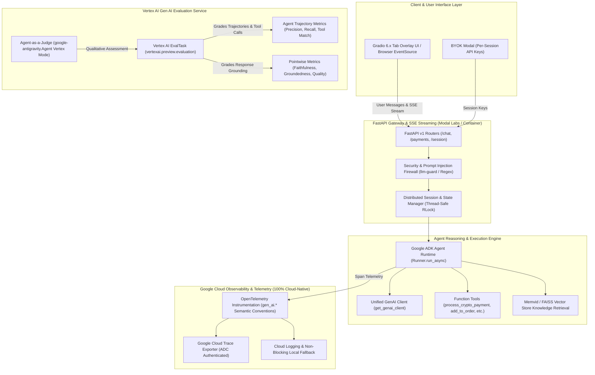
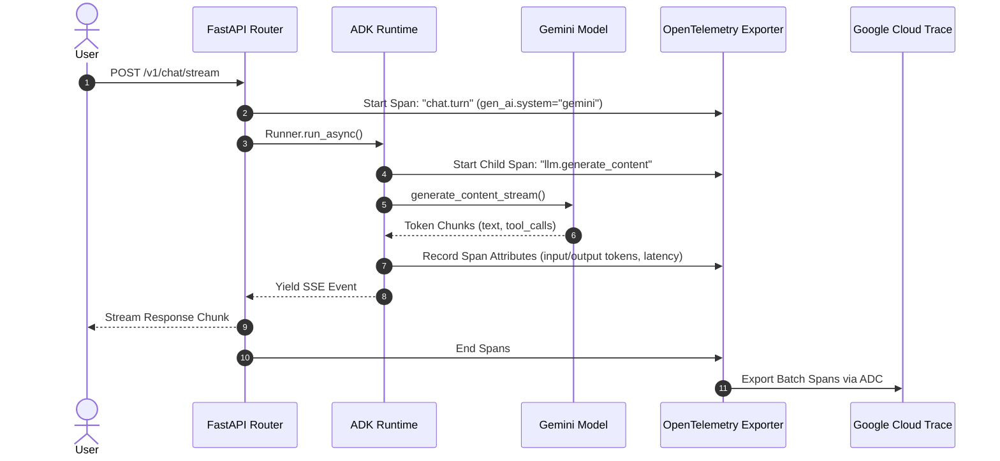
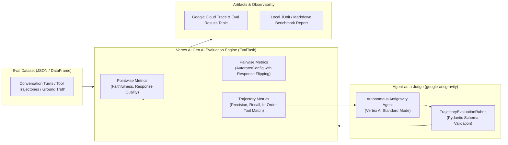

# Technical Design Document: MayaMCP v2.0.0

**Status**: Active  
**Author**: MayaMCP Architecture Team  
**Last Updated**: 2026-08-18  
**Scope**: Full Stack Conversational Bartending Agent, Autonomous State Machine, Google Cloud Observability & Gen AI Evaluation Engine

---

## 1. Executive Summary & Architectural Vision

MayaMCP is a high-concurrency, multimodal AI bartending agent built on the **Google Agent Development Kit (ADK)** and **Google GenAI SDK** (`google-genai`). Maya combines low-latency conversational reasoning (Gemini 3.1 Flash Lite / Gemini 3.7 Flash), memory retrieval (Memvid RAG with FAISS fallback), zero-latency optimistic Web3 stablecoin payments (Coinbase CDP on Base Sepolia), streaming text-to-speech (Cartesia TTS), and a dynamic interactive Gradio UI with real-time bill overlays.

Observability and evaluation infrastructure are **100% cloud-native Google Cloud**, completely deprecating third-party SaaS platforms (Weights & Biases / Weave) and external API tokens (`WANDB_API_KEY`). All telemetry routes through **Google Cloud Trace** via **OpenTelemetry GenAI Semantic Conventions**, and all offline/online evaluation harnesses route through the **Vertex AI Gen AI Evaluation Service** (`vertexai.preview.evaluation` / `EvalTask`) and the **Google Antigravity SDK** (`google-antigravity`) Agent-as-a-Judge pattern running under **Application Default Credentials (ADC)**.

---

## 2. High-Level System Architecture

---

## 3. Component Specifications

### 3.1 Core Architecture (`DS-1`)
- **FastAPI / Modal Gateway**: Exposes asynchronous REST and SSE endpoints (`/v1/chat/stream`, `/v1/payments/process`, `/v1/session/reset`). Utilizes `asyncio.to_thread` for non-blocking stream iteration.
- **State Manager & Distributed Store**: Thread-safe per-session state isolation using `RLock` and snapshot-based eviction. Enforces optimistic payment status transitions (`pending → processing → completed → failed`).
- **Unified GenAI Client**: Centralized instantiation via `get_genai_client` with LRU caching, supporting Vertex AI Standard Mode (`vertex=True`) and Google AI Studio fallback.
- **Multimodal RAG Pipeline**: Primary Memvid video-memory retrieval with automatic fallback to FAISS dense embeddings and ungrounded generation.

### 3.2 Google Cloud Trace & OpenTelemetry Telemetry (`DS-2`)
All interactions, tool calls, and LLM generations generate OpenTelemetry spans conforming to **GenAI Semantic Conventions** and export directly to **Google Cloud Trace**:

#### Standard Span Attributes:
- `gen_ai.system`: `"gemini"` | `"vertex_ai"`
- `gen_ai.request.model`: e.g. `"gemini-3.1-flash-lite"`, `"gemini-3.7-flash"`
- `gen_ai.request.temperature`: float (default `1.0`)
- `gen_ai.request.max_tokens`: integer (default `8192`)
- `gen_ai.usage.input_tokens`: integer
- `gen_ai.usage.output_tokens`: integer
- `gen_ai.response.finish_reasons`: `["STOP"]` | `["MAX_TOKENS"]`
- `session.id`: Maya session UUID
- `bartender.phase`: `"greeting"` | `"ordering"` | `"closing"`

---

## 4. Evaluation Engine: Vertex AI Gen AI Evaluation Service (`DS-3`)

Evaluation suites replace all legacy Weave harnesses with `vertexai.preview.evaluation` and execute via Google Cloud Application Default Credentials (ADC).

### 4.1 Evaluation Modalities

#### A. Pointwise Metrics (Individual Turn Quality & Grounding)
Evaluates response groundedness against drink recipes in RAG context:
$$\text{Faithfulness Score} \in [1, 5], \quad \text{Rubric: Completely Grounded (5) } \to \text{ Severe Hallucination (1)}$$

#### B. Agent Trajectory Evaluation (Tool Calling Sequences)
Evaluates multi-turn bartending workflows (e.g. order additions, crypto payment flows, tip calculations):
- `trajectory_exact_match`: Validates that tools (`add_to_order` $\to$ `process_crypto_payment`) execute in exact sequence.
- `trajectory_precision`: Validates ratio of productive tool actions to extraneous calls.
- `trajectory_recall`: Validates that mandatory payment or tab update tools were called.

#### C. Autonomous Agent-as-a-Judge (`google-antigravity`)
For complex reasoning and edge-case failure analysis (e.g. register malfunction handling for `$99.99` orders), an autonomous Antigravity SDK Agent runs in Vertex AI Standard Mode (`vertex=True`, `model="gemini-3.7-flash"`).

---

## 5. Context Caching & Token Optimization (`DS-4`)

To maximize throughput and minimize evaluation costs:
1. **Implicit Prefix Caching**: Evaluation prompts structure static rubrics, bartender persona instructions, and menu knowledge into a shared $\ge 32\text{k}$ token prefix, triggering Google Cloud's 90% input token discount.
2. **Dynamic Tail Placement**: Per-turn user queries, dynamic tab balances, and active session payloads are placed exclusively at the prompt tail to prevent cache invalidation.
3. **Token Efficiency Metric**:
$$\text{Efficiency} = \frac{\text{Judge Quality Score (1–5)}}{\text{Total Input Tokens (RAG + Prompt)} / 1000}$$

---

## 6. Authentication, Security & Rate Limiting (`DS-5`)

- **Zero-SaaS Credential Policy**: No external tokens (`WANDB_API_KEY`, `WEAVE_API_KEY`) are permitted. All GCP operations require **Application Default Credentials (ADC)** (`gcloud auth application-default login`) or Service Account keys mounted via `GOOGLE_APPLICATION_CREDENTIALS`.
- **Concurrency & Quota Management**: 
  - `GEMINI_TIER=paid`: High concurrency (10–30+ QPS) on Vertex AI endpoints.
  - `GEMINI_TIER=free`: Sequential execution (15 RPM) with exponential backoff via `tenacity`.
- **BYOK Encryption**: User-provided API keys in Gradio UI are encrypted in-memory using Fernet (`MAYA_MASTER_KEY`).
- **Offline Fallback Guard**: Local test runs (`pytest`) execute completely offline without demanding active GCP credentials by injecting native SDK test doubles.
