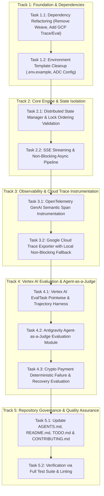

# Implementation Tasks: MayaMCP v2.0.0

**Status**: Active  
**Author**: MayaMCP Architecture Team  
**Last Updated**: 2026-08-18  
**Derived From**: [`design.md`](file:///Users/pretermodernist/Developer/Personal/MayaMCP/.kiro/specs/gcp-genai-evaluation-trace/design.md) & [`requirements.md`](file:///Users/pretermodernist/Developer/Personal/MayaMCP/.kiro/specs/gcp-genai-evaluation-trace/requirements.md)

---

## 1. Track Structure & Execution Roadmap

---

## 2. Detailed Task Breakdown

### Track 1: Foundation & Dependencies
**STATUS**: COMPLETED

#### Task 1.1: Dependency Refactoring (Remove Weave, Add GCP Trace & Eval)
- **ID**: `TASK-1.1`
- **Traceability**: `DS-1`, `DS-3`, `NFR-1`, `NFR-3`
- **Dependencies**: None
- **Description**: Remove `weave>=0.53.0` from [`requirements.txt`](file:///Users/pretermodernist/Developer/Personal/MayaMCP/requirements.txt). Add `google-cloud-aiplatform>=1.70.0`, `google-cloud-trace>=1.11.0`, `opentelemetry-api>=1.20.0`, `opentelemetry-sdk>=1.20.0`, `opentelemetry-exporter-gcp-trace>=1.7.0`, and `pandas>=2.0.0`.

> [!TIP]
> **PARALLEL EXECUTION**: Task 1.2 can execute concurrently with Task 1.1.

#### Task 1.2: Environment Template Cleanup & ADC Configuration
- **ID**: `TASK-1.2`
- **Traceability**: `DS-5`, `NFR-1`, `US-6`
- **Dependencies**: None
- **Description**: Update [`.env.example`](file:///Users/pretermodernist/Developer/Personal/MayaMCP/.env.example) to remove `WANDB_API_KEY`. Add `GCP_PROJECT=` and `GCP_LOCATION=global`. Update `GEMINI_TIER` comments to document Vertex AI quota management.

---

### Track 2: Core Engine & State Isolation
**STATUS**: COMPLETED

#### Task 2.1: Distributed State Manager & Lock Ordering Validation
- **ID**: `TASK-2.1`
- **Traceability**: `DS-1`, `FR-2.1`, `FR-2.2`, `FR-2.3`, `NFR-3`
- **Dependencies**: `TASK-1.1`
- **Description**: Validate that [`src/utils/state_manager.py`](file:///Users/pretermodernist/Developer/Personal/MayaMCP/src/utils/state_manager.py) prevents deadlocks by releasing `_session_locks_mutex` before acquiring session `RLock`. Ensure `completed → failed` transition remains supported for optimistic payments.

#### Task 2.2: SSE Streaming & Non-Blocking Async Pipeline
- **ID**: `TASK-2.2`
- **Traceability**: `DS-1`, `FR-1.1`, `NFR-2.1`, `US-4`
- **Dependencies**: `TASK-2.1`
- **Description**: Verify FastAPI SSE streaming endpoints ([`src/routers/chat.py`](file:///Users/pretermodernist/Developer/Personal/MayaMCP/src/routers/chat.py)) offload synchronous generator iteration via `await asyncio.to_thread(_fetch_next_stream_event, stream)` to prevent blocking the asyncio event loop thread.

---

### Track 3: Observability & Google Cloud Trace Instrumentation
**STATUS**: COMPLETED

> [!TIP]
> **PARALLEL EXECUTION**: Task 3.1 and Task 3.2 can execute in parallel once Track 2 is complete.

#### Task 3.1: OpenTelemetry GenAI Semantic Span Instrumentation
- **ID**: `TASK-3.1`
- **Traceability**: `DS-2`, `FR-5.1`, `US-7`
- **Dependencies**: `TASK-1.1`, `TASK-2.2`
- **Description**: Instrument agent execution and LLM calls with OpenTelemetry spans recording `gen_ai.system`, `gen_ai.request.model`, `gen_ai.request.temperature`, `gen_ai.usage.input_tokens`, and `gen_ai.usage.output_tokens`.

#### Task 3.2: Google Cloud Trace Exporter with Local Non-Blocking Fallback
- **ID**: `TASK-3.2`
- **Traceability**: `DS-2`, `FR-5.2`, `FR-5.3`, `NFR-1.2`, `NFR-3.1`
- **Dependencies**: `TASK-3.1`
- **Description**: Configure `CloudTraceSpanExporter` using ADC. Provide an automatic non-blocking fallback to local Python standard logging if GCP credentials or network access are absent.

---

### Track 4: Vertex AI Evaluation & Agent-as-a-Judge
**STATUS**: COMPLETED

#### Task 4.1: Vertex AI EvalTask Pointwise & Trajectory Harness
- **ID**: `TASK-4.1`
- **Traceability**: `DS-3`, `FR-6.1`, `FR-6.2`, `FR-6.3`, `US-8`
- **Dependencies**: `TASK-1.1`, `TASK-3.2`
- **Description**: Implement evaluation pipeline using `vertexai.preview.evaluation.EvalTask`. Support Pointwise metrics (`faithfulness`, `response_quality`) and Trajectory metrics (`trajectory_precision`, `trajectory_recall`, `trajectory_exact_match`).

#### Task 4.2: Antigravity Agent-as-a-Judge Evaluation Module
- **ID**: `TASK-4.2`
- **Traceability**: `DS-3`, `FR-6.4`, `US-8`
- **Dependencies**: `TASK-4.1`
- **Description**: Implement qualitative evaluation using `google-antigravity.Agent` in Vertex AI Standard Mode (`vertex=True`), scoring reasoning soundness against a Pydantic `TrajectoryEvaluationRubric`.

#### Task 4.3: Crypto Payment Deterministic Failure & Recovery Evaluation
- **ID**: `TASK-4.3`
- **Traceability**: `DS-3`, `FR-3.2`, `FR-6.3`, `US-3`, `US-8`
- **Dependencies**: `TASK-4.2`
- **Description**: Benchmark payment failure recovery when order amount is `$99.99`, verifying Maya correctly apologizes for register malfunction and offers retry.

---

### Track 5: Repository Governance & Quality Assurance
**STATUS**: COMPLETED

> [!TIP]
> **PARALLEL EXECUTION**: Documentation tasks (Task 5.1) can run concurrently with test verification (Task 5.2).

#### Task 5.1: Update AGENTS.md, README.md, TODO.md & CONTRIBUTING.md
- **ID**: `TASK-5.1`
- **Traceability**: `DS-1`, `DS-3`, `NFR-1`, `NFR-3`
- **Dependencies**: `TASK-1.1`, `TASK-1.2`
- **Description**: Remove all remaining Weave / W&B references across [`AGENTS.md`], [`README.md`], [`TODO.md`], and [`CONTRIBUTING.md`]. Document Google Cloud Trace and Vertex AI Evaluation workflows.
- **Status**: COMPLETED

#### Task 5.2: Verification via Full Test Suite & Linting
- **ID**: `TASK-5.2`
- **Traceability**: `NFR-3.1`, `NFR-3.2`
- **Dependencies**: `TASK-5.1`
- **Description**: Execute `pytest -m "not slow"` and `ruff check src/ tests/` to confirm 100% pass rate and clean linting.
- **Status**: COMPLETED
