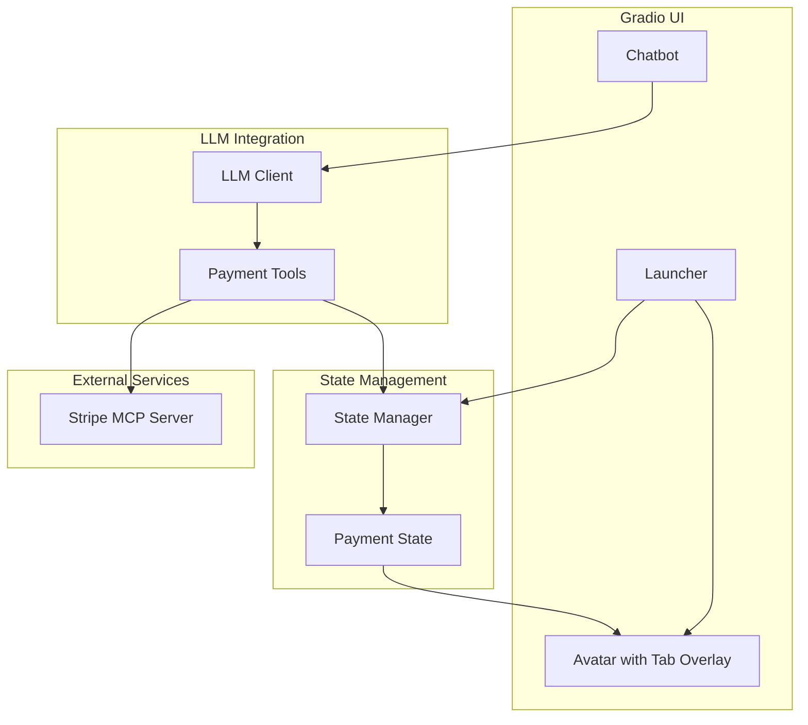

# Design Document: Stripe Payment Integration

## Overview

This design document describes the architecture and implementation approach for integrating Stripe payment functionality into MayaMCP. The feature adds simulated payment processing using Stripe's test mode, a user balance system starting at $1000, and a visual tab overlay on Maya's avatar with animated updates.

The implementation extends the existing state management, LLM tools, and Gradio UI components while integrating with the Stripe MCP server for payment link generation.

## Architecture



### Data Flow

1. User orders a drink via chat
2. LLM invokes `add_to_order_with_balance` tool
3. Tool acquires session lock and checks balance via Payment State
4. If sufficient funds: atomically deduct from balance AND add to tab in single state update
5. If insufficient: return error (no state changes), Maya responds with friendly message
6. Release session lock
7. When user pays: create Stripe payment link via MCP server with idempotency key
8. On payment success: atomically reset tab and mark as paid

### Concurrency and Idempotency

**Session Locking:**
- Each session has a lock to prevent concurrent order modifications
- Lock is acquired before balance check and released after state update
- Prevents race conditions where two orders could both pass balance check

**Atomic State Transitions:**
- Balance deduction and tab addition happen in a single atomic operation
- Payment completion (tab reset + status update) is atomic
- No partial state updates that could corrupt data

**Idempotency Keys:**
- Stripe payment link creation uses session_id + timestamp as idempotency key
- Prevents duplicate payment links if request is retried
- Key format: `{session_id}_{unix_timestamp}`

**Retry Boundaries:**
- Stripe link creation: retry up to 3 times with exponential backoff
- If all retries fail: fall back to mock payment, do not leave session in limbo
- State is only modified after successful Stripe response or fallback decision

## Components and Interfaces

### 1. Payment State Extension (`src/utils/state_manager.py`)

Extend the existing state manager to track user balance and payment status.

```python
import threading
from typing import Dict, Any, Tuple, Optional, MutableMapping

# Session locks for concurrency control (thread-safe access)
# Using regular Dict (NOT WeakValueDictionary) to ensure lock instances persist
# until explicit cleanup - prevents race conditions from premature GC
_session_locks: Dict[str, threading.Lock] = {}
_session_locks_mutex = threading.Lock()  # Protects _session_locks dict

def get_session_lock(session_id: str) -> threading.Lock:
    """Get or create lock for session. Thread-safe via mutex.
    
    Lock instance persists until explicit cleanup via cleanup_session_lock().
    This ensures the same lock instance is always returned for a given session,
    preventing race conditions that could occur with WeakValueDictionary.
    """
    with _session_locks_mutex:
        if session_id not in _session_locks:
            _session_locks[session_id] = threading.Lock()
        return _session_locks[session_id]

def cleanup_session_lock(session_id: str) -> None:
    """Remove session lock when session is invalidated.
    
    MUST be called from reset_session_state() to prevent memory leaks.
    Safe to call even if lock doesn't exist.
    """
    with _session_locks_mutex:
        _session_locks.pop(session_id, None)

def cleanup_expired_session_locks(max_age_seconds: int = 3600) -> int:
    """Background task to clean up locks for sessions inactive > max_age.
    
    Returns: Number of locks cleaned up (for metrics).
    """
    # Implementation tracks last access time per session

# Operational guidance for cleanup_expired_session_locks:
# - Scheduler: Use threading.Timer in app process (simple, no external deps)
# - Frequency: Run every 10 minutes
# - Startup: Register timer on app initialization in main.py
# - Shutdown: Cancel timer gracefully on app shutdown
# - Error handling: Catch all exceptions, log errors, continue (fail-safe)
# - Idempotence: Safe to run concurrently (mutex protects dict)
# - Monitoring: Log cleaned count, emit metric maya_session_locks_cleaned_total
# - Alert: If cleanup fails 3 consecutive times, log critical error

DEFAULT_PAYMENT_STATE = {
    'balance': 1000.00,          # Starting balance
    'tab_total': 0.00,           # Current tab amount
    'stripe_payment_id': None,   # Stripe payment link ID if created
    'payment_status': 'pending', # pending, processing, completed
    'idempotency_key': None,     # For Stripe request deduplication
    'version': 0,                # Optimistic locking version
    'needs_reconciliation': False # Flag for manual review
}

def get_payment_state(session_id: str, store: MutableMapping) -> Dict[str, Any]:
    """Get payment state for session."""
    
def atomic_order_update(session_id: str, store: MutableMapping,
                        item_price: float) -> Tuple[bool, str, float]:
    """Atomically check balance, deduct, and add to tab.
    Returns (success, error_code_or_empty, new_balance).
    Acquires session lock internally."""
    
def atomic_payment_complete(session_id: str, store: MutableMapping) -> bool:
    """Atomically reset tab and mark as paid. Returns success."""
    
def check_sufficient_funds(session_id: str, store: MutableMapping, 
                           amount: float) -> Tuple[bool, float]:
    """Check if user has sufficient balance. Returns (has_funds, current_balance)."""
```

### 2. Payment Tools (`src/llm/tools.py`)

Extend existing tools with balance-aware ordering and Stripe integration.

**Session Context:** Tools receive session_id implicitly from the LLM execution context via the `_current_session` thread-local variable set by the conversation processor before tool invocation.

**Return Format:** All payment tools return JSON-serializable dicts with structure:
- Success: `{"status": "ok", "result": <payload>}`
- Error: `{"status": "error", "error": "<PaymentError enum name>", "message": "<human readable>"}`

```python
from typing import TypedDict, Literal, Union

class ToolSuccess(TypedDict):
    status: Literal["ok"]
    result: dict

class ToolError(TypedDict):
    status: Literal["error"]
    error: str  # PaymentError enum name as string
    message: str

ToolResponse = Union[ToolSuccess, ToolError]

@tool
def add_to_order_with_balance(item_name: str, modifiers: list[str] = None, 
                               quantity: int = 1) -> ToolResponse:
    """Add item to order if user has sufficient balance.
    
    Session context read implicitly from _current_session thread-local.
    
    Returns:
        Success: {"status": "ok", "result": {"item": str, "new_balance": float, "new_tab": float}}
        Error: {"status": "error", "error": "INSUFFICIENT_FUNDS", "message": "..."}
               {"status": "error", "error": "CONCURRENT_MODIFICATION", "message": "..."}
    """
    
@tool
def get_balance() -> ToolResponse:
    """Return current user balance.
    
    Returns:
        {"status": "ok", "result": {"balance": float, "tab": float}}
    """
    
@tool
def create_stripe_payment() -> ToolResponse:
    """Create Stripe payment link for current tab using MCP server.
    
    Returns:
        Success: {"status": "ok", "result": {"url": str, "payment_id": str, "is_simulated": bool}}
        Error: {"status": "error", "error": "STRIPE_UNAVAILABLE", "message": "..."}
    """
    
@tool
def check_payment_status() -> ToolResponse:
    """Check status of Stripe payment.
    
    Returns:
        Success: {"status": "ok", "result": {"payment_status": str}}  # pending, succeeded, failed, timeout
        Error: {"status": "error", "error": "PAYMENT_FAILED", "message": "..."}
    """
```

### 3. Stripe MCP Integration (`src/payments/stripe_mcp.py`)

New module for Stripe MCP server communication.

```python
class StripeMCPClient:
    """Client for Stripe MCP server operations."""
    
    def __init__(self, test_mode: bool = True):
        """Initialize with test mode enabled by default."""
        
    def generate_idempotency_key(self, session_id: str) -> str:
        """Generate idempotency key: {session_id}_{unix_timestamp}."""
        
    async def create_payment_link(self, amount: float, description: str,
                                   idempotency_key: str,
                                   max_retries: int = 3) -> Dict[str, str]:
        """Create payment link with retry logic.
        Returns {url, payment_id} or raises after max_retries.
        Uses exponential backoff: 1s, 2s, 4s."""
        
    async def check_payment_status(self, payment_id: str) -> str:
        """Check payment status. Returns: pending, succeeded, failed."""
        
    def is_available(self) -> bool:
        """Check if Stripe MCP server is available."""
```

### 4. Tab Overlay Component (`src/ui/tab_overlay.py`)

New component for the animated tab display overlay.

```python
def create_tab_overlay_html(tab_amount: float, balance: float, 
                            prev_tab: float = 0.0, 
                            prev_balance: float = 1000.0) -> str:
    """Generate HTML/CSS for tab overlay with animation.
    
    Args:
        tab_amount: Current tab total
        balance: Current user balance
        prev_tab: Previous tab amount (for animation)
        prev_balance: Previous balance (for animation)
    
    Returns:
        HTML string with embedded CSS and JavaScript for animations
    """
    
def get_balance_color(balance: float) -> str:
    """Return color based on balance level.
    
    Returns:
        '#FFFFFF' for balance >= $50 (normal)
        '#FFA500' for 0 < balance < $50 (low funds)
        '#FF4444' for balance <= $0 (depleted/negative)
    """
```

### 5. UI Integration (`src/ui/launcher.py`)

Modify launcher to include tab overlay on avatar.

```python
def create_avatar_with_overlay(avatar_path: str, tab_amount: float, 
                                balance: float) -> gr.HTML:
    """Create avatar image with tab overlay component."""
```

## Data Models

### Payment State Schema

```python
@dataclass
class PaymentState:
    balance: float = 1000.00
    tab_total: float = 0.00
    stripe_payment_id: Optional[str] = None
    payment_status: Literal['pending', 'processing', 'completed'] = 'pending'
    
@dataclass  
class TabUpdate:
    previous_tab: float
    new_tab: float
    previous_balance: float
    new_balance: float
    item_added: Optional[str] = None
```

### Error Codes

```python
class PaymentError(Enum):
    INSUFFICIENT_FUNDS = "INSUFFICIENT_FUNDS"
    STRIPE_UNAVAILABLE = "STRIPE_UNAVAILABLE"
    PAYMENT_FAILED = "PAYMENT_FAILED"
```


## Correctness Properties

*A property is a characteristic or behavior that should hold true across all valid executions of a system-essentially, a formal statement about what the system should do. Properties serve as the bridge between human-readable specifications and machine-verifiable correctness guarantees.*

**Session Isolation Scope:** All properties below apply per-session. Each user session has isolated state (balance, tab, orders). The system guarantees that operations on session A do not affect session B. Concurrent orders by different users operate on separate state stores and do not interfere with each other.

Based on the acceptance criteria analysis, the following correctness properties must be verified through property-based testing:

### Property 1: Balance Deduction Consistency

*For any* drink order with price P and initial balance B where B >= P, after the order is processed, the new balance SHALL equal B - P exactly.

**Validates: Requirements 1.2**

### Property 2: Tab Accumulation Accuracy

*For any* sequence of drink orders with prices [P1, P2, ..., Pn], the tab total SHALL equal the sum of all prices: sum(P1 + P2 + ... + Pn).

**Validates: Requirements 2.2**

### Property 3: Insufficient Funds Rejection

*For any* drink order with price P and balance B where B < P, the order SHALL be rejected with "INSUFFICIENT_FUNDS" error code, and the balance SHALL remain unchanged at B.

**Validates: Requirements 1.3**

### Property 4: State Preservation on Rejection

*For any* order state S and rejected order due to insufficient funds, the order state after rejection SHALL be identical to S (no items added or removed).

**Validates: Requirements 1.5**

### Property 5: Payment Completion State Reset

*For any* successful payment completion, the tab total SHALL reset to $0.00 and payment status SHALL be "completed".

**Validates: Requirements 3.3**

### Property 6: Animation Queue Length Consistency

*For any* sequence of N item additions to the tab, the animation queue SHALL contain exactly N pending animations before any are executed.

**Note:** Animation timing verification is non-deterministic across environments. The ordering and non-overlap behavior (Requirements 5.3) will be verified via integration tests with mocked timers rather than property-based testing. This property focuses on the deterministic queue length invariant.

**Validates: Requirements 5.3**

### Property 7: Balance Color Selection

*For any* balance value B:
- If B >= 50.00, color SHALL be white (#FFFFFF)
- If 0 < B < 50.00, color SHALL be orange (#FFA500)  
- If B <= 0, color SHALL be red (#FF4444)

Every numeric balance maps to exactly one color with no gaps or overlaps.

**Validates: Requirements 6.3, 6.4**

## Error Handling

### Insufficient Funds

When a user attempts to order a drink they cannot afford:

1. The `add_to_order_with_balance` tool returns `PaymentError.INSUFFICIENT_FUNDS`
2. The order state is preserved (no changes)
3. Maya responds conversationally: "I'm sorry, but that [drink] costs $X and you only have $Y left. Would you like something else?"

### Stripe MCP Unavailable

When the Stripe MCP server is not available:

1. `StripeMCPClient.is_available()` returns `False`
2. System falls back to existing `pay_bill` mock flow
3. Maya informs user: "Our card reader is having issues, but I can still process your payment the old-fashioned way."
4. Log warning for monitoring

### Payment Failure

When Stripe payment fails:

1. `check_payment_status` returns "failed"
2. Tab and balance remain unchanged
3. Maya responds: "It looks like there was an issue with the payment. Would you like to try again?"

### Stripe Link Creation Failure

When Stripe payment link creation fails after retries:

1. `create_payment_link` exhausts 3 retries with exponential backoff
2. System falls back to mock payment flow
3. Session state remains consistent (no partial updates)
4. Log error with idempotency key for debugging
5. Maya informs user payment is being processed alternatively

### Stripe Link Created but State Update Fails

When Stripe link is created but local state update fails:

1. Retry state update 3 times with 500ms backoff (idempotent operation)
2. If retries exhausted: log critical error with payment_id and session_id
3. Mark session as "needs_reconciliation" for manual review
4. Maya responds: "Your payment link is ready, but I'm having trouble updating my records. Please proceed with payment and let me know when done."
5. Alert/log includes: payment_id, session_id, tab_amount, timestamp

### Payment Status Check Timeout

When polling for payment status times out:

1. Hard deadline: 30 seconds total polling time
2. Poll interval: 2 seconds (max 15 attempts)
3. On timeout: return "timeout" status to caller
4. Do NOT modify tab or balance on timeout
5. Maya responds: "I'm still waiting to hear back about your payment. You can check again in a moment or try a different payment method."
6. Log warning with payment_id for manual reconciliation queue

### Concurrent Order Race Condition

Handled via optimistic locking with version checks:

1. Each session state has a `version` field (integer, starts at 0)
2. `atomic_order_update` reads current version, performs check, writes with version+1
3. If version mismatch on write: retry up to 3 times
4. If all retries fail: return "CONCURRENT_MODIFICATION" error
5. Maya responds: "Oops, looks like things got a bit busy. Could you try ordering that again?"

**State Machine Transitions:**

```
IDLE --[order_request]--> CHECKING_BALANCE
CHECKING_BALANCE --[sufficient]--> RESERVING_FUNDS  
CHECKING_BALANCE --[insufficient]--> IDLE (return error)
RESERVING_FUNDS --[version_match]--> FUNDS_RESERVED
RESERVING_FUNDS --[version_mismatch]--> CHECKING_BALANCE (retry)
FUNDS_RESERVED --[commit]--> IDLE (order complete)
```

## Testing Strategy

### Property-Based Testing Framework

The project will use **Hypothesis** for Python property-based testing, which integrates well with pytest.

```python
from hypothesis import given, strategies as st
```

### Test Configuration

- Minimum 100 iterations per property test
- Seed logging for reproducibility
- Timeout of 60 seconds per property

### Property Test Annotations

Each property-based test MUST be annotated with:
```python
# **Feature: stripe-payment, Property {number}: {property_text}**
```

### Unit Tests

Unit tests will cover:
- Tab overlay HTML generation with correct positioning
- Balance color selection function
- Stripe MCP client initialization with test mode
- Payment state initialization to $1000

### Integration Tests

Integration tests will verify:
- End-to-end order flow with balance deduction
- Stripe MCP fallback behavior
- UI state updates after order processing
- Animation queue ordering and non-overlap (with mocked timers)
- Session isolation between concurrent users

### Test File Organization

```
tests/
├── test_payment_state.py      # State management tests
├── test_payment_tools.py      # LLM tool tests  
├── test_stripe_mcp.py         # Stripe integration tests
├── test_tab_overlay.py        # UI component tests
└── test_payment_properties.py # Property-based tests
```
