# API Reference

<cite>
**Referenced Files in This Document**
- [src/llm/client.py](file://src/llm/client.py)
- [src/llm/tools.py](file://src/llm/tools.py)
- [src/llm/prompts.py](file://src/llm/prompts.py)
- [src/rag/pipeline.py](file://src/rag/pipeline.py)
- [src/rag/retrieval.py](file://src/rag/retrieval.py)
- [src/rag/vector_store.py](file://src/rag/vector_store.py)
- [src/utils/state_manager.py](file://src/utils/state_manager.py)
- [src/ui/handlers.py](file://src/ui/handlers.py)
- [src/conversation/processor.py](file://src/conversation/processor.py)
- [src/payments/stripe_mcp.py](file://src/payments/stripe_mcp.py)
- [src/voice/tts.py](file://src/voice/tts.py)
- [src/config/model_config.py](file://src/config/model_config.py)
- [src/config/api_keys.py](file://src/config/api_keys.py)
</cite>

## Table of Contents
1. [Introduction](#introduction)
2. [Project Structure](#project-structure)
3. [Core Components](#core-components)
4. [Architecture Overview](#architecture-overview)
5. [Detailed Component Analysis](#detailed-component-analysis)
6. [Dependency Analysis](#dependency-analysis)
7. [Performance Considerations](#performance-considerations)
8. [Troubleshooting Guide](#troubleshooting-guide)
9. [Conclusion](#conclusion)
10. [Appendices](#appendices)

## Introduction
This document provides comprehensive API documentation for MayaMCP’s public interfaces. It focuses on:
- LLM client API for model configuration, generation parameters, and response formatting
- Tool registration and invocation API for payment processing, order management, and external service integrations
- RAG pipeline API for document retrieval, similarity search, and context enhancement
- State management API for session handling, payment state updates, and conversation context
- UI handler API for event processing, component communication, and user interaction management
- Integration examples showing how APIs work together in typical usage scenarios
- Versioning, backward compatibility, and deprecation policies

## Project Structure
MayaMCP organizes functionality by domain:
- LLM orchestration and tooling: src/llm/*
- RAG pipeline: src/rag/*
- State management: src/utils/state_manager.py
- UI handlers: src/ui/handlers.py
- Conversation processing: src/conversation/processor.py
- Payments: src/payments/stripe_mcp.py
- Voice/TTS: src/voice/tts.py
- Configuration: src/config/*

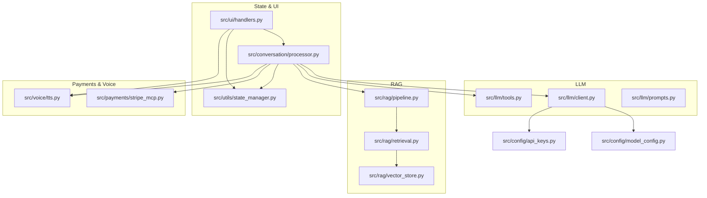

**Diagram sources**
- [src/ui/handlers.py](file://src/ui/handlers.py#L23-L184)
- [src/conversation/processor.py](file://src/conversation/processor.py#L73-L456)
- [src/llm/client.py](file://src/llm/client.py#L47-L129)
- [src/llm/tools.py](file://src/llm/tools.py#L221-L800)
- [src/rag/pipeline.py](file://src/rag/pipeline.py#L60-L105)
- [src/rag/retrieval.py](file://src/rag/retrieval.py#L9-L40)
- [src/rag/vector_store.py](file://src/rag/vector_store.py#L25-L107)
- [src/utils/state_manager.py](file://src/utils/state_manager.py#L394-L529)
- [src/payments/stripe_mcp.py](file://src/payments/stripe_mcp.py#L66-L475)
- [src/voice/tts.py](file://src/voice/tts.py#L112-L200)
- [src/config/model_config.py](file://src/config/model_config.py#L31-L77)
- [src/config/api_keys.py](file://src/config/api_keys.py#L10-L51)

**Section sources**
- [src/ui/handlers.py](file://src/ui/handlers.py#L23-L184)
- [src/conversation/processor.py](file://src/conversation/processor.py#L73-L456)
- [src/llm/client.py](file://src/llm/client.py#L47-L129)
- [src/llm/tools.py](file://src/llm/tools.py#L221-L800)
- [src/rag/pipeline.py](file://src/rag/pipeline.py#L60-L105)
- [src/rag/retrieval.py](file://src/rag/retrieval.py#L9-L40)
- [src/rag/vector_store.py](file://src/rag/vector_store.py#L25-L107)
- [src/utils/state_manager.py](file://src/utils/state_manager.py#L394-L529)
- [src/payments/stripe_mcp.py](file://src/payments/stripe_mcp.py#L66-L475)
- [src/voice/tts.py](file://src/voice/tts.py#L112-L200)
- [src/config/model_config.py](file://src/config/model_config.py#L31-L77)
- [src/config/api_keys.py](file://src/config/api_keys.py#L10-L51)

## Core Components
- LLM client: initializes and calls Gemini via LangChain, supports tool binding and generation parameters
- Tools: payment and order management, menu retrieval, recommendation, and tip management
- RAG pipeline: FAISS-based retrieval and augmentation for casual conversation
- State manager: thread-safe session state, payment state, and optimistic locking
- UI handlers: Gradio event callbacks for input, tip buttons, and clearing state
- Processor: orchestrates LLM/tool calls, security scanning, conversation phases, and optional RAG enhancement
- Payments: Stripe MCP client with availability probing, idempotent link creation, and status polling
- TTS: Cartesia client initialization and audio synthesis with retry and text cleaning
- Config: model/generation parameters and API key management

**Section sources**
- [src/llm/client.py](file://src/llm/client.py#L47-L129)
- [src/llm/tools.py](file://src/llm/tools.py#L221-L800)
- [src/rag/pipeline.py](file://src/rag/pipeline.py#L60-L105)
- [src/utils/state_manager.py](file://src/utils/state_manager.py#L394-L529)
- [src/ui/handlers.py](file://src/ui/handlers.py#L23-L184)
- [src/conversation/processor.py](file://src/conversation/processor.py#L73-L456)
- [src/payments/stripe_mcp.py](file://src/payments/stripe_mcp.py#L66-L475)
- [src/voice/tts.py](file://src/voice/tts.py#L112-L200)
- [src/config/model_config.py](file://src/config/model_config.py#L31-L77)
- [src/config/api_keys.py](file://src/config/api_keys.py#L10-L51)

## Architecture Overview
High-level API interactions across domains:

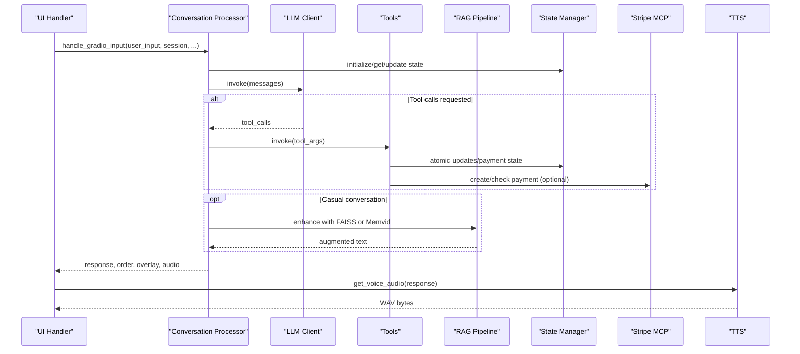

**Diagram sources**
- [src/ui/handlers.py](file://src/ui/handlers.py#L23-L184)
- [src/conversation/processor.py](file://src/conversation/processor.py#L73-L456)
- [src/llm/client.py](file://src/llm/client.py#L91-L129)
- [src/llm/tools.py](file://src/llm/tools.py#L221-L800)
- [src/rag/pipeline.py](file://src/rag/pipeline.py#L60-L105)
- [src/utils/state_manager.py](file://src/utils/state_manager.py#L685-L757)
- [src/payments/stripe_mcp.py](file://src/payments/stripe_mcp.py#L183-L273)
- [src/voice/tts.py](file://src/voice/tts.py#L140-L200)

## Detailed Component Analysis

### LLM Client API
- Purpose: Initialize and call the Gemini LLM, bind tools, and manage generation parameters.
- Key functions:
  - configure_genai(api_key): Configure Google API key globally
  - get_generative_model(model_name): Obtain a GenerativeModel instance
  - build_generate_config(config_dict): Map generation parameters to Gemini format
  - get_model_name(): Read configured model version
  - get_langchain_llm_params(): Build LangChain ChatGoogleGenerativeAI params
  - initialize_llm(api_key, tools=None): Create and optionally bind tools
  - call_gemini_api(prompt_content, config, api_key): Call Gemini with retry and error classification
- Model configuration and generation parameters:
  - Model version, temperature, top_p, top_k, max_output_tokens
  - Environment-driven defaults via model_config
- Error handling:
  - Maps SDK-specific errors to named exceptions
  - Retries with exponential backoff
  - Classifies timeouts, rate limits, and auth failures

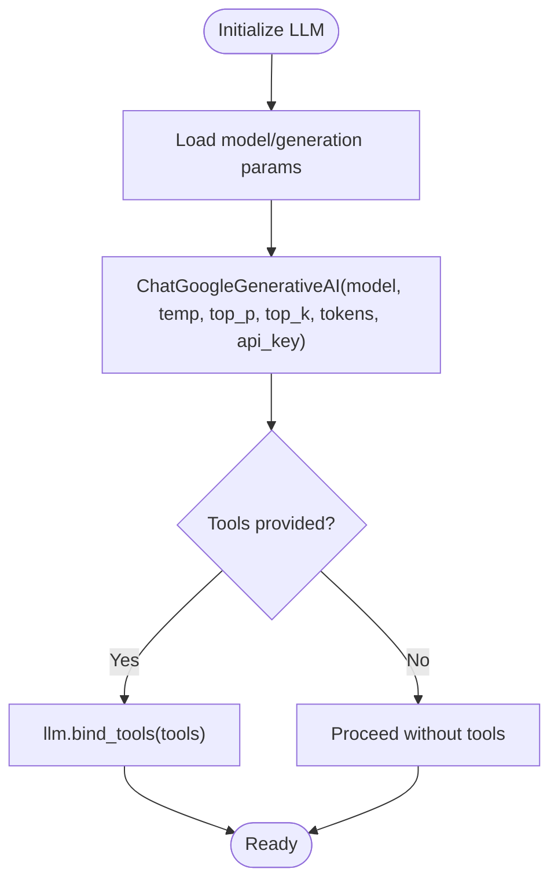

**Diagram sources**
- [src/llm/client.py](file://src/llm/client.py#L91-L129)
- [src/config/model_config.py](file://src/config/model_config.py#L31-L59)

**Section sources**
- [src/llm/client.py](file://src/llm/client.py#L47-L211)
- [src/config/model_config.py](file://src/config/model_config.py#L31-L59)

### Tool Registration and Invocation API
- Purpose: Provide tools for payment, order, menu, and tips; manage session context and state atomically.
- Tool types and parameters:
  - add_to_order_with_balance(item_name, modifiers=None, quantity=1)
  - get_balance()
  - create_stripe_payment()
  - check_payment_status()
  - set_tip(percentage=None)
  - get_tip()
  - get_menu()
  - get_recommendation(preference)
  - add_to_order(item_name, modifiers=None, quantity=1) [backward compatible wrapper]
- Response schemas:
  - Success: {"status": "ok", "result": {...}}
  - Error: {"status": "error", "error": "<Code>", "message": "..."}
- Error codes:
  - INSUFFICIENT_FUNDS, STRIPE_UNAVAILABLE, PAYMENT_FAILED, CONCURRENT_MODIFICATION, NETWORK_ERROR, RATE_LIMITED, INVALID_SESSION, ITEM_NOT_FOUND, PAYMENT_TIMEOUT, INVALID_TIP_PERCENTAGE
- Session and state:
  - Thread-local session context via set_current_session/clear_current_session
  - Atomic operations: atomic_order_update, atomic_payment_complete
  - Payment state validation and optimistic locking via version field

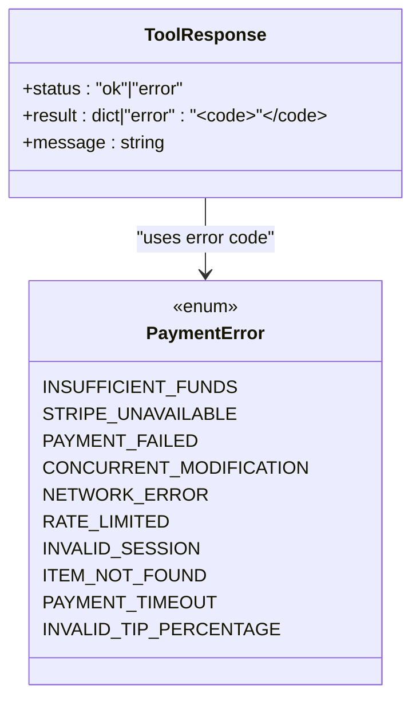

**Diagram sources**
- [src/llm/tools.py](file://src/llm/tools.py#L36-L167)

**Section sources**
- [src/llm/tools.py](file://src/llm/tools.py#L221-L800)
- [src/utils/state_manager.py](file://src/utils/state_manager.py#L685-L757)

### RAG Pipeline API
- Purpose: Retrieve relevant documents and augment LLM responses for casual conversation.
- Key functions:
  - retrieve_relevant_passages(index, documents, query_text, n_results=1)
  - initialize_vector_store(documents=None) -> (faiss.Index, List[str])
  - search_similar_documents(index, documents, query_text, n_results)
  - rag_pipeline(query_text, index, documents, api_key, model_version)
  - generate_augmented_response(query_text, retrieved_documents, api_key, model_version)
- Retrieval flow:
  - FAISS index created from document embeddings
  - Query embedding searched to return top-n relevant documents
  - LLM generates augmented response using retrieved context

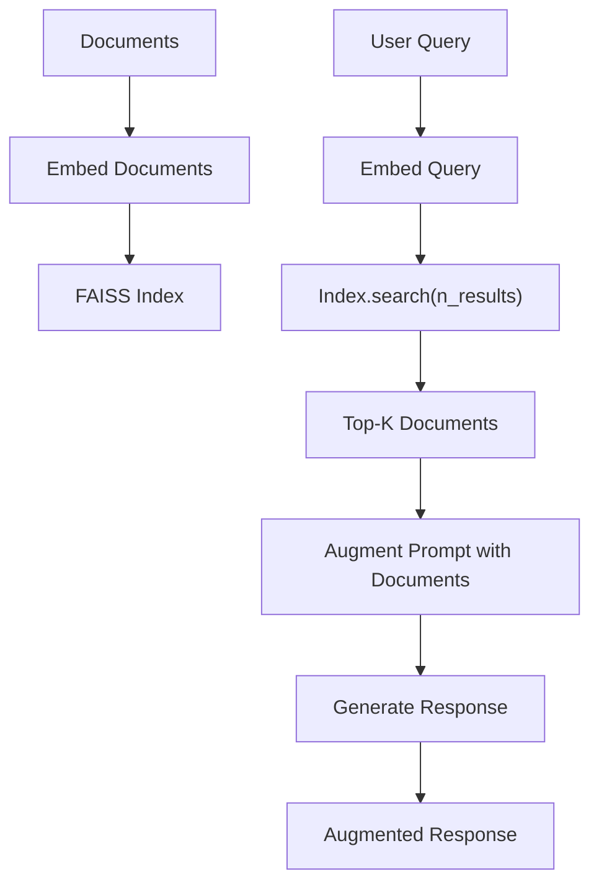

**Diagram sources**
- [src/rag/vector_store.py](file://src/rag/vector_store.py#L25-L107)
- [src/rag/retrieval.py](file://src/rag/retrieval.py#L9-L40)
- [src/rag/pipeline.py](file://src/rag/pipeline.py#L60-L105)

**Section sources**
- [src/rag/retrieval.py](file://src/rag/retrieval.py#L9-L40)
- [src/rag/vector_store.py](file://src/rag/vector_store.py#L25-L107)
- [src/rag/pipeline.py](file://src/rag/pipeline.py#L60-L105)

### State Management API
- Purpose: Manage session state, conversation phases, and payment state with validation and concurrency control.
- Key functions:
  - initialize_state(session_id=None, store=None)
  - get_conversation_state(session_id=None, store=None)
  - get_order_history(session_id=None, store=None)
  - get_current_order_state(session_id=None, store=None)
  - update_conversation_state(...)
  - update_order_state(action_or_session_id, data_or_store, action_or_data=None, data=None)
  - reset_session_state(session_id=None, store=None)
  - is_order_finished(session_id=None, store=None)
  - get_order_total(session_id=None, store=None)
  - set_tip(session_id, store, percentage) -> (tip_amount, total)
  - get_payment_total(session_id, store)
  - get_payment_state(session_id, store)
  - update_payment_state(session_id, store, updates)
  - atomic_order_update(session_id, store, item_price, expected_version=None) -> (success, error_code_or_empty, new_balance)
  - atomic_payment_complete(session_id, store) -> bool
- Data types and validation:
  - PaymentState schema with typed fields and regex patterns
  - Validation of balances, statuses, tip percentages, idempotency keys
  - Status transitions: pending → processing → completed (no backwards)

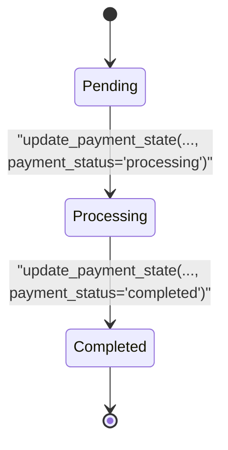

**Diagram sources**
- [src/utils/state_manager.py](file://src/utils/state_manager.py#L17-L58)
- [src/utils/state_manager.py](file://src/utils/state_manager.py#L170-L188)

**Section sources**
- [src/utils/state_manager.py](file://src/utils/state_manager.py#L394-L800)

### UI Handler API
- Purpose: Bridge Gradio events to conversation processing, TTS, and state updates.
- Key functions:
  - handle_gradio_input(user_input, session_history_state, current_tab, current_balance, current_tip_percentage, current_tip_amount, request, llm, cartesia_client=None, rag_index=None, rag_documents=None, rag_retriever=None, api_key=None, app_state=None, avatar_path="assets/bartender_avatar.jpg")
  - clear_chat_state(request, app_state=None)
  - handle_tip_button_click(percentage, current_tip_percentage, current_tab, current_balance, session_history_state, request, llm, cartesia_client=None, rag_index=None, rag_documents=None, rag_retriever=None, api_key=None, app_state=None, avatar_path="assets/bartender_avatar.jpg")
- Event processing:
  - Extract session hash from Gradio request
  - Call process_order, then TTS, then compute overlay HTML with animations
  - Update payment state and avatar based on emotion

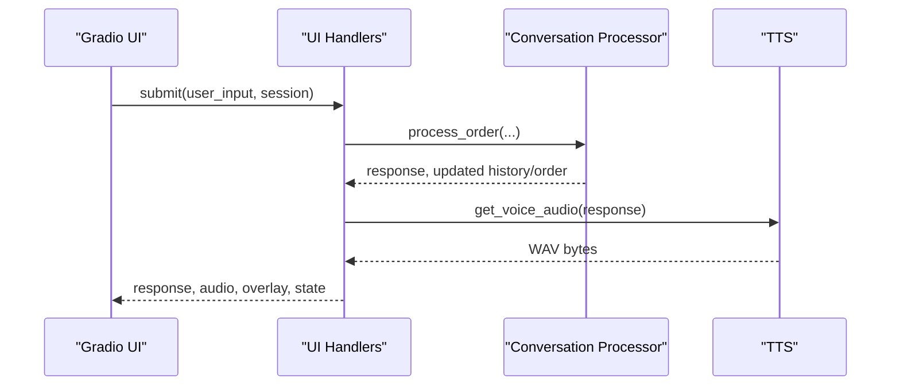

**Diagram sources**
- [src/ui/handlers.py](file://src/ui/handlers.py#L23-L184)
- [src/conversation/processor.py](file://src/conversation/processor.py#L73-L456)
- [src/voice/tts.py](file://src/voice/tts.py#L140-L200)

**Section sources**
- [src/ui/handlers.py](file://src/ui/handlers.py#L23-L392)
- [src/conversation/processor.py](file://src/conversation/processor.py#L73-L456)
- [src/voice/tts.py](file://src/voice/tts.py#L140-L200)

### Payment Integration API (Stripe MCP)
- Purpose: Create idempotent payment links and poll status with fallback to mock payments.
- Key functions:
  - StripeMCPClient.generate_idempotency_key(session_id) -> str
  - StripeMCPClient.is_available() -> bool
  - StripeMCPClient.create_payment_link(amount, description, idempotency_key, max_retries=None) -> Dict[str, str]
  - StripeMCPClient.check_payment_status(payment_id, poll_interval=2.0, poll_timeout=5.0, deadline=30.0) -> str
  - StripeMCPClient.invalidate_availability_cache() -> None
- Behavior:
  - Availability probing with TTL cache
  - Exponential backoff retries with overall timeout
  - Fallback to mock payment when unavailable
  - Status polling with deadlines and timeouts

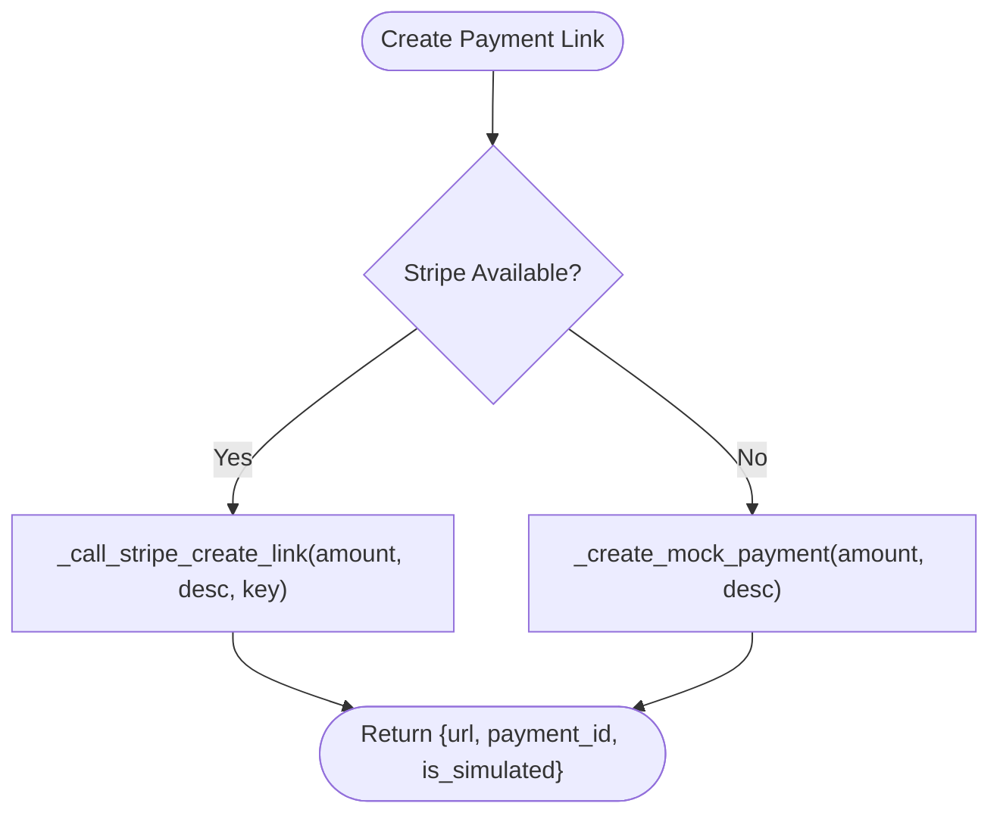

**Diagram sources**
- [src/payments/stripe_mcp.py](file://src/payments/stripe_mcp.py#L183-L273)
- [src/payments/stripe_mcp.py](file://src/payments/stripe_mcp.py#L348-L442)

**Section sources**
- [src/payments/stripe_mcp.py](file://src/payments/stripe_mcp.py#L66-L475)

### Configuration and Authentication
- Model configuration:
  - get_model_config(), get_generation_config(), get_cartesia_config()
  - Environment variables for model version, temperature, tokens, etc.
- API keys:
  - get_api_keys(), validate_api_keys(), get_google_api_key(), get_cartesia_api_key()

**Section sources**
- [src/config/model_config.py](file://src/config/model_config.py#L31-L102)
- [src/config/api_keys.py](file://src/config/api_keys.py#L10-L51)

## Dependency Analysis
- Coupling and cohesion:
  - UI handlers depend on processor, state manager, and TTS
  - Processor depends on LLM client, tools, RAG, state manager, and security helpers
  - Tools depend on state manager and Stripe MCP client
  - RAG pipeline depends on retrieval and vector store
- External dependencies:
  - Google Generative AI, LangChain, FAISS, Cartesia, tenacity retry
- Potential circular dependencies:
  - None observed among core modules; tools import state manager and payments; processor imports tools and state manager

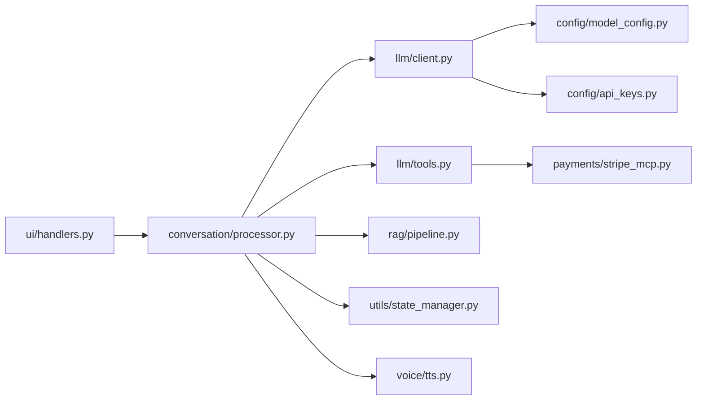

**Diagram sources**
- [src/ui/handlers.py](file://src/ui/handlers.py#L23-L184)
- [src/conversation/processor.py](file://src/conversation/processor.py#L73-L456)
- [src/llm/client.py](file://src/llm/client.py#L47-L129)
- [src/llm/tools.py](file://src/llm/tools.py#L221-L800)
- [src/rag/pipeline.py](file://src/rag/pipeline.py#L60-L105)
- [src/utils/state_manager.py](file://src/utils/state_manager.py#L394-L529)
- [src/payments/stripe_mcp.py](file://src/payments/stripe_mcp.py#L66-L475)
- [src/voice/tts.py](file://src/voice/tts.py#L112-L200)
- [src/config/model_config.py](file://src/config/model_config.py#L31-L77)
- [src/config/api_keys.py](file://src/config/api_keys.py#L10-L51)

**Section sources**
- [src/ui/handlers.py](file://src/ui/handlers.py#L23-L184)
- [src/conversation/processor.py](file://src/conversation/processor.py#L73-L456)
- [src/llm/client.py](file://src/llm/client.py#L47-L129)
- [src/llm/tools.py](file://src/llm/tools.py#L221-L800)
- [src/rag/pipeline.py](file://src/rag/pipeline.py#L60-L105)
- [src/utils/state_manager.py](file://src/utils/state_manager.py#L394-L529)
- [src/payments/stripe_mcp.py](file://src/payments/stripe_mcp.py#L66-L475)
- [src/voice/tts.py](file://src/voice/tts.py#L112-L200)
- [src/config/model_config.py](file://src/config/model_config.py#L31-L77)
- [src/config/api_keys.py](file://src/config/api_keys.py#L10-L51)

## Performance Considerations
- LLM retries: exponential backoff reduces thundering herd and improves resilience
- Vector store: FAISS index initialization and search are O(log n) for search; batch embeddings improve throughput
- Concurrency: thread-safe session locks and optimistic locking minimize contention
- TTS: retryable exceptions and configurable attempts reduce transient failures
- RAG: optional enhancement avoids overhead for non-casual queries

[No sources needed since this section provides general guidance]

## Troubleshooting Guide
- LLM API errors:
  - Rate limit, auth, permission, and timeout errors are classified and logged; consider retry/backoff
- Tool invocation errors:
  - Malformed arguments, missing tools, or runtime exceptions return structured error responses
- Payment failures:
  - Stripe unavailable falls back to mock payment; status polling returns timeout if deadline exceeded
- State validation:
  - PaymentStateValidationError raised for invalid transitions or constraints; inspect validation logs
- TTS failures:
  - Empty audio or initialization errors; verify API key and configuration

**Section sources**
- [src/llm/client.py](file://src/llm/client.py#L170-L208)
- [src/llm/tools.py](file://src/llm/tools.py#L358-L472)
- [src/payments/stripe_mcp.py](file://src/payments/stripe_mcp.py#L348-L442)
- [src/utils/state_manager.py](file://src/utils/state_manager.py#L66-L167)
- [src/voice/tts.py](file://src/voice/tts.py#L133-L200)

## Conclusion
MayaMCP exposes a cohesive set of APIs spanning LLM orchestration, tooling, RAG, state management, UI integration, payments, and voice synthesis. The design emphasizes:
- Clear separation of concerns across modules
- Robust error handling and retries
- Thread-safe state management with validation
- Optional RAG enhancement for conversational contexts
- Idempotent payment operations with fallbacks

[No sources needed since this section summarizes without analyzing specific files]

## Appendices

### API Versioning, Backward Compatibility, and Deprecation
- Backward compatibility:
  - State manager maintains a global store and default session ID for legacy callers
  - Tool wrappers preserve older signatures while leveraging new session-aware functions
  - UI handlers accept optional RAG and TTS components; graceful degradation when absent
- Versioning:
  - No explicit versioned endpoints; semantic versioning applies to releases
- Deprecation policy:
  - Prefer new APIs with session_id and store parameters; legacy overloads remain functional
  - Tool response schemas standardized via TypedDict and enums

**Section sources**
- [src/utils/state_manager.py](file://src/utils/state_manager.py#L307-L331)
- [src/llm/tools.py](file://src/llm/tools.py#L761-L800)
- [src/ui/handlers.py](file://src/ui/handlers.py#L67-L71)

### Integration Examples

#### Typical Order Flow with Payment
- User submits order via UI
- Processor detects intent, invokes add_to_order_with_balance
- Tool performs atomic order update and updates payment state
- User clicks “Pay Bill”
- Tool invokes create_stripe_payment, stores idempotency key and payment_id
- Periodically check_payment_status; on success, atomic_payment_complete resets tab

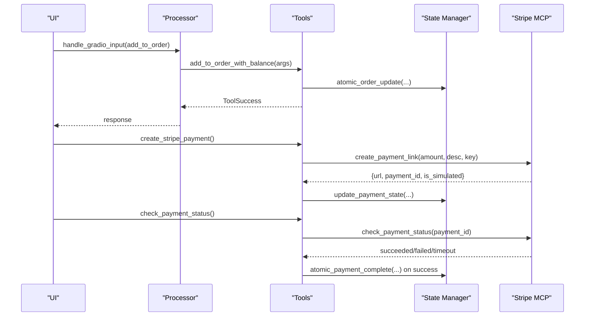

**Diagram sources**
- [src/ui/handlers.py](file://src/ui/handlers.py#L23-L184)
- [src/conversation/processor.py](file://src/conversation/processor.py#L73-L456)
- [src/llm/tools.py](file://src/llm/tools.py#L221-L800)
- [src/utils/state_manager.py](file://src/utils/state_manager.py#L685-L757)
- [src/payments/stripe_mcp.py](file://src/payments/stripe_mcp.py#L183-L273)

#### RAG Enhancement for Casual Conversation
- Processor decides to use RAG based on casual conversation detection
- Retrieves top-k documents via FAISS and augments prompt
- Generates response with enhanced context

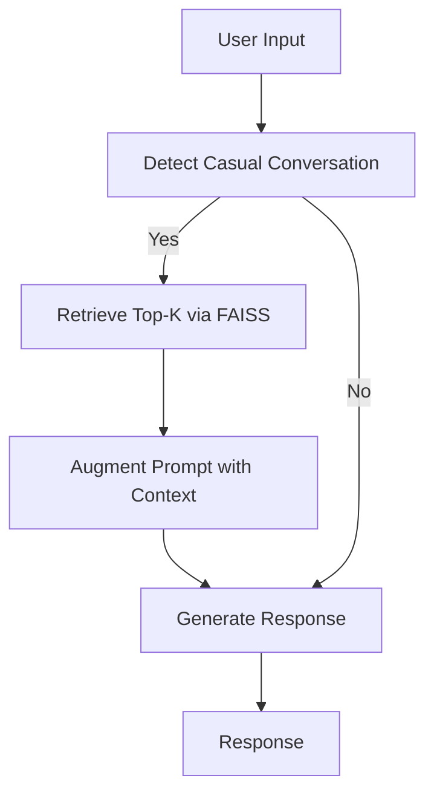

**Diagram sources**
- [src/conversation/processor.py](file://src/conversation/processor.py#L299-L362)
- [src/rag/pipeline.py](file://src/rag/pipeline.py#L60-L105)
- [src/rag/retrieval.py](file://src/rag/retrieval.py#L9-L40)
- [src/rag/vector_store.py](file://src/rag/vector_store.py#L71-L107)