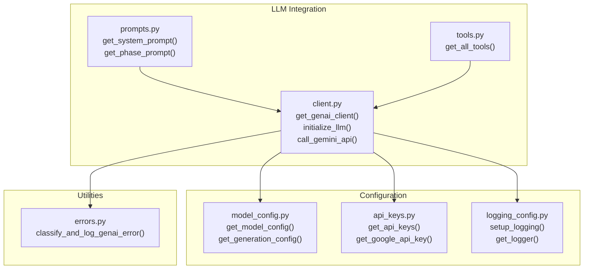
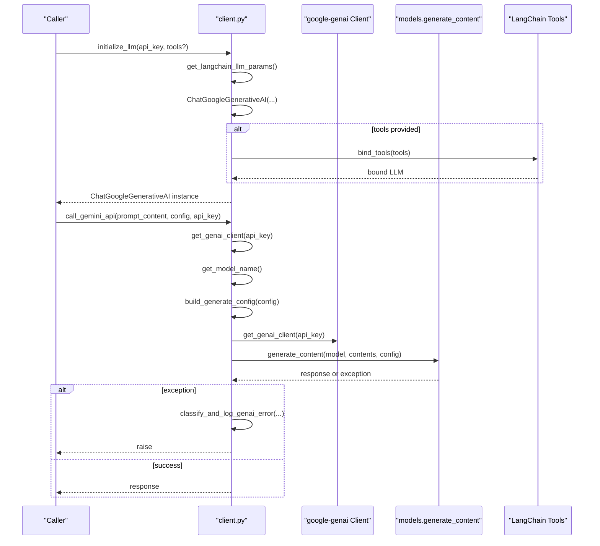
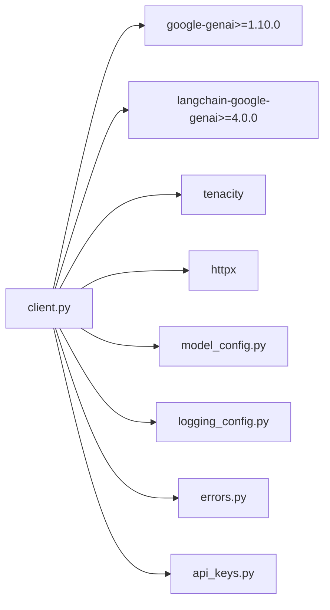

# LLM Client API

<cite>
**Referenced Files in This Document**
- [client.py](file://src/llm/client.py)
- [model_config.py](file://src/config/model_config.py)
- [errors.py](file://src/utils/errors.py)
- [logging_config.py](file://src/config/logging_config.py)
- [api_keys.py](file://src/config/api_keys.py)
- [prompts.py](file://src/llm/prompts.py)
- [tools.py](file://src/llm/tools.py)
- [test_llm_client.py](file://tests/test_llm_client.py)
- [test_model_config.py](file://tests/test_model_config.py)
- [README.md](file://README.md)
- [AGENTS.md](file://AGENTS.md)
- [requirements.txt](file://requirements.txt)
</cite>

## Update Summary
**Changes Made**
- Updated default model configuration from gemini-2.5-flash-lite to gemini-3.0-flash
- Enhanced model validation documentation to reflect new default model
- Updated environment variable documentation to reflect new default model
- Added comprehensive model configuration examples and validation details

## Table of Contents
1. [Introduction](#introduction)
2. [Project Structure](#project-structure)
3. [Core Components](#core-components)
4. [Architecture Overview](#architecture-overview)
5. [Detailed Component Analysis](#detailed-component-analysis)
6. [Dependency Analysis](#dependency-analysis)
7. [Performance Considerations](#performance-considerations)
8. [Troubleshooting Guide](#troubleshooting-guide)
9. [Conclusion](#conclusion)
10. [Appendices](#appendices)

## Introduction
This document provides comprehensive API documentation for the LLM client interface focused on Google Gemini integration using the modern google-genai SDK. It covers authentication and client initialization, model configuration, tool binding for function calling, and the Gemini API call flow with retry logic and error handling. The system has been migrated from the legacy google-generativeai to the unified google-genai SDK v1.10.0+, featuring thread-safe singleton client management with enhanced variable scoping and improved client initialization management.

**Updated** The default model has been updated to Google Gemini 3 Flash (gemini-3.0-flash), providing enhanced performance and capabilities compared to the previous default model.

## Project Structure
The LLM client resides under the llm package and integrates with configuration, logging, and error-handling utilities. The primary entry points for consumers are:
- Singleton client management: get_genai_client() with improved variable scoping
- Initialization and configuration: initialize_llm()
- Model configuration: get_model_name(), get_langchain_llm_params(), build_generate_config()
- API call: call_gemini_api()

**Diagram sources**
- [client.py](file://src/llm/client.py#L51-L217)
- [model_config.py](file://src/config/model_config.py#L31-L59)
- [api_keys.py](file://src/config/api_keys.py#L10-L51)
- [logging_config.py](file://src/config/logging_config.py#L7-L51)
- [errors.py](file://src/utils/errors.py#L11-L39)
- [prompts.py](file://src/llm/prompts.py#L44-L87)
- [tools.py](file://src/llm/tools.py#L4-L12)

**Section sources**
- [client.py](file://src/llm/client.py#L1-L217)
- [model_config.py](file://src/config/model_config.py#L1-L103)
- [api_keys.py](file://src/config/api_keys.py#L1-L51)
- [logging_config.py](file://src/config/logging_config.py#L1-L51)
- [errors.py](file://src/utils/errors.py#L1-L39)
- [prompts.py](file://src/llm/prompts.py#L1-L87)
- [tools.py](file://src/llm/tools.py#L1-L12)

## Core Components
- get_genai_client(api_key): Thread-safe singleton factory for genai.Client with enhanced variable scoping and automatic key rotation support.
- initialize_llm(api_key, tools=None): Builds a ChatGoogleGenerativeAI instance with model parameters from configuration and binds tools if provided.
- call_gemini_api(prompt_content, config, api_key): Calls the genai.Client.models.generate_content() with retry logic and robust error classification.
- Model configuration: get_model_name(), get_langchain_llm_params(), build_generate_config(), get_model_config(), get_generation_config().
- Utilities: classify_and_log_genai_error() for consistent error logging.

**Section sources**
- [client.py](file://src/llm/client.py#L51-L217)
- [model_config.py](file://src/config/model_config.py#L31-L59)
- [errors.py](file://src/utils/errors.py#L11-L39)

## Architecture Overview
The LLM client wraps the unified google-genai SDK and LangChain's ChatGoogleGenerativeAI. It centralizes:
- Thread-safe client management via get_genai_client() with improved variable scoping
- Model selection via get_model_name()
- Generation configuration via build_generate_config()
- Retry and error handling via tenacity and classify_and_log_genai_error()

**Diagram sources**
- [client.py](file://src/llm/client.py#L96-L217)
- [model_config.py](file://src/config/model_config.py#L74-L88)

## Detailed Component Analysis

### get_genai_client(api_key)
Purpose:
- Thread-safe singleton factory for genai.Client with enhanced variable scoping and automatic key rotation support.
- Prevents redundant client creation and ensures proper resource management with improved variable handling.

Behavior:
- Returns cached client if same API key is used.
- Creates new client instance when API key changes.
- Uses threading.Lock for thread safety.
- Supports key rotation without application restart.
- **Enhanced**: Improved variable scoping with proper global variable declarations and local variable assignment handling.

Key points:
- Thread-safe and idempotent with enhanced variable management.
- Automatic cleanup of old clients when key changes.
- Uses global variables _genai_client and _genai_client_key for state management with proper scoping.
- **Updated**: Variable scoping improved to prevent potential namespace conflicts and ensure proper global variable access.

**Section sources**
- [client.py](file://src/llm/client.py#L51-L66)

### initialize_llm(api_key, tools=None)
Purpose:
- Construct a ChatGoogleGenerativeAI instance with parameters from configuration.
- Optionally bind tools for function calling.

Parameters:
- api_key: String; Google API key.
- tools: Optional list; tool definitions for LangChain's bind_tools.

Processing:
- Retrieves parameters via get_langchain_llm_params().
- Creates ChatGoogleGenerativeAI with model, temperature, top_p, top_k, max_output_tokens, and google_api_key.
- If tools provided, calls bind_tools(tools) and logs the number of tools bound.

Error handling:
- Catches exceptions during initialization and re-raises after logging.

Validation:
- Tools are bound via LangChain's tool schema; ensure tools conform to LangChain's tool interface.

**Section sources**
- [client.py](file://src/llm/client.py#L96-L134)
- [model_config.py](file://src/config/model_config.py#L79-L88)

### call_gemini_api(prompt_content, config, api_key)
Purpose:
- Invoke genai.Client.models.generate_content() with retry logic and comprehensive error classification.

Inputs:
- prompt_content: List of message dictionaries suitable for contents.
- config: Dict mapping supported generation parameters.
- api_key: String; Google API key.

Processing:
- Gets singleton client via get_genai_client(api_key).
- Resolves model name via get_model_name().
- Maps config to generation_config via build_generate_config(config).
- Calls client.models.generate_content(model=model_name, contents=prompt_content, config=gen_config).

Retry and error handling:
- Wrapped with tenacity retry: stop_after_attempt(3), wait_exponential(multiplier=1, min=2, max=10), before_sleep logging at WARNING.
- Categorizes and logs errors:
  - Rate limit: GenaiRateLimitError or HTTP 429.
  - Authentication/authorization: GenaiAuthError, GenaiPermissionDeniedError, GenaiUnauthenticatedError, or HTTP 401/403.
  - Timeout: GenaiTimeoutError or TimeoutError or httpx timeout types.
  - Other: classify_and_log_genai_error() for consistent classification.

Returns:
- On success: a GenerateContentResponse object.

**Section sources**
- [client.py](file://src/llm/client.py#L141-L217)
- [errors.py](file://src/utils/errors.py#L11-L39)

### Model Configuration Functions
- get_model_name(): Returns the configured model identifier from get_model_config().
- get_langchain_llm_params(): Returns a dict of parameters for ChatGoogleGenerativeAI construction.
- build_generate_config(config_dict): Maps a user config dict to the GenerateContentConfig used by the SDK.

**Updated** Default Model Configuration:
The system now defaults to Google Gemini 3 Flash (gemini-3.0-flash) as the base model, providing enhanced performance and capabilities compared to the previous default model.

Supported generation parameters:
- temperature: Float
- top_p: Float
- top_k: Integer
- max_output_tokens: Integer

Environment variables:
- GEMINI_MODEL_VERSION: Model identifier (default: gemini-3.0-flash)
- TEMPERATURE: Default 0.7
- MAX_OUTPUT_TOKENS: Default 2048
- top_p: Fixed 0.95
- top_k: Fixed 1

Validation:
- get_known_gemini_models() returns a curated list of known model identifiers including the new default gemini-3.0-flash.
- is_valid_gemini_model(model_name) performs a permissive check and logs warnings without failing.

**Section sources**
- [model_config.py](file://src/config/model_config.py#L31-L103)
- [client.py](file://src/llm/client.py#L69-L93)

### Prompt and Tool Integration
- Prompts: get_system_prompt(), get_phase_prompt(), get_combined_prompt() provide structured system instructions and phase-specific guidance.
- Tools: get_all_tools() exposes tool definitions for function calling; tools.py defines payment and recommendation tools with typed responses and error handling.

**Section sources**
- [prompts.py](file://src/llm/prompts.py#L44-L87)
- [tools.py](file://src/llm/tools.py#L4-L12)

## Dependency Analysis
External dependencies and their roles:
- google-genai>=1.10.0: Unified SDK for Gemini API with improved performance and features.
- langchain-google-genai>=4.0.0: LangChain integration for ChatGoogleGenerativeAI with SDK v4+ compatibility.
- tenacity: Retry logic for API calls.
- httpx: Optional HTTP client for timeout detection.
- typing: Type hints for robust interfaces.

Internal dependencies:
- model_config.py: Provides model and generation parameters.
- logging_config.py: Provides logger instances.
- errors.py: Shared error classification and logging.
- api_keys.py: Loads and validates API keys from environment.

**Diagram sources**
- [client.py](file://src/llm/client.py#L3-L11)
- [model_config.py](file://src/config/model_config.py#L1-L103)
- [logging_config.py](file://src/config/logging_config.py#L1-L51)
- [errors.py](file://src/utils/errors.py#L1-L39)
- [api_keys.py](file://src/config/api_keys.py#L1-L51)
- [requirements.txt](file://requirements.txt#L1-L38)

**Section sources**
- [client.py](file://src/llm/client.py#L3-L11)
- [model_config.py](file://src/config/model_config.py#L1-L103)
- [logging_config.py](file://src/config/logging_config.py#L1-L51)
- [errors.py](file://src/utils/errors.py#L1-L39)
- [api_keys.py](file://src/config/api_keys.py#L1-L51)
- [requirements.txt](file://requirements.txt#L1-L38)

## Performance Considerations
- Thread-safe singleton pattern: get_genai_client() prevents redundant client creation and reduces memory overhead with improved variable scoping.
- Key rotation support: Automatic client recreation when API key changes without application restart.
- Retry strategy: exponential backoff with a capped maximum wait and fixed stop count reduces thundering herd and improves resilience.
- Generation parameters: temperature and top_k influence token distribution; adjust based on desired creativity vs. determinism.
- Token limits: max_output_tokens controls response length; tune to balance cost and quality.
- Concurrency: Thread-safe client management enables safe concurrent usage across multiple threads.
- **Enhanced**: Improved variable scoping reduces potential namespace conflicts and improves memory management efficiency.

## Troubleshooting Guide
Common issues and mitigations:
- Rate limit errors (429): The client detects GenaiRateLimitError and HTTP 429; tenacity retries apply. Mitigation: reduce request rate, increase backoff, or upgrade plan.
- Authentication/authorization errors (401/403): Detected via GenaiAuthError, GenaiPermissionDeniedError, GenaiUnauthenticatedError, or HTTP 401/403. Mitigation: verify API key validity and permissions.
- Timeouts: Detected via GenaiTimeoutError, TimeoutError, or httpx timeout types. Mitigation: increase timeouts, retry with backoff, or offload heavy prompts.
- Generic errors: classify_and_log_genai_error() classifies by message patterns; inspect logs for context.
- SDK version compatibility: Ensure google-genai>=1.10.0 and langchain-google-genai>=4.0.0 are installed.

Operational checks:
- API keys: Ensure GEMINI_API_KEY is set and validated via api_keys.py.
- Model configuration: Confirm GEMINI_MODEL_VERSION is a known identifier; the system warns but continues if unknown.
- Logging: Use setup_logging() to control verbosity; debug-level logs show detailed call traces.
- Client state: Monitor for proper singleton behavior and key rotation when changing API keys.
- **Enhanced**: Variable scoping improvements help prevent client state corruption and improve debugging capabilities.

**Section sources**
- [client.py](file://src/llm/client.py#L175-L217)
- [errors.py](file://src/utils/errors.py#L11-L39)
- [api_keys.py](file://src/config/api_keys.py#L10-L51)
- [model_config.py](file://src/config/model_config.py#L89-L103)
- [logging_config.py](file://src/config/logging_config.py#L7-L51)

## Conclusion
The LLM client API provides a unified, resilient interface to Google Gemini using the modern google-genai SDK with strong configuration, thread-safe singleton client management with enhanced variable scoping, tool binding, and error handling. The migration to the unified SDK enhances performance and reliability while maintaining backward compatibility for existing integrations. The recent improvements to variable scoping in the client management system further enhance reliability and prevent potential state corruption issues.

**Updated** The default model configuration has been upgraded to Google Gemini 3 Flash (gemini-3.0-flash), providing enhanced performance and capabilities for improved user experiences.

## Appendices

### API Reference

- get_genai_client(api_key)
  - Purpose: Thread-safe singleton factory for genai.Client with enhanced variable scoping and key rotation support.
  - Parameters: api_key (string)
  - Returns: genai.Client instance
  - Side effects: Creates and caches client instance, supports key rotation with improved variable management.

- initialize_llm(api_key, tools=None)
  - Purpose: Create a ChatGoogleGenerativeAI instance and optionally bind tools.
  - Parameters:
    - api_key (string): Google API key
    - tools (list, optional): Tool definitions for function calling
  - Returns: ChatGoogleGenerativeAI instance
  - Behavior: Logs tool binding status.

- call_gemini_api(prompt_content, config, api_key)
  - Purpose: Call genai.Client.models.generate_content() with retry and error classification.
  - Parameters:
    - prompt_content (list): Message dicts for contents
    - config (dict): Generation parameters
    - api_key (string): Google API key
  - Returns: GenerateContentResponse
  - Exceptions: Propagates rate limit, auth, timeout, and other errors after logging.

- get_model_name()
  - Purpose: Retrieve configured model identifier.
  - Returns: string

- get_langchain_llm_params()
  - Purpose: Build ChatGoogleGenerativeAI constructor parameters.
  - Returns: dict with model, temperature, top_p, top_k, max_output_tokens

- build_generate_config(config_dict)
  - Purpose: Map user config to SDK GenerateContentConfig.
  - Parameters: config_dict (dict)
  - Returns: types.GenerateContentConfig with supported parameters

- get_model_config()
  - Purpose: Load model configuration from environment.
  - Returns: dict with model_version, temperature, max_output_tokens, top_p, top_k

- get_generation_config()
  - Purpose: Extract generation parameters from model config.
  - Returns: dict with temperature, top_p, top_k, max_output_tokens

- classify_and_log_genai_error(e, logger, context)
  - Purpose: Classify and log common GenAI errors consistently.
  - Parameters: exception, logger, context string
  - Returns: None

**Section sources**
- [client.py](file://src/llm/client.py#L51-L217)
- [model_config.py](file://src/config/model_config.py#L31-L59)
- [errors.py](file://src/utils/errors.py#L11-L39)

### Parameter Validation Rules
- Generation parameters:
  - temperature: float; typically 0.0–1.0
  - top_p: float; typically 0.0–1.0
  - top_k: int; typically > 0
  - max_output_tokens: int; typically > 0
- Model validation:
  - get_known_gemini_models() returns a curated list; is_valid_gemini_model() checks membership with a permissive warning-only policy.

**Section sources**
- [model_config.py](file://src/config/model_config.py#L79-L103)
- [client.py](file://src/llm/client.py#L69-L76)

### Error Response Codes and Classification
- Rate limit: 429
- Authentication/Authorization: 401, 403
- Timeout: SDK TimeoutError or httpx timeout types
- Classification: classify_and_log_genai_error() inspects messages and logs accordingly

**Section sources**
- [client.py](file://src/llm/client.py#L175-L217)
- [errors.py](file://src/utils/errors.py#L11-L39)

### Retry Logic Configuration
- Attempts: 3
- Wait: exponential backoff (multiplier=1, min=2, max=10)
- Logging: before_sleep logs at WARNING level
- Reraise: true to propagate exceptions after retries

**Section sources**
- [client.py](file://src/llm/client.py#L135-L140)

### Code Examples (Paths)
- Thread-safe client management with enhanced variable scoping:
  - [get_genai_client(api_key)](file://src/llm/client.py#L51-L66)
- Initialization sequence:
  - [initialize_llm(api_key, tools)](file://src/llm/client.py#L96-L134)
- Tool binding pattern:
  - [bind_tools(tools)](file://src/llm/client.py#L121-L122)
- Error handling strategy:
  - [classify_and_log_genai_error(...)](file://src/utils/errors.py#L11-L39)
- Rate limiting and timeout handling:
  - [call_gemini_api(...) retry and classification](file://src/llm/client.py#L141-L217)

**Section sources**
- [client.py](file://src/llm/client.py#L51-L217)
- [errors.py](file://src/utils/errors.py#L11-L39)

### Environment Variables
- GEMINI_API_KEY: Required for authentication
- GEMINI_MODEL_VERSION: Model identifier (default: gemini-3.0-flash)
- TEMPERATURE: Default 0.7
- MAX_OUTPUT_TOKENS: Default 2048
- CARTESIA_API_KEY: Optional for TTS
- DEBUG: Controls logging level

**Section sources**
- [api_keys.py](file://src/config/api_keys.py#L10-L51)
- [model_config.py](file://src/config/model_config.py#L31-L44)
- [logging_config.py](file://src/config/logging_config.py#L22-L36)
- [README.md](file://README.md#L83-L98)

### SDK Migration Details
**Updated** Migration from google-generativeai to google-genai v1.10.0+

Key changes:
- Import statement: `from google import genai` instead of `from google.generativeai import genai`
- Client instantiation: `genai.Client(api_key=api_key)` instead of `genai.configure(api_key)`
- API call: `client.models.generate_content()` instead of `genai.generate_content()`
- Error handling: Updated error class references for compatibility
- Type imports: `from google.genai import types` for GenerateContentConfig
- **Enhanced**: Improved variable scoping in client management functions

**Section sources**
- [client.py](file://src/llm/client.py#L7-L8)
- [requirements.txt](file://requirements.txt#L1-L2)

### Enhanced Variable Scoping Improvements
**Updated** Recent enhancements to get_genai_client function

The get_genai_client function has been enhanced with improved variable scoping:

- **Proper Global Declaration**: The function now properly declares `_genai_client` and `_genai_client_key` as global variables before use.
- **Local Variable Assignment**: The function assigns the local variable `local_client = _genai_client` after acquiring the lock, ensuring proper reference handling.
- **Thread Safety**: The enhanced scoping prevents potential namespace conflicts and ensures thread-safe access to global client state.
- **Memory Management**: Improved variable handling reduces the risk of stale references and memory leaks.

These improvements enhance the reliability of the singleton client pattern and prevent potential state corruption issues in multi-threaded environments.

**Section sources**
- [client.py](file://src/llm/client.py#L57-L66)
- [test_llm_client.py](file://tests/test_llm_client.py#L23-L60)

### Model Configuration Details
**Updated** Default Model Configuration

The system now defaults to Google Gemini 3 Flash (gemini-3.0-flash) as the base model, providing enhanced performance and capabilities:

- **Default Model**: gemini-3.0-flash
- **Model Capabilities**: Enhanced reasoning, multimodal support, and improved safety features
- **Performance**: Optimized for faster response times and better cost efficiency
- **Compatibility**: Maintains full backward compatibility with existing configurations

Model validation and configuration:
- The get_model_config() function returns gemini-3.0-flash as the default when GEMINI_MODEL_VERSION is not set
- get_known_gemini_models() includes gemini-3.0-flash in the supported model list
- Model validation provides warnings for unknown models but continues operation
- Environment variable override allows easy model switching for testing and production

**Section sources**
- [model_config.py](file://src/config/model_config.py#L38-L44)
- [model_config.py](file://src/config/model_config.py#L80-L88)
- [test_model_config.py](file://tests/test_model_config.py#L139-L151)
- [README.md](file://README.md#L48-L51)