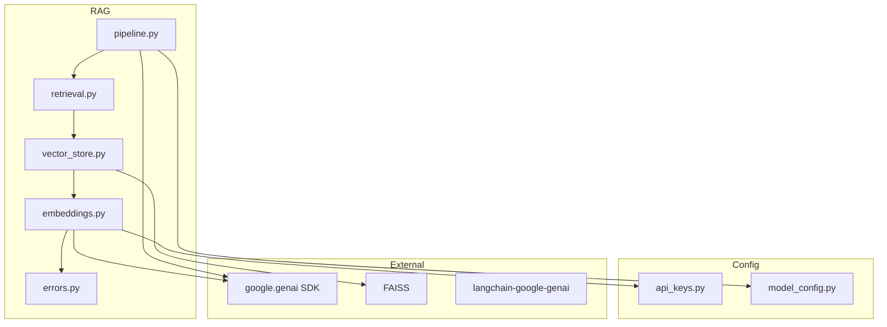
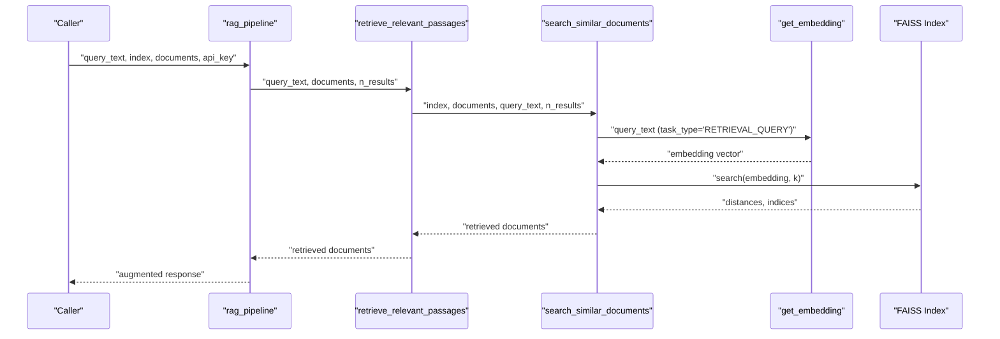
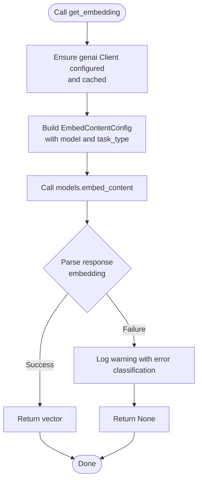
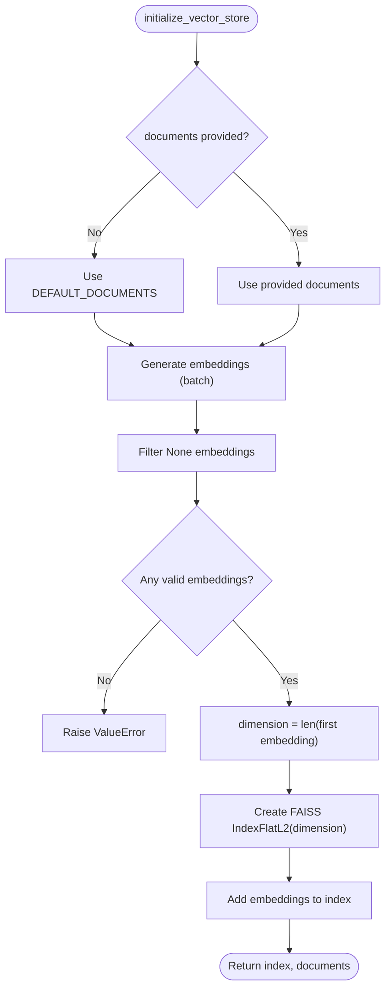
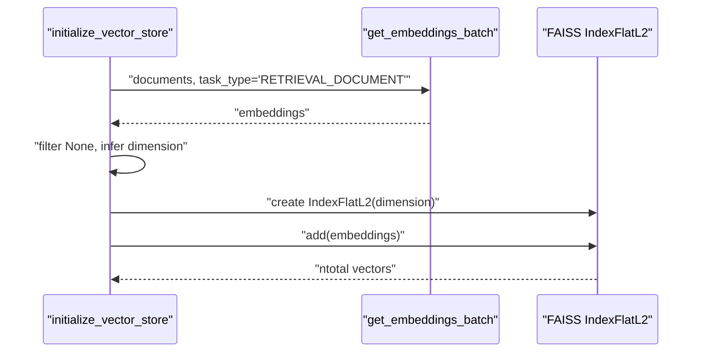
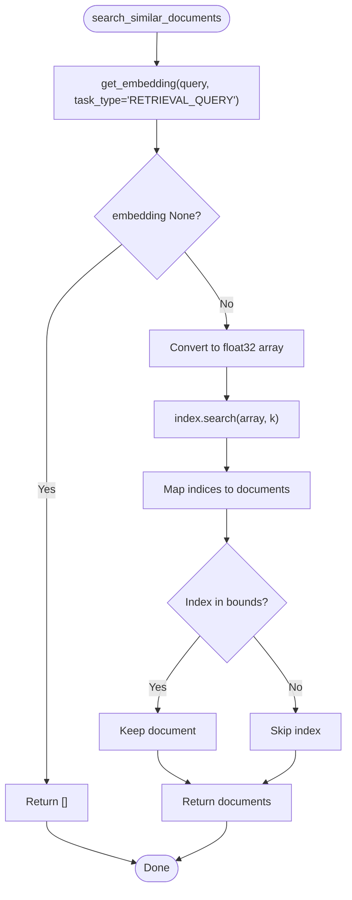
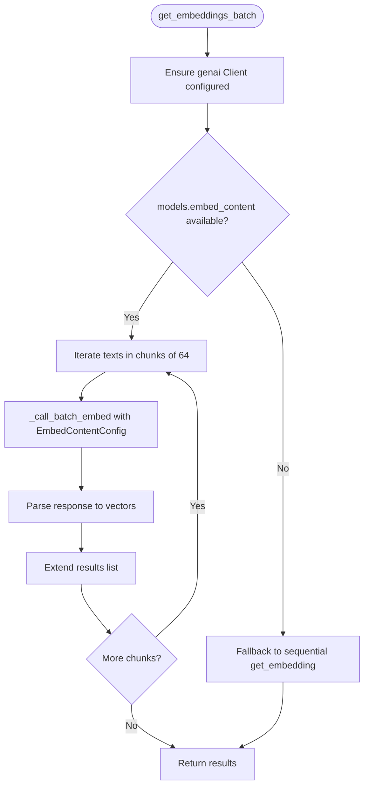
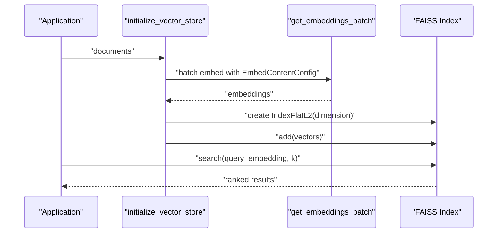
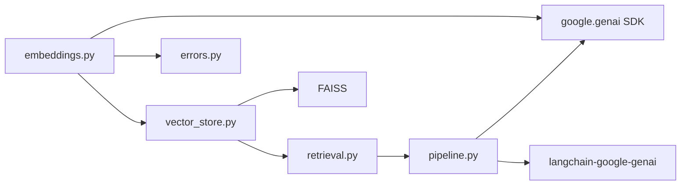

# FAISS Vector Store API

<cite>
**Referenced Files in This Document**
- [vector_store.py](file://src/rag/vector_store.py)
- [embeddings.py](file://src/rag/embeddings.py)
- [retrieval.py](file://src/rag/retrieval.py)
- [pipeline.py](file://src/rag/pipeline.py)
- [test_vector_store.py](file://tests/test_vector_store.py)
- [test_embeddings.py](file://tests/test_embeddings.py)
- [test_retrieval.py](file://tests/test_retrieval.py)
- [api_keys.py](file://src/config/api_keys.py)
- [model_config.py](file://src/config/model_config.py)
- [client.py](file://src/llm/client.py)
- [errors.py](file://src/utils/errors.py)
</cite>

## Update Summary
**Changes Made**
- Updated embedding generation to use google-genai SDK instead of google-generativeai
- Modified embedding generation logic to use client.models.embed_content() method
- Enhanced error handling and response parsing with improved exception classification
- Updated model configuration from text-embedding-004 to gemini-embedding-001
- Integrated new google.genai.types.EmbedContentConfig for structured embedding requests

## Table of Contents
1. [Introduction](#introduction)
2. [Project Structure](#project-structure)
3. [Core Components](#core-components)
4. [Architecture Overview](#architecture-overview)
5. [Detailed Component Analysis](#detailed-component-analysis)
6. [Dependency Analysis](#dependency-analysis)
7. [Performance Considerations](#performance-considerations)
8. [Troubleshooting Guide](#troubleshooting-guide)
9. [Conclusion](#conclusion)
10. [Appendices](#appendices)

## Introduction
This document describes the FAISS vector store API implemented in the MayaMCP project. It focuses on similarity search and document indexing, covering embedding generation, vector dimension configuration, similarity calculation, index creation and storage, retrieval operations (k-nearest neighbor search), and practical guidance for batch processing, memory optimization, performance tuning, and result ranking. It also provides examples of end-to-end workflows and guidance on embedding quality assessment and similarity metric selection.

**Updated** Migrated from google-generativeai to google-genai SDK with enhanced error handling and structured embedding configurations.

## Project Structure
The FAISS vector store API resides under the RAG module and integrates with embedding generation and retrieval orchestration:

- Embedding generation: [embeddings.py](file://src/rag/embeddings.py)
- FAISS index creation and retrieval: [vector_store.py](file://src/rag/vector_store.py)
- Retrieval orchestration: [retrieval.py](file://src/rag/retrieval.py)
- Full RAG pipeline: [pipeline.py](file://src/rag/pipeline.py)
- Configuration and API keys: [api_keys.py](file://src/config/api_keys.py), [model_config.py](file://src/config/model_config.py)
- Error handling utilities: [errors.py](file://src/utils/errors.py)
- Unit tests validating behavior: [test_vector_store.py](file://tests/test_vector_store.py), [test_embeddings.py](file://tests/test_embeddings.py), [test_retrieval.py](file://tests/test_retrieval.py)

**Diagram sources**
- [vector_store.py](file://src/rag/vector_store.py#L1-L107)
- [embeddings.py](file://src/rag/embeddings.py#L1-L156)
- [retrieval.py](file://src/rag/retrieval.py#L1-L40)
- [pipeline.py](file://src/rag/pipeline.py#L1-L105)
- [api_keys.py](file://src/config/api_keys.py#L1-L51)
- [model_config.py](file://src/config/model_config.py#L1-L102)
- [errors.py](file://src/utils/errors.py#L1-L39)

**Section sources**
- [vector_store.py](file://src/rag/vector_store.py#L1-L107)
- [embeddings.py](file://src/rag/embeddings.py#L1-L156)
- [retrieval.py](file://src/rag/retrieval.py#L1-L40)
- [pipeline.py](file://src/rag/pipeline.py#L1-L105)
- [api_keys.py](file://src/config/api_keys.py#L1-L51)
- [model_config.py](file://src/config/model_config.py#L1-L102)
- [errors.py](file://src/utils/errors.py#L1-L39)

## Core Components
- Embedding generation:
  - Single embedding: [get_embedding](file://src/rag/embeddings.py#L60-L89)
  - Batch embedding: [get_embeddings_batch](file://src/rag/embeddings.py#L107-L156)
  - Task-type forwarding for document/query embeddings using google.genai.types.EmbedContentConfig
  - Automatic API key configuration and caching
  - Enhanced error handling with classify_and_log_genai_error utility
- FAISS index operations:
  - Index initialization and storage: [initialize_vector_store](file://src/rag/vector_store.py#L25-L69)
  - Similarity search: [search_similar_documents](file://src/rag/vector_store.py#L71-L107)
- Retrieval orchestration:
  - [retrieve_relevant_passages](file://src/rag/retrieval.py#L9-L36)
- Full pipeline:
  - [rag_pipeline](file://src/rag/pipeline.py#L60-L105)

Key behaviors validated by unit tests:
- Embedding parsing across multiple response formats
- Batch processing with chunking and retry
- Index dimension derived from embeddings
- Query embedding failure handling and graceful fallback
- Out-of-bounds index handling during retrieval
- Enhanced error classification and logging

**Section sources**
- [embeddings.py](file://src/rag/embeddings.py#L60-L156)
- [vector_store.py](file://src/rag/vector_store.py#L25-L107)
- [retrieval.py](file://src/rag/retrieval.py#L9-L36)
- [pipeline.py](file://src/rag/pipeline.py#L60-L105)
- [test_embeddings.py](file://tests/test_embeddings.py#L1-L70)
- [test_vector_store.py](file://tests/test_vector_store.py#L1-L318)
- [test_retrieval.py](file://tests/test_retrieval.py#L1-L374)

## Architecture Overview
The system follows a clear separation of concerns:
- Embedding generation uses the google.genai SDK with robust retry and parsing logic.
- FAISS stores dense vectors and supports L2-squared distance search via IndexFlatL2.
- Retrieval wraps FAISS search and maps indices back to original documents.
- The pipeline composes retrieval with LLM generation for augmented responses.

**Updated** Migration to google.genai SDK provides improved stability and structured configuration through EmbedContentConfig.

**Diagram sources**
- [pipeline.py](file://src/rag/pipeline.py#L60-L105)
- [retrieval.py](file://src/rag/retrieval.py#L9-L36)
- [vector_store.py](file://src/rag/vector_store.py#L71-L107)
- [embeddings.py](file://src/rag/embeddings.py#L60-L89)

## Detailed Component Analysis

### Embedding Generation Functions
- Purpose: Convert text to dense vectors using the google.genai Embedding API.
- Key features:
  - Automatic API key configuration and caching to avoid repeated setup.
  - Robust parsing of diverse response shapes (.embedding.values, lists, dicts).
  - Batch processing with configurable chunk size and retry/backoff.
  - Task-type differentiation for document vs query embeddings using google.genai.types.EmbedContentConfig.
  - Enhanced error handling with classify_and_log_genai_error utility.
- Important paths:
  - Single embedding: [get_embedding](file://src/rag/embeddings.py#L60-L89)
  - Batch embedding: [get_embeddings_batch](file://src/rag/embeddings.py#L107-L156)
  - API key provider: [get_google_api_key](file://src/config/api_keys.py#L45-L51)

**Updated** Migration to google.genai SDK with structured EmbedContentConfig for better API compatibility and error handling.

**Diagram sources**
- [embeddings.py](file://src/rag/embeddings.py#L60-L89)
- [errors.py](file://src/utils/errors.py#L11-L39)

**Section sources**
- [embeddings.py](file://src/rag/embeddings.py#L60-L156)
- [api_keys.py](file://src/config/api_keys.py#L45-L51)
- [errors.py](file://src/utils/errors.py#L11-L39)
- [test_embeddings.py](file://tests/test_embeddings.py#L1-L70)

### Vector Dimension Configuration
- The FAISS index dimension is inferred from the first valid embedding's length during index initialization.
- The system filters out failed embeddings and raises an error if none succeed.
- Index type used: Flat index with L2 distance (IndexFlatL2).

**Diagram sources**
- [vector_store.py](file://src/rag/vector_store.py#L25-L69)

**Section sources**
- [vector_store.py](file://src/rag/vector_store.py#L25-L69)

### Similarity Calculation Methods and Index Creation
- Similarity metric: L2-squared distance via FAISS IndexFlatL2.
- Index creation:
  - Embeddings are converted to float32 NumPy arrays.
  - FAISS index is instantiated with inferred dimension.
  - Vectors are added to the index.
- Retrieval:
  - Query text is embedded with task type for queries.
  - FAISS search returns distances and indices for top-k results.
  - Indices are mapped back to original documents with bounds checks.

**Diagram sources**
- [vector_store.py](file://src/rag/vector_store.py#L25-L69)
- [embeddings.py](file://src/rag/embeddings.py#L107-L156)

**Section sources**
- [vector_store.py](file://src/rag/vector_store.py#L25-L107)

### Retrieval Operations: k-NN Search and Distance Threshold Filtering
- k-NN search:
  - Query embedding is generated and converted to float32 array.
  - FAISS search is invoked with requested k.
  - Retrieved documents are mapped from indices to the original document list.
- Distance threshold filtering:
  - The current implementation returns top-k results without explicit distance threshold filtering.
  - To apply a distance threshold, post-process the returned distances and filter indices accordingly.

**Diagram sources**
- [vector_store.py](file://src/rag/vector_store.py#L71-L107)

**Section sources**
- [vector_store.py](file://src/rag/vector_store.py#L71-L107)
- [test_vector_store.py](file://tests/test_vector_store.py#L149-L290)

### Embedding Model Configuration and Batch Processing
- Model: gemini-embedding-001 (updated from text-embedding-004).
- Batch size: 64.
- Batch fallback: If the batch API is unavailable, the implementation falls back to sequential calls.
- Retry logic: Exponential backoff with tenacity for both single and batch calls.
- Enhanced error handling: Structured exception classification and logging.

**Updated** Model configuration updated to gemini-embedding-001 with improved error handling through classify_and_log_genai_error utility.

**Diagram sources**
- [embeddings.py](file://src/rag/embeddings.py#L107-L156)

**Section sources**
- [embeddings.py](file://src/rag/embeddings.py#L107-L156)
- [test_embeddings.py](file://tests/test_embeddings.py#L1-L70)

### Memory Optimization Techniques
- Embedding dtype: float32 stored in FAISS to reduce memory footprint.
- Batch processing reduces API overhead and latency.
- API key configuration caching avoids repeated setup calls.
- IndexFlatL2 is lightweight and fast for moderate-scale retrieval.
- Enhanced error handling reduces unnecessary retries and resource consumption.

**Updated** Improved error handling reduces resource waste from failed API calls.

**Section sources**
- [vector_store.py](file://src/rag/vector_store.py#L58-L65)
- [embeddings.py](file://src/rag/embeddings.py#L42-L65)
- [errors.py](file://src/utils/errors.py#L11-L39)

### Examples: Document Indexing Workflows, Query Processing, and Result Ranking
- Document indexing workflow:
  - Prepare documents (or use defaults).
  - Generate embeddings in batches using google.genai SDK.
  - Filter out failed embeddings.
  - Infer dimension and create FAISS index.
  - Add vectors to index.
- Query processing:
  - Embed query with task type for queries using EmbedContentConfig.
  - Perform FAISS search for top-k.
  - Map indices to documents.
- Result ranking:
  - Results are ordered by FAISS distance (ascending L2).
  - To customize ranking, adjust k or apply distance thresholds post-search.

**Updated** Migration to google.genai SDK provides more reliable embedding generation with structured configuration.

**Diagram sources**
- [vector_store.py](file://src/rag/vector_store.py#L25-L69)
- [embeddings.py](file://src/rag/embeddings.py#L107-L156)

**Section sources**
- [vector_store.py](file://src/rag/vector_store.py#L25-L107)
- [embeddings.py](file://src/rag/embeddings.py#L107-L156)
- [test_vector_store.py](file://tests/test_vector_store.py#L29-L148)

### Incremental Updates and Index Serialization
- Incremental updates:
  - Current implementation initializes the index once and does not expose incremental add/remove operations.
  - To support incremental updates, consider replacing IndexFlatL2 with a scalable index type and implementing add/update/delete routines.
- Index serialization:
  - FAISS provides native serialization APIs to save/load indexes.
  - Integrate FAISS write/read calls around index creation and retrieval to persist the index between runs.

[No sources needed since this section provides general guidance]

## Dependency Analysis
- Internal dependencies:
  - vector_store depends on embeddings for vector generation.
  - retrieval depends on vector_store for search.
  - pipeline depends on retrieval and LLM generation.
  - embeddings depends on google.genai SDK and error handling utilities.
- External dependencies:
  - FAISS for index storage and similarity search.
  - google.genai SDK for embeddings.
  - langchain-google-genai for LLM integration.
  - NumPy for array operations.

**Updated** Added google.genai SDK and langchain-google-genai as external dependencies.

**Diagram sources**
- [vector_store.py](file://src/rag/vector_store.py#L1-L107)
- [embeddings.py](file://src/rag/embeddings.py#L1-L156)
- [retrieval.py](file://src/rag/retrieval.py#L1-L40)
- [pipeline.py](file://src/rag/pipeline.py#L1-L105)
- [errors.py](file://src/utils/errors.py#L1-L39)
- [client.py](file://src/llm/client.py#L1-L217)

**Section sources**
- [vector_store.py](file://src/rag/vector_store.py#L1-L107)
- [embeddings.py](file://src/rag/embeddings.py#L1-L156)
- [retrieval.py](file://src/rag/retrieval.py#L1-L40)
- [pipeline.py](file://src/rag/pipeline.py#L1-L105)
- [errors.py](file://src/utils/errors.py#L1-L39)
- [client.py](file://src/llm/client.py#L1-L217)

## Performance Considerations
- Index type:
  - IndexFlatL2 is suitable for small to medium collections; for large-scale datasets, consider IVF or HNSW indices to improve query latency.
- Batch sizing:
  - Batch size 64 balances throughput and memory usage; adjust based on available RAM and API limits.
- Embedding dtype:
  - Using float32 reduces memory consumption compared to float64.
- Caching:
  - API key configuration caching prevents redundant setup.
- Error handling:
  - Enhanced error classification reduces unnecessary retries and improves overall performance.
- Logging and monitoring:
  - Use logs to track embedding failures, index sizes, and query latencies.

**Updated** Enhanced error handling and logging improve overall system performance and reliability.

[No sources needed since this section provides general guidance]

## Troubleshooting Guide
Common issues and resolutions:
- No valid embeddings generated:
  - Ensure GEMINI_API_KEY is set and valid.
  - Check network connectivity and API quotas.
  - Verify google.genai SDK installation and version compatibility.
- Query embedding fails:
  - The system returns an empty result gracefully; verify API key and retry logic.
  - Check EmbedContentConfig structure and model availability.
- Out-of-bounds indices:
  - The retrieval function filters invalid indices; confirm document list and index alignment.
- Batch API unavailable:
  - The implementation falls back to sequential calls; expect slower throughput.
- SDK compatibility issues:
  - Ensure google.genai SDK version supports EmbedContentConfig and embed_content method.
  - Check for API key format and permissions.

**Updated** Added troubleshooting for google.genai SDK compatibility and EmbedContentConfig issues.

Validation references:
- Embedding parsing and error handling: [test_embeddings.py](file://tests/test_embeddings.py#L1-L70)
- Index initialization and error conditions: [test_vector_store.py](file://tests/test_vector_store.py#L80-L122)
- Retrieval behavior and edge cases: [test_retrieval.py](file://tests/test_retrieval.py#L17-L213)

**Section sources**
- [test_embeddings.py](file://tests/test_embeddings.py#L1-L70)
- [test_vector_store.py](file://tests/test_vector_store.py#L80-L122)
- [test_retrieval.py](file://tests/test_retrieval.py#L17-L213)

## Conclusion
The FAISS vector store API in MayaMCP provides a concise and robust foundation for similarity search and document indexing. It leverages batched embedding generation with the google.genai SDK, flexible task-type configuration using EmbedContentConfig, and FAISS flat index storage with L2 distance. The migration to google.genai SDK enhances reliability through improved error handling, structured configuration, and better API compatibility. While the current implementation emphasizes simplicity and reliability, enhancements such as scalable index types, distance threshold filtering, and incremental updates can further improve scalability and performance for large-scale deployments.

**Updated** The migration to google.genai SDK significantly improves system reliability and maintainability through structured configuration and enhanced error handling.

## Appendices

### API Definitions and Behavior Summary
- Embedding generation
  - Single: [get_embedding](file://src/rag/embeddings.py#L60-L89)
  - Batch: [get_embeddings_batch](file://src/rag/embeddings.py#L107-L156)
- Index operations
  - Initialize: [initialize_vector_store](file://src/rag/vector_store.py#L25-L69)
  - Search: [search_similar_documents](file://src/rag/vector_store.py#L71-L107)
- Retrieval wrapper
  - [retrieve_relevant_passages](file://src/rag/retrieval.py#L9-L36)
- Pipeline
  - [rag_pipeline](file://src/rag/pipeline.py#L60-L105)

**Section sources**
- [embeddings.py](file://src/rag/embeddings.py#L60-L156)
- [vector_store.py](file://src/rag/vector_store.py#L25-L107)
- [retrieval.py](file://src/rag/retrieval.py#L9-L36)
- [pipeline.py](file://src/rag/pipeline.py#L60-L105)

### Migration Details
- SDK Migration: google-generativeai → google.genai
- Method Change: embed_content() → models.embed_content()
- Configuration: EmbedContentConfig replaces direct parameter passing
- Error Handling: Enhanced with classify_and_log_genai_error utility
- Model Update: text-embedding-004 → gemini-embedding-001

**Section sources**
- [embeddings.py](file://src/rag/embeddings.py#L1-L156)
- [errors.py](file://src/utils/errors.py#L1-L39)
- [client.py](file://src/llm/client.py#L1-L217)