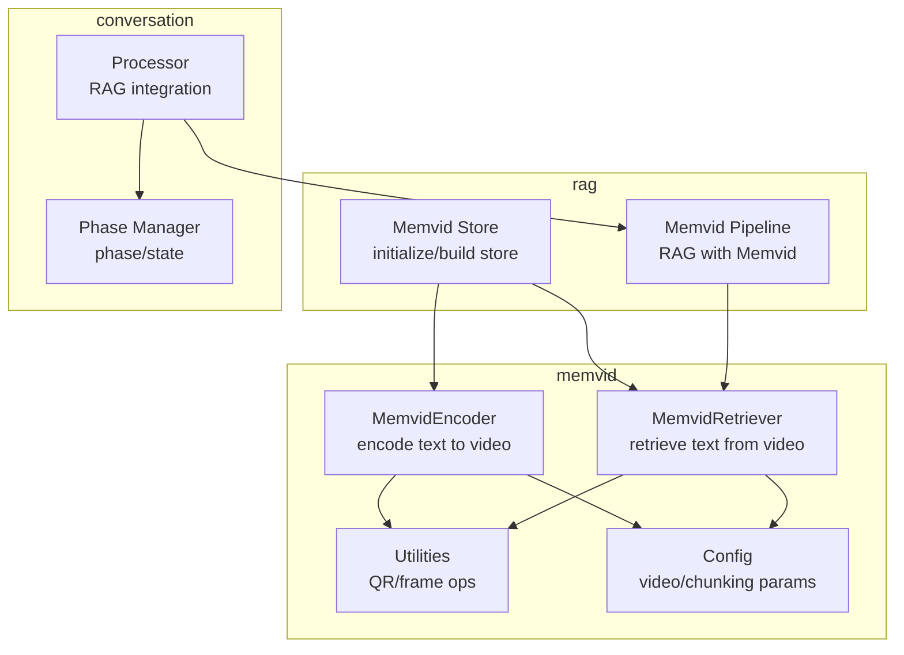
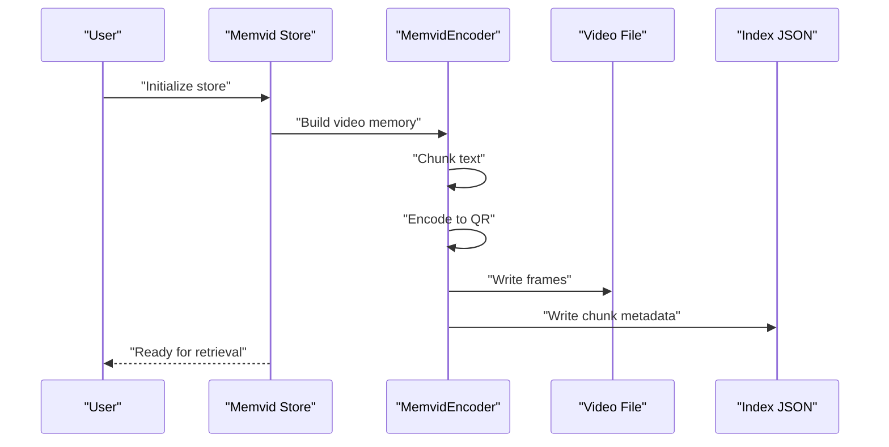
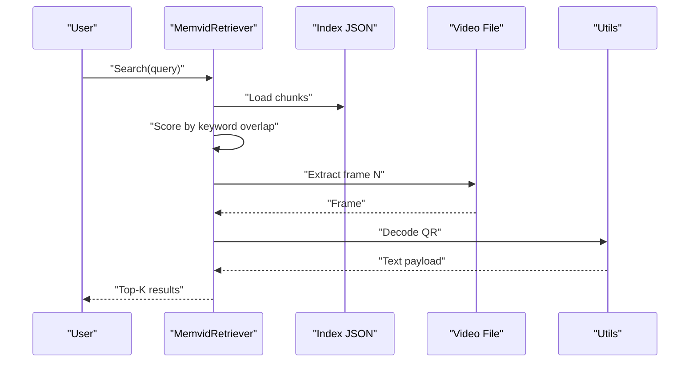
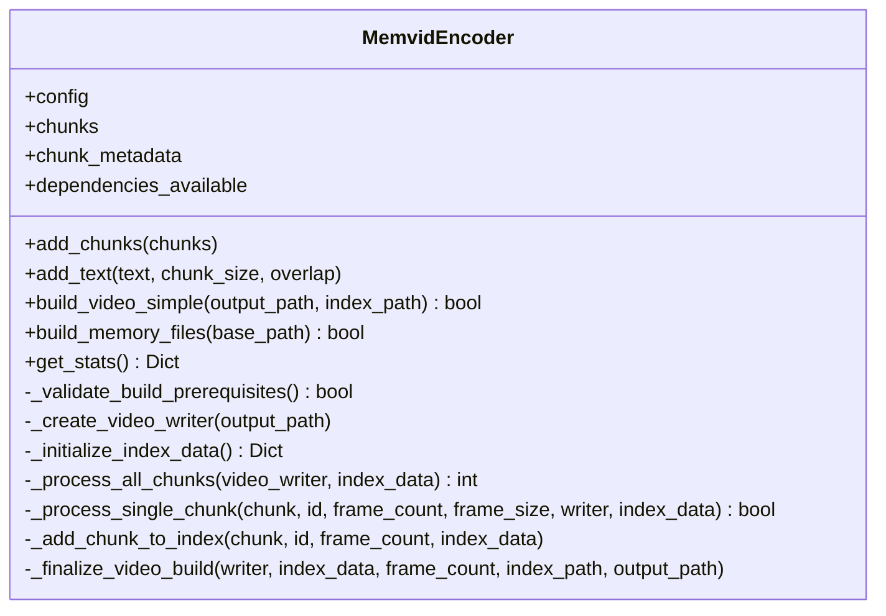
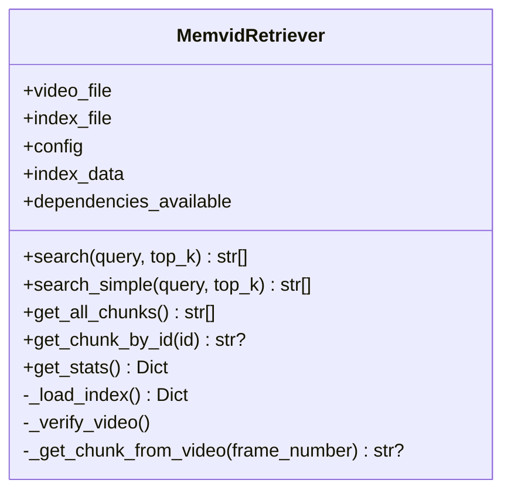
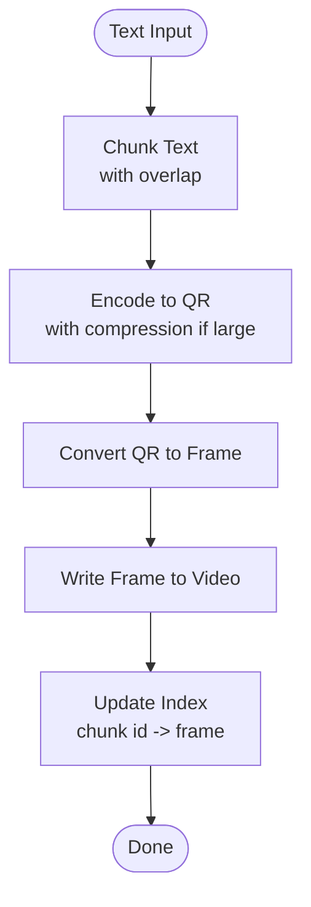
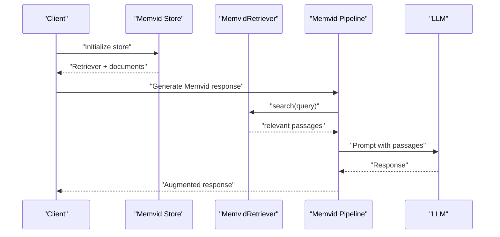
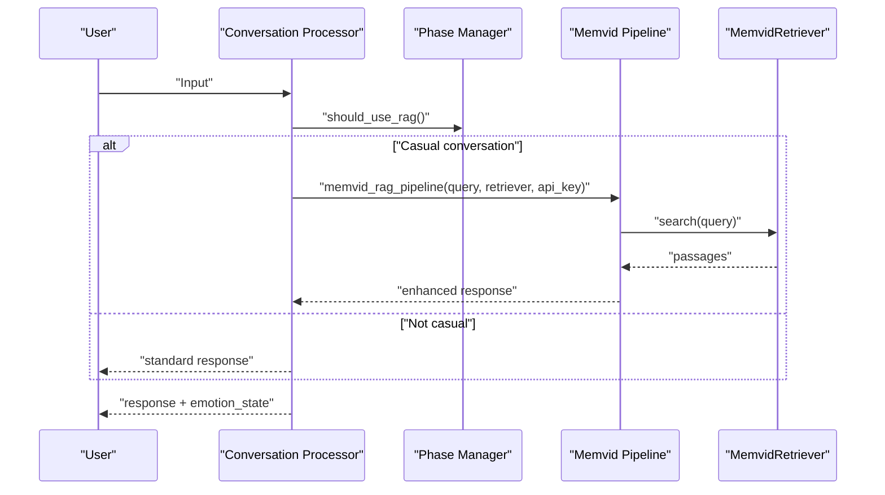
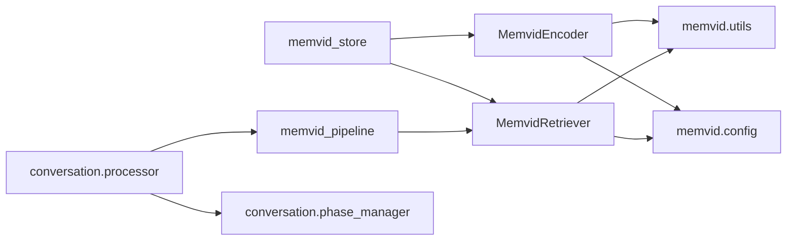

# Memvid Video Memory API

<cite>
**Referenced Files in This Document**
- [src/memvid/__init__.py](file://src/memvid/__init__.py)
- [src/memvid/config.py](file://src/memvid/config.py)
- [src/memvid/encoder.py](file://src/memvid/encoder.py)
- [src/memvid/retriever.py](file://src/memvid/retriever.py)
- [src/memvid/utils.py](file://src/memvid/utils.py)
- [src/rag/memvid_store.py](file://src/rag/memvid_store.py)
- [src/rag/memvid_pipeline.py](file://src/rag/memvid_pipeline.py)
- [src/conversation/processor.py](file://src/conversation/processor.py)
- [src/conversation/phase_manager.py](file://src/conversation/phase_manager.py)
- [tests/test_memvid.py](file://tests/test_memvid.py)
- [tests/test_memvid_retriever.py](file://tests/test_memvid_retriever.py)
</cite>

## Table of Contents
1. [Introduction](#introduction)
2. [Project Structure](#project-structure)
3. [Core Components](#core-components)
4. [Architecture Overview](#architecture-overview)
5. [Detailed Component Analysis](#detailed-component-analysis)
6. [Dependency Analysis](#dependency-analysis)
7. [Performance Considerations](#performance-considerations)
8. [Troubleshooting Guide](#troubleshooting-guide)
9. [Conclusion](#conclusion)
10. [Appendices](#appendices)

## Introduction
This document describes the Memvid video memory API integrated into the MayaMCP system. Memvid encodes textual knowledge into a video stream by embedding text chunks as QR codes, enabling temporal document retrieval and video-based context enhancement. It supports:
- Video encoding functions for transforming text into a time-indexed video
- Temporal indexing and spatial retrieval via QR decoding
- Integration with conversation context for emotion-aware retrieval
- Temporal coherence mechanisms through frame-level indexing
- Practical guidance on optimization, memory management, and real-time performance

## Project Structure
Memvid resides under the memvid package and integrates with RAG and conversation modules:
- memvid: encoder, retriever, utilities, and configuration
- rag: Memvid-based store and pipeline for retrieval-augmented generation
- conversation: phase management and processor that conditionally enhances responses with Memvid

**Diagram sources**
- [src/memvid/encoder.py](file://src/memvid/encoder.py#L18-L201)
- [src/memvid/retriever.py](file://src/memvid/retriever.py#L17-L189)
- [src/memvid/utils.py](file://src/memvid/utils.py#L1-L161)
- [src/memvid/config.py](file://src/memvid/config.py#L1-L49)
- [src/rag/memvid_store.py](file://src/rag/memvid_store.py#L1-L159)
- [src/rag/memvid_pipeline.py](file://src/rag/memvid_pipeline.py#L1-L108)
- [src/conversation/phase_manager.py](file://src/conversation/phase_manager.py#L1-L92)
- [src/conversation/processor.py](file://src/conversation/processor.py#L1-L456)

**Section sources**
- [src/memvid/__init__.py](file://src/memvid/__init__.py#L1-L10)
- [src/memvid/config.py](file://src/memvid/config.py#L1-L49)
- [src/memvid/encoder.py](file://src/memvid/encoder.py#L18-L201)
- [src/memvid/retriever.py](file://src/memvid/retriever.py#L17-L189)
- [src/memvid/utils.py](file://src/memvid/utils.py#L1-L161)
- [src/rag/memvid_store.py](file://src/rag/memvid_store.py#L1-L159)
- [src/rag/memvid_pipeline.py](file://src/rag/memvid_pipeline.py#L1-L108)
- [src/conversation/phase_manager.py](file://src/conversation/phase_manager.py#L1-L92)
- [src/conversation/processor.py](file://src/conversation/processor.py#L1-L456)

## Core Components
- MemvidEncoder: Builds a video memory by encoding text chunks into QR codes and writing them as frames, with an associated index mapping chunk IDs to frame positions.
- MemvidRetriever: Retrieves relevant text from the video memory by decoding QR codes from frames, with a lightweight frame cache and keyword-based scoring.
- Utilities: Provides QR encoding/decoding, frame conversion, and text chunking with compression for large payloads.
- Config: Defines video resolution, FPS, chunk sizes, and retrieval cache parameters.
- Memvid Store: Initializes and manages the Memvid store, including fallback behavior when video creation fails.
- Memvid Pipeline: Augments LLM responses with Memvid-retrieved documents.
- Conversation Processor and Phase Manager: Orchestrate RAG usage and integrate emotion-aware context.

**Section sources**
- [src/memvid/encoder.py](file://src/memvid/encoder.py#L18-L201)
- [src/memvid/retriever.py](file://src/memvid/retriever.py#L17-L189)
- [src/memvid/utils.py](file://src/memvid/utils.py#L1-L161)
- [src/memvid/config.py](file://src/memvid/config.py#L1-L49)
- [src/rag/memvid_store.py](file://src/rag/memvid_store.py#L1-L159)
- [src/rag/memvid_pipeline.py](file://src/rag/memvid_pipeline.py#L1-L108)
- [src/conversation/processor.py](file://src/conversation/processor.py#L1-L456)
- [src/conversation/phase_manager.py](file://src/conversation/phase_manager.py#L1-L92)

## Architecture Overview
Memvid’s architecture centers on two complementary workflows:
- Encoding: Text → QR → Frame → Video + Index
- Retrieval: Query → Keyword Scoring → Frame Extraction → QR Decode → Text

**Diagram sources**
- [src/rag/memvid_store.py](file://src/rag/memvid_store.py#L28-L76)
- [src/memvid/encoder.py](file://src/memvid/encoder.py#L49-L193)
- [src/memvid/utils.py](file://src/memvid/utils.py#L38-L116)

**Diagram sources**
- [src/memvid/retriever.py](file://src/memvid/retriever.py#L77-L179)
- [src/memvid/utils.py](file://src/memvid/utils.py#L118-L135)
- [src/memvid/utils.py](file://src/memvid/utils.py#L72-L91)

## Detailed Component Analysis

### MemvidEncoder
Responsibilities:
- Accepts raw text or pre-chunked text
- Splits text into overlapping chunks
- Encodes each chunk into a QR code image
- Converts QR images to video frames and writes them to a video file
- Builds an index mapping chunk IDs to frame positions and previews

Key behaviors:
- Validates dependencies and prerequisites before building
- Uses configuration for video dimensions, FPS, and chunking parameters
- Writes an index file alongside the video for fast retrieval
- Provides statistics and memory file creation helpers

**Diagram sources**
- [src/memvid/encoder.py](file://src/memvid/encoder.py#L18-L201)

**Section sources**
- [src/memvid/encoder.py](file://src/memvid/encoder.py#L18-L201)
- [src/memvid/utils.py](file://src/memvid/utils.py#L137-L161)
- [src/memvid/config.py](file://src/memvid/config.py#L16-L49)

### MemvidRetriever
Responsibilities:
- Loads an index and verifies the video file
- Performs keyword-based search over indexed chunks
- Extracts frames and decodes QR codes to retrieve full text
- Maintains a lightweight frame cache to reduce repeated I/O

Scoring mechanism:
- Normalized keyword overlap score per chunk
- Returns top-K results, falling back to index previews when video decoding fails

**Diagram sources**
- [src/memvid/retriever.py](file://src/memvid/retriever.py#L17-L189)

**Section sources**
- [src/memvid/retriever.py](file://src/memvid/retriever.py#L17-L189)
- [src/memvid/utils.py](file://src/memvid/utils.py#L72-L135)

### Utilities and Configuration
- Dependency checks and graceful degradation when OpenCV/qrcode/PIL are unavailable
- QR encoding with optional compression for large payloads
- QR decoding with decompression support
- Frame conversion from QR images to video-ready arrays
- Single-frame extraction from videos
- Text chunking with sentence-aware boundaries and overlap

**Diagram sources**
- [src/memvid/utils.py](file://src/memvid/utils.py#L38-L116)
- [src/memvid/encoder.py](file://src/memvid/encoder.py#L109-L168)

**Section sources**
- [src/memvid/utils.py](file://src/memvid/utils.py#L1-L161)
- [src/memvid/config.py](file://src/memvid/config.py#L1-L49)

### Memvid Store and Pipeline
- Memvid Store initializes the store, builds video memory when needed, and provides a fallback when video creation fails
- Memvid Pipeline augments LLM responses with retrieved documents and handles errors gracefully

**Diagram sources**
- [src/rag/memvid_store.py](file://src/rag/memvid_store.py#L28-L76)
- [src/rag/memvid_pipeline.py](file://src/rag/memvid_pipeline.py#L65-L108)

**Section sources**
- [src/rag/memvid_store.py](file://src/rag/memvid_store.py#L1-L159)
- [src/rag/memvid_pipeline.py](file://src/rag/memvid_pipeline.py#L1-L108)

### Conversation Integration and Emotion-Aware Retrieval
- Conversation Processor conditionally triggers Memvid RAG for casual conversation
- Phase Manager determines when to use RAG based on conversation state
- Responses can carry an emotion state parsed from the output for downstream use

**Diagram sources**
- [src/conversation/processor.py](file://src/conversation/processor.py#L299-L362)
- [src/conversation/phase_manager.py](file://src/conversation/phase_manager.py#L69-L82)
- [src/rag/memvid_pipeline.py](file://src/rag/memvid_pipeline.py#L65-L108)

**Section sources**
- [src/conversation/processor.py](file://src/conversation/processor.py#L1-L456)
- [src/conversation/phase_manager.py](file://src/conversation/phase_manager.py#L1-L92)
- [src/rag/memvid_pipeline.py](file://src/rag/memvid_pipeline.py#L1-L108)

## Dependency Analysis
- MemvidEncoder depends on:
  - Memvid config for video and chunking parameters
  - Utilities for QR encoding, frame conversion, and chunking
  - OpenCV for video writing and frame extraction
- MemvidRetriever depends on:
  - Index JSON for chunk metadata
  - Utilities for frame extraction and QR decoding
  - OpenCV for video access
- Memvid Store depends on:
  - MemvidEncoder and MemvidRetriever for initialization
  - Fallback mechanisms when dependencies are missing
- Memvid Pipeline depends on:
  - MemvidRetriever for document retrieval
  - LLM client for generation

**Diagram sources**
- [src/memvid/encoder.py](file://src/memvid/encoder.py#L13-L14)
- [src/memvid/retriever.py](file://src/memvid/retriever.py#L12-L13)
- [src/memvid/utils.py](file://src/memvid/utils.py#L28)
- [src/memvid/config.py](file://src/memvid/config.py#L6-L7)
- [src/rag/memvid_store.py](file://src/rag/memvid_store.py#L10)
- [src/rag/memvid_pipeline.py](file://src/rag/memvid_pipeline.py#L8)
- [src/conversation/processor.py](file://src/conversation/processor.py#L8-L15)
- [src/conversation/phase_manager.py](file://src/conversation/phase_manager.py#L1-L6)

**Section sources**
- [src/memvid/encoder.py](file://src/memvid/encoder.py#L13-L14)
- [src/memvid/retriever.py](file://src/memvid/retriever.py#L12-L13)
- [src/memvid/utils.py](file://src/memvid/utils.py#L28)
- [src/memvid/config.py](file://src/memvid/config.py#L6-L7)
- [src/rag/memvid_store.py](file://src/rag/memvid_store.py#L10)
- [src/rag/memvid_pipeline.py](file://src/rag/memvid_pipeline.py#L8)
- [src/conversation/processor.py](file://src/conversation/processor.py#L8-L15)
- [src/conversation/phase_manager.py](file://src/conversation/phase_manager.py#L1-L6)

## Performance Considerations
- Video encoding:
  - Reduce frame dimensions and FPS for faster builds when acceptable
  - Tune chunk size and overlap to balance recall and video length
  - Use sentence-aware chunking to improve semantic coherence
- Retrieval:
  - Keep the frame cache size reasonable to avoid memory pressure
  - Prefer keyword scoring for near-real-time performance; consider hybrid approaches if latency permits
  - Limit top-K to reduce post-processing overhead
- Conversation integration:
  - Use RAG selectively for casual conversation to minimize latency
  - Cache retriever statistics and index metadata to avoid repeated loads
- Memory management:
  - For large video collections, segment videos and maintain separate indices
  - Periodically compact indices and prune unused frames
- Real-time performance:
  - Pre-warm caches and warm up video readers
  - Batch retrieval requests when possible
- Quality and encoding:
  - Increase QR version and box size for robust decoding at lower resolutions
  - Use compression for large payloads to fit within QR capacity
  - Maintain aspect ratio and use high-quality resampling when resizing QR images

[No sources needed since this section provides general guidance]

## Troubleshooting Guide
Common issues and remedies:
- Missing dependencies:
  - Symptom: Initialization fails or operations return None
  - Action: Install required packages and verify availability
- Empty or invalid index:
  - Symptom: Search returns no results or raises errors
  - Action: Rebuild the store or validate index JSON structure
- Video verification failures:
  - Symptom: Video cannot be opened or frame counts are incorrect
  - Action: Ensure the video file exists and is readable
- Frame extraction failures:
  - Symptom: Decoding returns None for specific frames
  - Action: Verify frame numbers and retry extraction; consider re-encoding
- Conversation RAG disabled:
  - Symptom: Memvid RAG does not enhance responses
  - Action: Confirm retriever and pipeline are available and configured

**Section sources**
- [src/memvid/utils.py](file://src/memvid/utils.py#L32-L36)
- [src/memvid/retriever.py](file://src/memvid/retriever.py#L52-L50)
- [src/rag/memvid_store.py](file://src/rag/memvid_store.py#L77-L96)
- [tests/test_memvid_retriever.py](file://tests/test_memvid_retriever.py#L164-L213)

## Conclusion
Memvid provides a compact, video-based memory system that encodes textual knowledge into temporally indexed video streams and retrieves relevant context via QR decoding. Its integration with conversation and RAG enables emotion-aware, context-rich interactions while maintaining simplicity and performance. By tuning chunking, video parameters, and retrieval strategies, developers can optimize for quality, speed, and scalability.

[No sources needed since this section summarizes without analyzing specific files]

## Appendices

### Example Workflows

- Building a video memory:
  - Add documents to the encoder
  - Build memory files to produce the video and index
  - Initialize the retriever with the video and index

- Performing a video-based query:
  - Call the retriever’s search method
  - Optionally refine results by decoding frames and extracting full text

- Context enhancement in conversation:
  - Determine if casual conversation warrants RAG
  - Run the Memvid pipeline to augment the LLM response with relevant passages

**Section sources**
- [src/rag/memvid_store.py](file://src/rag/memvid_store.py#L28-L76)
- [src/memvid/retriever.py](file://src/memvid/retriever.py#L77-L179)
- [src/conversation/processor.py](file://src/conversation/processor.py#L299-L362)
- [src/rag/memvid_pipeline.py](file://src/rag/memvid_pipeline.py#L65-L108)

### Configuration Options
- Video settings: FPS, frame width, frame height
- Chunking: chunk size and overlap
- QR settings: version, error correction, box size, border, fill/back colors
- Retrieval: cache size and worker limits

**Section sources**
- [src/memvid/config.py](file://src/memvid/config.py#L8-L49)