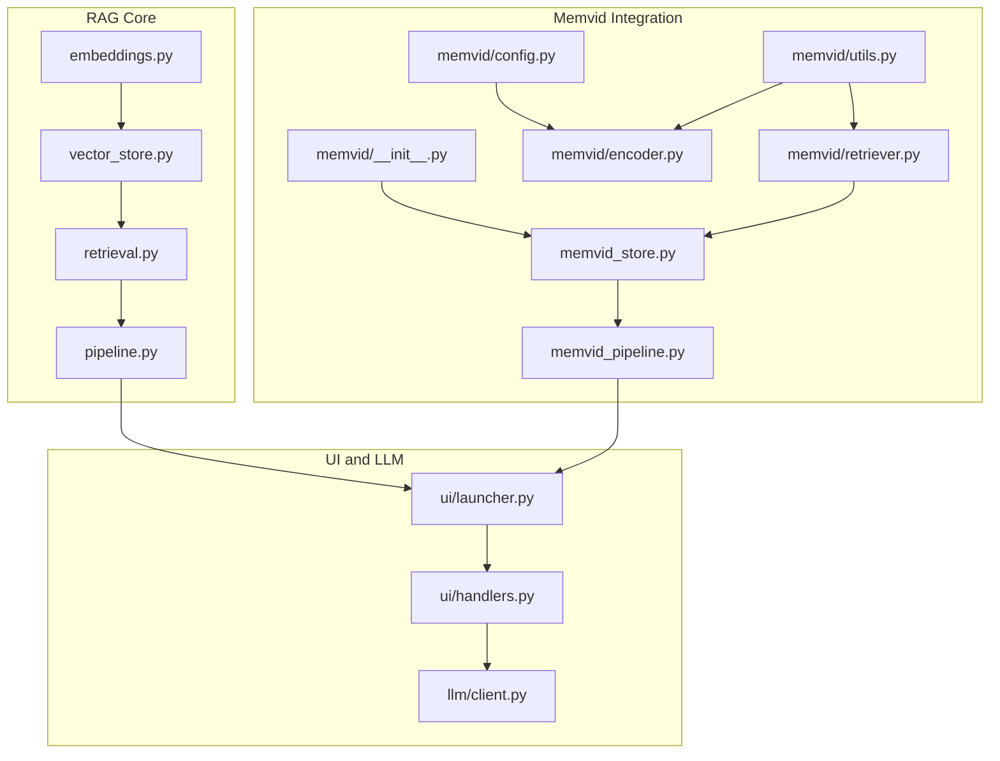
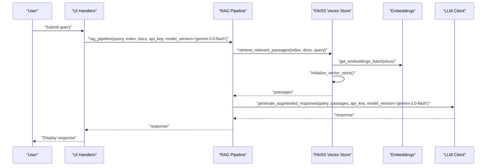
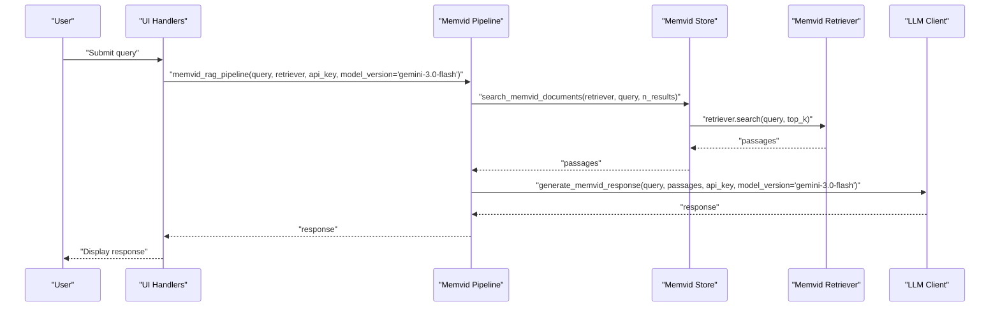
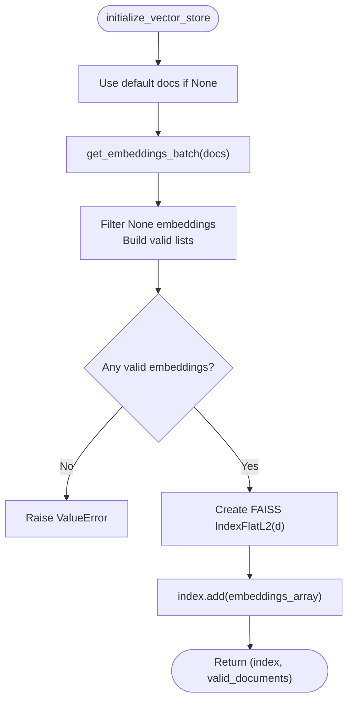
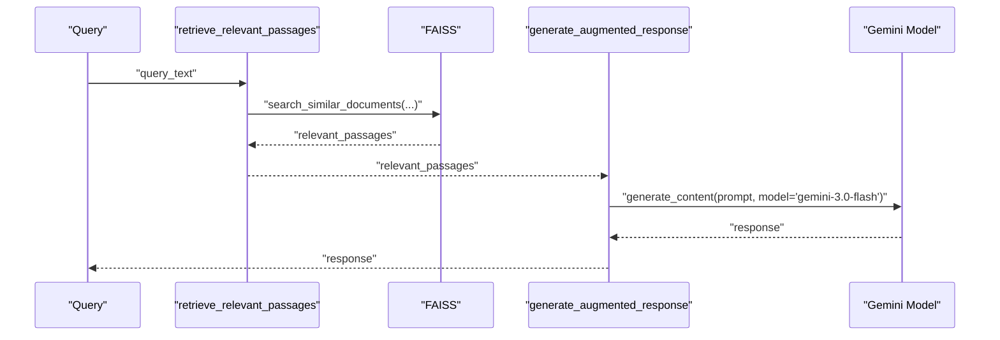
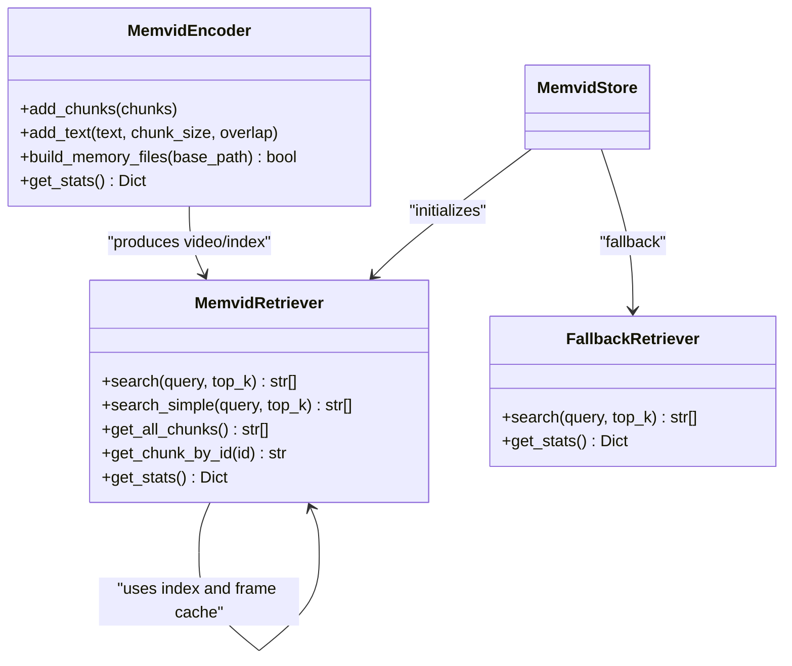
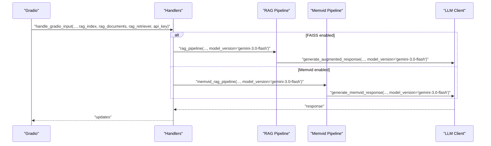
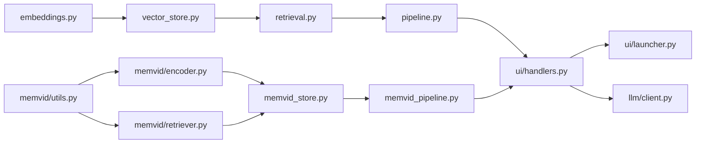

# RAG Pipeline API

<cite>
**Referenced Files in This Document**
- [src/rag/__init__.py](file://src/rag/__init__.py)
- [src/rag/embeddings.py](file://src/rag/embeddings.py)
- [src/rag/vector_store.py](file://src/rag/vector_store.py)
- [src/rag/retrieval.py](file://src/rag/retrieval.py)
- [src/rag/pipeline.py](file://src/rag/pipeline.py)
- [src/rag/memvid_store.py](file://src/src/rag/memvid_store.py)
- [src/rag/memvid_pipeline.py](file://src/rag/memvid_pipeline.py)
- [src/memvid/__init__.py](file://src/memvid/__init__.py)
- [src/memvid/config.py](file://src/memvid/config.py)
- [src/memvid/encoder.py](file://src/memvid/encoder.py)
- [src/memvid/retriever.py](file://src/memvid/retriever.py)
- [src/memvid/utils.py](file://src/memvid/utils.py)
- [src/ui/launcher.py](file://src/ui/launcher.py)
- [src/ui/handlers.py](file://src/ui/handlers.py)
- [src/llm/client.py](file://src/llm/client.py)
- [src/config/model_config.py](file://src/config/model_config.py)
</cite>

## Update Summary
**Changes Made**
- Updated default model_version parameter from "gemini-2.5-flash-preview-04-17" to "gemini-3.0-flash" in all RAG pipeline functions
- Updated API reference documentation to reflect the new default model version
- Updated configuration documentation to show the new default model selection
- Added model version validation documentation for the new default model

## Table of Contents
1. [Introduction](#introduction)
2. [Project Structure](#project-structure)
3. [Core Components](#core-components)
4. [Architecture Overview](#architecture-overview)
5. [Detailed Component Analysis](#detailed-component-analysis)
6. [Dependency Analysis](#dependency-analysis)
7. [Performance Considerations](#performance-considerations)
8. [Troubleshooting Guide](#troubleshooting-guide)
9. [Conclusion](#conclusion)
10. [Appendices](#appendices)

## Introduction
This document describes the Retrieval-Augmented Generation (RAG) pipeline for MayaMCP, focusing on:
- FAISS-based vector store API for embedding generation, similarity search, and document indexing
- Memvid video memory API for temporal document retrieval and video-based context enhancement
- Dual-backend architecture enabling seamless switching between FAISS and Memvid backends
- Pipeline configuration options, similarity thresholds, and retrieval parameters
- Examples of query processing, context augmentation, and response enhancement workflows
- Performance optimization techniques, caching strategies, and memory management for large document collections
- Troubleshooting guidance for retrieval accuracy and performance issues

**Updated** The default model version has been updated from "gemini-2.5-flash-preview-04-17" to "gemini-3.0-flash" for improved stability and performance.

## Project Structure
The RAG system is organized into cohesive modules under src/rag and src/memvid, with UI integration under src/ui and LLM client utilities under src/llm.

**Diagram sources**
- [src/rag/embeddings.py](file://src/rag/embeddings.py#L1-L217)
- [src/rag/vector_store.py](file://src/rag/vector_store.py#L1-L107)
- [src/rag/retrieval.py](file://src/rag/retrieval.py#L1-L40)
- [src/rag/pipeline.py](file://src/rag/pipeline.py#L1-L125)
- [src/rag/memvid_store.py](file://src/rag/memvid_store.py#L1-L159)
- [src/rag/memvid_pipeline.py](file://src/rag/memvid_pipeline.py#L1-L124)
- [src/memvid/__init__.py](file://src/memvid/__init__.py#L1-L10)
- [src/memvid/config.py](file://src/memvid/config.py#L1-L49)
- [src/memvid/encoder.py](file://src/memvid/encoder.py#L1-L201)
- [src/memvid/retriever.py](file://src/memvid/retriever.py#L1-L189)
- [src/memvid/utils.py](file://src/memvid/utils.py#L1-L161)
- [src/ui/launcher.py](file://src/ui/launcher.py#L1-L354)
- [src/ui/handlers.py](file://src/ui/handlers.py#L1-L392)
- [src/llm/client.py](file://src/llm/client.py#L1-L211)

**Section sources**
- [src/rag/__init__.py](file://src/rag/__init__.py#L1-L21)
- [src/rag/embeddings.py](file://src/rag/embeddings.py#L1-L217)
- [src/rag/vector_store.py](file://src/rag/vector_store.py#L1-L107)
- [src/rag/retrieval.py](file://src/rag/retrieval.py#L1-L40)
- [src/rag/pipeline.py](file://src/rag/pipeline.py#L1-L125)
- [src/rag/memvid_store.py](file://src/rag/memvid_store.py#L1-L159)
- [src/rag/memvid_pipeline.py](file://src/rag/memvid_pipeline.py#L1-L124)
- [src/memvid/__init__.py](file://src/memvid/__init__.py#L1-L10)
- [src/memvid/config.py](file://src/memvid/config.py#L1-L49)
- [src/memvid/encoder.py](file://src/memvid/encoder.py#L1-L201)
- [src/memvid/retriever.py](file://src/memvid/retriever.py#L1-L189)
- [src/memvid/utils.py](file://src/memvid/utils.py#L1-L161)
- [src/ui/launcher.py](file://src/ui/launcher.py#L1-L354)
- [src/ui/handlers.py](file://src/ui/handlers.py#L1-L392)
- [src/llm/client.py](file://src/llm/client.py#L1-L211)

## Core Components
- Embedding generation: Batch and single embedding generation with retry and caching for the Google AI Embeddings API
- FAISS vector store: Indexing, embedding generation, and similarity search
- Retrieval orchestration: High-level retrieval of relevant passages
- RAG pipeline: Full pipeline from query to augmented response using "gemini-3.0-flash" as default model
- Memvid store: Video memory creation and retrieval with fallback mechanisms
- Memvid pipeline: Memvid-backed RAG pipeline with enhanced prompts using "gemini-3.0-flash" as default model
- UI integration: Gradio interface and handlers that wire RAG into the chat flow
- LLM client: Unified client utilities for Gemini API calls
- Model configuration: Centralized model configuration with "gemini-3.0-flash" as default model version

Key exports for consumers:
- FAISS APIs: get_embedding, initialize_vector_store, search_similar_documents, retrieve_relevant_passages, rag_pipeline, generate_augmented_response
- Memvid APIs: initialize_memvid_store, search_memvid_documents, memvid_rag_pipeline, generate_memvid_response

**Updated** All RAG pipeline functions now default to using "gemini-3.0-flash" model for improved performance and stability.

**Section sources**
- [src/rag/__init__.py](file://src/rag/__init__.py#L1-L21)
- [src/rag/embeddings.py](file://src/rag/embeddings.py#L1-L217)
- [src/rag/vector_store.py](file://src/rag/vector_store.py#L1-L107)
- [src/rag/retrieval.py](file://src/rag/retrieval.py#L1-L40)
- [src/rag/pipeline.py](file://src/rag/pipeline.py#L1-L125)
- [src/rag/memvid_store.py](file://src/rag/memvid_store.py#L1-L159)
- [src/rag/memvid_pipeline.py](file://src/rag/memvid_pipeline.py#L1-L124)
- [src/config/model_config.py](file://src/config/model_config.py#L31-L44)

## Architecture Overview
The system supports two retrieval backends:
- FAISS: Text-based dense vectors with L2 distance search
- Memvid: Video memory built from text chunks encoded as QR frames; retrieval via keyword matching with optional frame decoding

**Diagram sources**
- [src/rag/pipeline.py](file://src/rag/pipeline.py#L72-L125)
- [src/rag/retrieval.py](file://src/rag/retrieval.py#L9-L40)
- [src/rag/vector_store.py](file://src/rag/vector_store.py#L25-L107)
- [src/rag/embeddings.py](file://src/rag/embeddings.py#L148-L217)
- [src/llm/client.py](file://src/llm/client.py#L130-L211)

Dual-backend flow (Memvid):

**Diagram sources**
- [src/rag/memvid_pipeline.py](file://src/rag/memvid_pipeline.py#L73-L124)
- [src/rag/memvid_store.py](file://src/rag/memvid_store.py#L137-L159)
- [src/memvid/retriever.py](file://src/memvid/retriever.py#L168-L189)
- [src/llm/client.py](file://src/llm/client.py#L130-L211)

## Detailed Component Analysis

### FAISS Vector Store API
- Embedding generation
  - Single embedding: get_embedding(text, task_type)
  - Batch embedding: get_embeddings_batch(texts, task_type)
  - Caching: module-level API key cache to avoid repeated configuration
  - Retry: exponential backoff with tenacity for transient failures
- Indexing
  - initialize_vector_store(documents): builds FAISS index with filtered valid embeddings
  - Default personality documents used if none provided
- Similarity search
  - search_similar_documents(index, documents, query_text, n_results): converts query to embedding and performs L2 search

**Diagram sources**
- [src/rag/vector_store.py](file://src/rag/vector_store.py#L25-L69)
- [src/rag/embeddings.py](file://src/rag/embeddings.py#L148-L217)

**Section sources**
- [src/rag/embeddings.py](file://src/rag/embeddings.py#L1-L217)
- [src/rag/vector_store.py](file://src/rag/vector_store.py#L1-L107)

### Retrieval Orchestration
- retrieve_relevant_passages(index, documents, query_text, n_results): orchestrates FAISS search and logs results

**Section sources**
- [src/rag/retrieval.py](file://src/rag/retrieval.py#L1-L40)

### RAG Pipeline
- generate_augmented_response(query_text, retrieved_documents, api_key, model_version="gemini-3.0-flash"): constructs a prompt with reference passages and calls the Gemini model
- rag_pipeline(query_text, index, documents, api_key, model_version="gemini-3.0-flash"): end-to-end pipeline invoking retrieval and response generation

**Updated** All RAG pipeline functions now default to using "gemini-3.0-flash" model for improved performance and stability.

**Diagram sources**
- [src/rag/pipeline.py](file://src/rag/pipeline.py#L22-L125)
- [src/rag/retrieval.py](file://src/rag/retrieval.py#L9-L40)
- [src/rag/vector_store.py](file://src/rag/vector_store.py#L71-L107)

**Section sources**
- [src/rag/pipeline.py](file://src/rag/pipeline.py#L1-L125)

### Memvid Video Memory API
- Initialization and fallback
  - initialize_memvid_store(documents, force_rebuild): creates video memory and index; falls back to text-only mode if video creation fails
  - FallbackRetriever: simple keyword-based search when Memvid is unavailable
- Retrieval
  - search_memvid_documents(retriever, query_text, n_results): unified interface delegating to retriever.search
- Retrieval engine
  - MemvidRetriever.search_simple: keyword overlap scoring with normalization; optional frame decoding for full text; frame cache
  - MemvidRetriever._get_chunk_from_video: extracts frame, decodes QR, parses JSON payload
- Encoder
  - MemvidEncoder: encodes chunks to QR frames, writes video, and builds index; validates dependencies and prerequisites
- Utilities
  - encode_to_qr, decode_qr, qr_to_frame, extract_frame, chunk_text with compression for large payloads

**Diagram sources**
- [src/memvid/encoder.py](file://src/memvid/encoder.py#L18-L201)
- [src/memvid/retriever.py](file://src/memvid/retriever.py#L17-L189)
- [src/rag/memvid_store.py](file://src/rag/memvid_store.py#L98-L159)

**Section sources**
- [src/rag/memvid_store.py](file://src/rag/memvid_store.py#L1-L159)
- [src/memvid/encoder.py](file://src/memvid/encoder.py#L1-L201)
- [src/memvid/retriever.py](file://src/memvid/retriever.py#L1-L189)
- [src/memvid/utils.py](file://src/memvid/utils.py#L1-L161)

### Memvid RAG Pipeline
- generate_memvid_response(query_text, retrieved_documents, api_key, model_version="gemini-3.0-flash"): enhanced prompt incorporating video memory insights
- memvid_rag_pipeline(query_text, memvid_retriever, api_key, model_version="gemini-3.0-flash"): orchestrates Memvid retrieval and response generation

**Updated** All Memvid pipeline functions now default to using "gemini-3.0-flash" model for improved performance and stability.

**Section sources**
- [src/rag/memvid_pipeline.py](file://src/rag/memvid_pipeline.py#L1-L124)

### Model Configuration and Validation
- Centralized model configuration with "gemini-3.0-flash" as default model version
- Known valid Gemini models list including "gemini-3.0-flash", "gemini-2.5-flash-lite", "gemini-2.5-flash", "gemini-2.5-pro", "gemini-2.0-flash"
- Model validation utilities for warning purposes during application startup

**Section sources**
- [src/config/model_config.py](file://src/config/model_config.py#L31-L103)

### UI Integration and Orchestration
- UI Launcher: Gradio interface definition and state management
- UI Handlers: Event handlers that integrate RAG into the chat loop, passing FAISS index and Memvid retriever to the pipeline
- LLM Client: Unified client utilities for Gemini API calls, including configuration and retry logic

**Diagram sources**
- [src/ui/launcher.py](file://src/ui/launcher.py#L49-L354)
- [src/ui/handlers.py](file://src/ui/handlers.py#L23-L392)
- [src/rag/pipeline.py](file://src/rag/pipeline.py#L72-L125)
- [src/rag/memvid_pipeline.py](file://src/rag/memvid_pipeline.py#L73-L124)
- [src/llm/client.py](file://src/llm/client.py#L130-L211)

**Section sources**
- [src/ui/launcher.py](file://src/ui/launcher.py#L1-L354)
- [src/ui/handlers.py](file://src/ui/handlers.py#L1-L392)
- [src/llm/client.py](file://src/llm/client.py#L1-L211)

## Dependency Analysis
- Cohesion and coupling
  - FAISS pipeline: embeddings → vector_store → retrieval → pipeline
  - Memvid pipeline: memvid_store → memvid_retriever → memvid_pipeline → LLM
  - UI handlers depend on both pipelines and pass API keys and retrievers
- External dependencies
  - FAISS for vector search
  - Google AI Embeddings and Generative Models (defaulting to "gemini-3.0-flash")
  - OpenCV, Pillow, qrcode for Memvid video/memory operations
- Potential circular dependencies
  - None observed among RAG, Memvid, and UI modules

**Diagram sources**
- [src/rag/embeddings.py](file://src/rag/embeddings.py#L1-L217)
- [src/rag/vector_store.py](file://src/rag/vector_store.py#L1-L107)
- [src/rag/retrieval.py](file://src/rag/retrieval.py#L1-L40)
- [src/rag/pipeline.py](file://src/rag/pipeline.py#L1-L125)
- [src/rag/memvid_store.py](file://src/rag/memvid_store.py#L1-L159)
- [src/rag/memvid_pipeline.py](file://src/rag/memvid_pipeline.py#L1-L124)
- [src/memvid/encoder.py](file://src/memvid/encoder.py#L1-L201)
- [src/memvid/retriever.py](file://src/memvid/retriever.py#L1-L189)
- [src/memvid/utils.py](file://src/memvid/utils.py#L1-L161)
- [src/ui/handlers.py](file://src/ui/handlers.py#L1-L392)
- [src/ui/launcher.py](file://src/ui/launcher.py#L1-L354)
- [src/llm/client.py](file://src/llm/client.py#L1-L211)

**Section sources**
- [src/rag/__init__.py](file://src/rag/__init__.py#L1-L21)
- [src/rag/embeddings.py](file://src/rag/embeddings.py#L1-L217)
- [src/rag/vector_store.py](file://src/rag/vector_store.py#L1-L107)
- [src/rag/retrieval.py](file://src/rag/retrieval.py#L1-L40)
- [src/rag/pipeline.py](file://src/rag/pipeline.py#L1-L125)
- [src/rag/memvid_store.py](file://src/rag/memvid_store.py#L1-L159)
- [src/rag/memvid_pipeline.py](file://src/rag/memvid_pipeline.py#L1-L124)
- [src/memvid/encoder.py](file://src/memvid/encoder.py#L1-L201)
- [src/memvid/retriever.py](file://src/memvid/retriever.py#L1-L189)
- [src/memvid/utils.py](file://src/memvid/utils.py#L1-L161)
- [src/ui/handlers.py](file://src/ui/handlers.py#L1-L392)
- [src/ui/launcher.py](file://src/ui/launcher.py#L1-L354)
- [src/llm/client.py](file://src/llm/client.py#L1-L211)

## Performance Considerations
- Embedding throughput
  - Batch embedding with configurable batch size reduces API overhead
  - Single embedding retry with exponential backoff improves resilience
- FAISS search
  - IndexFlatL2 provides fast similarity search; consider larger datasets with more advanced indexes if latency grows
  - Limit n_results to reduce downstream LLM token usage
- Memvid retrieval
  - Keyword scoring avoids heavy computation; frame cache limits prevent repeated decoding
  - Frame extraction and QR decoding are CPU-bound; consider limiting top_k and caching decoded frames
- Caching and configuration
  - Embedding API key caching prevents repeated genai.configure calls
  - Frame cache size capped to balance memory vs. speed
- LLM calls
  - Retry logic and error classification improve reliability; tune generation parameters for cost/quality trade-offs
  - Default "gemini-3.0-flash" model provides improved performance and stability compared to previous versions

**Updated** The default "gemini-3.0-flash" model provides improved performance and stability compared to the previous "gemini-2.5-flash-preview-04-17" model.

## Troubleshooting Guide
- Embedding generation
  - Symptom: get_embedding returns None
  - Causes: API key not configured, non-retryable exceptions, SDK response parsing issues
  - Actions: verify GEMINI_API_KEY, inspect logs, confirm SDK availability
- FAISS indexing
  - Symptom: ValueError about no valid embeddings
  - Causes: all document embeddings failed
  - Actions: check network/API, retry, or reduce batch size
- FAISS search
  - Symptom: Empty results
  - Causes: query embedding failure, low-quality embeddings, insufficient training data
  - Actions: validate embeddings, increase n_results, adjust model/task_type
- Memvid initialization
  - Symptom: Fallback to text-only mode
  - Causes: missing dependencies, video creation failure
  - Actions: install qrcode[pil], opencv-python; verify disk space and permissions
- Memvid retrieval
  - Symptom: Slow or empty results
  - Causes: missing frames, QR decode failures, cache misses
  - Actions: rebuild video memory, ensure index integrity, monitor cache stats
- LLM response generation
  - Symptom: Exceptions or empty responses
  - Causes: API rate limits, auth errors, timeouts
  - Actions: enable retries, verify API key, adjust generation config
- Model version issues
  - Symptom: Application warns about unknown model version
  - Causes: Custom model version not in known list
  - Actions: Use supported models from KNOWN_GEMINI_MODELS, or update the known models list

**Updated** Added troubleshooting guidance for model version validation and configuration.

**Section sources**
- [src/rag/embeddings.py](file://src/rag/embeddings.py#L107-L113)
- [src/rag/vector_store.py](file://src/rag/vector_store.py#L54-L56)
- [src/rag/memvid_store.py](file://src/rag/memvid_store.py#L62-L76)
- [src/memvid/retriever.py](file://src/memvid/retriever.py#L113-L144)
- [src/llm/client.py](file://src/llm/client.py#L130-L211)
- [src/config/model_config.py](file://src/config/model_config.py#L94-L103)

## Conclusion
MayaMCP's RAG system provides a robust dual-backend architecture:
- FAISS for scalable text-based retrieval with efficient similarity search
- Memvid for video-based memory with keyword-driven retrieval and optional frame decoding
- Unified UI integration and LLM client utilities for seamless chat experiences
- Centralized model configuration with "gemini-3.0-flash" as the default model for improved performance and stability

**Updated** The system now defaults to using the more stable "gemini-3.0-flash" model, providing better performance and reliability for production deployments.

Adopt the recommended configuration, caching, and optimization strategies to achieve reliable performance at scale.

## Appendices

### API Reference Summary

- FAISS APIs
  - get_embedding(text, task_type): Generate a single embedding vector
  - get_embeddings_batch(texts, task_type): Generate embeddings in batches
  - initialize_vector_store(documents): Build FAISS index from documents
  - search_similar_documents(index, documents, query_text, n_results): Retrieve most similar documents
  - retrieve_relevant_passages(index, documents, query_text, n_results): High-level retrieval
  - rag_pipeline(query_text, index, documents, api_key, model_version="gemini-3.0-flash"): Full RAG pipeline
  - generate_augmented_response(query_text, retrieved_documents, api_key, model_version="gemini-3.0-flash"): Generate LLM response augmented with context

- Memvid APIs
  - initialize_memvid_store(documents, force_rebuild): Create video memory and index; fallback on failure
  - search_memvid_documents(retriever, query_text, n_results): Retrieve relevant insights
  - memvid_rag_pipeline(query_text, memvid_retriever, api_key, model_version="gemini-3.0-flash"): Memvid-backed RAG pipeline
  - generate_memvid_response(query_text, retrieved_documents, api_key, model_version="gemini-3.0-flash"): Generate LLM response with video memory context

- Model Configuration
  - get_model_config(): Returns configuration with default model_version="gemini-3.0-flash"
  - get_known_gemini_models(): Returns list including "gemini-3.0-flash", "gemini-2.5-flash-lite", "gemini-2.5-flash", "gemini-2.5-pro", "gemini-2.0-flash"
  - is_valid_gemini_model(model_name): Validates model names against known list

- Memvid Engine
  - MemvidEncoder: Encodes chunks to QR frames and builds video/index
  - MemvidRetriever: Searches and retrieves chunks from video memory
  - FallbackRetriever: Keyword-based fallback when Memvid is unavailable

**Updated** All API functions now default to using "gemini-3.0-flash" model for improved performance and stability.

**Section sources**
- [src/rag/__init__.py](file://src/rag/__init__.py#L1-L21)
- [src/rag/embeddings.py](file://src/rag/embeddings.py#L1-L217)
- [src/rag/vector_store.py](file://src/rag/vector_store.py#L1-L107)
- [src/rag/retrieval.py](file://src/rag/retrieval.py#L1-L40)
- [src/rag/pipeline.py](file://src/rag/pipeline.py#L1-L125)
- [src/rag/memvid_store.py](file://src/rag/memvid_store.py#L1-L159)
- [src/rag/memvid_pipeline.py](file://src/rag/memvid_pipeline.py#L1-L124)
- [src/config/model_config.py](file://src/config/model_config.py#L31-L103)
- [src/memvid/encoder.py](file://src/memvid/encoder.py#L1-L201)
- [src/memvid/retriever.py](file://src/memvid/retriever.py#L1-L189)