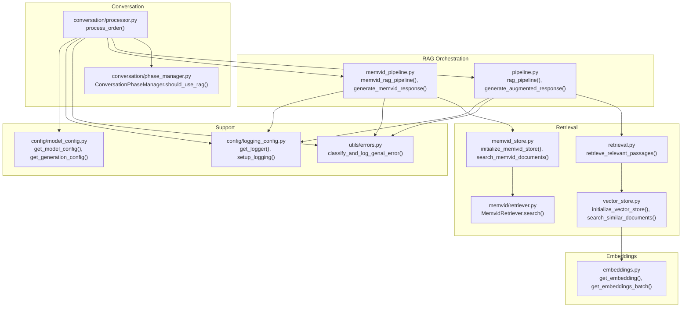
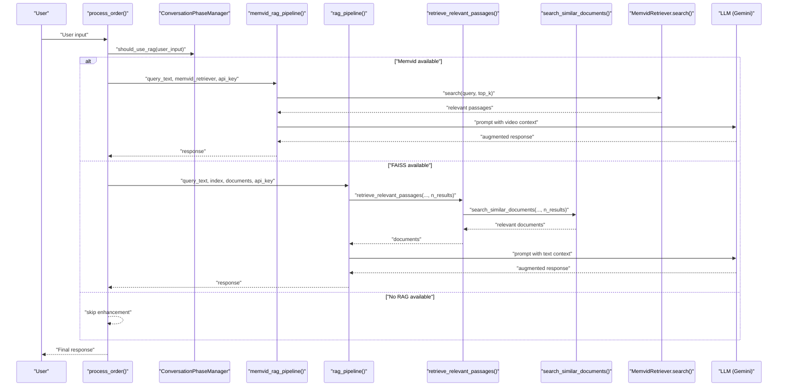
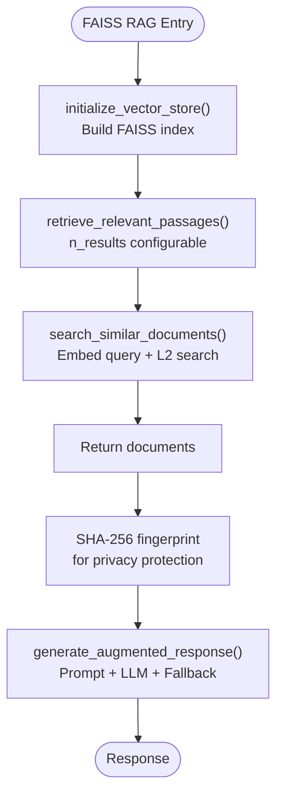
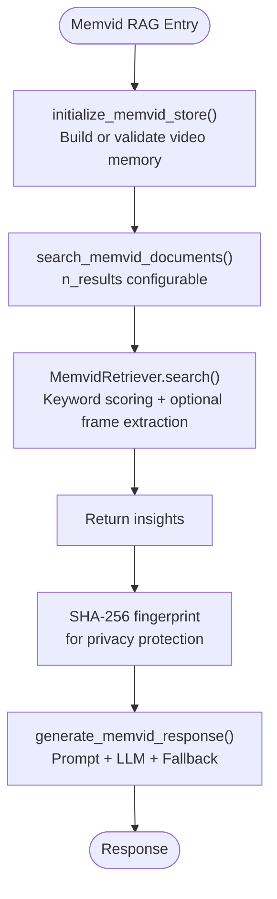
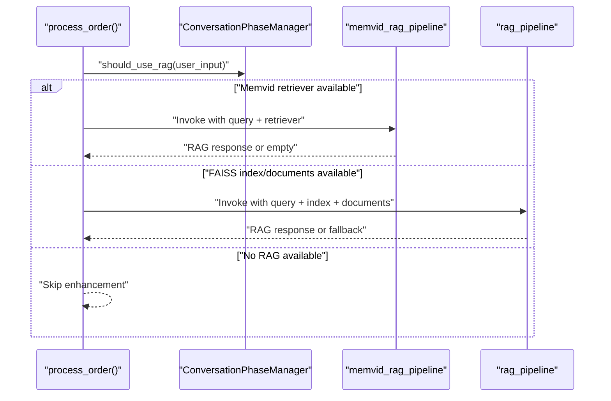
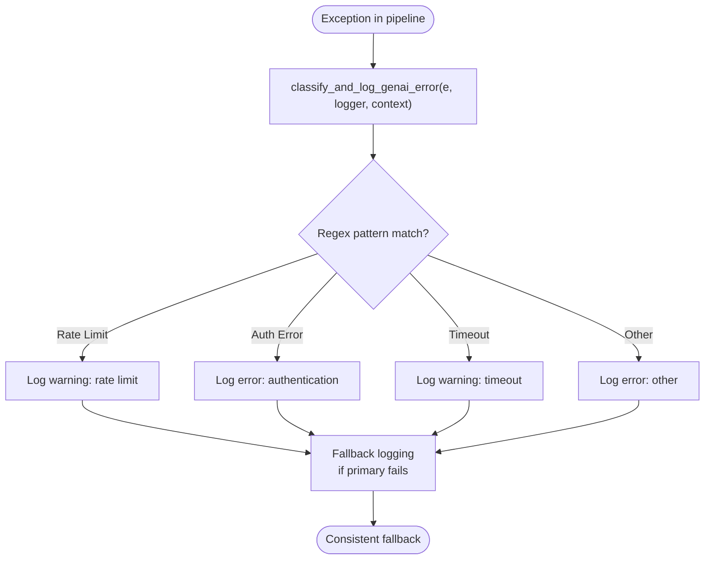
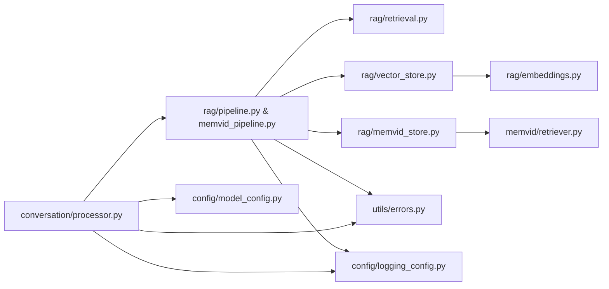

# RAG Pipeline Integration

<cite>
**Referenced Files in This Document**
- [src/rag/__init__.py](file://src/rag/__init__.py)
- [src/rag/pipeline.py](file://src/rag/pipeline.py)
- [src/rag/retrieval.py](file://src/rag/retrieval.py)
- [src/rag/memvid_pipeline.py](file://src/rag/memvid_pipeline.py)
- [src/rag/embeddings.py](file://src/rag/embeddings.py)
- [src/rag/vector_store.py](file://src/rag/vector_store.py)
- [src/rag/memvid_store.py](file://src/rag/memvid_store.py)
- [src/conversation/processor.py](file://src/conversation/processor.py)
- [src/conversation/phase_manager.py](file://src/conversation/phase_manager.py)
- [src/memvid/retriever.py](file://src/memvid/retriever.py)
- [src/utils/errors.py](file://src/utils/errors.py)
- [src/config/logging_config.py](file://src/config/logging_config.py)
- [src/config/model_config.py](file://src/config/model_config.py)
</cite>

## Update Summary
**Changes Made**
- Enhanced error classification and logging mechanisms with improved regex-based classification
- Added dedicated fallback response constants for consistent error handling across pipelines
- Implemented query text fingerprinting for privacy protection using SHA-256 hashing
- Improved fallback response consistency with separate constants for different pipeline types

## Table of Contents
1. [Introduction](#introduction)
2. [Project Structure](#project-structure)
3. [Core Components](#core-components)
4. [Architecture Overview](#architecture-overview)
5. [Detailed Component Analysis](#detailed-component-analysis)
6. [Dependency Analysis](#dependency-analysis)
7. [Performance Considerations](#performance-considerations)
8. [Troubleshooting Guide](#troubleshooting-guide)
9. [Conclusion](#conclusion)
10. [Appendices](#appendices)

## Introduction
This document describes the Retrieval-Augmented Generation (RAG) pipeline integration API designed to orchestrate dual-backend retrieval operations for the MayaMCP bartender agent. The system supports two retrieval backends:
- Text-based FAISS vector store for semantic document retrieval
- Video-based Memvid retriever for contextual insights derived from a video memory

The pipeline integrates with the broader conversation processing flow, conditionally enhancing casual conversation turns with context from either backend. It includes robust error handling, graceful fallbacks, and configuration hooks for model parameters and logging. Recent improvements focus on enhanced error classification, consistent fallback responses, and privacy protection through query text fingerprinting.

## Project Structure
The RAG integration spans several modules:
- RAG orchestration and generation: pipeline.py, memvid_pipeline.py
- Retrieval utilities: retrieval.py, vector_store.py, memvid_store.py
- Embedding generation: embeddings.py
- Conversation integration: processor.py, phase_manager.py
- Error classification and logging: utils/errors.py, config/logging_config.py
- Model configuration: config/model_config.py
- Memvid retriever: memvid/retriever.py

**Diagram sources**
- [src/rag/pipeline.py](file://src/rag/pipeline.py#L60-L105)
- [src/rag/memvid_pipeline.py](file://src/rag/memvid_pipeline.py#L65-L108)
- [src/rag/retrieval.py](file://src/rag/retrieval.py#L9-L40)
- [src/rag/vector_store.py](file://src/rag/vector_store.py#L25-L107)
- [src/rag/memvid_store.py](file://src/rag/memvid_store.py#L28-L159)
- [src/memvid/retriever.py](file://src/memvid/retriever.py#L17-L189)
- [src/rag/embeddings.py](file://src/rag/embeddings.py#L42-L217)
- [src/conversation/processor.py](file://src/conversation/processor.py#L302-L362)
- [src/conversation/phase_manager.py](file://src/conversation/phase_manager.py#L69-L83)
- [src/utils/errors.py](file://src/utils/errors.py#L11-L39)
- [src/config/logging_config.py](file://src/config/logging_config.py#L41-L51)
- [src/config/model_config.py](file://src/config/model_config.py#L31-L59)

**Section sources**
- [src/rag/__init__.py](file://src/rag/__init__.py#L1-L21)
- [src/rag/pipeline.py](file://src/rag/pipeline.py#L1-L125)
- [src/rag/memvid_pipeline.py](file://src/rag/memvid_pipeline.py#L1-L124)
- [src/rag/retrieval.py](file://src/rag/retrieval.py#L1-L40)
- [src/rag/vector_store.py](file://src/rag/vector_store.py#L1-L107)
- [src/rag/memvid_store.py](file://src/rag/memvid_store.py#L1-L159)
- [src/memvid/retriever.py](file://src/memvid/retriever.py#L1-L189)
- [src/rag/embeddings.py](file://src/rag/embeddings.py#L1-L217)
- [src/conversation/processor.py](file://src/conversation/processor.py#L1-L456)
- [src/conversation/phase_manager.py](file://src/conversation/phase_manager.py#L1-L92)
- [src/utils/errors.py](file://src/utils/errors.py#L1-L39)
- [src/config/logging_config.py](file://src/config/logging_config.py#L1-L51)
- [src/config/model_config.py](file://src/config/model_config.py#L1-L102)

## Core Components
- Dual retrieval backends:
  - FAISS-based semantic search: initialize_vector_store(), search_similar_documents(), retrieve_relevant_passages()
  - Memvid-based video search: initialize_memvid_store(), search_memvid_documents(), MemvidRetriever.search()
- Orchestration:
  - rag_pipeline(): end-to-end pipeline for FAISS-backed RAG with dedicated fallback constant
  - memvid_rag_pipeline(): end-to-end pipeline for Memvid-backed RAG with dedicated fallback constant
  - generate_augmented_response(): LLM prompt composition and inference with consistent fallback
  - generate_memvid_response(): LLM prompt composition and inference for video-derived context with consistent fallback
- Embedding generation:
  - get_embedding(), get_embeddings_batch() with retry and batch support
- Conversation integration:
  - process_order(): conditionally enhances casual conversation with RAG using privacy-preserving query fingerprinting
  - ConversationPhaseManager.should_use_rag(): determines when to apply RAG
- Error handling and logging:
  - classify_and_log_genai_error(): enhanced regex-based error classification with fallback logging
  - get_logger(), setup_logging(): unified logging configuration
- Model configuration:
  - get_model_config(), get_generation_config(): environment-driven model and generation parameters

**Updated** Enhanced error classification with improved regex patterns and fallback logging mechanisms. Added dedicated fallback response constants for consistent error handling across different pipeline types.

**Section sources**
- [src/rag/pipeline.py](file://src/rag/pipeline.py#L12-L125)
- [src/rag/memvid_pipeline.py](file://src/rag/memvid_pipeline.py#L16-L124)
- [src/rag/retrieval.py](file://src/rag/retrieval.py#L9-L40)
- [src/rag/vector_store.py](file://src/rag/vector_store.py#L25-L107)
- [src/rag/memvid_store.py](file://src/rag/memvid_store.py#L28-L159)
- [src/memvid/retriever.py](file://src/memvid/retriever.py#L17-L189)
- [src/rag/embeddings.py](file://src/rag/embeddings.py#L42-L217)
- [src/conversation/processor.py](file://src/conversation/processor.py#L302-L362)
- [src/conversation/phase_manager.py](file://src/conversation/phase_manager.py#L69-L83)
- [src/utils/errors.py](file://src/utils/errors.py#L11-L39)
- [src/config/logging_config.py](file://src/config/logging_config.py#L41-L51)
- [src/config/model_config.py](file://src/config/model_config.py#L31-L59)

## Architecture Overview
The RAG integration is invoked during casual conversation turns. The processor decides whether to enhance the response using either Memvid or FAISS, depending on availability and initialization. Both pipelines retrieve relevant context, construct a tailored prompt, and call the LLM to produce an augmented response. Enhanced error handling ensures consistent fallback responses and privacy protection through query fingerprinting.

**Diagram sources**
- [src/conversation/processor.py](file://src/conversation/processor.py#L302-L362)
- [src/conversation/phase_manager.py](file://src/conversation/phase_manager.py#L69-L83)
- [src/rag/memvid_pipeline.py](file://src/rag/memvid_pipeline.py#L65-L108)
- [src/rag/pipeline.py](file://src/rag/pipeline.py#L60-L105)
- [src/rag/retrieval.py](file://src/rag/retrieval.py#L9-L40)
- [src/rag/vector_store.py](file://src/rag/vector_store.py#L71-L107)
- [src/memvid/retriever.py](file://src/memvid/retriever.py#L168-L179)

## Detailed Component Analysis

### FAISS-Based RAG Pipeline
- Initialization:
  - initialize_vector_store() builds a FAISS index from documents using embeddings generated via get_embeddings_batch().
- Retrieval:
  - retrieve_relevant_passages() delegates to search_similar_documents(), which computes a query embedding and performs an L2 distance search to return top-k documents.
- Generation:
  - rag_pipeline() orchestrates retrieval and calls generate_augmented_response(), which constructs a prompt incorporating retrieved documents and invokes the LLM.
- Privacy Protection:
  - Implements query text fingerprinting using SHA-256 to avoid logging sensitive information.

**Updated** Added query text fingerprinting mechanism using SHA-256 hashing to protect user privacy while maintaining operational visibility.

**Diagram sources**
- [src/rag/vector_store.py](file://src/rag/vector_store.py#L25-L107)
- [src/rag/retrieval.py](file://src/rag/retrieval.py#L9-L40)
- [src/rag/pipeline.py](file://src/rag/pipeline.py#L60-L125)
- [src/rag/embeddings.py](file://src/rag/embeddings.py#L148-L217)

**Section sources**
- [src/rag/vector_store.py](file://src/rag/vector_store.py#L25-L107)
- [src/rag/retrieval.py](file://src/rag/retrieval.py#L9-L40)
- [src/rag/pipeline.py](file://src/rag/pipeline.py#L60-L125)
- [src/rag/embeddings.py](file://src/rag/embeddings.py#L42-L217)

### Memvid-Based RAG Pipeline
- Initialization:
  - initialize_memvid_store() creates or validates video memory files and returns a MemvidRetriever instance or a fallback retriever.
- Retrieval:
  - search_memvid_documents() delegates to retriever.search(), which performs keyword-based scoring over indexed chunks and optionally extracts full text from video frames.
- Generation:
  - memvid_rag_pipeline() orchestrates retrieval and calls generate_memvid_response(), which constructs a prompt incorporating video-derived insights and invokes the LLM.
- Privacy Protection:
  - Implements query text fingerprinting using SHA-256 to avoid logging sensitive information.

**Updated** Added query text fingerprinting mechanism using SHA-256 hashing to protect user privacy while maintaining operational visibility.

**Diagram sources**
- [src/rag/memvid_store.py](file://src/rag/memvid_store.py#L28-L159)
- [src/memvid/retriever.py](file://src/memvid/retriever.py#L168-L179)
- [src/rag/memvid_pipeline.py](file://src/rag/memvid_pipeline.py#L65-L124)

**Section sources**
- [src/rag/memvid_store.py](file://src/rag/memvid_store.py#L28-L159)
- [src/memvid/retriever.py](file://src/memvid/retriever.py#L17-L189)
- [src/rag/memvid_pipeline.py](file://src/rag/memvid_pipeline.py#L65-L124)

### Conversation Integration and Backend Selection
- Backend selection:
  - process_order() conditionally enhances casual conversation responses using either Memvid or FAISS based on availability and initialization.
- Phase gating:
  - ConversationPhaseManager.should_use_rag() determines whether the input qualifies as casual conversation for RAG enhancement.
- Error handling:
  - Both pipelines log and return fallback responses on failure, ensuring robustness with consistent fallback messaging.
- Privacy Protection:
  - Query text fingerprinting prevents sensitive information from being logged while maintaining operational traceability.

**Updated** Enhanced error handling with dedicated fallback constants ensures consistent user experience across different pipeline failures.

**Diagram sources**
- [src/conversation/processor.py](file://src/conversation/processor.py#L302-L362)
- [src/conversation/phase_manager.py](file://src/conversation/phase_manager.py#L69-L83)
- [src/rag/memvid_pipeline.py](file://src/rag/memvid_pipeline.py#L65-L124)
- [src/rag/pipeline.py](file://src/rag/pipeline.py#L60-L125)

**Section sources**
- [src/conversation/processor.py](file://src/conversation/processor.py#L302-L362)
- [src/conversation/phase_manager.py](file://src/conversation/phase_manager.py#L69-L83)

### Enhanced Error Classification and Logging
- classify_and_log_genai_error():
  - Enhanced regex-based classification for rate limits, authentication errors, and timeouts with improved pattern matching.
  - Fallback logging mechanism ensures error messages are always captured even if primary logging fails.
  - Consistent error categorization across all pipeline components.
- Logging:
  - get_logger() provides a unified logger; setup_logging() configures levels and formats.
  - Context-aware error messages with specific pipeline identification.

**Updated** Improved error classification with enhanced regex patterns and comprehensive fallback logging mechanisms for better reliability.

**Diagram sources**
- [src/utils/errors.py](file://src/utils/errors.py#L11-L39)
- [src/config/logging_config.py](file://src/config/logging_config.py#L41-L51)

**Section sources**
- [src/utils/errors.py](file://src/utils/errors.py#L11-L39)
- [src/config/logging_config.py](file://src/config/logging_config.py#L41-L51)

### Privacy Protection Through Query Fingerprinting
- SHA-256 Hashing:
  - Query text is hashed using SHA-256 before logging to prevent sensitive information exposure.
  - Only the first 12 characters of the hash are logged for identification purposes.
  - Non-reversible transformation ensures user privacy protection.
- Implementation:
  - Used in both FAISS and Memvid pipelines for consistent privacy practices.
  - Maintains operational traceability while protecting user data.

**New Section** Privacy protection through query text fingerprinting ensures sensitive information is never logged while maintaining operational visibility.

**Section sources**
- [src/rag/pipeline.py](file://src/rag/pipeline.py#L102-L109)
- [src/rag/memvid_pipeline.py](file://src/rag/memvid_pipeline.py#L105-L112)

## Dependency Analysis
- Cohesion:
  - RAG modules encapsulate retrieval, generation, and orchestration coherently.
- Coupling:
  - Embeddings are shared across FAISS and Memvid pipelines.
  - Conversation processor depends on both pipelines for optional enhancement.
- External dependencies:
  - FAISS for vector search
  - Memvid components for video memory
  - GenAI SDK for embeddings and LLM calls
  - OpenCV (via Memvid) for video frame extraction

**Diagram sources**
- [src/conversation/processor.py](file://src/conversation/processor.py#L1-L456)
- [src/rag/pipeline.py](file://src/rag/pipeline.py#L1-L125)
- [src/rag/memvid_pipeline.py](file://src/rag/memvid_pipeline.py#L1-L124)
- [src/rag/retrieval.py](file://src/rag/retrieval.py#L1-L40)
- [src/rag/vector_store.py](file://src/rag/vector_store.py#L1-L107)
- [src/rag/memvid_store.py](file://src/rag/memvid_store.py#L1-L159)
- [src/rag/embeddings.py](file://src/rag/embeddings.py#L1-L217)
- [src/memvid/retriever.py](file://src/memvid/retriever.py#L1-L189)
- [src/utils/errors.py](file://src/utils/errors.py#L1-L39)
- [src/config/logging_config.py](file://src/config/logging_config.py#L1-L51)
- [src/config/model_config.py](file://src/config/model_config.py#L1-L102)

**Section sources**
- [src/conversation/processor.py](file://src/conversation/processor.py#L1-L456)
- [src/rag/pipeline.py](file://src/rag/pipeline.py#L1-L125)
- [src/rag/memvid_pipeline.py](file://src/rag/memvid_pipeline.py#L1-L124)
- [src/rag/retrieval.py](file://src/rag/retrieval.py#L1-L40)
- [src/rag/vector_store.py](file://src/rag/vector_store.py#L1-L107)
- [src/rag/memvid_store.py](file://src/rag/memvid_store.py#L1-L159)
- [src/rag/embeddings.py](file://src/rag/embeddings.py#L1-L217)
- [src/memvid/retriever.py](file://src/memvid/retriever.py#L1-L189)
- [src/utils/errors.py](file://src/utils/errors.py#L1-L39)
- [src/config/logging_config.py](file://src/config/logging_config.py#L1-L51)
- [src/config/model_config.py](file://src/config/model_config.py#L1-L102)

## Performance Considerations
- Embedding batching:
  - get_embeddings_batch() uses a fixed batch size and retry/backoff to improve throughput and resilience.
- Index dimensionality and search:
  - FAISS index dimension equals the embedding dimension; ensure consistent embedding sizes.
- Retrieval parameters:
  - n_results controls the number of retrieved documents; tune for quality/performance balance.
- Memvid search:
  - Keyword scoring and optional frame extraction; caching reduces repeated frame reads.
- Logging overhead:
  - Keep logging level appropriate for deployment to minimize I/O overhead.
- Model configuration:
  - Environment-driven parameters enable tuning without code changes.
- Privacy processing:
  - SHA-256 hashing is computationally lightweight and doesn't significantly impact performance.

## Troubleshooting Guide
- Symptom: Empty or blank RAG responses
  - Check retrieval availability and initialization of FAISS or Memvid components.
  - Verify embeddings were generated successfully.
  - Review fallback response constants for consistent error handling.
- Symptom: Rate limit or auth errors
  - Inspect categorized logs and ensure API keys are configured.
  - Enhanced regex-based classification provides clearer error identification.
- Symptom: Video memory not available
  - Confirm video and index files exist; fallback to text-only mode is automatic.
- Symptom: Slow retrieval
  - Increase n_results moderately; consider reducing batch size or enabling caching.
- Symptom: Privacy concerns
  - Query text fingerprinting ensures sensitive information is not logged; verify SHA-256 hashing is functioning correctly.

**Updated** Enhanced troubleshooting guidance includes privacy protection mechanisms and improved error classification for better diagnostics.

**Section sources**
- [src/rag/pipeline.py](file://src/rag/pipeline.py#L80-L125)
- [src/rag/memvid_pipeline.py](file://src/rag/memvid_pipeline.py#L83-L124)
- [src/rag/vector_store.py](file://src/rag/vector_store.py#L35-L69)
- [src/rag/memvid_store.py](file://src/rag/memvid_store.py#L49-L76)
- [src/utils/errors.py](file://src/utils/errors.py#L11-L39)

## Conclusion
The RAG pipeline integration provides a flexible, dual-backend retrieval system that augments casual conversation responses with contextual insights from either text or video memory. Recent improvements include enhanced error classification with regex-based pattern matching, consistent fallback response mechanisms with dedicated constants, and privacy protection through query text fingerprinting. Robust error handling, graceful fallbacks, and environment-driven configuration enable reliable operation across diverse deployments while maintaining user privacy and operational transparency.

## Appendices

### Pipeline Configuration Options
- Model version and generation parameters:
  - Controlled via environment variables consumed by get_model_config() and get_generation_config().
- Retrieval parameters:
  - n_results in retrieve_relevant_passages() and search_memvid_documents() controls the number of retrieved items.
- Embedding task type:
  - get_embedding() and get_embeddings_batch() support task-specific embedding configurations.
- Fallback response constants:
  - RAG_FALLBACK_RESPONSE: Consistent fallback for FAISS-based RAG
  - MEMVID_FALLBACK_MESSAGE: Consistent fallback for Memvid-based RAG

**Updated** Added fallback response constants for consistent error handling across different pipeline types.

**Section sources**
- [src/config/model_config.py](file://src/config/model_config.py#L31-L59)
- [src/rag/retrieval.py](file://src/rag/retrieval.py#L13-L13)
- [src/rag/memvid_store.py](file://src/rag/memvid_store.py#L140-L140)
- [src/rag/embeddings.py](file://src/rag/embeddings.py#L78-L84)
- [src/rag/pipeline.py](file://src/rag/pipeline.py#L15-L19)
- [src/rag/memvid_pipeline.py](file://src/rag/memvid_pipeline.py#L15-L19)

### Similarity Threshold Configuration
- FAISS similarity:
  - Distance-based search is used; adjust n_results to influence relevance cutoff implicitly.
- Memvid similarity:
  - Keyword overlap scoring normalizes by query length; tune n_results to control recall.

**Section sources**
- [src/rag/vector_store.py](file://src/rag/vector_store.py#L102-L106)
- [src/memvid/retriever.py](file://src/memvid/retriever.py#L96-L97)

### Monitoring and Observability
- Logging:
  - Centralized via get_logger(); configure levels with setup_logging().
- Error classification:
  - Enhanced regex-based categorization via classify_and_log_genai_error() with fallback mechanisms.
- Privacy monitoring:
  - Query fingerprinting ensures compliance with privacy requirements.

**Updated** Enhanced monitoring capabilities with improved error classification and privacy protection mechanisms.

**Section sources**
- [src/config/logging_config.py](file://src/config/logging_config.py#L41-L51)
- [src/utils/errors.py](file://src/utils/errors.py#L11-L39)

### Scaling, Load Balancing, and Resource Allocation
- Embedding throughput:
  - Use get_embeddings_batch() with tuned batch size and retry settings.
- Retrieval scaling:
  - For Memvid, leverage keyword scoring and caching; for FAISS, consider sharding indices across sessions.
- Concurrency:
  - Invoke pipelines asynchronously per session; ensure thread-safe logging and API key caching.
- Privacy processing:
  - SHA-256 hashing is computationally efficient and doesn't impact scaling considerations.

### Privacy Protection Implementation
- Query fingerprinting:
  - SHA-256 hashing transforms sensitive query text into non-reversible identifiers.
  - Only truncated hash values are logged for operational traceability.
  - Maintains user privacy while preserving debugging capabilities.

**New Section** Privacy protection through query fingerprinting ensures sensitive information is never exposed while maintaining operational transparency.

**Section sources**
- [src/rag/pipeline.py](file://src/rag/pipeline.py#L102-L109)
- [src/rag/memvid_pipeline.py](file://src/rag/memvid_pipeline.py#L105-L112)