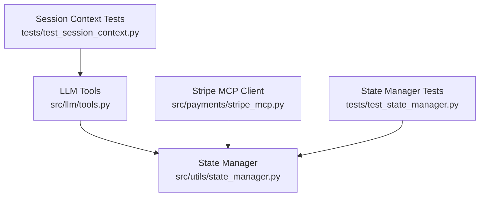
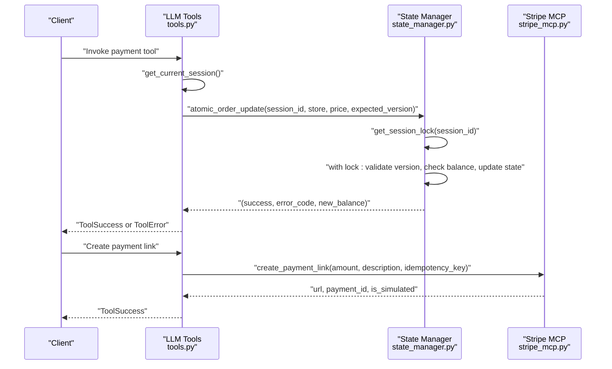
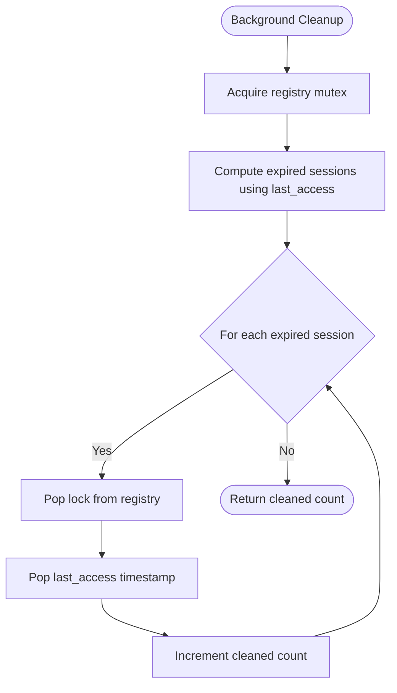
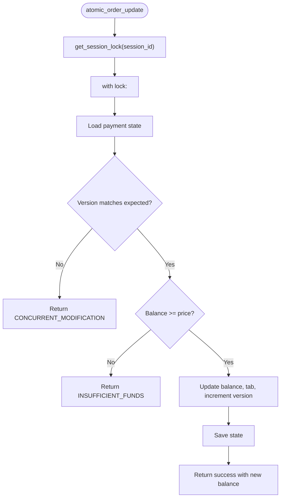
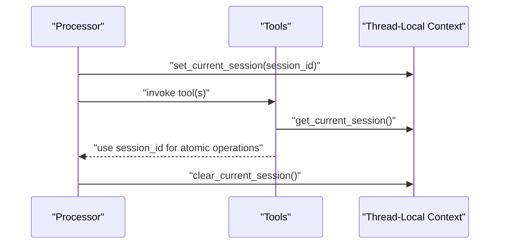
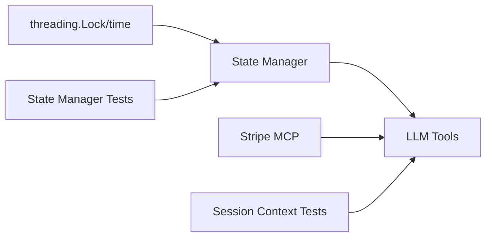

# Concurrency and Thread Safety

<cite>
**Referenced Files in This Document**
- [state_manager.py](file://src/utils/state_manager.py)
- [tools.py](file://src/llm/tools.py)
- [test_session_context.py](file://tests/test_session_context.py)
- [test_state_manager.py](file://tests/test_state_manager.py)
- [stripe_mcp.py](file://src/payments/stripe_mcp.py)
</cite>

## Table of Contents
1. [Introduction](#introduction)
2. [Project Structure](#project-structure)
3. [Core Components](#core-components)
4. [Architecture Overview](#architecture-overview)
5. [Detailed Component Analysis](#detailed-component-analysis)
6. [Dependency Analysis](#dependency-analysis)
7. [Performance Considerations](#performance-considerations)
8. [Troubleshooting Guide](#troubleshooting-guide)
9. [Conclusion](#conclusion)

## Introduction
This document explains the concurrency control system that ensures thread-safe state management and session locking in the application. It covers:
- Session lock mechanism using threading.Lock with persistent lock instances to prevent race conditions
- Session expiry system with a background task and configuration
- Atomic operation patterns for payment updates using optimistic locking with version checking
- Proper lock acquisition and release patterns, deadlock prevention, and thread-safety considerations
- Guidance on debugging concurrency issues, monitoring lock contention, and optimizing concurrent access

## Project Structure
The concurrency control system spans several modules:
- State management with thread-safe session locking and payment state
- LLM tools that integrate with session context and use atomic operations
- Tests validating session context isolation and state manager atomicity
- Stripe MCP client for payment orchestration (non-blocking async)

**Diagram sources**
- [state_manager.py](file://src/utils/state_manager.py#L190-L282)
- [tools.py](file://src/llm/tools.py#L13-L26)
- [stripe_mcp.py](file://src/payments/stripe_mcp.py#L66-L108)
- [test_state_manager.py](file://tests/test_state_manager.py#L12-L36)
- [test_session_context.py](file://tests/test_session_context.py#L7-L12)

**Section sources**
- [state_manager.py](file://src/utils/state_manager.py#L190-L282)
- [tools.py](file://src/llm/tools.py#L13-L26)
- [stripe_mcp.py](file://src/payments/stripe_mcp.py#L66-L108)
- [test_state_manager.py](file://tests/test_state_manager.py#L12-L36)
- [test_session_context.py](file://tests/test_session_context.py#L7-L12)

## Core Components
- Session lock registry and mutex: Ensures each session_id maps to a single persistent threading.Lock instance and guards the registry itself.
- Session expiry: Tracks last access time and cleans up stale locks via a background task.
- Atomic payment operations: Provide optimistic locking with version checks and error signaling for concurrent modifications.
- Thread-local session context: Enables tools to access the current session without explicit parameters, with thread isolation guarantees.

Key constants and functions:
- SESSION_EXPIRY_SECONDS: Default session expiry threshold
- get_session_lock(session_id): Returns a persistent lock for a session
- cleanup_session_lock(session_id): Removes a lock on session invalidation/reset
- cleanup_expired_session_locks(max_age_seconds): Background cleanup task
- atomic_order_update(..., expected_version): Optimistic locking for payment updates
- atomic_payment_complete(...): Atomic reset of payment state with version checks
- get_current_session/set_current_session/clear_current_session: Thread-local session context

**Section sources**
- [state_manager.py](file://src/utils/state_manager.py#L190-L282)
- [state_manager.py](file://src/utils/state_manager.py#L685-L757)
- [state_manager.py](file://src/utils/state_manager.py#L780-L814)
- [tools.py](file://src/llm/tools.py#L168-L200)

## Architecture Overview
The concurrency control architecture centers on per-session locks and optimistic locking for payment state. The LLM tools rely on thread-local session context to coordinate atomic operations safely.

**Diagram sources**
- [tools.py](file://src/llm/tools.py#L13-L26)
- [state_manager.py](file://src/utils/state_manager.py#L685-L757)
- [stripe_mcp.py](file://src/payments/stripe_mcp.py#L183-L273)

## Detailed Component Analysis

### Session Locking and Expiry
- Persistent lock instances: A registry maps session_id to a threading.Lock. The registry is protected by a mutex to ensure safe creation and access. Lock instances persist until explicit cleanup to avoid race conditions caused by garbage collection.
- Last-access tracking: A separate registry tracks last access timestamps to support expiration.
- Expiry policy: A background task enumerates sessions older than the configured threshold and removes their locks and timestamps. It logs cleaned counts and is designed to be fail-safe and idempotent.

**Diagram sources**
- [state_manager.py](file://src/utils/state_manager.py#L245-L282)

Operational guidance embedded in the code:
- Scheduler: Use a simple timer inside the app process
- Frequency: Run periodically (e.g., every 10 minutes)
- Startup/shutdown: Register/unregister timers at app lifecycle boundaries
- Error handling: Catch exceptions, log, and continue
- Monitoring: Log cleaned counts and emit metrics when integrated

**Section sources**
- [state_manager.py](file://src/utils/state_manager.py#L190-L282)

### Atomic Payment Operations
Atomic order update:
- Acquires the session lock
- Reads current balance, tab, and version
- Validates expected version (optimistic locking)
- Checks sufficient funds
- If valid, atomically updates balance, tab, and increments version
- Returns success or error codes

**Diagram sources**
- [state_manager.py](file://src/utils/state_manager.py#L685-L757)

Atomic payment completion:
- Acquires the session lock
- Resets tab and tip fields
- Sets payment_status to completed
- Returns success or False on exception

**Section sources**
- [state_manager.py](file://src/utils/state_manager.py#L685-L757)
- [state_manager.py](file://src/utils/state_manager.py#L780-L814)

### Thread-Local Session Context
- Thread-local storage holds the current session_id for tools
- Tools can read the session context without explicit parameters
- Lifecycle: set before processing, clear in finally to guarantee cleanup
- Tests confirm thread isolation and error-handling behavior

**Diagram sources**
- [tools.py](file://src/llm/tools.py#L168-L200)
- [test_session_context.py](file://tests/test_session_context.py#L121-L209)

**Section sources**
- [tools.py](file://src/llm/tools.py#L168-L200)
- [test_session_context.py](file://tests/test_session_context.py#L70-L116)
- [test_session_context.py](file://tests/test_session_context.py#L118-L209)

### Payment Tools Integration
- Tools import atomic operations and error codes from the state manager
- They translate internal error codes into structured ToolError responses with human-readable messages
- Thread-local session context enables tools to operate without explicit session parameters

**Section sources**
- [tools.py](file://src/llm/tools.py#L13-L26)
- [tools.py](file://src/llm/tools.py#L52-L131)

## Dependency Analysis
- State Manager depends on threading.Lock and time for session locking and expiry
- LLM Tools depend on State Manager for atomic operations and on Stripe MCP for payment orchestration
- Tests validate both session context isolation and atomic operation correctness

**Diagram sources**
- [state_manager.py](file://src/utils/state_manager.py#L3-L8)
- [tools.py](file://src/llm/tools.py#L13-L27)
- [stripe_mcp.py](file://src/payments/stripe_mcp.py#L16-L23)
- [test_state_manager.py](file://tests/test_state_manager.py#L12-L36)
- [test_session_context.py](file://tests/test_session_context.py#L7-L12)

**Section sources**
- [state_manager.py](file://src/utils/state_manager.py#L3-L8)
- [tools.py](file://src/llm/tools.py#L13-L27)
- [stripe_mcp.py](file://src/payments/stripe_mcp.py#L16-L23)
- [test_state_manager.py](file://tests/test_state_manager.py#L12-L36)
- [test_session_context.py](file://tests/test_session_context.py#L7-L12)

## Performance Considerations
- Lock granularity: Per-session locks minimize contention among unrelated sessions
- Expiration: Background cleanup reduces memory footprint by removing unused locks
- Optimistic locking: Version checks avoid long-held locks and reduce contention for payment updates
- Asynchronous payment orchestration: Stripe MCP uses non-blocking async retries to avoid blocking request threads

[No sources needed since this section provides general guidance]

## Troubleshooting Guide
Common concurrency issues and remedies:
- Deadlocks: Ensure locks are acquired in a consistent order and released promptly. Avoid nested lock acquisitions within the same thread. The code uses per-session locks with short critical sections, reducing risk.
- Race conditions: Use get_session_lock(session_id) to obtain a lock instance and acquire it with a context manager. Release is automatic.
- Memory leaks: Always call cleanup_session_lock(session_id) when resetting or expiring sessions. The background cleanup task removes stale locks.
- Version conflicts: On CONCURRENT_MODIFICATION, instruct clients to retry the operation. The state manager returns this error code when the expected version mismatches.
- Logging and metrics: The code logs significant events and cleanup counts. Integrate metrics emission for monitoring lock contention and cleanup activity.

Debugging steps:
- Verify thread-local session context is set/cleared around tool invocations
- Confirm atomic operations return expected error codes and update state consistently
- Monitor background cleanup logs and counts

**Section sources**
- [state_manager.py](file://src/utils/state_manager.py#L190-L282)
- [state_manager.py](file://src/utils/state_manager.py#L685-L757)
- [tools.py](file://src/llm/tools.py#L168-L200)
- [test_session_context.py](file://tests/test_session_context.py#L118-L209)
- [test_state_manager.py](file://tests/test_state_manager.py#L362-L370)

## Conclusion
The system achieves robust thread safety through:
- Persistent per-session locks guarded by a mutex
- Background session expiry to prevent resource leaks
- Optimistic locking with version checks for atomic payment updates
- Thread-local session context for seamless tool integration

Adhering to the lock acquisition/release patterns and using the provided atomic operations ensures correctness under concurrent access while maintaining performance and observability.