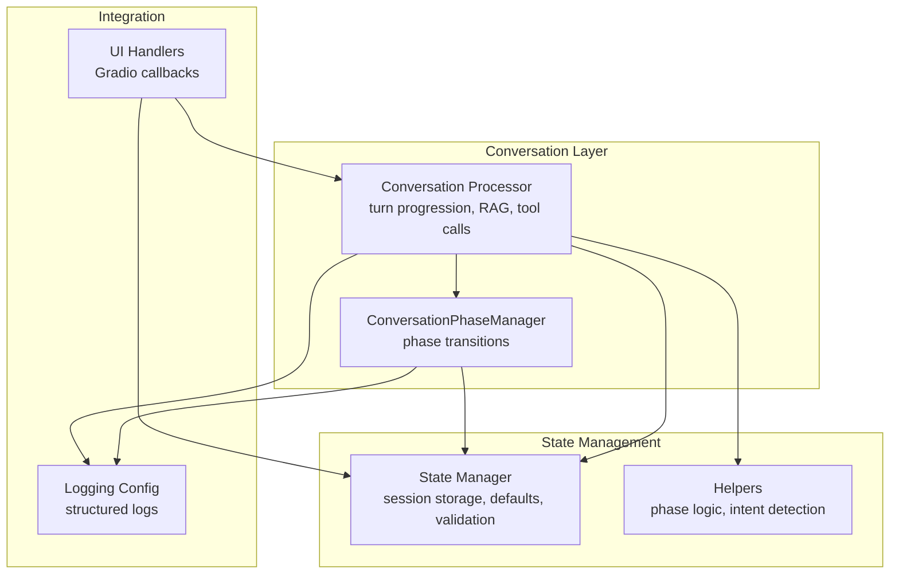
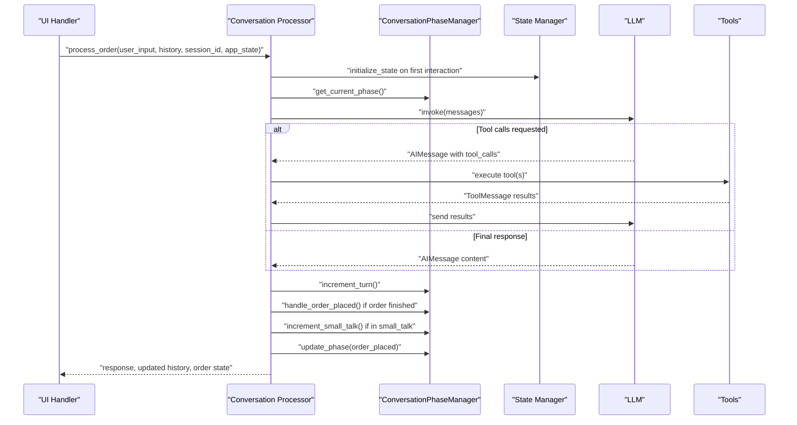
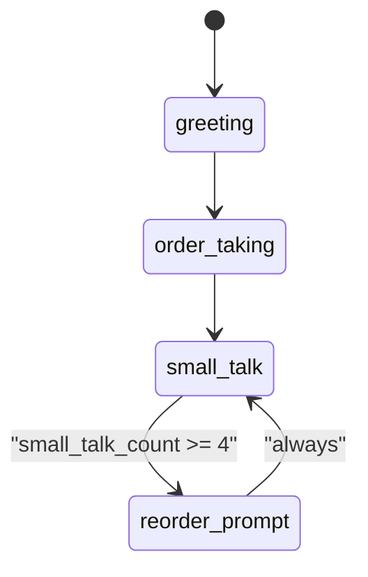
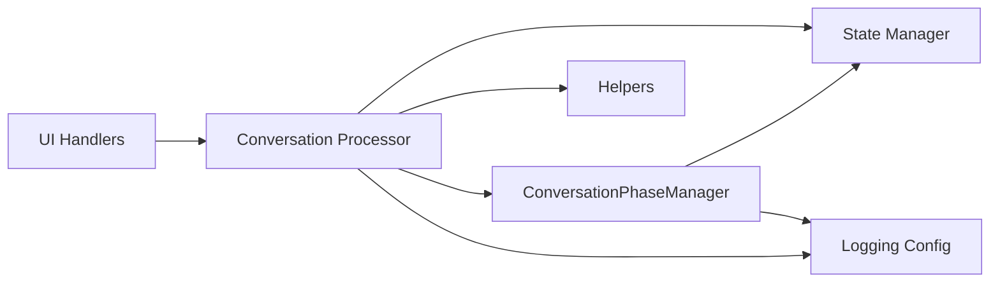

# Conversation State API

<cite>
**Referenced Files in This Document**
- [phase_manager.py](file://src/conversation/phase_manager.py)
- [processor.py](file://src/conversation/processor.py)
- [state_manager.py](file://src/utils/state_manager.py)
- [helpers.py](file://src/utils/helpers.py)
- [handlers.py](file://src/ui/handlers.py)
- [logging_config.py](file://src/config/logging_config.py)
- [test_phase_manager.py](file://tests/test_phase_manager.py)
- [test_state_manager.py](file://tests/test_state_manager.py)
</cite>

## Table of Contents
1. [Introduction](#introduction)
2. [Project Structure](#project-structure)
3. [Core Components](#core-components)
4. [Architecture Overview](#architecture-overview)
5. [Detailed Component Analysis](#detailed-component-analysis)
6. [Dependency Analysis](#dependency-analysis)
7. [Performance Considerations](#performance-considerations)
8. [Troubleshooting Guide](#troubleshooting-guide)
9. [Conclusion](#conclusion)

## Introduction
This document describes the Conversation State API used by the Maya Bartender Agent for managing multi-turn dialogues and preserving context across interactions. It focuses on the conversation state data structure, phase management, update mechanisms, validation, error recovery, and monitoring strategies. The API centers around a conversation state dictionary with four key fields: turn_count, phase, last_order_time, and small_talk_count. These fields coordinate the agent’s behavior across greeting, ordering, payment, and completion phases, while maintaining context window limits and synchronizing state across turns.

## Project Structure
The Conversation State API spans several modules:
- Conversation orchestration and phase management
- State persistence and retrieval
- Utility helpers for phase transitions and intent detection
- UI handlers that integrate state updates into the Gradio interface
- Logging configuration for observability

**Diagram sources**
- [phase_manager.py](file://src/conversation/phase_manager.py#L10-L92)
- [processor.py](file://src/conversation/processor.py#L73-L456)
- [state_manager.py](file://src/utils/state_manager.py#L285-L446)
- [helpers.py](file://src/utils/helpers.py#L71-L112)
- [handlers.py](file://src/ui/handlers.py#L23-L184)
- [logging_config.py](file://src/config/logging_config.py#L1-L51)

**Section sources**
- [phase_manager.py](file://src/conversation/phase_manager.py#L1-L92)
- [processor.py](file://src/conversation/processor.py#L1-L456)
- [state_manager.py](file://src/utils/state_manager.py#L1-L814)
- [helpers.py](file://src/utils/helpers.py#L1-L265)
- [handlers.py](file://src/ui/handlers.py#L1-L392)
- [logging_config.py](file://src/config/logging_config.py#L1-L51)

## Core Components
- ConversationPhaseManager: Manages phase transitions, turn counting, small talk tracking, and order placement updates.
- Conversation Processor: Orchestrates multi-turn processing, integrates RAG for casual conversation, executes tool calls, and updates state after each turn.
- State Manager: Provides thread-safe session storage, default templates, getters/setters, and validation for conversation and payment state.
- Helpers: Implements phase transition logic and intent detection to drive conversation flow.
- UI Handlers: Bridge Gradio events to the processor and propagate state updates to the UI.

Key responsibilities:
- Conversation state data structure: turn_count, phase, last_order_time, small_talk_count
- Phase management: greeting → order_taking → small_talk → reorder_prompt
- Turn progression: increment_turn, increment_small_talk, handle_order_placed
- Context window maintenance: limited history passed to the LLM
- State synchronization: session-scoped state stored in app_state

**Section sources**
- [phase_manager.py](file://src/conversation/phase_manager.py#L10-L92)
- [processor.py](file://src/conversation/processor.py#L73-L456)
- [state_manager.py](file://src/utils/state_manager.py#L285-L446)
- [helpers.py](file://src/utils/helpers.py#L71-L112)

## Architecture Overview
The Conversation State API follows a layered architecture:
- UI layer triggers processing with user input and session context.
- Processor orchestrates LLM invocation, tool execution, and state updates.
- Phase manager encapsulates phase logic and updates.
- State manager provides persistent, thread-safe session storage.
- Helpers supply deterministic phase transitions and intent detection.

**Diagram sources**
- [processor.py](file://src/conversation/processor.py#L120-L443)
- [phase_manager.py](file://src/conversation/phase_manager.py#L18-L67)
- [state_manager.py](file://src/utils/state_manager.py#L394-L446)

## Detailed Component Analysis

### Conversation State Data Structure
The conversation state dictionary resides under each session’s data and includes:
- turn_count: Non-negative integer representing cumulative turns.
- phase: String indicating current conversation stage among greeting, order_taking, small_talk, reorder_prompt.
- last_order_time: Integer turn index when the last order was placed.
- small_talk_count: Integer counter for consecutive small talk turns.

Default template and retrieval:
- Default template initializes all fields to sensible defaults.
- Retrieval returns a copy to prevent unintended mutations.
- Updates are applied atomically via update_conversation_state.

Validation and migration:
- On first access, missing fields are populated with defaults.
- Migration logic ensures backward compatibility for existing sessions.

**Section sources**
- [state_manager.py](file://src/utils/state_manager.py#L285-L341)
- [state_manager.py](file://src/utils/state_manager.py#L344-L380)
- [state_manager.py](file://src/utils/state_manager.py#L408-L446)

### Phase Management System
Phases and transitions:
- greeting: Initial phase for first interaction.
- order_taking: Active ordering phase.
- small_talk: Casual conversation phase; increments small_talk_count.
- reorder_prompt: Prompts user to order again after a cycle; resets small_talk_count.

Transition logic:
- First interaction moves from greeting to order_taking.
- After placing an order, transitions to small_talk and resets small_talk_count.
- In small_talk, after a threshold of turns, transitions to reorder_prompt.
- After reorder_prompt, returns to small_talk and resets small_talk_count.

**Diagram sources**
- [helpers.py](file://src/utils/helpers.py#L71-L112)

**Section sources**
- [helpers.py](file://src/utils/helpers.py#L71-L112)
- [phase_manager.py](file://src/conversation/phase_manager.py#L42-L67)

### Conversation State Update Mechanisms
Turn progression:
- increment_turn: Increments turn_count after each processed turn.
- increment_small_talk: Only increments when currently in small_talk phase.

Order placement:
- handle_order_placed: Records last_order_time as current turn_count and resets small_talk_count.

Phase transitions:
- update_phase: Computes next phase using determine_next_phase and updates state atomically.

Context window maintenance:
- The processor limits the conversation history sent to the LLM to a fixed number of recent messages.

State synchronization:
- All updates are persisted via update_conversation_state, which writes back to the session store.
- Session locks ensure thread-safe access for concurrent requests.

**Section sources**
- [phase_manager.py](file://src/conversation/phase_manager.py#L23-L67)
- [processor.py](file://src/conversation/processor.py#L412-L425)
- [state_manager.py](file://src/utils/state_manager.py#L426-L446)

### Examples

#### Example 1: Conversation State Initialization
- On first interaction, initialize_state creates default conversation state for the session.
- The processor detects empty history and calls initialization automatically.

**Section sources**
- [processor.py](file://src/conversation/processor.py#L123-L127)
- [state_manager.py](file://src/utils/state_manager.py#L394-L407)

#### Example 2: Phase Transition After Order Placement
- After an order is placed, handle_order_placed records last_order_time and resets small_talk_count.
- update_phase transitions to small_talk and logs the change.

**Section sources**
- [phase_manager.py](file://src/conversation/phase_manager.py#L34-L67)

#### Example 3: Context Preservation Patterns
- The processor builds messages with a limited history window and appends the latest user input.
- RAG enhancement is conditionally applied for casual conversation to preserve context.

**Section sources**
- [processor.py](file://src/conversation/processor.py#L244-L271)
- [processor.py](file://src/conversation/processor.py#L299-L362)

### Validation, Error Recovery, and Debugging
Validation:
- State retrieval returns copies to avoid mutation.
- Payment state validation enforces strict constraints; similar patterns apply to conversation state updates.

Error recovery:
- The processor wraps processing in a try/finally block to ensure session context cleanup.
- Security scanning blocks unsafe inputs/outputs and returns sanitized messages.
- UI handlers catch exceptions and return safe fallback states.

Debugging:
- Logging is configured centrally; components log meaningful transitions and errors.
- Tests validate state updates and phase transitions.

**Section sources**
- [state_manager.py](file://src/utils/state_manager.py#L408-L446)
- [processor.py](file://src/conversation/processor.py#L103-L114)
- [processor.py](file://src/conversation/processor.py#L445-L456)
- [handlers.py](file://src/ui/handlers.py#L97-L118)
- [logging_config.py](file://src/config/logging_config.py#L7-L39)

## Dependency Analysis
The Conversation State API exhibits clear separation of concerns:
- Processor depends on Phase Manager, State Manager, and Helpers.
- Phase Manager depends on State Manager and Helpers.
- UI Handlers depend on Processor and State Manager.
- Logging is injected via a shared configuration module.

**Diagram sources**
- [handlers.py](file://src/ui/handlers.py#L23-L184)
- [processor.py](file://src/conversation/processor.py#L73-L456)
- [phase_manager.py](file://src/conversation/phase_manager.py#L1-L92)
- [state_manager.py](file://src/utils/state_manager.py#L1-L814)
- [helpers.py](file://src/utils/helpers.py#L1-L265)
- [logging_config.py](file://src/config/logging_config.py#L1-L51)

**Section sources**
- [handlers.py](file://src/ui/handlers.py#L1-L392)
- [processor.py](file://src/conversation/processor.py#L1-L456)
- [phase_manager.py](file://src/conversation/phase_manager.py#L1-L92)
- [state_manager.py](file://src/utils/state_manager.py#L1-L814)
- [helpers.py](file://src/utils/helpers.py#L1-L265)
- [logging_config.py](file://src/config/logging_config.py#L1-L51)

## Performance Considerations
- Context window sizing: The processor limits the history passed to the LLM to reduce token usage and latency.
- Conditional RAG: RAG is only invoked for casual conversation to avoid unnecessary overhead.
- Session locking: Thread-safe access prevents contention and race conditions.
- Logging levels: Centralized logging configuration enables tuning verbosity for production.

[No sources needed since this section provides general guidance]

## Troubleshooting Guide
Common issues and resolutions:
- State not updating: Verify update_conversation_state is called and app_state is provided to processors.
- Phase stuck: Ensure update_phase(order_placed) is invoked after order placement.
- Memory leaks: Confirm cleanup_session_lock is called on session reset.
- Logging gaps: Check logging_config setup and ensure components use get_logger.

Validation and tests:
- Unit tests confirm state initialization, updates, and phase transitions.
- Edge cases covered include high turn counts and session isolation.

**Section sources**
- [test_state_manager.py](file://tests/test_state_manager.py#L53-L110)
- [test_phase_manager.py](file://tests/test_phase_manager.py#L32-L185)
- [state_manager.py](file://src/utils/state_manager.py#L207-L282)

## Conclusion
The Conversation State API provides a robust foundation for multi-turn dialogue management in Maya. By structuring conversation state around turn_count, phase, last_order_time, and small_talk_count, and by encapsulating phase transitions in a dedicated manager, the system achieves predictable behavior across long-running conversations. With careful attention to context window maintenance, state synchronization, validation, and logging, the API supports scalable and maintainable conversational experiences.