# Order State API

<cite>
**Referenced Files in This Document**
- [state_manager.py](file://src/utils/state_manager.py)
- [test_state_manager.py](file://tests/test_state_manager.py)
- [tools.py](file://src/llm/tools.py)
- [processor.py](file://src/conversation/processor.py)
- [test_payment_properties.py](file://tests/test_payment_properties.py)
- [tasks.md](file://.kiro/specs/stripe-payment/tasks.md)
</cite>

## Table of Contents
1. [Introduction](#introduction)
2. [Project Structure](#project-structure)
3. [Core Components](#core-components)
4. [Architecture Overview](#architecture-overview)
5. [Detailed Component Analysis](#detailed-component-analysis)
6. [Dependency Analysis](#dependency-analysis)
7. [Performance Considerations](#performance-considerations)
8. [Troubleshooting Guide](#troubleshooting-guide)
9. [Conclusion](#conclusion)

## Introduction

The Order State API is a comprehensive system for managing drink ordering workflows in the MayaMCP bartending assistant. It provides atomic order state updates, payment integration, and robust error handling for concurrent modifications. The API manages three primary state areas: current order items, order history tracking, and payment state integration.

The system implements sophisticated concurrency control using thread-safe session locks, optimistic locking for atomic operations, and comprehensive validation for payment state consistency. It supports complex ordering scenarios including multi-item orders, tip calculations, and payment completion workflows.

## Project Structure

The Order State API is implemented primarily in the state management module with supporting components across the application:

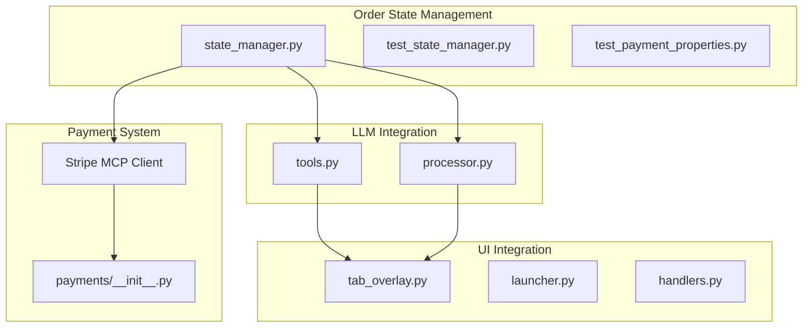

**Diagram sources**
- [state_manager.py](file://src/utils/state_manager.py#L1-L814)
- [tools.py](file://src/llm/tools.py#L840-L1039)
- [processor.py](file://src/conversation/processor.py#L150-L349)

**Section sources**
- [state_manager.py](file://src/utils/state_manager.py#L1-L814)
- [tools.py](file://src/llm/tools.py#L840-L1039)

## Core Components

### Order State Data Structure

The order state system maintains three interconnected data structures:

**Current Order Structure:**
```python
{
    'order': List[Dict[str, Any]],  # Active items in current order
    'finished': bool               # Completion status flag
}
```

**Order History Structure:**
```python
{
    'items': List[Dict[str, Any]],     # Complete order history
    'total_cost': float,               # Running total cost
    'paid': bool,                      # Payment completion flag
    'tip_amount': float,               # Applied tip amount
    'tip_percentage': float            # Applied tip percentage
}
```

**Default State Templates:**
The system provides comprehensive default templates ensuring consistent initialization across all sessions. These templates define baseline values for conversation state, order history, current order, and payment state.

### Payment State Integration

The order state API integrates seamlessly with the payment system through atomic operations:

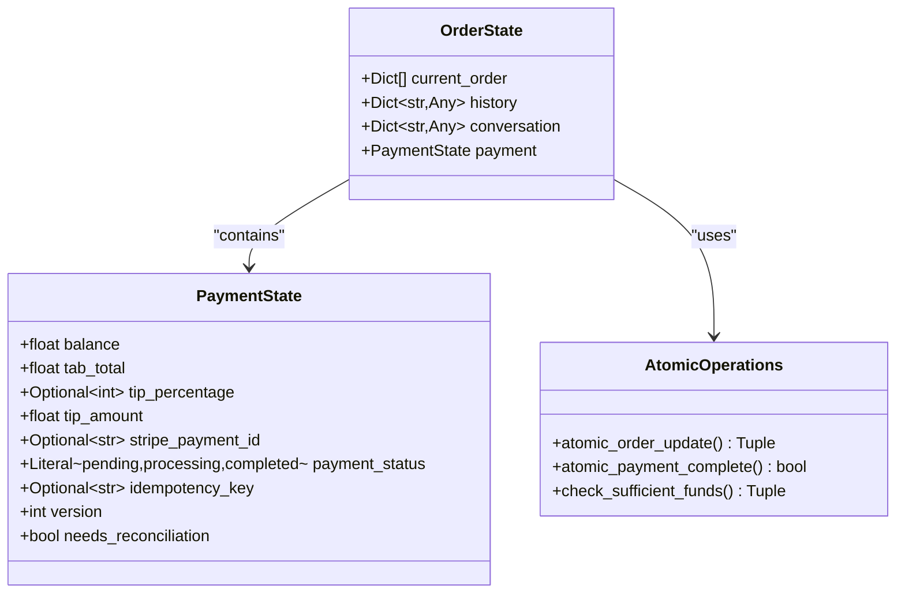

**Diagram sources**
- [state_manager.py](file://src/utils/state_manager.py#L17-L58)
- [state_manager.py](file://src/utils/state_manager.py#L447-L508)

**Section sources**
- [state_manager.py](file://src/utils/state_manager.py#L285-L304)
- [state_manager.py](file://src/utils/state_manager.py#L17-L58)

## Architecture Overview

The Order State API follows a layered architecture with clear separation of concerns:

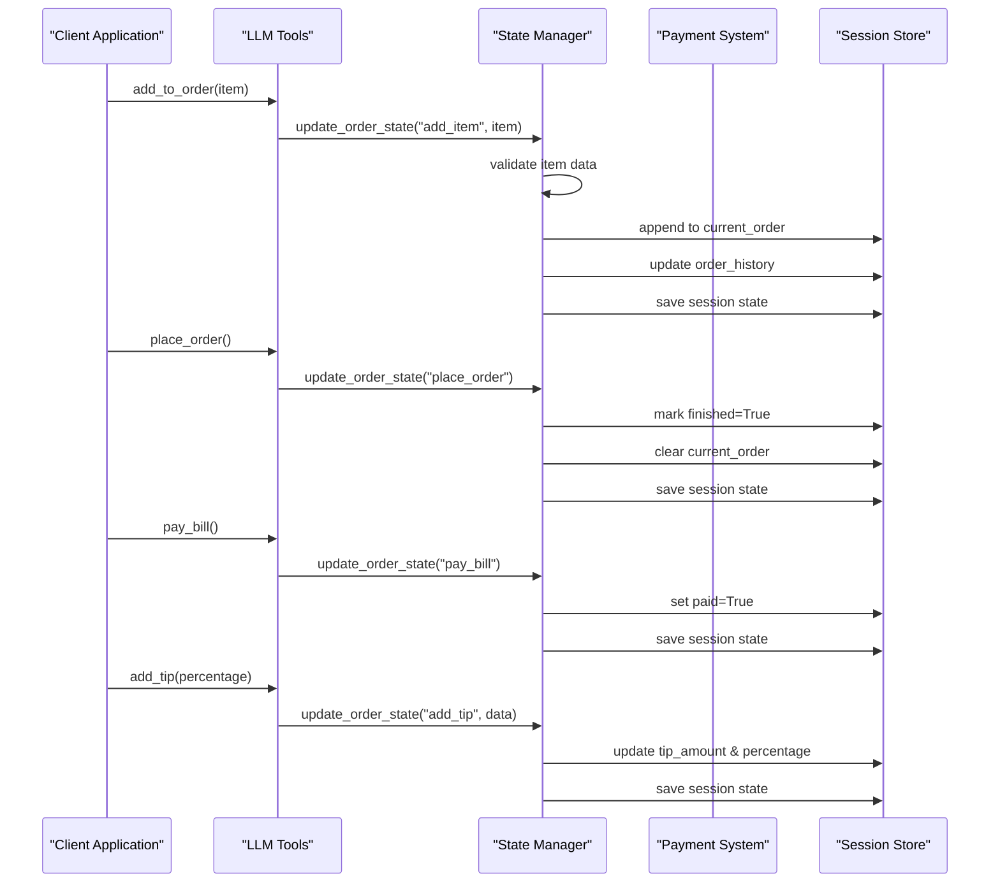

**Diagram sources**
- [tools.py](file://src/llm/tools.py#L842-L1039)
- [state_manager.py](file://src/utils/state_manager.py#L447-L508)

## Detailed Component Analysis

### Order State Update Mechanisms

The system provides five primary actions for order state management:

#### Add Item Action (`add_item`)
The `add_item` action processes new drink orders with comprehensive validation:

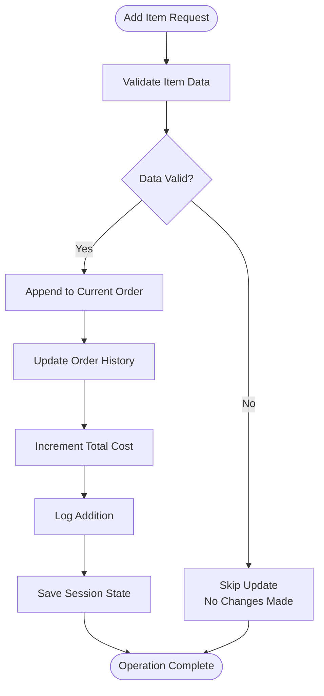

**Diagram sources**
- [state_manager.py](file://src/utils/state_manager.py#L470-L478)

#### Place Order Action (`place_order`)
The `place_order` action finalizes orders with atomic state changes:

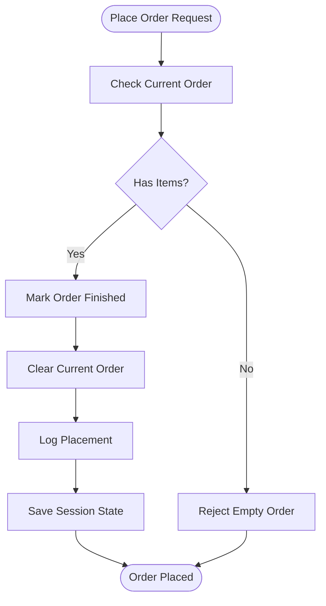

**Diagram sources**
- [state_manager.py](file://src/utils/state_manager.py#L480-L485)

#### Clear Order Action (`clear_order`)
The `clear_order` action resets order state while preserving history:

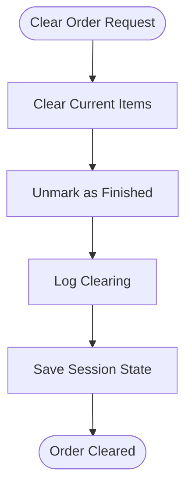

**Diagram sources**
- [state_manager.py](file://src/utils/state_manager.py#L487-L492)

#### Add Tip Action (`add_tip`)
The `add_tip` action calculates and applies tips with validation:

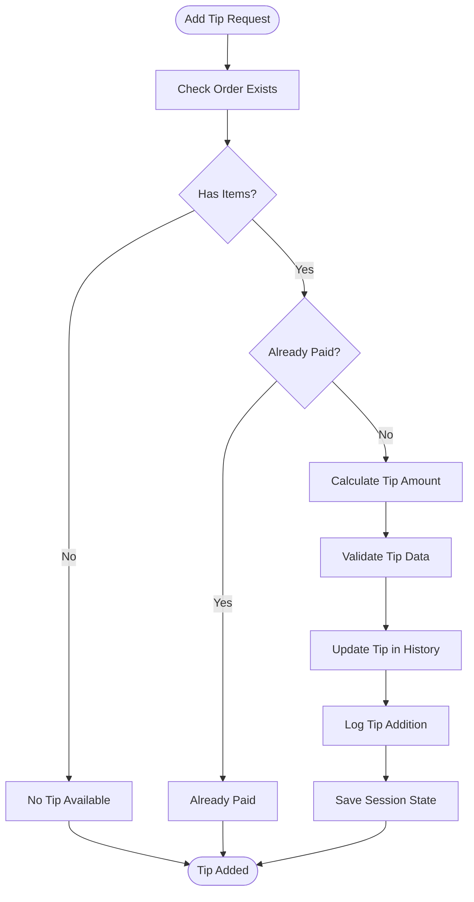

**Diagram sources**
- [state_manager.py](file://src/utils/state_manager.py#L494-L499)

#### Pay Bill Action (`pay_bill`)
The `pay_bill` action marks orders as paid:

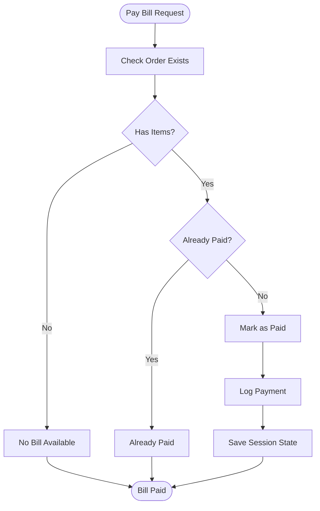

**Diagram sources**
- [state_manager.py](file://src/utils/state_manager.py#L501-L505)

### Payment State Integration

The order state API integrates with payment state through atomic operations:

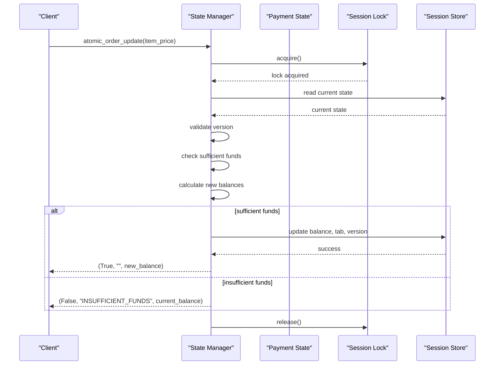

**Diagram sources**
- [state_manager.py](file://src/utils/state_manager.py#L685-L756)

**Section sources**
- [state_manager.py](file://src/utils/state_manager.py#L447-L508)
- [state_manager.py](file://src/utils/state_manager.py#L685-L756)

### Concurrency Control and Atomic Operations

The system implements sophisticated concurrency control using thread-safe session locks:

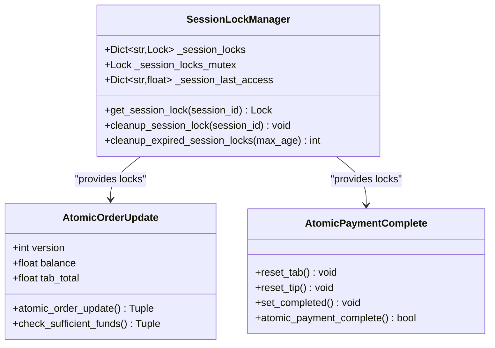

**Diagram sources**
- [state_manager.py](file://src/utils/state_manager.py#L194-L282)
- [state_manager.py](file://src/utils/state_manager.py#L685-L814)

**Section sources**
- [state_manager.py](file://src/utils/state_manager.py#L194-L282)
- [state_manager.py](file://src/utils/state_manager.py#L685-L814)

## Dependency Analysis

The Order State API has well-defined dependencies and relationships:

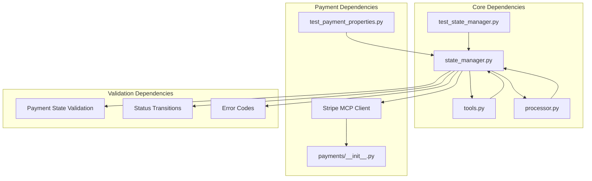

**Diagram sources**
- [state_manager.py](file://src/utils/state_manager.py#L66-L167)
- [tools.py](file://src/llm/tools.py#L842-L1039)

**Section sources**
- [state_manager.py](file://src/utils/state_manager.py#L66-L167)
- [tools.py](file://src/llm/tools.py#L842-L1039)

## Performance Considerations

The Order State API implements several performance optimization strategies:

### Thread-Safe Access Patterns
- Session locks prevent race conditions without blocking the entire system
- Optimistic locking reduces contention for concurrent operations
- Background cleanup tasks manage memory efficiently

### State Management Efficiency
- Deep copying of default states prevents mutation issues
- Efficient state serialization minimizes storage overhead
- Lazy initialization reduces startup costs

### Error Recovery Optimization
- Immediate rejection of invalid operations prevents wasted computation
- Graceful degradation ensures system stability under failure conditions
- Comprehensive logging enables targeted performance analysis

## Troubleshooting Guide

### Common Issues and Solutions

**Order State Inconsistency**
- Symptom: Order state appears inconsistent after concurrent operations
- Solution: Verify session locks are properly acquired and released
- Prevention: Use atomic operations for all state-changing actions

**Payment Validation Errors**
- Symptom: Payment state validation failures during updates
- Solution: Check payment state constraints and validation rules
- Prevention: Use provided validation functions before state updates

**Concurrency Conflicts**
- Symptom: Version mismatch errors during atomic operations
- Solution: Implement retry logic with exponential backoff
- Prevention: Design client applications to handle CONCURRENT_MODIFICATION gracefully

### Debugging Techniques

**State Inspection**
- Use `get_current_order_state()` to inspect current order items
- Use `get_order_history()` to examine order history
- Use `get_payment_state()` to review payment state

**Logging Analysis**
- Monitor INFO level logs for order operations
- Check DEBUG level logs for state updates
- Review ERROR level logs for validation failures

**Performance Monitoring**
- Track atomic operation success rates
- Monitor session lock contention
- Analyze payment state validation performance

**Section sources**
- [test_state_manager.py](file://tests/test_state_manager.py#L303-L370)
- [state_manager.py](file://src/utils/state_manager.py#L66-L167)

## Conclusion

The Order State API provides a robust foundation for drink ordering management in the MayaMCP system. Its comprehensive design addresses key challenges in concurrent modification, payment integration, and error recovery while maintaining high performance and reliability.

Key strengths of the system include:

- **Atomic Operations**: Ensures data consistency through atomic order updates and payment completions
- **Concurrent Safety**: Thread-safe session locks prevent race conditions without impacting performance
- **Comprehensive Validation**: Strict payment state validation prevents invalid states
- **Flexible Integration**: Seamless integration with LLM tools and UI components
- **Error Resilience**: Graceful error handling and recovery mechanisms

The API's modular design allows for easy extension and maintenance while providing clear interfaces for client applications. The extensive test coverage and property-based testing ensure reliability across complex usage scenarios.

Future enhancements could include additional payment methods, advanced tip calculation features, and expanded order history analytics capabilities.