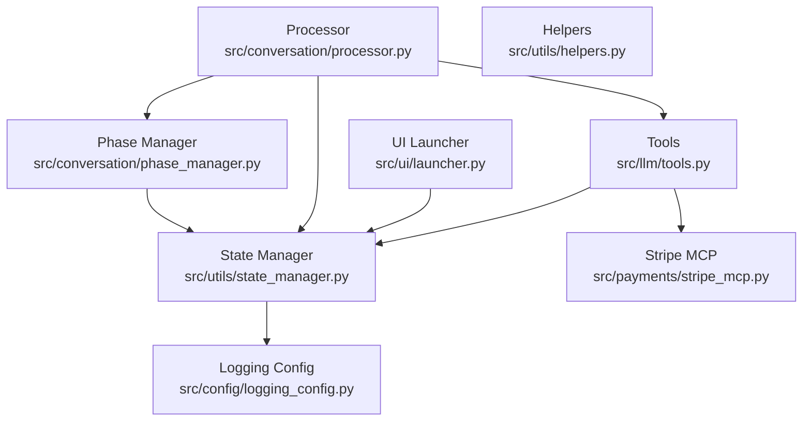
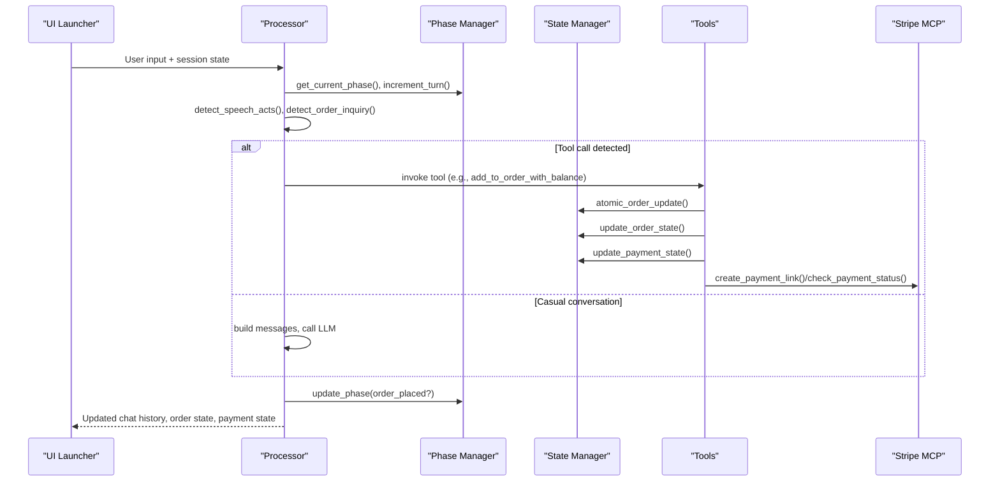
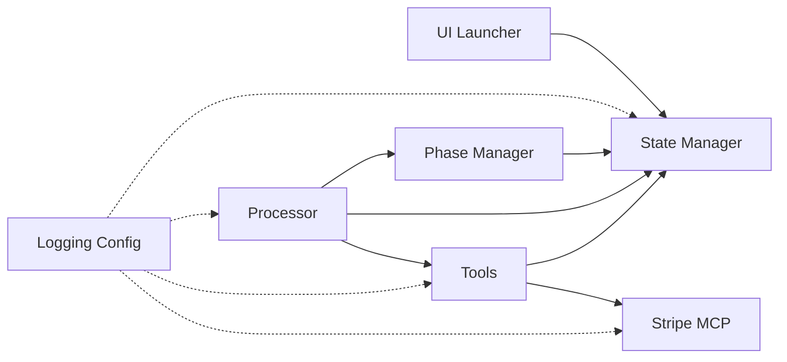

# State Management API

<cite>
**Referenced Files in This Document**
- [state_manager.py](file://src/utils/state_manager.py)
- [phase_manager.py](file://src/conversation/phase_manager.py)
- [processor.py](file://src/conversation/processor.py)
- [helpers.py](file://src/utils/helpers.py)
- [tools.py](file://src/llm/tools.py)
- [stripe_mcp.py](file://src/payments/stripe_mcp.py)
- [logging_config.py](file://src/config/logging_config.py)
- [launcher.py](file://src/ui/launcher.py)
- [test_state_manager.py](file://tests/test_state_manager.py)
</cite>

## Table of Contents
1. [Introduction](#introduction)
2. [Project Structure](#project-structure)
3. [Core Components](#core-components)
4. [Architecture Overview](#architecture-overview)
5. [Detailed Component Analysis](#detailed-component-analysis)
6. [Dependency Analysis](#dependency-analysis)
7. [Performance Considerations](#performance-considerations)
8. [Troubleshooting Guide](#troubleshooting-guide)
9. [Conclusion](#conclusion)
10. [Appendices](#appendices)

## Introduction
This document provides comprehensive API documentation for the state management system that powers session handling, conversation context, and persistent state storage in the Maya bartender agent. It covers:
- Session lifecycle and thread-safe access
- Conversation state architecture and phase transitions
- Payment state management including balance tracking, tip calculations, and transaction history
- Persistence mechanisms for state serialization, backup restoration, and concurrent access handling
- Examples of initialization, update patterns, and cleanup procedures
- Thread-safety considerations, validation rules, error recovery, debugging, monitoring, and performance optimization

## Project Structure
The state management system spans several modules:
- State manager utilities for session and state persistence
- Conversation phase manager for turn and phase orchestration
- Processor orchestrating LLM interactions and state updates
- Tools exposing payment operations to the LLM
- Stripe MCP client for payment link generation and status polling
- UI launcher integrating state with the Gradio interface
- Logging configuration for observability

**Diagram sources**
- [state_manager.py](file://src/utils/state_manager.py#L1-L814)
- [phase_manager.py](file://src/conversation/phase_manager.py#L1-L92)
- [processor.py](file://src/conversation/processor.py#L1-L456)
- [helpers.py](file://src/utils/helpers.py#L1-L265)
- [tools.py](file://src/llm/tools.py#L1-L1066)
- [stripe_mcp.py](file://src/payments/stripe_mcp.py#L1-L475)
- [logging_config.py](file://src/config/logging_config.py#L1-L51)
- [launcher.py](file://src/ui/launcher.py#L1-L354)

**Section sources**
- [state_manager.py](file://src/utils/state_manager.py#L1-L814)
- [phase_manager.py](file://src/conversation/phase_manager.py#L1-L92)
- [processor.py](file://src/conversation/processor.py#L1-L456)
- [helpers.py](file://src/utils/helpers.py#L1-L265)
- [tools.py](file://src/llm/tools.py#L1-L1066)
- [stripe_mcp.py](file://src/payments/stripe_mcp.py#L1-L475)
- [logging_config.py](file://src/config/logging_config.py#L1-L51)
- [launcher.py](file://src/ui/launcher.py#L1-L354)

## Core Components
- State Manager: Provides session initialization, conversation/order/payment state getters/setters, atomic operations, and thread-safe locking.
- Phase Manager: Manages conversation phases, turn counting, and small talk tracking.
- Processor: Orchestrates LLM interactions, applies speech act detection, invokes tools, and updates state.
- Tools: Expose payment operations (add to order, get balance, create payment link, check status, set tip) to the LLM.
- Stripe MCP Client: Integrates with Stripe via MCP for payment link creation and status polling with retry and fallback logic.
- UI Launcher: Bridges state to the Gradio interface, maintaining tab and balance overlays.

**Section sources**
- [state_manager.py](file://src/utils/state_manager.py#L394-L814)
- [phase_manager.py](file://src/conversation/phase_manager.py#L10-L92)
- [processor.py](file://src/conversation/processor.py#L83-L456)
- [tools.py](file://src/llm/tools.py#L221-L800)
- [stripe_mcp.py](file://src/payments/stripe_mcp.py#L66-L475)
- [launcher.py](file://src/ui/launcher.py#L49-L354)

## Architecture Overview
The system follows a layered architecture:
- UI Layer: Gradio interface manages chat history and state variables.
- Processor Layer: Processes user input, detects intents, orchestrates LLM/tool calls, and updates state.
- State Layer: Centralized session and state persistence with thread-safe access.
- Payment Layer: Tools and Stripe MCP client manage payment operations and reconciliation.
- Logging Layer: Unified logging configuration for observability.

**Diagram sources**
- [processor.py](file://src/conversation/processor.py#L83-L456)
- [phase_manager.py](file://src/conversation/phase_manager.py#L42-L92)
- [state_manager.py](file://src/utils/state_manager.py#L426-L814)
- [tools.py](file://src/llm/tools.py#L221-L800)
- [stripe_mcp.py](file://src/payments/stripe_mcp.py#L183-L475)
- [launcher.py](file://src/ui/launcher.py#L155-L354)

## Detailed Component Analysis

### State Manager API
The State Manager provides:
- Session initialization and reset
- Conversation state getters and setters
- Order state updates (add item, place order, clear order, add tip, pay bill)
- Payment state validation and updates
- Atomic operations for balance and tab updates
- Thread-safe session locking and cleanup

Key methods and behaviors:
- Initialization and reset
  - initialize_state(session_id, store): Resets session to default templates.
  - reset_session_state(session_id, store): Cleans up locks and reinitializes.
- Conversation state
  - get_conversation_state(session_id, store): Returns a copy of conversation state.
  - update_conversation_state(session_id, store, updates): Updates fields safely.
- Order state
  - get_order_history(session_id, store)
  - get_current_order_state(session_id, store)
  - update_order_state(action, data): Supports add_item, place_order, clear_order, add_tip, pay_bill.
  - is_order_finished(session_id, store)
  - get_order_total(session_id, store)
- Payment state
  - get_payment_state(session_id, store)
  - update_payment_state(session_id, store, updates): Validates transitions and constraints.
  - calculate_tip(tab_total, percentage)
  - set_tip(session_id, store, percentage): Toggle behavior for tip selection.
  - get_payment_total(session_id, store)
  - check_sufficient_funds(session_id, store, amount)
  - atomic_order_update(session_id, store, item_price, expected_version): Optimistic locking with version checks.
  - atomic_payment_complete(session_id, store): Resets tab, tip, and marks as completed.
- Concurrency and persistence
  - get_session_lock(session_id): Thread-safe session lock management.
  - cleanup_session_lock(session_id)
  - cleanup_expired_session_locks(max_age_seconds): Background cleanup routine.
  - _get_session_data(session_id, store): Initializes and migrates session data.
  - _save_session_data(session_id, store, data): Persists session data.

Validation and constraints:
- PaymentState schema enforces numeric bounds, enum-like statuses, and idempotency patterns.
- Status transitions are validated to prevent backwards transitions.
- Tip fields are migrated for backward compatibility.

Thread safety:
- Session locks protect critical sections during atomic operations.
- Mutex guards shared lock registry and last-access timestamps.
- Version field enables optimistic concurrency control.

Persistence and migration:
- Default templates ensure consistent initialization.
- Migration logic adds missing fields to existing sessions.
- Deep copies prevent accidental mutation of defaults.

Examples:
- Initialize a session and add items to order
  - See [test_state_manager.py](file://tests/test_state_manager.py#L53-L110)
- Place order and add tip
  - See [test_state_manager.py](file://tests/test_state_manager.py#L139-L188)
- Atomic order update with insufficient funds
  - See [test_state_manager.py](file://tests/test_state_manager.py#L276-L302)

**Section sources**
- [state_manager.py](file://src/utils/state_manager.py#L394-L814)
- [test_state_manager.py](file://tests/test_state_manager.py#L53-L370)

### Conversation Phase Manager
The Phase Manager coordinates:
- Turn counting and small talk increments
- Phase transitions based on conversation state and actions
- Determining whether to use RAG for casual conversation

Key methods:
- get_current_phase(): Reads current phase from state.
- increment_turn(): Increments turn count.
- increment_small_talk(): Increments small talk counter when in small talk phase.
- handle_order_placed(): Updates last order time and resets small talk counter.
- update_phase(order_placed): Computes next phase using helper logic.
- should_use_rag(user_input): Determines RAG usage for casual conversation.
- reset_phase(): Resets phase to greeting.

Phase transitions:
- Greeting → Order Taking (first interaction)
- Order Taking → Small Talk (after placing order)
- Small Talk → Reorder Prompt (after 4 consecutive small talk turns)
- Reorder Prompt → Small Talk (regardless of outcome)

**Section sources**
- [phase_manager.py](file://src/conversation/phase_manager.py#L10-L92)
- [helpers.py](file://src/utils/helpers.py#L71-L112)

### Processor API
The Processor orchestrates:
- Input security scanning
- Session initialization on first interaction
- Speech act and intent detection
- Tool invocation for order and payment operations
- RAG enhancement for casual conversation
- Updating conversation state and phase

Key behaviors:
- process_order(user_input_text, current_session_history, llm, ...): Main processing loop.
- Security scanning for input and output.
- Speech act detection to infer contextual drinks and confirm orders.
- Tool call execution with robust error handling.
- RAG enhancement using Memvid or FAISS pipelines.
- Phase updates after each interaction.

**Section sources**
- [processor.py](file://src/conversation/processor.py#L83-L456)
- [phase_manager.py](file://src/conversation/phase_manager.py#L42-L92)

### Payment Tools API
The Tools module exposes payment operations to the LLM:
- add_to_order_with_balance(item_name, modifiers, quantity): Adds item if balance suffices; uses atomic_order_update.
- get_balance(): Returns current balance and tab.
- create_stripe_payment(): Creates payment link via Stripe MCP client; stores idempotency key and payment status.
- check_payment_status(): Polls payment status; completes payment atomically on success.
- set_tip(percentage): Sets tip percentage with toggle behavior.
- get_tip(): Returns current tip and total.
- get_menu(): Returns the latest menu.
- add_to_order(item_name, modifiers, quantity): Backward-compatible ordering without balance checks.

Error handling:
- PaymentError enum defines standardized error codes and messages.
- Tool responses use ToolSuccess/ToolError structures.
- Thread-local session context and global store enable tool access without explicit parameters.

**Section sources**
- [tools.py](file://src/llm/tools.py#L221-L800)
- [stripe_mcp.py](file://src/payments/stripe_mcp.py#L66-L475)

### Stripe MCP Client
The Stripe MCP Client provides:
- Availability probing with caching
- Payment link creation with retry logic and exponential backoff
- Payment status polling with timeouts and deadlines
- Fallback to mock payments when unavailable
- Idempotency key generation

Retry and polling configuration:
- Max retries, delays, and overall timeout for link creation.
- Poll interval, per-poll timeout, and deadline for status checks.
- Availability cache TTL to reduce probe overhead.

**Section sources**
- [stripe_mcp.py](file://src/payments/stripe_mcp.py#L66-L475)

### UI Launcher Integration
The UI Launcher integrates state with the Gradio interface:
- Maintains chat history and order state as Gradio State variables.
- Manages payment state variables (tab, balance, tip) for overlay display.
- Generates avatar overlay HTML with current payment state.
- Wires events for submit, clear, and tip button clicks.

**Section sources**
- [launcher.py](file://src/ui/launcher.py#L49-L354)

## Dependency Analysis
The state management system exhibits clear separation of concerns:
- Processor depends on Phase Manager, State Manager, and Tools.
- Tools depend on State Manager and Stripe MCP Client.
- UI Launcher depends on State Manager for default values and overlay generation.
- Logging is centralized via logging_config.

**Diagram sources**
- [state_manager.py](file://src/utils/state_manager.py#L1-L814)
- [phase_manager.py](file://src/conversation/phase_manager.py#L1-L92)
- [processor.py](file://src/conversation/processor.py#L1-L456)
- [tools.py](file://src/llm/tools.py#L1-L1066)
- [stripe_mcp.py](file://src/payments/stripe_mcp.py#L1-L475)
- [logging_config.py](file://src/config/logging_config.py#L1-L51)
- [launcher.py](file://src/ui/launcher.py#L1-L354)

**Section sources**
- [state_manager.py](file://src/utils/state_manager.py#L1-L814)
- [phase_manager.py](file://src/conversation/phase_manager.py#L1-L92)
- [processor.py](file://src/conversation/processor.py#L1-L456)
- [tools.py](file://src/llm/tools.py#L1-L1066)
- [stripe_mcp.py](file://src/payments/stripe_mcp.py#L1-L475)
- [logging_config.py](file://src/config/logging_config.py#L1-L51)
- [launcher.py](file://src/ui/launcher.py#L1-L354)

## Performance Considerations
- Concurrency control: Session locks minimize contention; mutex protects shared lock registry.
- Optimistic locking: Version field reduces write conflicts and improves throughput.
- Caching: Availability cache for Stripe MCP reduces probe overhead.
- Logging: Centralized logging avoids repeated configuration overhead.
- RAG enhancement: Conditional enhancement reduces unnecessary pipeline invocations.
- Memory hygiene: Background cleanup of expired session locks prevents memory leaks.

[No sources needed since this section provides general guidance]

## Troubleshooting Guide
Common issues and resolutions:
- Insufficient funds during atomic order update
  - Use check_sufficient_funds to pre-validate balances.
  - Handle INSUFFICIENT_FUNDS error code from atomic_order_update.
- Concurrent modification errors
  - Retry atomic operations with updated expected_version.
  - Monitor CONCURRENT_MODIFICATION error code.
- Payment failures and timeouts
  - Verify payment status via check_payment_status.
  - Use fallback mock payments when Stripe is unavailable.
- State corruption or missing fields
  - Reset session state to recover defaults.
  - Ensure session locks are cleaned up after reset.
- Logging and debugging
  - Enable debug logging via environment variable to capture detailed traces.
  - Use unit tests to validate state transitions and payment operations.

**Section sources**
- [state_manager.py](file://src/utils/state_manager.py#L680-L814)
- [tools.py](file://src/llm/tools.py#L52-L131)
- [stripe_mcp.py](file://src/payments/stripe_mcp.py#L348-L475)
- [logging_config.py](file://src/config/logging_config.py#L7-L39)
- [test_state_manager.py](file://tests/test_state_manager.py#L362-L370)

## Conclusion
The state management system provides a robust, thread-safe foundation for session handling, conversation context, and payment operations. Its modular design enables clear separation of concerns, strong validation rules, and resilient error handling. By leveraging optimistic locking, careful migration strategies, and comprehensive logging, the system supports reliable operation under concurrent access and dynamic conversation flows.

[No sources needed since this section summarizes without analyzing specific files]

## Appendices

### API Reference Tables

#### State Manager Methods
- initialize_state(session_id, store)
- reset_session_state(session_id, store)
- get_conversation_state(session_id, store)
- update_conversation_state(session_id, store, updates)
- get_order_history(session_id, store)
- get_current_order_state(session_id, store)
- update_order_state(action, data)
- is_order_finished(session_id, store)
- get_order_total(session_id, store)
- get_payment_state(session_id, store)
- update_payment_state(session_id, store, updates)
- calculate_tip(tab_total, percentage)
- set_tip(session_id, store, percentage)
- get_payment_total(session_id, store)
- check_sufficient_funds(session_id, store, amount)
- atomic_order_update(session_id, store, item_price, expected_version)
- atomic_payment_complete(session_id, store)
- get_session_lock(session_id)
- cleanup_session_lock(session_id)
- cleanup_expired_session_locks(max_age_seconds)

**Section sources**
- [state_manager.py](file://src/utils/state_manager.py#L394-L814)

#### Phase Manager Methods
- get_current_phase()
- increment_turn()
- increment_small_talk()
- handle_order_placed()
- update_phase(order_placed)
- should_use_rag(user_input)
- reset_phase()

**Section sources**
- [phase_manager.py](file://src/conversation/phase_manager.py#L18-L92)

#### Tools Methods
- add_to_order_with_balance(item_name, modifiers, quantity)
- get_balance()
- create_stripe_payment()
- check_payment_status()
- set_tip(percentage)
- get_tip()
- get_menu()
- add_to_order(item_name, modifiers, quantity)

**Section sources**
- [tools.py](file://src/llm/tools.py#L221-L800)

#### Stripe MCP Client Methods
- generate_idempotency_key(session_id)
- is_available()
- create_payment_link(amount, description, idempotency_key, max_retries)
- check_payment_status(payment_id, poll_interval, poll_timeout, deadline)
- invalidate_availability_cache()

**Section sources**
- [stripe_mcp.py](file://src/payments/stripe_mcp.py#L109-L475)

### Validation Rules and Constraints
- PaymentState fields enforce numeric bounds, enum-like statuses, and idempotency patterns.
- Status transitions prevent backwards movement.
- Tip fields support toggle behavior and backward compatibility migration.
- Atomic operations enforce optimistic locking with version checks.

**Section sources**
- [state_manager.py](file://src/utils/state_manager.py#L17-L167)
- [state_manager.py](file://src/utils/state_manager.py#L642-L677)

### Example Workflows

#### Initializing and Managing a Session
- Initialize state for a new session.
- Add items to the current order.
- Place the order and add tip.
- Pay the bill and reset session state.

**Section sources**
- [test_state_manager.py](file://tests/test_state_manager.py#L53-L302)

#### Atomic Order Update Pattern
- Pre-check balance.
- Perform atomic update with optimistic locking.
- Handle insufficient funds and concurrent modification errors.

**Section sources**
- [state_manager.py](file://src/utils/state_manager.py#L685-L757)
- [tools.py](file://src/llm/tools.py#L272-L293)

#### Payment Link Creation and Status Polling
- Generate idempotency key.
- Create payment link with retries and fallback.
- Poll payment status and complete payment atomically.

**Section sources**
- [tools.py](file://src/llm/tools.py#L358-L472)
- [stripe_mcp.py](file://src/payments/stripe_mcp.py#L183-L441)