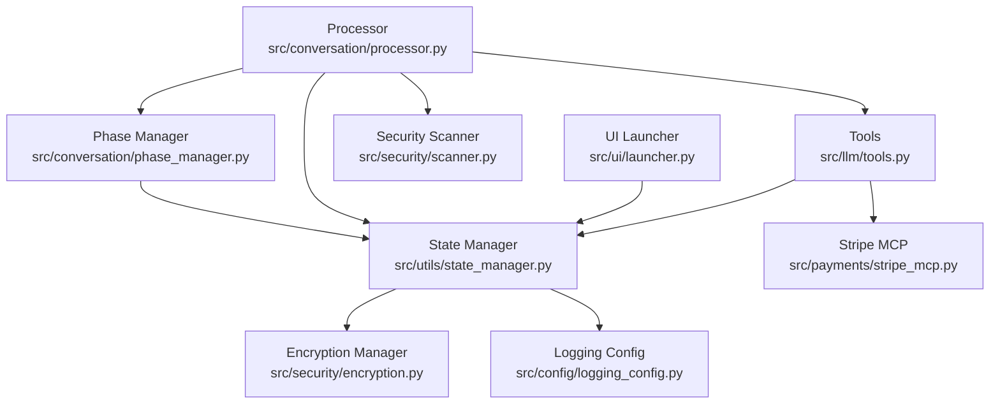
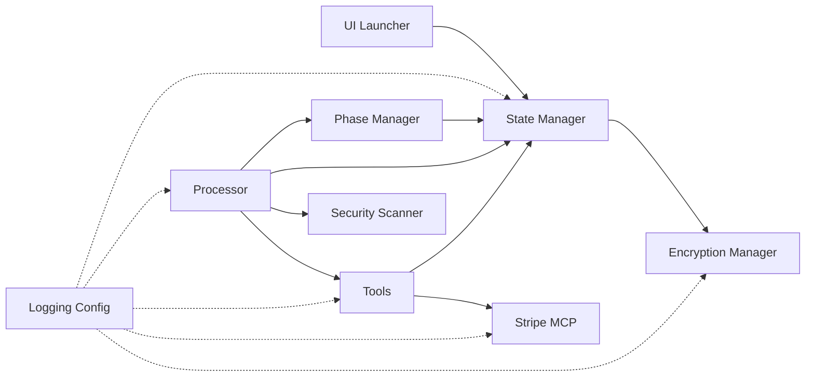

# State Management API

<cite>
**Referenced Files in This Document**
- [state_manager.py](file://src/utils/state_manager.py)
- [encryption.py](file://src/security/encryption.py)
- [scanner.py](file://src/security/scanner.py)
- [logging_config.py](file://src/config/logging_config.py)
- [phase_manager.py](file://src/conversation/phase_manager.py)
- [processor.py](file://src/conversation/processor.py)
- [helpers.py](file://src/utils/helpers.py)
- [tools.py](file://src/llm/tools.py)
- [stripe_mcp.py](file://src/payments/stripe_mcp.py)
- [launcher.py](file://src/ui/launcher.py)
- [test_state_manager.py](file://tests/test_state_manager.py)
- [test_security.py](file://tests/security/test_security.py)
</cite>

## Update Summary
**Changes Made**
- Enhanced state management with improved session state handling and encryption integration
- Added comprehensive API key security with Fernet encryption for sensitive data protection
- Integrated security scanner for input/output validation and prompt injection prevention
- Implemented logging redaction for sensitive information protection
- Improved coordination with encryption system for secure data persistence

## Table of Contents
1. [Introduction](#introduction)
2. [Project Structure](#project-structure)
3. [Core Components](#core-components)
4. [Architecture Overview](#architecture-overview)
5. [Detailed Component Analysis](#detailed-component-analysis)
6. [Security Integration](#security-integration)
7. [Dependency Analysis](#dependency-analysis)
8. [Performance Considerations](#performance-considerations)
9. [Troubleshooting Guide](#troubleshooting-guide)
10. [Conclusion](#conclusion)
11. [Appendices](#appendices)

## Introduction
This document provides comprehensive API documentation for the state management system that powers session handling, conversation context, and persistent state storage in the Maya bartender agent. The system has been enhanced with improved session state handling, better integration with new security features including encryption system, and improved coordination with encryption for secure data persistence. It covers:
- Session lifecycle and thread-safe access with encryption integration
- Conversation state architecture and phase transitions
- Payment state management including balance tracking, tip calculations, and transaction history
- API key security with Fernet encryption for sensitive data protection
- Security scanning for input/output validation and prompt injection prevention
- Persistence mechanisms for state serialization, backup restoration, and concurrent access handling
- Examples of initialization, update patterns, and cleanup procedures
- Thread-safety considerations, validation rules, error recovery, debugging, monitoring, and performance optimization

## Project Structure
The state management system spans several modules with enhanced security integration:
- State manager utilities for session and state persistence with encryption support
- Encryption manager for secure data protection using Fernet symmetric encryption
- Security scanner for input/output validation and prompt injection prevention
- Conversation phase manager for turn and phase orchestration
- Processor orchestrating LLM interactions, state updates, and security scanning
- Tools exposing payment operations to the LLM
- Stripe MCP client for payment link generation and status polling
- UI launcher integrating state with the Gradio interface
- Logging configuration with sensitive data redaction



**Diagram sources**
- [state_manager.py](file://src/utils/state_manager.py#L1-L867)
- [encryption.py](file://src/security/encryption.py#L1-L103)
- [scanner.py](file://src/security/scanner.py#L1-L156)
- [phase_manager.py](file://src/conversation/phase_manager.py#L1-L92)
- [processor.py](file://src/conversation/processor.py#L1-L480)
- [logging_config.py](file://src/config/logging_config.py#L1-L77)
- [tools.py](file://src/llm/tools.py#L1-L1066)
- [stripe_mcp.py](file://src/payments/stripe_mcp.py#L1-L475)
- [launcher.py](file://src/ui/launcher.py#L1-L354)

**Section sources**
- [state_manager.py](file://src/utils/state_manager.py#L1-L867)
- [encryption.py](file://src/security/encryption.py#L1-L103)
- [scanner.py](file://src/security/scanner.py#L1-L156)
- [phase_manager.py](file://src/conversation/phase_manager.py#L1-L92)
- [processor.py](file://src/conversation/processor.py#L1-L480)
- [logging_config.py](file://src/config/logging_config.py#L1-L77)
- [tools.py](file://src/llm/tools.py#L1-L1066)
- [stripe_mcp.py](file://src/payments/stripe_mcp.py#L1-L475)
- [launcher.py](file://src/ui/launcher.py#L1-L354)

## Core Components
- State Manager: Provides session initialization, conversation/order/payment state getters/setters, atomic operations, thread-safe locking, and API key encryption/decryption.
- Encryption Manager: Manages Fernet symmetric encryption for secure storage of sensitive data including API keys.
- Security Scanner: Performs input/output validation using llm-guard with fallback regex scanning for prompt injection and toxicity prevention.
- Phase Manager: Manages conversation phases, turn counting, and small talk tracking.
- Processor: Orchestrates LLM interactions, applies speech act detection, invokes tools, updates state, and performs security scanning.
- Tools: Expose payment operations (add to order, get balance, create payment link, check status, set tip) to the LLM.
- Stripe MCP Client: Integrates with Stripe via MCP for payment link creation and status polling with retry and fallback logic.
- UI Launcher: Bridges state to the Gradio interface, maintaining tab and balance overlays.

**Section sources**
- [state_manager.py](file://src/utils/state_manager.py#L394-L867)
- [encryption.py](file://src/security/encryption.py#L16-L103)
- [scanner.py](file://src/security/scanner.py#L14-L156)
- [phase_manager.py](file://src/conversation/phase_manager.py#L10-L92)
- [processor.py](file://src/conversation/processor.py#L83-L480)
- [tools.py](file://src/llm/tools.py#L221-L800)
- [stripe_mcp.py](file://src/payments/stripe_mcp.py#L66-L475)
- [launcher.py](file://src/ui/launcher.py#L49-L354)

## Architecture Overview
The system follows a layered architecture with enhanced security integration:
- UI Layer: Gradio interface manages chat history and state variables.
- Processor Layer: Processes user input, performs security scanning, detects intents, orchestrates LLM/tool calls, and updates state.
- Security Layer: Handles encryption/decryption, input/output validation, and sensitive data redaction.
- State Layer: Centralized session and state persistence with thread-safe access and encryption integration.
- Payment Layer: Tools and Stripe MCP client manage payment operations and reconciliation.
- Logging Layer: Unified logging configuration with sensitive data redaction for observability.

```mermaid
sequenceDiagram
participant UI as "UI Launcher"
participant Proc as "Processor"
participant Sec as "Security Scanner"
participant PM as "Phase Manager"
participant SM as "State Manager"
participant EM as "Encryption Manager"
participant TL as "Tools"
participant ST as "Stripe MCP"
UI->>Proc : User input + session state
Proc->>Sec : scan_input(user_input)
Sec-->>Proc : ScanResult (validated/filtered)
Proc->>PM : get_current_phase(), increment_turn()
Proc->>Proc : detect_speech_acts(), detect_order_inquiry()
alt Tool call detected
Proc->>TL : invoke tool (e.g., add_to_order_with_balance)
TL->>SM : atomic_order_update()
TL->>SM : update_order_state()
TL->>SM : update_payment_state()
TL->>EM : encrypt/decrypt API keys
TL->>ST : create_payment_link()/check_payment_status()
else Casual conversation
Proc->>Proc : build messages, call LLM
end
Proc->>PM : update_phase(order_placed?)
Proc->>Sec : scan_output(agent_response)
Sec-->>Proc : ScanResult (validated/filtered)
-->>UI : Updated chat history, order state, payment state
```

**Diagram sources**
- [processor.py](file://src/conversation/processor.py#L83-L480)
- [scanner.py](file://src/security/scanner.py#L33-L156)
- [phase_manager.py](file://src/conversation/phase_manager.py#L42-L92)
- [state_manager.py](file://src/utils/state_manager.py#L426-L867)
- [encryption.py](file://src/security/encryption.py#L56-L98)
- [tools.py](file://src/llm/tools.py#L221-L800)
- [stripe_mcp.py](file://src/payments/stripe_mcp.py#L183-L475)
- [launcher.py](file://src/ui/launcher.py#L155-L354)

## Detailed Component Analysis

### Enhanced State Manager API
The State Manager provides enhanced capabilities with security integration:
- Session initialization and reset with encryption support
- Conversation state getters and setters
- Order state updates (add item, place order, clear order, add tip, pay bill)
- Payment state validation and updates with encryption integration
- API key management with secure encryption/decryption
- Atomic operations for balance and tab updates
- Thread-safe session locking and cleanup

Key methods and behaviors with security enhancements:
- Initialization and reset
  - initialize_state(session_id, store): Resets session to default templates with encryption support.
  - reset_session_state(session_id, store): Cleans up locks, clears session clients, and reinitializes with encryption.
- Conversation state
  - get_conversation_state(session_id, store): Returns a copy of conversation state.
  - update_conversation_state(session_id, store, updates): Updates fields safely.
- Order state
  - get_order_history(session_id, store)
  - get_current_order_state(session_id, store)
  - update_order_state(action, data): Supports add_item, place_order, clear_order, add_tip, pay_bill.
  - is_order_finished(session_id, store)
  - get_order_total(session_id, store)
- Payment state
  - get_payment_state(session_id, store)
  - update_payment_state(session_id, store, updates): Validates transitions and constraints.
  - calculate_tip(tab_total, percentage)
  - set_tip(session_id, store, percentage): Toggle behavior for tip selection.
  - get_payment_total(session_id, store)
  - check_sufficient_funds(session_id, store, amount)
  - atomic_order_update(session_id, store, item_price, expected_version): Optimistic locking with version checks.
  - atomic_payment_complete(session_id, store): Resets tab, tip, and marks as completed.
- API Key Management with Encryption
  - get_api_keys(session_id, store): Returns decrypted API keys for session.
  - set_api_keys(session_id, store, gemini_key, cartesia_key): Stores encrypted API keys for session.
  - has_valid_keys(session_id, store): Checks if session has validated API keys.
- Concurrency and persistence
  - get_session_lock(session_id): Thread-safe session lock management.
  - cleanup_session_lock(session_id)
  - cleanup_expired_session_locks(max_age_seconds): Background cleanup routine.
  - _get_session_data(session_id, store): Initializes and migrates session data with encryption support.
  - _save_session_data(session_id, store, data): Persists session data with encryption.

Validation and constraints:
- PaymentState schema enforces numeric bounds, enum-like statuses, and idempotency patterns.
- Status transitions are validated to prevent backwards transitions.
- Tip fields are migrated for backward compatibility.
- API key encryption/decryption handled automatically by encryption manager.

Thread safety:
- Session locks protect critical sections during atomic operations.
- Mutex guards shared lock registry and last-access timestamps.
- Version field enables optimistic concurrency control.
- Encryption manager uses singleton pattern for thread-safe access.

Persistence and migration:
- Default templates ensure consistent initialization.
- Migration logic adds missing fields to existing sessions.
- Deep copies prevent accidental mutation of defaults.
- API keys are automatically encrypted/decrypted during access.

Examples:
- Initialize a session and add items to order
  - See [test_state_manager.py](file://tests/test_state_manager.py#L53-L110)
- Place order and add tip
  - See [test_state_manager.py](file://tests/test_state_manager.py#L139-L188)
- Atomic order update with insufficient funds
  - See [test_state_manager.py](file://tests/test_state_manager.py#L276-L302)
- Secure API key storage and retrieval
  - See [test_state_manager.py](file://tests/test_state_manager.py#L855-L867)

**Section sources**
- [state_manager.py](file://src/utils/state_manager.py#L394-L867)
- [test_state_manager.py](file://tests/test_state_manager.py#L53-L344)

### Encryption Manager
The Encryption Manager provides secure data protection using Fernet symmetric encryption:
- Singleton pattern for thread-safe access
- Master key management from environment variable or generated temporary key
- Automatic key validation and error handling
- Encryption and decryption methods for string data
- Fallback behavior for invalid keys

Key features:
- Master key from MAYA_MASTER_KEY environment variable
- Automatic key generation when master key is not provided
- Base64 URL-safe encoding for compatibility
- Exception handling with detailed error logging
- Thread-safe singleton implementation

**Section sources**
- [encryption.py](file://src/security/encryption.py#L16-L103)

### Security Scanner
The Security Scanner provides comprehensive input/output validation:
- llm-guard integration for advanced security scanning
- Fallback regex scanning for basic prompt injection detection
- Configurable thresholds for prompt injection and toxicity detection
- Fail-open behavior for graceful degradation
- Comprehensive scoring and blocking mechanisms

Key capabilities:
- Prompt injection detection with configurable threshold
- Toxicity detection for both input and output
- Fallback regex patterns for basic injection detection
- Structured ScanResult with validation status and scores
- Graceful fallback when llm-guard is unavailable

**Section sources**
- [scanner.py](file://src/security/scanner.py#L14-L156)

### Enhanced Processor API
The Processor orchestrates with enhanced security integration:
- Input security scanning with configurable thresholds
- Output security scanning for toxicity prevention
- Session initialization on first interaction
- Speech act and intent detection
- Tool invocation for order and payment operations
- RAG enhancement for casual conversation
- Updating conversation state and phase
- Integration with encryption manager for secure API key access

Key behaviors:
- process_order(user_input_text, current_session_history, llm, ...): Main processing loop with security scanning.
- Security scanning for input and output with configurable thresholds.
- Speech act detection to infer contextual drinks and confirm orders.
- Tool call execution with robust error handling and encryption integration.
- RAG enhancement using Memvid or FAISS pipelines.
- Phase updates after each interaction.

**Section sources**
- [processor.py](file://src/conversation/processor.py#L83-L480)
- [scanner.py](file://src/security/scanner.py#L33-L156)
- [encryption.py](file://src/security/encryption.py#L100-L103)

### Payment Tools API
The Tools module exposes payment operations with enhanced security:
- add_to_order_with_balance(item_name, modifiers, quantity): Adds item if balance suffices; uses atomic_order_update.
- get_balance(): Returns current balance and tab.
- create_stripe_payment(): Creates payment link via Stripe MCP client; stores idempotency key and payment status.
- check_payment_status(): Polls payment status; completes payment atomically on success.
- set_tip(percentage): Sets tip percentage with toggle behavior.
- get_tip(): Returns current tip and total.
- get_menu(): Returns the latest menu.
- add_to_order(item_name, modifiers, quantity): Backward-compatible ordering without balance checks.

Error handling:
- PaymentError enum defines standardized error codes and messages.
- Tool responses use ToolSuccess/ToolError structures.
- Thread-local session context and global store enable tool access without explicit parameters.
- API key encryption/decryption integrated for secure access.

**Section sources**
- [tools.py](file://src/llm/tools.py#L221-L800)
- [stripe_mcp.py](file://src/payments/stripe_mcp.py#L66-L475)
- [state_manager.py](file://src/utils/state_manager.py#L818-L867)

### Stripe MCP Client
The Stripe MCP Client provides:
- Availability probing with caching
- Payment link creation with retry logic and exponential backoff
- Payment status polling with timeouts and deadlines
- Fallback to mock payments when unavailable
- Idempotency key generation

Retry and polling configuration:
- Max retries, delays, and overall timeout for link creation.
- Poll interval, per-poll timeout, and deadline for status checks.
- Availability cache TTL to reduce probe overhead.

**Section sources**
- [stripe_mcp.py](file://src/payments/stripe_mcp.py#L66-L475)

### UI Launcher Integration
The UI Launcher integrates state with the Gradio interface:
- Maintains chat history and order state as Gradio State variables.
- Manages payment state variables (tab, balance, tip) for overlay display.
- Generates avatar overlay HTML with current payment state.
- Wires events for submit, clear, and tip button clicks.

**Section sources**
- [launcher.py](file://src/ui/launcher.py#L49-L354)

## Security Integration
The state management system now includes comprehensive security features:

### API Key Security
- Automatic encryption of sensitive API keys using Fernet encryption
- Transparent decryption when accessing API keys
- Secure storage in session state with encryption manager integration
- Fallback handling for encryption/decryption failures

### Input/Output Validation
- llm-guard integration for advanced prompt injection and toxicity detection
- Configurable thresholds for different security levels
- Fallback regex scanning for basic injection patterns
- Structured scanning results with validation status and scores

### Sensitive Data Protection
- Logging redaction for API keys, bearer tokens, and Stripe keys
- Automatic redaction in all log messages
- Pattern-based detection and replacement
- Comprehensive redaction patterns for common sensitive data types

### Encryption Integration
- Seamless integration with state manager for secure data persistence
- Automatic encryption/decryption during state access
- Master key management from environment variables
- Thread-safe encryption manager singleton

**Section sources**
- [state_manager.py](file://src/utils/state_manager.py#L786-L867)
- [encryption.py](file://src/security/encryption.py#L16-L103)
- [scanner.py](file://src/security/scanner.py#L14-L156)
- [logging_config.py](file://src/config/logging_config.py#L45-L65)

## Dependency Analysis
The state management system exhibits clear separation of concerns with enhanced security integration:
- Processor depends on Phase Manager, State Manager, Security Scanner, and Tools.
- State Manager depends on Encryption Manager for secure API key handling.
- Tools depend on State Manager and Stripe MCP Client.
- Security Scanner provides input/output validation services.
- UI Launcher depends on State Manager for default values and overlay generation.
- Logging is centralized via logging_config with redaction capabilities.



**Diagram sources**
- [state_manager.py](file://src/utils/state_manager.py#L1-L867)
- [encryption.py](file://src/security/encryption.py#L1-L103)
- [scanner.py](file://src/security/scanner.py#L1-L156)
- [phase_manager.py](file://src/conversation/phase_manager.py#L1-L92)
- [processor.py](file://src/conversation/processor.py#L1-L480)
- [tools.py](file://src/llm/tools.py#L1-L1066)
- [stripe_mcp.py](file://src/payments/stripe_mcp.py#L1-L475)
- [logging_config.py](file://src/config/logging_config.py#L1-L77)
- [launcher.py](file://src/ui/launcher.py#L1-L354)

**Section sources**
- [state_manager.py](file://src/utils/state_manager.py#L1-L867)
- [encryption.py](file://src/security/encryption.py#L1-L103)
- [scanner.py](file://src/security/scanner.py#L1-L156)
- [phase_manager.py](file://src/conversation/phase_manager.py#L1-L92)
- [processor.py](file://src/conversation/processor.py#L1-L480)
- [tools.py](file://src/llm/tools.py#L1-L1066)
- [stripe_mcp.py](file://src/payments/stripe_mcp.py#L1-L475)
- [logging_config.py](file://src/config/logging_config.py#L1-L77)
- [launcher.py](file://src/ui/launcher.py#L1-L354)

## Performance Considerations
- Concurrency control: Session locks minimize contention; mutex protects shared lock registry.
- Optimistic locking: Version field reduces write conflicts and improves throughput.
- Caching: Availability cache for Stripe MCP reduces probe overhead.
- Encryption overhead: Fernet encryption/decryption adds minimal overhead for secure API key handling.
- Security scanning: Configurable thresholds balance security and performance.
- Logging redaction: Pattern matching adds minimal overhead for sensitive data protection.
- Memory hygiene: Background cleanup of expired session locks prevents memory leaks.
- Thread-safe encryption: Singleton pattern ensures efficient encryption manager access.

## Troubleshooting Guide
Common issues and resolutions:
- Insufficient funds during atomic order update
  - Use check_sufficient_funds to pre-validate balances.
  - Handle INSUFFICIENT_FUNDS error code from atomic_order_update.
- Concurrent modification errors
  - Retry atomic operations with updated expected_version.
  - Monitor CONCURRENT_MODIFICATION error code.
- Payment failures and timeouts
  - Verify payment status via check_payment_status.
  - Use fallback mock payments when Stripe is unavailable.
- State corruption or missing fields
  - Reset session state to recover defaults.
  - Ensure session locks are cleaned up after reset.
- API key encryption/decryption failures
  - Verify MAYA_MASTER_KEY environment variable is set correctly.
  - Check encryption manager initialization and key validation.
  - Review encryption manager logs for detailed error information.
- Security scanner failures
  - Verify llm-guard installation and availability.
  - Check fallback regex patterns for basic injection detection.
  - Review security scanner configuration and thresholds.
- Logging redaction issues
  - Verify sensitive data patterns are properly configured.
  - Check logging configuration and formatter setup.
  - Review redaction patterns for comprehensive coverage.

**Section sources**
- [state_manager.py](file://src/utils/state_manager.py#L680-L867)
- [encryption.py](file://src/security/encryption.py#L32-L54)
- [scanner.py](file://src/security/scanner.py#L21-L31)
- [logging_config.py](file://src/config/logging_config.py#L45-L65)
- [test_state_manager.py](file://tests/test_state_manager.py#L336-L344)
- [test_security.py](file://tests/security/test_security.py#L16-L104)

## Conclusion
The enhanced state management system provides a robust, thread-safe foundation for session handling, conversation context, and payment operations with comprehensive security integration. The system now includes secure API key management using Fernet encryption, input/output validation through security scanning, and sensitive data redaction in logging. Its modular design enables clear separation of concerns, strong validation rules, and resilient error handling. By leveraging optimistic locking, careful migration strategies, encryption integration, and comprehensive logging, the system supports reliable operation under concurrent access and dynamic conversation flows while maintaining high security standards.

## Appendices

### Enhanced API Reference Tables

#### State Manager Methods with Security Integration
- initialize_state(session_id, store)
- reset_session_state(session_id, store)
- get_conversation_state(session_id, store)
- update_conversation_state(session_id, store, updates)
- get_order_history(session_id, store)
- get_current_order_state(session_id, store)
- update_order_state(action, data)
- is_order_finished(session_id, store)
- get_order_total(session_id, store)
- get_payment_state(session_id, store)
- update_payment_state(session_id, store, updates)
- calculate_tip(tab_total, percentage)
- set_tip(session_id, store, percentage)
- get_payment_total(session_id, store)
- check_sufficient_funds(session_id, store, amount)
- atomic_order_update(session_id, store, item_price, expected_version)
- atomic_payment_complete(session_id, store)
- get_api_keys(session_id, store)
- set_api_keys(session_id, store, gemini_key, cartesia_key)
- has_valid_keys(session_id, store)
- get_session_lock(session_id)
- cleanup_session_lock(session_id)
- cleanup_expired_session_locks(max_age_seconds)

**Section sources**
- [state_manager.py](file://src/utils/state_manager.py#L394-L867)

#### Encryption Manager Methods
- get_encryption_manager()
- encrypt(data: str) -> str
- decrypt(token: str) -> str

**Section sources**
- [encryption.py](file://src/security/encryption.py#L16-L103)

#### Security Scanner Methods
- is_available() -> bool
- scan_input(text: str, config: Optional[ScanConfig]) -> ScanResult
- scan_output(text: str, prompt: str = "", config: Optional[ScanConfig]) -> ScanResult

**Section sources**
- [scanner.py](file://src/security/scanner.py#L14-L156)

#### Phase Manager Methods
- get_current_phase()
- increment_turn()
- increment_small_talk()
- handle_order_placed()
- update_phase(order_placed)
- should_use_rag(user_input)
- reset_phase()

**Section sources**
- [phase_manager.py](file://src/conversation/phase_manager.py#L18-L92)

#### Tools Methods
- add_to_order_with_balance(item_name, modifiers, quantity)
- get_balance()
- create_stripe_payment()
- check_payment_status()
- set_tip(percentage)
- get_tip()
- get_menu()
- add_to_order(item_name, modifiers, quantity)

**Section sources**
- [tools.py](file://src/llm/tools.py#L221-L800)

#### Stripe MCP Client Methods
- generate_idempotency_key(session_id)
- is_available()
- create_payment_link(amount, description, idempotency_key, max_retries)
- check_payment_status(payment_id, poll_interval, poll_timeout, deadline)
- invalidate_availability_cache()

**Section sources**
- [stripe_mcp.py](file://src/payments/stripe_mcp.py#L109-L475)

### Enhanced Validation Rules and Constraints
- PaymentState fields enforce numeric bounds, enum-like statuses, and idempotency patterns.
- Status transitions prevent backwards movement.
- Tip fields support toggle behavior and backward compatibility migration.
- Atomic operations enforce optimistic locking with version checks.
- API key encryption/decryption handled automatically by encryption manager.
- Security scanner configurations provide configurable thresholds for different security levels.
- Logging redaction patterns cover common sensitive data types including API keys and tokens.

**Section sources**
- [state_manager.py](file://src/utils/state_manager.py#L17-L167)
- [state_manager.py](file://src/utils/state_manager.py#L642-L677)
- [encryption.py](file://src/security/encryption.py#L32-L54)
- [scanner.py](file://src/security/scanner.py#L5-L24)
- [logging_config.py](file://src/config/logging_config.py#L45-L65)

### Enhanced Example Workflows

#### Initializing and Managing a Secure Session
- Initialize state for a new session.
- Store encrypted API keys using encryption manager.
- Add items to the current order.
- Place the order and add tip.
- Pay the bill and reset session state.

**Section sources**
- [test_state_manager.py](file://tests/test_state_manager.py#L53-L302)
- [test_state_manager.py](file://tests/test_state_manager.py#L818-L867)

#### Secure API Key Management
- Store API keys with automatic encryption.
- Retrieve API keys with automatic decryption.
- Validate API key presence and encryption status.
- Handle encryption/decryption failures gracefully.

**Section sources**
- [state_manager.py](file://src/utils/state_manager.py#L786-L867)
- [test_state_manager.py](file://tests/test_state_manager.py#L818-L867)

#### Atomic Order Update Pattern with Security
- Pre-check balance.
- Perform atomic update with optimistic locking.
- Handle insufficient funds and concurrent modification errors.
- Integrate with security scanner for input validation.

**Section sources**
- [state_manager.py](file://src/utils/state_manager.py#L685-L757)
- [tools.py](file://src/llm/tools.py#L272-L293)
- [processor.py](file://src/conversation/processor.py#L113-L124)

#### Payment Link Creation and Status Polling
- Generate idempotency key.
- Create payment link with retries and fallback.
- Poll payment status and complete payment atomically.

**Section sources**
- [tools.py](file://src/llm/tools.py#L358-L472)
- [stripe_mcp.py](file://src/payments/stripe_mcp.py#L183-L441)

#### Security-Enhanced Conversation Processing
- Scan user input for prompt injection and toxicity.
- Process conversation with security validation.
- Scan agent output for toxicity prevention.
- Maintain security throughout the conversation flow.

**Section sources**
- [processor.py](file://src/conversation/processor.py#L113-L124)
- [processor.py](file://src/conversation/processor.py#L190-L196)
- [scanner.py](file://src/security/scanner.py#L33-L156)