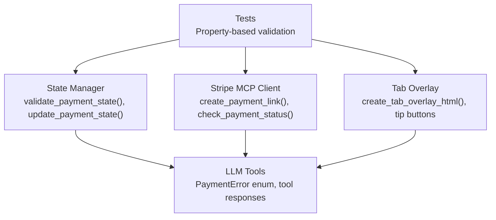
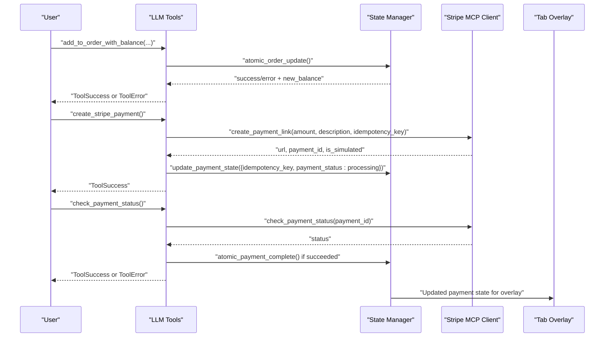
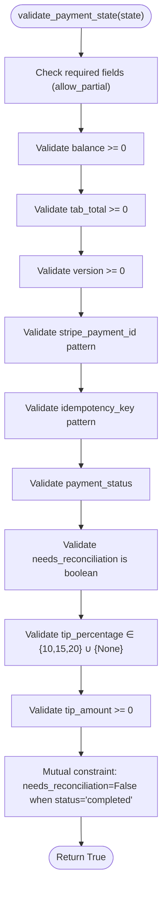
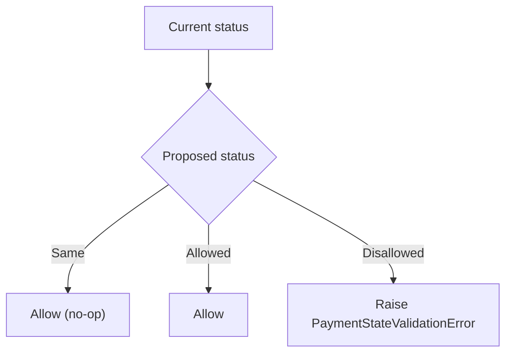
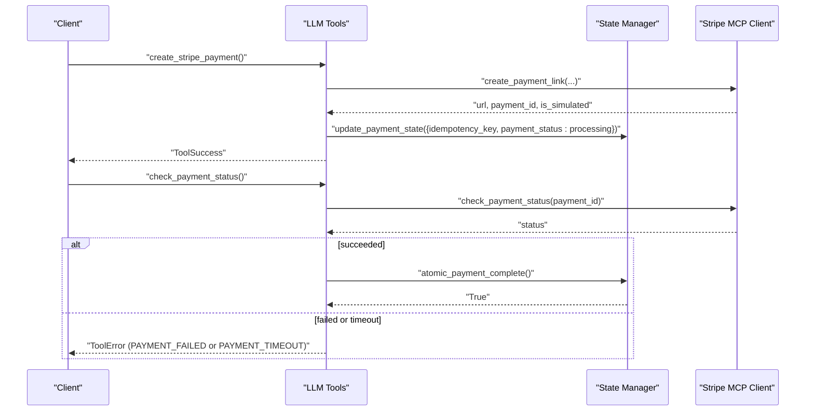
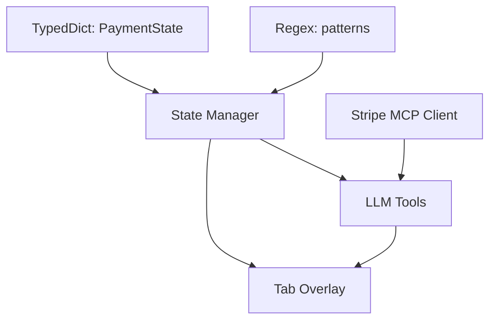

# State Validation and Constraints

<cite>
**Referenced Files in This Document**
- [state_manager.py](file://src/utils/state_manager.py)
- [stripe_mcp.py](file://src/payments/stripe_mcp.py)
- [tab_overlay.py](file://src/ui/tab_overlay.py)
- [tools.py](file://src/llm/tools.py)
- [test_payment_properties.py](file://tests/test_payment_properties.py)
- [design.md](file://.kiro/specs/stripe-payment/design.md)
- [tasks.md](file://.kiro/specs/stripe-payment/tasks.md)
</cite>

## Table of Contents
1. [Introduction](#introduction)
2. [Project Structure](#project-structure)
3. [Core Components](#core-components)
4. [Architecture Overview](#architecture-overview)
5. [Detailed Component Analysis](#detailed-component-analysis)
6. [Dependency Analysis](#dependency-analysis)
7. [Performance Considerations](#performance-considerations)
8. [Troubleshooting Guide](#troubleshooting-guide)
9. [Conclusion](#conclusion)
10. [Appendices](#appendices)

## Introduction
This document describes the state validation system that enforces data integrity and business rules for payment operations. It covers:
- Numeric constraints: balance >= 0, tab_total >= 0, version >= 0
- Tip constraints: tip_percentage ∈ {10, 15, 20} ∪ {None}, tip_amount >= 0
- Pattern constraints: stripe_payment_id, idempotency_key
- Status transition validation: payment_status with allowed flow pending → processing → completed
- Error handling, recovery, performance optimization, and extension guidelines

## Project Structure
The state validation system spans several modules:
- State management and validation: [state_manager.py](file://src/utils/state_manager.py)
- Stripe MCP client and payment operations: [stripe_mcp.py](file://src/payments/stripe_mcp.py)
- UI overlays and tip display: [tab_overlay.py](file://src/ui/tab_overlay.py)
- LLM tools and error codes: [tools.py](file://src/llm/tools.py)
- Property-based tests: [test_payment_properties.py](file://tests/test_payment_properties.py)
- Design and tasks specifications: [design.md](file://.kiro/specs/stripe-payment/design.md), [tasks.md](file://.kiro/specs/stripe-payment/tasks.md)

**Diagram sources**
- [state_manager.py](file://src/utils/state_manager.py#L66-L167)
- [stripe_mcp.py](file://src/payments/stripe_mcp.py#L183-L441)
- [tab_overlay.py](file://src/ui/tab_overlay.py#L151-L485)
- [tools.py](file://src/llm/tools.py#L52-L131)
- [test_payment_properties.py](file://tests/test_payment_properties.py#L1-L1497)

**Section sources**
- [state_manager.py](file://src/utils/state_manager.py#L1-L814)
- [stripe_mcp.py](file://src/payments/stripe_mcp.py#L1-L475)
- [tab_overlay.py](file://src/ui/tab_overlay.py#L1-L595)
- [tools.py](file://src/llm/tools.py#L1-L1066)
- [test_payment_properties.py](file://tests/test_payment_properties.py#L1-L1497)
- [design.md](file://.kiro/specs/stripe-payment/design.md#L378-L668)
- [tasks.md](file://.kiro/specs/stripe-payment/tasks.md#L1-L403)

## Core Components
- Payment state schema and defaults: balance, tab_total, tip_percentage, tip_amount, stripe_payment_id, payment_status, idempotency_key, version, needs_reconciliation
- Validation engine: validate_payment_state() with numeric, pattern, and mutual constraints
- Status transition guard: is_valid_status_transition() enforcing pending → processing → completed
- Atomic operations: atomic_order_update() and atomic_payment_complete() with optimistic locking and version increments
- Stripe integration: idempotency key generation, payment link creation, status polling, and fallback behavior
- UI integration: tip buttons, total calculation, and animated overlay

**Section sources**
- [state_manager.py](file://src/utils/state_manager.py#L17-L58)
- [state_manager.py](file://src/utils/state_manager.py#L66-L167)
- [state_manager.py](file://src/utils/state_manager.py#L170-L187)
- [state_manager.py](file://src/utils/state_manager.py#L642-L677)
- [state_manager.py](file://src/utils/state_manager.py#L780-L814)
- [stripe_mcp.py](file://src/payments/stripe_mcp.py#L109-L128)
- [stripe_mcp.py](file://src/payments/stripe_mcp.py#L183-L273)
- [stripe_mcp.py](file://src/payments/stripe_mcp.py#L348-L441)
- [tab_overlay.py](file://src/ui/tab_overlay.py#L151-L485)

## Architecture Overview
The validation system integrates tightly with state updates and payment operations:

**Diagram sources**
- [tools.py](file://src/llm/tools.py#L221-L316)
- [tools.py](file://src/llm/tools.py#L358-L471)
- [tools.py](file://src/llm/tools.py#L474-L554)
- [state_manager.py](file://src/utils/state_manager.py#L642-L677)
- [state_manager.py](file://src/utils/state_manager.py#L780-L814)
- [stripe_mcp.py](file://src/payments/stripe_mcp.py#L183-L273)
- [stripe_mcp.py](file://src/payments/stripe_mcp.py#L348-L441)
- [tab_overlay.py](file://src/ui/tab_overlay.py#L151-L485)

## Detailed Component Analysis

### Payment State Schema and Defaults
- Fields: balance, tab_total, tip_percentage, tip_amount, stripe_payment_id, payment_status, idempotency_key, version, needs_reconciliation
- Defaults: balance=1000.00, tab_total=0.00, tip_percentage=None, tip_amount=0.00, payment_status="pending", version=0, needs_reconciliation=False
- Patterns: stripe_payment_id must match ^(plink_|pi_)[a-zA-Z0-9]+$, idempotency_key must match ^[a-zA-Z0-9]+_[0-9]+$
- Status transitions: pending → processing → completed (no backwards transitions)

**Section sources**
- [state_manager.py](file://src/utils/state_manager.py#L17-L58)
- [state_manager.py](file://src/utils/state_manager.py#L34-L45)
- [state_manager.py](file://src/utils/state_manager.py#L48-L58)

### Validation Engine: validate_payment_state()
Key validations:
- Numeric constraints: balance >= 0, tab_total >= 0, version >= 0
- Pattern constraints: stripe_payment_id and idempotency_key
- Status validation: payment_status ∈ {"pending","processing","completed"}
- Boolean validation: needs_reconciliation
- Tip constraints: tip_percentage ∈ {10,15,20} ∪ {None}, tip_amount >= 0
- Mutual constraint: when payment_status == "completed", needs_reconciliation must be False

Validation flow:

**Diagram sources**
- [state_manager.py](file://src/utils/state_manager.py#L66-L167)

**Section sources**
- [state_manager.py](file://src/utils/state_manager.py#L66-L167)

### Status Transition Validation
- Allowed transitions: pending → processing → completed
- No backwards transitions allowed
- Guard enforced in update_payment_state(): merges proposed updates, validates merged state, rejects invalid transitions

**Diagram sources**
- [state_manager.py](file://src/utils/state_manager.py#L170-L187)
- [state_manager.py](file://src/utils/state_manager.py#L658-L665)

**Section sources**
- [state_manager.py](file://src/utils/state_manager.py#L170-L187)
- [state_manager.py](file://src/utils/state_manager.py#L658-L665)

### Pattern Validation
- stripe_payment_id: Must match ^(plink_|pi_)[a-zA-Z0-9]+$
- idempotency_key: Must match ^[a-zA-Z0-9]+_[0-9]+$
- Generated by StripeMCPClient.generate_idempotency_key()

**Section sources**
- [state_manager.py](file://src/utils/state_manager.py#L34-L38)
- [state_manager.py](file://src/utils/state_manager.py#L110-L130)
- [stripe_mcp.py](file://src/payments/stripe_mcp.py#L109-L128)

### Constraint Violation Handling and Recovery
Common violations and handling:
- Insufficient funds: atomic_order_update() returns INSUFFICIENT_FUNDS; state preserved; UI remains unchanged
- Concurrent modification: optimistic lock mismatch; returns CONCURRENT_MODIFICATION; client retries recommended
- Invalid tip percentage: set_tip() raises ValueError; tools return INVALID_TIP_PERCENTAGE
- Payment completion: atomic_payment_complete() resets tab_total to 0.00, sets status to "completed", clears tip fields, increments version

**Diagram sources**
- [tools.py](file://src/llm/tools.py#L358-L471)
- [tools.py](file://src/llm/tools.py#L474-L554)
- [state_manager.py](file://src/utils/state_manager.py#L780-L814)
- [stripe_mcp.py](file://src/payments/stripe_mcp.py#L348-L441)

**Section sources**
- [tools.py](file://src/llm/tools.py#L52-L131)
- [tools.py](file://src/llm/tools.py#L276-L292)
- [tools.py](file://src/llm/tools.py#L557-L616)
- [state_manager.py](file://src/utils/state_manager.py#L780-L814)

### Examples of Validation Error Scenarios
- Negative balance: validate_payment_state() raises PaymentStateValidationError with message indicating balance must be >= 0
- Invalid status: setting payment_status to "invalid" raises PaymentStateValidationError with allowed statuses list
- Invalid tip percentage: setting tip_percentage to 25 raises PaymentStateValidationError with allowed values
- Invalid idempotency_key: setting idempotency_key to "invalid_format" raises PaymentStateValidationError with pattern message
- Invalid stripe_payment_id: setting stripe_payment_id to "invalid" raises PaymentStateValidationError with pattern message
- Invalid status transition: attempting to move from "completed" to "pending" raises PaymentStateValidationError with transition message

**Section sources**
- [state_manager.py](file://src/utils/state_manager.py#L89-L165)
- [state_manager.py](file://src/utils/state_manager.py#L658-L665)

### State Recovery Procedures
- Insufficient funds: revert to previous state; client retries order; no automatic retry is performed
- Concurrent modification: client retries with expected_version; if mismatch persists, user retries
- Payment timeout: client retries status check; if persistent, user checks manually
- Payment failure: client retries or falls back to alternative payment; user notified

**Section sources**
- [state_manager.py](file://src/utils/state_manager.py#L680-L756)
- [tools.py](file://src/llm/tools.py#L276-L292)
- [tools.py](file://src/llm/tools.py#L528-L533)

### Extending Validation Rules and Backward Compatibility
- Add new fields to PaymentState TypedDict with defaults and validation
- Update validate_payment_state() with new constraints
- Maintain DEFAULT_PAYMENT_STATE for backward compatibility
- Use allow_partial=True in targeted validations when merging partial updates
- Keep migration logic for existing sessions (e.g., adding tip fields)

**Section sources**
- [state_manager.py](file://src/utils/state_manager.py#L17-L58)
- [state_manager.py](file://src/utils/state_manager.py#L366-L379)
- [tasks.md](file://.kiro/specs/stripe-payment/tasks.md#L277-L298)

## Dependency Analysis
Key dependencies and relationships:
- State Manager depends on TypedDict for schema definition and regex for patterns
- Stripe MCP Client generates idempotency keys and interacts with payment state
- LLM Tools depend on State Manager for atomic operations and on Stripe MCP Client for payment link/status
- UI Tab Overlay depends on State Manager for payment totals and tip display

**Diagram sources**
- [state_manager.py](file://src/utils/state_manager.py#L17-L58)
- [state_manager.py](file://src/utils/state_manager.py#L34-L38)
- [stripe_mcp.py](file://src/payments/stripe_mcp.py#L109-L128)
- [tools.py](file://src/llm/tools.py#L13-L27)
- [tab_overlay.py](file://src/ui/tab_overlay.py#L151-L485)

**Section sources**
- [state_manager.py](file://src/utils/state_manager.py#L1-L814)
- [stripe_mcp.py](file://src/payments/stripe_mcp.py#L1-L475)
- [tools.py](file://src/llm/tools.py#L1-L1066)
- [tab_overlay.py](file://src/ui/tab_overlay.py#L1-L595)

## Performance Considerations
- Validation complexity: O(k) where k is the number of validated fields; minimal overhead
- Optimistic locking: version increments on successful atomic updates; reduces contention
- Concurrency control: thread-safe session locks prevent race conditions
- UI animations: collapse rapid updates within 100ms window; queue depth capped at 5
- Stripe MCP: availability cache TTL 30s; exponential backoff retries; fallback to mock payment when unavailable

[No sources needed since this section provides general guidance]

## Troubleshooting Guide
Common issues and resolutions:
- Validation errors: inspect raised PaymentStateValidationError messages for specific field and constraint
- Status transition errors: ensure payment_status follows allowed flow pending → processing → completed
- Pattern mismatches: verify stripe_payment_id and idempotency_key formats
- Insufficient funds: confirm balance vs. item price; no automatic retry is performed
- Concurrent modification: client should retry with expected_version; if persistent, investigate race conditions
- Payment timeouts: retry status checks; if persistent, check Stripe MCP availability and logs
- UI not updating: verify tab overlay receives updated payment state; ensure animation queue is not blocked

**Section sources**
- [state_manager.py](file://src/utils/state_manager.py#L61-L63)
- [state_manager.py](file://src/utils/state_manager.py#L658-L665)
- [tools.py](file://src/llm/tools.py#L276-L292)
- [tools.py](file://src/llm/tools.py#L528-L533)

## Conclusion
The state validation system enforces robust data integrity and business rules for payment operations. It combines strict schema validation, pattern enforcement, status transition guards, and atomic operations with optimistic locking. The design supports graceful fallbacks, clear error signaling, and UI integration for a seamless user experience.

## Appendices

### Validation Rules Reference
- Numeric: balance >= 0, tab_total >= 0, version >= 0
- Tip: tip_percentage ∈ {10,15,20} ∪ {None}, tip_amount >= 0
- Patterns: stripe_payment_id ^(plink_|pi_)[a-zA-Z0-9]+$, idempotency_key ^[a-zA-Z0-9]+_[0-9]+$
- Status: payment_status ∈ {"pending","processing","completed"}
- Mutual constraint: needs_reconciliation == False when payment_status == "completed"

**Section sources**
- [state_manager.py](file://src/utils/state_manager.py#L89-L165)

### Testing Coverage
- Property-based tests validate balance deduction consistency, insufficient funds rejection, state preservation on rejection, tab accumulation accuracy, and payment completion state reset
- UI integration tests cover animation queue length consistency and balance color selection

**Section sources**
- [test_payment_properties.py](file://tests/test_payment_properties.py#L59-L158)
- [test_payment_properties.py](file://tests/test_payment_properties.py#L161-L263)
- [test_payment_properties.py](file://tests/test_payment_properties.py#L265-L367)
- [test_payment_properties.py](file://tests/test_payment_properties.py#L369-L469)
- [test_payment_properties.py](file://tests/test_payment_properties.py#L472-L606)
- [test_payment_properties.py](file://tests/test_payment_properties.py#L608-L686)
- [test_payment_properties.py](file://tests/test_payment_properties.py#L694-L798)