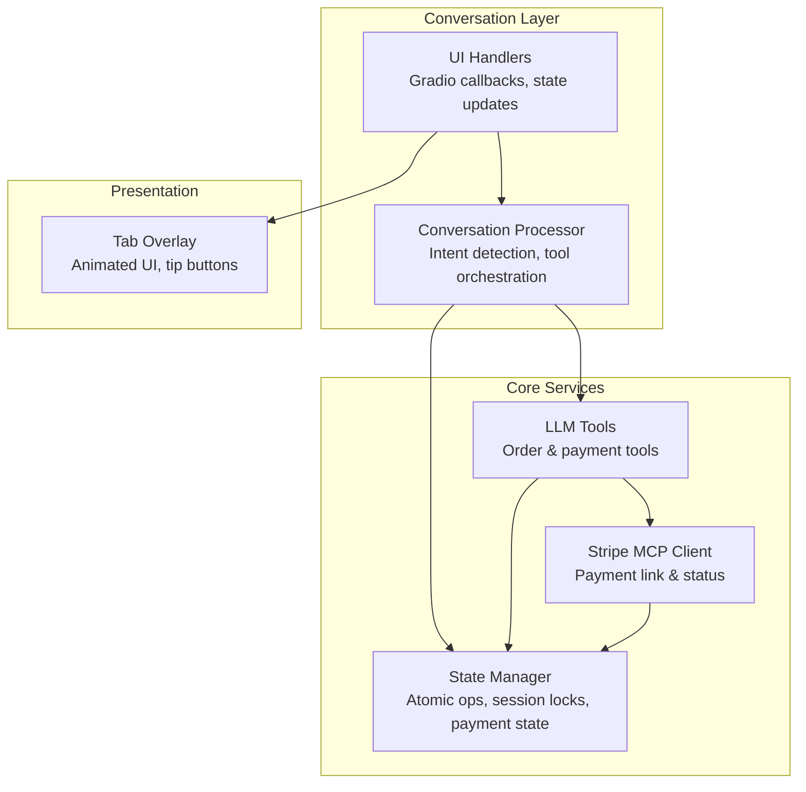
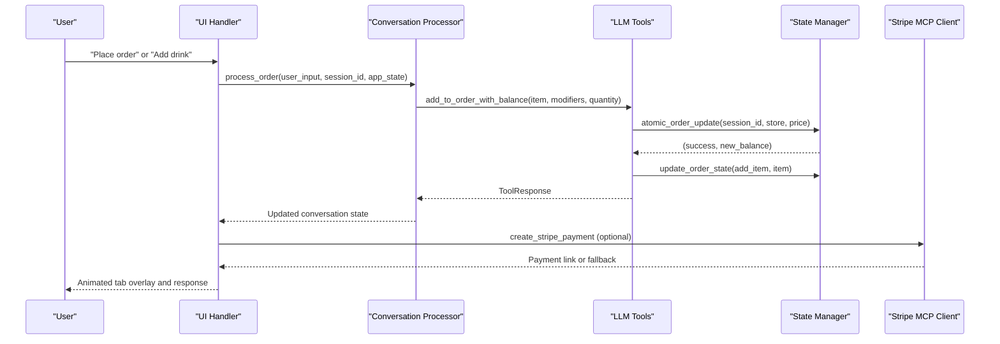
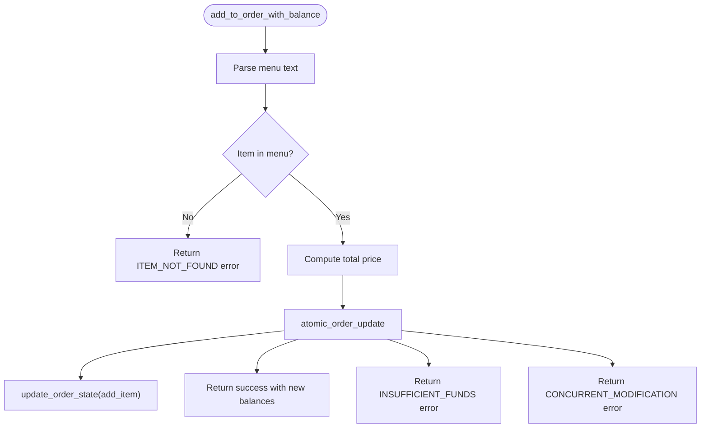
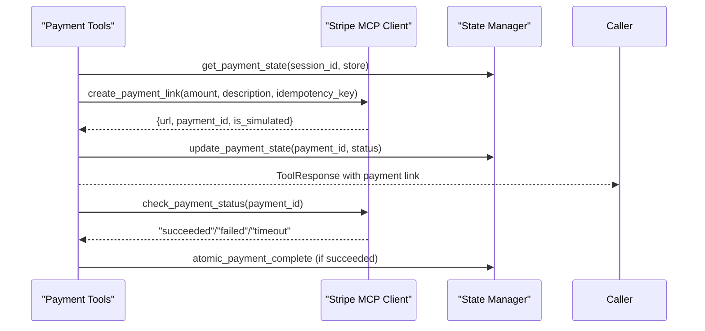
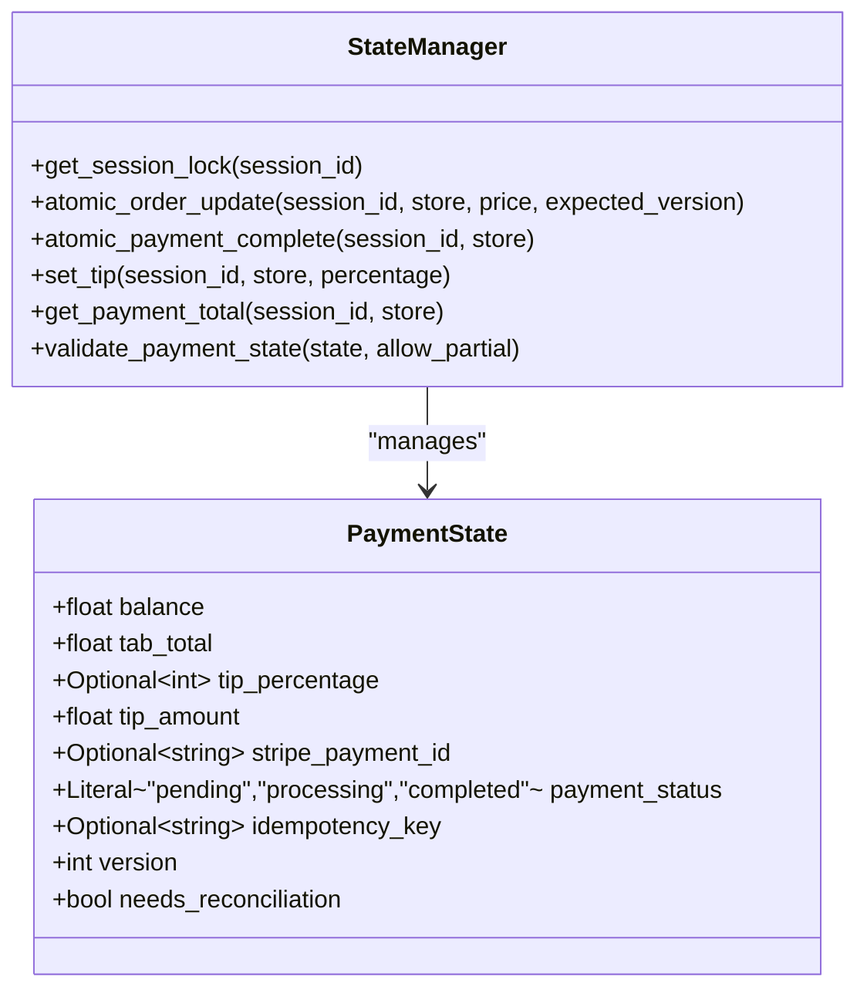
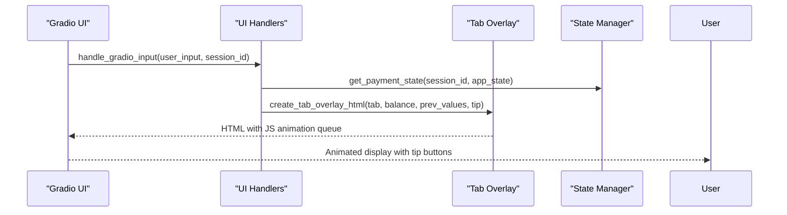
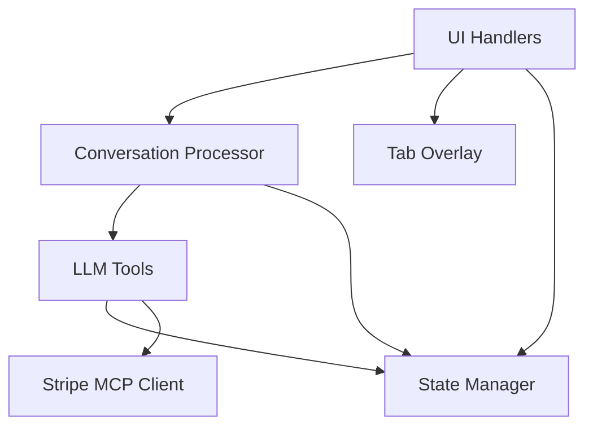

# Order Management Tool API

<cite>
**Referenced Files in This Document**
- [tools.py](file://src/llm/tools.py)
- [state_manager.py](file://src/utils/state_manager.py)
- [processor.py](file://src/conversation/processor.py)
- [handlers.py](file://src/ui/handlers.py)
- [tab_overlay.py](file://src/ui/tab_overlay.py)
- [stripe_mcp.py](file://src/payments/stripe_mcp.py)
- [test_state_manager.py](file://tests/test_state_manager.py)
- [test_payment_properties.py](file://tests/test_payment_properties.py)
- [test_ui_handlers.py](file://tests/test_ui_handlers.py)
</cite>

## Table of Contents
1. [Introduction](#introduction)
2. [Project Structure](#project-structure)
3. [Core Components](#core-components)
4. [Architecture Overview](#architecture-overview)
5. [Detailed Component Analysis](#detailed-component-analysis)
6. [Dependency Analysis](#dependency-analysis)
7. [Performance Considerations](#performance-considerations)
8. [Troubleshooting Guide](#troubleshooting-guide)
9. [Conclusion](#conclusion)

## Introduction
This document describes the Order Management Tool API for the MayaMCP bartending assistant. It focuses on drink ordering, tab management, menu validation, order modification, state synchronization across conversations, and integration with the payment system. The API provides robust validation for availability, pricing, and inventory-like constraints, along with graceful handling of edge cases such as out-of-stock items, price changes, concurrent modifications, and order conflicts.

## Project Structure
The order management system spans several modules:
- LLM Tools: Core order and payment operations exposed as tools
- State Manager: Thread-safe session state, atomic operations, and payment state
- Conversation Processor: Intent detection, tool orchestration, and session context
- UI Handlers: Gradio integration, state updates, and tab overlay rendering
- Payment Integration: Stripe MCP client with fallback and retry logic
- Tests: Unit and property-based tests validating correctness and edge cases

**Diagram sources**
- [processor.py](file://src/conversation/processor.py#L73-L456)
- [tools.py](file://src/llm/tools.py#L221-L824)
- [state_manager.py](file://src/utils/state_manager.py#L685-L800)
- [handlers.py](file://src/ui/handlers.py#L23-L184)
- [tab_overlay.py](file://src/ui/tab_overlay.py#L151-L485)
- [stripe_mcp.py](file://src/payments/stripe_mcp.py#L66-L475)

**Section sources**
- [processor.py](file://src/conversation/processor.py#L1-L456)
- [tools.py](file://src/llm/tools.py#L1-L1066)
- [state_manager.py](file://src/utils/state_manager.py#L1-L814)
- [handlers.py](file://src/ui/handlers.py#L1-L392)
- [tab_overlay.py](file://src/ui/tab_overlay.py#L1-L595)
- [stripe_mcp.py](file://src/payments/stripe_mcp.py#L1-L475)

## Core Components
- Order Tools: Add drinks to order with balance validation, get current balance, and menu retrieval
- Payment Tools: Create payment links, check payment status, set/get tips, and manage payment state
- State Manager: Thread-safe session locking, atomic order updates, payment state validation, and tip calculations
- UI Integration: Gradio handlers for input processing, tip button actions, and animated tab overlay
- Payment Client: Stripe MCP integration with retry logic, fallback to mock payments, and status polling

Key function signatures and responsibilities:
- `add_to_order_with_balance`: Validates menu presence, parses modifiers, performs atomic balance deduction, and updates order state
- `atomic_order_update`: Thread-safe atomic balance/tab/version update with optimistic locking
- `create_stripe_payment`: Generates idempotent payment links with fallback and status tracking
- `set_tip/get_tip`: Manage tip selection with toggle behavior and total calculation
- `create_tab_overlay_html`: Renders animated tab, balance, tip, and total displays with JavaScript animation queue

**Section sources**
- [tools.py](file://src/llm/tools.py#L221-L824)
- [state_manager.py](file://src/utils/state_manager.py#L685-L800)
- [stripe_mcp.py](file://src/payments/stripe_mcp.py#L183-L441)
- [tab_overlay.py](file://src/ui/tab_overlay.py#L151-L485)

## Architecture Overview
The system integrates natural language processing with stateful order management and secure payment processing. The conversation processor detects intents and invokes appropriate tools, which coordinate with the state manager for atomic updates and with the payment client for Stripe operations. The UI layer renders the current tab, balance, and tip state with smooth animations.

**Diagram sources**
- [processor.py](file://src/conversation/processor.py#L73-L456)
- [tools.py](file://src/llm/tools.py#L221-L824)
- [state_manager.py](file://src/utils/state_manager.py#L685-L800)
- [handlers.py](file://src/ui/handlers.py#L23-L184)
- [stripe_mcp.py](file://src/payments/stripe_mcp.py#L183-L441)

## Detailed Component Analysis

### Order Tool API
The order tool suite provides drink ordering with menu validation and balance checks:
- `add_to_order_with_balance(item_name, modifiers=None, quantity=1)`: Parses menu, validates item existence, computes total price, performs atomic order update, and records item in order state
- `add_to_order(item_name, modifiers=None, quantity=1)`: Backward-compatible wrapper that delegates to the balance-aware variant when a session context exists
- `get_menu()`: Returns the current menu text for parsing and recommendation
- `get_recommendation(preference)`: Provides drink recommendations based on user preferences

Validation and error handling:
- Item lookup via regex parsing of menu text
- Insufficient funds rejection with detailed error messages
- Concurrent modification detection via optimistic locking
- Invalid session handling with fallback behavior

**Diagram sources**
- [tools.py](file://src/llm/tools.py#L221-L316)
- [state_manager.py](file://src/utils/state_manager.py#L685-L756)

**Section sources**
- [tools.py](file://src/llm/tools.py#L221-L824)
- [test_state_manager.py](file://tests/test_state_manager.py#L111-L180)
- [test_payment_properties.py](file://tests/test_payment_properties.py#L69-L126)

### Payment Tool API
Payment tools integrate with Stripe MCP for secure transactions:
- `create_stripe_payment()`: Generates idempotency key, creates payment link with retry logic, and stores payment metadata
- `check_payment_status()`: Polls payment status with timeouts and returns terminal states
- `set_tip(percentage)` and `get_tip()`: Manage tip selection with toggle behavior and total computation
- `get_balance()`: Retrieves current balance and tab for display

Integration patterns:
- Session context propagation via thread-local storage
- Idempotency key generation for deduplication
- Fallback to mock payments when Stripe is unavailable
- Atomic payment completion resets tab and tip state

**Diagram sources**
- [tools.py](file://src/llm/tools.py#L358-L554)
- [stripe_mcp.py](file://src/payments/stripe_mcp.py#L183-L441)
- [state_manager.py](file://src/utils/state_manager.py#L780-L800)

**Section sources**
- [tools.py](file://src/llm/tools.py#L358-L648)
- [stripe_mcp.py](file://src/payments/stripe_mcp.py#L183-L441)
- [test_payment_properties.py](file://tests/test_payment_properties.py#L172-L263)

### State Management and Concurrency Control
Thread-safe session management ensures atomic operations and prevents conflicts:
- Session locks with mutex protection and expiration handling
- Optimistic locking with version increments for atomic updates
- Payment state validation with strict constraints and transitions
- Tip calculation and total computation with toggle behavior

**Diagram sources**
- [state_manager.py](file://src/utils/state_manager.py#L17-L800)

**Section sources**
- [state_manager.py](file://src/utils/state_manager.py#L170-L282)
- [test_payment_properties.py](file://tests/test_payment_properties.py#L69-L126)

### UI Integration and Tab Overlay
The UI layer synchronizes state with visual feedback:
- Gradio handlers process user input, invoke conversation processing, and update tab overlay
- Tip buttons enable dynamic tip selection with toggle behavior
- Animated overlay shows tab, balance, tip, and total with smooth transitions

**Diagram sources**
- [handlers.py](file://src/ui/handlers.py#L23-L184)
- [tab_overlay.py](file://src/ui/tab_overlay.py#L151-L485)

**Section sources**
- [handlers.py](file://src/ui/handlers.py#L23-L184)
- [tab_overlay.py](file://src/ui/tab_overlay.py#L151-L485)
- [test_ui_handlers.py](file://tests/test_ui_handlers.py#L37-L70)

## Dependency Analysis
The system exhibits clear separation of concerns with well-defined dependencies:
- Tools depend on State Manager for atomic operations and Payment State
- Conversation Processor orchestrates tool calls and manages session context
- UI Handlers bridge state updates to visual presentation
- Stripe MCP Client encapsulates external payment service integration

**Diagram sources**
- [tools.py](file://src/llm/tools.py#L1-L1066)
- [state_manager.py](file://src/utils/state_manager.py#L1-L814)
- [processor.py](file://src/conversation/processor.py#L1-L456)
- [handlers.py](file://src/ui/handlers.py#L1-L392)
- [tab_overlay.py](file://src/ui/tab_overlay.py#L1-L595)
- [stripe_mcp.py](file://src/payments/stripe_mcp.py#L1-L475)

**Section sources**
- [tools.py](file://src/llm/tools.py#L1-L1066)
- [state_manager.py](file://src/utils/state_manager.py#L1-L814)
- [processor.py](file://src/conversation/processor.py#L1-L456)
- [handlers.py](file://src/ui/handlers.py#L1-L392)
- [tab_overlay.py](file://src/ui/tab_overlay.py#L1-L595)
- [stripe_mcp.py](file://src/payments/stripe_mcp.py#L1-L475)

## Performance Considerations
- Atomic operations minimize contention and ensure consistency under concurrent access
- Optimistic locking reduces lock contention while detecting conflicts early
- JavaScript animation queue collapses rapid updates to prevent UI thrashing
- Retry logic with exponential backoff limits resource usage during external service calls
- Property-based tests validate correctness across a wide range of inputs and edge cases

## Troubleshooting Guide
Common issues and resolutions:
- Insufficient funds: The system rejects orders with clear messaging and preserves state
- Concurrent modification: Clients should retry orders when encountering optimistic lock failures
- Stripe unavailability: Automatic fallback to mock payments with user notification
- Invalid tip percentage: Tools validate inputs and return appropriate error codes
- Session expiration: UI handlers maintain session context and reset state cleanly

Diagnostic steps:
- Verify session context is set before invoking payment tools
- Check payment state validation constraints and transitions
- Monitor animation queue behavior for rapid state changes
- Review Stripe MCP client logs for availability and retry outcomes

**Section sources**
- [tools.py](file://src/llm/tools.py#L90-L166)
- [state_manager.py](file://src/utils/state_manager.py#L66-L167)
- [stripe_mcp.py](file://src/payments/stripe_mcp.py#L130-L181)
- [test_payment_properties.py](file://tests/test_payment_properties.py#L172-L263)

## Conclusion
The Order Management Tool API provides a robust, stateful, and secure framework for drink ordering and tab management. Its integration of atomic operations, thread-safe session control, and payment processing ensures reliability and consistency. The UI layer delivers immediate visual feedback with animated transitions and interactive tip controls. Comprehensive testing, including property-based validations, ensures correctness across normal and edge-case scenarios.