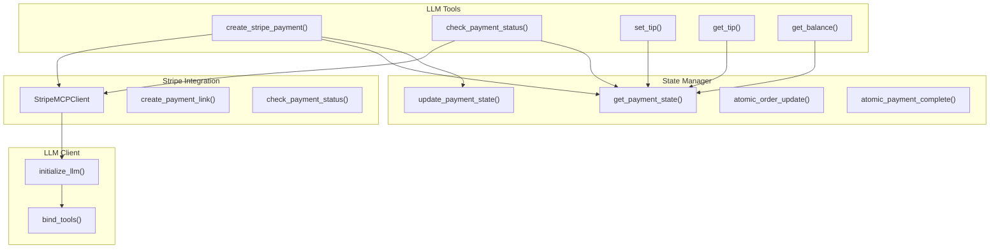
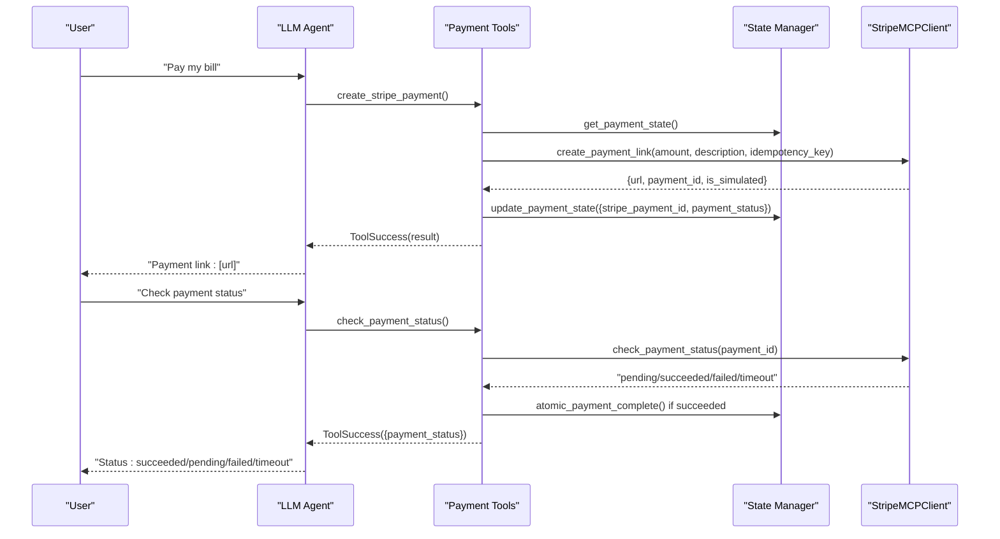
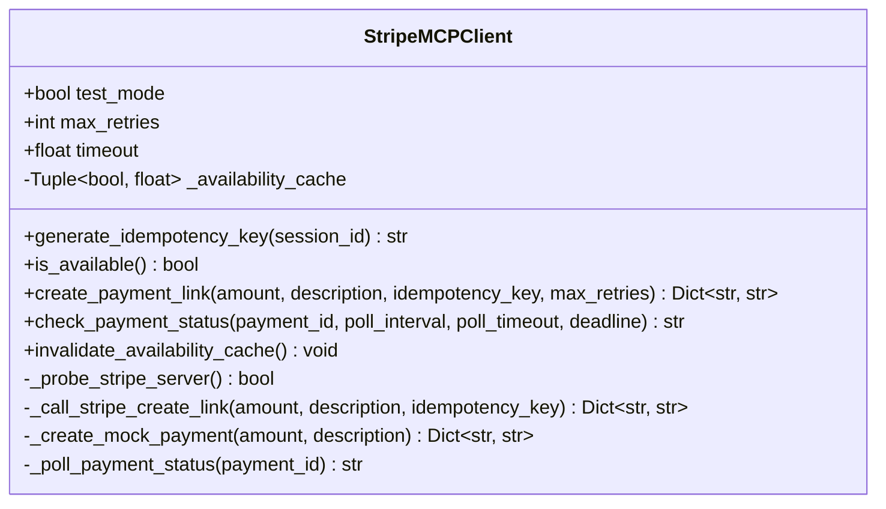
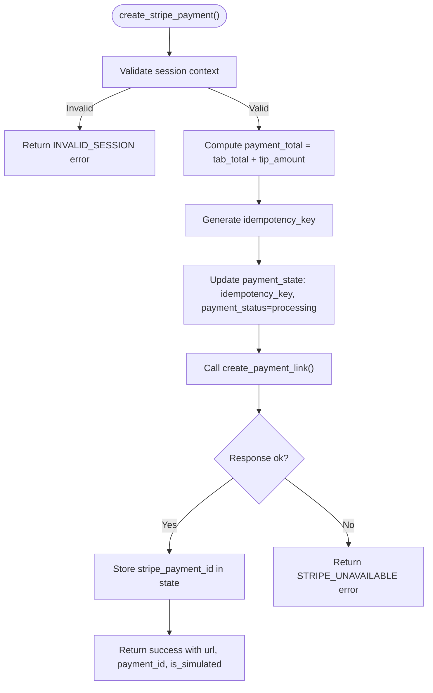
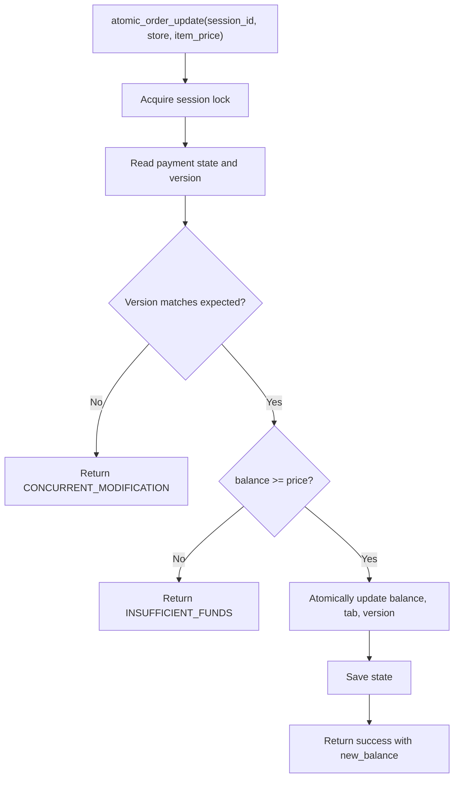
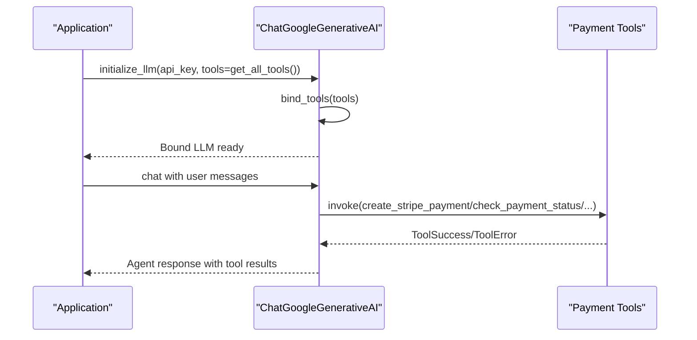
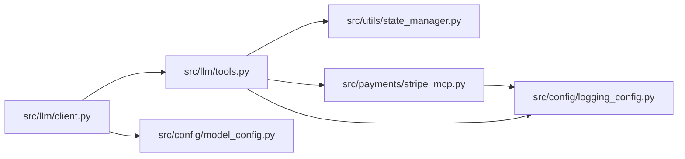

# Payment Tool API

<cite>
**Referenced Files in This Document**
- [stripe_mcp.py](file://src/payments/stripe_mcp.py)
- [tools.py](file://src/llm/tools.py)
- [state_manager.py](file://src/utils/state_manager.py)
- [client.py](file://src/llm/client.py)
- [.env.example](file://.env.example)
- [test_llm_tools.py](file://tests/test_llm_tools.py)
- [test_payment_properties.py](file://tests/test_payment_properties.py)
</cite>

## Table of Contents
1. [Introduction](#introduction)
2. [Project Structure](#project-structure)
3. [Core Components](#core-components)
4. [Architecture Overview](#architecture-overview)
5. [Detailed Component Analysis](#detailed-component-analysis)
6. [Dependency Analysis](#dependency-analysis)
7. [Performance Considerations](#performance-considerations)
8. [Troubleshooting Guide](#troubleshooting-guide)
9. [Conclusion](#conclusion)
10. [Appendices](#appendices)

## Introduction
This document describes the Payment Tool API focused on Stripe integration and transaction processing. It covers function signatures, parameter validation, response schemas, tool registration and binding with the LLM client, the end-to-end payment workflow (including amount validation, customer authentication via session context, and transaction status polling), error handling, security considerations, PCI compliance, and test mode configuration. The goal is to enable developers to integrate Stripe-powered payments into the conversational agent while maintaining robustness, clarity, and safety.

## Project Structure
The payment tool API spans three primary areas:
- Payment orchestration and state management: LLM tools and state manager
- Stripe integration stubs: Stripe MCP client
- LLM client integration: binding tools to the LLM

**Diagram sources**
- [tools.py](file://src/llm/tools.py#L349-L554)
- [state_manager.py](file://src/utils/state_manager.py#L627-L790)
- [stripe_mcp.py](file://src/payments/stripe_mcp.py#L66-L475)
- [client.py](file://src/llm/client.py#L91-L129)

**Section sources**
- [tools.py](file://src/llm/tools.py#L1-L1066)
- [state_manager.py](file://src/utils/state_manager.py#L1-L814)
- [stripe_mcp.py](file://src/payments/stripe_mcp.py#L1-L475)
- [client.py](file://src/llm/client.py#L1-L211)

## Core Components
- StripeMCPClient: Async client for payment link creation and status polling with retry/backoff, availability probing, and fallback to mock payments.
- LLM Payment Tools: Structured tools for payment lifecycle operations, session-scoped state management, and error responses.
- State Manager: Atomic operations for balance/tab/tip updates and payment completion, with validation and optimistic locking.
- LLM Client: Initializes the LLM and binds tools for agent-driven payment actions.

Key responsibilities:
- Parameter validation: Amounts, tip percentages, session presence, and state transitions.
- Response schemas: Standardized success/error responses with structured fields.
- Workflow orchestration: Amount computation (tab + tip), idempotency key generation, payment link creation, and status polling.
- Error handling: Network, rate limiting, concurrent modification, insufficient funds, and timeout scenarios.

**Section sources**
- [stripe_mcp.py](file://src/payments/stripe_mcp.py#L66-L475)
- [tools.py](file://src/llm/tools.py#L52-L167)
- [state_manager.py](file://src/utils/state_manager.py#L66-L167)

## Architecture Overview
The payment workflow integrates the LLM, tools, state manager, and Stripe MCP client. The LLM invokes tools that coordinate with the state manager for atomic updates and with the Stripe client for payment operations. The Stripe client encapsulates retry logic, availability checks, and fallback behavior.

**Diagram sources**
- [tools.py](file://src/llm/tools.py#L358-L554)
- [state_manager.py](file://src/utils/state_manager.py#L780-L800)
- [stripe_mcp.py](file://src/payments/stripe_mcp.py#L183-L441)

## Detailed Component Analysis

### StripeMCPClient
Responsibilities:
- Payment link creation with retry/backoff and timeout control.
- Payment status polling with bounded attempts and per-poll timeouts.
- Availability probing with caching and fallback to mock payments.
- Idempotency key generation for deduplication.

Key behaviors:
- Retry configuration: up to 3 retries with exponential backoff delays.
- Availability cache TTL and per-probe timeout.
- Polling configuration: interval, per-poll timeout, deadline, and max attempts.
- Fallback to mock payment when Stripe is unavailable.

**Diagram sources**
- [stripe_mcp.py](file://src/payments/stripe_mcp.py#L66-L475)

**Section sources**
- [stripe_mcp.py](file://src/payments/stripe_mcp.py#L30-L44)
- [stripe_mcp.py](file://src/payments/stripe_mcp.py#L109-L128)
- [stripe_mcp.py](file://src/payments/stripe_mcp.py#L130-L181)
- [stripe_mcp.py](file://src/payments/stripe_mcp.py#L183-L346)
- [stripe_mcp.py](file://src/payments/stripe_mcp.py#L348-L475)

### Payment Tools
Tool functions and responsibilities:
- create_stripe_payment(): Creates a payment link using the Stripe client, computes total (tab + tip), generates idempotency key, stores state, and returns a standardized response.
- check_payment_status(): Polls Stripe for payment status, handles timeout, and completes payment atomically upon success.
- set_tip()/get_tip(): Manages tip selection and totals with validation and state updates.
- get_balance(): Returns current balance and tab for display.

Response schemas:
- Success: {"status": "ok", "result": {...}}
- Error: {"status": "error", "error": "<Code>", "message": "<Text>"}

Error codes:
- INSUFFICIENT_FUNDS, STRIPE_UNAVAILABLE, PAYMENT_FAILED, CONCURRENT_MODIFICATION, NETWORK_ERROR, RATE_LIMITED, INVALID_SESSION, ITEM_NOT_FOUND, PAYMENT_TIMEOUT, INVALID_TIP_PERCENTAGE

**Diagram sources**
- [tools.py](file://src/llm/tools.py#L358-L472)

**Section sources**
- [tools.py](file://src/llm/tools.py#L52-L167)
- [tools.py](file://src/llm/tools.py#L358-L472)
- [tools.py](file://src/llm/tools.py#L474-L554)

### State Manager
Atomic operations and validation:
- atomic_order_update(): Deducts from balance and increments tab with optimistic locking and version checks.
- atomic_payment_complete(): Resets tab and tip, marks as completed, increments version, clears reconciliation flag.
- update_payment_state(): Validates state transitions and constraints before applying updates.
- PaymentState schema: strict typing for balance, tab_total, tip fields, stripe identifiers, status, idempotency key, version, and reconciliation flag.

Validation rules:
- balance >= 0, tab_total >= 0, tip_amount >= 0
- tip_percentage in {10, 15, 20, None}
- stripe_payment_id matches pattern ^(plink_|pi_)[a-zA-Z0-9]+$
- idempotency_key matches format {session_id}_{unix_timestamp}
- payment_status transitions: pending → processing → completed (no backwards)
- needs_reconciliation false when payment_status is completed

**Diagram sources**
- [state_manager.py](file://src/utils/state_manager.py#L685-L756)

**Section sources**
- [state_manager.py](file://src/utils/state_manager.py#L17-L80)
- [state_manager.py](file://src/utils/state_manager.py#L685-L756)
- [state_manager.py](file://src/utils/state_manager.py#L780-L800)

### Tool Registration and Binding with LLM Client
- Tools are decorated with @tool and exposed via get_all_tools().
- The LLM client initializes ChatGoogleGenerativeAI and binds tools using bind_tools().
- Tool responses are standardized and integrated into agent conversations.

**Diagram sources**
- [client.py](file://src/llm/client.py#L91-L129)
- [tools.py](file://src/llm/tools.py#L1045-L1066)

**Section sources**
- [client.py](file://src/llm/client.py#L91-L129)
- [tools.py](file://src/llm/tools.py#L1045-L1066)

## Dependency Analysis
- tools.py depends on:
  - state_manager.py for atomic operations and state validation
  - stripe_mcp.py for payment link creation and status polling
  - logging_config for structured logging
- stripe_mcp.py depends on:
  - logging_config for logging
  - asyncio/time for async operations and timing
- client.py depends on:
  - model_config and generation configs
  - langchain_google_genai for LLM initialization
  - tenacity for retry behavior

**Diagram sources**
- [tools.py](file://src/llm/tools.py#L12-L27)
- [stripe_mcp.py](file://src/payments/stripe_mcp.py#L21-L23)
- [client.py](file://src/llm/client.py#L9-L11)

**Section sources**
- [tools.py](file://src/llm/tools.py#L12-L27)
- [stripe_mcp.py](file://src/payments/stripe_mcp.py#L16-L23)
- [client.py](file://src/llm/client.py#L9-L11)

## Performance Considerations
- Retry/backoff: Exponential delays reduce load on failing endpoints and improve resilience.
- Availability caching: Reduces repeated probes to the Stripe MCP server.
- Polling limits: Bounded attempts and per-poll timeouts prevent long-running operations.
- Event loop usage: Asynchronous calls are wrapped in new event loops for synchronous contexts; ensure proper loop lifecycle to avoid resource leaks.
- Optimistic locking: Atomic operations minimize contention and reduce conflicts.

[No sources needed since this section provides general guidance]

## Troubleshooting Guide
Common issues and resolutions:
- Stripe Unavailable: The client falls back to a mock payment link. Investigate network connectivity or MCP server health.
- Payment Timeout: Polling exceeded deadline or per-poll timeout. Retry status checks or verify payment_id correctness.
- Insufficient Funds: Balance lower than item price. Prompt user to add funds or remove items.
- Concurrent Modification: Optimistic lock mismatch. Request user to retry the operation.
- Invalid Session: Session context not set. Ensure session is established before invoking tools.
- Network Errors: Transient connectivity issues. Retry with backoff or check proxy/firewall settings.
- Rate Limited: Too many requests. Implement client-side throttling or wait for rate limit reset.

**Section sources**
- [tools.py](file://src/llm/tools.py#L91-L131)
- [tools.py](file://src/llm/tools.py#L378-L471)
- [tools.py](file://src/llm/tools.py#L492-L554)
- [state_manager.py](file://src/utils/state_manager.py#L685-L756)

## Conclusion
The Payment Tool API integrates Stripe via a robust MCP client, coordinated by LLM tools and enforced by a state manager with atomic operations and strict validation. The design emphasizes reliability (retry/backoff, availability caching, polling limits), clarity (standardized responses), and safety (optimistic locking, test mode). By following the documented workflows, error handling, and security practices, teams can confidently deploy Stripe-powered payments within the conversational agent.

[No sources needed since this section summarizes without analyzing specific files]

## Appendices

### Function Signatures and Parameters
- create_stripe_payment()
  - Purpose: Create a Stripe payment link for the current tab (including tip).
  - Returns: ToolSuccess with url, payment_id, is_simulated; or ToolError with appropriate code.
  - Notes: Uses session context and idempotency key; stores payment_id in state.
- check_payment_status()
  - Purpose: Poll Stripe for payment status and complete payment atomically on success.
  - Returns: ToolSuccess with payment_status; or ToolError on failure or timeout.
- set_tip(percentage: Optional[int] = None)
  - Purpose: Set or remove tip percentage; supports toggle behavior.
  - Returns: ToolSuccess with tip_percentage, tip_amount, total; or ToolError.
- get_tip()
  - Purpose: Retrieve current tip and total.
  - Returns: ToolSuccess with tip details; or ToolError.
- get_balance()
  - Purpose: Retrieve current balance and tab.
  - Returns: ToolSuccess with balance and tab; or ToolError.

**Section sources**
- [tools.py](file://src/llm/tools.py#L358-L648)

### Response Schemas
- Success: {"status": "ok", "result": {...}}
- Error: {"status": "error", "error": "<Code>", "message": "<Text>"}
- Error codes include: INSUFFICIENT_FUNDS, STRIPE_UNAVAILABLE, PAYMENT_FAILED, CONCURRENT_MODIFICATION, NETWORK_ERROR, RATE_LIMITED, INVALID_SESSION, ITEM_NOT_FOUND, PAYMENT_TIMEOUT, INVALID_TIP_PERCENTAGE

**Section sources**
- [tools.py](file://src/llm/tools.py#L36-L49)
- [tools.py](file://src/llm/tools.py#L52-L131)

### Tool Registration and Invocation Examples
- Registration: get_all_tools() returns a list of tools including create_stripe_payment and check_payment_status.
- Invocation: Tools are invoked via .invoke({...}) in tests and can be called from the LLM agent.

**Section sources**
- [tools.py](file://src/llm/tools.py#L1045-L1066)
- [test_llm_tools.py](file://tests/test_llm_tools.py#L655-L676)

### Security Considerations and PCI Compliance
- Test Mode Only: Stripe keys are commented out in .env.example; the client defaults to test_mode=True.
- No Card Data Handling: Payment link creation and status polling are delegated to Stripe; card data never touches the application.
- Idempotency: Idempotency keys prevent duplicate charges on retries.
- Session Context: Thread-local session context ensures operations are scoped to user sessions.
- Recommendations: Use HTTPS, rotate keys, restrict access to MCP endpoints, and monitor logs for anomalies.

**Section sources**
- [.env.example](file://.env.example#L7-L11)
- [tools.py](file://src/llm/tools.py#L350-L355)
- [stripe_mcp.py](file://src/payments/stripe_mcp.py#L109-L128)

### Test Mode Configuration
- Environment: .env.example demonstrates test mode configuration and comments out live keys.
- Client Initialization: get_stripe_client() creates a client with test_mode=True by default.

**Section sources**
- [.env.example](file://.env.example#L7-L11)
- [tools.py](file://src/llm/tools.py#L350-L355)

### Validation and Property-Based Testing
- Property-based tests validate:
  - Balance deduction consistency
  - Insufficient funds rejection
  - State preservation on rejection
  - Tab accumulation accuracy
  - Payment completion state reset
  - Tip button visual state (UI-related)
- These tests ensure correctness under varied inputs and edge cases.

**Section sources**
- [test_payment_properties.py](file://tests/test_payment_properties.py#L59-L106)
- [test_payment_properties.py](file://tests/test_payment_properties.py#L161-L263)
- [test_payment_properties.py](file://tests/test_payment_properties.py#L369-L470)
- [test_payment_properties.py](file://tests/test_payment_properties.py#L472-L606)
- [test_payment_properties.py](file://tests/test_payment_properties.py#L1400-L1497)