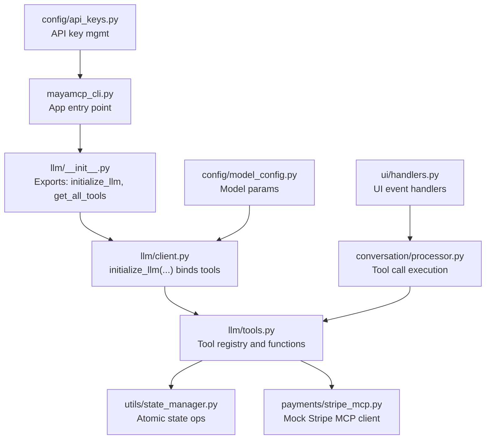
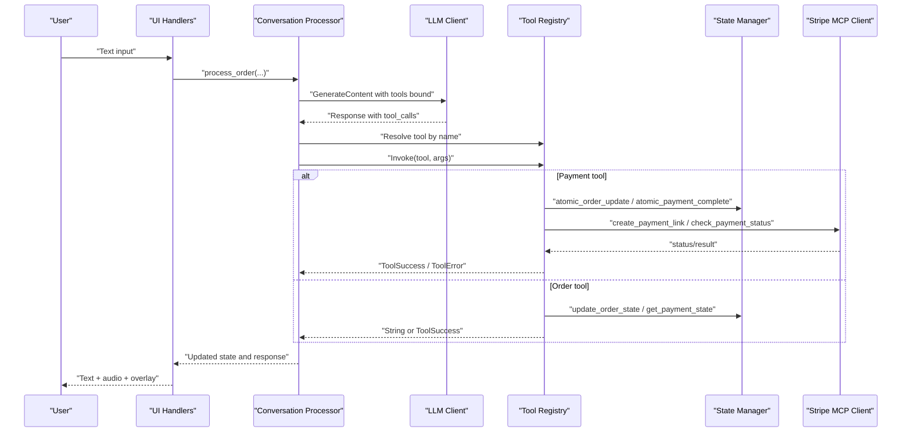
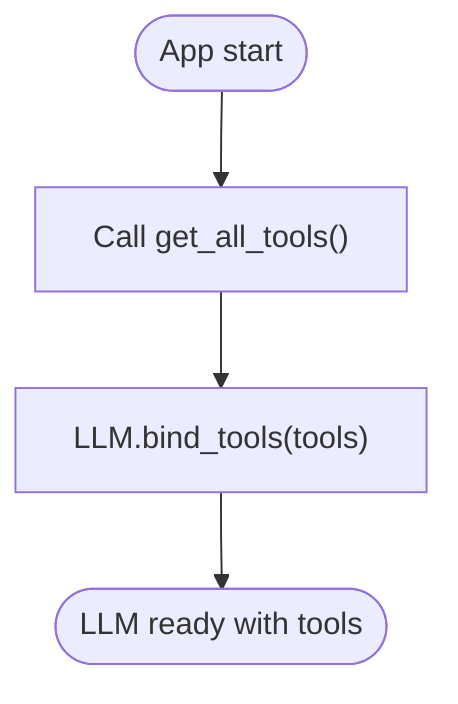
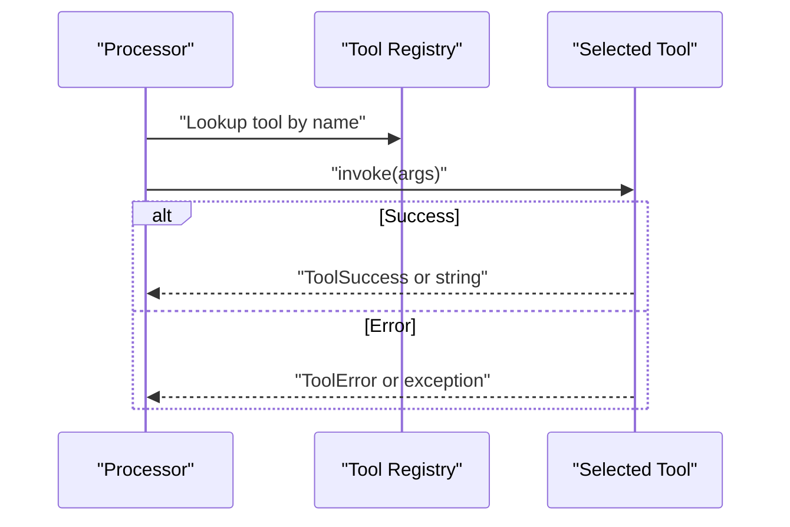
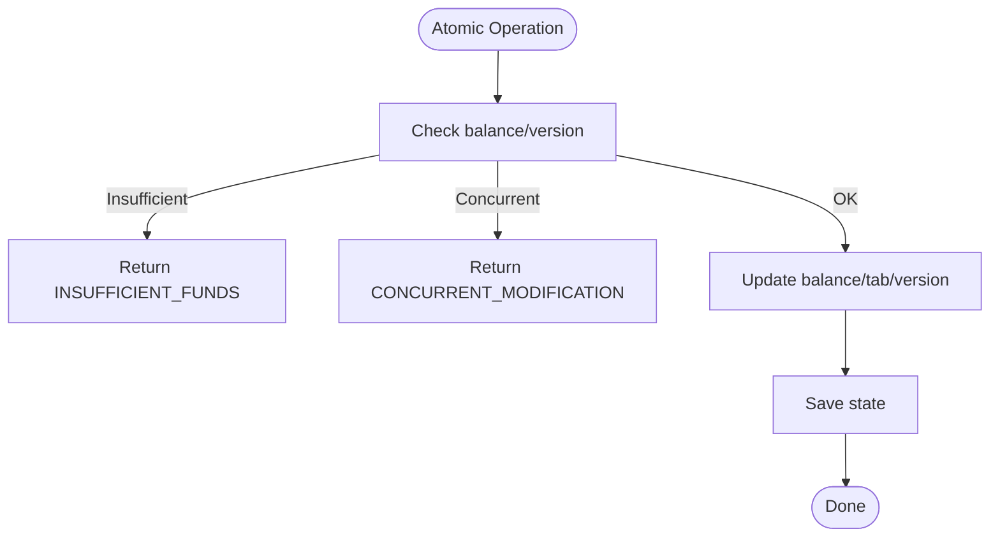
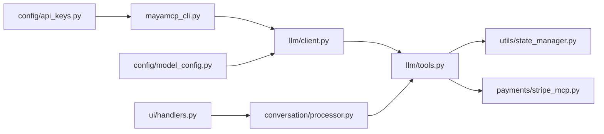

# Tool APIs

<cite>
**Referenced Files in This Document**
- [src/llm/tools.py](file://src/llm/tools.py)
- [src/payments/stripe_mcp.py](file://src/payments/stripe_mcp.py)
- [src/utils/state_manager.py](file://src/utils/state_manager.py)
- [src/llm/client.py](file://src/llm/client.py)
- [src/llm/__init__.py](file://src/llm/__init__.py)
- [src/mayamcp_cli.py](file://src/mayamcp_cli.py)
- [src/config/api_keys.py](file://src/config/api_keys.py)
- [src/config/model_config.py](file://src/config/model_config.py)
- [src/ui/handlers.py](file://src/ui/handlers.py)
- [tests/test_llm_tools.py](file://tests/test_llm_tools.py)
- [src/conversation/processor.py](file://src/conversation/processor.py)
</cite>

## Table of Contents
1. [Introduction](#introduction)
2. [Project Structure](#project-structure)
3. [Core Components](#core-components)
4. [Architecture Overview](#architecture-overview)
5. [Detailed Component Analysis](#detailed-component-analysis)
6. [Dependency Analysis](#dependency-analysis)
7. [Performance Considerations](#performance-considerations)
8. [Troubleshooting Guide](#troubleshooting-guide)
9. [Conclusion](#conclusion)
10. [Appendices](#appendices)

## Introduction
This document describes MayaMCP’s tool registration and invocation system for external service integration. It focuses on:
- Tool registration and discovery
- Tool function signatures, parameter schemas, and return value formats
- Tool binding with the LLM client and function calling protocol
- Payment tool APIs (charge creation, balance validation, transaction status checking)
- Order management tool APIs (menu queries, item validation, order modification)
- Examples of tool invocation patterns, error handling, state synchronization, and security considerations

## Project Structure
MayaMCP organizes tool-related logic under the LLM integration layer, with state management and payment services as supporting subsystems. Tools are registered and exposed to the LLM, which can select and execute them based on user intent.

**Diagram sources**
- [src/mayamcp_cli.py](file://src/mayamcp_cli.py#L55-L58)
- [src/llm/__init__.py](file://src/llm/__init__.py#L3-L5)
- [src/llm/client.py](file://src/llm/client.py#L91-L128)
- [src/llm/tools.py](file://src/llm/tools.py#L1047-L1066)
- [src/utils/state_manager.py](file://src/utils/state_manager.py#L685-L756)
- [src/payments/stripe_mcp.py](file://src/payments/stripe_mcp.py#L66-L107)
- [src/ui/handlers.py](file://src/ui/handlers.py#L23-L184)
- [src/conversation/processor.py](file://src/conversation/processor.py#L364-L394)
- [src/config/api_keys.py](file://src/config/api_keys.py#L10-L22)
- [src/config/model_config.py](file://src/config/model_config.py#L31-L44)

**Section sources**
- [src/mayamcp_cli.py](file://src/mayamcp_cli.py#L55-L58)
- [src/llm/__init__.py](file://src/llm/__init__.py#L3-L5)
- [src/llm/client.py](file://src/llm/client.py#L91-L128)
- [src/llm/tools.py](file://src/llm/tools.py#L1047-L1066)

## Core Components
- Tool registry and functions: centralized in the tools module, exposing both order and payment tools plus menu and recommendation utilities.
- LLM client and tool binding: initializes the LLM and binds the tool list for function calling.
- State manager: provides atomic operations for payment state, order state, and concurrency control.
- Payment service: Stripe MCP client abstraction with retry, availability probing, and fallback mechanisms.
- UI and processor: orchestrate tool execution in response to user input and LLM tool calls.

Key responsibilities:
- Tool registration: tools are collected via a registry function and passed to the LLM initializer.
- Tool invocation: the processor resolves tool names to functions and executes them with validated arguments.
- State synchronization: atomic operations ensure consistent updates to balances, tabs, tips, and payment statuses.

**Section sources**
- [src/llm/tools.py](file://src/llm/tools.py#L1047-L1066)
- [src/llm/client.py](file://src/llm/client.py#L91-L128)
- [src/utils/state_manager.py](file://src/utils/state_manager.py#L685-L814)
- [src/payments/stripe_mcp.py](file://src/payments/stripe_mcp.py#L66-L107)
- [src/conversation/processor.py](file://src/conversation/processor.py#L364-L394)

## Architecture Overview
The tool system integrates the LLM with external services through a structured function-calling protocol. Tools are registered at startup and invoked dynamically based on LLM decisions.

**Diagram sources**
- [src/ui/handlers.py](file://src/ui/handlers.py#L23-L184)
- [src/conversation/processor.py](file://src/conversation/processor.py#L364-L394)
- [src/llm/client.py](file://src/llm/client.py#L91-L128)
- [src/llm/tools.py](file://src/llm/tools.py#L221-L316)
- [src/utils/state_manager.py](file://src/utils/state_manager.py#L685-L814)
- [src/payments/stripe_mcp.py](file://src/payments/stripe_mcp.py#L183-L272)

## Detailed Component Analysis

### Tool Registration and Discovery
- Tool discovery: a registry function returns the complete list of tools for binding to the LLM.
- Tool binding: the LLM client binds the tool list to enable function calling.

**Diagram sources**
- [src/llm/tools.py](file://src/llm/tools.py#L1047-L1066)
- [src/llm/client.py](file://src/llm/client.py#L115-L124)

**Section sources**
- [src/llm/tools.py](file://src/llm/tools.py#L1047-L1066)
- [src/llm/client.py](file://src/llm/client.py#L91-L128)

### Payment Tool APIs

#### add_to_order_with_balance
- Purpose: Add an item to the order if the user has sufficient balance; atomically update balance and tab.
- Parameters:
  - item_name: string
  - modifiers: optional list of strings
  - quantity: integer (default 1)
- Returns:
  - Success: ToolSuccess with fields: item, new_balance, new_tab
  - Error: ToolError with error code and message; possible codes include INSUFFICIENT_FUNDS, CONCURRENT_MODIFICATION, INVALID_SESSION
- Behavior:
  - Validates session context and menu presence
  - Parses menu to compute price
  - Performs atomic order update with optimistic locking
  - Updates order state for display

**Section sources**
- [src/llm/tools.py](file://src/llm/tools.py#L221-L316)
- [src/utils/state_manager.py](file://src/utils/state_manager.py#L685-L756)

#### get_balance
- Purpose: Return current user balance and tab.
- Parameters: none
- Returns:
  - Success: ToolSuccess with fields: balance, tab
  - Error: ToolError with INVALID_SESSION

**Section sources**
- [src/llm/tools.py](file://src/llm/tools.py#L319-L343)

#### create_stripe_payment
- Purpose: Create a Stripe payment link for the current tab using the MCP server; falls back to simulated payment if unavailable.
- Parameters: none
- Returns:
  - Success: ToolSuccess with fields: url, payment_id, is_simulated
  - Error: ToolError with STRIPE_UNAVAILABLE or INVALID_SESSION
- Behavior:
  - Checks session context and computes total (tab + tip)
  - Generates idempotency key and stores state
  - Calls Stripe MCP client with retry and fallback logic
  - Stores payment_id and logs result

**Section sources**
- [src/llm/tools.py](file://src/llm/tools.py#L358-L471)
- [src/payments/stripe_mcp.py](file://src/payments/stripe_mcp.py#L183-L272)

#### check_payment_status
- Purpose: Poll Stripe MCP server for payment status; supports timeout handling.
- Parameters: none
- Returns:
  - Success: ToolSuccess with field: payment_status (pending, succeeded, failed, timeout)
  - Error: ToolError with PAYMENT_FAILED, INVALID_SESSION, or PAYMENT_TIMEOUT
- Behavior:
  - Retrieves stored payment_id
  - Runs async status poll with deadlines and timeouts
  - On success, performs atomic payment completion

**Section sources**
- [src/llm/tools.py](file://src/llm/tools.py#L474-L554)
- [src/payments/stripe_mcp.py](file://src/payments/stripe_mcp.py#L348-L441)
- [src/utils/state_manager.py](file://src/utils/state_manager.py#L780-L814)

#### set_tip
- Purpose: Set or remove tip percentage; implements toggle behavior.
- Parameters:
  - percentage: optional integer from {10, 15, 20}; passing the same value toggles removal
- Returns:
  - Success: ToolSuccess with fields: tip_percentage, tip_amount, total
  - Error: ToolError with INVALID_TIP_PERCENTAGE or INVALID_SESSION
- Behavior:
  - Validates percentage against allowed set
  - Updates tip in state and recomputes total

**Section sources**
- [src/llm/tools.py](file://src/llm/tools.py#L557-L616)
- [src/utils/state_manager.py](file://src/utils/state_manager.py#L556-L609)

#### get_tip
- Purpose: Retrieve current tip information.
- Parameters: none
- Returns:
  - Success: ToolSuccess with fields: tip_percentage, tip_amount, tab, total
  - Error: ToolError with INVALID_SESSION

**Section sources**
- [src/llm/tools.py](file://src/llm/tools.py#L618-L648)

### Order Management Tool APIs

#### get_menu
- Purpose: Provide the latest menu text.
- Parameters: none
- Returns: string (menu content)

**Section sources**
- [src/llm/tools.py](file://src/llm/tools.py#L651-L702)

#### get_recommendation
- Purpose: Recommend drinks based on preference.
- Parameters:
  - preference: string (e.g., sobering, classy, fruity, strong, burning)
- Returns: string (recommendation text)

**Section sources**
- [src/llm/tools.py](file://src/llm/tools.py#L704-L747)

#### add_to_order
- Purpose: Add item to order; if session context is available, enforces balance checks.
- Parameters:
  - item_name: string
  - modifiers: optional list of strings
  - quantity: integer (default 1)
- Returns: string confirmation or error message
- Behavior:
  - If session context present, delegates to add_to_order_with_balance
  - Otherwise parses menu and adds item without balance checks

**Section sources**
- [src/llm/tools.py](file://src/llm/tools.py#L761-L840)

#### get_order
- Purpose: Return current order list with quantities and modifiers.
- Parameters: none
- Returns: string formatted order summary and total

**Section sources**
- [src/llm/tools.py](file://src/llm/tools.py#L842-L873)

#### confirm_order
- Purpose: Present current order for confirmation.
- Parameters: none
- Returns: string confirmation prompt including total

**Section sources**
- [src/llm/tools.py](file://src/llm/tools.py#L875-L897)

#### place_order
- Purpose: Finalize and place the order; simulates preparation time.
- Parameters: none
- Returns: string success message with estimated time

**Section sources**
- [src/llm/tools.py](file://src/llm/tools.py#L899-L932)

#### clear_order
- Purpose: Remove all items from the current order.
- Parameters: none
- Returns: string confirmation

**Section sources**
- [src/llm/tools.py](file://src/llm/tools.py#L934-L938)

#### get_bill
- Purpose: Calculate and format the bill including tip.
- Parameters: none
- Returns: string formatted bill

**Section sources**
- [src/llm/tools.py](file://src/llm/tools.py#L940-L977)

#### pay_bill
- Purpose: Mark the bill as paid.
- Parameters: none
- Returns: string confirmation

**Section sources**
- [src/llm/tools.py](file://src/llm/tools.py#L979-L1000)

#### add_tip (legacy order tool)
- Purpose: Add tip as percentage or fixed amount.
- Parameters:
  - percentage: float (overrides amount if > 0)
  - amount: float (ignored if percentage > 0)
- Returns: string confirmation with new total

**Section sources**
- [src/llm/tools.py](file://src/llm/tools.py#L1002-L1045)

### Tool Invocation Protocol and Function Calling
- Tool binding: The LLM client binds the tool list returned by the registry.
- Tool execution: The processor resolves tool names to functions and invokes them with validated arguments.
- Error handling: Malformed arguments and exceptions are caught and reported as errors.

**Diagram sources**
- [src/llm/client.py](file://src/llm/client.py#L115-L124)
- [src/conversation/processor.py](file://src/conversation/processor.py#L364-L394)
- [src/llm/tools.py](file://src/llm/tools.py#L1047-L1066)

**Section sources**
- [src/llm/client.py](file://src/llm/client.py#L91-L128)
- [src/conversation/processor.py](file://src/conversation/processor.py#L364-L394)

### State Synchronization After Tool Execution
- Atomic operations: Payment updates use optimistic locking to prevent concurrent modifications.
- Payment completion: On successful payment, the system resets tab and tip and marks payment as completed.
- Order state: Order additions and modifications update both current order and history.

**Diagram sources**
- [src/utils/state_manager.py](file://src/utils/state_manager.py#L685-L756)
- [src/utils/state_manager.py](file://src/utils/state_manager.py#L780-L814)

**Section sources**
- [src/utils/state_manager.py](file://src/utils/state_manager.py#L685-L814)

### Dynamic Loading and Security Considerations
- Dynamic loading: Tools are discovered at runtime via the registry function and bound to the LLM.
- Security:
  - Session context isolation: Tools read session context from thread-local storage to ensure per-session state.
  - Idempotency: Payment creation uses idempotency keys to prevent duplicate charges.
  - Fallback safety: Stripe MCP client falls back to simulated payments when unavailable.
  - Validation: Payment state updates are validated to enforce invariants.

**Section sources**
- [src/llm/tools.py](file://src/llm/tools.py#L174-L218)
- [src/payments/stripe_mcp.py](file://src/payments/stripe_mcp.py#L109-L128)
- [src/utils/state_manager.py](file://src/utils/state_manager.py#L66-L167)

## Dependency Analysis
The tool system depends on:
- LLM client for function calling
- State manager for atomic updates
- Stripe MCP client for payment operations
- UI and processor for orchestrating tool execution

**Diagram sources**
- [src/llm/tools.py](file://src/llm/tools.py#L1047-L1066)
- [src/utils/state_manager.py](file://src/utils/state_manager.py#L685-L814)
- [src/payments/stripe_mcp.py](file://src/payments/stripe_mcp.py#L66-L107)
- [src/llm/client.py](file://src/llm/client.py#L91-L128)
- [src/conversation/processor.py](file://src/conversation/processor.py#L364-L394)
- [src/ui/handlers.py](file://src/ui/handlers.py#L23-L184)
- [src/mayamcp_cli.py](file://src/mayamcp_cli.py#L55-L58)
- [src/config/api_keys.py](file://src/config/api_keys.py#L10-L22)
- [src/config/model_config.py](file://src/config/model_config.py#L31-L44)

**Section sources**
- [src/llm/tools.py](file://src/llm/tools.py#L1047-L1066)
- [src/utils/state_manager.py](file://src/utils/state_manager.py#L685-L814)
- [src/payments/stripe_mcp.py](file://src/payments/stripe_mcp.py#L66-L107)
- [src/llm/client.py](file://src/llm/client.py#L91-L128)
- [src/conversation/processor.py](file://src/conversation/processor.py#L364-L394)
- [src/ui/handlers.py](file://src/ui/handlers.py#L23-L184)
- [src/mayamcp_cli.py](file://src/mayamcp_cli.py#L55-L58)
- [src/config/api_keys.py](file://src/config/api_keys.py#L10-L22)
- [src/config/model_config.py](file://src/config/model_config.py#L31-L44)

## Performance Considerations
- Asynchronous payment operations: Stripe MCP client uses async polling and retries to avoid blocking threads.
- Idempotency: Idempotency keys prevent duplicate payment link creation under retries.
- Concurrency control: Thread locks and optimistic locking minimize contention and race conditions.
- UI responsiveness: Tool execution is handled asynchronously via the processor and UI callbacks.

[No sources needed since this section provides general guidance]

## Troubleshooting Guide
Common issues and resolutions:
- Tool invocation failures:
  - Malformed arguments: The processor catches and reports argument errors.
  - Exceptions during tool execution: Errors are logged and returned as error messages.
- Payment failures:
  - STRIPE_UNAVAILABLE: Indicates MCP server unavailability; the system falls back to simulated payment.
  - PAYMENT_TIMEOUT: Payment status polling exceeded deadline; advise retry.
  - INVALID_SESSION: Session context missing; require user to refresh.
- State inconsistencies:
  - CONCURRENT_MODIFICATION: Optimistic lock mismatch; instruct user to retry.
  - INSUFFICIENT_FUNDS: Balance lower than item cost; suggest topping up or removing items.

**Section sources**
- [src/conversation/processor.py](file://src/conversation/processor.py#L380-L394)
- [src/llm/tools.py](file://src/llm/tools.py#L139-L166)
- [src/llm/tools.py](file://src/llm/tools.py#L466-L471)
- [src/llm/tools.py](file://src/llm/tools.py#L529-L533)
- [src/utils/state_manager.py](file://src/utils/state_manager.py#L724-L729)

## Conclusion
MayaMCP’s tool system provides a robust, extensible framework for integrating external services with the LLM. Tools are cleanly separated into order and payment domains, with strong state synchronization, error handling, and fallback mechanisms. The system supports dynamic registration, secure session isolation, and asynchronous operations to ensure reliability and responsiveness.

[No sources needed since this section summarizes without analyzing specific files]

## Appendices

### API Reference Summary

- Payment Tools
  - add_to_order_with_balance(item_name, modifiers=None, quantity=1) -> ToolSuccess | ToolError
  - get_balance() -> ToolSuccess | ToolError
  - create_stripe_payment() -> ToolSuccess | ToolError
  - check_payment_status() -> ToolSuccess | ToolError
  - set_tip(percentage=None) -> ToolSuccess | ToolError
  - get_tip() -> ToolSuccess | ToolError

- Order Tools
  - get_menu() -> string
  - get_recommendation(preference) -> string
  - add_to_order(item_name, modifiers=None, quantity=1) -> string
  - get_order() -> string
  - confirm_order() -> string
  - place_order() -> string
  - clear_order() -> string
  - get_bill() -> string
  - pay_bill() -> string
  - add_tip(percentage=0.0, amount=0.0) -> string

- Tool Response Types
  - ToolSuccess: {"status": "ok", "result": dict}
  - ToolError: {"status": "error", "error": string, "message": string}

- Error Codes
  - INSUFFICIENT_FUNDS, STRIPE_UNAVAILABLE, PAYMENT_FAILED, CONCURRENT_MODIFICATION, NETWORK_ERROR, RATE_LIMITED, INVALID_SESSION, ITEM_NOT_FOUND, PAYMENT_TIMEOUT, INVALID_TIP_PERCENTAGE

**Section sources**
- [src/llm/tools.py](file://src/llm/tools.py#L36-L166)
- [src/llm/tools.py](file://src/llm/tools.py#L221-L648)
- [src/llm/tools.py](file://src/llm/tools.py#L651-L1045)