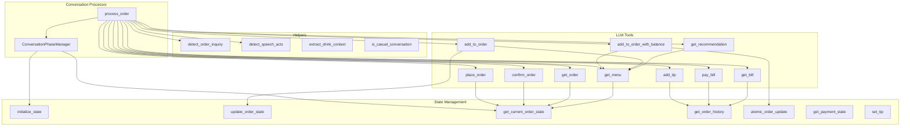
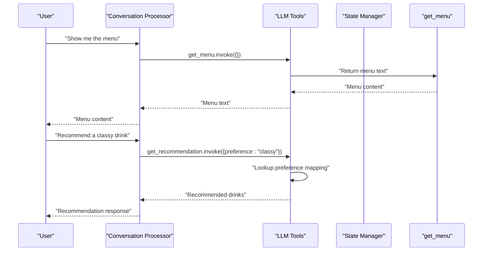
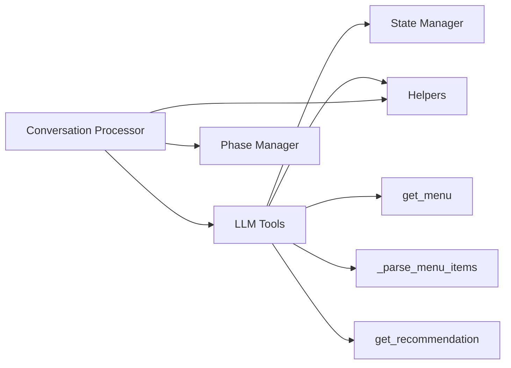

# Utility Tool API

<cite>
**Referenced Files in This Document**
- [tools.py](file://src/llm/tools.py)
- [helpers.py](file://src/utils/helpers.py)
- [state_manager.py](file://src/utils/state_manager.py)
- [processor.py](file://src/conversation/processor.py)
- [phase_manager.py](file://src/conversation/phase_manager.py)
- [test_llm_tools.py](file://tests/test_llm_tools.py)
</cite>

## Table of Contents
1. [Introduction](#introduction)
2. [Project Structure](#project-structure)
3. [Core Components](#core-components)
4. [Architecture Overview](#architecture-overview)
5. [Detailed Component Analysis](#detailed-component-analysis)
6. [Dependency Analysis](#dependency-analysis)
7. [Performance Considerations](#performance-considerations)
8. [Troubleshooting Guide](#troubleshooting-guide)
9. [Conclusion](#conclusion)

## Introduction
This document describes the Utility Tool API focused on menu retrieval, drink recommendations, and helper functions. It covers:
- The get_menu tool for retrieving the complete beverage menu with pricing and modifier options
- The get_recommendation tool that provides personalized drink suggestions based on user preferences like 'classy', 'strong', 'fruity', 'sobering', and 'burning'
- The menu parsing functionality and recommendation algorithms
- Examples of tool usage patterns, parameter validation, and response formatting
- Fallback mechanisms when preferences are not recognized
- Integration with the broader conversation system

## Project Structure
The Utility Tool API resides primarily in the LLM tools module and integrates with state management and conversation processors:
- Tools: get_menu, get_recommendation, add_to_order, and related order/payment tools
- Helpers: intent detection and speech act analysis for conversation integration
- State Manager: session state, order history, and atomic operations
- Processor: orchestrates tool calls within conversation phases

**Diagram sources**
- [tools.py](file://src/llm/tools.py#L652-L1066)
- [helpers.py](file://src/utils/helpers.py#L1-L265)
- [state_manager.py](file://src/utils/state_manager.py#L447-L529)
- [processor.py](file://src/conversation/processor.py#L83-L456)
- [phase_manager.py](file://src/conversation/phase_manager.py#L10-L92)

**Section sources**
- [tools.py](file://src/llm/tools.py#L1-L1066)
- [helpers.py](file://src/utils/helpers.py#L1-L265)
- [state_manager.py](file://src/utils/state_manager.py#L1-L814)
- [processor.py](file://src/conversation/processor.py#L1-L456)
- [phase_manager.py](file://src/conversation/phase_manager.py#L1-L92)

## Core Components
- get_menu: Returns the latest menu text including categories, items, prices, modifiers, and preference guide.
- get_recommendation: Provides personalized drink suggestions based on user preferences with fallback behavior.
- add_to_order: Adds drinks to the order with optional modifiers and quantity, integrating with menu parsing and state updates.
- Menu parsing: Internal parser extracts items and prices from the menu string.
- Recommendation algorithm: Preference-driven mapping with case-insensitive matching and fallback recommendations.

**Section sources**
- [tools.py](file://src/llm/tools.py#L652-L760)
- [tools.py](file://src/llm/tools.py#L705-L748)
- [tools.py](file://src/llm/tools.py#L749-L759)
- [tools.py](file://src/llm/tools.py#L761-L840)

## Architecture Overview
The Utility Tool API operates within a conversation loop:
- The processor sets session context and invokes tools based on user input and detected intents.
- Tools interact with state management for order history and balances.
- Recommendations integrate with menu parsing to ensure consistency.

**Diagram sources**
- [processor.py](file://src/conversation/processor.py#L244-L300)
- [tools.py](file://src/llm/tools.py#L652-L703)
- [tools.py](file://src/llm/tools.py#L705-L748)

## Detailed Component Analysis

### get_menu Tool
Purpose:
- Provide the latest up-to-date menu text including categories, items, prices, modifiers, and preference guide.

Key behaviors:
- Returns structured menu text with sections for cocktails, beer, spirits, non-alcoholic beverages, modifiers, explanations, and preference guide.
- Used by other tools to parse items and prices for order operations.

Usage pattern:
- Called via invoke with no parameters.
- Integrates with add_to_order and add_to_order_with_balance for menu parsing.

Validation and response formatting:
- Returns raw text; downstream tools parse and validate items.

Integration:
- Accessed by add_to_order and add_to_order_with_balance to validate item availability and compute prices.

**Section sources**
- [tools.py](file://src/llm/tools.py#L652-L703)
- [tools.py](file://src/llm/tools.py#L783-L840)

### get_recommendation Tool
Purpose:
- Recommend drinks based on user preferences with a preference guide.

Algorithm:
- Maintains a mapping of preferences to drink lists and descriptions.
- Converts input to lowercase for case-insensitive matching.
- If preference is recognized, returns a formatted recommendation string.
- If preference is not recognized, returns a fallback recommendation including popular drinks.

Parameters:
- preference: string representing user preference (e.g., 'classy', 'strong', 'fruity', 'sobering', 'burning')

Response formatting:
- Returns a string describing the recommendation and listing drinks.
- Fallback message includes popular drinks when preference is unknown.

Validation:
- Case-insensitive matching ensures robustness.
- Unknown preferences trigger fallback behavior.

Usage examples:
- Preference: "sobering" -> returns non-alcoholic options
- Preference: "classy" -> returns classic cocktails
- Preference: "fruity" -> returns fruity cocktails and drinks
- Preference: "strong" -> returns high-alcohol options
- Preference: "burning" -> returns straight spirit options
- Unknown preference -> returns popular drinks

**Section sources**
- [tools.py](file://src/llm/tools.py#L705-L748)
- [test_llm_tools.py](file://tests/test_llm_tools.py#L58-L120)

### Menu Parsing Functionality
Purpose:
- Parse the menu text returned by get_menu into a structured dictionary of items and prices.

Implementation:
- Uses regex to match lines in the format "Item Name - $XX.XX".
- Builds a dictionary mapping lowercased item names to prices.

Complexity:
- Linear in the length of the menu text.
- Efficient for typical menu sizes.

Edge cases:
- Handles whitespace around item names and prices.
- Ignores malformed lines.

Integration:
- Used by add_to_order and add_to_order_with_balance to validate items and compute totals.

**Section sources**
- [tools.py](file://src/llm/tools.py#L749-L759)

### Recommendation Algorithm
Purpose:
- Provide personalized drink recommendations aligned with user preferences.

Structure:
- preferences_map: maps preference keywords to drink lists and descriptions.
- Case-insensitive lookup.
- Fallback to popular drinks when preference is unrecognized.

Fallback mechanism:
- Unknown preference triggers a message recommending popular drinks.

Response formatting:
- Concatenates description and drink list into a single string.

Testing:
- Verified case insensitivity and fallback behavior.

**Section sources**
- [tools.py](file://src/llm/tools.py#L714-L748)
- [test_llm_tools.py](file://tests/test_llm_tools.py#L106-L120)

### Integration with Conversation System
Purpose:
- Seamlessly incorporate menu retrieval and recommendations into the conversation flow.

Components:
- Conversation Processor: orchestrates tool calls, manages session context, and applies intent detection.
- Phase Manager: transitions between conversation phases (greeting, order-taking, small talk, reorder prompt).
- Helpers: detect order inquiries and speech acts to route user input appropriately.

Behavior:
- Session context is set for tools to access session-specific state.
- Intent detection routes requests for menu, order, and bill to appropriate tools.
- Speech act analysis recognizes order confirmation patterns and contextual drinks.

**Section sources**
- [processor.py](file://src/conversation/processor.py#L115-L202)
- [processor.py](file://src/conversation/processor.py#L204-L242)
- [processor.py](file://src/conversation/processor.py#L244-L456)
- [phase_manager.py](file://src/conversation/phase_manager.py#L10-L92)
- [helpers.py](file://src/utils/helpers.py#L9-L69)
- [helpers.py](file://src/utils/helpers.py#L113-L209)

## Dependency Analysis
Key dependencies and relationships:
- Tools depend on state management for order history and balances.
- Conversation processor depends on tools and helpers for intent detection.
- get_recommendation depends on get_menu for consistency with menu content.
- Menu parsing is internal to tools and used by order tools.

**Diagram sources**
- [tools.py](file://src/llm/tools.py#L652-L1066)
- [state_manager.py](file://src/utils/state_manager.py#L447-L529)
- [helpers.py](file://src/utils/helpers.py#L1-L265)
- [processor.py](file://src/conversation/processor.py#L83-L456)
- [phase_manager.py](file://src/conversation/phase_manager.py#L10-L92)

**Section sources**
- [tools.py](file://src/llm/tools.py#L652-L1066)
- [state_manager.py](file://src/utils/state_manager.py#L447-L529)
- [helpers.py](file://src/utils/helpers.py#L1-L265)
- [processor.py](file://src/conversation/processor.py#L83-L456)
- [phase_manager.py](file://src/conversation/phase_manager.py#L10-L92)

## Performance Considerations
- Menu parsing uses regex matching; performance scales linearly with menu text length.
- Recommendation lookup is O(1) due to dictionary mapping.
- Conversation processor limits message history and performs intent detection to reduce unnecessary tool calls.
- Session context and state updates are thread-safe with locks to prevent race conditions.

## Troubleshooting Guide
Common issues and resolutions:
- Unknown preference in get_recommendation:
  - Symptom: Generic fallback recommendation.
  - Resolution: Ensure preference matches supported keywords or provide a clearer description.
- Item not found in menu:
  - Symptom: Error message indicating item not found.
  - Resolution: Verify spelling and capitalization; use get_menu to confirm availability.
- Balance insufficient when adding items:
  - Symptom: Error response indicating insufficient funds.
  - Resolution: Check current balance via get_balance; adjust selection or add funds.
- Session context not set:
  - Symptom: Tools fall back to legacy behavior.
  - Resolution: Ensure session context is set before invoking tools in the conversation processor.

**Section sources**
- [tools.py](file://src/llm/tools.py#L221-L317)
- [tools.py](file://src/llm/tools.py#L783-L840)
- [processor.py](file://src/conversation/processor.py#L115-L118)

## Conclusion
The Utility Tool API provides robust menu retrieval, personalized recommendations, and seamless integration with the conversation system. The tools are designed for reliability, with clear fallbacks and consistent response formatting. The integration with state management and conversation processors ensures a smooth user experience across different interaction modes.