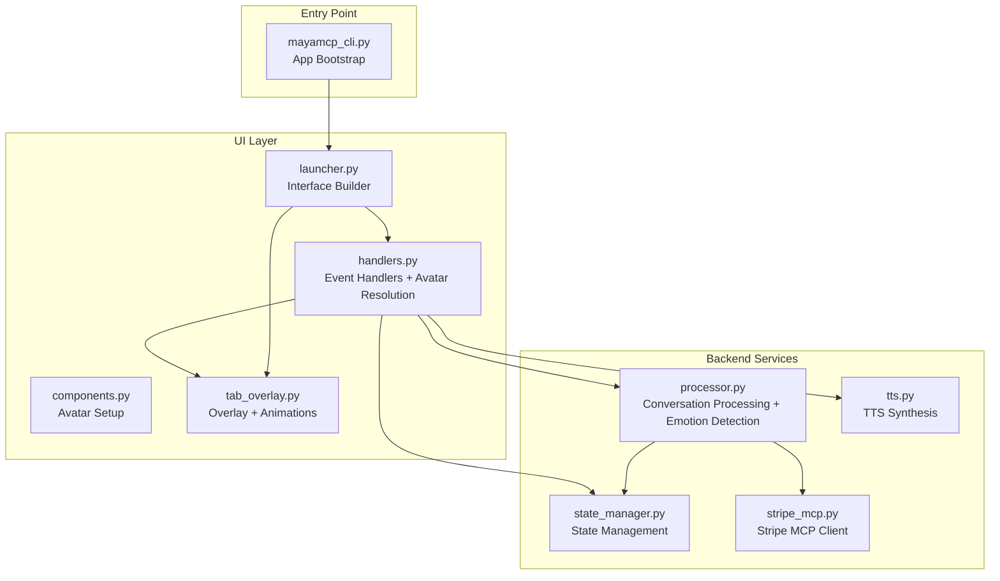
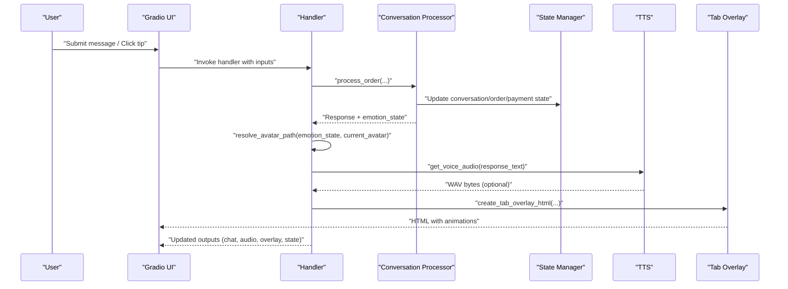
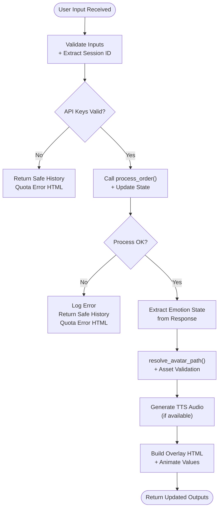
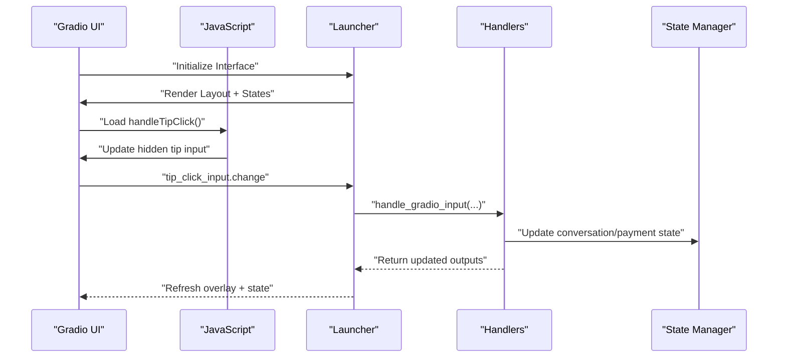
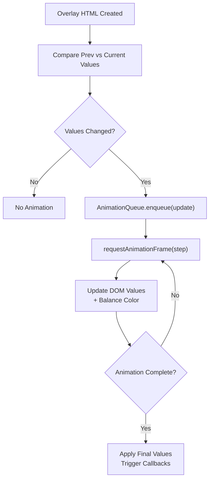
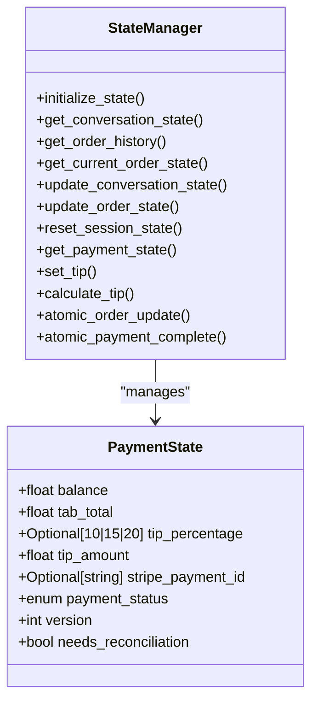
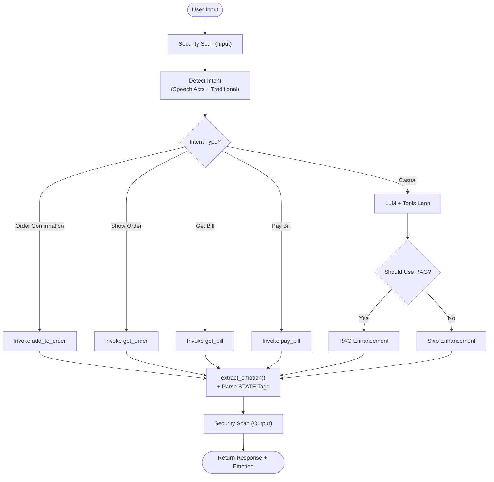
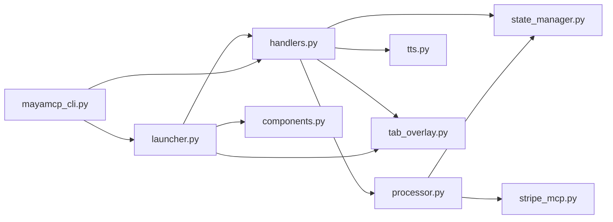

# UI Handler API

<cite>
**Referenced Files in This Document**
- [handlers.py](file://src/ui/handlers.py)
- [launcher.py](file://src/ui/launcher.py)
- [components.py](file://src/ui/components.py)
- [tab_overlay.py](file://src/ui/tab_overlay.py)
- [state_manager.py](file://src/utils/state_manager.py)
- [processor.py](file://src/conversation/processor.py)
- [tts.py](file://src/voice/tts.py)
- [stripe_mcp.py](file://src/payments/stripe_mcp.py)
- [mayamcp_cli.py](file://src/mayamcp_cli.py)
- [test_ui_handlers.py](file://tests/test_ui_handlers.py)
- [EMOTION_SYSTEM.md](file://docs/EMOTION_SYSTEM.md)
</cite>

## Update Summary
**Changes Made**
- Updated avatar resolution logic to be centralized in handlers with emotion-aware switching
- Removed deprecated tip functionality from the UI handler system
- Enhanced integration with emotion state detection for dynamic avatar switching
- Updated handler signatures to reflect new avatar resolution and state management
- Revised architecture diagrams to show emotion-based avatar state management

## Table of Contents
1. [Introduction](#introduction)
2. [Project Structure](#project-structure)
3. [Core Components](#core-components)
4. [Architecture Overview](#architecture-overview)
5. [Detailed Component Analysis](#detailed-component-analysis)
6. [Dependency Analysis](#dependency-analysis)
7. [Performance Considerations](#performance-considerations)
8. [Troubleshooting Guide](#troubleshooting-guide)
9. [Conclusion](#conclusion)
10. [Appendices](#appendices)

## Introduction
This document provides comprehensive API documentation for the UI handler system that powers Maya the bartender's conversational interface. The system has been refactored to improve modularity and maintainability, with centralized avatar resolution logic and enhanced emotion state detection integration. The system focuses on event processing, component communication, and user interaction management with emotion-aware avatar switching and streamlined tip handling.

Key capabilities include:
- Centralized avatar resolution with emotion-aware switching and asset validation
- Event routing and handler registration for user input and clear actions
- Real-time UI updates via tab overlay animations and dynamic avatar state management
- Backend integration with conversation processing, RAG, and payment state
- Robust error handling and graceful degradation for user interactions
- Extensible patterns for custom handlers and component composition

## Project Structure
The UI handler system is organized around four primary modules with enhanced modularity:
- UI handlers: event callbacks for Gradio components with centralized avatar resolution
- Launcher: Gradio interface assembly and event wiring with simplified tip handling
- Tab overlay: HTML/CSS/JS overlay with animations and emotion state visualization
- State manager: thread-safe session and payment state management
- Conversation processor: intent detection, tool calling, RAG integration, and emotion state extraction
- TTS: text-to-speech synthesis with retry logic
- Payments: Stripe MCP client for payment link generation and status polling
- CLI: application entry point that wires handlers and dependencies

**Diagram sources**
- [handlers.py](file://src/ui/handlers.py#L1-L259)
- [launcher.py](file://src/ui/launcher.py#L1-L362)
- [tab_overlay.py](file://src/ui/tab_overlay.py#L1-L595)
- [state_manager.py](file://src/utils/state_manager.py#L1-L814)
- [processor.py](file://src/conversation/processor.py#L1-L480)
- [tts.py](file://src/voice/tts.py#L1-L200)
- [stripe_mcp.py](file://src/payments/stripe_mcp.py#L1-L475)
- [mayamcp_cli.py](file://src/mayamcp_cli.py#L1-L133)

**Section sources**
- [handlers.py](file://src/ui/handlers.py#L1-L259)
- [launcher.py](file://src/ui/launcher.py#L1-L362)
- [tab_overlay.py](file://src/ui/tab_overlay.py#L1-L595)
- [state_manager.py](file://src/utils/state_manager.py#L1-L814)
- [processor.py](file://src/conversation/processor.py#L1-L480)
- [tts.py](file://src/voice/tts.py#L1-L200)
- [stripe_mcp.py](file://src/payments/stripe_mcp.py#L1-L475)
- [mayamcp_cli.py](file://src/mayamcp_cli.py#L1-L133)

## Core Components
- Event handlers: user input processing, clear state, and centralized avatar resolution with emotion awareness
- Launcher: builds Gradio interface, wires events, and manages overlay state with simplified tip handling
- Tab overlay: renders avatar with animated tab/balance display and emotion state visualization
- State manager: maintains session, order, and payment state with thread safety
- Conversation processor: orchestrates LLM, tool calls, RAG, security scanning, and emotion state extraction
- TTS: synthesizes speech with retry logic and text cleaning
- Payments: Stripe MCP client for payment link creation and status polling
- CLI: initializes dependencies and registers handlers with partial application

**Section sources**
- [handlers.py](file://src/ui/handlers.py#L1-L259)
- [launcher.py](file://src/ui/launcher.py#L1-L362)
- [tab_overlay.py](file://src/ui/tab_overlay.py#L1-L595)
- [state_manager.py](file://src/utils/state_manager.py#L1-L814)
- [processor.py](file://src/conversation/processor.py#L1-L480)
- [tts.py](file://src/voice/tts.py#L1-L200)
- [stripe_mcp.py](file://src/payments/stripe_mcp.py#L1-L475)
- [mayamcp_cli.py](file://src/mayamcp_cli.py#L1-L133)

## Architecture Overview
The UI handler system follows a layered architecture with centralized avatar resolution:
- Presentation layer: Gradio interface with stateful components and emotion-aware avatar display
- Event layer: handler functions that orchestrate processing, avatar resolution, and updates
- Processing layer: conversation processing, tool execution, RAG, and emotion state detection
- State layer: centralized, thread-safe state management
- Integration layer: TTS and payment services

**Diagram sources**
- [handlers.py](file://src/ui/handlers.py#L71-L229)
- [processor.py](file://src/conversation/processor.py#L83-L467)
- [state_manager.py](file://src/utils/state_manager.py#L1-L814)
- [tts.py](file://src/voice/tts.py#L1-L200)
- [tab_overlay.py](file://src/ui/tab_overlay.py#L151-L485)

## Detailed Component Analysis

### Event Handlers API
The event handlers module defines the core callback functions that process user interactions and coordinate backend services with centralized avatar resolution.

**Updated** The handler system now includes centralized avatar resolution logic with emotion-aware switching and enhanced error handling.

- handle_gradio_input
  - Purpose: Processes user input, invokes conversation logic, resolves avatar emotion, generates TTS, and updates UI state
  - Inputs: user text, session history, tab/balance states, request object, LLM, optional RAG/TTS clients, app state, avatar path
  - Outputs: cleared input, updated histories, order state, audio bytes, overlay HTML, new tab/balance, previous states, avatar path, quota error HTML
  - Behavior:
    - Extracts session ID from request
    - Validates API keys and handles quota errors
    - Calls conversation processor to generate response and update state
    - Resolves avatar emotion based on emotion state and asset availability
    - Generates TTS audio if available and response text is non-empty
    - Builds overlay HTML with animated tab/balance display
  - Error handling: Catches exceptions during processing, returns safe history and unchanged payment state, logs warnings, handles quota errors

- clear_chat_state
  - Purpose: Resets session state and clears UI components
  - Inputs: request object, optional app state
  - Outputs: empty chatbot, empty history, empty order, None audio
  - Behavior: Resets backend state via state manager; returns empty state even if reset fails

- resolve_avatar_path
  - Purpose: Centralized avatar resolution with emotion-aware switching and asset validation
  - Inputs: emotion state, current avatar path, logger
  - Outputs: final avatar path (either current or emotion-specific)
  - Behavior:
    - Normalizes emotion states to valid values
    - Checks for asset existence before switching
    - Logs warnings for missing assets and keeps current avatar
    - Returns current avatar path if emotion state is None or asset not found

**Diagram sources**
- [handlers.py](file://src/ui/handlers.py#L71-L229)
- [processor.py](file://src/conversation/processor.py#L83-L467)
- [tts.py](file://src/voice/tts.py#L1-L200)
- [tab_overlay.py](file://src/ui/tab_overlay.py#L151-L485)

**Section sources**
- [handlers.py](file://src/ui/handlers.py#L1-L259)
- [test_ui_handlers.py](file://tests/test_ui_handlers.py#L1-L410)

### Launcher and Event Wiring
The launcher constructs the Gradio interface and wires event handlers to UI components with simplified tip handling.

**Updated** The launcher now includes simplified tip handling that focuses on overlay state management rather than complex tip calculations.

- launch_bartender_interface
  - Purpose: Assembles the UI layout, defines state variables, and binds event handlers
  - Key elements:
    - Avatar overlay with tab/balance display and simplified tip state
    - Chatbot, audio output, text input, and clear/send buttons
    - Hidden tip input for JavaScript-driven tip button clicks
  - Event wiring:
    - msg_input.submit and submit_btn.click call the input handler with predefined inputs/outputs
    - JavaScript function handleTipClick updates hidden tip input and triggers change event
    - tip_click_input.change routes to a wrapper that handles simple overlay updates
    - clear_btn.click uses a wrapper to reset overlay to default state
  - State management:
    - Maintains gr.State variables for histories, orders, payment, and avatar path
    - Ensures avatar state persistence across updates

**Diagram sources**
- [launcher.py](file://src/ui/launcher.py#L50-L362)
- [handlers.py](file://src/ui/handlers.py#L71-L229)

**Section sources**
- [launcher.py](file://src/ui/launcher.py#L1-L362)

### Tab Overlay and Animations
The tab overlay module generates HTML/CSS/JS for the avatar with animated tab/balance display and emotion state visualization.

**Updated** The overlay system now focuses on emotion state visualization rather than complex tip calculations.

- create_tab_overlay_html
  - Purpose: Renders avatar with tab and balance counters, emotion state display, and simplified tip visualization
  - Features:
    - Animated count-up from previous to current values using requestAnimationFrame
    - Balance color changes based on thresholds
    - Emotion state visualization through avatar switching
    - Media support for image/video avatars with poster fallback
  - JavaScript animation queue:
    - Enqueues updates, collapses rapid successive updates, and runs animations
    - Provides callbacks for start, completion, and cancellation
  - Python mirror: AnimationQueue for testing and property-based validation

**Diagram sources**
- [tab_overlay.py](file://src/ui/tab_overlay.py#L151-L485)

**Section sources**
- [tab_overlay.py](file://src/ui/tab_overlay.py#L1-L595)

### State Management and Payment Integration
The state manager centralizes session, order, and payment state with thread safety and validation.

- Payment state schema and validation
  - Fields: balance, tab_total, tip_percentage, tip_amount, stripe_payment_id, payment_status, idempotency_key, version, needs_reconciliation
  - Validation rules: numeric bounds, enum constraints, pattern matching, mutual constraints
- Thread-safe session locking
  - Session locks protect concurrent modifications
  - Background cleanup of expired locks
- Atomic operations
  - atomic_order_update: optimistic locking with version checks
  - atomic_payment_complete: resets tab and marks as paid
- Tip calculation and toggle behavior
  - set_tip: calculates tip amount, handles toggle, returns new tip and total
- Conversation/order state functions
  - get/set for conversation, order history, current order, and totals

**Diagram sources**
- [state_manager.py](file://src/utils/state_manager.py#L17-L640)

**Section sources**
- [state_manager.py](file://src/utils/state_manager.py#L535-L640)

### Conversation Processing Pipeline
The conversation processor orchestrates LLM interactions, tool execution, RAG enhancement, security scanning, and emotion state detection.

**Updated** The processor now includes enhanced emotion state detection and extraction for dynamic avatar switching.

- process_order
  - Intent detection: speech acts and traditional intent matching
  - Tool calling: dynamic invocation of tools (add_to_order, get_order, get_bill, pay_bill)
  - RAG enhancement: optional Memvid or FAISS augmentation for casual conversations
  - Security scanning: input and output sanitization
  - Emotion extraction: parses emotion state from agent responses using regex pattern
  - Phase management: updates conversation phases and turn counts

**Diagram sources**
- [processor.py](file://src/conversation/processor.py#L83-L467)

**Section sources**
- [processor.py](file://src/conversation/processor.py#L1-L480)

### TTS Integration
The TTS module synthesizes speech with robust retry logic and text cleaning.

- get_voice_audio
  - Cleans text for pronunciation and monetary amounts
  - Initializes Cartesia client and synthesizes WAV bytes
  - Retries on retryable exceptions with exponential backoff
- clean_text_for_tts
  - Replaces brand names, formats money, removes problematic punctuation

**Section sources**
- [tts.py](file://src/voice/tts.py#L1-L200)

### Payment System Integration
The Stripe MCP client provides payment link creation and status polling with fallbacks.

- StripeMCPClient
  - Availability probing with caching
  - Payment link creation with retries and idempotency
  - Payment status polling with timeouts and deadlines
  - Mock fallback when Stripe is unavailable

**Section sources**
- [stripe_mcp.py](file://src/payments/stripe_mcp.py#L1-L475)

### Component Communication Patterns
- Handler-to-backend: Handlers call conversation processor and state manager, optionally TTS and RAG
- UI-to-handler: Gradio components trigger handlers via submit/click/change events
- Handler-to-UI: Handlers return updated outputs including overlay HTML, audio, and avatar state
- State synchronization: Payment state is consistently read/written via state manager functions

**Section sources**
- [handlers.py](file://src/ui/handlers.py#L1-L259)
- [launcher.py](file://src/ui/launcher.py#L1-L362)
- [state_manager.py](file://src/utils/state_manager.py#L1-L814)

### Custom Handler Implementation
To implement a custom handler:
- Define a function that accepts Gradio inputs and returns outputs in the same order as the existing handlers
- Use partial application to inject dependencies (LLM, TTS client, RAG components, app state)
- Register the handler in the launcher by wiring it to the appropriate event (submit, click, change)
- Ensure error handling and graceful fallbacks for optional services (TTS, RAG)

Example patterns:
- Partial application of dependencies: [mayamcp_cli.py](file://src/mayamcp_cli.py#L89-L104)
- Event wiring in launcher: [launcher.py](file://src/ui/launcher.py#L226-L227), [launcher.py](file://src/ui/launcher.py#L353-L357)

**Section sources**
- [mayamcp_cli.py](file://src/mayamcp_cli.py#L89-L104)
- [launcher.py](file://src/ui/launcher.py#L226-L227)
- [launcher.py](file://src/ui/launcher.py#L353-L357)

### Component Lifecycle Management
- Initialization: CLI initializes LLM, RAG, TTS, and app state; launches interface
- Event lifecycle: UI emits events; handlers process, update state, and return UI updates
- State lifecycle: State manager ensures thread-safe access and validation
- Cleanup: Session locks cleaned up on reset; expired locks periodically removed

**Section sources**
- [mayamcp_cli.py](file://src/mayamcp_cli.py#L1-L133)
- [state_manager.py](file://src/utils/state_manager.py#L229-L282)

## Dependency Analysis
The UI handler system exhibits clear separation of concerns with well-defined dependencies and enhanced modularity.

**Diagram sources**
- [handlers.py](file://src/ui/handlers.py#L1-L259)
- [launcher.py](file://src/ui/launcher.py#L1-L362)
- [processor.py](file://src/conversation/processor.py#L1-L480)
- [state_manager.py](file://src/utils/state_manager.py#L1-L814)
- [tts.py](file://src/voice/tts.py#L1-L200)
- [tab_overlay.py](file://src/ui/tab_overlay.py#L1-L595)
- [stripe_mcp.py](file://src/payments/stripe_mcp.py#L1-L475)
- [mayamcp_cli.py](file://src/mayamcp_cli.py#L1-L133)

**Section sources**
- [handlers.py](file://src/ui/handlers.py#L1-L259)
- [launcher.py](file://src/ui/launcher.py#L1-L362)
- [processor.py](file://src/conversation/processor.py#L1-L480)
- [state_manager.py](file://src/utils/state_manager.py#L1-L814)
- [tts.py](file://src/voice/tts.py#L1-L200)
- [tab_overlay.py](file://src/ui/tab_overlay.py#L1-L595)
- [stripe_mcp.py](file://src/payments/stripe_mcp.py#L1-L475)
- [mayamcp_cli.py](file://src/mayamcp_cli.py#L1-L133)

## Performance Considerations
- Event batching and collapsing: The overlay animation queue merges rapid successive updates to reduce rendering load
- Optional services: TTS and RAG are optional; handlers gracefully degrade when unavailable
- Concurrency control: Thread-safe session locks prevent race conditions and memory leaks
- Atomic operations: Optimistic locking minimizes contention and avoids inconsistent state
- Retry logic: TTS uses exponential backoff to handle transient failures
- UI responsiveness: Gradio queues and partial application ensure handlers remain responsive
- Avatar asset validation: Centralized avatar resolution prevents unnecessary file system operations

## Troubleshooting Guide
Common issues and resolutions:
- Handler exceptions: The input handler catches exceptions during processing and returns a safe history with unchanged payment state
- TTS failures: TTS generation failures are logged and handled gracefully; audio remains None
- RAG failures: RAG enhancement falls back to original response if components are unavailable
- State reset failures: Clearing chat state returns empty UI state even if backend reset fails
- Avatar resolution failures: Missing emotion assets are logged with warnings; system keeps current avatar
- Emotion state parsing: Invalid emotion states are normalized to "neutral" to prevent UI errors

**Section sources**
- [handlers.py](file://src/ui/handlers.py#L167-L229)
- [handlers.py](file://src/ui/handlers.py#L39-L68)
- [tts.py](file://src/voice/tts.py#L1-L200)
- [test_ui_handlers.py](file://tests/test_ui_handlers.py#L235-L267)

## Conclusion
The UI handler system provides a robust, extensible framework for managing user interactions, coordinating backend services, and delivering real-time UI updates with emotion-aware avatar switching. Its modular design enables easy customization, strong error handling, and responsive user experiences through careful state management, centralized avatar resolution, and streamlined tip handling.

## Appendices

### API Reference: Event Handlers
- handle_gradio_input
  - Inputs: user_input, session_history_state, current_tab, current_balance, current_tip_percentage, current_tip_amount, request, tools, rag_index, rag_documents, rag_retriever, rag_api_key, app_state, avatar_path
  - Outputs: empty_input, updated_history, updated_history_for_gradio, updated_order, audio_data, overlay_html, new_tab, new_balance, prev_tab, prev_balance, new_tip_percentage, new_tip_amount, updated_avatar_path, quota_error_html
- clear_chat_state
  - Inputs: request, app_state
  - Outputs: empty_chatbot, empty_history, empty_order, no_audio
- resolve_avatar_path
  - Inputs: emotion_state, current_avatar_path, logger
  - Outputs: final_avatar_path

**Section sources**
- [handlers.py](file://src/ui/handlers.py#L1-L259)

### Integration Points
- Conversation processing: [processor.py](file://src/conversation/processor.py#L83-L467)
- State management: [state_manager.py](file://src/utils/state_manager.py#L535-L640)
- TTS synthesis: [tts.py](file://src/voice/tts.py#L1-L200)
- Payment client: [stripe_mcp.py](file://src/payments/stripe_mcp.py#L1-L475)
- UI builder: [launcher.py](file://src/ui/launcher.py#L50-L362)
- Avatar setup: [components.py](file://src/ui/components.py#L11-L55)
- Emotion system: [EMOTION_SYSTEM.md](file://docs/EMOTION_SYSTEM.md#L1-L71)

**Section sources**
- [processor.py](file://src/conversation/processor.py#L83-L467)
- [state_manager.py](file://src/utils/state_manager.py#L535-L640)
- [tts.py](file://src/voice/tts.py#L1-L200)
- [stripe_mcp.py](file://src/payments/stripe_mcp.py#L1-L475)
- [launcher.py](file://src/ui/launcher.py#L50-L362)
- [components.py](file://src/ui/components.py#L11-L55)
- [EMOTION_SYSTEM.md](file://docs/EMOTION_SYSTEM.md#L1-L71)