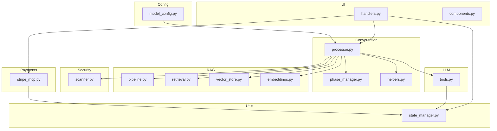
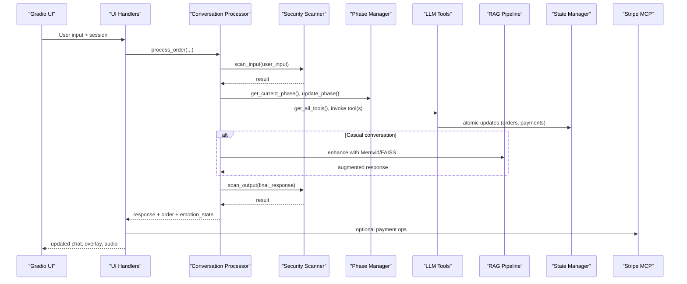
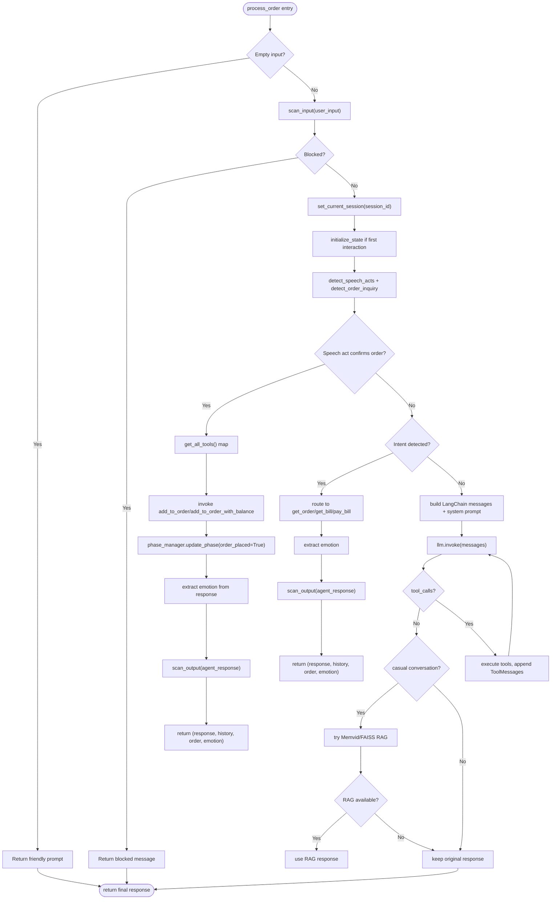
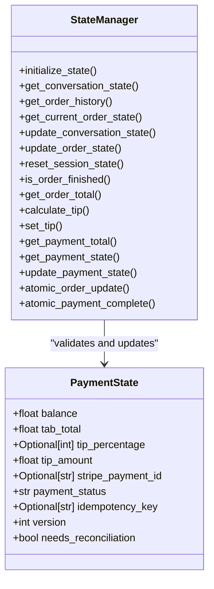
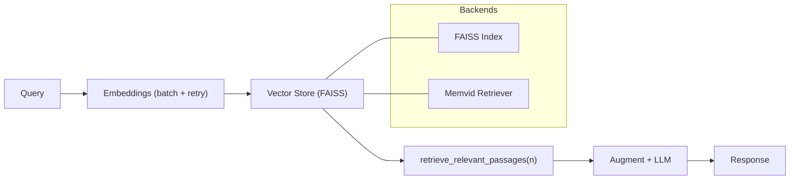
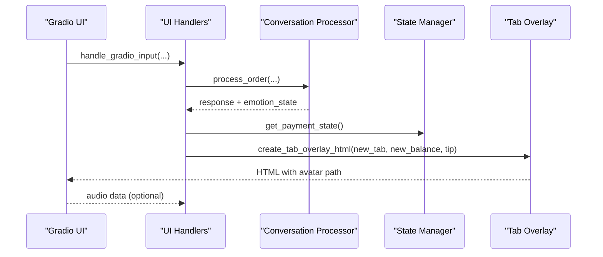
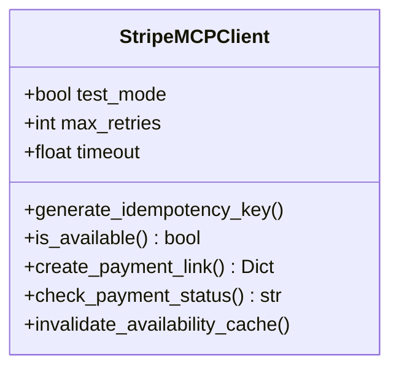
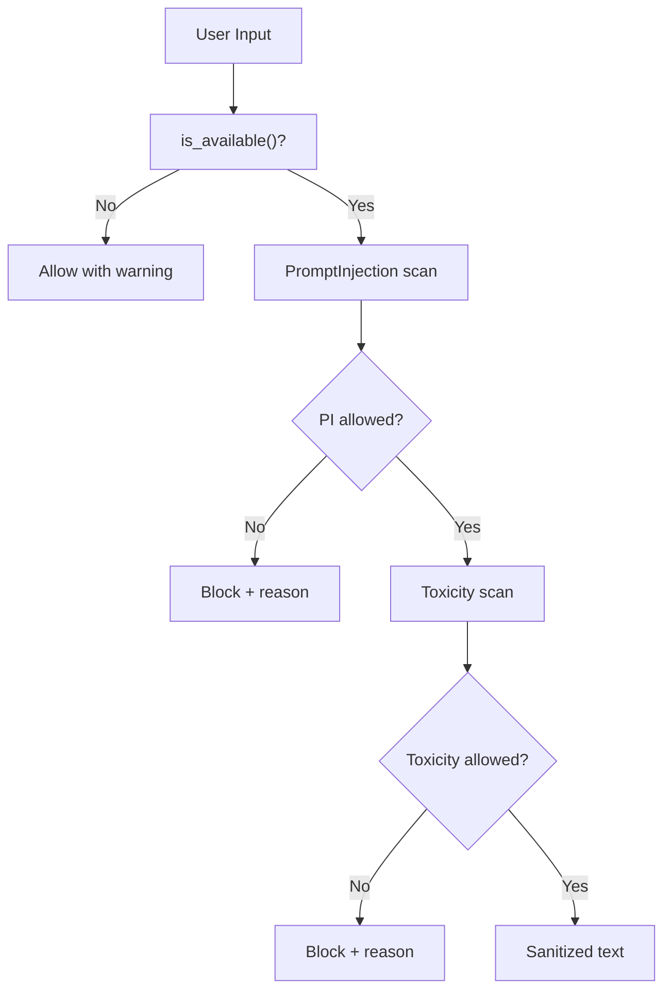
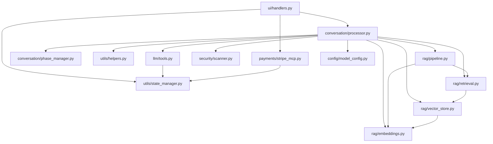

# Advanced Topics

<cite>
**Referenced Files in This Document**
- [README.md](file://README.md)
- [phase_manager.py](file://src/conversation/phase_manager.py)
- [processor.py](file://src/conversation/processor.py)
- [helpers.py](file://src/utils/helpers.py)
- [state_manager.py](file://src/utils/state_manager.py)
- [tools.py](file://src/llm/tools.py)
- [pipeline.py](file://src/rag/pipeline.py)
- [retrieval.py](file://src/rag/retrieval.py)
- [vector_store.py](file://src/rag/vector_store.py)
- [embeddings.py](file://src/rag/embeddings.py)
- [model_config.py](file://src/config/model_config.py)
- [scanner.py](file://src/security/scanner.py)
- [handlers.py](file://src/ui/handlers.py)
- [components.py](file://src/ui/components.py)
- [stripe_mcp.py](file://src/payments/stripe_mcp.py)
</cite>

## Table of Contents
1. [Introduction](#introduction)
2. [Project Structure](#project-structure)
3. [Core Components](#core-components)
4. [Architecture Overview](#architecture-overview)
5. [Detailed Component Analysis](#detailed-component-analysis)
6. [Dependency Analysis](#dependency-analysis)
7. [Performance Considerations](#performance-considerations)
8. [Troubleshooting Guide](#troubleshooting-guide)
9. [Conclusion](#conclusion)
10. [Appendices](#appendices)

## Introduction
This document provides advanced guidance for extending and optimizing MayaMCP. It focuses on:
- Developing custom tools that integrate with the conversation system, including parameter validation, error handling, and state management
- Extending the RAG backend to support new document sources, custom similarity algorithms, and retrieval performance tuning
- Customizing UI components (avatars, overlays, and interactive elements)
- Optimizing LLM inference, audio processing, and database/query performance
- Advanced configuration, security hardening, and scalability considerations
- Examples for adding new conversation phases, integrating additional payment providers, and implementing custom security scanners
- Troubleshooting complex integrations and maintaining reliability under load

## Project Structure
MayaMCP is organized into modular packages:
- config: Environment-driven configuration (model, logging, API keys)
- conversation: Phase management and end-to-end processing pipeline
- llm: Tools, prompts, and client integration
- rag: Retrieval-Augmented Generation pipeline and vector store
- security: Input/output scanning with configurable thresholds
- ui: Gradio handlers, tab overlay, and avatar components
- utils: State management, helpers, and shared utilities
- voice: Text-to-speech integration
- payments: Stripe MCP client and fallback behavior

**Diagram sources**
- [phase_manager.py](file://src/conversation/phase_manager.py#L1-L92)
- [processor.py](file://src/conversation/processor.py#L1-L456)
- [helpers.py](file://src/utils/helpers.py#L1-L265)
- [tools.py](file://src/llm/tools.py#L1-L1066)
- [pipeline.py](file://src/rag/pipeline.py#L1-L105)
- [retrieval.py](file://src/rag/retrieval.py#L1-L40)
- [vector_store.py](file://src/rag/vector_store.py#L1-L107)
- [embeddings.py](file://src/rag/embeddings.py#L1-L217)
- [scanner.py](file://src/security/scanner.py#L1-L137)
- [handlers.py](file://src/ui/handlers.py#L1-L392)
- [components.py](file://src/ui/components.py#L1-L55)
- [stripe_mcp.py](file://src/payments/stripe_mcp.py#L1-L475)
- [state_manager.py](file://src/utils/state_manager.py#L1-L814)
- [model_config.py](file://src/config/model_config.py#L1-L102)

**Section sources**
- [README.md](file://README.md#L34-L41)
- [model_config.py](file://src/config/model_config.py#L31-L59)

## Core Components
- Conversation processing orchestrates LLM calls, tool execution, RAG augmentation, security scanning, and state updates
- Phase management controls conversation flow and determines when to use RAG
- State management provides thread-safe, versioned state for payments and orders
- RAG pipeline supports both FAISS and Memvid backends with graceful fallbacks
- Security scanner applies configurable input/output filters
- UI handlers bridge Gradio events to conversation processing and manage avatar overlays
- Payments integrate with Stripe MCP and provide fallback behavior

**Section sources**
- [processor.py](file://src/conversation/processor.py#L83-L456)
- [phase_manager.py](file://src/conversation/phase_manager.py#L10-L92)
- [state_manager.py](file://src/utils/state_manager.py#L394-L814)
- [pipeline.py](file://src/rag/pipeline.py#L60-L105)
- [scanner.py](file://src/security/scanner.py#L32-L137)
- [handlers.py](file://src/ui/handlers.py#L23-L184)
- [stripe_mcp.py](file://src/payments/stripe_mcp.py#L66-L475)

## Architecture Overview
The system integrates UI, conversation processing, LLM tooling, RAG, and payment flows. The processor coordinates:
- Security scanning (input/output)
- Phase transitions and casual conversation gating
- LLM invocation with tool calls
- RAG enhancement for casual conversation
- State updates and UI overlay generation

**Diagram sources**
- [handlers.py](file://src/ui/handlers.py#L23-L184)
- [processor.py](file://src/conversation/processor.py#L103-L443)
- [phase_manager.py](file://src/conversation/phase_manager.py#L42-L67)
- [tools.py](file://src/llm/tools.py#L168-L219)
- [pipeline.py](file://src/rag/pipeline.py#L60-L105)
- [scanner.py](file://src/security/scanner.py#L32-L137)
- [state_manager.py](file://src/utils/state_manager.py#L685-L757)
- [stripe_mcp.py](file://src/payments/stripe_mcp.py#L183-L441)

## Detailed Component Analysis

### Conversation Processing and Tool Integration
Key aspects:
- Parameter validation and error handling for tool calls
- Session-scoped tool context and cleanup
- RAG gating based on conversation phase and casualness
- Security scanning before and after LLM/tool execution
- State updates and emotion parsing for avatar control

**Diagram sources**
- [processor.py](file://src/conversation/processor.py#L83-L456)
- [helpers.py](file://src/utils/helpers.py#L9-L265)
- [phase_manager.py](file://src/conversation/phase_manager.py#L69-L83)

**Section sources**
- [processor.py](file://src/conversation/processor.py#L83-L456)
- [tools.py](file://src/llm/tools.py#L168-L219)
- [helpers.py](file://src/utils/helpers.py#L9-L265)
- [phase_manager.py](file://src/conversation/phase_manager.py#L42-L83)

### State Management and Payment Safety
Advanced capabilities:
- Thread-safe session locks with expiration cleanup
- Atomic order and payment updates with optimistic locking
- Strict validation of payment state transitions and fields
- Versioned state to prevent concurrent modification conflicts

**Diagram sources**
- [state_manager.py](file://src/utils/state_manager.py#L17-L814)

**Section sources**
- [state_manager.py](file://src/utils/state_manager.py#L394-L814)

### RAG Backend Extension and Retrieval Optimization
Extensibility points:
- Vector store abstraction supports FAISS and can be extended to other backends
- Embedding generation supports batching and retry with exponential backoff
- Retrieval pipeline composes index search and augmentation
- Pipeline supports both Memvid and FAISS backends with graceful degradation

**Diagram sources**
- [embeddings.py](file://src/rag/embeddings.py#L148-L217)
- [vector_store.py](file://src/rag/vector_store.py#L25-L107)
- [retrieval.py](file://src/rag/retrieval.py#L9-L40)
- [pipeline.py](file://src/rag/pipeline.py#L60-L105)

**Section sources**
- [embeddings.py](file://src/rag/embeddings.py#L148-L217)
- [vector_store.py](file://src/rag/vector_store.py#L25-L107)
- [retrieval.py](file://src/rag/retrieval.py#L9-L40)
- [pipeline.py](file://src/rag/pipeline.py#L60-L105)

### UI Component Customization
Customization options:
- Avatar resolution based on emotion state with fallbacks
- Tab overlay with animated transitions and tip notifications
- Event handlers for input, tip toggles, and clearing state

**Diagram sources**
- [handlers.py](file://src/ui/handlers.py#L23-L184)
- [components.py](file://src/ui/components.py#L11-L55)

**Section sources**
- [handlers.py](file://src/ui/handlers.py#L23-L184)
- [components.py](file://src/ui/components.py#L11-L55)

### Payment Provider Integration
Stripe MCP client provides:
- Idempotent payment link creation with exponential backoff
- Availability probing and caching
- Payment status polling with timeouts
- Fallback to mock payments when unavailable

**Diagram sources**
- [stripe_mcp.py](file://src/payments/stripe_mcp.py#L66-L475)

**Section sources**
- [stripe_mcp.py](file://src/payments/stripe_mcp.py#L66-L475)
- [tools.py](file://src/llm/tools.py#L358-L472)

### Security Scanning and Hardening
Scanners:
- Input scanning for prompt injection and toxicity
- Output scanning for toxicity with fallback messages
- Fail-open behavior to preserve availability

**Diagram sources**
- [scanner.py](file://src/security/scanner.py#L32-L137)

**Section sources**
- [scanner.py](file://src/security/scanner.py#L32-L137)

## Dependency Analysis
High-level dependencies:
- UI handlers depend on processor, state manager, and optional payment client
- Processor depends on phase manager, helpers, tools, security, and RAG modules
- Tools depend on state manager and payment client
- RAG pipeline depends on embeddings, vector store, and retrieval
- Config influences model and generation parameters

**Diagram sources**
- [handlers.py](file://src/ui/handlers.py#L1-L392)
- [processor.py](file://src/conversation/processor.py#L1-L456)
- [phase_manager.py](file://src/conversation/phase_manager.py#L1-L92)
- [helpers.py](file://src/utils/helpers.py#L1-L265)
- [tools.py](file://src/llm/tools.py#L1-L1066)
- [scanner.py](file://src/security/scanner.py#L1-L137)
- [pipeline.py](file://src/rag/pipeline.py#L1-L105)
- [retrieval.py](file://src/rag/retrieval.py#L1-L40)
- [vector_store.py](file://src/rag/vector_store.py#L1-L107)
- [embeddings.py](file://src/rag/embeddings.py#L1-L217)
- [state_manager.py](file://src/utils/state_manager.py#L1-L814)
- [model_config.py](file://src/config/model_config.py#L1-L102)
- [stripe_mcp.py](file://src/payments/stripe_mcp.py#L1-L475)

**Section sources**
- [processor.py](file://src/conversation/processor.py#L1-L456)
- [tools.py](file://src/llm/tools.py#L1-L1066)
- [state_manager.py](file://src/utils/state_manager.py#L1-L814)

## Performance Considerations
- LLM inference
  - Use generation parameters from configuration to control temperature and token limits
  - Limit conversation history passed to the LLM to reduce context size
  - Prefer streaming responses when available to improve perceived latency
- RAG retrieval
  - Batch embeddings to minimize API calls and leverage retry/backoff
  - Tune n_results for retrieval to balance relevance and latency
  - Cache availability of external services to avoid repeated probes
- Audio processing
  - Skip TTS when unavailable or when audio is not required
  - Use appropriate sample rates and encodings to balance quality and bandwidth
- Database/state
  - Use atomic operations and optimistic locking to avoid contention
  - Clean up expired session locks periodically to prevent memory leaks
- Scalability
  - Use distributed state stores for multi-instance deployments
  - Instrument and monitor latency and throughput; adjust container memory and concurrency accordingly

[No sources needed since this section provides general guidance]

## Troubleshooting Guide
Common issues and resolutions:
- Missing or invalid API keys
  - Ensure GEMINI_API_KEY and CARTESIA_API_KEY are configured
  - Verify model configuration and known model list validation
- RAG failures
  - Confirm embeddings are generated and FAISS index is initialized
  - Check fallback behavior when Memvid or FAISS are unavailable
- Tool invocation errors
  - Validate tool parameters and handle malformed argument cases
  - Inspect tool response structures and error codes
- Payment provider unavailability
  - Stripe MCP client falls back to mock payments; confirm availability cache invalidation when connectivity resumes
- UI state inconsistencies
  - Reset session state when clearing chat or encountering errors
  - Ensure avatar paths exist and emotion parsing is resilient

**Section sources**
- [README.md](file://README.md#L125-L182)
- [embeddings.py](file://src/rag/embeddings.py#L148-L217)
- [vector_store.py](file://src/rag/vector_store.py#L25-L107)
- [pipeline.py](file://src/rag/pipeline.py#L60-L105)
- [tools.py](file://src/llm/tools.py#L358-L472)
- [handlers.py](file://src/ui/handlers.py#L186-L215)
- [state_manager.py](file://src/utils/state_manager.py#L245-L282)

## Conclusion
MayaMCP offers a robust, extensible foundation for building conversational agents with integrated payments, RAG, and rich UI experiences. By leveraging modular components, strong state management, and configurable security, developers can safely extend the system with new tools, RAG backends, UI customizations, and payment providers while maintaining performance and reliability.

[No sources needed since this section summarizes without analyzing specific files]

## Appendices

### Extending the Conversation System with New Phases
- Define phase transitions in phase manager logic
- Gate RAG usage based on casual conversation detection
- Update emotion parsing to drive avatar behavior

**Section sources**
- [phase_manager.py](file://src/conversation/phase_manager.py#L71-L83)
- [helpers.py](file://src/utils/helpers.py#L239-L265)

### Integrating Additional Payment Providers
- Implement provider-specific client with idempotency and retry logic
- Mirror Stripe MCP client patterns for availability checks and fallbacks
- Extend tools to route to provider-specific operations

**Section sources**
- [stripe_mcp.py](file://src/payments/stripe_mcp.py#L66-L475)
- [tools.py](file://src/llm/tools.py#L358-L472)

### Implementing Custom Security Scanners
- Add new scanner modules with configurable thresholds
- Integrate scanning before and after LLM/tool execution
- Preserve fail-open behavior for availability

**Section sources**
- [scanner.py](file://src/security/scanner.py#L32-L137)

### Advanced Configuration Options
- Model and generation parameters from environment variables
- Known model validation and warnings
- Logging configuration and observability

**Section sources**
- [model_config.py](file://src/config/model_config.py#L31-L102)
- [README.md](file://README.md#L48-L52)

### Security Hardening Measures
- Input/output scanning with configurable thresholds
- Fail-open policy to avoid breaking the conversation
- Validation of payment state transitions and idempotency

**Section sources**
- [scanner.py](file://src/security/scanner.py#L32-L137)
- [state_manager.py](file://src/utils/state_manager.py#L642-L677)

### Scalability Considerations
- Resource tuning for containerized deployments
- Metrics exposure for memory and CPU usage
- Concurrency and autoscaling configuration

**Section sources**
- [README.md](file://README.md#L343-L419)