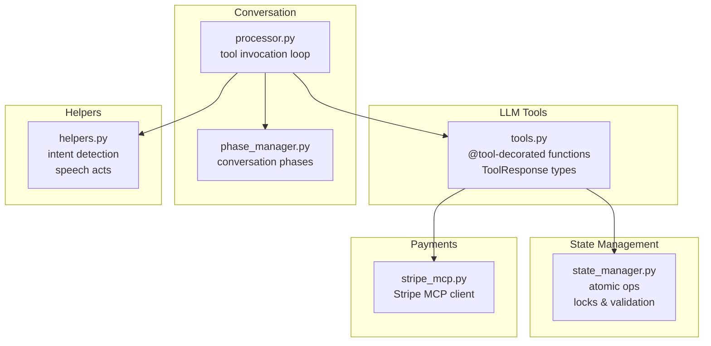
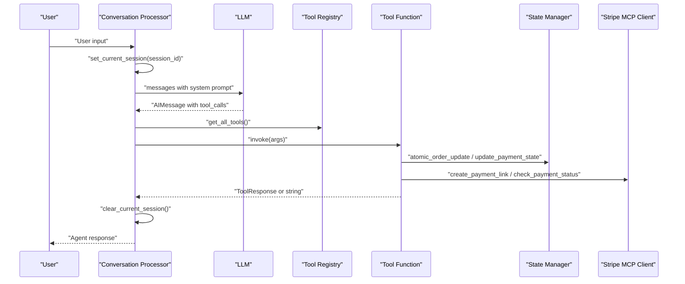
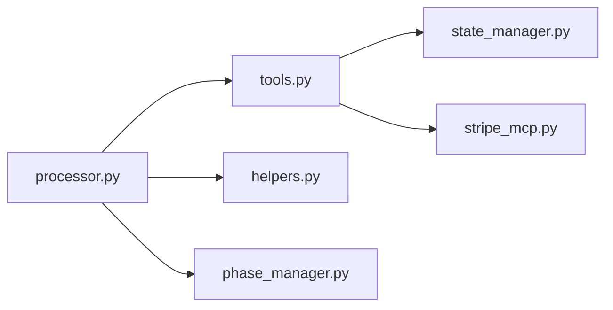

# Custom Tool Development

<cite>
**Referenced Files in This Document**
- [src/llm/tools.py](file://src/llm/tools.py)
- [src/utils/state_manager.py](file://src/utils/state_manager.py)
- [src/conversation/processor.py](file://src/conversation/processor.py)
- [src/conversation/phase_manager.py](file://src/conversation/phase_manager.py)
- [src/utils/helpers.py](file://src/utils/helpers.py)
- [src/payments/stripe_mcp.py](file://src/payments/stripe_mcp.py)
- [tests/test_llm_tools.py](file://tests/test_llm_tools.py)
- [tests/test_session_context.py](file://tests/test_session_context.py)
- [tests/test_state_manager.py](file://tests/test_state_manager.py)
</cite>

## Table of Contents
1. [Introduction](#introduction)
2. [Project Structure](#project-structure)
3. [Core Components](#core-components)
4. [Architecture Overview](#architecture-overview)
5. [Detailed Component Analysis](#detailed-component-analysis)
6. [Dependency Analysis](#dependency-analysis)
7. [Performance Considerations](#performance-considerations)
8. [Troubleshooting Guide](#troubleshooting-guide)
9. [Conclusion](#conclusion)
10. [Appendices](#appendices)

## Introduction
This document explains how to develop custom tools for MayaMCP using the built-in tool registration system, parameter validation patterns, error handling strategies, and session/state management. It covers the ToolResponse interface, thread-local session context, atomic state operations, and practical examples for payment-related tools, order management tools, and utility functions. It also provides best practices for naming, documentation, return formatting, extending existing tools, and integrating with the conversation system.

## Project Structure
MayaMCP organizes tool development around a few key modules:
- Tool registry and payment/order utilities live in the LLM tools module.
- State management and atomic operations are centralized in the state manager.
- The conversation processor orchestrates tool invocation and integrates with the LLM.
- Payment integration is handled by a Stripe MCP client abstraction.
- Tests demonstrate expected behavior and validation patterns.

**Diagram sources**
- [src/llm/tools.py](file://src/llm/tools.py#L1-L120)
- [src/utils/state_manager.py](file://src/utils/state_manager.py#L1-L120)
- [src/conversation/processor.py](file://src/conversation/processor.py#L1-L120)
- [src/conversation/phase_manager.py](file://src/conversation/phase_manager.py#L1-L92)
- [src/utils/helpers.py](file://src/utils/helpers.py#L1-L80)
- [src/payments/stripe_mcp.py](file://src/payments/stripe_mcp.py#L1-L80)

**Section sources**
- [src/llm/tools.py](file://src/llm/tools.py#L1-L120)
- [src/utils/state_manager.py](file://src/utils/state_manager.py#L1-L120)
- [src/conversation/processor.py](file://src/conversation/processor.py#L1-L120)
- [src/conversation/phase_manager.py](file://src/conversation/phase_manager.py#L1-L92)
- [src/utils/helpers.py](file://src/utils/helpers.py#L1-L80)
- [src/payments/stripe_mcp.py](file://src/payments/stripe_mcp.py#L1-L80)

## Core Components
- Tool registration: Tools are decorated with a framework decorator and exposed via a registry function.
- ToolResponse interface: Standardized success/error response types for consistent tool outputs.
- Parameter validation: Built-in validation for payment state and tip percentages; tools validate inputs and return structured errors.
- Session context: Thread-local storage enables tools to access the current session without explicit parameters.
- Atomic state operations: Optimistic locking and thread-safe locks protect concurrent modifications.
- Conversation integration: The processor invokes tools, manages session context, and handles tool call results.

**Section sources**
- [src/llm/tools.py](file://src/llm/tools.py#L1-L120)
- [src/utils/state_manager.py](file://src/utils/state_manager.py#L660-L780)
- [src/conversation/processor.py](file://src/conversation/processor.py#L115-L200)

## Architecture Overview
The tool development architecture connects the conversation processor to tool functions, which in turn manage state and payment operations.

**Diagram sources**
- [src/conversation/processor.py](file://src/conversation/processor.py#L115-L200)
- [src/llm/tools.py](file://src/llm/tools.py#L221-L317)
- [src/utils/state_manager.py](file://src/utils/state_manager.py#L685-L757)
- [src/payments/stripe_mcp.py](file://src/payments/stripe_mcp.py#L183-L273)

## Detailed Component Analysis

### Tool Registration and ToolResponse Interface
- Tools are registered using a decorator that exposes them to the LLM and the tool registry.
- ToolResponse is a union of success and error types with standardized fields for status, result/error code, and message.
- PaymentError enumerates canonical error codes with human-readable templates.

Key patterns:
- Use the decorator to register tools.
- Return ToolResponse for payment tools; return plain strings for legacy tools.
- Use helper constructors to build success/error responses consistently.

**Section sources**
- [src/llm/tools.py](file://src/llm/tools.py#L1-L120)
- [src/llm/tools.py](file://src/llm/tools.py#L134-L166)
- [src/llm/tools.py](file://src/llm/tools.py#L52-L87)
- [src/llm/tools.py](file://src/llm/tools.py#L1047-L1066)

### Parameter Validation Patterns
- Payment state validation enforces field types, ranges, and patterns.
- Tip percentage validation restricts accepted values.
- Tools validate inputs early and return structured errors.

Validation examples:
- Payment state fields validated for types, non-negativity, and regex patterns.
- Tip percentage constrained to predefined set.
- Tool-level validation for menu parsing and item presence.

**Section sources**
- [src/utils/state_manager.py](file://src/utils/state_manager.py#L66-L167)
- [src/utils/state_manager.py](file://src/utils/state_manager.py#L30-L31)
- [src/llm/tools.py](file://src/llm/tools.py#L749-L759)

### Error Handling Strategies
- Tools return ToolResponse with error codes mapped to PaymentError.
- Message templates support dynamic formatting with kwargs.
- Processor catches malformed arguments and tool execution errors, returning safe messages.

Common error categories:
- Insufficient funds, concurrent modification, invalid session, item not found, payment timeouts, invalid tip percentage.

**Section sources**
- [src/llm/tools.py](file://src/llm/tools.py#L139-L166)
- [src/llm/tools.py](file://src/llm/tools.py#L52-L87)
- [src/conversation/processor.py](file://src/conversation/processor.py#L380-L400)

### Session Context Management with Thread-Local Storage
- Tools access the current session via thread-local storage.
- The processor sets the session before invoking tools and clears it afterward.
- Legacy tools continue to work without session context.

Lifecycle:
- set_current_session(session_id) sets the thread-local session.
- get_current_session() retrieves it.
- clear_current_session() ensures cleanup.

**Section sources**
- [src/llm/tools.py](file://src/llm/tools.py#L168-L200)
- [src/conversation/processor.py](file://src/conversation/processor.py#L115-L200)
- [tests/test_session_context.py](file://tests/test_session_context.py#L1-L120)

### State Management Integration and Atomic Operations
- Thread-safe session locks protect concurrent updates.
- Optimistic locking uses a version field to detect conflicts.
- Atomic operations encapsulate balance/tab updates and payment completion.

Atomic patterns:
- atomic_order_update: Deduct balance, add to tab, increment version.
- atomic_payment_complete: Reset tab and tip, mark as paid.
- update_payment_state: Validates transitions and fields before applying updates.

**Section sources**
- [src/utils/state_manager.py](file://src/utils/state_manager.py#L194-L282)
- [src/utils/state_manager.py](file://src/utils/state_manager.py#L685-L757)
- [src/utils/state_manager.py](file://src/utils/state_manager.py#L780-L809)
- [src/utils/state_manager.py](file://src/utils/state_manager.py#L642-L677)

### Payment Tool Implementation
- Payment tools integrate with a Stripe MCP client for payment link creation and status polling.
- Tools handle fallback to simulated payments when Stripe is unavailable.
- Payment totals include tip amounts; status transitions are validated.

Key functions:
- create_stripe_payment: Creates payment link with idempotency key and stores identifiers.
- check_payment_status: Polls status with timeouts and triggers atomic completion on success.
- set_tip/get_tip: Manage tip selection and totals.

**Section sources**
- [src/llm/tools.py](file://src/llm/tools.py#L358-L472)
- [src/llm/tools.py](file://src/llm/tools.py#L474-L554)
- [src/llm/tools.py](file://src/llm/tools.py#L557-L648)
- [src/payments/stripe_mcp.py](file://src/payments/stripe_mcp.py#L183-L273)
- [src/payments/stripe_mcp.py](file://src/payments/stripe_mcp.py#L348-L441)

### Order Management Tools
- Tools manage current order, history, and billing lifecycle.
- Legacy string-returning tools remain compatible with the processor.

Examples:
- add_to_order: Adds items to order, with or without session-based balance checks.
- get_order/confirm_order/place_order/clear_order: Manage order state and presentation.
- get_bill/pay_bill/add_tip: Bill calculation and payment flow.

**Section sources**
- [src/llm/tools.py](file://src/llm/tools.py#L761-L841)
- [src/llm/tools.py](file://src/llm/tools.py#L842-L1001)
- [src/llm/tools.py](file://src/llm/tools.py#L1002-L1046)

### Utility Functions and Conversation Integration
- Helpers detect order intents and speech acts to improve tool selection.
- Phase manager coordinates conversation phases and updates state accordingly.
- Processor orchestrates tool invocation, argument validation, and result handling.

**Section sources**
- [src/utils/helpers.py](file://src/utils/helpers.py#L9-L70)
- [src/utils/helpers.py](file://src/utils/helpers.py#L113-L210)
- [src/conversation/phase_manager.py](file://src/conversation/phase_manager.py#L10-L92)
- [src/conversation/processor.py](file://src/conversation/processor.py#L1-L120)

### Step-by-Step Examples

#### Example 1: Create a Payment-Related Tool
Goal: Add a tool to apply a discount coupon to the current tab.

Steps:
1. Define the tool function with parameters (coupon code).
2. Validate the coupon code and compute discount.
3. Use atomic operations to adjust tab and version.
4. Return ToolResponse with success or error.

Implementation references:
- Use atomic_order_update for balance/tab adjustments.
- Use create_tool_success/create_tool_error for responses.
- Access session via get_current_session and store via get_global_store.

**Section sources**
- [src/llm/tools.py](file://src/llm/tools.py#L685-L757)
- [src/llm/tools.py](file://src/llm/tools.py#L134-L166)
- [src/llm/tools.py](file://src/llm/tools.py#L168-L200)

#### Example 2: Create an Order Management Tool
Goal: Add a tool to merge two orders from different sessions.

Steps:
1. Validate both sessions and their order histories.
2. Compute totals and combine items.
3. Use update_order_state to write merged order.
4. Return a formatted summary string.

Implementation references:
- Use update_order_state with appropriate actions.
- Reference legacy tools for string-returning patterns.

**Section sources**
- [src/llm/tools.py](file://src/llm/tools.py#L447-L509)
- [src/llm/tools.py](file://src/llm/tools.py#L842-L1001)

#### Example 3: Create a Utility Tool
Goal: Add a tool to summarize recent activity for the agent.

Steps:
1. Fetch current order and history.
2. Aggregate counts and totals.
3. Return a concise summary string.

Implementation references:
- Use get_current_order_state and get_order_history.
- Follow existing tool patterns for string formatting.

**Section sources**
- [src/llm/tools.py](file://src/llm/tools.py#L414-L425)
- [src/llm/tools.py](file://src/llm/tools.py#L940-L978)

### Extending Existing Tools
- Extend add_to_order to support modifiers and quantities by delegating to add_to_order_with_balance.
- Add new payment tools by following the same ToolResponse pattern and using the Stripe MCP client.
- Maintain backward compatibility by keeping legacy string-returning tools alongside new ToolResponse tools.

Integration tips:
- Use get_all_tools to expose new tools to the LLM.
- Ensure session context is set before invoking tools in the processor.

**Section sources**
- [src/llm/tools.py](file://src/llm/tools.py#L761-L841)
- [src/llm/tools.py](file://src/llm/tools.py#L1047-L1066)
- [src/conversation/processor.py](file://src/conversation/processor.py#L115-L200)

### Best Practices
- Naming conventions:
  - Use descriptive verbs (add_, get_, set_, create_, check_, confirm_, place_, clear_, pay_).
  - Keep names concise and consistent with existing tools.
- Parameter documentation:
  - Document required and optional parameters clearly.
  - Use enums or constants for constrained values (e.g., tip percentages).
- Return value formatting:
  - Payment tools: return ToolResponse with status, result/error, message.
  - Legacy tools: return human-readable strings.
- Error handling:
  - Validate early and return structured errors.
  - Use PaymentError codes and templates for consistency.
- Performance:
  - Avoid heavy synchronous operations inside tools; leverage async where possible.
  - Use optimistic locking and minimal state writes.

**Section sources**
- [src/llm/tools.py](file://src/llm/tools.py#L52-L87)
- [src/utils/state_manager.py](file://src/utils/state_manager.py#L66-L167)
- [src/conversation/processor.py](file://src/conversation/processor.py#L362-L405)

## Dependency Analysis
The tool system exhibits clear separation of concerns:
- Tools depend on state manager for atomic operations and on Stripe MCP for payment orchestration.
- Processor depends on tools and helpers for conversation flow.
- Helpers depend on state manager for conversation state.

**Diagram sources**
- [src/conversation/processor.py](file://src/conversation/processor.py#L1-L120)
- [src/llm/tools.py](file://src/llm/tools.py#L1-L120)
- [src/utils/state_manager.py](file://src/utils/state_manager.py#L1-L120)
- [src/payments/stripe_mcp.py](file://src/payments/stripe_mcp.py#L1-L80)
- [src/utils/helpers.py](file://src/utils/helpers.py#L1-L80)
- [src/conversation/phase_manager.py](file://src/conversation/phase_manager.py#L1-L92)

**Section sources**
- [src/conversation/processor.py](file://src/conversation/processor.py#L1-L120)
- [src/llm/tools.py](file://src/llm/tools.py#L1-L120)
- [src/utils/state_manager.py](file://src/utils/state_manager.py#L1-L120)
- [src/payments/stripe_mcp.py](file://src/payments/stripe_mcp.py#L1-L80)
- [src/utils/helpers.py](file://src/utils/helpers.py#L1-L80)
- [src/conversation/phase_manager.py](file://src/conversation/phase_manager.py#L1-L92)

## Performance Considerations
- Atomic operations minimize contention by using thread-safe locks and optimistic locking.
- Avoid blocking I/O in tools; defer to async operations where feasible.
- Use minimal state reads/writes and batch updates when possible.
- Cache frequently accessed data (e.g., menu) to reduce repeated parsing.

[No sources needed since this section provides general guidance]

## Troubleshooting Guide
Common pitfalls and remedies:
- Improper error handling:
  - Always validate inputs and return ToolResponse for payment tools.
  - Use create_tool_error with appropriate PaymentError codes.
- State consistency:
  - Use atomic operations for concurrent safety.
  - Ensure version checks catch concurrent modifications.
- Session context:
  - Set and clear session context around tool invocations.
  - Fallback gracefully when no session is available.
- Tool invocation:
  - Validate tool arguments and handle malformed inputs.
  - Catch exceptions during tool execution and return safe messages.

**Section sources**
- [src/llm/tools.py](file://src/llm/tools.py#L139-L166)
- [src/utils/state_manager.py](file://src/utils/state_manager.py#L685-L757)
- [src/conversation/processor.py](file://src/conversation/processor.py#L380-L400)
- [tests/test_session_context.py](file://tests/test_session_context.py#L118-L210)
- [tests/test_state_manager.py](file://tests/test_state_manager.py#L362-L370)

## Conclusion
MayaMCP’s tool system provides a robust foundation for building payment, order, and utility tools. By leveraging the @tool decorator, ToolResponse interface, thread-local session context, and atomic state operations, developers can create reliable, consistent tools that integrate seamlessly with the conversation processor and payment infrastructure. Following the best practices and patterns outlined here ensures correctness, performance, and maintainability.

[No sources needed since this section summarizes without analyzing specific files]

## Appendices

### Appendix A: ToolResponse Interface Details
- Success: status equals "ok" with a result dictionary.
- Error: status equals "error" with error code and message.

**Section sources**
- [src/llm/tools.py](file://src/llm/tools.py#L36-L49)
- [src/llm/tools.py](file://src/llm/tools.py#L134-L166)

### Appendix B: PaymentError Codes
- INSUFFICIENT_FUNDS, STRIPE_UNAVAILABLE, PAYMENT_FAILED, CONCURRENT_MODIFICATION, NETWORK_ERROR, RATE_LIMITED, INVALID_SESSION, ITEM_NOT_FOUND, PAYMENT_TIMEOUT, INVALID_TIP_PERCENTAGE.

**Section sources**
- [src/llm/tools.py](file://src/llm/tools.py#L52-L87)

### Appendix C: Testing Patterns
- Use get_all_tools to verify tool exposure.
- Mock get_current_session and get_global_store for payment tools.
- Validate ToolResponse structure and error codes.

**Section sources**
- [tests/test_llm_tools.py](file://tests/test_llm_tools.py#L652-L677)
- [tests/test_session_context.py](file://tests/test_session_context.py#L1-L120)
- [tests/test_state_manager.py](file://tests/test_state_manager.py#L1-L120)