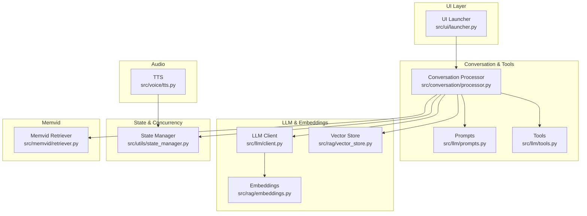
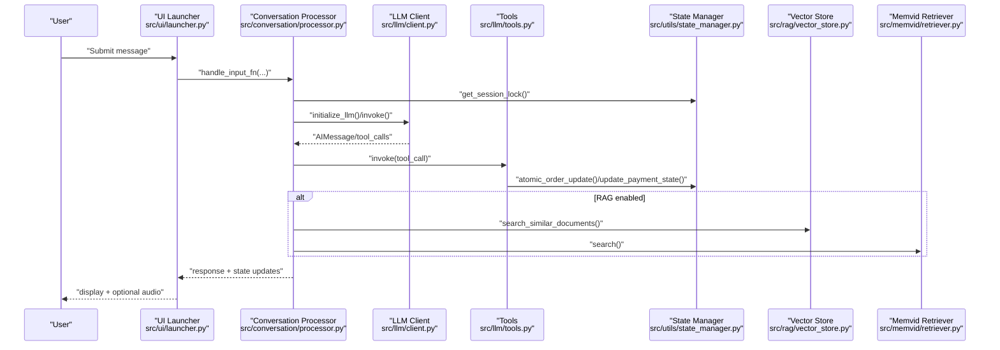
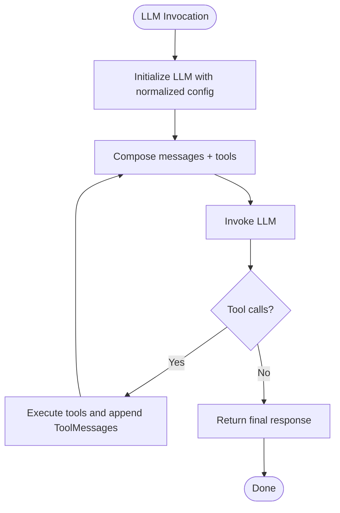
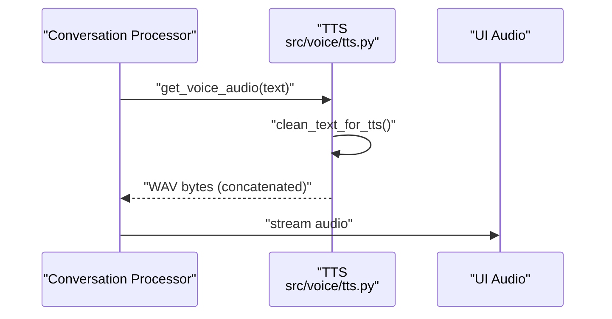
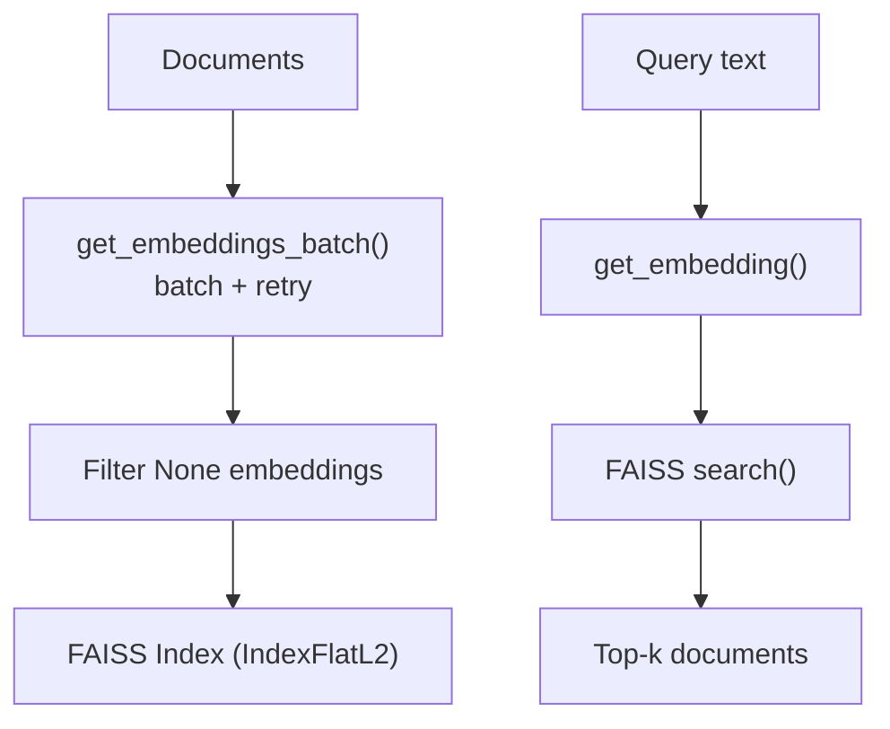
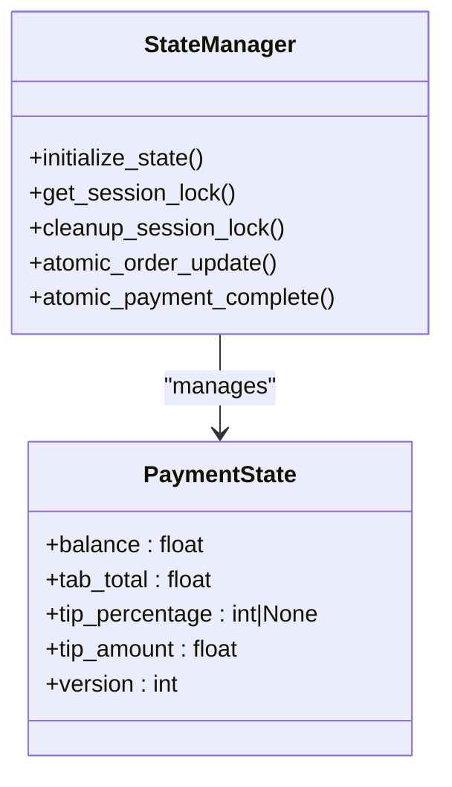
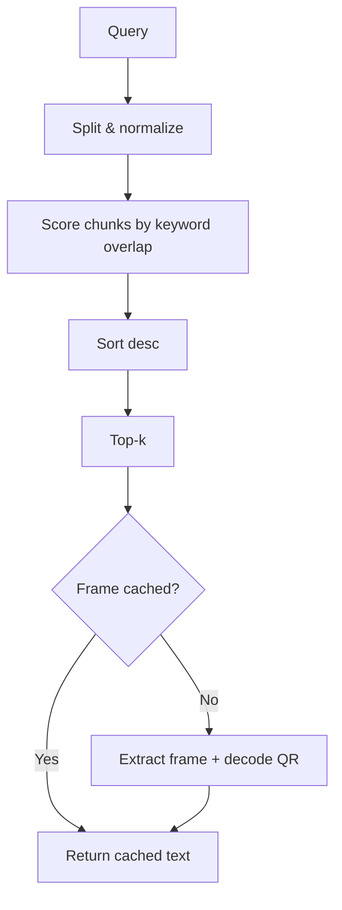
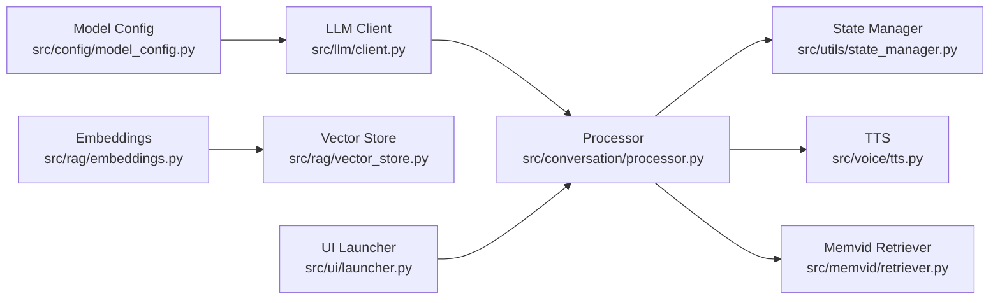

# Performance Optimization

<cite>
**Referenced Files in This Document**
- [src/config/model_config.py](file://src/config/model_config.py)
- [src/llm/client.py](file://src/llm/client.py)
- [src/voice/tts.py](file://src/voice/tts.py)
- [src/rag/vector_store.py](file://src/rag/vector_store.py)
- [src/rag/embeddings.py](file://src/rag/embeddings.py)
- [src/conversation/processor.py](file://src/conversation/processor.py)
- [src/utils/state_manager.py](file://src/utils/state_manager.py)
- [src/ui/launcher.py](file://src/ui/launcher.py)
- [src/memvid/retriever.py](file://src/memvid/retriever.py)
- [src/llm/prompts.py](file://src/llm/prompts.py)
- [src/llm/tools.py](file://src/llm/tools.py)
</cite>

## Table of Contents
1. [Introduction](#introduction)
2. [Project Structure](#project-structure)
3. [Core Components](#core-components)
4. [Architecture Overview](#architecture-overview)
5. [Detailed Component Analysis](#detailed-component-analysis)
6. [Dependency Analysis](#dependency-analysis)
7. [Performance Considerations](#performance-considerations)
8. [Troubleshooting Guide](#troubleshooting-guide)
9. [Conclusion](#conclusion)
10. [Appendices](#appendices)

## Introduction
This document provides a comprehensive guide to performance optimization for MayaMCP across LLM inference, audio processing, vector store operations, state management, concurrency, memory management, profiling, and scalability. It synthesizes the repository’s implementation patterns and highlights practical strategies to reduce latency, increase throughput, and maintain responsiveness under load.

## Project Structure
MayaMCP organizes performance-critical logic across modular components:
- LLM inference and tool orchestration
- Audio synthesis and streaming
- Vector store and embeddings
- State management and concurrency
- UI integration and event handling

**Diagram sources**
- [src/ui/launcher.py](file://src/ui/launcher.py#L49-L354)
- [src/conversation/processor.py](file://src/conversation/processor.py#L1-L456)
- [src/llm/prompts.py](file://src/llm/prompts.py#L1-L87)
- [src/llm/tools.py](file://src/llm/tools.py#L1-L800)
- [src/llm/client.py](file://src/llm/client.py#L1-L211)
- [src/rag/embeddings.py](file://src/rag/embeddings.py#L1-L217)
- [src/rag/vector_store.py](file://src/rag/vector_store.py#L1-L107)
- [src/voice/tts.py](file://src/voice/tts.py#L1-L200)
- [src/utils/state_manager.py](file://src/utils/state_manager.py#L1-L814)
- [src/memvid/retriever.py](file://src/memvid/retriever.py#L1-L189)

**Section sources**
- [src/ui/launcher.py](file://src/ui/launcher.py#L49-L354)
- [src/conversation/processor.py](file://src/conversation/processor.py#L1-L456)
- [src/llm/client.py](file://src/llm/client.py#L1-L211)
- [src/rag/embeddings.py](file://src/rag/embeddings.py#L1-L217)
- [src/rag/vector_store.py](file://src/rag/vector_store.py#L1-L107)
- [src/voice/tts.py](file://src/voice/tts.py#L1-L200)
- [src/utils/state_manager.py](file://src/utils/state_manager.py#L1-L814)
- [src/memvid/retriever.py](file://src/memvid/retriever.py#L1-L189)

## Core Components
- LLM inference with model caching, retry/backoff, and generation config normalization
- Batched embedding generation with retry and fallback
- FAISS vector store with pre-filtering and efficient indexing
- Thread-safe state management with session locks and cleanup
- Text-to-speech with retry and text cleaning
- Memvid retriever with frame caching and fast keyword scoring
- UI event handling with minimal state churn

Key performance-relevant APIs:
- LLM: [call_gemini_api](file://src/llm/client.py#L136-L211), [initialize_llm](file://src/llm/client.py#L91-L129)
- Embeddings: [get_embeddings_batch](file://src/rag/embeddings.py#L148-L217), [get_embedding](file://src/rag/embeddings.py#L69-L113)
- Vector store: [initialize_vector_store](file://src/rag/vector_store.py#L25-L69), [search_similar_documents](file://src/rag/vector_store.py#L71-L107)
- State: [get_session_lock](file://src/utils/state_manager.py#L207-L227), [cleanup_session_lock](file://src/utils/state_manager.py#L229-L242), [atomic_order_update](file://src/utils/state_manager.py#L685-L757)
- TTS: [get_voice_audio](file://src/voice/tts.py#L140-L195), [clean_text_for_tts](file://src/voice/tts.py#L16-L111)
- Memvid: [MemvidRetriever.search](file://src/memvid/retriever.py#L168-L179), [MemvidRetriever.search_simple](file://src/memvid/retriever.py#L77-L111)

**Section sources**
- [src/llm/client.py](file://src/llm/client.py#L136-L211)
- [src/rag/embeddings.py](file://src/rag/embeddings.py#L148-L217)
- [src/rag/vector_store.py](file://src/rag/vector_store.py#L25-L107)
- [src/utils/state_manager.py](file://src/utils/state_manager.py#L207-L757)
- [src/voice/tts.py](file://src/voice/tts.py#L140-L195)
- [src/memvid/retriever.py](file://src/memvid/retriever.py#L77-L179)

## Architecture Overview
End-to-end flow for a user message involves UI event handling, conversation processing, optional RAG enhancement, LLM tool calls, state updates, and optional audio synthesis.

**Diagram sources**
- [src/ui/launcher.py](file://src/ui/launcher.py#L155-L169)
- [src/conversation/processor.py](file://src/conversation/processor.py#L275-L443)
- [src/llm/client.py](file://src/llm/client.py#L91-L129)
- [src/llm/tools.py](file://src/llm/tools.py#L221-L317)
- [src/utils/state_manager.py](file://src/utils/state_manager.py#L685-L757)
- [src/rag/vector_store.py](file://src/rag/vector_store.py#L71-L107)
- [src/memvid/retriever.py](file://src/memvid/retriever.py#L168-L179)

## Detailed Component Analysis

### LLM Inference Optimization
- Model caching and configuration normalization
  - Centralized model and generation configs are read from environment-backed functions and reused across invocations. See [get_model_config](file://src/config/model_config.py#L31-L59) and [get_generation_config](file://src/config/model_config.py#L46-L59).
  - LLM initialization constructs a single ChatGoogleGenerativeAI instance with normalized parameters. See [initialize_llm](file://src/llm/client.py#L91-L129).
- Retry/backoff and robust error handling
  - API calls use exponential backoff with tenacity to mitigate transient failures. See [call_gemini_api](file://src/llm/client.py#L136-L211).
  - SDK-specific and generic error classification avoids brittle string matching. See [call_gemini_api](file://src/llm/client.py#L170-L208).
- Request batching and streaming
  - Streaming is not implemented in the LLM client; however, the processor composes messages and invokes the LLM in a single call per turn. See [process_order](file://src/conversation/processor.py#L275-L407).
  - To enable response streaming, integrate streaming mode with the underlying LLM provider and yield tokens progressively in the processor loop.

**Diagram sources**
- [src/llm/client.py](file://src/llm/client.py#L91-L129)
- [src/conversation/processor.py](file://src/conversation/processor.py#L275-L407)

**Section sources**
- [src/config/model_config.py](file://src/config/model_config.py#L31-L59)
- [src/llm/client.py](file://src/llm/client.py#L91-L129)
- [src/llm/client.py](file://src/llm/client.py#L136-L211)
- [src/conversation/processor.py](file://src/conversation/processor.py#L275-L407)

### Audio Processing Performance (TTS)
- Text cleaning and pronunciation optimization
  - Removes problematic punctuation and converts currency to speech-friendly formats. See [clean_text_for_tts](file://src/voice/tts.py#L16-L111).
- Reliable client initialization and retry
  - Cartesia client creation and TTS calls include retryable exceptions and bounded backoff. See [initialize_cartesia_client](file://src/voice/tts.py#L112-L132), [get_voice_audio](file://src/voice/tts.py#L140-L195).
- Streaming audio
  - The current implementation concatenates all audio chunks before returning. To enable streaming, modify the audio generator consumption to feed chunks to the UI/audio component incrementally.

**Diagram sources**
- [src/conversation/processor.py](file://src/conversation/processor.py#L410-L443)
- [src/voice/tts.py](file://src/voice/tts.py#L140-L195)

**Section sources**
- [src/voice/tts.py](file://src/voice/tts.py#L16-L111)
- [src/voice/tts.py](file://src/voice/tts.py#L112-L132)
- [src/voice/tts.py](file://src/voice/tts.py#L140-L195)
- [src/conversation/processor.py](file://src/conversation/processor.py#L410-L443)

### Vector Store and Embeddings Optimization
- Embedding batching and fallback
  - Batch embedding API is used with a fixed batch size; on SDK absence or failure, sequential embedding is used with retry. See [get_embeddings_batch](file://src/rag/embeddings.py#L148-L217).
  - API key configuration is cached to avoid repeated reconfiguration. See [_ensure_genai_configured](file://src/rag/embeddings.py#L42-L66).
- Vector store initialization and search
  - Valid embeddings are filtered and converted to float32 arrays; FAISS index is constructed once per initialization. See [initialize_vector_store](file://src/rag/vector_store.py#L25-L69).
  - Query embeddings are computed and searched efficiently; results are mapped back to documents. See [search_similar_documents](file://src/rag/vector_store.py#L71-L107).

**Diagram sources**
- [src/rag/embeddings.py](file://src/rag/embeddings.py#L148-L217)
- [src/rag/vector_store.py](file://src/rag/vector_store.py#L25-L107)

**Section sources**
- [src/rag/embeddings.py](file://src/rag/embeddings.py#L42-L66)
- [src/rag/embeddings.py](file://src/rag/embeddings.py#L148-L217)
- [src/rag/vector_store.py](file://src/rag/vector_store.py#L25-L107)

### State Management and Concurrency
- Thread-safe session locks
  - Session locks are stored in a persistent dict keyed by session_id to prevent race conditions; cleanup removes stale locks. See [get_session_lock](file://src/utils/state_manager.py#L207-L227), [cleanup_session_lock](file://src/utils/state_manager.py#L229-L242).
- Atomic operations with optimistic locking
  - Payments use versioned state and atomic updates to prevent concurrent modifications. See [atomic_order_update](file://src/utils/state_manager.py#L685-L757), [atomic_payment_complete](file://src/utils/state_manager.py#L780-L800).
- State initialization and migrations
  - Defaults are deep-copied to avoid mutation; migrations add missing fields. See [initialize_state](file://src/utils/state_manager.py#L394-L407), [get_session_data](file://src/utils/state_manager.py#L344-L381).

**Diagram sources**
- [src/utils/state_manager.py](file://src/utils/state_manager.py#L394-L800)

**Section sources**
- [src/utils/state_manager.py](file://src/utils/state_manager.py#L207-L242)
- [src/utils/state_manager.py](file://src/utils/state_manager.py#L394-L407)
- [src/utils/state_manager.py](file://src/utils/state_manager.py#L685-L800)

### Memvid Retrieval Optimization
- Keyword-based scoring and frame caching
  - Query words are preprocessed; chunks are scored by keyword overlap and normalized by query length. See [search_simple](file://src/memvid/retriever.py#L77-L111).
  - Frame extraction results are cached with a small-capacity cache to reduce repeated CV operations. See [_get_chunk_from_video](file://src/memvid/retriever.py#L113-L144).

**Diagram sources**
- [src/memvid/retriever.py](file://src/memvid/retriever.py#L77-L144)

**Section sources**
- [src/memvid/retriever.py](file://src/memvid/retriever.py#L77-L111)
- [src/memvid/retriever.py](file://src/memvid/retriever.py#L113-L144)

## Dependency Analysis
- Cohesion and coupling
  - LLM client depends on model configuration and error classification; embeddings depend on API keys and retry policies; vector store depends on embeddings; state manager is central to tools and UI.
- External dependencies
  - Google Generative AI SDK, FAISS, Cartesia, OpenCV (via Memvid), and Gradio for UI.

**Diagram sources**
- [src/config/model_config.py](file://src/config/model_config.py#L31-L59)
- [src/llm/client.py](file://src/llm/client.py#L91-L129)
- [src/rag/embeddings.py](file://src/rag/embeddings.py#L148-L217)
- [src/rag/vector_store.py](file://src/rag/vector_store.py#L25-L107)
- [src/conversation/processor.py](file://src/conversation/processor.py#L275-L443)
- [src/utils/state_manager.py](file://src/utils/state_manager.py#L685-L800)
- [src/voice/tts.py](file://src/voice/tts.py#L140-L195)
- [src/memvid/retriever.py](file://src/memvid/retriever.py#L168-L179)
- [src/ui/launcher.py](file://src/ui/launcher.py#L155-L169)

**Section sources**
- [src/config/model_config.py](file://src/config/model_config.py#L31-L59)
- [src/llm/client.py](file://src/llm/client.py#L91-L129)
- [src/rag/embeddings.py](file://src/rag/embeddings.py#L148-L217)
- [src/rag/vector_store.py](file://src/rag/vector_store.py#L25-L107)
- [src/conversation/processor.py](file://src/conversation/processor.py#L275-L443)
- [src/utils/state_manager.py](file://src/utils/state_manager.py#L685-L800)
- [src/voice/tts.py](file://src/voice/tts.py#L140-L195)
- [src/memvid/retriever.py](file://src/memvid/retriever.py#L168-L179)
- [src/ui/launcher.py](file://src/ui/launcher.py#L155-L169)

## Performance Considerations
- LLM inference
  - Keep a singleton LLM instance per process to avoid repeated initialization overhead.
  - Tune generation parameters (temperature, top_p, top_k, max_output_tokens) via environment-backed configuration for latency vs. quality trade-offs. See [get_model_config](file://src/config/model_config.py#L31-L59).
  - Enable streaming at the LLM provider level and propagate incremental tokens to the UI to reduce perceived latency.
- Embeddings and vector store
  - Use batched embeddings for bulk indexing; cache API keys to avoid repeated SDK configuration. See [get_embeddings_batch](file://src/rag/embeddings.py#L148-L217), [_ensure_genai_configured](file://src/rag/embeddings.py#L42-L66).
  - Persist FAISS index to disk for reuse across restarts; rebuild only when documents change.
- State and concurrency
  - Use session locks to serialize access; schedule periodic cleanup of expired locks to prevent memory growth. See [cleanup_expired_session_locks](file://src/utils/state_manager.py#L245-L282).
  - Employ optimistic locking with version increments to minimize contention on payment state.
- Audio synthesis
  - Stream audio chunks to the UI to avoid buffering entire WAV; apply text cleaning once per synthesis request. See [get_voice_audio](file://src/voice/tts.py#L140-L195), [clean_text_for_tts](file://src/voice/tts.py#L16-L111).
- Memvid retrieval
  - Limit frame cache size and precompute query word sets; consider indexing frequently accessed frames for faster lookup.
- UI responsiveness
  - Keep Gradio event handlers lightweight; offload heavy work to background threads or async tasks. See [launch_bartender_interface](file://src/ui/launcher.py#L49-L354).

[No sources needed since this section provides general guidance]

## Troubleshooting Guide
- LLM reliability
  - Inspect retry logs and error classifications for rate limits, timeouts, and auth failures. See [call_gemini_api](file://src/llm/client.py#L170-L208).
- Embedding failures
  - Monitor batch response lengths and fallback behavior; verify API key presence and permissions. See [get_embeddings_batch](file://src/rag/embeddings.py#L198-L216), [_ensure_genai_configured](file://src/rag/embeddings.py#L52-L66).
- State anomalies
  - Validate optimistic locking mismatches and insufficient funds scenarios; confirm session context propagation. See [atomic_order_update](file://src/utils/state_manager.py#L685-L757), [get_current_session](file://src/llm/tools.py#L174-L181).
- TTS issues
  - Confirm Cartesia credentials and retryable exceptions; ensure text cleaning does not strip essential content. See [get_voice_audio](file://src/voice/tts.py#L140-L195), [clean_text_for_tts](file://src/voice/tts.py#L16-L111).
- Memvid retrieval
  - Verify dependencies and video accessibility; inspect frame cache hits and fallback to index previews. See [MemvidRetriever.search](file://src/memvid/retriever.py#L168-L179).

**Section sources**
- [src/llm/client.py](file://src/llm/client.py#L170-L208)
- [src/rag/embeddings.py](file://src/rag/embeddings.py#L198-L216)
- [src/utils/state_manager.py](file://src/utils/state_manager.py#L685-L757)
- [src/llm/tools.py](file://src/llm/tools.py#L174-L181)
- [src/voice/tts.py](file://src/voice/tts.py#L140-L195)
- [src/memvid/retriever.py](file://src/memvid/retriever.py#L168-L179)

## Conclusion
MayaNCP’s performance hinges on efficient LLM initialization and retries, batched embeddings, resilient state management, and targeted streaming for audio. By applying the strategies outlined—model caching, embedding batching, streaming, session lock hygiene, and UI event optimization—the system can scale to multiple concurrent users while maintaining low-latency, responsive interactions.

[No sources needed since this section summarizes without analyzing specific files]

## Appendices

### Configuration and Tuning References
- Environment-backed model and generation parameters: [get_model_config](file://src/config/model_config.py#L31-L59), [get_generation_config](file://src/config/model_config.py#L46-L59)
- Embedding batch size and retry policy: [get_embeddings_batch](file://src/rag/embeddings.py#L25-L26), [get_embeddings_batch](file://src/rag/embeddings.py#L148-L217)
- Session lock expiry and cleanup cadence: [cleanup_expired_session_locks](file://src/utils/state_manager.py#L245-L282)

**Section sources**
- [src/config/model_config.py](file://src/config/model_config.py#L31-L59)
- [src/rag/embeddings.py](file://src/rag/embeddings.py#L25-L26)
- [src/rag/embeddings.py](file://src/rag/embeddings.py#L148-L217)
- [src/utils/state_manager.py](file://src/utils/state_manager.py#L245-L282)