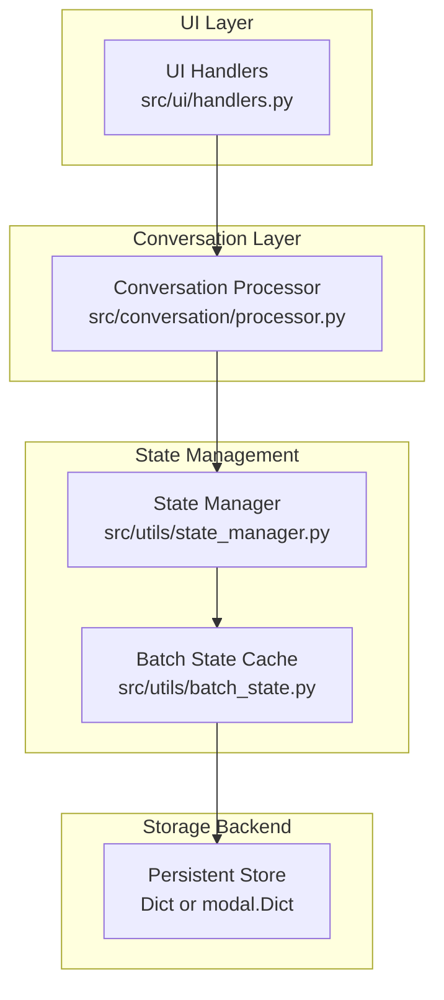
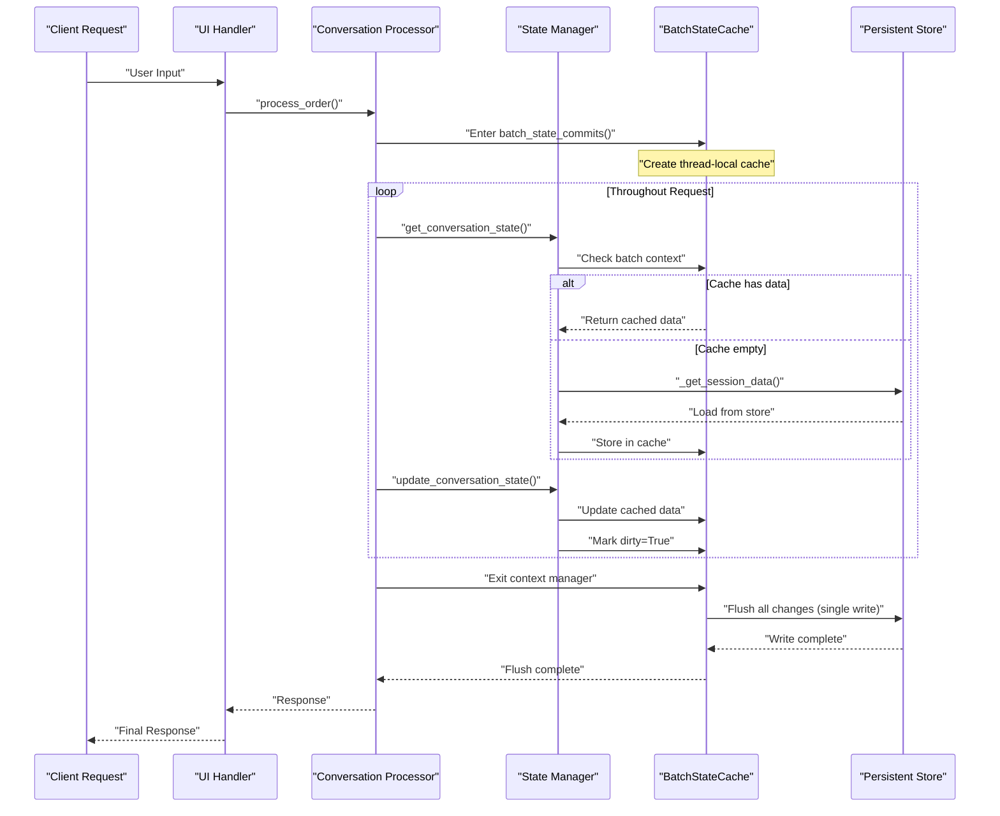
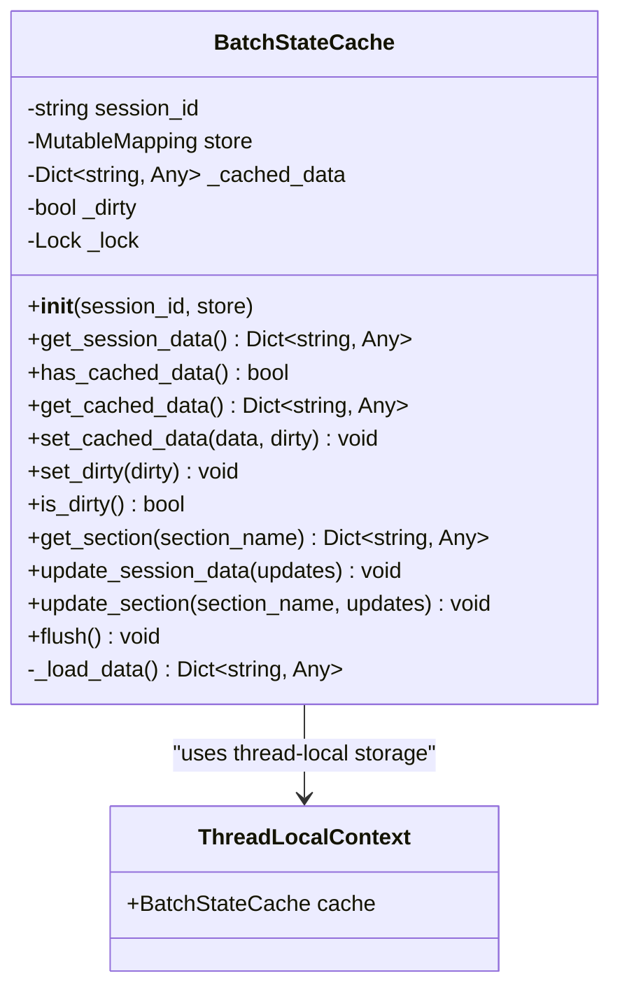
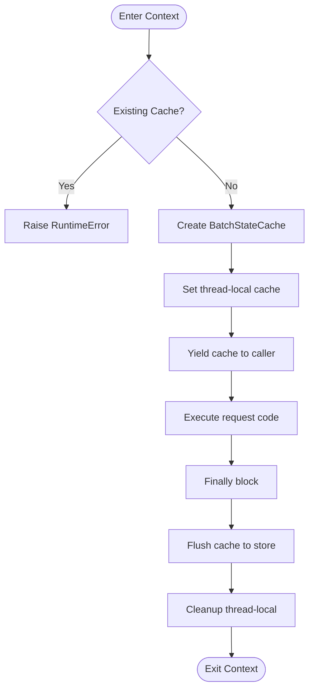
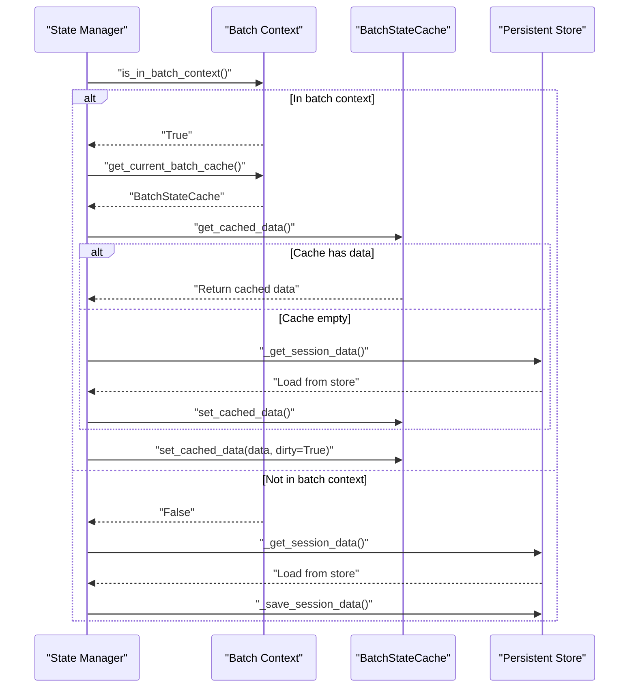
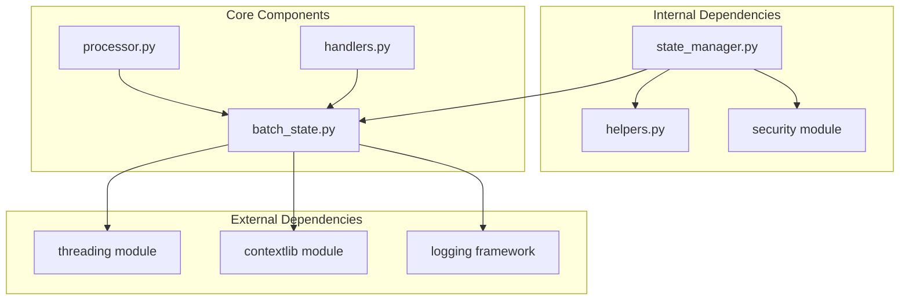

# Request-scoped Batch State Caching

<cite>
**Referenced Files in This Document**
- [batch_state.py](file://src/utils/batch_state.py)
- [state_manager.py](file://src/utils/state_manager.py)
- [processor.py](file://src/conversation/processor.py)
- [handlers.py](file://src/ui/handlers.py)
- [test_batch_state.py](file://tests/test_batch_state.py)
- [test_state_manager.py](file://tests/test_state_manager.py)
</cite>

## Table of Contents
1. [Introduction](#introduction)
2. [Project Structure](#project-structure)
3. [Core Components](#core-components)
4. [Architecture Overview](#architecture-overview)
5. [Detailed Component Analysis](#detailed-component-analysis)
6. [Dependency Analysis](#dependency-analysis)
7. [Performance Considerations](#performance-considerations)
8. [Troubleshooting Guide](#troubleshooting-guide)
9. [Conclusion](#conclusion)

## Introduction
This document explains the Request-scoped Batch State Caching system implemented in the MayaMCP project. The system optimizes performance by batching remote dictionary operations within a single request lifecycle, reducing the number of expensive remote writes and improving overall throughput. The implementation centers around a thread-local cache that accumulates state changes and flushes them to persistent storage in a single operation at the end of the request.

## Project Structure
The batch state caching system spans several modules:
- Core caching logic in `src/utils/batch_state.py`
- State management integration in `src/utils/state_manager.py`
- Request orchestration in `src/conversation/processor.py` and `src/ui/handlers.py`
- Comprehensive tests in `tests/test_batch_state.py` and `tests/test_state_manager.py`

**Diagram sources**
- [handlers.py](file://src/ui/handlers.py#L145-L155)
- [processor.py](file://src/conversation/processor.py#L270-L271)
- [state_manager.py](file://src/utils/state_manager.py#L334-L402)
- [batch_state.py](file://src/utils/batch_state.py#L195-L233)

**Section sources**
- [batch_state.py](file://src/utils/batch_state.py#L1-L254)
- [state_manager.py](file://src/utils/state_manager.py#L1-L885)
- [processor.py](file://src/conversation/processor.py#L1-L634)
- [handlers.py](file://src/ui/handlers.py#L1-L494)

## Core Components
The batch state caching system consists of three primary components:

### BatchStateCache
A thread-safe cache that stores session data in memory and tracks whether changes need to be flushed:
- Thread-local storage ensures isolation across concurrent requests
- Atomic operations guarded by locks prevent race conditions
- Dirty flag tracks whether cached data differs from persistent store
- Methods for loading, updating, and flushing session data

### batch_state_commits Context Manager
A request-scoped context manager that:
- Creates a BatchStateCache instance for the current request
- Exposes the cache to state_manager functions
- Automatically flushes changes at request completion
- Handles cleanup and error propagation

### State Manager Integration
The state manager transparently integrates with the batch cache:
- Detects when a batch context is active
- Uses cached data when available to avoid redundant loads
- Writes to cache instead of immediate store when batching is enabled
- Falls back to direct store writes when outside a batch context

**Section sources**
- [batch_state.py](file://src/utils/batch_state.py#L18-L254)
- [state_manager.py](file://src/utils/state_manager.py#L13-L23)
- [state_manager.py](file://src/utils/state_manager.py#L334-L402)

## Architecture Overview
The batch state caching architecture follows a layered approach with clear separation of concerns:

**Diagram sources**
- [handlers.py](file://src/ui/handlers.py#L145-L155)
- [processor.py](file://src/conversation/processor.py#L270-L271)
- [state_manager.py](file://src/utils/state_manager.py#L334-L402)
- [batch_state.py](file://src/utils/batch_state.py#L195-L233)

## Detailed Component Analysis

### BatchStateCache Class
The BatchStateCache class provides the core caching functionality:

**Diagram sources**
- [batch_state.py](file://src/utils/batch_state.py#L18-L189)
- [batch_state.py](file://src/utils/batch_state.py#L191-L192)

Key features:
- Thread-safe operations using locks
- Lazy loading of session data from persistent store
- Section-based access for structured state management
- Dirty tracking to minimize unnecessary writes

### batch_state_commits Context Manager
The context manager provides request-scoped batching:

**Diagram sources**
- [batch_state.py](file://src/utils/batch_state.py#L195-L233)

Implementation highlights:
- Prevents nested context usage
- Automatic cleanup on exit
- Error propagation with flush guarantee
- Thread-local isolation for concurrent requests

### State Manager Integration
The state manager seamlessly integrates with the batch cache:

**Diagram sources**
- [state_manager.py](file://src/utils/state_manager.py#L334-L402)

**Section sources**
- [batch_state.py](file://src/utils/batch_state.py#L18-L254)
- [state_manager.py](file://src/utils/state_manager.py#L323-L402)

## Dependency Analysis
The batch state caching system has minimal external dependencies and integrates cleanly with the existing architecture:

**Diagram sources**
- [batch_state.py](file://src/utils/batch_state.py#L9-L15)
- [state_manager.py](file://src/utils/state_manager.py#L3-L9)
- [processor.py](file://src/conversation/processor.py#L27-L29)
- [handlers.py](file://src/ui/handlers.py#L18)

Key dependency characteristics:
- **Low coupling**: Only depends on standard library threading and logging
- **High cohesion**: All caching logic encapsulated in single module
- **Non-invasive integration**: State manager detects and adapts to batch context
- **Fallback compatibility**: Works even if batch module is unavailable

**Section sources**
- [batch_state.py](file://src/utils/batch_state.py#L1-L254)
- [state_manager.py](file://src/utils/state_manager.py#L1-L885)

## Performance Considerations
The batch state caching system provides significant performance benefits:

### Performance Impact Analysis
- **Remote Write Reduction**: Reduces remote dictionary operations from potentially hundreds to a single write per request
- **Network Efficiency**: Minimizes network overhead by consolidating writes
- **Latency Improvement**: Eliminates repeated network round-trips for state operations
- **Throughput Enhancement**: Allows multiple state updates within a single request without performance penalty

### Memory Usage Patterns
- **Per-request caching**: Each request maintains its own cache in thread-local storage
- **Copy-on-read**: Returns copies of cached data to prevent accidental mutations
- **Lazy loading**: Data is only loaded from persistent store when first accessed
- **Automatic cleanup**: Thread-local caches are automatically cleaned up on request completion

### Concurrency Safety
- **Thread-local isolation**: Prevents interference between concurrent requests
- **Atomic operations**: All cache operations are protected by locks
- **Race condition prevention**: Proper synchronization prevents data corruption
- **Exception safety**: Cache cleanup occurs even when exceptions are raised

**Section sources**
- [batch_state.py](file://src/utils/batch_state.py#L18-L189)
- [state_manager.py](file://src/utils/state_manager.py#L334-L402)

## Troubleshooting Guide

### Common Issues and Solutions

#### Nested Context Detection
**Problem**: Attempting to use nested `batch_state_commits` contexts
**Solution**: Ensure only one batch context per request lifecycle
**Detection**: Runtime error with nested context message

#### Cache Invalidation
**Problem**: Stale data appearing in state operations
**Solution**: Verify that flush occurs at request completion
**Detection**: Check that cache is properly cleaned up after context exit

#### Thread Safety Issues
**Problem**: Data corruption in multi-threaded environments
**Solution**: Ensure proper use of thread-local storage
**Detection**: Monitor for race conditions in concurrent request handling

### Debugging Strategies
- Enable debug logging to trace cache operations
- Monitor flush operations and error handling
- Verify thread-local isolation in multi-user scenarios
- Test exception scenarios to ensure cleanup occurs

**Section sources**
- [test_batch_state.py](file://tests/test_batch_state.py#L135-L210)
- [batch_state.py](file://src/utils/batch_state.py#L211-L233)

## Conclusion
The Request-scoped Batch State Caching system provides a robust, efficient solution for optimizing state operations in the MayaMCP application. By batching remote dictionary operations within request lifecycles, the system achieves significant performance improvements while maintaining thread safety and providing graceful fallback mechanisms. The implementation demonstrates excellent separation of concerns, minimal dependencies, and comprehensive error handling, making it a valuable addition to the overall architecture.

The system's design enables:
- **Performance**: Single remote write per request instead of multiple writes
- **Reliability**: Automatic cleanup and error propagation
- **Scalability**: Thread-safe operation supporting concurrent requests
- **Maintainability**: Clean integration with existing state management infrastructure

This caching mechanism exemplifies how targeted architectural improvements can deliver substantial performance gains with minimal code changes and maximum compatibility.