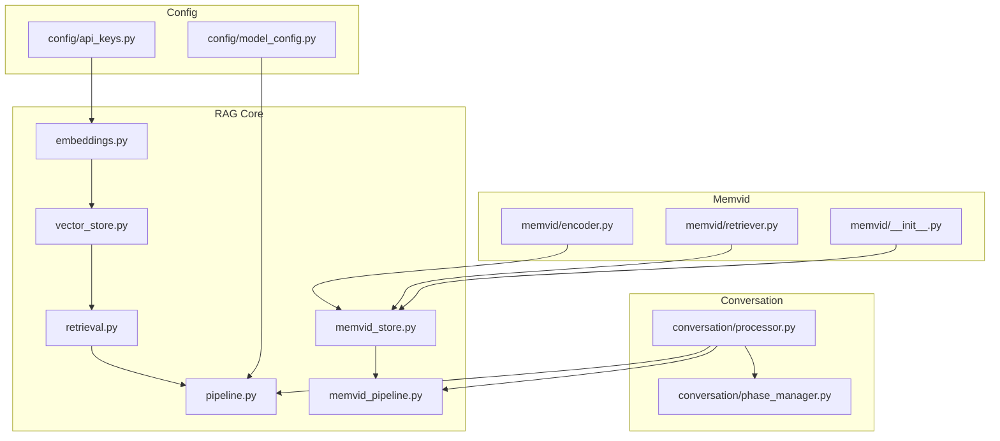
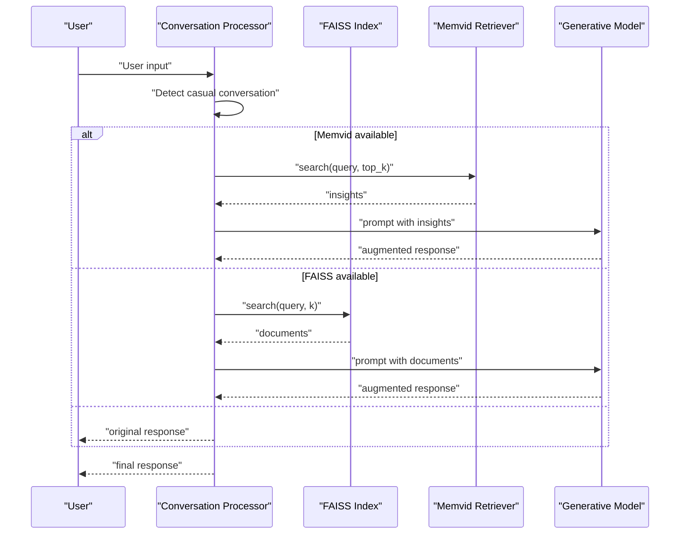
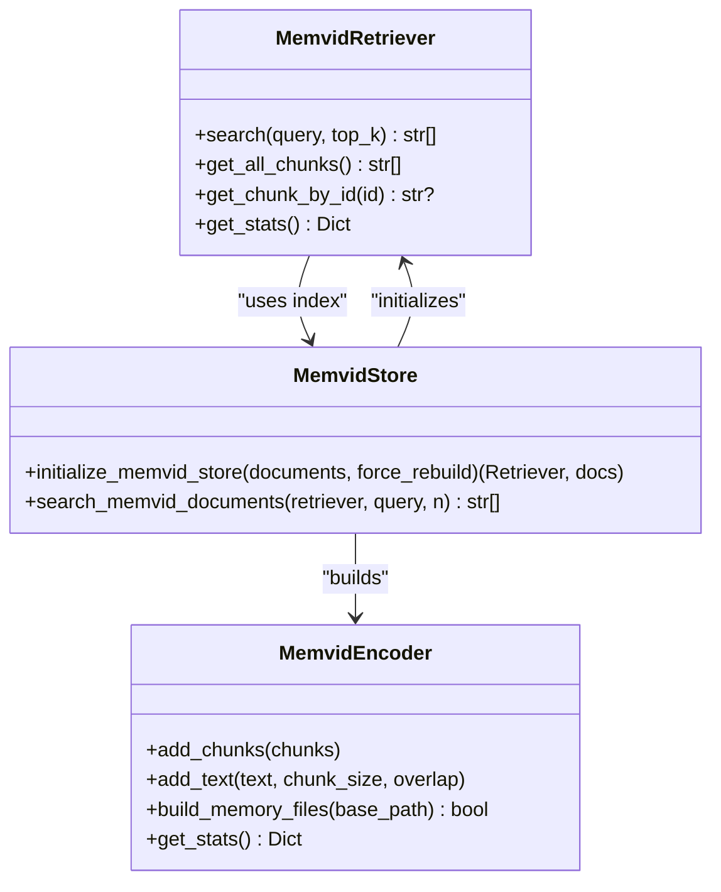
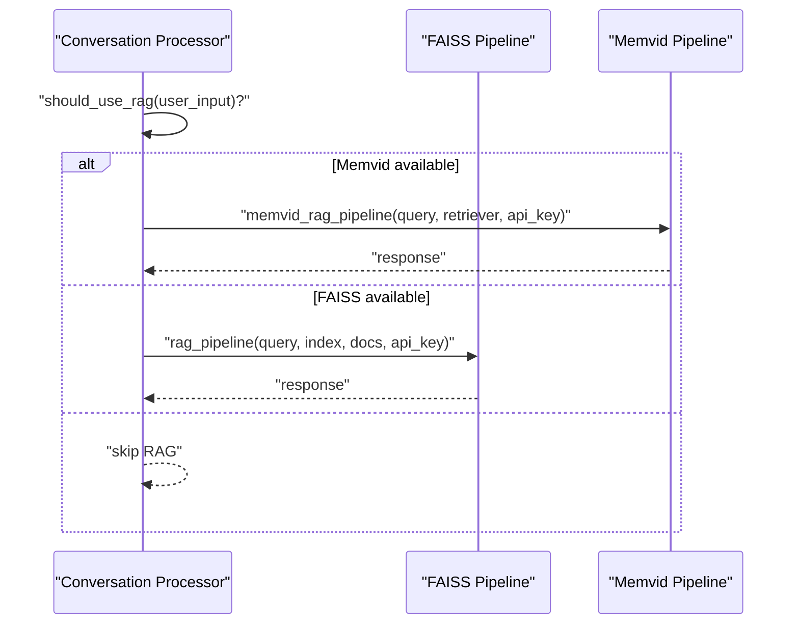
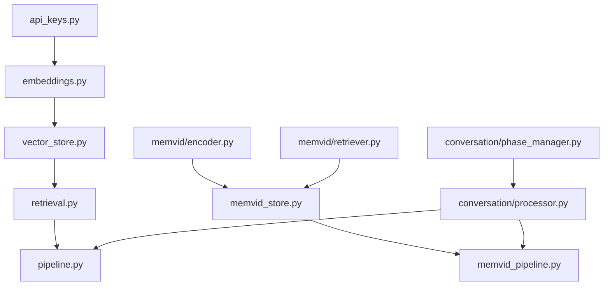

# RAG Backend Extension

<cite>
**Referenced Files in This Document**
- [src/rag/__init__.py](file://src/rag/__init__.py)
- [src/rag/embeddings.py](file://src/rag/embeddings.py)
- [src/rag/vector_store.py](file://src/rag/vector_store.py)
- [src/rag/retrieval.py](file://src/rag/retrieval.py)
- [src/rag/pipeline.py](file://src/rag/pipeline.py)
- [src/rag/memvid_pipeline.py](file://src/rag/memvid_pipeline.py)
- [src/rag/memvid_store.py](file://src/rag/memvid_store.py)
- [src/memvid/__init__.py](file://src/memvid/__init__.py)
- [src/memvid/encoder.py](file://src/memvid/encoder.py)
- [src/memvid/retriever.py](file://src/memvid/retriever.py)
- [src/conversation/processor.py](file://src/conversation/processor.py)
- [src/conversation/phase_manager.py](file://src/conversation/phase_manager.py)
- [src/config/api_keys.py](file://src/config/api_keys.py)
- [src/config/model_config.py](file://src/config/model_config.py)
- [src/utils/state_manager.py](file://src/utils/state_manager.py)
</cite>

## Table of Contents
1. [Introduction](#introduction)
2. [Project Structure](#project-structure)
3. [Core Components](#core-components)
4. [Architecture Overview](#architecture-overview)
5. [Detailed Component Analysis](#detailed-component-analysis)
6. [Dependency Analysis](#dependency-analysis)
7. [Performance Considerations](#performance-considerations)
8. [Troubleshooting Guide](#troubleshooting-guide)
9. [Conclusion](#conclusion)
10. [Appendices](#appendices)

## Introduction
This document explains how to extend MayaMCP’s Retrieval-Augmented Generation (RAG) system with a dual-backend architecture supporting:
- FAISS vector store for text-based retrieval
- Memvid video memory for video-based retrieval

It covers how to integrate embedding models, configure vector stores, implement custom similarity algorithms and retrieval strategies, add new document sources, implement custom preprocessing pipelines, optimize retrieval performance, combine multiple backends, manage context enhancement, and troubleshoot common issues.

## Project Structure
The RAG subsystem is organized under src/rag with supporting modules in src/memvid and integration points in src/conversation. Key areas:
- Embedding generation and batching
- FAISS vector store initialization and search
- Retrieval orchestration
- Memvid encoder and retriever for video memory
- Dual pipelines for text and video memory augmentation
- Conversation integration and phase-aware RAG usage

**Diagram sources**
- [src/rag/embeddings.py](file://src/rag/embeddings.py#L1-L217)
- [src/rag/vector_store.py](file://src/rag/vector_store.py#L1-L107)
- [src/rag/retrieval.py](file://src/rag/retrieval.py#L1-L40)
- [src/rag/pipeline.py](file://src/rag/pipeline.py#L1-L105)
- [src/rag/memvid_pipeline.py](file://src/rag/memvid_pipeline.py#L1-L108)
- [src/rag/memvid_store.py](file://src/rag/memvid_store.py#L1-L159)
- [src/memvid/__init__.py](file://src/memvid/__init__.py#L1-L10)
- [src/memvid/encoder.py](file://src/memvid/encoder.py#L1-L201)
- [src/memvid/retriever.py](file://src/memvid/retriever.py#L1-L189)
- [src/conversation/processor.py](file://src/conversation/processor.py#L1-L456)
- [src/conversation/phase_manager.py](file://src/conversation/phase_manager.py#L1-L92)
- [src/config/api_keys.py](file://src/config/api_keys.py#L1-L51)
- [src/config/model_config.py](file://src/config/model_config.py#L1-L102)

**Section sources**
- [src/rag/__init__.py](file://src/rag/__init__.py#L1-L21)
- [src/rag/embeddings.py](file://src/rag/embeddings.py#L1-L217)
- [src/rag/vector_store.py](file://src/rag/vector_store.py#L1-L107)
- [src/rag/retrieval.py](file://src/rag/retrieval.py#L1-L40)
- [src/rag/pipeline.py](file://src/rag/pipeline.py#L1-L105)
- [src/rag/memvid_pipeline.py](file://src/rag/memvid_pipeline.py#L1-L108)
- [src/rag/memvid_store.py](file://src/rag/memvid_store.py#L1-L159)
- [src/memvid/__init__.py](file://src/memvid/__init__.py#L1-L10)
- [src/memvid/encoder.py](file://src/memvid/encoder.py#L1-L201)
- [src/memvid/retriever.py](file://src/memvid/retriever.py#L1-L189)
- [src/conversation/processor.py](file://src/conversation/processor.py#L1-L456)
- [src/conversation/phase_manager.py](file://src/conversation/phase_manager.py#L1-L92)
- [src/config/api_keys.py](file://src/config/api_keys.py#L1-L51)
- [src/config/model_config.py](file://src/config/model_config.py#L1-L102)

## Core Components
- Embeddings: Generates embeddings for documents and queries using the Google AI Embeddings API with batching and retry logic.
- Vector Store (FAISS): Initializes an FAISS index from precomputed embeddings and supports similarity search.
- Retrieval: Orchestrates retrieval from FAISS given a query.
- Text RAG Pipeline: Retrieves relevant documents and augments a response using a generative model.
- Memvid Store: Builds and manages video memory from text chunks and provides a fallback when video creation is unavailable.
- Memvid Retriever: Performs keyword-based search over video memory with frame caching and decoding.
- Memvid RAG Pipeline: Retrieves relevant insights from video memory and augments a response.
- Conversation Integration: Conditionally enhances casual conversation responses with either Memvid or FAISS RAG depending on availability and configuration.

**Section sources**
- [src/rag/embeddings.py](file://src/rag/embeddings.py#L1-L217)
- [src/rag/vector_store.py](file://src/rag/vector_store.py#L1-L107)
- [src/rag/retrieval.py](file://src/rag/retrieval.py#L1-L40)
- [src/rag/pipeline.py](file://src/rag/pipeline.py#L1-L105)
- [src/rag/memvid_store.py](file://src/rag/memvid_store.py#L1-L159)
- [src/rag/memvid_pipeline.py](file://src/rag/memvid_pipeline.py#L1-L108)
- [src/memvid/encoder.py](file://src/memvid/encoder.py#L1-L201)
- [src/memvid/retriever.py](file://src/memvid/retriever.py#L1-L189)
- [src/conversation/processor.py](file://src/conversation/processor.py#L1-L456)

## Architecture Overview
The dual-backend RAG architecture supports two retrieval paths:
- Text-based FAISS path: Embeds documents and queries, builds an index, and retrieves nearest neighbors.
- Video-based Memvid path: Encodes text into QR frames embedded in a video, indexes frames, and retrieves relevant frames for insight.

Both pipelines feed retrieved content into a generative model to produce an augmented response. The conversation processor decides which backend to use based on availability and phase-aware logic.

**Diagram sources**
- [src/conversation/processor.py](file://src/conversation/processor.py#L299-L362)
- [src/rag/pipeline.py](file://src/rag/pipeline.py#L60-L105)
- [src/rag/memvid_pipeline.py](file://src/rag/memvid_pipeline.py#L65-L108)
- [src/rag/vector_store.py](file://src/rag/vector_store.py#L71-L107)
- [src/rag/retrieval.py](file://src/rag/retrieval.py#L9-L40)
- [src/rag/memvid_store.py](file://src/rag/memvid_store.py#L137-L159)

## Detailed Component Analysis

### Embedding Model Integration
- Embedding generation uses the Google AI Embeddings API with retry and exponential backoff.
- Batch embedding is supported with chunking and robust parsing of response formats.
- Task-specific embedding types are forwarded when supported by the SDK.
- API key management centralizes configuration and avoids repeated setup.

Implementation highlights:
- API key caching to minimize repeated configuration overhead.
- Structured retry behavior with non-retryable exceptions surfaced.
- Fallback to sequential embedding when batch API is unavailable.

**Section sources**
- [src/rag/embeddings.py](file://src/rag/embeddings.py#L42-L113)
- [src/rag/embeddings.py](file://src/rag/embeddings.py#L115-L146)
- [src/rag/embeddings.py](file://src/rag/embeddings.py#L148-L217)
- [src/config/api_keys.py](file://src/config/api_keys.py#L45-L51)

### FAISS Vector Store Configuration
- Default personality documents are indexed if none are provided.
- Embeddings are computed in batches and filtered for validity.
- FAISS index is initialized with L2 distance and populated with float32 vectors.
- Similarity search returns top-k documents by embedding proximity.

Key behaviors:
- Validation of embeddings; raises an error if none are produced.
- Robust conversion to numpy arrays and FAISS ingestion.
- Query embedding retrieval and index search with configurable result count.

**Section sources**
- [src/rag/vector_store.py](file://src/rag/vector_store.py#L25-L69)
- [src/rag/vector_store.py](file://src/rag/vector_store.py#L71-L107)

### Retrieval Strategies
- FAISS retrieval wraps vector search with a retrieval function that returns a list of documents.
- Memvid retrieval performs keyword-based scoring over indexed chunks, normalizing scores by query length and optionally decoding frames to retrieve full text.

Optimization notes:
- Keyword overlap scoring with normalization improves ranking stability.
- Frame cache limits reduce repeated video decoding overhead.

**Section sources**
- [src/rag/retrieval.py](file://src/rag/retrieval.py#L9-L40)
- [src/rag/memvid_store.py](file://src/rag/memvid_store.py#L137-L159)
- [src/memvid/retriever.py](file://src/memvid/retriever.py#L77-L111)
- [src/memvid/retriever.py](file://src/memvid/retriever.py#L113-L144)

### Memvid Video Memory Pipeline
- Encoder converts text chunks into QR-encoded frames and writes a video with an index file.
- Retriever loads the index, verifies the video, and performs fast keyword-based search with frame caching.
- Store initializes Memvid components, handles rebuilds, and provides a text-based fallback when video creation fails.

**Diagram sources**
- [src/memvid/encoder.py](file://src/memvid/encoder.py#L18-L201)
- [src/memvid/retriever.py](file://src/memvid/retriever.py#L17-L189)
- [src/rag/memvid_store.py](file://src/rag/memvid_store.py#L28-L159)

**Section sources**
- [src/memvid/encoder.py](file://src/memvid/encoder.py#L1-L201)
- [src/memvid/retriever.py](file://src/memvid/retriever.py#L1-L189)
- [src/rag/memvid_store.py](file://src/rag/memvid_store.py#L1-L159)

### Dual Pipeline Orchestration
- Text RAG pipeline: Retrieves documents via FAISS and generates an augmented response using a generative model.
- Memvid RAG pipeline: Retrieves insights via Memvid and generates an augmented response.
- Conversation processor conditionally invokes either pipeline for casual conversation, with graceful fallbacks and error handling.

**Diagram sources**
- [src/conversation/processor.py](file://src/conversation/processor.py#L299-L362)
- [src/rag/pipeline.py](file://src/rag/pipeline.py#L60-L105)
- [src/rag/memvid_pipeline.py](file://src/rag/memvid_pipeline.py#L65-L108)

**Section sources**
- [src/rag/pipeline.py](file://src/rag/pipeline.py#L1-L105)
- [src/rag/memvid_pipeline.py](file://src/rag/memvid_pipeline.py#L1-L108)
- [src/conversation/processor.py](file://src/conversation/processor.py#L299-L362)

### Adding New Document Sources
- For FAISS: Extend the document list passed to initialization or dynamically append to the index. Ensure embeddings are generated and validated before ingestion.
- For Memvid: Use the encoder to add text chunks or raw chunks, then rebuild memory files. The store handles index creation and fallbacks.

Guidance:
- Validate embeddings before indexing.
- Keep chunk sizes balanced for efficient retrieval and video encoding.
- Monitor index health and rebuild when necessary.

**Section sources**
- [src/rag/vector_store.py](file://src/rag/vector_store.py#L25-L69)
- [src/memvid/encoder.py](file://src/memvid/encoder.py#L36-L48)
- [src/memvid/encoder.py](file://src/memvid/encoder.py#L170-L193)
- [src/rag/memvid_store.py](file://src/rag/memvid_store.py#L28-L76)

### Implementing Custom Preprocessing Pipelines
- Preprocessing can be applied before embedding generation or before chunking for Memvid.
- For FAISS, preprocess text to normalize, filter noise, or split into semantic units prior to embedding.
- For Memvid, adjust chunk size and overlap to balance retrieval granularity and video length.

Recommendations:
- Use consistent preprocessing across documents and queries.
- Preserve metadata for downstream retrieval and attribution.

**Section sources**
- [src/rag/embeddings.py](file://src/rag/embeddings.py#L148-L168)
- [src/memvid/encoder.py](file://src/memvid/encoder.py#L41-L47)

### Implementing Custom Similarity Algorithms
- FAISS similarity is based on L2 distance on dense embeddings. To customize:
  - Use alternative FAISS index types (e.g., IVF, HNSW) and distance metrics.
  - Adjust embedding model or task type to improve semantic alignment.
- Memvid scoring is keyword-based. To enhance:
  - Integrate lexical or semantic similarity between query and chunk previews.
  - Cache and reuse frame decodings to reduce latency.

**Section sources**
- [src/rag/vector_store.py](file://src/rag/vector_store.py#L60-L65)
- [src/memvid/retriever.py](file://src/memvid/retriever.py#L77-L111)
- [src/memvid/retriever.py](file://src/memvid/retriever.py#L113-L144)

### Managing Context Enhancement
- The conversation processor decides whether to apply RAG based on casual conversation detection and phase transitions.
- It attempts Memvid first, then falls back to FAISS, and finally uses the original response if both fail.
- Emotion and state markers can be preserved alongside the response.

**Section sources**
- [src/conversation/phase_manager.py](file://src/conversation/phase_manager.py#L69-L82)
- [src/conversation/processor.py](file://src/conversation/processor.py#L299-L362)

## Dependency Analysis
- Embeddings depend on the Google AI SDK and environment API keys.
- FAISS vector store depends on NumPy and FAISS for indexing and search.
- Memvid store depends on OpenCV and JSON for video writing and index serialization.
- Conversation processor integrates both pipelines and coordinates RAG usage based on phase and availability.

**Diagram sources**
- [src/config/api_keys.py](file://src/config/api_keys.py#L1-L51)
- [src/rag/embeddings.py](file://src/rag/embeddings.py#L1-L217)
- [src/rag/vector_store.py](file://src/rag/vector_store.py#L1-L107)
- [src/rag/retrieval.py](file://src/rag/retrieval.py#L1-L40)
- [src/rag/pipeline.py](file://src/rag/pipeline.py#L1-L105)
- [src/rag/memvid_store.py](file://src/rag/memvid_store.py#L1-L159)
- [src/rag/memvid_pipeline.py](file://src/rag/memvid_pipeline.py#L1-L108)
- [src/memvid/encoder.py](file://src/memvid/encoder.py#L1-L201)
- [src/memvid/retriever.py](file://src/memvid/retriever.py#L1-L189)
- [src/conversation/processor.py](file://src/conversation/processor.py#L1-L456)
- [src/conversation/phase_manager.py](file://src/conversation/phase_manager.py#L1-L92)

**Section sources**
- [src/config/api_keys.py](file://src/config/api_keys.py#L1-L51)
- [src/rag/embeddings.py](file://src/rag/embeddings.py#L1-L217)
- [src/rag/vector_store.py](file://src/rag/vector_store.py#L1-L107)
- [src/rag/memvid_store.py](file://src/rag/memvid_store.py#L1-L159)
- [src/conversation/processor.py](file://src/conversation/processor.py#L1-L456)

## Performance Considerations
- Embedding throughput: Use batch embedding with appropriate chunk size and retry/backoff to maximize success rate.
- FAISS indexing: Keep dimensionality consistent and choose index types suited to dataset scale and latency targets.
- Memvid retrieval: Tune chunk size and overlap to balance recall and speed; leverage frame caching for repeated queries.
- Conversation gating: Use phase-aware logic to avoid unnecessary RAG calls during tool-heavy turns.
- API key caching: Minimizes repeated configuration overhead for embedding generation.

[No sources needed since this section provides general guidance]

## Troubleshooting Guide
Common issues and resolutions:
- Poor retrieval quality
  - Verify embeddings are generated and valid; check for API key configuration and network errors.
  - Adjust chunk size and preprocessing for Memvid; refine keyword scoring or switch to semantic similarity.
  - For FAISS, consider index type and distance metric tuning.

- Performance bottlenecks
  - Enable embedding batching and retry; monitor batch sizes and error rates.
  - Limit FAISS search results and tune index parameters.
  - Use frame caching in Memvid retriever; rebuild video memory when necessary.

- Integration challenges with conversation system
  - Ensure RAG components are initialized and available before invoking pipelines.
  - Confirm phase-aware logic allows RAG for casual conversation and skips otherwise.
  - Validate API keys and model configuration for generative model calls.

**Section sources**
- [src/rag/embeddings.py](file://src/rag/embeddings.py#L69-L113)
- [src/rag/vector_store.py](file://src/rag/vector_store.py#L54-L55)
- [src/rag/memvid_store.py](file://src/rag/memvid_store.py#L52-L76)
- [src/memvid/retriever.py](file://src/memvid/retriever.py#L113-L144)
- [src/conversation/processor.py](file://src/conversation/processor.py#L317-L362)
- [src/config/api_keys.py](file://src/config/api_keys.py#L45-L51)
- [src/config/model_config.py](file://src/config/model_config.py#L31-L44)

## Conclusion
MayaMCP’s dual-backend RAG system offers flexible retrieval strategies through FAISS and Memvid, with robust embedding integration and conversation-aware augmentation. Extending the system involves integrating new document sources, customizing preprocessing and similarity, optimizing indexing and search, and carefully managing context enhancement within the conversation flow.

[No sources needed since this section summarizes without analyzing specific files]

## Appendices

### API and Configuration References
- Embedding generation and batching
  - [src/rag/embeddings.py](file://src/rag/embeddings.py#L69-L113)
  - [src/rag/embeddings.py](file://src/rag/embeddings.py#L148-L217)
- FAISS vector store
  - [src/rag/vector_store.py](file://src/rag/vector_store.py#L25-L69)
  - [src/rag/vector_store.py](file://src/rag/vector_store.py#L71-L107)
- Retrieval orchestration
  - [src/rag/retrieval.py](file://src/rag/retrieval.py#L9-L40)
- Text RAG pipeline
  - [src/rag/pipeline.py](file://src/rag/pipeline.py#L60-L105)
- Memvid store and retriever
  - [src/rag/memvid_store.py](file://src/rag/memvid_store.py#L28-L76)
  - [src/rag/memvid_store.py](file://src/rag/memvid_store.py#L137-L159)
  - [src/memvid/retriever.py](file://src/memvid/retriever.py#L77-L111)
  - [src/memvid/retriever.py](file://src/memvid/retriever.py#L113-L144)
- Memvid pipeline
  - [src/rag/memvid_pipeline.py](file://src/rag/memvid_pipeline.py#L65-L108)
- Conversation integration
  - [src/conversation/processor.py](file://src/conversation/processor.py#L299-L362)
  - [src/conversation/phase_manager.py](file://src/conversation/phase_manager.py#L69-L82)
- API keys and model configuration
  - [src/config/api_keys.py](file://src/config/api_keys.py#L45-L51)
  - [src/config/model_config.py](file://src/config/model_config.py#L31-L44)
- State management (session locks and conversation state)
  - [src/utils/state_manager.py](file://src/utils/state_manager.py#L194-L283)
  - [src/utils/state_manager.py](file://src/utils/state_manager.py#L408-L446)