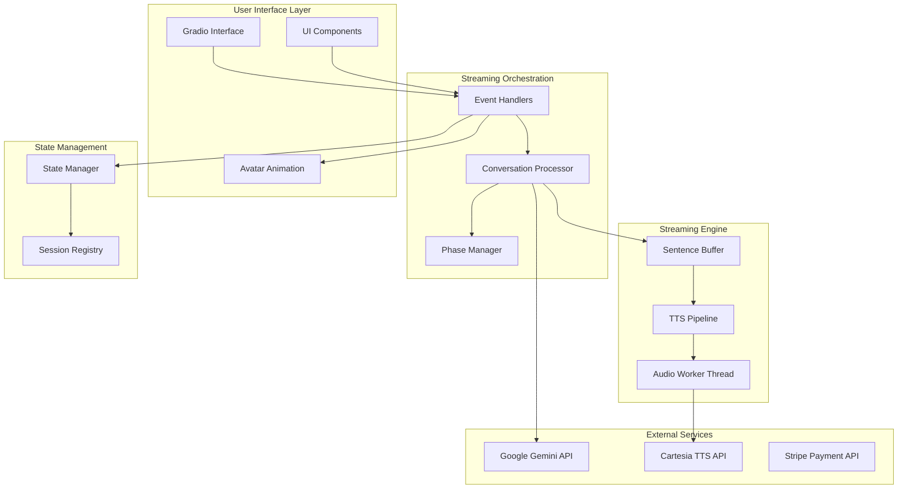
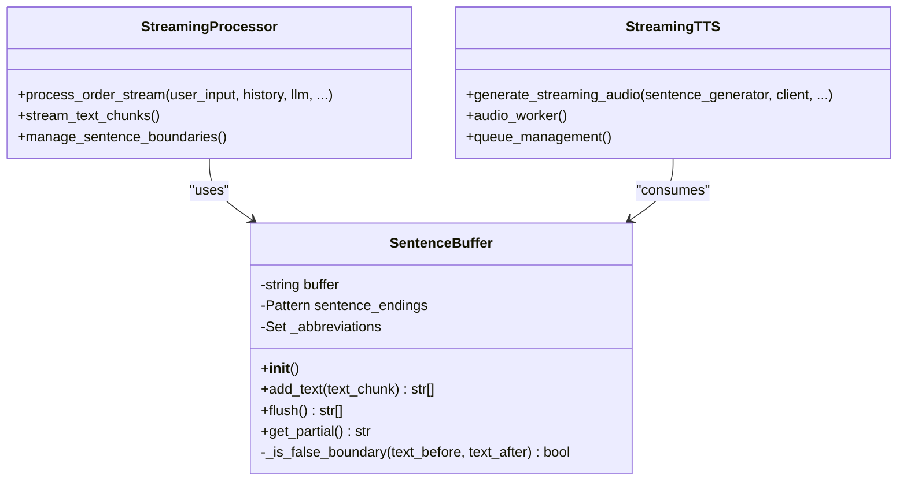
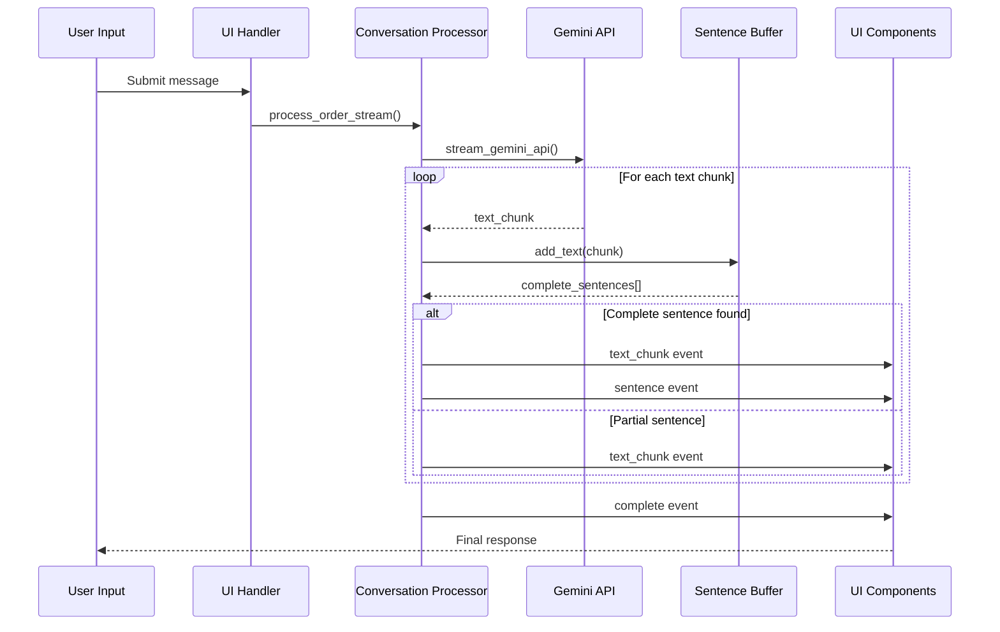
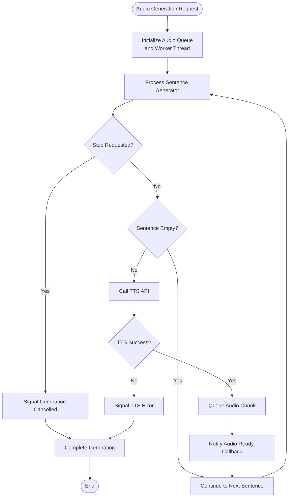
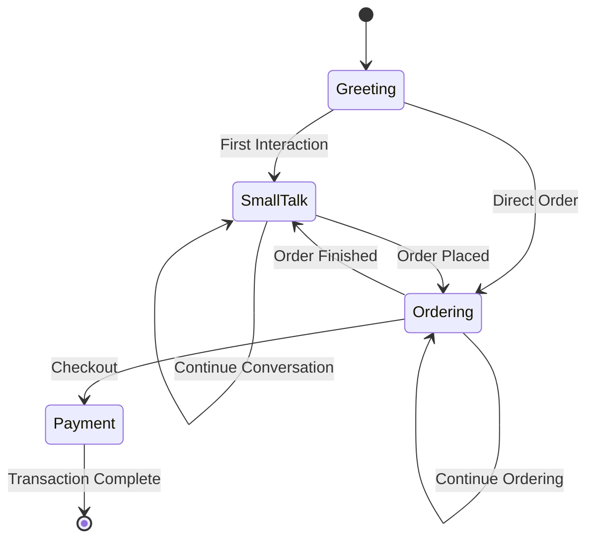
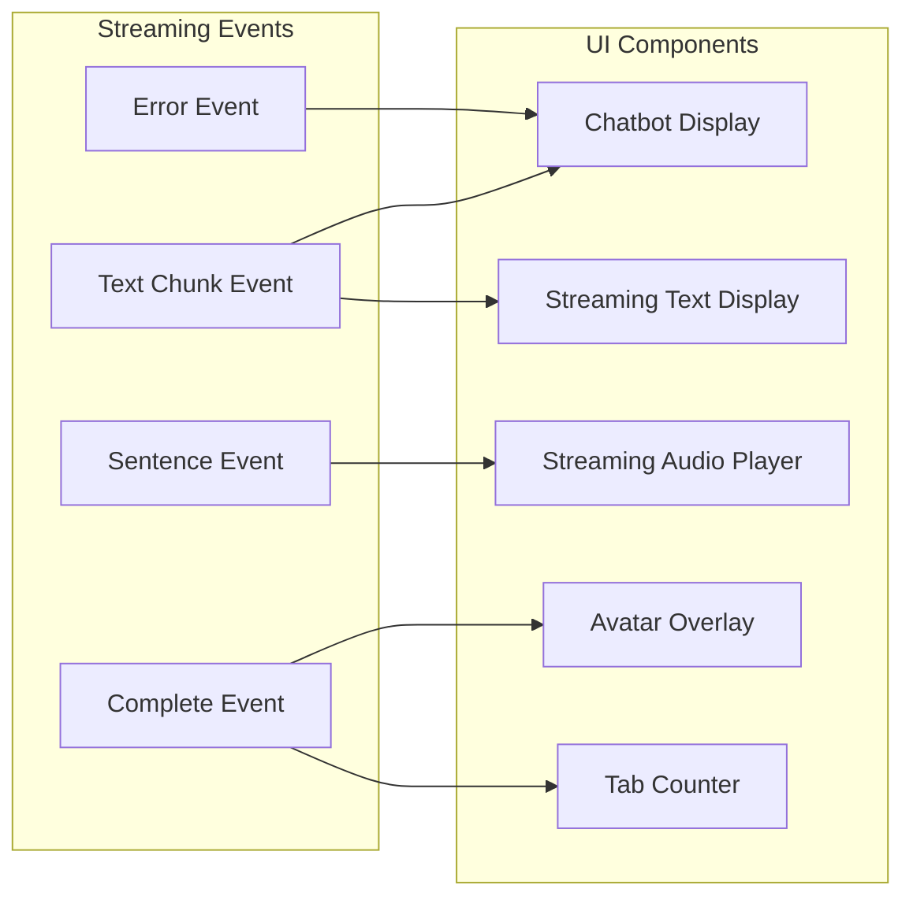

# Real-time Streaming System

<cite>
**Referenced Files in This Document**
- [streaming.py](file://src/utils/streaming.py)
- [streaming_tts.py](file://src/voice/streaming_tts.py)
- [processor.py](file://src/conversation/processor.py)
- [phase_manager.py](file://src/conversation/phase_manager.py)
- [handlers.py](file://src/ui/handlers.py)
- [tts.py](file://src/voice/tts.py)
- [client.py](file://src/llm/client.py)
- [launcher.py](file://src/ui/launcher.py)
- [state_manager.py](file://src/utils/state_manager.py)
- [tools.py](file://src/llm/tools.py)
- [components.py](file://src/ui/components.py)
- [session_registry.py](file://src/llm/session_registry.py)
- [README.md](file://README.md)
</cite>

## Table of Contents
1. [Introduction](#introduction)
2. [System Architecture](#system-architecture)
3. [Core Streaming Components](#core-streaming-components)
4. [Sentence Buffer Management](#sentence-buffer-management)
5. [Audio Streaming Pipeline](#audio-streaming-pipeline)
6. [Real-time Conversation Processing](#real-time-conversation-processing)
7. [UI Integration and User Experience](#ui-integration-and-user-experience)
8. [Performance Optimization Strategies](#performance-optimization-strategies)
9. [Error Handling and Resilience](#error-handling-and-resilience)
10. [Deployment Considerations](#deployment-considerations)
11. [Conclusion](#conclusion)

## Introduction

The Maya MCP real-time streaming system represents a sophisticated conversational AI platform that delivers immediate, responsive interactions through progressive text and audio generation. This system transforms traditional chatbot experiences into natural, flowing conversations by implementing sentence-level streaming, pipelined audio generation, and dynamic UI updates.

The platform combines advanced language model capabilities with real-time audio synthesis to create an immersive bartending assistant experience. Users can engage in natural conversations, receive immediate text feedback, and hear responses as they're generated, mimicking the fluid communication patterns of human interaction.

## System Architecture

The real-time streaming system follows a layered architecture that separates concerns between user interface, conversation processing, streaming orchestration, and external service integration.

**Diagram sources**
- [handlers.py](file://src/ui/handlers.py#L260-L454)
- [processor.py](file://src/conversation/processor.py#L446-L634)
- [streaming.py](file://src/utils/streaming.py#L12-L116)

The architecture implements a producer-consumer pattern where the conversation processor generates text chunks that are immediately available to the UI, while audio generation occurs asynchronously through a dedicated worker thread.

**Section sources**
- [handlers.py](file://src/ui/handlers.py#L260-L454)
- [processor.py](file://src/conversation/processor.py#L446-L634)
- [launcher.py](file://src/ui/launcher.py#L50-L375)

## Core Streaming Components

### Sentence Buffer System

The sentence buffer serves as the cornerstone of the streaming architecture, intelligently managing text segmentation to enable sentence-level TTS generation. This component addresses the fundamental challenge of determining where natural sentence boundaries occur in streaming text.

**Diagram sources**
- [streaming.py](file://src/utils/streaming.py#L12-L116)
- [processor.py](file://src/conversation/processor.py#L569-L601)
- [streaming_tts.py](file://src/voice/streaming_tts.py#L14-L136)

The sentence buffer employs sophisticated heuristics to distinguish genuine sentence endings from abbreviations and special cases. It maintains a buffer of incoming text and applies regex-based detection combined with context-aware validation to ensure accurate sentence boundary identification.

**Section sources**
- [streaming.py](file://src/utils/streaming.py#L12-L116)

### Streaming Text Generation

The streaming text generation process operates through a sophisticated pipeline that captures LLM output in real-time while maintaining conversation context and tool integration capabilities.

**Diagram sources**
- [processor.py](file://src/conversation/processor.py#L566-L619)
- [client.py](file://src/llm/client.py#L231-L348)

**Section sources**
- [processor.py](file://src/conversation/processor.py#L446-L634)
- [client.py](file://src/llm/client.py#L231-L348)

## Sentence Buffer Management

### Advanced Text Segmentation

The sentence buffer implements a multi-layered approach to text segmentation that accounts for various linguistic patterns and edge cases commonly encountered in conversational AI.

The buffer maintains several key characteristics:
- **Context-Aware Detection**: Uses regex patterns to identify potential sentence boundaries while filtering false positives
- **Abbreviation Handling**: Recognizes common abbreviations (Mr., Mrs., Dr., Prof.) that should not trigger sentence termination
- **Partial Content Preservation**: Maintains incomplete sentences in the buffer until proper boundaries are detected
- **Memory Efficiency**: Processes text incrementally without storing unnecessary intermediate content

### Boundary Detection Algorithm

The sentence boundary detection algorithm operates through a series of validation steps:

1. **Initial Pattern Matching**: Applies regex to identify potential sentence endings
2. **Context Analysis**: Examines surrounding text to determine if detected boundaries are genuine
3. **Abbreviation Filtering**: Validates against known abbreviations and special cases
4. **False Positive Elimination**: Rejects boundaries that would incorrectly split contractions or numeric expressions
5. **Boundary Acceptance**: Confirms legitimate sentence boundaries and extracts complete sentences

**Section sources**
- [streaming.py](file://src/utils/streaming.py#L31-L100)

## Audio Streaming Pipeline

### Asynchronous Audio Generation

The audio streaming pipeline transforms text responses into audio output through a sophisticated asynchronous architecture that enables progressive audio playback.

**Diagram sources**
- [streaming_tts.py](file://src/voice/streaming_tts.py#L41-L99)

### Thread-Safe Audio Processing

The audio pipeline implements robust thread synchronization to ensure reliable operation in concurrent environments:

- **Producer-Consumer Pattern**: Main thread produces audio chunks while worker thread consumes them
- **Thread-Safe Queuing**: Uses queue.Queue for thread-safe data exchange between threads
- **Graceful Shutdown**: Implements Event-based signaling for controlled thread termination
- **Resource Cleanup**: Ensures proper cleanup of audio resources and thread lifecycle management

**Section sources**
- [streaming_tts.py](file://src/voice/streaming_tts.py#L14-L136)

## Real-time Conversation Processing

### Conversation State Management

The conversation processing system maintains sophisticated state management that tracks conversation phases, user interactions, and session context to provide coherent, contextually appropriate responses.

**Diagram sources**
- [phase_manager.py](file://src/conversation/phase_manager.py#L10-L92)

The phase manager coordinates conversation flow through intelligent state transitions based on user input patterns, order completion events, and payment processing states.

### Tool Integration with Streaming

The streaming conversation processor seamlessly integrates with the tool system, enabling real-time execution of payment operations, menu queries, and order management while maintaining streaming responsiveness.

**Section sources**
- [processor.py](file://src/conversation/processor.py#L446-L634)
- [phase_manager.py](file://src/conversation/phase_manager.py#L10-L92)

## UI Integration and User Experience

### Real-time UI Updates

The user interface responds dynamically to streaming events through a sophisticated event-driven architecture that updates multiple UI components simultaneously.

**Diagram sources**
- [handlers.py](file://src/ui/handlers.py#L330-L397)
- [components.py](file://src/ui/components.py#L60-L121)

### Avatar Animation Integration

The system integrates avatar animations with conversation state through emotion detection and dynamic avatar switching based on response content and user interactions.

**Section sources**
- [handlers.py](file://src/ui/handlers.py#L40-L70)
- [components.py](file://src/ui/components.py#L60-L135)

## Performance Optimization Strategies

### Memory Management

The streaming system implements several memory optimization strategies to maintain performance under sustained usage:

- **Incremental Text Processing**: Processes text in chunks without accumulating large intermediate buffers
- **Efficient Queue Operations**: Uses specialized queue implementations for optimal thread communication
- **Resource Pooling**: Reuses LLM and TTS client instances per session to minimize initialization overhead
- **Garbage Collection**: Implements explicit cleanup procedures for streaming resources

### Concurrency Control

The system employs sophisticated concurrency control mechanisms:

- **Thread-Safe State Access**: Uses locks and atomic operations for shared state management
- **Non-blocking Operations**: Minimizes blocking operations in the main UI thread
- **Asynchronous Processing**: Offloads heavy operations to background threads
- **Resource Limits**: Implements safeguards against resource exhaustion

**Section sources**
- [state_manager.py](file://src/utils/state_manager.py#L206-L255)
- [session_registry.py](file://src/llm/session_registry.py#L1-L160)

## Error Handling and Resilience

### Comprehensive Error Recovery

The streaming system implements extensive error handling and recovery mechanisms:

- **API Resilience**: Implements exponential backoff and retry logic for external service calls
- **Graceful Degradation**: Continues operation with text-only responses if audio generation fails
- **State Consistency**: Maintains conversation state integrity across error scenarios
- **User-Friendly Messaging**: Provides meaningful error messages without exposing technical details

### Streaming Fault Tolerance

The system handles various failure scenarios gracefully:

- **Network Interruptions**: Recovers from temporary connectivity issues in streaming APIs
- **Rate Limiting**: Implements appropriate delays and fallback strategies for API quotas
- **Timeout Management**: Handles long-running operations with appropriate timeout policies
- **Resource Exhaustion**: Manages memory and CPU usage to prevent system overload

**Section sources**
- [client.py](file://src/llm/client.py#L174-L348)
- [tts.py](file://src/voice/tts.py#L133-L200)

## Deployment Considerations

### Scalability Architecture

The streaming system is designed for scalable deployment across various environments:

- **Session Isolation**: Each user session maintains independent state and resources
- **Resource Management**: Efficient resource allocation and cleanup for optimal memory usage
- **Load Balancing**: Supports horizontal scaling through stateless session handling
- **Monitoring Integration**: Built-in observability for production deployment monitoring

### Production Hardening

Key production considerations include:

- **API Key Security**: Secure handling and rotation of external service credentials
- **Performance Monitoring**: Comprehensive metrics collection for streaming performance
- **Circuit Breakers**: Protection against cascading failures in external service dependencies
- **Backup Strategies**: Graceful fallback mechanisms for critical system components

**Section sources**
- [README.md](file://README.md#L385-L469)

## Conclusion

The Maya MCP real-time streaming system demonstrates sophisticated engineering principles applied to create a responsive, engaging conversational AI experience. Through careful architectural design, the system achieves remarkable user experience improvements by delivering immediate text feedback and progressive audio generation.

The modular component design enables maintainability and extensibility while the robust error handling ensures reliability in production environments. The system successfully balances performance requirements with user experience goals, providing a foundation for advanced conversational AI applications.

Key achievements include:
- Substantial latency reduction through progressive text and audio delivery
- Seamless integration of multiple streaming technologies
- Comprehensive error handling and graceful degradation
- Scalable architecture supporting concurrent user sessions
- Rich user experience with dynamic avatar animations and real-time feedback

This system serves as an exemplary implementation of modern streaming architectures, demonstrating how thoughtful design can transform traditional chatbot interactions into natural, flowing conversations that mirror human communication patterns.