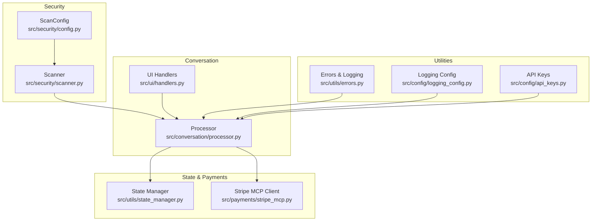
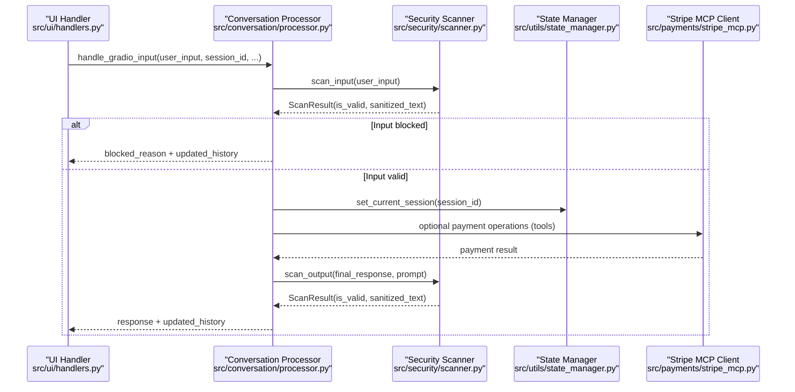
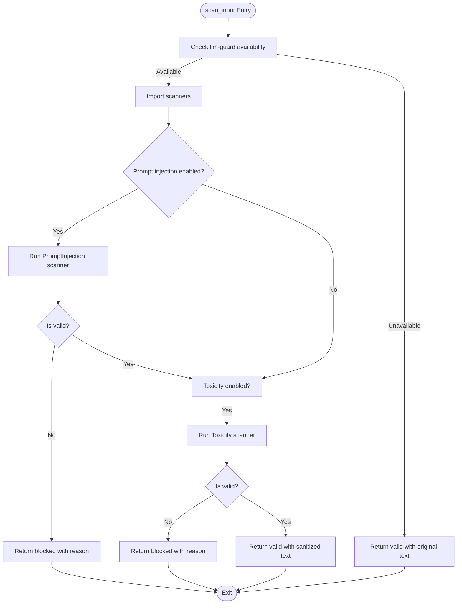
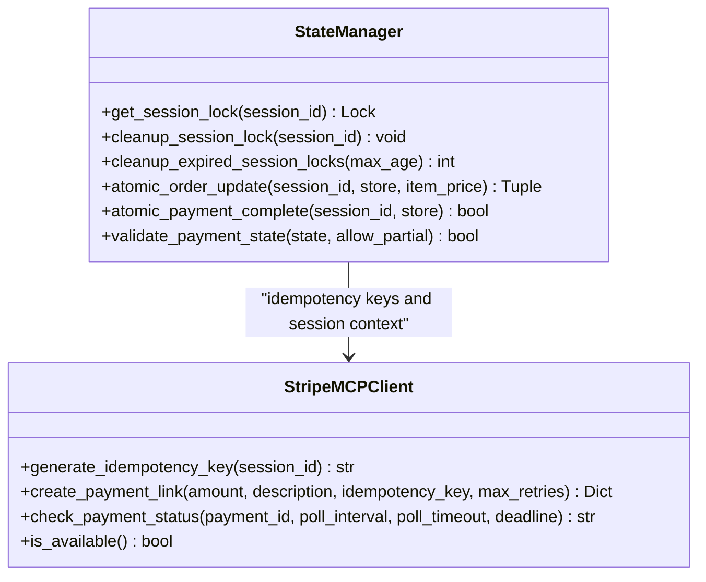
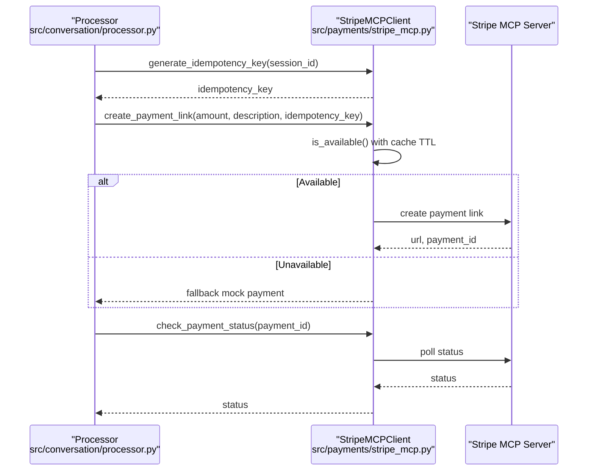
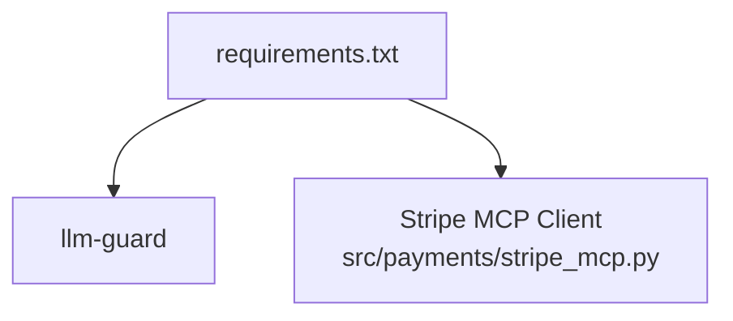

# Security Hardening

<cite>
**Referenced Files in This Document**
- [src/security/__init__.py](file://src/security/__init__.py)
- [src/security/config.py](file://src/security/config.py)
- [src/security/scanner.py](file://src/security/scanner.py)
- [tests/test_security_scanner.py](file://tests/test_security_scanner.py)
- [tests/test_security_config.py](file://tests/test_security_config.py)
- [tests/test_processor_security.py](file://tests/test_processor_security.py)
- [src/conversation/processor.py](file://src/conversation/processor.py)
- [src/ui/handlers.py](file://src/ui/handlers.py)
- [src/utils/state_manager.py](file://src/utils/state_manager.py)
- [src/payments/stripe_mcp.py](file://src/payments/stripe_mcp.py)
- [src/utils/errors.py](file://src/utils/errors.py)
- [src/config/api_keys.py](file://src/config/api_keys.py)
- [src/config/logging_config.py](file://src/config/logging_config.py)
- [requirements.txt](file://requirements.txt)
</cite>

## Table of Contents
1. [Introduction](#introduction)
2. [Project Structure](#project-structure)
3. [Core Components](#core-components)
4. [Architecture Overview](#architecture-overview)
5. [Detailed Component Analysis](#detailed-component-analysis)
6. [Dependency Analysis](#dependency-analysis)
7. [Performance Considerations](#performance-considerations)
8. [Troubleshooting Guide](#troubleshooting-guide)
9. [Conclusion](#conclusion)
10. [Appendices](#appendices)

## Introduction
This document provides comprehensive security hardening guidance for MayaMCP with a focus on input/output scanning, toxicity detection, secure session management, and secure payment processing. It explains how the system detects malicious content, prevents prompt injection, filters harmful outputs, manages sessions securely, and integrates with Stripe for payments. It also covers extending protection mechanisms, configuring security headers, rate limiting, intrusion detection, secure multi-threading, and best practices for long-term security maintenance.

## Project Structure
MayaMCP organizes security-related capabilities across dedicated modules:
- Security scanning: input and output scanning with configurable thresholds
- Conversation processing: integrates scanning into the user interaction loop
- State management: thread-safe session locking and atomic operations
- Payments: Stripe MCP client with idempotency, retries, and fallbacks
- Utilities: error classification and logging helpers
- Configuration: API keys and logging configuration

**Diagram sources**
- [src/security/config.py](file://src/security/config.py#L1-L24)
- [src/security/scanner.py](file://src/security/scanner.py#L1-L137)
- [src/conversation/processor.py](file://src/conversation/processor.py#L1-L456)
- [src/ui/handlers.py](file://src/ui/handlers.py#L1-L392)
- [src/utils/state_manager.py](file://src/utils/state_manager.py#L1-L814)
- [src/payments/stripe_mcp.py](file://src/payments/stripe_mcp.py#L1-L475)
- [src/utils/errors.py](file://src/utils/errors.py#L1-L39)
- [src/config/logging_config.py](file://src/config/logging_config.py#L1-L51)
- [src/config/api_keys.py](file://src/config/api_keys.py#L1-L51)

**Section sources**
- [src/security/__init__.py](file://src/security/__init__.py#L1-L5)
- [src/security/config.py](file://src/security/config.py#L1-L24)
- [src/security/scanner.py](file://src/security/scanner.py#L1-L137)
- [src/conversation/processor.py](file://src/conversation/processor.py#L1-L456)
- [src/ui/handlers.py](file://src/ui/handlers.py#L1-L392)
- [src/utils/state_manager.py](file://src/utils/state_manager.py#L1-L814)
- [src/payments/stripe_mcp.py](file://src/payments/stripe_mcp.py#L1-L475)
- [src/utils/errors.py](file://src/utils/errors.py#L1-L39)
- [src/config/logging_config.py](file://src/config/logging_config.py#L1-L51)
- [src/config/api_keys.py](file://src/config/api_keys.py#L1-L51)
- [requirements.txt](file://requirements.txt#L1-L41)

## Core Components
- Security scanning: Provides ScanConfig for thresholds and flags, and scan_input/scan_output functions that integrate with llm-guard to detect prompt injection and toxicity. It returns ScanResult with sanitized text, validity flag, and scanner scores.
- Conversation processor: Orchestrates user input processing, applies security scans, and enforces output filtering before returning responses.
- State manager: Implements thread-safe session locking, optimistic locking with version checks, and atomic operations for payment state updates.
- Stripe MCP client: Manages payment link creation with idempotency keys, retry logic, availability probing, and fallback to mock payments.
- Utilities: Centralizes error classification and logging helpers to standardize security-related logs.

Key behaviors:
- Input scanning blocks prompt injection and toxicity; output scanning replaces toxic content with safe fallbacks.
- Session context is propagated to tools via thread-local storage to enable session-aware operations.
- Payment operations use atomic updates and idempotency keys to prevent race conditions and duplicate charges.

**Section sources**
- [src/security/config.py](file://src/security/config.py#L1-L24)
- [src/security/scanner.py](file://src/security/scanner.py#L1-L137)
- [src/conversation/processor.py](file://src/conversation/processor.py#L73-L202)
- [src/utils/state_manager.py](file://src/utils/state_manager.py#L190-L282)
- [src/payments/stripe_mcp.py](file://src/payments/stripe_mcp.py#L109-L128)
- [src/utils/errors.py](file://src/utils/errors.py#L1-L39)

## Architecture Overview
The security architecture integrates scanning, session management, and payment processing into the conversation flow. The UI handlers extract session IDs from requests and pass them to the processor, which sets session context for tools. Security scanners guard both input and output, while state manager and Stripe MCP client ensure safe, atomic operations.

**Diagram sources**
- [src/ui/handlers.py](file://src/ui/handlers.py#L23-L184)
- [src/conversation/processor.py](file://src/conversation/processor.py#L73-L443)
- [src/security/scanner.py](file://src/security/scanner.py#L32-L136)
- [src/utils/state_manager.py](file://src/utils/state_manager.py#L170-L187)
- [src/payments/stripe_mcp.py](file://src/payments/stripe_mcp.py#L183-L441)

## Detailed Component Analysis

### Input/Output Scanning System
The scanning system uses llm-guard to detect prompt injection and toxicity. It is designed to fail open: when scanners are unavailable or throw errors, the system continues without blocking. Thresholds are configurable via ScanConfig.

**Diagram sources**
- [src/security/scanner.py](file://src/security/scanner.py#L20-L96)

Key points:
- Prompt injection and toxicity are scanned independently with separate thresholds.
- Scanner scores are recorded in ScanResult for observability.
- Output scanning uses the prompt context to evaluate toxicity and replaces toxic outputs with a safe fallback.

**Section sources**
- [src/security/config.py](file://src/security/config.py#L4-L23)
- [src/security/scanner.py](file://src/security/scanner.py#L32-L136)
- [tests/test_security_scanner.py](file://tests/test_security_scanner.py#L1-L156)
- [tests/test_security_config.py](file://tests/test_security_config.py#L1-L27)

### Secure Session Management
Session management ensures thread safety and prevents race conditions:
- Thread-safe session locks are maintained in a dictionary protected by a mutex.
- Sessions track last access time and support expiration cleanup.
- Atomic operations use optimistic locking with version checks to prevent concurrent modification issues.
- Session context is stored in thread-local storage and cleared in a finally block to guarantee cleanup.

**Diagram sources**
- [src/utils/state_manager.py](file://src/utils/state_manager.py#L190-L282)
- [src/payments/stripe_mcp.py](file://src/payments/stripe_mcp.py#L109-L128)

Operational guidance:
- Use get_session_lock around atomic operations to serialize access.
- Implement periodic cleanup of expired session locks to prevent memory leaks.
- Always clear session context after processing to avoid cross-request leakage.

**Section sources**
- [src/utils/state_manager.py](file://src/utils/state_manager.py#L190-L282)
- [src/conversation/processor.py](file://src/conversation/processor.py#L115-L200)
- [src/llm/tools.py](file://src/llm/tools.py#L174-L218)

### Secure Payment Processing
The Stripe MCP client provides:
- Idempotency keys: {session_id}_{unix_timestamp} to prevent duplicate charges.
- Retry logic: exponential backoff with configurable max retries and overall timeout.
- Availability probing: lightweight probe with caching to avoid unnecessary retries.
- Fallback behavior: on unavailability or exhaustion of retries, falls back to a mock payment.
- Payment status polling: bounded by poll interval, per-poll timeout, and wall-clock deadline.

**Diagram sources**
- [src/payments/stripe_mcp.py](file://src/payments/stripe_mcp.py#L183-L441)

**Section sources**
- [src/payments/stripe_mcp.py](file://src/payments/stripe_mcp.py#L109-L128)
- [src/payments/stripe_mcp.py](file://src/payments/stripe_mcp.py#L130-L181)
- [src/payments/stripe_mcp.py](file://src/payments/stripe_mcp.py#L183-L272)
- [src/payments/stripe_mcp.py](file://src/payments/stripe_mcp.py#L348-L441)

### Extending Protection Mechanisms
To add new scanners or protections:
- Implement a new scanner function similar to scan_input/scan_output, returning a ScanResult.
- Add configuration fields to ScanConfig and update serialization/deserialization.
- Integrate the new scanner in the processor’s security checks.
- Ensure fail-open behavior and logging for robustness.

Validation and testing:
- Use property-based tests to validate threshold behavior and round-trip configuration consistency.
- Mock llm-guard imports to test availability and error handling paths.

**Section sources**
- [src/security/config.py](file://src/security/config.py#L11-L23)
- [tests/test_security_scanner.py](file://tests/test_security_scanner.py#L1-L156)
- [tests/test_security_config.py](file://tests/test_security_config.py#L1-L27)

### Secure Multi-threading and Memory Sanitization
Thread-safety measures:
- Session locks are persisted in a regular dictionary and protected by a mutex to prevent race conditions.
- A background cleanup routine removes expired session locks based on last access time.
- Atomic operations use optimistic locking with version checks to ensure consistency.

Memory sanitization:
- Session context is cleared in a finally block to avoid leaking state across requests.
- Idempotency keys embed timestamps to minimize reuse and reduce risk of replay.

**Section sources**
- [src/utils/state_manager.py](file://src/utils/state_manager.py#L190-L282)
- [src/conversation/processor.py](file://src/conversation/processor.py#L453-L456)
- [src/payments/stripe_mcp.py](file://src/payments/stripe_mcp.py#L109-L128)

### Protection Against Timing Attacks
Recommendations:
- Use constant-time comparisons for secrets and tokens.
- Avoid branching on secret-dependent values in hot paths.
- Apply cryptographic randomness for nonce generation and idempotency keys.
- Ensure all timeouts and deadlines are bounded to prevent timing side channels.

[No sources needed since this section provides general guidance]

## Dependency Analysis
External dependencies relevant to security:
- llm-guard: enables input and output scanning for prompt injection and toxicity.
- Stripe MCP: payment orchestration with idempotency and retries.

**Diagram sources**
- [requirements.txt](file://requirements.txt#L40-L41)
- [src/payments/stripe_mcp.py](file://src/payments/stripe_mcp.py#L1-L14)

**Section sources**
- [requirements.txt](file://requirements.txt#L40-L41)
- [src/payments/stripe_mcp.py](file://src/payments/stripe_mcp.py#L1-L14)

## Performance Considerations
- Security scanning is optional and designed to fail open; disable scanners in constrained environments if needed.
- Use availability caching for Stripe MCP to reduce probe overhead.
- Keep scanner thresholds tuned to balance safety and throughput.
- Monitor payment operation latencies and adjust retry parameters accordingly.

[No sources needed since this section provides general guidance]

## Troubleshooting Guide
Common issues and resolutions:
- llm-guard not installed: scanners are disabled; verify installation and version compatibility.
- Scanner errors: logs capture errors; system continues with fail-open behavior.
- Stripe MCP unavailable: client falls back to mock payment; check connectivity and retry configuration.
- Concurrency errors: ensure atomic operations wrap session locks and that session context is cleared after processing.
- Error classification: use centralized error classification helpers to standardize logs.

**Section sources**
- [src/security/scanner.py](file://src/security/scanner.py#L20-L30)
- [src/utils/errors.py](file://src/utils/errors.py#L11-L38)
- [src/payments/stripe_mcp.py](file://src/payments/stripe_mcp.py#L216-L272)
- [src/conversation/processor.py](file://src/conversation/processor.py#L453-L456)

## Conclusion
MayaMCP’s security hardening combines configurable input/output scanning, thread-safe session management, and resilient payment processing. By leveraging llm-guard, optimistic locking, idempotency keys, and bounded retries, the system maintains safety and reliability. Extensibility is supported through modular scanner design and standardized error handling. Adopt the recommended practices to sustain strong security posture over time.

[No sources needed since this section summarizes without analyzing specific files]

## Appendices

### API Keys and Environment Configuration
- API keys are loaded from environment variables and validated before use.
- Keep API keys secret and rotate regularly; restrict access to deployment environments.

**Section sources**
- [src/config/api_keys.py](file://src/config/api_keys.py#L10-L51)

### Logging Configuration
- Centralized logging setup with configurable levels and formats.
- Use structured logs for security events and ensure sensitive data is redacted.

**Section sources**
- [src/config/logging_config.py](file://src/config/logging_config.py#L7-L51)

### Rate Limiting and Intrusion Detection
- Implement rate limiting at the gateway or service layer to mitigate abuse.
- Use bounded timeouts and retries for external calls to prevent resource exhaustion.
- Deploy IDS/IPS alongside network controls to detect anomalous traffic patterns.

[No sources needed since this section provides general guidance]