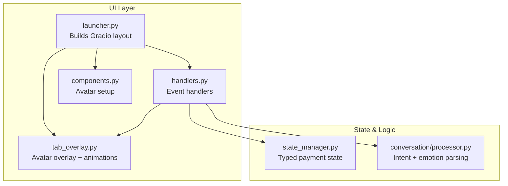
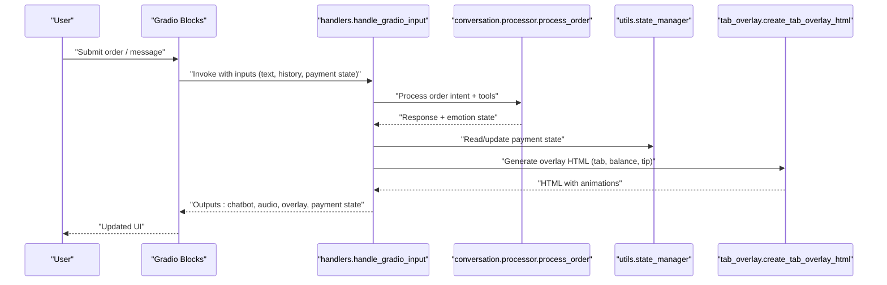
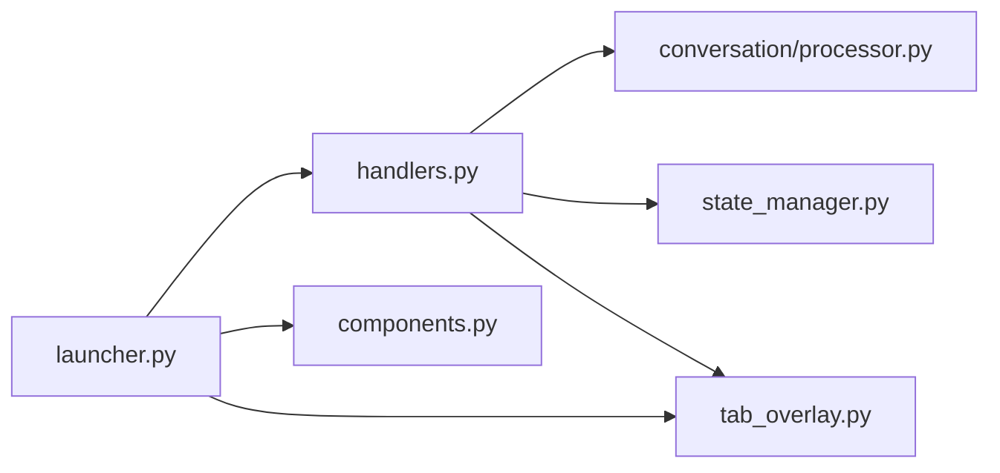

# UI Component Customization

<cite>
**Referenced Files in This Document**
- [README.md](file://README.md)
- [EMOTION_SYSTEM.md](file://docs/EMOTION_SYSTEM.md)
- [ADR_001_AVATAR_VIDEO_FORMAT.md](file://docs/ADR_001_AVATAR_VIDEO_FORMAT.md)
- [src/ui/__init__.py](file://src/ui/__init__.py)
- [src/ui/components.py](file://src/ui/components.py)
- [src/ui/tab_overlay.py](file://src/ui/tab_overlay.py)
- [src/ui/launcher.py](file://src/ui/launcher.py)
- [src/ui/handlers.py](file://src/ui/handlers.py)
- [src/utils/state_manager.py](file://src/utils/state_manager.py)
- [src/conversation/processor.py](file://src/conversation/processor.py)
- [tests/test_ui_components.py](file://tests/test_ui_components.py)
- [tests/test_ui_launcher.py](file://tests/test_ui_launcher.py)
- [tests/test_ui_handlers.py](file://tests/test_ui_handlers.py)
</cite>

## Table of Contents
1. [Introduction](#introduction)
2. [Project Structure](#project-structure)
3. [Core Components](#core-components)
4. [Architecture Overview](#architecture-overview)
5. [Detailed Component Analysis](#detailed-component-analysis)
6. [Dependency Analysis](#dependency-analysis)
7. [Performance Considerations](#performance-considerations)
8. [Troubleshooting Guide](#troubleshooting-guide)
9. [Conclusion](#conclusion)
10. [Appendices](#appendices)

## Introduction
This document explains how to customize MayaMCP’s Gradio-based user interface, focusing on the avatar animation system, tab overlay for payment information, and state-driven UI updates. It covers:
- Gradio component composition and layout
- Avatar emotion states and transition effects
- Tab overlay with animated counters and tip controls
- Event handling for user interactions
- Integration with the state management system
- Accessibility, cross-browser compatibility, and performance optimization
- Practical examples for creating custom UI components and restructurings

## Project Structure
MayaMCP organizes UI logic under the src/ui package with clear separation of concerns:
- Launcher builds the Gradio Blocks layout and wires events
- Handlers orchestrate conversation processing, TTS, and state updates
- Tab overlay generates HTML/CSS/JS for the avatar panel
- State manager provides typed payment state and thread-safe operations
- Processor integrates LLM, tools, and emotion parsing

**Diagram sources**
- [src/ui/launcher.py](file://src/ui/launcher.py#L49-L354)
- [src/ui/handlers.py](file://src/ui/handlers.py#L23-L392)
- [src/ui/tab_overlay.py](file://src/ui/tab_overlay.py#L151-L485)
- [src/ui/components.py](file://src/ui/components.py#L11-L55)
- [src/utils/state_manager.py](file://src/utils/state_manager.py#L48-L800)
- [src/conversation/processor.py](file://src/conversation/processor.py#L73-L456)

**Section sources**
- [README.md](file://README.md#L15-L33)
- [src/ui/__init__.py](file://src/ui/__init__.py#L1-L12)

## Core Components
- Avatar setup: Downloads and saves the bartender avatar image with fallbacks.
- Tab overlay: Renders the avatar panel with animated tab/balance counters, tip buttons, and dynamic tip/total display.
- Launcher: Composes Gradio Blocks, defines state variables, and wires event handlers.
- Handlers: Processes user input, invokes LLM/tooling, manages TTS, and updates state.
- State manager: Provides typed payment state, validation, and atomic operations.

Key responsibilities:
- UI composition and event wiring: launcher.py
- Visual overlay and animations: tab_overlay.py
- Avatar asset management: components.py
- Stateful UI updates and payment logic: handlers.py + state_manager.py
- Emotion-driven avatar switching: conversation/processor.py + handlers.py

**Section sources**
- [src/ui/components.py](file://src/ui/components.py#L11-L55)
- [src/ui/tab_overlay.py](file://src/ui/tab_overlay.py#L151-L485)
- [src/ui/launcher.py](file://src/ui/launcher.py#L49-L354)
- [src/ui/handlers.py](file://src/ui/handlers.py#L23-L392)
- [src/utils/state_manager.py](file://src/utils/state_manager.py#L48-L800)
- [src/conversation/processor.py](file://src/conversation/processor.py#L73-L456)

## Architecture Overview
The UI architecture follows a state-driven pattern:
- Gradio Blocks define layout and state variables
- User actions trigger handlers that call the LLM and tools
- State manager updates typed payment state
- Handlers compute overlay HTML and return updated UI state
- Tab overlay renders the avatar panel with animations and tip controls

**Diagram sources**
- [src/ui/launcher.py](file://src/ui/launcher.py#L155-L169)
- [src/ui/handlers.py](file://src/ui/handlers.py#L23-L184)
- [src/conversation/processor.py](file://src/conversation/processor.py#L73-L456)
- [src/utils/state_manager.py](file://src/utils/state_manager.py#L627-L640)
- [src/ui/tab_overlay.py](file://src/ui/tab_overlay.py#L151-L181)

## Detailed Component Analysis

### Gradio Layout and Composition
- The launcher creates a two-column layout: avatar panel (left) and chat interface (right).
- State variables track conversation history, order, payment state, and avatar path.
- Event wiring connects text submission and button clicks to handlers.
- A hidden textbox receives tip button clicks from JavaScript and triggers a handler.

Customization tips:
- Adjust column scaling and min-width for responsive layouts.
- Add new state variables for additional UI features.
- Extend event wiring to support new interactive elements.

**Section sources**
- [src/ui/launcher.py](file://src/ui/launcher.py#L86-L122)
- [src/ui/launcher.py](file://src/ui/launcher.py#L155-L169)
- [src/ui/launcher.py](file://src/ui/launcher.py#L170-L193)
- [src/ui/launcher.py](file://src/ui/launcher.py#L194-L231)

### Tab Overlay: Payment Panel and Animations
- Generates an HTML overlay with tab and balance displays, tip buttons, and tip/total rows.
- Implements a collapsing animation queue to coalesce rapid updates and smooth transitions.
- Uses CSS keyframes and JavaScript to animate counters and apply pulse effects.
- Dynamically switches between image and video avatars with fade-in transitions.

Customization tips:
- Modify color thresholds and styles for low/high balance warnings.
- Extend tip percentages or add custom tip amounts.
- Adjust animation duration and easing for different feel.

**Section sources**
- [src/ui/tab_overlay.py](file://src/ui/tab_overlay.py#L151-L485)
- [src/ui/tab_overlay.py](file://src/ui/tab_overlay.py#L24-L44)
- [src/ui/tab_overlay.py](file://src/ui/tab_overlay.py#L488-L595)

### Avatar Animation and Emotion States
- Emotion parsing extracts a hidden tag from LLM responses and maps to video assets.
- The UI resolves a valid emotion to an MP4 file and updates the avatar path.
- Transition uses a default background image and fade-in animation to avoid abrupt changes.
- Asset naming convention requires both MP4 and a poster image per emotion.

Customization tips:
- Add new emotions by extending the validation list and providing matching assets.
- Improve emotion tagging in prompts to increase accuracy.
- Ensure poster images exist for smoother transitions.

**Section sources**
- [src/conversation/processor.py](file://src/conversation/processor.py#L174-L202)
- [src/ui/handlers.py](file://src/ui/handlers.py#L140-L175)
- [EMOTION_SYSTEM.md](file://docs/EMOTION_SYSTEM.md#L1-L71)
- [ADR_001_AVATAR_VIDEO_FORMAT.md](file://docs/ADR_001_AVATAR_VIDEO_FORMAT.md#L1-L27)

### State Management Integration
- Typed payment state includes balance, tab_total, tip fields, and Stripe metadata.
- Thread-safe operations protect concurrent updates and enforce status transitions.
- Atomic order updates and tip toggling provide consistent UI state.

Customization tips:
- Extend the PaymentState schema for new fields.
- Add validation rules for new constraints.
- Use optimistic locking to prevent race conditions.

**Section sources**
- [src/utils/state_manager.py](file://src/utils/state_manager.py#L17-L28)
- [src/utils/state_manager.py](file://src/utils/state_manager.py#L556-L610)
- [src/utils/state_manager.py](file://src/utils/state_manager.py#L685-L757)

### Event Handling and Interactive Elements
- Text submission and button clicks trigger handlers that update UI state.
- Tip button clicks are captured via a hidden textbox and processed through a dedicated handler.
- JavaScript bridge passes click events to Gradio inputs for seamless integration.

Customization tips:
- Add new interactive elements by extending the handler signatures and outputs.
- Use Gradio’s event chaining to cascade updates across multiple components.
- Ensure proper error handling and fallbacks for robust UX.

**Section sources**
- [src/ui/launcher.py](file://src/ui/launcher.py#L155-L169)
- [src/ui/launcher.py](file://src/ui/launcher.py#L232-L350)
- [src/ui/handlers.py](file://src/ui/handlers.py#L218-L392)

### Creating Custom UI Components
Examples of common customizations:
- Add a new control (e.g., a slider for drink strength) by:
  - Defining a new Gradio component in the launcher
  - Extending handler inputs/outputs to include the new state
  - Updating the overlay generation to reflect the new control
- Modify the avatar panel by:
  - Adjusting the overlay HTML structure and styles
  - Updating the animation queue to animate new metrics
- Restructure layout by:
  - Changing column scales and adding new rows/columns
  - Ensuring state variables are included in input/output tuples

Guidance:
- Keep state variables explicit and typed
- Use consistent naming and labeling for accessibility
- Validate user inputs and provide clear feedback

**Section sources**
- [src/ui/launcher.py](file://src/ui/launcher.py#L102-L122)
- [src/ui/tab_overlay.py](file://src/ui/tab_overlay.py#L151-L181)
- [src/ui/handlers.py](file://src/ui/handlers.py#L23-L64)

### Responsive Design Patterns
- Use Gradio’s column scaling and min-width to adapt to screen sizes.
- Prefer flexible units (percentages, viewport-relative units) in custom CSS.
- Test animations and transitions across devices to ensure smooth playback.

**Section sources**
- [src/ui/launcher.py](file://src/ui/launcher.py#L102-L122)

### Accessibility Considerations
- Provide labels and aria attributes for interactive elements.
- Ensure keyboard navigation and focus management.
- Offer sufficient color contrast for balance indicators.
- Support screen readers for dynamic content updates.

**Section sources**
- [src/ui/launcher.py](file://src/ui/launcher.py#L126-L140)

### Cross-Browser Compatibility
- Use standard HTML5 video for animations and ensure autoplay policies are handled.
- Validate CSS animations and transitions across browsers.
- Test JavaScript event handling and DOM updates consistently.

**Section sources**
- [src/ui/tab_overlay.py](file://src/ui/tab_overlay.py#L206-L228)

### Performance Optimization
- Coalesce frequent UI updates using the animation queue to reduce repaints.
- Minimize heavy computations in event handlers; delegate to background tasks when possible.
- Optimize asset sizes and leverage poster images for video transitions.

**Section sources**
- [src/ui/tab_overlay.py](file://src/ui/tab_overlay.py#L307-L485)

## Dependency Analysis
The UI components depend on state management and conversation processing to drive updates. The following diagram highlights key dependencies:

**Diagram sources**
- [src/ui/launcher.py](file://src/ui/launcher.py#L49-L354)
- [src/ui/handlers.py](file://src/ui/handlers.py#L23-L392)
- [src/conversation/processor.py](file://src/conversation/processor.py#L73-L456)
- [src/utils/state_manager.py](file://src/utils/state_manager.py#L627-L640)
- [src/ui/tab_overlay.py](file://src/ui/tab_overlay.py#L151-L181)
- [src/ui/components.py](file://src/ui/components.py#L11-L55)

**Section sources**
- [src/ui/__init__.py](file://src/ui/__init__.py#L3-L12)

## Performance Considerations
- Animation queue: Collapses rapid updates and limits queue depth to prevent backlog.
- Asset loading: Fallbacks ensure graceful degradation if remote assets fail.
- State updates: Use atomic operations to minimize contention and redundant renders.

**Section sources**
- [src/ui/tab_overlay.py](file://src/ui/tab_overlay.py#L307-L485)
- [src/ui/components.py](file://src/ui/components.py#L29-L55)
- [src/utils/state_manager.py](file://src/utils/state_manager.py#L685-L757)

## Troubleshooting Guide
Common issues and resolutions:
- Avatar not updating: Verify emotion tags in LLM responses and confirm asset existence.
- Tip buttons disabled unexpectedly: Check tab amount and state propagation.
- Animation glitches: Ensure overlay HTML is regenerated with updated values.
- State inconsistencies: Confirm handler outputs include all state variables.

Validation references:
- Unit tests for UI components, launcher, and handlers provide behavioral guarantees.

**Section sources**
- [tests/test_ui_components.py](file://tests/test_ui_components.py#L1-L334)
- [tests/test_ui_launcher.py](file://tests/test_ui_launcher.py#L1-L417)
- [tests/test_ui_handlers.py](file://tests/test_ui_handlers.py#L1-L441)

## Conclusion
MayaMCP’s UI is a state-driven, Gradio-based system that integrates conversation processing, emotion-driven animations, and a payment overlay with smooth transitions. By leveraging typed state management, structured event handling, and customizable overlays, developers can extend the UI with new controls, enhance animations, and maintain robust accessibility and performance.

## Appendices

### Appendix A: Emotion System Reference
- Emotion tags are parsed from LLM responses and mapped to MP4 assets.
- Transition uses a default background and fade-in animation for smooth visual continuity.

**Section sources**
- [EMOTION_SYSTEM.md](file://docs/EMOTION_SYSTEM.md#L1-L71)
- [ADR_001_AVATAR_VIDEO_FORMAT.md](file://docs/ADR_001_AVATAR_VIDEO_FORMAT.md#L1-L27)

### Appendix B: State Schema Reference
- PaymentState includes balance, tab_total, tip fields, and Stripe metadata.
- Validation and transitions ensure data integrity and predictable UI behavior.

**Section sources**
- [src/utils/state_manager.py](file://src/utils/state_manager.py#L17-L28)
- [src/utils/state_manager.py](file://src/utils/state_manager.py#L642-L678)