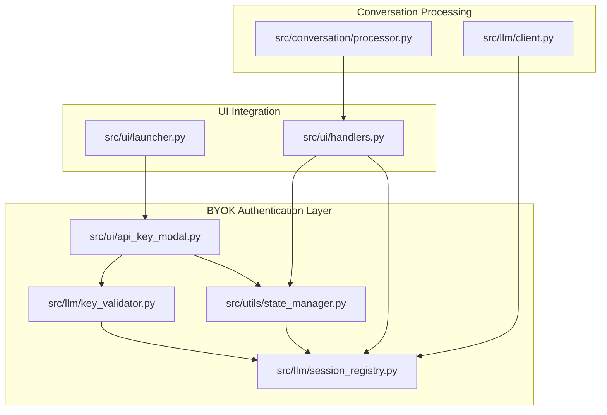
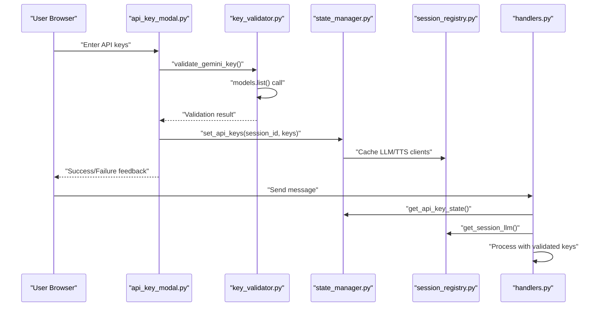
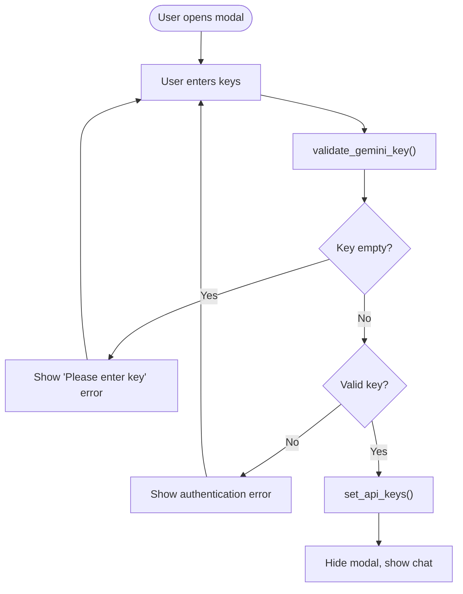
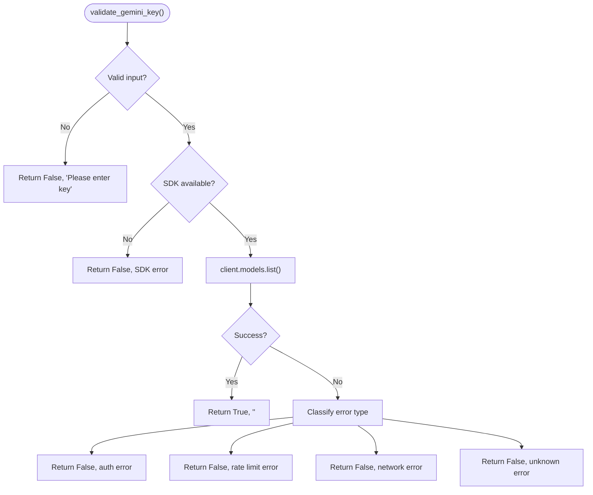
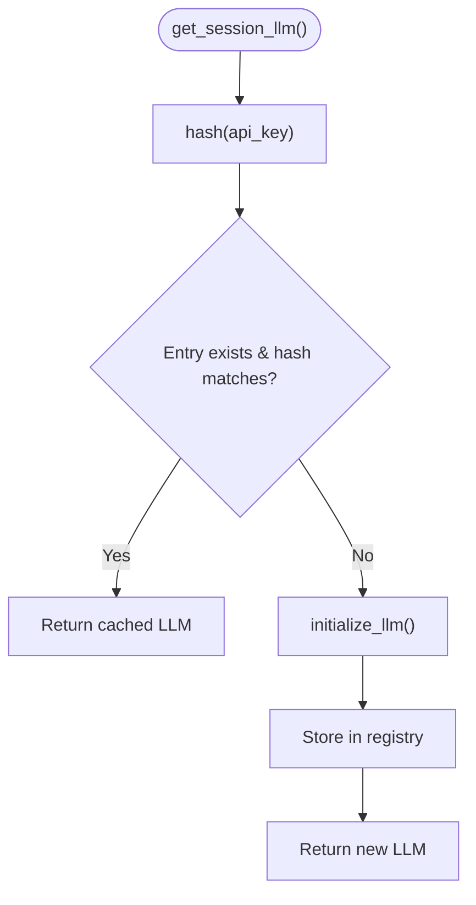
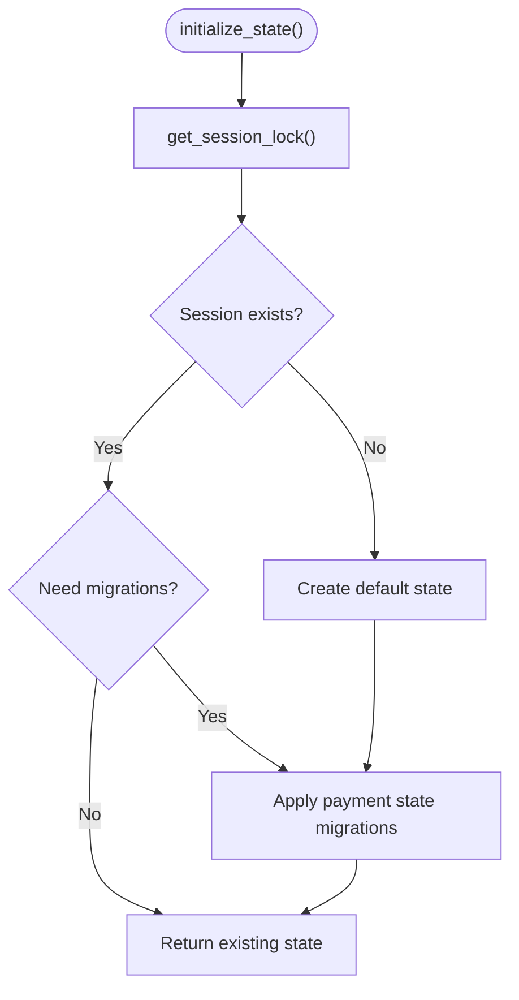
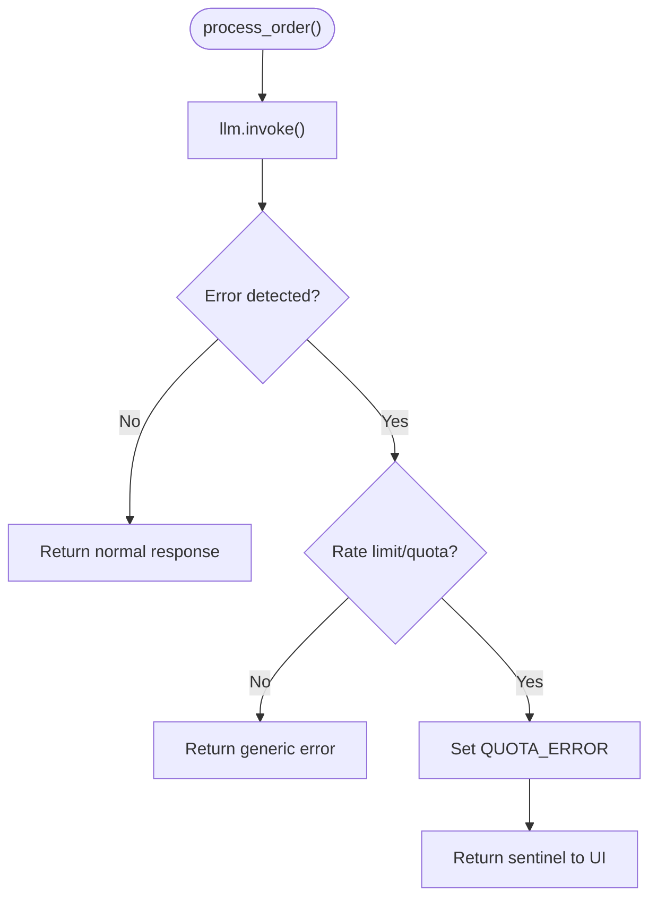
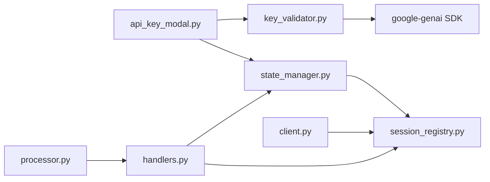

# API Key Management

<cite>
**Referenced Files in This Document**
- [api_key_modal.py](file://src/ui/api_key_modal.py)
- [key_validator.py](file://src/llm/key_validator.py)
- [session_registry.py](file://src/llm/session_registry.py)
- [state_manager.py](file://src/utils/state_manager.py)
- [handlers.py](file://src/ui/handlers.py)
- [processor.py](file://src/conversation/processor.py)
- [client.py](file://src/llm/client.py)
- [test_api_keys.py](file://tests/test_api_keys.py)
- [.env.example](file://.env.example)
- [.env](file://.env)
- [launcher.py](file://src/ui/launcher.py)
</cite>

## Update Summary
**Changes Made**
- Updated architecture overview to reflect BYOK (Bring Your Own Key) authentication system
- Added comprehensive documentation for per-session key validation and storage
- Documented new lightweight Gemini key validation system
- Added thread-safe session registry with client caching
- Updated quota error handling and modal-based key input interface
- Revised security considerations for session-based key storage
- Added new troubleshooting section for quota limits and rate limiting

## Table of Contents
1. [Introduction](#introduction)
2. [Project Structure](#project-structure)
3. [Core Components](#core-components)
4. [Architecture Overview](#architecture-overview)
5. [Detailed Component Analysis](#detailed-component-analysis)
6. [Dependency Analysis](#dependency-analysis)
7. [Performance Considerations](#performance-considerations)
8. [Troubleshooting Guide](#troubleshooting-guide)
9. [Conclusion](#conclusion)

## Introduction
This document explains MayaMCP's modern API key management system with a focus on secure BYOK (Bring Your Own Key) authentication and per-session credential handling. The system has evolved from server-side key management to a distributed approach where each user session manages its own credentials independently. It covers how the application validates required credentials (GEMINI_API_KEY) through a lightweight validation process, stores keys per session, manages concurrent access with thread-safe patterns, and handles quota errors gracefully through modal interfaces.

## Project Structure
The BYOK API key management spans several modules with a focus on session-scoped credential handling:
- Modal-based key input and validation: src/ui/api_key_modal.py
- Lightweight Gemini key validation: src/llm/key_validator.py
- Per-session client registry: src/llm/session_registry.py
- Thread-safe session state management: src/utils/state_manager.py
- UI event handlers with session awareness: src/ui/handlers.py
- Conversation processing with quota error handling: src/conversation/processor.py
- LLM client initialization and API calls: src/llm/client.py
- Legacy environment-based configuration: .env.example and .env

**Diagram sources**
- [api_key_modal.py](file://src/ui/api_key_modal.py#L83-L136)
- [key_validator.py](file://src/llm/key_validator.py#L20-L86)
- [state_manager.py](file://src/utils/state_manager.py#L840-L894)
- [session_registry.py](file://src/llm/session_registry.py#L21-L107)
- [handlers.py](file://src/ui/handlers.py#L41-L214)
- [launcher.py](file://src/ui/launcher.py#L90-L212)
- [processor.py](file://src/conversation/processor.py#L73-L468)
- [client.py](file://src/llm/client.py#L96-L217)

**Section sources**
- [api_key_modal.py](file://src/ui/api_key_modal.py#L1-L137)
- [key_validator.py](file://src/llm/key_validator.py#L1-L87)
- [state_manager.py](file://src/utils/state_manager.py#L1-L894)
- [session_registry.py](file://src/llm/session_registry.py#L1-L107)
- [handlers.py](file://src/ui/handlers.py#L1-L387)
- [launcher.py](file://src/ui/launcher.py#L90-L212)
- [processor.py](file://src/conversation/processor.py#L1-L468)
- [client.py](file://src/llm/client.py#L1-L217)

## Core Components
- **Modal-based Key Input**: src/ui/api_key_modal.py - Provides interactive key entry with validation and error handling
- **Lightweight Validation**: src/llm/key_validator.py - Validates Gemini keys with minimal API calls
- **Per-Session Storage**: src/utils/state_manager.py - Manages session-scoped API key state with thread safety
- **Client Registry**: src/llm/session_registry.py - Caches and manages LLM/TTS clients per session
- **UI Integration**: src/ui/handlers.py - Coordinates session-aware processing and error handling
- **Quota Error Handling**: src/conversation/processor.py - Detects and handles rate limit/quota errors
- **Legacy Support**: .env.example and .env - Maintains backward compatibility for server-side configuration

Key responsibilities:
- Validate user-provided Gemini API keys without exposing server credentials
- Store keys per session with automatic cleanup and expiration
- Manage concurrent access through thread-safe session locks
- Cache and reuse LLM/TTS clients to minimize initialization overhead
- Handle quota limits and rate limiting with user-friendly modal interfaces
- Support graceful degradation when keys are missing or invalid

**Section sources**
- [api_key_modal.py](file://src/ui/api_key_modal.py#L83-L136)
- [key_validator.py](file://src/llm/key_validator.py#L20-L86)
- [state_manager.py](file://src/utils/state_manager.py#L840-L894)
- [session_registry.py](file://src/llm/session_registry.py#L21-L107)
- [handlers.py](file://src/ui/handlers.py#L41-L214)
- [processor.py](file://src/conversation/processor.py#L28-L159)

## Architecture Overview
The BYOK system follows a distributed architecture where each user session manages its own credentials independently:
- **Session Initialization**: Users enter keys through modal interface
- **Lightweight Validation**: Keys are validated using minimal API calls
- **Session Storage**: Keys are stored per-session with thread-safe access
- **Client Caching**: LLM/TTS clients are cached per session for performance
- **Error Handling**: Quota limits trigger modal popups with resolution steps
- **Resource Cleanup**: Automatic cleanup of expired sessions and cached clients

**Diagram sources**
- [api_key_modal.py](file://src/ui/api_key_modal.py#L83-L136)
- [key_validator.py](file://src/llm/key_validator.py#L20-L86)
- [state_manager.py](file://src/utils/state_manager.py#L854-L879)
- [session_registry.py](file://src/llm/session_registry.py#L21-L53)
- [handlers.py](file://src/ui/handlers.py#L41-L160)

## Detailed Component Analysis

### Modal-Based Key Input and Validation
The system provides an interactive modal interface for users to enter their API keys:
- **Required Fields**: Gemini API key is mandatory; Cartesia key is optional
- **Real-time Validation**: Keys are validated using lightweight API calls
- **Error Handling**: Comprehensive error messages for authentication, rate limits, and connectivity issues
- **Session Storage**: Validated keys are stored per-session with automatic cleanup

**Diagram sources**
- [api_key_modal.py](file://src/ui/api_key_modal.py#L83-L136)
- [key_validator.py](file://src/llm/key_validator.py#L20-L86)
- [state_manager.py](file://src/utils/state_manager.py#L854-L879)

**Section sources**
- [api_key_modal.py](file://src/ui/api_key_modal.py#L83-L136)
- [key_validator.py](file://src/llm/key_validator.py#L20-L86)
- [state_manager.py](file://src/utils/state_manager.py#L854-L879)

### Lightweight Gemini Key Validation
The validation system performs minimal API calls to verify key authenticity:
- **Minimal Cost**: Uses `models.list()` which consumes zero tokens
- **Thread Safety**: Uses locks to prevent concurrent validation conflicts
- **Error Classification**: Distinguishes between authentication, rate limit, and network errors
- **Graceful Degradation**: Handles missing SDK gracefully with meaningful error messages

**Diagram sources**
- [key_validator.py](file://src/llm/key_validator.py#L20-L86)

**Section sources**
- [key_validator.py](file://src/llm/key_validator.py#L20-L86)

### Thread-Safe Session Registry and Client Caching
The system maintains separate client instances for each session with automatic caching:
- **Hash Comparison**: Uses SHA-256 hashes to detect key changes
- **Concurrent Access**: Thread-safe registry with mutex protection
- **Automatic Cleanup**: Removes cached clients when sessions expire
- **Key Rotation**: Recreates clients when users change their keys

**Diagram sources**
- [session_registry.py](file://src/llm/session_registry.py#L21-L53)
- [state_manager.py](file://src/utils/state_manager.py#L207-L242)

**Section sources**
- [session_registry.py](file://src/llm/session_registry.py#L1-L107)
- [state_manager.py](file://src/utils/state_manager.py#L190-L283)

### Per-Session State Management and Thread Safety
The state management system provides comprehensive session isolation:
- **Session Locks**: Individual locks per session prevent race conditions
- **Automatic Cleanup**: Background cleanup of expired sessions and locks
- **Migration Support**: Handles upgrades from older state formats
- **Payment State Integration**: Extends beyond API keys to include payment tracking

**Diagram sources**
- [state_manager.py](file://src/utils/state_manager.py#L407-L420)
- [state_manager.py](file://src/utils/state_manager.py#L207-L242)

**Section sources**
- [state_manager.py](file://src/utils/state_manager.py#L190-L283)
- [state_manager.py](file://src/utils/state_manager.py#L351-L394)

### Quota Error Handling and Modal Interfaces
The system provides user-friendly interfaces for handling quota limitations:
- **Sentinel Detection**: Special handling for quota-exceeded responses
- **Modal Popups**: Styled HTML overlays with resolution steps
- **Free Tier Guidance**: Links to Google AI Studio for billing setup
- **Graceful Degradation**: Continues operation with reduced functionality

**Diagram sources**
- [processor.py](file://src/conversation/processor.py#L28-L159)
- [handlers.py](file://src/ui/handlers.py#L28-L38)

**Section sources**
- [processor.py](file://src/conversation/processor.py#L28-L159)
- [handlers.py](file://src/ui/handlers.py#L28-L38)
- [api_key_modal.py](file://src/ui/api_key_modal.py#L16-L54)

### UI Integration and Session-Aware Processing
The UI handlers coordinate between modal input, session state, and conversation processing:
- **Session Extraction**: Uses Gradio session_hash for unique identification
- **Key Validation**: Checks session state before processing requests
- **Client Retrieval**: Gets per-session LLM and TTS clients
- **Error Propagation**: Passes quota errors to modal interface

**Section sources**
- [handlers.py](file://src/ui/handlers.py#L41-L214)
- [launcher.py](file://src/ui/launcher.py#L90-L212)

## Dependency Analysis
The BYOK system creates a complex web of dependencies focused on session management:
- **api_key_modal.py** depends on key_validator.py for validation and state_manager.py for storage
- **key_validator.py** depends on google-genai SDK for validation
- **state_manager.py** provides core session management for all other components
- **session_registry.py** depends on state_manager.py for session locks and caching
- **handlers.py** coordinates all components with session awareness
- **processor.py** integrates with handlers for quota error handling

**Diagram sources**
- [api_key_modal.py](file://src/ui/api_key_modal.py#L1-L137)
- [key_validator.py](file://src/llm/key_validator.py#L1-L87)
- [state_manager.py](file://src/utils/state_manager.py#L1-L894)
- [session_registry.py](file://src/llm/session_registry.py#L1-L107)
- [handlers.py](file://src/ui/handlers.py#L1-L387)
- [processor.py](file://src/conversation/processor.py#L1-L468)
- [client.py](file://src/llm/client.py#L1-L217)

**Section sources**
- [api_key_modal.py](file://src/ui/api_key_modal.py#L1-L137)
- [key_validator.py](file://src/llm/key_validator.py#L1-L87)
- [state_manager.py](file://src/utils/state_manager.py#L1-L894)
- [session_registry.py](file://src/llm/session_registry.py#L1-L107)
- [handlers.py](file://src/ui/handlers.py#L1-L387)
- [processor.py](file://src/conversation/processor.py#L1-L468)
- [client.py](file://src/llm/client.py#L1-L217)

## Performance Considerations
- **Client Caching**: Per-session client caching eliminates expensive initialization costs
- **Hash-Based Comparison**: SHA-256 hashing provides fast key change detection
- **Thread Safety**: Session locks prevent race conditions without excessive contention
- **Lazy Initialization**: Clients are created only when needed, reducing startup overhead
- **Memory Management**: Automatic cleanup of expired sessions prevents memory leaks
- **Minimal Validation**: Lightweight API calls (models.list()) minimize validation overhead

## Troubleshooting Guide

### Common Issues and Resolutions

#### **Missing Required Keys**
- **Symptom**: Modal shows "Please enter your Gemini API key" error
- **Cause**: User didn't enter a key or entered only whitespace
- **Resolution**: Enter a valid Gemini API key from Google AI Studio
- **Reference**: [Key validation](file://src/ui/api_key_modal.py#L103-L109)

#### **Invalid API Key**
- **Symptom**: Modal shows authentication error with Google AI Studio link
- **Cause**: Key doesn't exist or lacks proper permissions
- **Resolution**: Verify key from Google AI Studio dashboard
- **Reference**: [Authentication error handling](file://src/llm/key_validator.py#L72-L77)

#### **Rate Limit/Quota Exceeded**
- **Symptom**: Modal popup with "Rate Limit Reached" and resolution steps
- **Cause**: Free tier quota exceeded or billing not enabled
- **Resolution**: Wait for quota reset or enable billing in Google AI Studio
- **Reference**: [Quota error handling](file://src/conversation/processor.py#L28-L38), [Modal popup](file://src/ui/api_key_modal.py#L16-L54)

#### **Network Connectivity Issues**
- **Symptom**: Connection error messages during validation
- **Cause**: Network problems or firewall restrictions
- **Resolution**: Check internet connection and proxy settings
- **Reference**: [Network error handling](file://src/llm/key_validator.py#L80-L82)

#### **Session Lock Contention**
- **Symptom**: Slow response times under high concurrency
- **Cause**: Multiple threads competing for the same session lock
- **Resolution**: Monitor session lock cleanup and reduce concurrent operations
- **Reference**: [Session lock management](file://src/utils/state_manager.py#L207-L242)

#### **Expired Session Cleanup**
- **Symptom**: Memory growth over time
- **Cause**: Sessions not being cleaned up properly
- **Resolution**: Ensure cleanup_session_lock() is called during reset
- **Reference**: [Cleanup function](file://src/utils/state_manager.py#L229-L242)

#### **Client Recreation Issues**
- **Symptom**: Stale clients serving wrong keys
- **Cause**: Hash comparison failing or cache corruption
- **Resolution**: Clear session clients and recreate with new keys
- **Reference**: [Client registry](file://src/llm/session_registry.py#L98-L107)

#### **Legacy Configuration Conflicts**
- **Symptom**: Confusion between old server-side and new BYOK system
- **Cause**: Mixing .env configuration with per-session keys
- **Resolution**: Use per-session keys exclusively for BYOK system
- **Reference**: [Legacy support](file://.env.example#L1-L33)

**Section sources**
- [api_key_modal.py](file://src/ui/api_key_modal.py#L16-L54)
- [key_validator.py](file://src/llm/key_validator.py#L52-L86)
- [state_manager.py](file://src/utils/state_manager.py#L229-L242)
- [session_registry.py](file://src/llm/session_registry.py#L98-L107)
- [processor.py](file://src/conversation/processor.py#L28-L38)

## Conclusion
MayaMCP's BYOK API key management system represents a significant architectural advancement in secure credential handling:
- **Distributed Authentication**: Each session manages its own credentials independently
- **Lightweight Validation**: Minimal API calls ensure fast key verification
- **Thread Safety**: Comprehensive locking mechanisms prevent race conditions
- **User Experience**: Modal interfaces provide clear feedback and resolution steps
- **Performance**: Client caching and lazy initialization optimize resource usage
- **Security**: Keys never leave the user's session, reducing exposure risks

The system successfully balances security, performance, and usability while maintaining backward compatibility with legacy configurations.

## Best Practices and Guidelines

### **Security Considerations**
- **Session Isolation**: Keys are stored per-session and never shared between users
- **Minimal Exposure**: Keys are only temporarily stored in memory during active sessions
- **Hash Verification**: Raw keys are never logged; only SHA-256 hashes are tracked
- **Automatic Cleanup**: Expired sessions are automatically cleaned up to prevent memory leaks

### **Key Management Guidelines**
- **Gemini Key Requirements**: Always provide a valid Gemini API key; Cartesia key is optional
- **Key Rotation**: Changing keys automatically recreates clients without service interruption
- **Quota Awareness**: Monitor free tier limits and enable billing when needed
- **Testing Keys**: Use development keys for testing; avoid production key exposure

### **Deployment Considerations**
- **Scalability**: Thread-safe design supports high-concurrency scenarios
- **Resource Management**: Automatic cleanup prevents memory accumulation
- **Monitoring**: Track session lock cleanup and client recreation metrics
- **Fallback Handling**: Graceful degradation when keys are missing or invalid

### **User Experience Best Practices**
- **Clear Error Messages**: Provide actionable guidance for key validation failures
- **Modal Interfaces**: Use styled popups for quota and rate limit notifications
- **Progress Feedback**: Show loading states during key validation
- **Help Resources**: Include direct links to API key management dashboards

### **Development and Testing**
- **Mock Validation**: Use test keys for development environments
- **Error Simulation**: Test quota limit scenarios with mock responses
- **Concurrency Testing**: Validate thread safety under load conditions
- **Cleanup Verification**: Ensure proper session cleanup in test environments