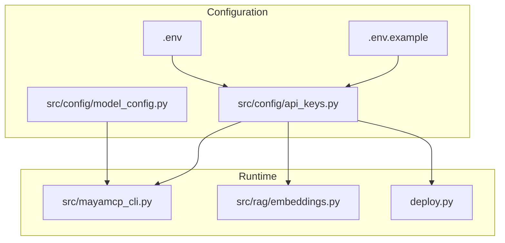
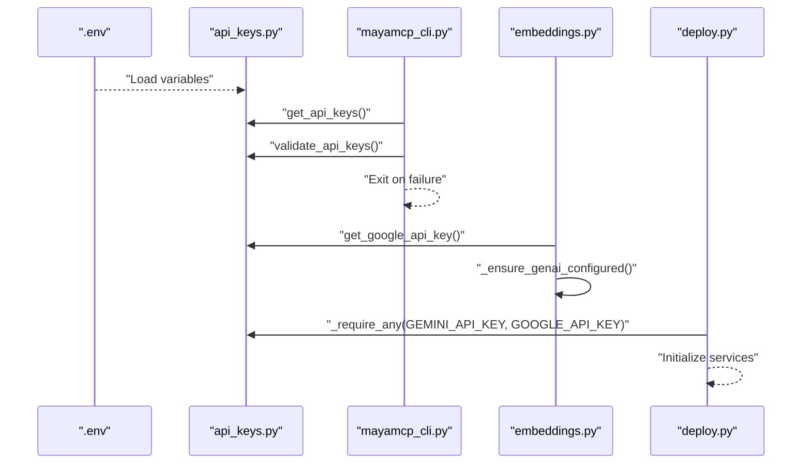
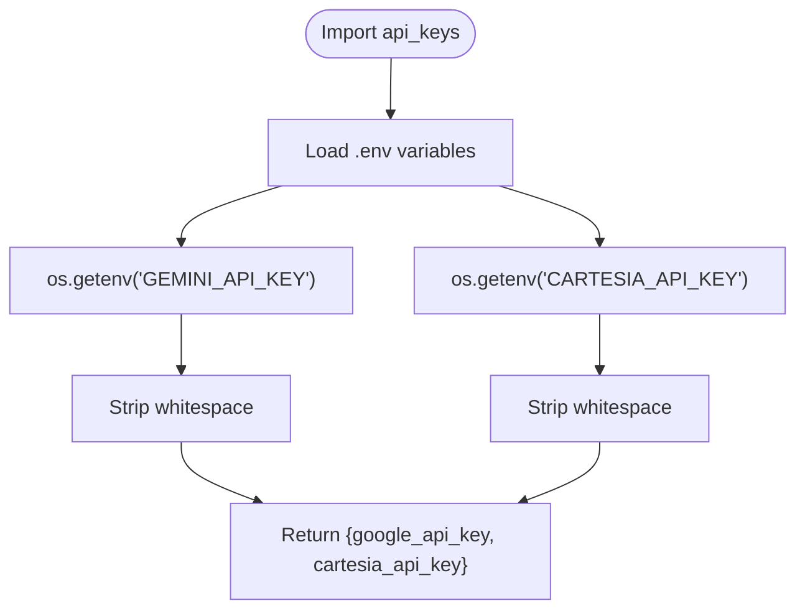
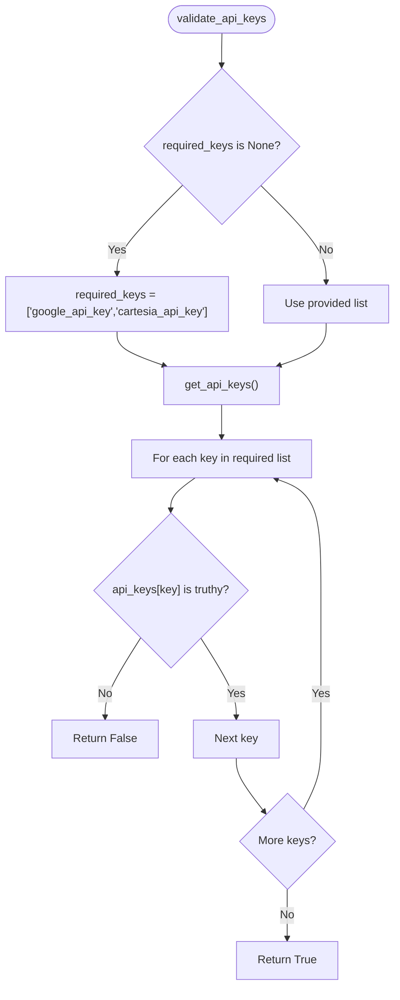
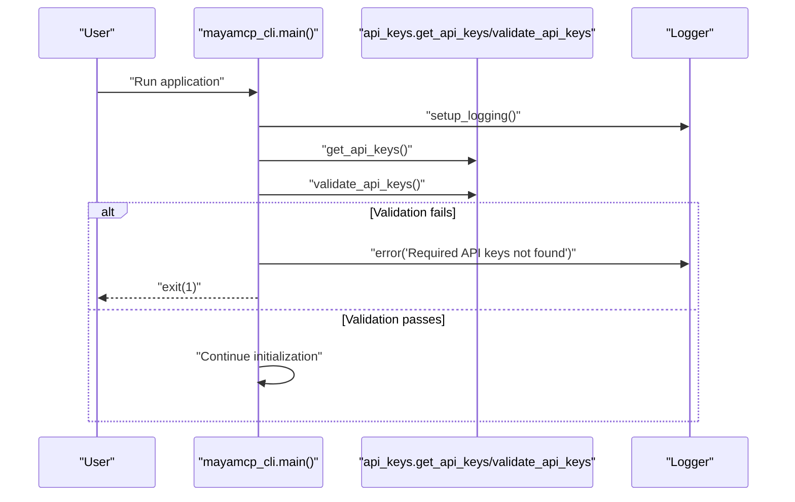
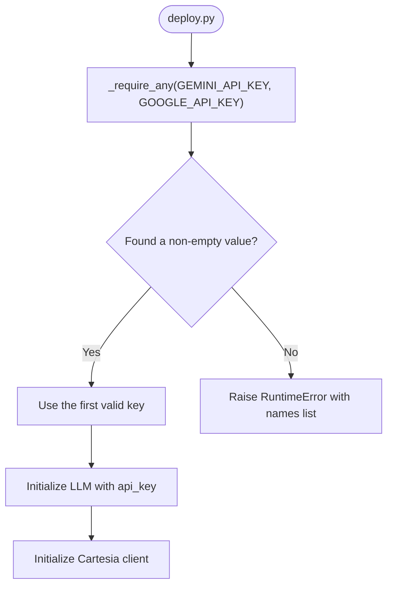
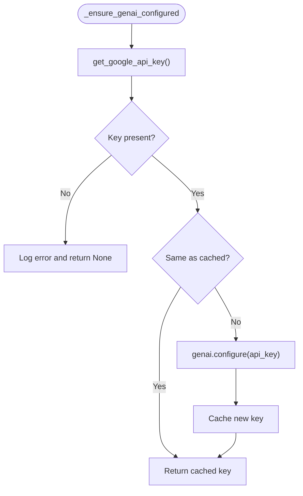
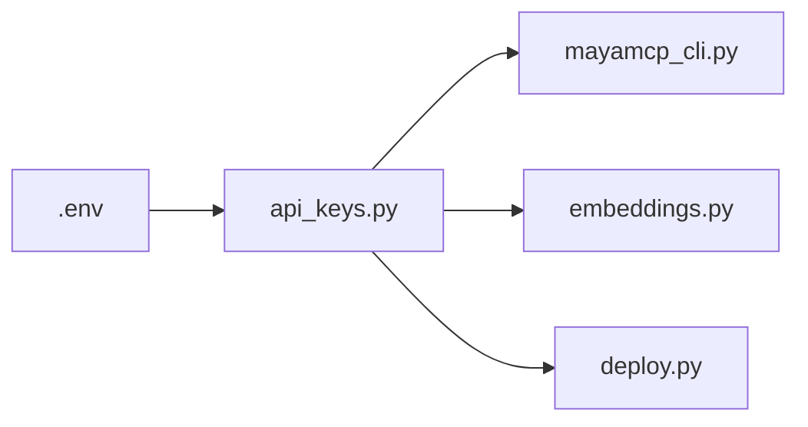

# API Key Management

<cite>
**Referenced Files in This Document**
- [api_keys.py](file://src/config/api_keys.py)
- [test_api_keys.py](file://tests/test_api_keys.py)
- [.env.example](file://.env.example)
- [.env](file://.env)
- [mayamcp_cli.py](file://src/mayamcp_cli.py)
- [deploy.py](file://deploy.py)
- [embeddings.py](file://src/rag/embeddings.py)
- [model_config.py](file://src/config/model_config.py)
</cite>

## Table of Contents
1. [Introduction](#introduction)
2. [Project Structure](#project-structure)
3. [Core Components](#core-components)
4. [Architecture Overview](#architecture-overview)
5. [Detailed Component Analysis](#detailed-component-analysis)
6. [Dependency Analysis](#dependency-analysis)
7. [Performance Considerations](#performance-considerations)
8. [Troubleshooting Guide](#troubleshooting-guide)
9. [Conclusion](#conclusion)

## Introduction
This document explains MayaMCP’s API key management system with a focus on secure credential handling and environment-based configuration. It covers how the application validates required credentials (GEMINI_API_KEY and CARTESIA_API_KEY) at startup, how environment variables are loaded, the naming conventions and validation patterns used, and the security considerations around storage, rotation, and error handling. It also provides practical guidance for configuring .env files, formatting keys, and troubleshooting common credential issues across development, test, and production environments.

## Project Structure
The API key management spans several modules:
- Configuration loader and validator: src/config/api_keys.py
- Application startup and validation: src/mayamcp_cli.py
- Deployment-time validation and legacy key support: deploy.py
- Embeddings service that lazily configures the Google AI SDK: src/rag/embeddings.py
- Example and real-world .env files: .env.example and .env
- Model configuration utilities: src/config/model_config.py

**Diagram sources**
- [api_keys.py](file://src/config/api_keys.py#L1-L51)
- [mayamcp_cli.py](file://src/mayamcp_cli.py#L25-L40)
- [deploy.py](file://deploy.py#L140-L157)
- [embeddings.py](file://src/rag/embeddings.py#L42-L65)
- [.env.example](file://.env.example#L1-L33)
- [.env](file://.env#L1-L12)
- [model_config.py](file://src/config/model_config.py#L31-L44)

**Section sources**
- [api_keys.py](file://src/config/api_keys.py#L1-L51)
- [mayamcp_cli.py](file://src/mayamcp_cli.py#L25-L40)
- [deploy.py](file://deploy.py#L140-L157)
- [embeddings.py](file://src/rag/embeddings.py#L42-L65)
- [.env.example](file://.env.example#L1-L33)
- [.env](file://.env#L1-L12)
- [model_config.py](file://src/config/model_config.py#L31-L44)

## Core Components
- Environment variable loader and API key accessor: src/config/api_keys.py
- Startup validation and graceful failure: src/mayamcp_cli.py
- Deployment-time validation with legacy key support: deploy.py
- Lazy configuration of Google AI SDK with key rotation support: src/rag/embeddings.py
- Example and real-world .env templates: .env.example and .env

Key responsibilities:
- Load environment variables from .env at import time
- Expose normalized API keys (stripped whitespace) under consistent internal names
- Validate presence of required keys at startup
- Support legacy key names for backward compatibility in deployments
- Enable safe key rotation without restarting the process

**Section sources**
- [api_keys.py](file://src/config/api_keys.py#L7-L22)
- [mayamcp_cli.py](file://src/mayamcp_cli.py#L31-L39)
- [deploy.py](file://deploy.py#L142-L157)
- [embeddings.py](file://src/rag/embeddings.py#L42-L65)

## Architecture Overview
The API key system follows a layered approach:
- Layer 1: Environment loading (.env) and normalization
- Layer 2: Centralized accessors and validators
- Layer 3: Startup-time enforcement and runtime lazy configuration
- Layer 4: Deployment-time compatibility and health checks

**Diagram sources**
- [api_keys.py](file://src/config/api_keys.py#L7-L22)
- [mayamcp_cli.py](file://src/mayamcp_cli.py#L31-L39)
- [embeddings.py](file://src/rag/embeddings.py#L42-L65)
- [deploy.py](file://deploy.py#L142-L157)

## Detailed Component Analysis

### Environment Variable Loading and Normalization
- The module loads environment variables from .env at import time using a library designed for dotenv files.
- It retrieves two environment variables and returns them under normalized internal keys with whitespace stripped.
- The normalized keys are used consistently across the application.

**Diagram sources**
- [api_keys.py](file://src/config/api_keys.py#L7-L22)

**Section sources**
- [api_keys.py](file://src/config/api_keys.py#L7-L22)

### API Key Validation
- The validator checks whether required keys are present and non-empty.
- By default, it requires both keys; callers can customize the required subset.
- Empty strings and whitespace-only strings are treated as missing.

**Diagram sources**
- [api_keys.py](file://src/config/api_keys.py#L24-L43)

**Section sources**
- [api_keys.py](file://src/config/api_keys.py#L24-L43)

### Startup-Time Validation in Application Entry Point
- The CLI loads logging, validates API keys, logs errors, and exits with a non-zero status if validation fails.
- It logs a clear message listing the required keys.

**Diagram sources**
- [mayamcp_cli.py](file://src/mayamcp_cli.py#L25-L39)

**Section sources**
- [mayamcp_cli.py](file://src/mayamcp_cli.py#L31-L39)

### Deployment-Time Validation and Legacy Key Support
- The deployment script defines a helper that accepts multiple environment variable names and raises a clear error if none are set.
- It prefers the modern key name for Google AI and supports a legacy key name for backward compatibility.
- It also validates Cartesia key presence.

**Diagram sources**
- [deploy.py](file://deploy.py#L142-L157)

**Section sources**
- [deploy.py](file://deploy.py#L142-L157)

### Lazy Configuration and Key Rotation Support
- The embeddings module lazily configures the Google AI SDK and caches the last configured key.
- If the key changes, it reconfigures the SDK to enable seamless key rotation without restarting the process.
- It logs an error if the key is missing.

**Diagram sources**
- [embeddings.py](file://src/rag/embeddings.py#L42-L65)
- [api_keys.py](file://src/config/api_keys.py#L45-L47)

**Section sources**
- [embeddings.py](file://src/rag/embeddings.py#L42-L65)
- [api_keys.py](file://src/config/api_keys.py#L45-L47)

### Environment-Based Configuration Files
- Example template: .env.example shows the required keys and other configuration variables.
- Real-world example: .env demonstrates how to populate the keys and other settings.

Key points:
- Required keys: GEMINI_API_KEY and CARTESIA_API_KEY
- Optional model and runtime settings are also shown in the example file
- The application reads these variables via the dotenv loader

**Section sources**
- [.env.example](file://.env.example#L1-L33)
- [.env](file://.env#L1-L12)

## Dependency Analysis
- api_keys.py depends on the environment loader and standard OS environment access.
- mayamcp_cli.py depends on api_keys for validation and uses the normalized keys internally.
- deploy.py depends on api_keys for legacy key support and validation.
- embeddings.py depends on api_keys for retrieving the Google AI key and lazily configures the SDK.

**Diagram sources**
- [api_keys.py](file://src/config/api_keys.py#L7-L22)
- [mayamcp_cli.py](file://src/mayamcp_cli.py#L12-L16)
- [deploy.py](file://deploy.py#L142-L157)
- [embeddings.py](file://src/rag/embeddings.py#L42-L65)

**Section sources**
- [api_keys.py](file://src/config/api_keys.py#L7-L22)
- [mayamcp_cli.py](file://src/mayamcp_cli.py#L12-L16)
- [deploy.py](file://deploy.py#L142-L157)
- [embeddings.py](file://src/rag/embeddings.py#L42-L65)

## Performance Considerations
- Lazy configuration avoids unnecessary SDK reinitialization when the key remains unchanged.
- Stripping whitespace reduces accidental validation failures and improves robustness.
- Using a helper to check multiple environment variable names prevents repeated lookups and simplifies deployment scripts.

[No sources needed since this section provides general guidance]

## Troubleshooting Guide

Common issues and resolutions:
- Missing required keys at startup
  - Symptom: Application exits immediately with an error indicating required keys are missing.
  - Resolution: Populate GEMINI_API_KEY and CARTESIA_API_KEY in your .env file and ensure the file is readable by the process.
  - Reference: [Startup validation](file://src/mayamcp_cli.py#L31-L39)

- Empty or whitespace-only keys
  - Symptom: Validation fails even though variables appear set.
  - Cause: Keys contain only whitespace or are empty strings.
  - Resolution: Remove surrounding whitespace and ensure non-empty values.
  - Reference: [Validation behavior](file://src/config/api_keys.py#L24-L43), [Tests for whitespace handling](file://tests/test_api_keys.py#L260-L287)

- Legacy key name in deployment
  - Symptom: Deployment script fails to find the expected key.
  - Resolution: Provide GEMINI_API_KEY or fall back to GOOGLE_API_KEY as supported by the helper.
  - Reference: [Deployment key helper](file://deploy.py#L142-L157)

- Google AI SDK not configured for embeddings
  - Symptom: Embedding generation fails with an error.
  - Resolution: Ensure GEMINI_API_KEY is present and non-empty; the system logs an error if missing.
  - Reference: [Embeddings configuration guard](file://src/rag/embeddings.py#L55-L58)

- Key rotation during runtime
  - Behavior: The system detects a changed key and reconfigures the SDK without restart.
  - Reference: [Lazy configuration and rotation](file://src/rag/embeddings.py#L42-L65)

- Environment file not loading
  - Symptom: Keys are None despite being set.
  - Resolution: Confirm the dotenv loader is invoked and the .env file path is correct.
  - Reference: [Environment loading at import](file://src/config/api_keys.py#L7-L8), [Test verifying loader invocation](file://tests/test_api_keys.py#L228-L237)

**Section sources**
- [mayamcp_cli.py](file://src/mayamcp_cli.py#L31-L39)
- [api_keys.py](file://src/config/api_keys.py#L24-L43)
- [deploy.py](file://deploy.py#L142-L157)
- [embeddings.py](file://src/rag/embeddings.py#L55-L58)
- [tests/test_api_keys.py](file://tests/test_api_keys.py#L228-L237)

## Conclusion
MayaMCP’s API key management system provides a robust, environment-driven approach to credential handling:
- It loads keys from .env, normalizes them, and exposes them through centralized accessors.
- Startup validation ensures required credentials are present, with clear error messaging.
- Deployment scripts support legacy key names and enforce presence of required keys.
- Runtime lazy configuration enables safe key rotation without restarts.
- Comprehensive tests validate edge cases such as missing keys, empty strings, and whitespace-only values.

For secure operations, follow the guidance below to manage keys across environments.

## Best Practices and Guidelines

- Naming conventions
  - Prefer GEMINI_API_KEY for Google AI and CARTESIA_API_KEY for Cartesia.
  - Legacy support exists for GOOGLE_API_KEY in deployment contexts.

- Environment files
  - Use .env.example as a template and copy it to .env for local development.
  - Populate .env with your actual keys and keep it out of version control.

- Security
  - Store keys securely; never commit .env or secrets to repositories.
  - Rotate keys regularly; the system supports runtime rotation for Google AI keys.
  - Limit permissions on .env to trusted users only.

- Separation of environments
  - Development: Use .env with test keys; keep DEBUG enabled locally.
  - Production: Provide keys via deployment platform secrets; disable DEBUG and restrict access.
  - Test environments: Use dedicated test keys; avoid mixing with production keys.

- Validation and error handling
  - On startup, the application validates keys and exits with a clear error if missing.
  - In services like embeddings, missing keys are logged and operations are skipped gracefully.

- Formatting requirements
  - Keys should be non-empty strings; leading/trailing whitespace is trimmed automatically.
  - Avoid special characters unless required by the provider; follow provider-specific key formats.

- Troubleshooting checklist
  - Confirm .env is present and readable.
  - Verify required variables are set and non-empty.
  - Check for whitespace-only values.
  - For deployments, ensure the correct key names are provided.
  - Review logs for explicit error messages indicating missing or invalid keys.

[No sources needed since this section provides general guidance]