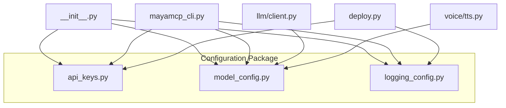
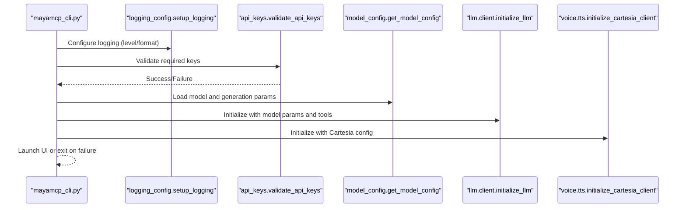
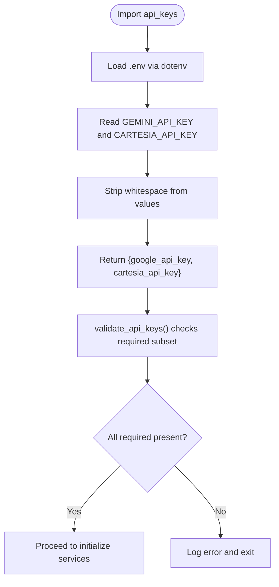
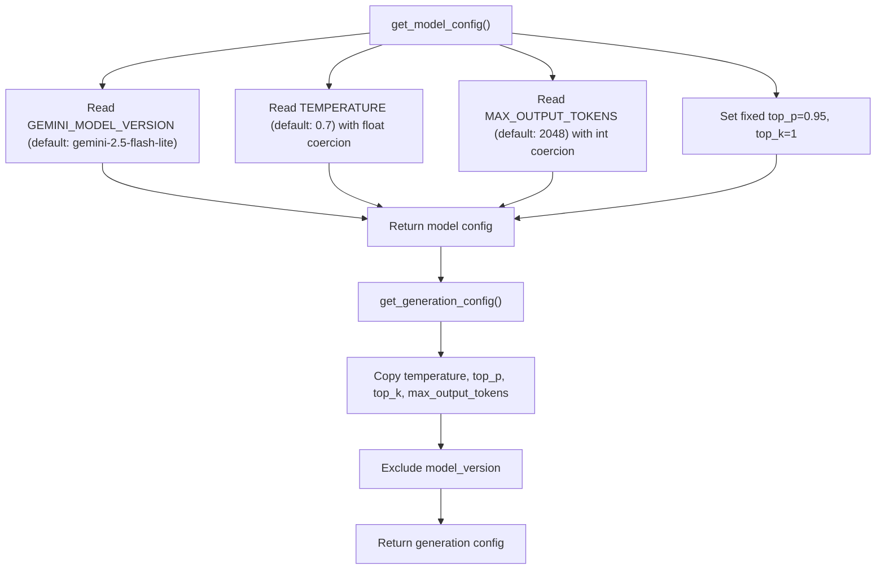
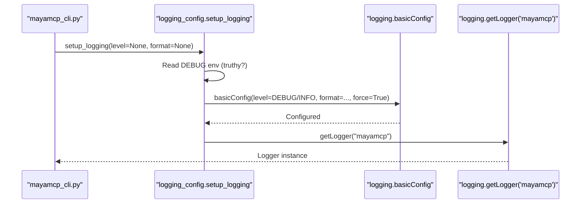
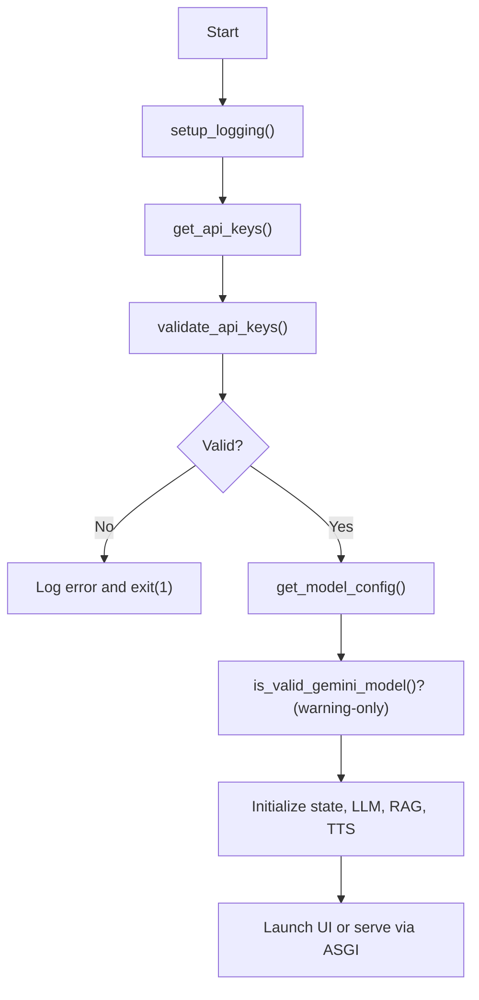
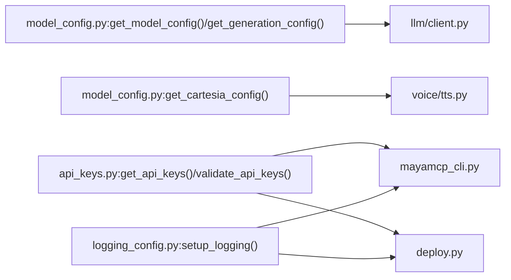
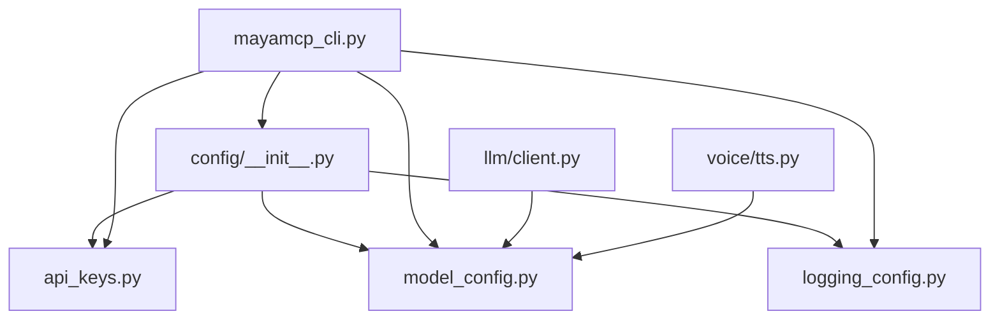

# Configuration Management

<cite>
**Referenced Files in This Document**
- [src/config/__init__.py](file://src/config/__init__.py)
- [src/config/api_keys.py](file://src/config/api_keys.py)
- [src/config/logging_config.py](file://src/config/logging_config.py)
- [src/config/model_config.py](file://src/config/model_config.py)
- [.env.example](file://.env.example)
- [src/mayamcp_cli.py](file://src/mayamcp_cli.py)
- [deploy.py](file://deploy.py)
- [src/llm/client.py](file://src/llm/client.py)
- [src/voice/tts.py](file://src/voice/tts.py)
- [tests/test_api_keys.py](file://tests/test_api_keys.py)
- [tests/test_model_config.py](file://tests/test_model_config.py)
- [tests/test_logging_config.py](file://tests/test_logging_config.py)
</cite>

## Table of Contents
1. [Introduction](#introduction)
2. [Project Structure](#project-structure)
3. [Core Components](#core-components)
4. [Architecture Overview](#architecture-overview)
5. [Detailed Component Analysis](#detailed-component-analysis)
6. [Dependency Analysis](#dependency-analysis)
7. [Performance Considerations](#performance-considerations)
8. [Troubleshooting Guide](#troubleshooting-guide)
9. [Conclusion](#conclusion)
10. [Appendices](#appendices)

## Introduction
This document explains MayaMCP’s configuration management system with a focus on environment-based settings and runtime configuration. It covers how API keys, model parameters, logging, and feature flags are loaded, validated, and consumed across the application. It also documents the startup validation flow, default value handling, error reporting for missing or invalid settings, and environment-specific behaviors for development, staging, and production.

## Project Structure
MayaMCP centralizes configuration under a dedicated package with three primary modules:
- API key management
- Model and generation parameters
- Logging configuration

These modules are imported and orchestrated by the CLI entry point and used by downstream components such as the LLM client and TTS engine.

**Diagram sources**
- [src/config/__init__.py](file://src/config/__init__.py#L1-L13)
- [src/config/api_keys.py](file://src/config/api_keys.py#L1-L51)
- [src/config/model_config.py](file://src/config/model_config.py#L1-L102)
- [src/config/logging_config.py](file://src/config/logging_config.py#L1-L51)
- [src/mayamcp_cli.py](file://src/mayamcp_cli.py#L1-L133)
- [src/llm/client.py](file://src/llm/client.py#L1-L211)
- [src/voice/tts.py](file://src/voice/tts.py#L1-L200)
- [deploy.py](file://deploy.py#L1-L331)

**Section sources**
- [src/config/__init__.py](file://src/config/__init__.py#L1-L13)
- [src/mayamcp_cli.py](file://src/mayamcp_cli.py#L1-L133)

## Core Components
- API Keys: Loads environment variables and validates presence of required keys.
- Model Configuration: Reads model and generation parameters from environment with robust defaulting and type coercion.
- Logging Configuration: Sets up logging with environment-driven level and format, returning named loggers for modules.

**Section sources**
- [src/config/api_keys.py](file://src/config/api_keys.py#L1-L51)
- [src/config/model_config.py](file://src/config/model_config.py#L1-L102)
- [src/config/logging_config.py](file://src/config/logging_config.py#L1-L51)

## Architecture Overview
The configuration architecture is designed around environment variables and a small set of pure functions that encapsulate loading, validation, and normalization. The CLI orchestrates startup by configuring logging, validating API keys, and optionally warning about model validity. Downstream modules consume configuration through simple getters.

**Diagram sources**
- [src/mayamcp_cli.py](file://src/mayamcp_cli.py#L25-L133)
- [src/config/logging_config.py](file://src/config/logging_config.py#L7-L39)
- [src/config/api_keys.py](file://src/config/api_keys.py#L24-L43)
- [src/config/model_config.py](file://src/config/model_config.py#L31-L59)
- [src/llm/client.py](file://src/llm/client.py#L91-L128)
- [src/voice/tts.py](file://src/voice/tts.py#L112-L131)

## Detailed Component Analysis

### API Keys Management
Responsibilities:
- Load environment variables from a .env file at import time.
- Expose a dictionary of normalized keys with whitespace stripped.
- Validate presence of required keys with customizable required subset.
- Provide convenience getters for individual keys.

Key behaviors:
- Required keys are validated at runtime; startup exits with error if missing.
- Keys are stripped of leading/trailing whitespace before use.
- Optional customization allows validating subsets of keys.

**Diagram sources**
- [src/config/api_keys.py](file://src/config/api_keys.py#L7-L43)
- [src/mayamcp_cli.py](file://src/mayamcp_cli.py#L32-L38)

**Section sources**
- [src/config/api_keys.py](file://src/config/api_keys.py#L1-L51)
- [tests/test_api_keys.py](file://tests/test_api_keys.py#L22-L287)

### Model and Generation Configuration
Responsibilities:
- Provide model configuration including model version, temperature, and token limits.
- Provide generation configuration derived from model config.
- Provide Cartesia TTS configuration with defaults.
- Validate model identifiers against a known whitelist (warning-only).

Key behaviors:
- Environment variables are parsed with safe defaults and typed coercion.
- Invalid numeric values log a warning and fall back to defaults.
- Model version is treated as a free-form string; a whitelist is used for warnings only.
- Generation config excludes model_version to avoid leaking non-generation parameters.

**Diagram sources**
- [src/config/model_config.py](file://src/config/model_config.py#L31-L59)

**Section sources**
- [src/config/model_config.py](file://src/config/model_config.py#L1-L102)
- [tests/test_model_config.py](file://tests/test_model_config.py#L136-L247)

### Logging Configuration
Responsibilities:
- Configure root logging with level and format derived from environment.
- Provide a logger for the main application namespace.
- Allow overriding level and format via parameters.

Key behaviors:
- Default level is INFO unless DEBUG is set to a truthy value.
- Default format includes timestamp, logger name, level, and message.
- Existing logging configuration is overridden to ensure consistent behavior.

**Diagram sources**
- [src/config/logging_config.py](file://src/config/logging_config.py#L7-L39)
- [src/mayamcp_cli.py](file://src/mayamcp_cli.py#L27-L29)

**Section sources**
- [src/config/logging_config.py](file://src/config/logging_config.py#L1-L51)
- [tests/test_logging_config.py](file://tests/test_logging_config.py#L14-L275)

### Environment Variable System and Examples
Environment variables used by the configuration system:

- API Keys
  - GEMINI_API_KEY: Required for Google AI access.
  - CARTESIA_API_KEY: Required for Cartesia TTS.

- Model Configuration
  - GEMINI_MODEL_VERSION: Model identifier (defaults to a known value).
  - TEMPERATURE: Generation temperature (float, default 0.7).
  - MAX_OUTPUT_TOKENS: Maximum tokens for generation (int, default 2048).

- Runtime and Deployment
  - PORT: Server port for local dev (default 8000).
  - HOST: Host binding for local dev (default 0.0.0.0).
  - WORKERS: Uvicorn worker count (default 4).
  - LOG_LEVEL: Logging level string (e.g., info, debug).
  - PYTHON_ENV: Environment flavor (development, production, testing).
  - DEBUG: Boolean flag to switch logging to DEBUG.

Example scenarios:
- Development: Set DEBUG=True, LOG_LEVEL=debug, PYTHON_ENV=development, PORT=8000.
- Production: Set DEBUG=False, LOG_LEVEL=info, PYTHON_ENV=production, PORT=8000, HOST=0.0.0.0.
- Staging: Mirror production with lower resource limits; keep LOG_LEVEL at info or warn.

**Section sources**
- [.env.example](file://.env.example#L1-L33)
- [src/mayamcp_cli.py](file://src/mayamcp_cli.py#L114-L119)
- [deploy.py](file://deploy.py#L34-L40)

### Startup Validation and Error Reporting
At startup, the CLI performs:
- Logging setup with environment-derived level/format.
- API key validation; on failure, logs required keys and exits with error code.
- Optional model validation: warns if configured model is not in the known list but continues.
- Initializes state, LLM, RAG, and TTS clients; logs progress and failures.

**Diagram sources**
- [src/mayamcp_cli.py](file://src/mayamcp_cli.py#L25-L133)
- [src/config/api_keys.py](file://src/config/api_keys.py#L24-L43)
- [src/config/model_config.py](file://src/config/model_config.py#L93-L101)

**Section sources**
- [src/mayamcp_cli.py](file://src/mayamcp_cli.py#L25-L133)

### Consumption of Configuration Across Modules
- LLM client reads model configuration to construct the underlying LLM and generation parameters.
- TTS module reads Cartesia configuration for voice selection and output format.
- Deployment script reads environment variables for resource sizing and secret provisioning.

**Diagram sources**
- [src/config/model_config.py](file://src/config/model_config.py#L31-L77)
- [src/llm/client.py](file://src/llm/client.py#L79-L128)
- [src/voice/tts.py](file://src/voice/tts.py#L112-L131)
- [src/config/api_keys.py](file://src/config/api_keys.py#L10-L43)
- [src/mayamcp_cli.py](file://src/mayamcp_cli.py#L25-L133)
- [deploy.py](file://deploy.py#L140-L158)
- [src/config/logging_config.py](file://src/config/logging_config.py#L7-L39)

**Section sources**
- [src/llm/client.py](file://src/llm/client.py#L79-L128)
- [src/voice/tts.py](file://src/voice/tts.py#L112-L131)
- [deploy.py](file://deploy.py#L140-L158)

## Dependency Analysis
- Central exports: The configuration package exposes a concise public API via its initializer.
- Runtime dependencies:
  - API keys depend on environment loading and validation.
  - Model configuration depends on environment variables and logging for warnings.
  - Logging configuration depends on environment variables and standard logging.
- Downstream consumers:
  - CLI orchestrates configuration usage and error handling.
  - LLM client consumes model and generation parameters.
  - TTS client consumes Cartesia configuration.

**Diagram sources**
- [src/config/__init__.py](file://src/config/__init__.py#L1-L13)
- [src/mayamcp_cli.py](file://src/mayamcp_cli.py#L12-L24)
- [src/llm/client.py](file://src/llm/client.py#L9-L11)
- [src/voice/tts.py](file://src/voice/tts.py#L8-L9)

**Section sources**
- [src/config/__init__.py](file://src/config/__init__.py#L1-L13)

## Performance Considerations
- Environment variable reads are O(1) and cached per process; avoid excessive repeated reads by storing results locally in hot paths.
- Logging level and format are set once at startup; avoid frequent reconfiguration to prevent overhead.
- Numeric parsing with defaults avoids expensive exception handling in hot loops; still prefer pre-validating inputs in CI/CD.

## Troubleshooting Guide
Common issues and resolutions:
- Missing API keys
  - Symptom: Application exits immediately with a logged error listing required keys.
  - Resolution: Populate .env with GEMINI_API_KEY and CARTESIA_API_KEY; ensure .env is loaded at import time.
  - Evidence: Startup validation and error exit paths.
  - Section sources
    - [src/mayamcp_cli.py](file://src/mayamcp_cli.py#L32-L38)
    - [src/config/api_keys.py](file://src/config/api_keys.py#L24-L43)

- Invalid numeric configuration
  - Symptom: Unexpected values for TEMPERATURE or MAX_OUTPUT_TOKENS.
  - Resolution: Ensure environment variables contain valid numbers; invalid values log a warning and fall back to defaults.
  - Section sources
    - [src/config/model_config.py](file://src/config/model_config.py#L10-L28)
    - [tests/test_model_config.py](file://tests/test_model_config.py#L22-L134)

- Unknown model identifier
  - Symptom: Warning about model not being in the known list.
  - Resolution: Use a supported model version; the app continues but you may encounter API errors if the model is unsupported.
  - Section sources
    - [src/config/model_config.py](file://src/config/model_config.py#L93-L101)
    - [tests/test_model_config.py](file://tests/test_model_config.py#L332-L406)

- Debug logging not activating
  - Symptom: Expected verbose logs not appearing.
  - Resolution: Set DEBUG=true (case-insensitive truthy values accepted).
  - Section sources
    - [src/config/logging_config.py](file://src/config/logging_config.py#L22-L25)
    - [tests/test_logging_config.py](file://tests/test_logging_config.py#L41-L95)

- Environment-specific settings
  - Development: DEBUG=True, LOG_LEVEL=debug, PYTHON_ENV=development.
  - Production: DEBUG=False, LOG_LEVEL=info, PYTHON_ENV=production.
  - Staging: Align with production; adjust resource variables as needed.
  - Section sources
    - [.env.example](file://.env.example#L29-L33)
    - [src/mayamcp_cli.py](file://src/mayamcp_cli.py#L114-L119)

## Conclusion
MayaMCP’s configuration system is intentionally simple and environment-centric. It loads, validates, and normalizes settings at startup, providing robust defaults and clear error signals. By keeping configuration centralized and explicit, the system enables predictable behavior across development, staging, and production environments while remaining easy to test and maintain.

## Appendices

### Environment Variables Reference
- API Keys
  - GEMINI_API_KEY: Required
  - CARTESIA_API_KEY: Required
- Model Configuration
  - GEMINI_MODEL_VERSION: Optional (default: gemini-2.5-flash-lite)
  - TEMPERATURE: Optional (default: 0.7)
  - MAX_OUTPUT_TOKENS: Optional (default: 2048)
- Runtime and Deployment
  - PORT: Optional (default: 8000)
  - HOST: Optional (default: 0.0.0.0)
  - WORKERS: Optional (default: 4)
  - LOG_LEVEL: Optional (default: info)
  - PYTHON_ENV: Optional (default: development)
  - DEBUG: Optional (default: False)

**Section sources**
- [.env.example](file://.env.example#L1-L33)