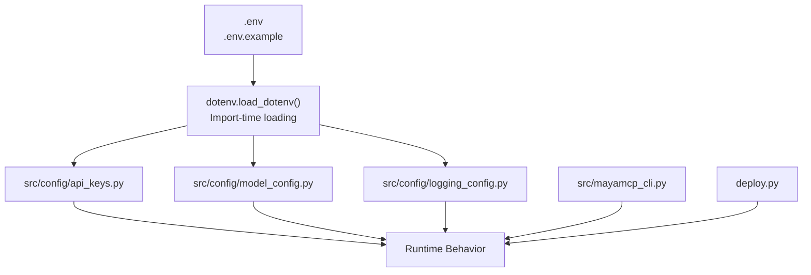
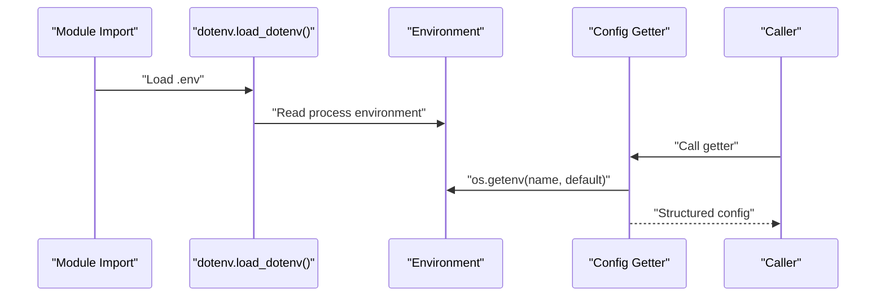
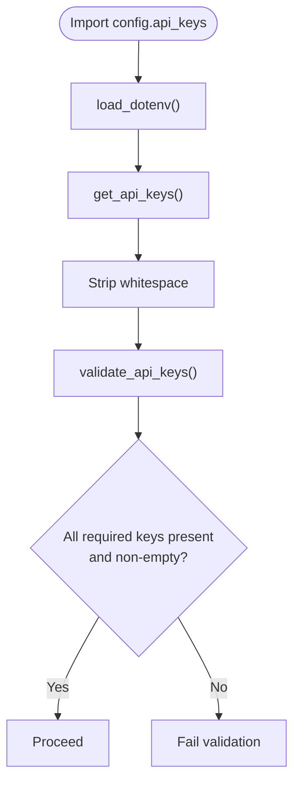
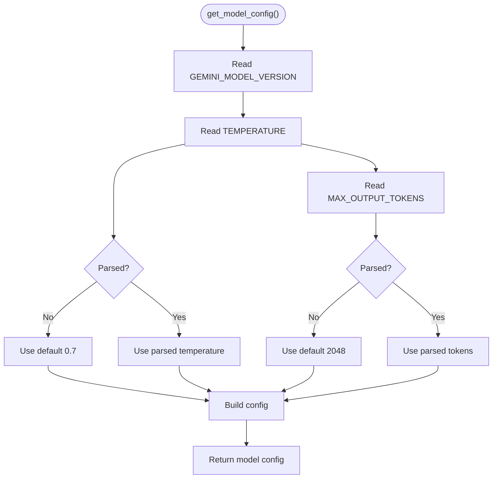
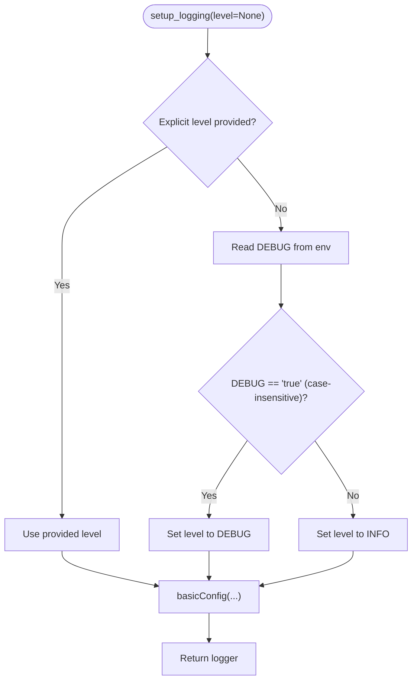
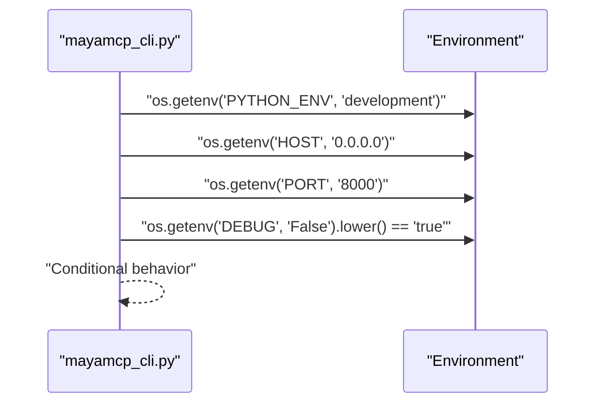
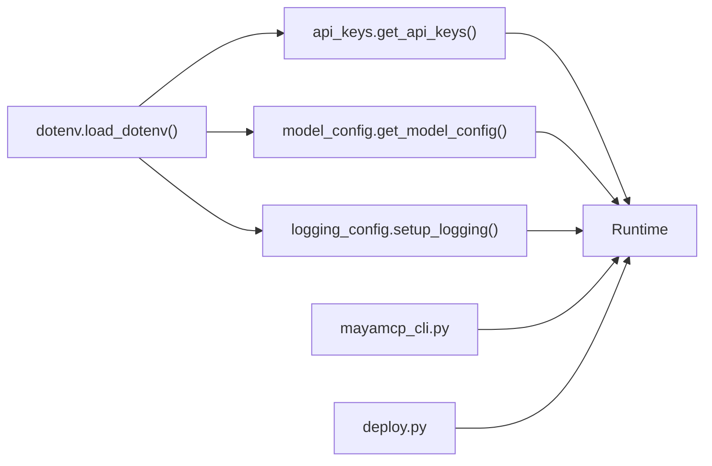

# Environment Variables

<cite>
**Referenced Files in This Document**
- [.env](file://.env)
- [.env.example](file://.env.example)
- [src/config/__init__.py](file://src/config/__init__.py)
- [src/config/api_keys.py](file://src/config/api_keys.py)
- [src/config/model_config.py](file://src/config/model_config.py)
- [src/config/logging_config.py](file://src/config/logging_config.py)
- [src/mayamcp_cli.py](file://src/mayamcp_cli.py)
- [deploy.py](file://deploy.py)
- [tests/test_api_keys.py](file://tests/test_api_keys.py)
- [tests/test_model_config.py](file://tests/test_model_config.py)
- [tests/test_logging_config.py](file://tests/test_logging_config.py)
</cite>

## Update Summary
**Changes Made**
- Updated model version default from `gemini-2.5-flash-lite` to `gemini-3.0-flash` in Model and Generation Configuration section
- Updated environment variable precedence and defaults section to reflect new model version default
- Updated supported environment variables section to reflect new model version default
- Updated example .env files section to note the current example shows the old default for backward compatibility

## Table of Contents
1. [Introduction](#introduction)
2. [Project Structure](#project-structure)
3. [Core Components](#core-components)
4. [Architecture Overview](#architecture-overview)
5. [Detailed Component Analysis](#detailed-component-analysis)
6. [Dependency Analysis](#dependency-analysis)
7. [Performance Considerations](#performance-considerations)
8. [Troubleshooting Guide](#troubleshooting-guide)
9. [Conclusion](#conclusion)
10. [Appendices](#appendices)

## Introduction
This document explains MayaMCP's environment variable system for configuration management across development, staging, and production environments. It covers supported variables, precedence, defaults, validation, and how environment variables integrate with configuration modules. It also provides example .env files and troubleshooting guidance for common setup issues.

## Project Structure
MayaMCP centralizes configuration via dedicated modules under src/config. Environment variables are loaded at import time and consumed by configuration getters. The CLI and deployment scripts also consult environment variables for runtime behavior.

**Diagram sources**
- [src/config/api_keys.py](file://src/config/api_keys.py#L7-L8)
- [src/config/model_config.py](file://src/config/model_config.py#L10-L28)
- [src/config/logging_config.py](file://src/config/logging_config.py#L22-L25)
- [src/mayamcp_cli.py](file://src/mayamcp_cli.py#L113-L117)
- [deploy.py](file://deploy.py#L29-L29)

**Section sources**
- [src/config/__init__.py](file://src/config/__init__.py#L1-L13)
- [src/config/api_keys.py](file://src/config/api_keys.py#L7-L8)
- [src/config/model_config.py](file://src/config/model_config.py#L10-L28)
- [src/config/logging_config.py](file://src/config/logging_config.py#L22-L25)
- [src/mayamcp_cli.py](file://src/mayamcp_cli.py#L113-L117)
- [deploy.py](file://deploy.py#L29-L29)

## Core Components
- API keys loader and validator
- Model and generation configuration
- Logging configuration and debug toggles
- CLI and deployment integration

Key responsibilities:
- Load environment variables from .env at import time
- Provide typed configuration getters with safe defaults and validation
- Support debug and logging toggles via environment variables
- Expose configuration to runtime components

**Section sources**
- [src/config/api_keys.py](file://src/config/api_keys.py#L10-L43)
- [src/config/model_config.py](file://src/config/model_config.py#L31-L59)
- [src/config/logging_config.py](file://src/config/logging_config.py#L7-L39)

## Architecture Overview
The environment variable system is imported-time driven. On module import, dotenv loads variables from .env. Subsequent getters read environment variables with sensible defaults and validation.

**Diagram sources**
- [src/config/api_keys.py](file://src/config/api_keys.py#L7-L8)
- [src/config/model_config.py](file://src/config/model_config.py#L38-L44)
- [src/config/logging_config.py](file://src/config/logging_config.py#L22-L25)

## Detailed Component Analysis

### API Keys Configuration
- Variables: GEMINI_API_KEY, CARTESIA_API_KEY
- Behavior:
  - Values are read via os.getenv and stripped of surrounding whitespace
  - validate_api_keys checks presence of required keys
  - Missing or empty keys cause validation to fail
- Precedence:
  - Loaded from .env at import time; can be overridden by process environment
- Defaults:
  - None when not present
- Validation:
  - Non-empty strings required; whitespace-only strings are considered empty

**Diagram sources**
- [src/config/api_keys.py](file://src/config/api_keys.py#L7-L8)
- [src/config/api_keys.py](file://src/config/api_keys.py#L10-L22)
- [src/config/api_keys.py](file://src/config/api_keys.py#L24-L43)

**Section sources**
- [src/config/api_keys.py](file://src/config/api_keys.py#L10-L51)
- [tests/test_api_keys.py](file://tests/test_api_keys.py#L25-L84)
- [tests/test_api_keys.py](file://tests/test_api_keys.py#L166-L177)

### Model and Generation Configuration
- Variables: GEMINI_MODEL_VERSION, TEMPERATURE, MAX_OUTPUT_TOKENS
- Behavior:
  - get_model_config reads environment variables with defaults
  - get_generation_config derives generation parameters from model config
  - Invalid numeric values fall back to defaults with warnings
- Defaults:
  - **Updated**: Model version default: gemini-3.0-flash (previously gemini-2.5-flash-lite)
  - Temperature default: 0.7
  - Max output tokens default: 2048
- Validation:
  - Numeric parsing with fallback; non-numeric values logged and ignored

**Diagram sources**
- [src/config/model_config.py](file://src/config/model_config.py#L31-L59)
- [src/config/model_config.py](file://src/config/model_config.py#L10-L28)

**Section sources**
- [src/config/model_config.py](file://src/config/model_config.py#L31-L59)
- [tests/test_model_config.py](file://tests/test_model_config.py#L136-L189)

### Logging and Debug Configuration
- Variables: DEBUG, PYTHON_ENV
- Behavior:
  - setup_logging determines level from DEBUG when not explicitly provided
  - DEBUG accepts "true"/"false" case-insensitively
  - PYTHON_ENV influences CLI behavior and environment-aware logic
- Defaults:
  - INFO when DEBUG is not true
  - development when PYTHON_ENV is not set

**Diagram sources**
- [src/config/logging_config.py](file://src/config/logging_config.py#L7-L39)

**Section sources**
- [src/config/logging_config.py](file://src/config/logging_config.py#L7-L39)
- [tests/test_logging_config.py](file://tests/test_logging_config.py#L24-L95)

### CLI and Deployment Integration
- Variables: HOST, PORT, DEBUG, PYTHON_ENV
- Behavior:
  - CLI reads HOST, PORT, and debug flag from environment
  - CLI checks PYTHON_ENV to gate production-specific behavior
  - deploy.py reads STAGE_DEBUG_SOURCE or falls back to DEBUG

**Diagram sources**
- [src/mayamcp_cli.py](file://src/mayamcp_cli.py#L113-L117)
- [deploy.py](file://deploy.py#L29-L29)

**Section sources**
- [src/mayamcp_cli.py](file://src/mayamcp_cli.py#L113-L117)
- [deploy.py](file://deploy.py#L29-L29)

## Dependency Analysis
- Import-time loading: dotenv.load_dotenv is invoked during module import, ensuring environment variables are available immediately.
- Configuration modules depend on os.getenv and logging for defaults and warnings.
- CLI and deployment scripts depend on environment variables for host, port, and debug behavior.

**Diagram sources**
- [src/config/api_keys.py](file://src/config/api_keys.py#L7-L8)
- [src/config/model_config.py](file://src/config/model_config.py#L10-L28)
- [src/config/logging_config.py](file://src/config/logging_config.py#L22-L25)
- [src/mayamcp_cli.py](file://src/mayamcp_cli.py#L113-L117)
- [deploy.py](file://deploy.py#L29-L29)

**Section sources**
- [src/config/api_keys.py](file://src/config/api_keys.py#L7-L8)
- [src/config/model_config.py](file://src/config/model_config.py#L10-L28)
- [src/config/logging_config.py](file://src/config/logging_config.py#L22-L25)
- [src/mayamcp_cli.py](file://src/mayamcp_cli.py#L113-L117)
- [deploy.py](file://deploy.py#L29-L29)

## Performance Considerations
- Environment variable lookups are O(1); negligible overhead.
- Parsing numeric values occurs once per getter invocation; keep environment updates infrequent.
- Logging warnings on invalid values are informational and do not impact performance significantly.

## Troubleshooting Guide
Common issues and resolutions:
- Missing API keys
  - Symptom: validate_api_keys returns False
  - Resolution: Set GEMINI_API_KEY and CARTESIA_API_KEY in .env or process environment
  - Reference: [src/config/api_keys.py](file://src/config/api_keys.py#L24-L43), [tests/test_api_keys.py](file://tests/test_api_keys.py#L86-L133)
- Empty or whitespace-only keys
  - Symptom: Keys appear present but validation fails
  - Resolution: Ensure non-empty values; leading/trailing whitespace is trimmed automatically
  - Reference: [tests/test_api_keys.py](file://tests/test_api_keys.py#L260-L275)
- Invalid numeric values for TEMPERATURE or MAX_OUTPUT_TOKENS
  - Symptom: Unexpected defaults despite setting values
  - Resolution: Use valid numeric strings; non-numeric values log warnings and fall back to defaults
  - Reference: [src/config/model_config.py](file://src/config/model_config.py#L10-L28), [tests/test_model_config.py](file://tests/test_model_config.py#L61-L79)
- DEBUG not taking effect
  - Symptom: Log level remains INFO despite DEBUG=true
  - Resolution: Ensure DEBUG is set to "true" (case-insensitive); explicit level parameter overrides env
  - Reference: [src/config/logging_config.py](file://src/config/logging_config.py#L22-L25), [tests/test_logging_config.py](file://tests/test_logging_config.py#L41-L67)
- Host and port not applied
  - Symptom: Server binds to unexpected address/port
  - Resolution: Set HOST and PORT in environment; verify CLI reads them
  - Reference: [src/mayamcp_cli.py](file://src/mayamcp_cli.py#L113-L117)
- Staging debug source confusion
  - Symptom: Debug behavior differs between stages
  - Resolution: Use STAGE_DEBUG_SOURCE or rely on DEBUG; confirm value in deployment environment
  - Reference: [deploy.py](file://deploy.py#L29-L29)

**Section sources**
- [src/config/api_keys.py](file://src/config/api_keys.py#L24-L43)
- [tests/test_api_keys.py](file://tests/test_api_keys.py#L86-L133)
- [src/config/model_config.py](file://src/config/model_config.py#L10-L28)
- [tests/test_model_config.py](file://tests/test_model_config.py#L61-L79)
- [src/config/logging_config.py](file://src/config/logging_config.py#L22-L25)
- [tests/test_logging_config.py](file://tests/test_logging_config.py#L41-L67)
- [src/mayamcp_cli.py](file://src/mayamcp_cli.py#L113-L117)
- [deploy.py](file://deploy.py#L29-L29)

## Conclusion
MayaMCP's environment variable system provides a robust, predictable way to configure APIs, models, and runtime behavior across environments. By leveraging dotenv import-time loading, explicit defaults, and validation helpers, the system balances flexibility with safety. Following the guidelines and examples below ensures reliable deployments.

## Appendices

### Supported Environment Variables
- Required
  - GEMINI_API_KEY
  - CARTESIA_API_KEY
- Optional
  - GEMINI_MODEL_VERSION
  - TEMPERATURE
  - MAX_OUTPUT_TOKENS
  - DEBUG
  - PYTHON_ENV
  - HOST
  - PORT
  - WORKERS
  - LOG_LEVEL
- Notes
  - Values are read via os.getenv with documented defaults
  - API keys are stripped of whitespace; validation requires non-empty strings
  - Numeric values are parsed with fallback to defaults and warning logs

**Section sources**
- [src/config/api_keys.py](file://src/config/api_keys.py#L10-L22)
- [src/config/model_config.py](file://src/config/model_config.py#L31-L59)
- [src/config/logging_config.py](file://src/config/logging_config.py#L7-L39)
- [src/mayamcp_cli.py](file://src/mayamcp_cli.py#L113-L117)
- [.env.example](file://.env.example#L1-L33)

### Environment Variable Precedence and Defaults
- Precedence
  - Process environment overrides .env values
  - Explicit parameters passed to configuration functions override environment
- Defaults
  - **Updated**: Model version: gemini-3.0-flash (previously gemini-2.5-flash-lite)
  - Temperature: 0.7
  - Max output tokens: 2048
  - Log level: INFO unless DEBUG is true
  - Host: 0.0.0.0
  - Port: 8000
  - Python env: development

**Section sources**
- [src/config/model_config.py](file://src/config/model_config.py#L38-L44)
- [src/config/model_config.py](file://src/config/model_config.py#L10-L28)
- [src/config/logging_config.py](file://src/config/logging_config.py#L22-L25)
- [src/mayamcp_cli.py](file://src/mayamcp_cli.py#L113-L117)

### Separation Between Environments
- Development
  - Typical settings: DEBUG=True, LOG_LEVEL=debug, PYTHON_ENV=development
  - Example .env: [examples/.env.development](file://.env.example#L1-L33)
- Staging
  - Typical settings: DEBUG=False, LOG_LEVEL=info, PYTHON_ENV=staging
  - Example .env: [examples/.env.staging](file://.env.example#L1-L33)
- Production
  - Typical settings: DEBUG=False, LOG_LEVEL=warning, PYTHON_ENV=production
  - Example .env: [examples/.env.production](file://.env.example#L1-L33)

Note: Replace placeholder values with real keys and adjust defaults as needed.

**Section sources**
- [.env.example](file://.env.example#L1-L33)
- [src/config/logging_config.py](file://src/config/logging_config.py#L22-L25)
- [src/mayamcp_cli.py](file://src/mayamcp_cli.py#L113-L117)

### Example .env Files
- Development
  - Keys: GEMINI_API_KEY, CARTESIA_API_KEY
  - Model: GEMINI_MODEL_VERSION, TEMPERATURE, MAX_OUTPUT_TOKENS
  - Runtime: DEBUG=True, PYTHON_ENV=development
  - Reference: [.env.example](file://.env.example#L1-L33)
- Staging
  - Same keys as development; adjust LOG_LEVEL and environment name
  - Reference: [.env.example](file://.env.example#L1-L33)
- Production
  - Disable DEBUG, increase LOG_LEVEL, set PYTHON_ENV=production
  - Reference: [.env.example](file://.env.example#L1-L33)

**Note**: The current example .env file shows `GEMINI_MODEL_VERSION=gemini-2.5-flash-lite` for backward compatibility, but the system default is now `gemini-3.0-flash`.

**Section sources**
- [.env.example](file://.env.example#L1-L33)

### Relationship to Configuration Modules
- src/config/api_keys.py
  - Loads .env and exposes get_api_keys and validate_api_keys
- src/config/model_config.py
  - Loads .env and exposes get_model_config and get_generation_config
- src/config/logging_config.py
  - Loads .env and exposes setup_logging and get_logger
- src/mayamcp_cli.py
  - Reads HOST, PORT, DEBUG, PYTHON_ENV for runtime behavior
- deploy.py
  - Reads STAGE_DEBUG_SOURCE or DEBUG for staging behavior

**Section sources**
- [src/config/__init__.py](file://src/config/__init__.py#L7-L12)
- [src/config/api_keys.py](file://src/config/api_keys.py#L7-L8)
- [src/config/model_config.py](file://src/config/model_config.py#L31-L59)
- [src/config/logging_config.py](file://src/config/logging_config.py#L7-L39)
- [src/mayamcp_cli.py](file://src/mayamcp_cli.py#L113-L117)
- [deploy.py](file://deploy.py#L29-L29)