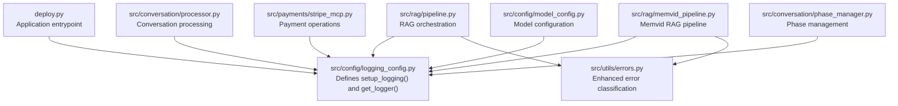
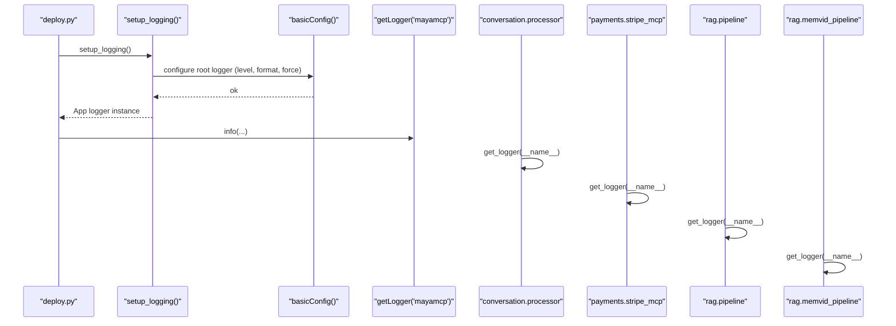
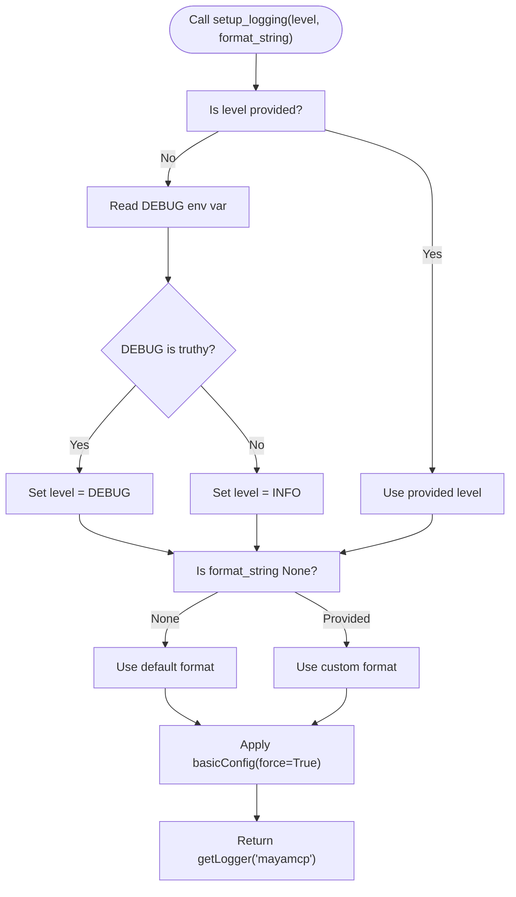
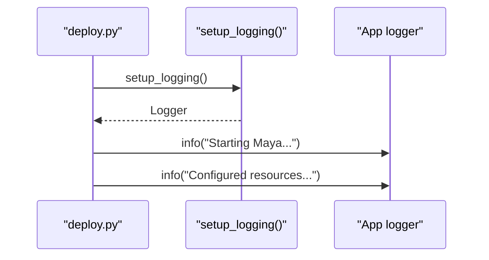
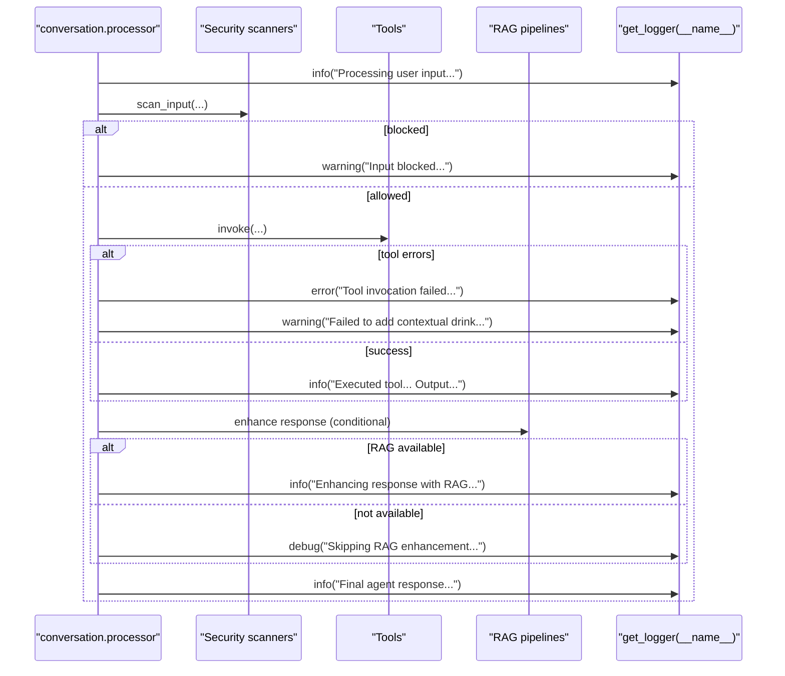
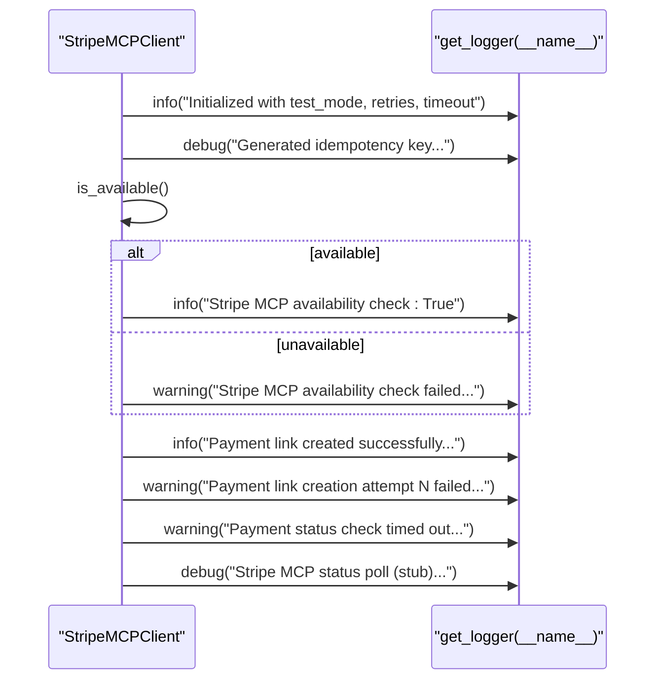
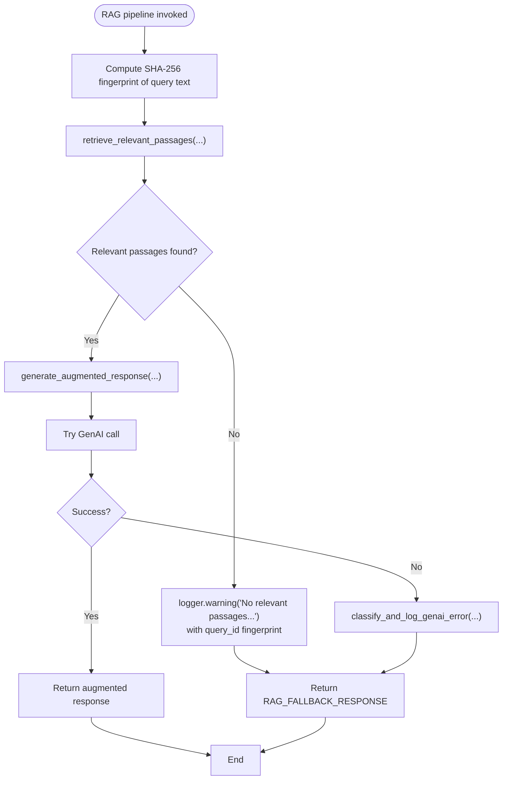
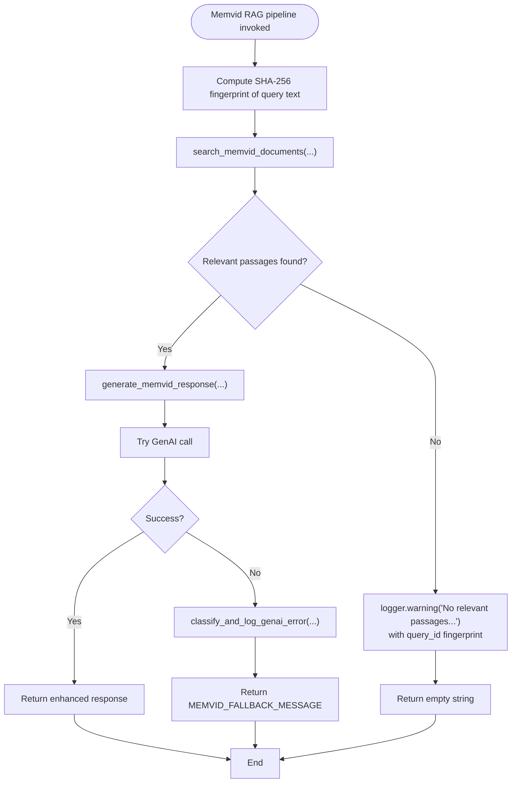
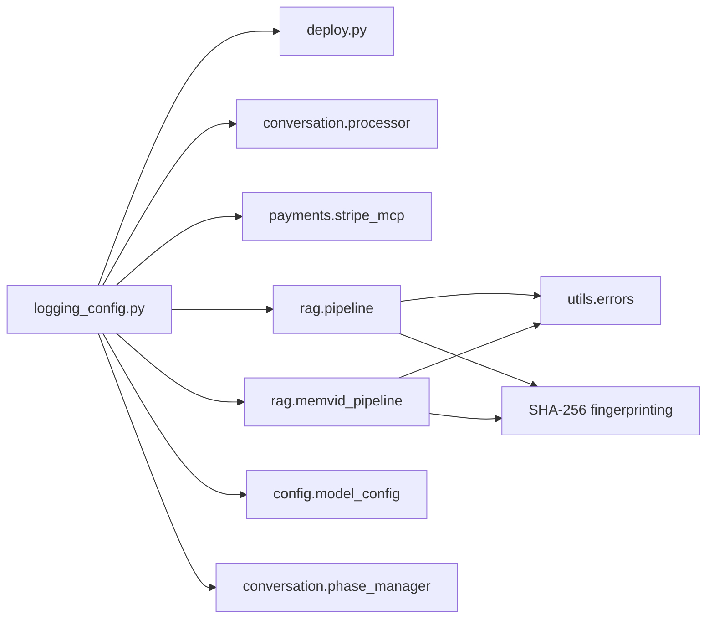

# Logging Configuration

<cite>
**Referenced Files in This Document**
- [logging_config.py](file://src/config/logging_config.py)
- [test_logging_config.py](file://tests/test_logging_config.py)
- [deploy.py](file://deploy.py)
- [processor.py](file://src/conversation/processor.py)
- [stripe_mcp.py](file://src/payments/stripe_mcp.py)
- [pipeline.py](file://src/rag/pipeline.py)
- [memvid_pipeline.py](file://src/rag/memvid_pipeline.py)
- [model_config.py](file://src/config/model_config.py)
- [phase_manager.py](file://src/conversation/phase_manager.py)
- [errors.py](file://src/utils/errors.py)
</cite>

## Update Summary
**Changes Made**
- Added enhanced privacy-focused logging with SHA-256 fingerprinting of query text in RAG pipelines
- Improved error classification and logging across RAG pipelines with standardized fallback response handling
- Enhanced error classification utility with better regex patterns for authentication, rate limit, and timeout detection
- Updated RAG pipeline error handling to use consistent fallback responses

## Table of Contents
1. [Introduction](#introduction)
2. [Project Structure](#project-structure)
3. [Core Components](#core-components)
4. [Architecture Overview](#architecture-overview)
5. [Detailed Component Analysis](#detailed-component-analysis)
6. [Privacy-Focused Logging Enhancements](#privacy-focused-logging-enhancements)
7. [Enhanced Error Classification System](#enhanced-error-classification-system)
8. [Standardized Fallback Response Handling](#standardized-fallback-response-handling)
9. [Dependency Analysis](#dependency-analysis)
10. [Performance Considerations](#performance-considerations)
11. [Troubleshooting Guide](#troubleshooting-guide)
12. [Conclusion](#conclusion)

## Introduction
This document explains MayaMCP's logging configuration system with a focus on structured logging and debug output management. It covers the logging configuration factory that creates properly configured logger instances, the log level hierarchy, output destinations, and formatting options. The system has been enhanced with privacy-focused logging through SHA-256 fingerprinting, improved error classification across RAG pipelines, and standardized fallback response handling. It details how logging integrates with application components such as conversation processing, payment handling, and RAG operations, and provides practical guidance for development versus production environments, custom formatting, debugging techniques, and best practices.

## Project Structure
MayaMCP centralizes logging configuration in a dedicated module and exposes a simple factory to bootstrap logging and a helper to obtain named loggers. The system is wired into the application entrypoints and key modules to ensure consistent logging behavior across the stack. Recent enhancements include privacy-focused logging with SHA-256 fingerprinting and improved error classification utilities.



**Diagram sources**
- [logging_config.py](file://src/config/logging_config.py#L1-L51)
- [deploy.py](file://deploy.py#L67-L77)
- [processor.py](file://src/conversation/processor.py#L24-L31)
- [stripe_mcp.py](file://src/payments/stripe_mcp.py#L21-L23)
- [pipeline.py](file://src/rag/pipeline.py#L6-L10)
- [memvid_pipeline.py](file://src/rag/memvid_pipeline.py#L6-L12)
- [model_config.py](file://src/config/model_config.py#L5-L8)
- [phase_manager.py](file://src/conversation/phase_manager.py#L6-L8)
- [errors.py](file://src/utils/errors.py#L11-L38)

**Section sources**
- [logging_config.py](file://src/config/logging_config.py#L1-L51)
- [deploy.py](file://deploy.py#L67-L77)

## Core Components
- Logging configuration factory
  - setup_logging(level=None, format_string=None) returns a configured logger instance for the main application namespace.
  - Determines log level from an environment variable when not explicitly provided.
  - Applies a default or custom format string and forces configuration replacement.
- Logger accessor
  - get_logger(name) returns a namespaced logger for any module.

Key behaviors validated by unit tests:
- Default level is INFO unless the DEBUG environment variable is set to a truthy value.
- Explicit level parameter overrides environment-derived level.
- Default format string includes timestamp, logger name, level, and message.
- Custom format strings are supported; empty or None values are handled predictably.
- get_logger returns the expected logger instance for given names.

**Section sources**
- [logging_config.py](file://src/config/logging_config.py#L7-L39)
- [test_logging_config.py](file://tests/test_logging_config.py#L24-L194)
- [test_logging_config.py](file://tests/test_logging_config.py#L210-L258)

## Architecture Overview
The logging system is bootstrapped at application startup and used pervasively across modules. The entrypoint configures logging, and modules obtain loggers by name to emit structured logs aligned with the configured format and level. Recent enhancements include privacy-focused logging with SHA-256 fingerprinting and improved error classification utilities.



**Diagram sources**
- [deploy.py](file://deploy.py#L67-L77)
- [logging_config.py](file://src/config/logging_config.py#L7-L39)
- [processor.py](file://src/conversation/processor.py#L24-L31)
- [stripe_mcp.py](file://src/payments/stripe_mcp.py#L21-L23)
- [pipeline.py](file://src/rag/pipeline.py#L6-L10)
- [memvid_pipeline.py](file://src/rag/memvid_pipeline.py#L6-L12)

## Detailed Component Analysis

### Logging Configuration Factory
- Purpose: Centralized, environment-aware logging setup and logger retrieval.
- Behavior highlights:
  - Level resolution: Uses environment variable DEBUG to select DEBUG or INFO when level is not explicitly provided.
  - Format customization: Accepts a custom format string; defaults to a readable, structured pattern.
  - Force override: Ensures any prior configuration is superseded to avoid conflicts.
  - Logger naming: Returns a logger named for the main application module.



**Diagram sources**
- [logging_config.py](file://src/config/logging_config.py#L7-L39)

**Section sources**
- [logging_config.py](file://src/config/logging_config.py#L7-L39)
- [test_logging_config.py](file://tests/test_logging_config.py#L24-L194)

### Application Entry Point Integration
- The application entrypoint imports the logging factory, invokes it to configure logging, and immediately emits informational logs for observability.
- Environment variables influence resource configuration and logging verbosity.



**Diagram sources**
- [deploy.py](file://deploy.py#L67-L81)

**Section sources**
- [deploy.py](file://deploy.py#L67-L81)

### Conversation Processing Module
- Uses a module-scoped logger to record events such as input validation, security scanning outcomes, tool invocations, and RAG enhancements.
- Emits structured logs at INFO, WARNING, and ERROR levels to track behavior and diagnose issues.
- Implements enhanced RAG fallback handling with improved error logging.



**Diagram sources**
- [processor.py](file://src/conversation/processor.py#L99-L452)

**Section sources**
- [processor.py](file://src/conversation/processor.py#L99-L452)

### Payment Handling Module
- Uses a module-scoped logger to record client initialization, idempotency key generation, availability checks, payment link creation attempts, and status polling.
- Logs at INFO, WARNING, and DEBUG levels to reflect operational state and transient failures.



**Diagram sources**
- [stripe_mcp.py](file://src/payments/stripe_mcp.py#L104-L474)

**Section sources**
- [stripe_mcp.py](file://src/payments/stripe_mcp.py#L104-L474)

### RAG Pipeline Module
- Uses a module-scoped logger to report retrieval outcomes, augmentation attempts, and error handling.
- Integrates a shared error classification utility to normalize logging of GenAI-related exceptions.
- Implements privacy-focused logging with SHA-256 fingerprinting of query text.
- Provides standardized fallback response handling for consistent error recovery.



**Diagram sources**
- [pipeline.py](file://src/rag/pipeline.py#L80-L104)
- [errors.py](file://src/utils/errors.py#L11-L38)

**Section sources**
- [pipeline.py](file://src/rag/pipeline.py#L80-L104)
- [errors.py](file://src/utils/errors.py#L11-L38)

### Memvid Pipeline Module
- Uses a module-scoped logger to report video memory retrieval outcomes and enhanced response generation.
- Implements privacy-focused logging with SHA-256 fingerprinting of query text.
- Provides standardized fallback response handling for consistent error recovery.



**Diagram sources**
- [memvid_pipeline.py](file://src/rag/memvid_pipeline.py#L73-L124)
- [errors.py](file://src/utils/errors.py#L11-L38)

**Section sources**
- [memvid_pipeline.py](file://src/rag/memvid_pipeline.py#L73-L124)
- [errors.py](file://src/utils/errors.py#L11-L38)

### Model Configuration Module
- Uses a module-scoped logger to warn on invalid environment-derived configuration values, ensuring visibility into misconfiguration without crashing.

**Section sources**
- [model_config.py](file://src/config/model_config.py#L16-L28)

### Phase Manager Module
- Uses a module-scoped logger to record phase transitions and resets, aiding debugging of conversation state management.

**Section sources**
- [phase_manager.py](file://src/conversation/phase_manager.py#L64-L91)

## Privacy-Focused Logging Enhancements

### SHA-256 Fingerprinting Implementation
Both RAG pipelines now implement privacy-focused logging by computing SHA-256 fingerprints of query text to avoid logging sensitive information directly. This enhancement ensures that user queries are never logged in plaintext while maintaining diagnostic capabilities.

**Updated** Enhanced privacy protection through SHA-256 fingerprinting of query text in RAG pipelines

#### RAG Pipeline Privacy Enhancement
The standard RAG pipeline computes a SHA-256 hash of the query text and uses only the first 12 characters of the hexadecimal digest for logging purposes:

```python
# Compute a non-reversible fingerprint to avoid logging PII
query_fingerprint = hashlib.sha256(
    query_text.encode()
).hexdigest()[:12]
logger.warning(
    "No relevant passages found for query_id: %s",
    query_fingerprint
)
```

#### Memvid Pipeline Privacy Enhancement
The Memvid pipeline implements identical privacy protection for video memory-based queries:

```python
# Compute a non-reversible fingerprint to avoid logging PII
query_fingerprint = hashlib.sha256(
    query_text.encode()
).hexdigest()[:12]
logger.warning(
    "No relevant passages found for query_id: %s",
    query_fingerprint
)
```

**Section sources**
- [pipeline.py](file://src/rag/pipeline.py#L101-L109)
- [memvid_pipeline.py](file://src/rag/memvid_pipeline.py#L104-L112)

## Enhanced Error Classification System

### Improved Error Classification Utility
The error classification utility has been enhanced with better regex patterns and fallback mechanisms to provide more accurate error categorization and logging across RAG pipelines.

**Updated** Enhanced error classification with improved regex patterns and fallback mechanisms

#### Error Classification Categories
The enhanced system now provides more precise error categorization:

- **Rate Limit Errors**: Detects "429" status codes and "rate limit" phrases (case-insensitive)
- **Authentication Errors**: Identifies "401" and "403" status codes plus authentication/authorization keywords
- **Timeout Errors**: Recognizes "timeout" occurrences in error messages
- **Generic Errors**: Falls back to standard error logging for unclassified exceptions

#### Fallback Error Handling
The system includes robust fallback mechanisms to ensure logging continues even if the primary classification fails:

```python
def classify_and_log_genai_error(e: Exception, logger: _LoggerLike, context: str) -> None:
    """Classify common GenAI errors by message and log with consistent format.
    Replicates existing checks across the codebase for compatibility.
    """
    msg = str(e)
    try:
        if ("429" in msg) or re.search(r"\brate\s*limit\b", msg, re.IGNORECASE):
            logger.warning(f"Rate limit {context}: {e}")
        elif ("401" in msg) or ("403" in msg) or re.search(r"\b(auth|authentication|authorization)\b", msg, re.IGNORECASE):
            logger.error(f"Authentication error {context}: {e}")
        elif "timeout" in msg.lower():
            logger.warning(f"Timeout {context}: {e}")
        else:
            logger.error(f"Error {context}: {e}")
    except Exception:
        # Fallback to generic log in case of unexpected logging issues
        try:
            logger.error(f"Error {context}: {e}")
        except Exception:
            # Last resort: ignore logging failure
            pass
```

**Section sources**
- [errors.py](file://src/utils/errors.py#L11-L38)

## Standardized Fallback Response Handling

### Consistent Fallback Responses
Both RAG pipelines now implement standardized fallback response handling to ensure consistent error recovery and user experience across different failure scenarios.

**Updated** Standardized fallback response handling across RAG pipelines

#### RAG Pipeline Fallback Response
The standard RAG pipeline defines a consistent fallback message for error scenarios:

```python
RAG_FALLBACK_RESPONSE = (
    "I'm Maya, your bartender at MOK 5-ha. I'm not sure how to "
    "respond to that. Can I get you something from the menu?"
)
```

#### Memvid Pipeline Fallback Response
The Memvid pipeline provides a specialized fallback message for video memory-related failures:

```python
MEMVID_FALLBACK_MESSAGE = (
    "I'm Maya, your bartender at MOK 5-ha. My video memory seems to be "
    "having a moment. Can I get you something from the menu?"
)
```

#### Fallback Response Usage
Both pipelines use their respective fallback responses consistently:

```python
# Fallback response
return RAG_FALLBACK_RESPONSE

# Fallback response  
return MEMVID_FALLBACK_MESSAGE
```

**Section sources**
- [pipeline.py](file://src/rag/pipeline.py#L15-L19)
- [memvid_pipeline.py](file://src/rag/memvid_pipeline.py#L15-L19)

## Dependency Analysis
- Centralization: All modules depend on the logging configuration module for logger instances, ensuring consistent formatting and level selection.
- Entry point wiring: The application entrypoint depends on the logging factory to establish configuration before initializing other subsystems.
- Error handling integration: The RAG pipeline leverages a shared error classification utility to produce normalized logs for GenAI errors.
- Privacy enhancement integration: Both RAG pipelines integrate SHA-256 fingerprinting for privacy protection.



**Diagram sources**
- [logging_config.py](file://src/config/logging_config.py#L1-L51)
- [deploy.py](file://deploy.py#L67-L77)
- [processor.py](file://src/conversation/processor.py#L24-L31)
- [stripe_mcp.py](file://src/payments/stripe_mcp.py#L21-L23)
- [pipeline.py](file://src/rag/pipeline.py#L6-L10)
- [memvid_pipeline.py](file://src/rag/memvid_pipeline.py#L6-L12)
- [model_config.py](file://src/config/model_config.py#L5-L8)
- [phase_manager.py](file://src/conversation/phase_manager.py#L6-L8)
- [errors.py](file://src/utils/errors.py#L11-L38)

**Section sources**
- [logging_config.py](file://src/config/logging_config.py#L1-L51)
- [deploy.py](file://deploy.py#L67-L77)
- [processor.py](file://src/conversation/processor.py#L24-L31)
- [stripe_mcp.py](file://src/payments/stripe_mcp.py#L21-L23)
- [pipeline.py](file://src/rag/pipeline.py#L6-L10)
- [memvid_pipeline.py](file://src/rag/memvid_pipeline.py#L6-L12)
- [model_config.py](file://src/config/model_config.py#L5-L8)
- [phase_manager.py](file://src/conversation/phase_manager.py#L6-L8)
- [errors.py](file://src/utils/errors.py#L11-L38)

## Performance Considerations
- Logging overhead: Structured logs with timestamps and names are lightweight but can increase I/O under high throughput. Prefer INFO/WARNING for steady-state operations; use DEBUG judiciously in development.
- Level selection: DEBUG increases verbosity and may impact performance; INFO is recommended for production unless deeper diagnostics are required.
- Formatting cost: Custom format strings add minimal overhead; keep them concise and informative.
- Asynchronous operations: Payment operations use asynchronous polling; logging within these paths should remain non-blocking and avoid expensive computations in hot paths.
- Privacy computation: SHA-256 fingerprinting adds minimal computational overhead compared to the benefits of privacy protection.
- Error classification: Regex-based error classification has negligible performance impact and provides significant operational benefits.

## Troubleshooting Guide
- Environment-driven levels
  - Set DEBUG=true to switch to DEBUG level across the application.
  - Unset or falsy DEBUG to revert to INFO level.
- Verifying configuration
  - Confirm that setup_logging is called at startup and that the returned logger is used consistently.
  - Use unit tests as a reference for expected behavior under various environment conditions.
- Debugging techniques
  - Use module-scoped loggers to isolate noisy subsystems.
  - For RAG and payment operations, leverage the provided log levels to trace control flow and error paths.
  - Utilize the enhanced error classification system to quickly identify error categories.
  - Monitor privacy-focused logging by checking for query_id fingerprints instead of full query text.
- Common issues
  - Empty or invalid level strings cause attribute errors; ensure level values are valid.
  - Custom format strings can be empty; confirm desired output format.
  - If logs appear duplicated or inconsistent, ensure force=True is taking effect and no other configuration is applied.
  - Privacy violations: Ensure SHA-256 fingerprinting is working correctly by verifying that query text does not appear in logs.
  - Error classification failures: Check regex patterns and fallback mechanisms if error categorization seems incorrect.

**Section sources**
- [test_logging_config.py](file://tests/test_logging_config.py#L169-L180)
- [test_logging_config.py](file://tests/test_logging_config.py#L196-L208)
- [errors.py](file://src/utils/errors.py#L11-L38)

## Conclusion
MayaMCP's logging configuration system provides a simple, environment-aware mechanism to bootstrap structured logging across the application. The recent enhancements significantly improve privacy protection through SHA-256 fingerprinting, provide more accurate error classification across RAG pipelines, and ensure consistent fallback response handling. By centralizing configuration and exposing a straightforward factory and logger accessor, it enables consistent formatting, predictable level selection, and easy integration with modules handling conversation processing, payments, and RAG. The enhanced privacy-focused logging protects user data while maintaining diagnostic capabilities, and the improved error classification system provides clearer operational insights. For development, enable DEBUG for richer diagnostics; for production, rely on INFO with targeted DEBUG statements for specific subsystems. Combined with the shared error classification utility and standardized fallback responses, this approach yields clear, actionable logs that support reliable operations and efficient troubleshooting while maintaining user privacy.