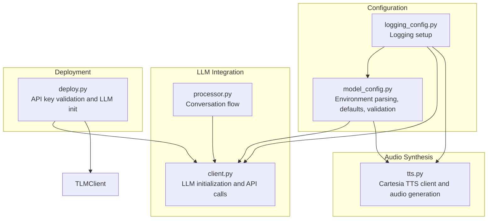
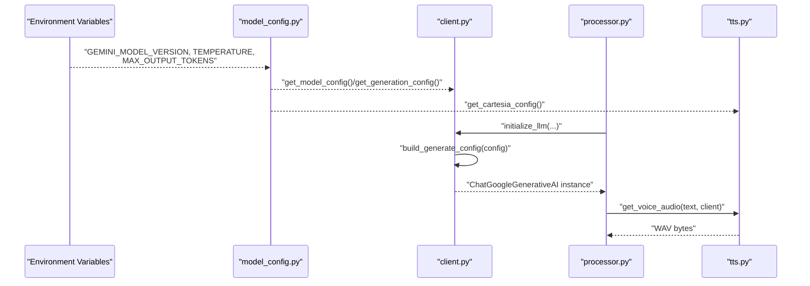
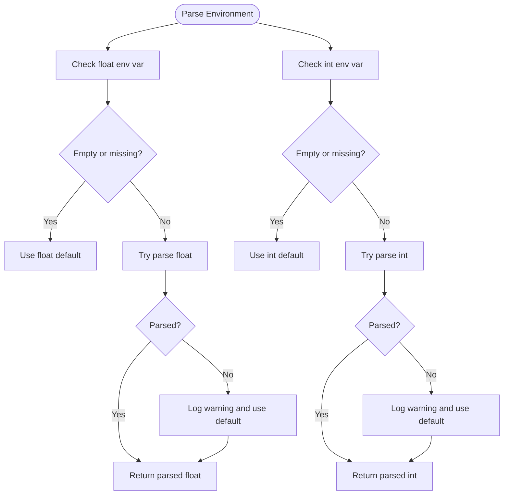
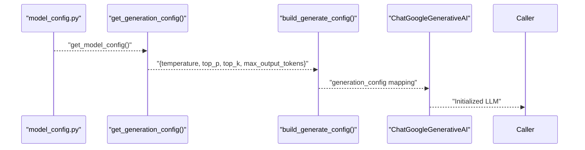
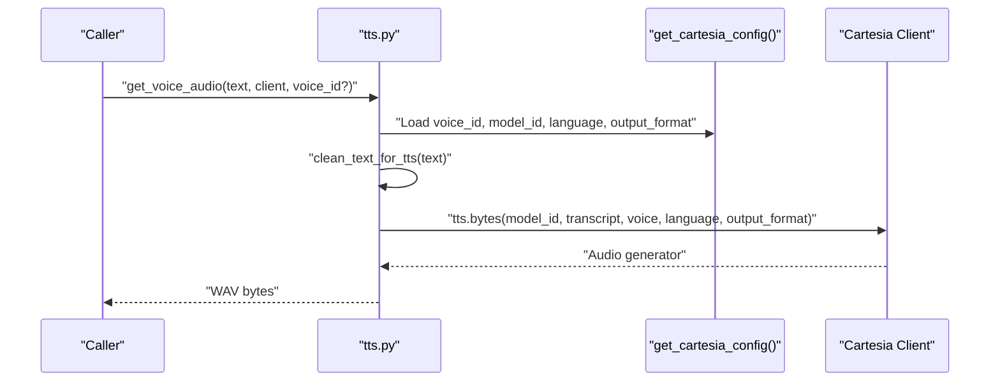
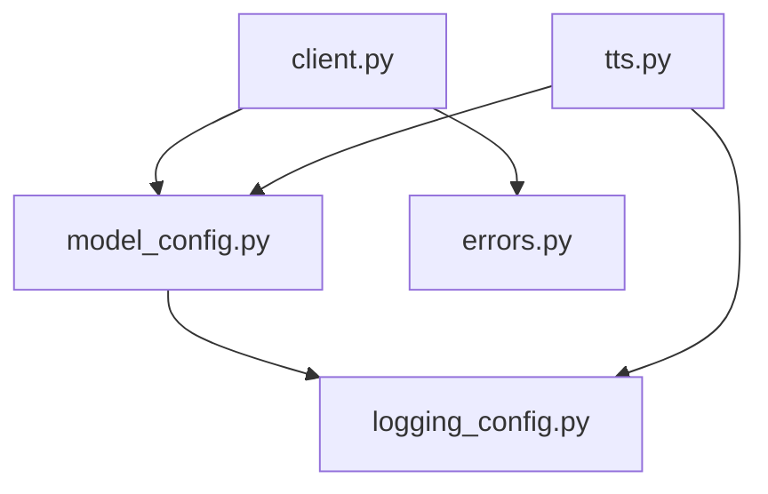

# Model Configuration

<cite>
**Referenced Files in This Document**
- [model_config.py](file://src/config/model_config.py)
- [logging_config.py](file://src/config/logging_config.py)
- [client.py](file://src/llm/client.py)
- [tts.py](file://src/voice/tts.py)
- [.env.example](file://.env.example)
- [processor.py](file://src/conversation/processor.py)
- [deploy.py](file://deploy.py)
- [errors.py](file://src/utils/errors.py)
- [test_model_config.py](file://tests/test_model_config.py)
- [test_tts.py](file://tests/test_tts.py)
- [pipeline.py](file://src/rag/pipeline.py)
- [memvid_pipeline.py](file://src/rag/memvid_pipeline.py)
</cite>

## Update Summary
**Changes Made**
- Updated default Google Gemini model from `gemini-2.5-flash-lite` to `gemini-3.0-flash` across configuration system
- Updated environment variable default in .env.example to reflect new default model
- Updated RAG pipeline defaults to use `gemini-3.0-flash`
- Enhanced model validation documentation to reflect current supported models

## Table of Contents
1. [Introduction](#introduction)
2. [Project Structure](#project-structure)
3. [Core Components](#core-components)
4. [Architecture Overview](#architecture-overview)
5. [Detailed Component Analysis](#detailed-component-analysis)
6. [Dependency Analysis](#dependency-analysis)
7. [Performance Considerations](#performance-considerations)
8. [Troubleshooting Guide](#troubleshooting-guide)
9. [Conclusion](#conclusion)

## Introduction
This document explains MayaMCP's model configuration system with a focus on Large Language Model (LLM) parameter tuning and audio synthesis settings. It covers:
- Environment-based configuration parsing for model_version, temperature, max_output_tokens, and other Gemini parameters
- Type-safe parsing functions for floats and integers with default fallbacks
- Generation configuration mapping model parameters to LLM call settings
- Cartesia Text-to-Speech configuration including voice selection, model IDs, language, and audio output formats
- Practical examples for optimal parameter combinations, performance tuning, and troubleshooting configuration conflicts
- The known model validation system and supported Gemini model identifiers

**Updated** The default Google Gemini model has been upgraded from `gemini-2.5-flash-lite` to `gemini-3.0-flash` to leverage improved performance and capabilities.

## Project Structure
The model configuration system spans several modules:
- Configuration parsing and validation
- LLM client integration
- Audio synthesis via Cartesia
- Tests validating behavior and error handling

**Diagram sources**
- [model_config.py](file://src/config/model_config.py#L1-L103)
- [logging_config.py](file://src/config/logging_config.py#L1-L51)
- [client.py](file://src/llm/client.py#L1-L211)
- [tts.py](file://src/voice/tts.py#L1-L200)
- [processor.py](file://src/conversation/processor.py#L1-L200)
- [deploy.py](file://deploy.py#L140-L165)

**Section sources**
- [model_config.py](file://src/config/model_config.py#L1-L103)
- [client.py](file://src/llm/client.py#L1-L211)
- [tts.py](file://src/voice/tts.py#L1-L200)
- [.env.example](file://.env.example#L1-L33)

## Core Components
- Environment-based configuration parsing:
  - Float and integer parsing with defaults and robust error handling
  - Centralized model configuration with Gemini parameters
- Generation configuration:
  - Mapping of model parameters to LLM call settings
- Cartesia TTS configuration:
  - Voice selection, model IDs, language, and audio output format
- Validation and known models:
  - Known Gemini model identifiers and a permissive validity check

Key responsibilities:
- Parse environment variables safely and warn on invalid values
- Provide consistent configuration for LLM and TTS subsystems
- Support flexible tuning for creativity vs. consistency trade-offs

**Updated** Default model configuration now uses `gemini-3.0-flash` as the baseline for improved performance and capabilities.

**Section sources**
- [model_config.py](file://src/config/model_config.py#L10-L103)
- [client.py](file://src/llm/client.py#L64-L88)
- [tts.py](file://src/voice/tts.py#L164-L195)
- [.env.example](file://.env.example#L13-L21)

## Architecture Overview
The configuration system integrates with LLM and TTS clients to ensure consistent parameter usage across the application.

**Diagram sources**
- [model_config.py](file://src/config/model_config.py#L31-L77)
- [client.py](file://src/llm/client.py#L79-L129)
- [tts.py](file://src/voice/tts.py#L140-L195)
- [processor.py](file://src/conversation/processor.py#L73-L200)

## Detailed Component Analysis

### Environment-Based Configuration Parsing
MayaMCP defines type-safe parsers for float and integer environment variables with default fallbacks and explicit logging on invalid values. These parsers ensure robustness when environment variables are missing, empty, or malformed.

- Float parser:
  - Reads the named environment variable
  - Returns default if missing or empty
  - Attempts conversion to float; logs a warning and returns default on failure
- Integer parser:
  - Same behavior for integers
- Central model configuration:
  - model_version: default Gemini model identifier (`gemini-3.0-flash`)
  - temperature: default creativity parameter
  - max_output_tokens: default token budget
  - top_p and top_k: fixed defaults for sampling behavior

**Diagram sources**
- [model_config.py](file://src/config/model_config.py#L10-L28)

**Section sources**
- [model_config.py](file://src/config/model_config.py#L10-L44)
- [test_model_config.py](file://tests/test_model_config.py#L22-L134)

### Generation Configuration Mapping
The generation configuration maps model parameters to LLM call settings. It derives from the central model configuration and excludes model_version, focusing on generation parameters.

- Derivation:
  - Uses temperature, top_p, top_k, and max_output_tokens from model configuration
- LLM client integration:
  - The LLM client builds a generation_config dictionary for the underlying SDK
  - LangChain wrapper receives the same parameters for ChatGoogleGenerativeAI

**Diagram sources**
- [model_config.py](file://src/config/model_config.py#L46-L59)
- [client.py](file://src/llm/client.py#L64-L88)
- [client.py](file://src/llm/client.py#L91-L129)

**Section sources**
- [model_config.py](file://src/config/model_config.py#L46-L59)
- [client.py](file://src/llm/client.py#L64-L88)
- [client.py](file://src/llm/client.py#L91-L129)

### Cartesia TTS Configuration
Cartesia TTS configuration encapsulates voice selection, model IDs, language settings, and audio output formats. The TTS module retrieves this configuration and synthesizes speech accordingly.

- Configuration structure:
  - voice_id: default voice identifier
  - model_id: default TTS model
  - language: default language code
  - output_format: container, sample_rate, encoding
- Runtime behavior:
  - Cleans text for TTS pronunciation
  - Initializes Cartesia client
  - Calls TTS API with voice configuration and output format
  - Aggregates audio chunks into WAV bytes

**Diagram sources**
- [tts.py](file://src/voice/tts.py#L140-L195)
- [model_config.py](file://src/config/model_config.py#L61-L77)

**Section sources**
- [model_config.py](file://src/config/model_config.py#L61-L77)
- [tts.py](file://src/voice/tts.py#L140-L195)
- [test_tts.py](file://tests/test_tts.py#L269-L503)

### Known Model Validation and Supported Identifiers
MayaMCP maintains a known list of valid Gemini model identifiers and provides a permissive validator for warnings. The validator:
- Strips whitespace from inputs
- Compares against the known list
- Returns False gracefully for invalid or non-string inputs

**Updated** The supported Gemini models now include `gemini-3.0-flash` as the primary default, along with legacy models for backward compatibility.

**Diagram sources**
- [model_config.py](file://src/config/model_config.py#L89-L103)

**Section sources**
- [model_config.py](file://src/config/model_config.py#L79-L103)
- [test_model_config.py](file://tests/test_model_config.py#L332-L406)

## Dependency Analysis
The configuration system interacts with logging, LLM clients, and TTS modules. Dependencies are intentionally decoupled to enable testing and maintainability.

**Diagram sources**
- [model_config.py](file://src/config/model_config.py#L1-L103)
- [logging_config.py](file://src/config/logging_config.py#L1-L51)
- [client.py](file://src/llm/client.py#L1-L211)
- [tts.py](file://src/voice/tts.py#L1-L200)
- [errors.py](file://src/utils/errors.py#L1-L39)

**Section sources**
- [model_config.py](file://src/config/model_config.py#L1-L103)
- [client.py](file://src/llm/client.py#L1-L211)
- [tts.py](file://src/voice/tts.py#L1-L200)
- [errors.py](file://src/utils/errors.py#L1-L39)

## Performance Considerations
- Temperature controls creativity vs. consistency:
  - Lower values (~0.3–0.5): more deterministic, concise answers
  - Higher values (~0.7–0.9): more creative, potentially less coherent
- Token budget (max_output_tokens):
  - Increase for complex tasks; reduce to constrain latency and cost
- Sampling parameters:
  - top_p and top_k are fixed in the current configuration; adjust model_version for broader sampling behavior if needed
- TTS audio size:
  - Larger sample rates and encodings increase bandwidth and storage needs
- Error handling and retries:
  - LLM and TTS include retry logic for transient network errors
  - Logging helps diagnose performance bottlenecks and failures

**Updated** The new `gemini-3.0-flash` default model provides improved performance characteristics compared to the previous `gemini-2.5-flash-lite`, offering better balance between speed and quality for typical conversational tasks.

## Troubleshooting Guide
Common configuration conflicts and resolutions:
- Invalid environment values:
  - Symptoms: Unexpected defaults or warnings in logs
  - Resolution: Fix environment variables; ensure numeric values for TEMPERATURE and MAX_OUTPUT_TOKENS
- Empty or missing model_version:
  - Behavior: Empty string accepted; initialize_llm will use the provided value
  - Resolution: Set a supported Gemini model identifier
- Unsupported model identifiers:
  - Behavior: Validation returns False; app continues with warning
  - Resolution: Use a known model from the supported list
- TTS initialization failures:
  - Symptoms: RuntimeError indicating client initialization failure
  - Resolution: Verify CARTESIA_API_KEY and network connectivity
- Empty audio responses:
  - Symptoms: Warning about empty audio data
  - Resolution: Inspect transcript cleaning and retry logic

**Updated** Default model change considerations:
- If you experience unexpected behavior after deployment, verify that your environment variables override the new default
- Legacy configurations using `.env.example` may still specify `gemini-2.5-flash-lite`; consider updating to align with the new default
- RAG pipelines automatically use the new default model unless overridden

Operational checks:
- Environment variables:
  - Confirm presence of GEMINI_API_KEY and CARTESIA_API_KEY
  - Validate model_version against known identifiers
- Logging:
  - Enable DEBUG mode to capture detailed logs for diagnostics

**Section sources**
- [model_config.py](file://src/config/model_config.py#L10-L28)
- [model_config.py](file://src/config/model_config.py#L89-L103)
- [tts.py](file://src/voice/tts.py#L122-L132)
- [tts.py](file://src/voice/tts.py#L197-L200)
- [.env.example](file://.env.example#L1-L33)
- [deploy.py](file://deploy.py#L140-L165)

## Conclusion
MayaMCP's model configuration system provides a robust, environment-driven approach to tuning LLM behavior and audio synthesis. Type-safe parsing ensures resilient defaults, while centralized configuration enables consistent parameter usage across LLM and TTS components. The upgrade to `gemini-3.0-flash` as the default model enhances performance and capabilities, while the known model validation system and comprehensive logging support optimization for performance and reliability across diverse deployment scenarios.

**Updated** The default Google Gemini model upgrade to `gemini-3.0-flash` represents a strategic improvement in the configuration system, providing better performance characteristics while maintaining backward compatibility through the validation system and environment variable overrides.