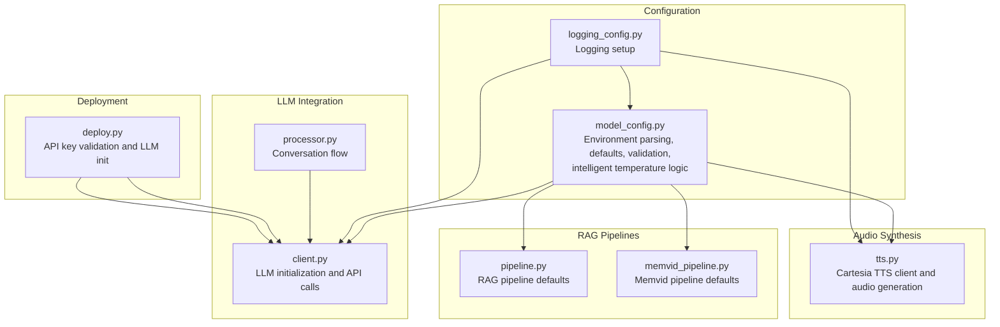
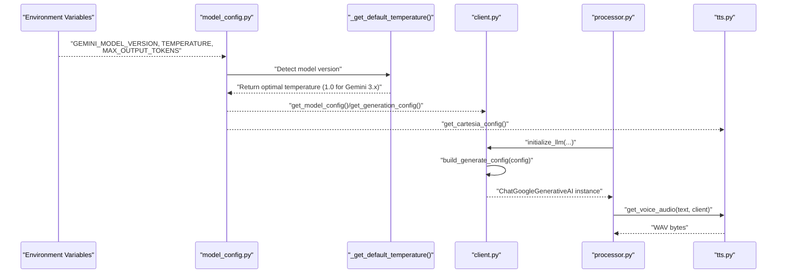
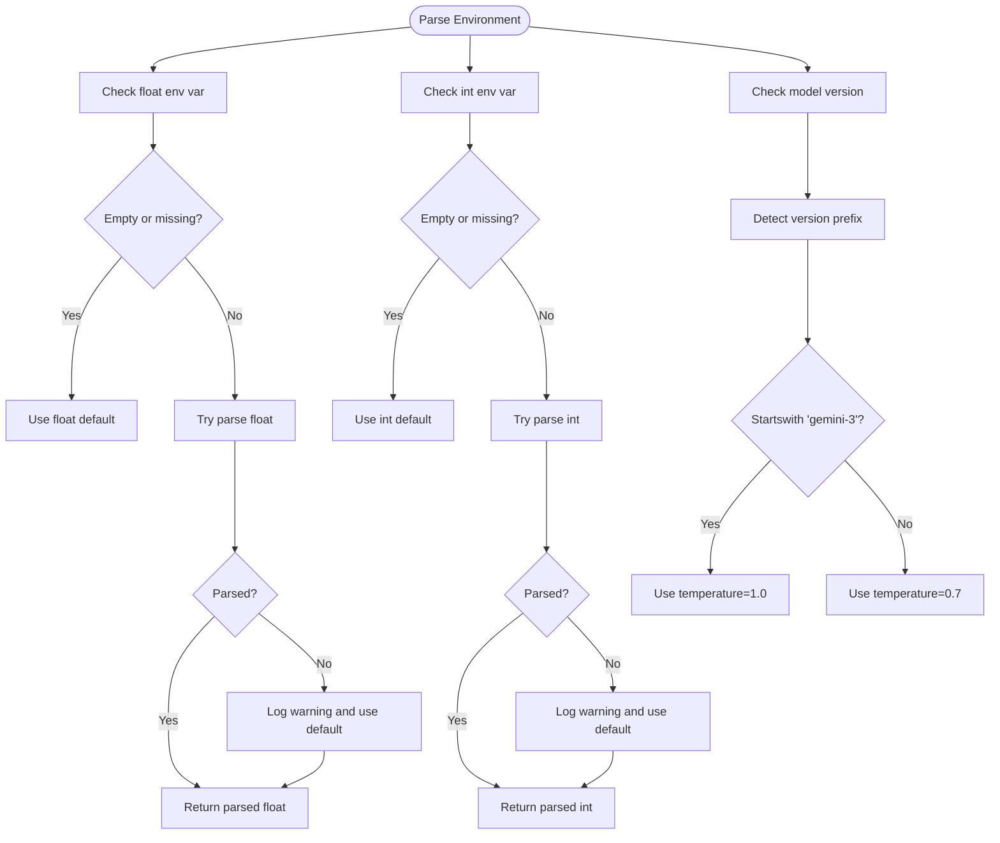
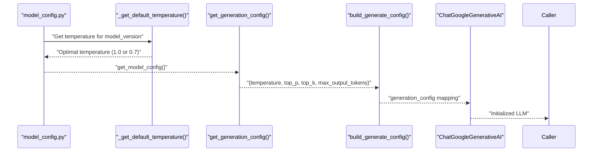
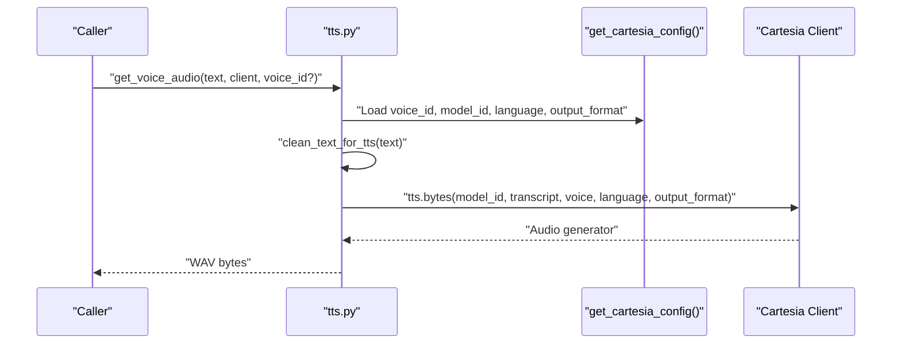
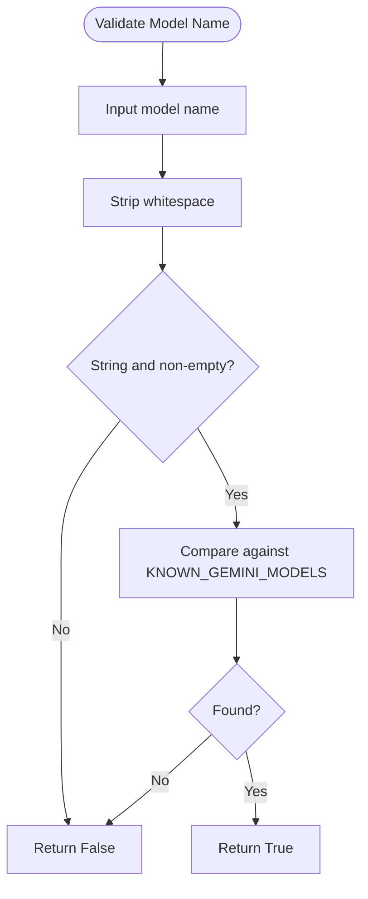
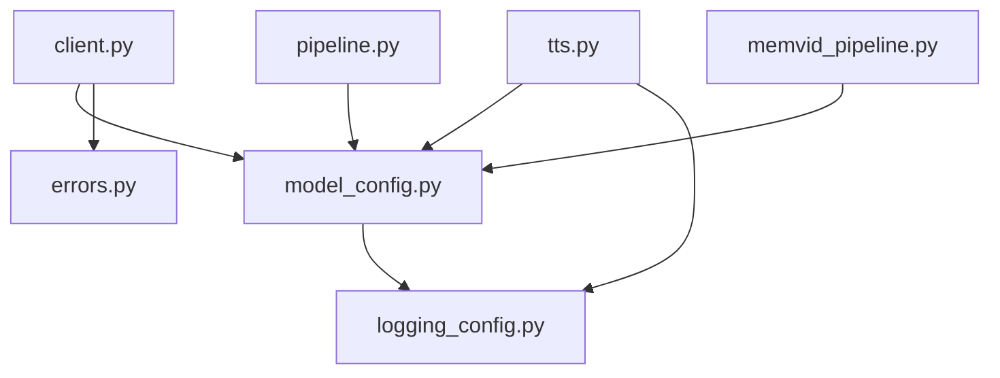

# Model Configuration

<cite>
**Referenced Files in This Document**
- [model_config.py](file://src/config/model_config.py)
- [logging_config.py](file://src/config/logging_config.py)
- [client.py](file://src/llm/client.py)
- [tts.py](file://src/voice/tts.py)
- [.env.example](file://.env.example)
- [processor.py](file://src/conversation/processor.py)
- [deploy.py](file://deploy.py)
- [errors.py](file://src/utils/errors.py)
- [test_model_config.py](file://tests/test_model_config.py)
- [test_tts.py](file://tests/test_tts.py)
- [pipeline.py](file://src/rag/pipeline.py)
- [memvid_pipeline.py](file://src/rag/memvid_pipeline.py)
</cite>

## Update Summary
**Changes Made**
- Updated default Google Gemini model from `gemini-3.0-flash` to `gemini-3-flash-preview` across configuration system
- Added intelligent temperature defaulting logic based on model version (1.0 for Gemini 3.x, 0.7 for older models)
- Expanded known Gemini model list with new Gemini 3 variants including preview models
- Updated RAG pipeline defaults to use `gemini-3-flash-preview`
- Updated environment variable default in .env.example to reflect new default model

## Table of Contents
1. [Introduction](#introduction)
2. [Project Structure](#project-structure)
3. [Core Components](#core-components)
4. [Architecture Overview](#architecture-overview)
5. [Detailed Component Analysis](#detailed-component-analysis)
6. [Dependency Analysis](#dependency-analysis)
7. [Performance Considerations](#performance-considerations)
8. [Troubleshooting Guide](#troubleshooting-guide)
9. [Conclusion](#conclusion)

## Introduction
This document explains MayaMCP's model configuration system with a focus on Large Language Model (LLM) parameter tuning and audio synthesis settings. It covers:
- Environment-based configuration parsing for model_version, temperature, max_output_tokens, and other Gemini parameters
- Type-safe parsing functions for floats and integers with default fallbacks
- Intelligent temperature defaulting logic based on model version for optimal performance
- Generation configuration mapping model parameters to LLM call settings
- Cartesia Text-to-Speech configuration including voice selection, model IDs, language, and audio output formats
- Practical examples for optimal parameter combinations, performance tuning, and troubleshooting configuration conflicts
- The known model validation system and expanded Gemini model identifiers including new Gemini 3 variants

**Updated** The default Google Gemini model has been changed from `gemini-3.0-flash` to `gemini-3-flash-preview` to leverage the latest Gemini 3.x preview capabilities. This change includes intelligent temperature defaulting logic that automatically selects optimal temperature values based on model version.

## Project Structure
The model configuration system spans several modules:
- Configuration parsing and validation with intelligent defaults
- LLM client integration with dynamic temperature selection
- Audio synthesis via Cartesia
- Tests validating behavior and error handling
- RAG pipeline integration with updated model defaults

**Diagram sources**
- [model_config.py](file://src/config/model_config.py#L1-L127)
- [logging_config.py](file://src/config/logging_config.py#L1-L51)
- [client.py](file://src/llm/client.py#L1-L217)
- [tts.py](file://src/voice/tts.py#L1-L200)
- [pipeline.py](file://src/rag/pipeline.py#L1-L125)
- [memvid_pipeline.py](file://src/rag/memvid_pipeline.py#L1-L124)
- [processor.py](file://src/conversation/processor.py#L1-L200)
- [deploy.py](file://deploy.py#L140-L165)

**Section sources**
- [model_config.py](file://src/config/model_config.py#L1-L127)
- [client.py](file://src/llm/client.py#L1-L217)
- [tts.py](file://src/voice/tts.py#L1-L200)
- [.env.example](file://.env.example#L1-L33)

## Core Components
- Environment-based configuration parsing:
  - Float and integer parsing with defaults and robust error handling
  - Intelligent temperature defaulting based on model version detection
  - Centralized model configuration with Gemini parameters
- Generation configuration:
  - Mapping of model parameters to LLM call settings with automatic temperature optimization
- Cartesia TTS configuration:
  - Voice selection, model IDs, language, and audio output format
- Validation and known models:
  - Expanded list of valid Gemini model identifiers including new Gemini 3.x preview models
  - Permissive validation system for warnings and graceful degradation

Key responsibilities:
- Parse environment variables safely and warn on invalid values
- Provide intelligent defaults based on model capabilities
- Support flexible tuning for creativity vs. consistency trade-offs
- Ensure consistent configuration across LLM, TTS, and RAG components

**Updated** Default model configuration now uses `gemini-3-flash-preview` as the baseline for cutting-edge performance and capabilities, with intelligent temperature selection that optimizes behavior based on model generation.

**Section sources**
- [model_config.py](file://src/config/model_config.py#L10-L127)
- [client.py](file://src/llm/client.py#L64-L93)
- [tts.py](file://src/voice/tts.py#L164-L195)
- [.env.example](file://.env.example#L13-L21)

## Architecture Overview
The configuration system integrates with LLM and TTS clients to ensure consistent parameter usage across the application, with intelligent temperature optimization based on model version detection.

**Diagram sources**
- [model_config.py](file://src/config/model_config.py#L31-L64)
- [client.py](file://src/llm/client.py#L79-L129)
- [tts.py](file://src/voice/tts.py#L140-L195)
- [processor.py](file://src/conversation/processor.py#L73-L200)

## Detailed Component Analysis

### Environment-Based Configuration Parsing
MayaMCP defines type-safe parsers for float and integer environment variables with default fallbacks and explicit logging on invalid values. These parsers ensure robustness when environment variables are missing, empty, or malformed.

- Float parser:
  - Reads the named environment variable
  - Returns default if missing or empty
  - Attempts conversion to float; logs a warning and returns default on failure
- Integer parser:
  - Same behavior for integers
- Intelligent temperature defaulting:
  - New `_get_default_temperature()` function detects model version prefix
  - Returns 1.0 for Gemini 3.x models (optimized for reasoning)
  - Returns 0.7 for older Gemini 2.x and earlier models
- Central model configuration:
  - model_version: default Gemini model identifier (`gemini-3-flash-preview`)
  - temperature: intelligent default based on model version detection
  - max_output_tokens: default token budget
  - top_p and top_k: fixed defaults for sampling behavior

**Diagram sources**
- [model_config.py](file://src/config/model_config.py#L10-L44)
- [model_config.py](file://src/config/model_config.py#L31-L44)

**Section sources**
- [model_config.py](file://src/config/model_config.py#L10-L44)
- [model_config.py](file://src/config/model_config.py#L31-L44)
- [test_model_config.py](file://tests/test_model_config.py#L22-L134)

### Generation Configuration Mapping
The generation configuration maps model parameters to LLM call settings. It derives from the central model configuration and excludes model_version, focusing on generation parameters with intelligent temperature optimization.

- Derivation:
  - Uses temperature from `_get_default_temperature()` based on model version
  - Incorporates top_p, top_k, and max_output_tokens from model configuration
- LLM client integration:
  - The LLM client builds a generation_config dictionary for the underlying SDK
  - LangChain wrapper receives the same parameters for ChatGoogleGenerativeAI
  - Automatic temperature optimization ensures optimal behavior for each model generation

**Diagram sources**
- [model_config.py](file://src/config/model_config.py#L46-L79)
- [model_config.py](file://src/config/model_config.py#L31-L44)
- [client.py](file://src/llm/client.py#L64-L93)
- [client.py](file://src/llm/client.py#L96-L129)

**Section sources**
- [model_config.py](file://src/config/model_config.py#L46-L79)
- [client.py](file://src/llm/client.py#L64-L93)
- [client.py](file://src/llm/client.py#L96-L129)

### Cartesia TTS Configuration
Cartesia TTS configuration encapsulates voice selection, model IDs, language settings, and audio output formats. The TTS module retrieves this configuration and synthesizes speech accordingly.

- Configuration structure:
  - voice_id: default voice identifier
  - model_id: default TTS model
  - language: default language code
  - output_format: container, sample_rate, encoding
- Runtime behavior:
  - Cleans text for TTS pronunciation
  - Initializes Cartesia client
  - Calls TTS API with voice configuration and output format
  - Aggregates audio chunks into WAV bytes

**Diagram sources**
- [tts.py](file://src/voice/tts.py#L140-L195)
- [model_config.py](file://src/config/model_config.py#L81-L97)

**Section sources**
- [model_config.py](file://src/config/model_config.py#L81-L97)
- [tts.py](file://src/voice/tts.py#L140-L195)
- [test_tts.py](file://tests/test_tts.py#L269-L503)

### Known Model Validation and Supported Identifiers
MayaMCP maintains an expanded list of valid Gemini model identifiers and provides a permissive validator for warnings. The validator:
- Strips whitespace from inputs
- Compares against the known list including new Gemini 3.x preview models
- Returns False gracefully for invalid or non-string inputs

**Updated** The supported Gemini models now include `gemini-3-flash-preview` and `gemini-3-pro-preview` as primary defaults, along with `gemini-3-pro-image-preview` for multimodal capabilities. Legacy models remain supported for backward compatibility.

**Diagram sources**
- [model_config.py](file://src/config/model_config.py#L117-L127)

**Section sources**
- [model_config.py](file://src/config/model_config.py#L100-L127)
- [test_model_config.py](file://tests/test_model_config.py#L332-L408)

### RAG Pipeline Defaults
The RAG pipelines have been updated to use the new default model configuration, ensuring consistent behavior across all retrieval-augmented generation workflows.

- RAG pipeline defaults:
  - Both `generate_augmented_response()` and `rag_pipeline()` now default to `gemini-3-flash-preview`
  - Maintains backward compatibility through explicit model_version parameter
- Memvid pipeline defaults:
  - `generate_memvid_response()` and `memvid_rag_pipeline()` also default to `gemini-3-flash-preview`
  - Preserves enhanced context handling for video memory integration

**Section sources**
- [pipeline.py](file://src/rag/pipeline.py#L26-L27)
- [pipeline.py](file://src/rag/pipeline.py#L77-L78)
- [memvid_pipeline.py](file://src/rag/memvid_pipeline.py#L26-L27)
- [memvid_pipeline.py](file://src/rag/memvid_pipeline.py#L77-L78)

## Dependency Analysis
The configuration system interacts with logging, LLM clients, TTS modules, and RAG pipelines. Dependencies are intentionally decoupled to enable testing and maintainability.

**Diagram sources**
- [model_config.py](file://src/config/model_config.py#L1-L127)
- [logging_config.py](file://src/config/logging_config.py#L1-L51)
- [client.py](file://src/llm/client.py#L1-L217)
- [tts.py](file://src/voice/tts.py#L1-L200)
- [pipeline.py](file://src/rag/pipeline.py#L1-L125)
- [memvid_pipeline.py](file://src/rag/memvid_pipeline.py#L1-L124)
- [errors.py](file://src/utils/errors.py#L1-L39)

**Section sources**
- [model_config.py](file://src/config/model_config.py#L1-L127)
- [client.py](file://src/llm/client.py#L1-L217)
- [tts.py](file://src/voice/tts.py#L1-L200)
- [pipeline.py](file://src/rag/pipeline.py#L1-L125)
- [memvid_pipeline.py](file://src/rag/memvid_pipeline.py#L1-L124)
- [errors.py](file://src/utils/errors.py#L1-L39)

## Performance Considerations
- Intelligent temperature controls based on model version:
  - Gemini 3.x models: temperature=1.0 for optimal reasoning and stability
  - Older Gemini 2.x models: temperature=0.7 for balanced creativity and consistency
- Token budget (max_output_tokens):
  - Increase for complex tasks; reduce to constrain latency and cost
- Sampling parameters:
  - top_p and top_k are fixed in the current configuration; adjust model_version for broader sampling behavior if needed
- TTS audio size:
  - Larger sample rates and encodings increase bandwidth and storage needs
- Error handling and retries:
  - LLM and TTS include retry logic for transient network errors
  - Logging helps diagnose performance bottlenecks and failures

**Updated** The new `gemini-3-flash-preview` default model with intelligent temperature selection provides superior performance characteristics compared to previous generations, offering better balance between speed, quality, and reasoning capabilities for modern conversational tasks.

## Troubleshooting Guide
Common configuration conflicts and resolutions:
- Invalid environment values:
  - Symptoms: Unexpected defaults or warnings in logs
  - Resolution: Fix environment variables; ensure numeric values for TEMPERATURE and MAX_OUTPUT_TOKENS
- Empty or missing model_version:
  - Behavior: Empty string accepted; initialize_llm will use the provided value
  - Resolution: Set a supported Gemini model identifier from the known list
- Unsupported model identifiers:
  - Behavior: Validation returns False; app continues with warning
  - Resolution: Use a known model from the expanded supported list
- Temperature optimization issues:
  - Symptoms: Unexpected behavior with Gemini 3.x models
  - Resolution: Allow intelligent temperature selection (1.0) or override manually
- TTS initialization failures:
  - Symptoms: RuntimeError indicating client initialization failure
  - Resolution: Verify CARTESIA_API_KEY and network connectivity
- Empty audio responses:
  - Symptoms: Warning about empty audio data
  - Resolution: Inspect transcript cleaning and retry logic

**Updated** Default model change considerations:
- If you experience unexpected behavior after deployment, verify that your environment variables override the new default
- Legacy configurations using `.env.example` may still specify `gemini-2.5-flash-lite`; consider updating to align with the new default
- RAG pipelines automatically use the new default model unless overridden
- Temperature optimization may require adjustment for specific use cases

Operational checks:
- Environment variables:
  - Confirm presence of GEMINI_API_KEY and CARTESIA_API_KEY
  - Validate model_version against known identifiers including new Gemini 3.x models
- Logging:
  - Enable DEBUG mode to capture detailed logs for diagnostics

**Section sources**
- [model_config.py](file://src/config/model_config.py#L10-L28)
- [model_config.py](file://src/config/model_config.py#L117-L127)
- [tts.py](file://src/voice/tts.py#L122-L132)
- [tts.py](file://src/voice/tts.py#L197-L200)
- [.env.example](file://.env.example#L1-L33)
- [deploy.py](file://deploy.py#L140-L165)

## Conclusion
MayaMCP's model configuration system provides a robust, environment-driven approach to tuning LLM behavior and audio synthesis. Type-safe parsing ensures resilient defaults, while intelligent temperature optimization based on model version detection enhances performance across different Gemini generations. Centralized configuration enables consistent parameter usage across LLM, TTS, and RAG components. The upgrade to `gemini-3-flash-preview` as the default model with expanded model validation support represents a strategic improvement in the configuration system, providing better performance characteristics and future-proofing for upcoming Gemini 3.x capabilities while maintaining backward compatibility through the validation system and environment variable overrides.

**Updated** The default Google Gemini model upgrade to `gemini-3-flash-preview` with intelligent temperature selection represents a significant enhancement in the configuration system, providing optimal performance characteristics for modern conversational AI tasks while maintaining flexibility through the validation system and environment variable overrides.