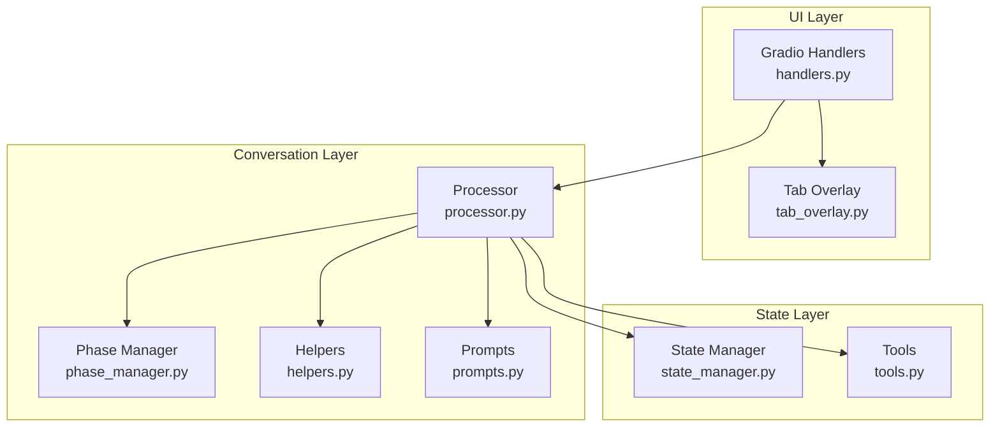
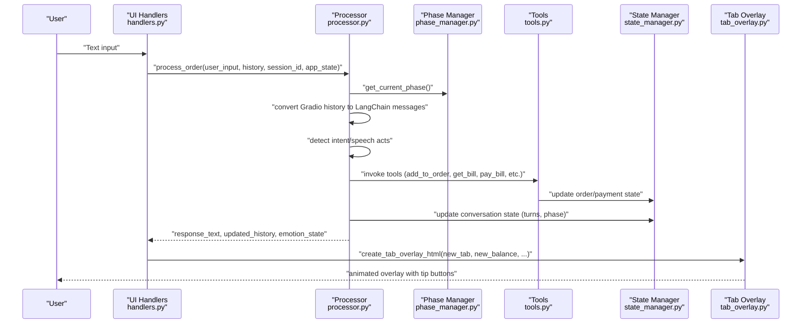
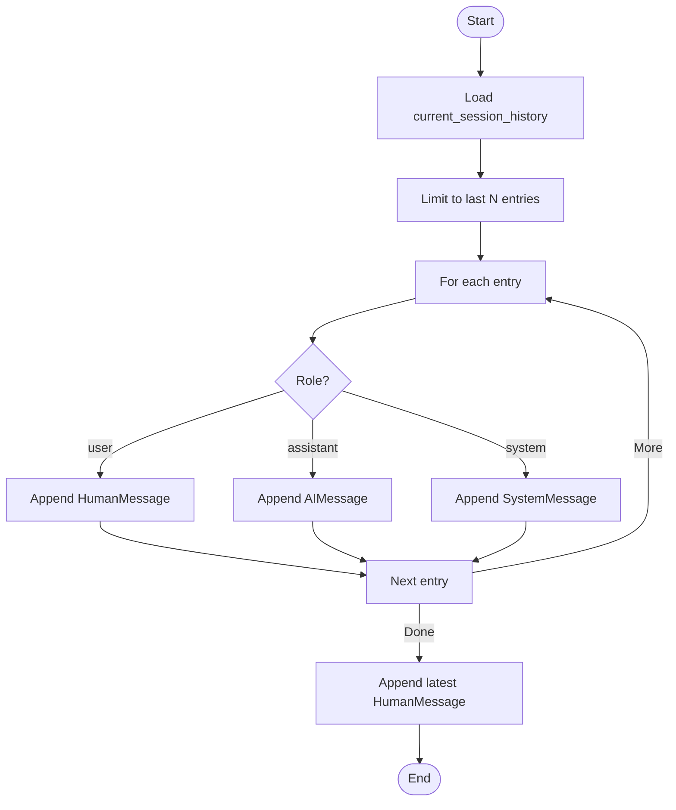
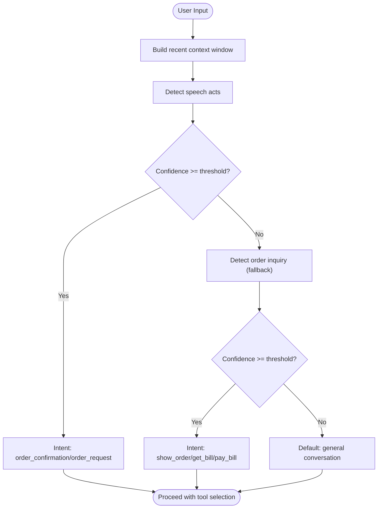
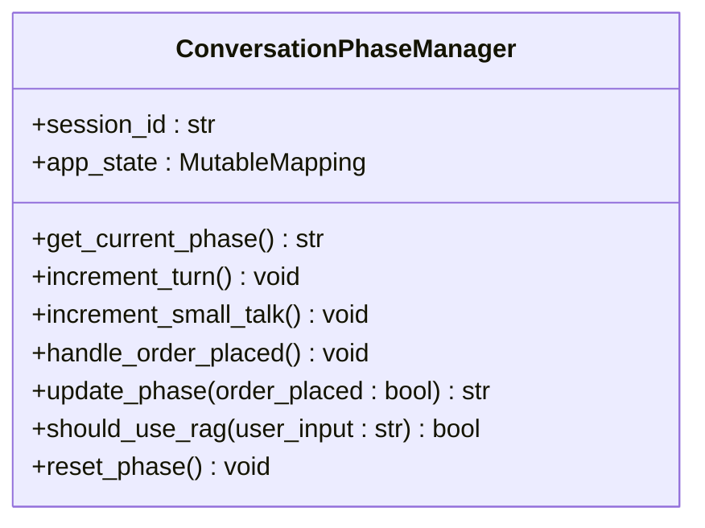
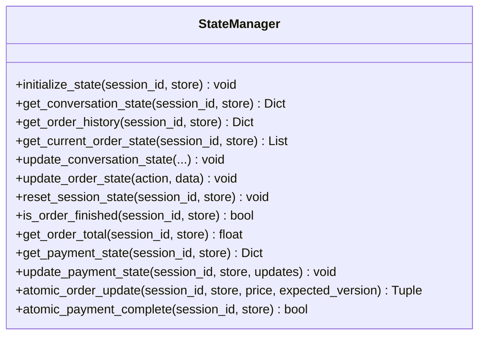
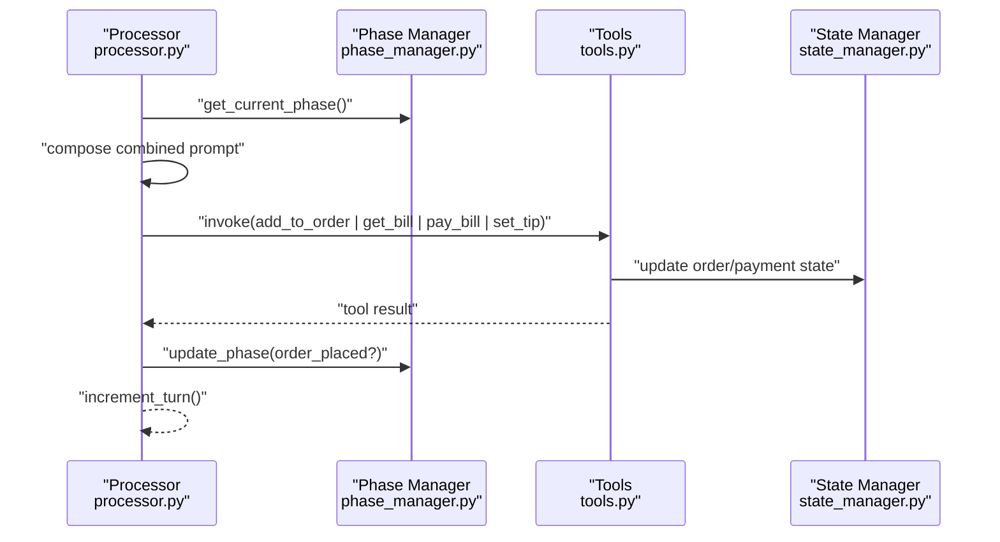
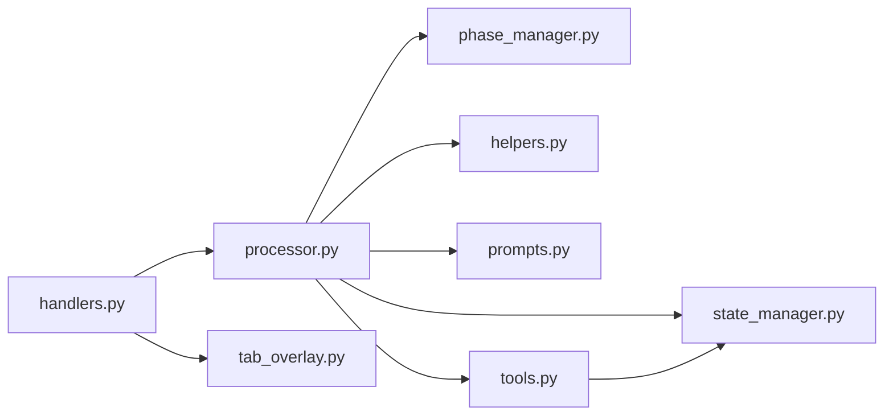

# Context Preservation and Message History

<cite>
**Referenced Files in This Document**
- [processor.py](file://src/conversation/processor.py)
- [phase_manager.py](file://src/conversation/phase_manager.py)
- [state_manager.py](file://src/utils/state_manager.py)
- [handlers.py](file://src/ui/handlers.py)
- [helpers.py](file://src/utils/helpers.py)
- [prompts.py](file://src/llm/prompts.py)
- [tools.py](file://src/llm/tools.py)
- [tab_overlay.py](file://src/ui/tab_overlay.py)
- [test_session_context.py](file://tests/test_session_context.py)
</cite>

## Table of Contents
1. [Introduction](#introduction)
2. [Project Structure](#project-structure)
3. [Core Components](#core-components)
4. [Architecture Overview](#architecture-overview)
5. [Detailed Component Analysis](#detailed-component-analysis)
6. [Dependency Analysis](#dependency-analysis)
7. [Performance Considerations](#performance-considerations)
8. [Troubleshooting Guide](#troubleshooting-guide)
9. [Conclusion](#conclusion)

## Introduction
This document explains MayaMCP’s conversation context management system with a focus on:
- Converting message history between Gradio format and LangChain message types
- Managing the conversation context window to maintain performance and relevance
- Preserving session state across interactions (order, payment, preferences)
- Extracting relevant context for speech act analysis and intent detection
- Synchronizing state across UI, payment processing, and order management
- Integrating phase management to influence tool selection and prompt engineering

## Project Structure
The conversation context system spans several modules:
- Conversation processing orchestrates message history conversion, phase-aware prompting, tool invocation, and state updates
- Phase management controls conversation flow and determines when to use RAG
- State manager encapsulates session state, order history, payment state, and thread-safe operations
- UI handlers bridge Gradio events to processing and update overlays and avatars
- Helpers provide speech act detection and context extraction
- Prompts define phase-aware system prompts
- Tools expose order, payment, and recommendation capabilities with session-awareness

**Diagram sources**
- [handlers.py](file://src/ui/handlers.py#L23-L184)
- [processor.py](file://src/conversation/processor.py#L83-L456)
- [phase_manager.py](file://src/conversation/phase_manager.py#L10-L92)
- [helpers.py](file://src/utils/helpers.py#L9-L265)
- [prompts.py](file://src/llm/prompts.py#L36-L87)
- [state_manager.py](file://src/utils/state_manager.py#L394-L814)
- [tools.py](file://src/llm/tools.py#L168-L218)
- [tab_overlay.py](file://src/ui/tab_overlay.py#L151-L485)

**Section sources**
- [processor.py](file://src/conversation/processor.py#L83-L456)
- [phase_manager.py](file://src/conversation/phase_manager.py#L10-L92)
- [state_manager.py](file://src/utils/state_manager.py#L394-L814)
- [handlers.py](file://src/ui/handlers.py#L23-L184)
- [helpers.py](file://src/utils/helpers.py#L9-L265)
- [prompts.py](file://src/llm/prompts.py#L36-L87)
- [tools.py](file://src/llm/tools.py#L168-L218)
- [tab_overlay.py](file://src/ui/tab_overlay.py#L151-L485)

## Core Components
- Message history conversion: Converts Gradio entries to LangChain messages (HumanMessage, AIMessage, SystemMessage) with a bounded window
- Context window management: Limits historical messages to maintain performance and relevance
- Session state preservation: Maintains order, payment, and conversation metadata across turns
- Context extraction: Uses recent messages and speech act detection to infer intent and drink context
- State synchronization: UI, payment, and order systems share a common state store and are updated consistently
- Phase-aware processing: Determines prompts and tool selection based on conversation phase and user input classification

**Section sources**
- [processor.py](file://src/conversation/processor.py#L244-L271)
- [processor.py](file://src/conversation/processor.py#L259-L269)
- [processor.py](file://src/conversation/processor.py#L260-L261)
- [helpers.py](file://src/utils/helpers.py#L113-L210)
- [helpers.py](file://src/utils/helpers.py#L211-L237)
- [state_manager.py](file://src/utils/state_manager.py#L394-L529)
- [handlers.py](file://src/ui/handlers.py#L86-L184)
- [phase_manager.py](file://src/conversation/phase_manager.py#L42-L67)

## Architecture Overview
The conversation context system integrates UI, processing, state, and tools into a cohesive pipeline. The processor converts Gradio history to LangChain messages, applies phase-aware prompts, detects intents, executes tools, and updates state. The UI receives updated state and renders overlays and avatars accordingly.

**Diagram sources**
- [handlers.py](file://src/ui/handlers.py#L86-L184)
- [processor.py](file://src/conversation/processor.py#L120-L443)
- [phase_manager.py](file://src/conversation/phase_manager.py#L18-L67)
- [tools.py](file://src/llm/tools.py#L221-L800)
- [state_manager.py](file://src/utils/state_manager.py#L426-L508)
- [tab_overlay.py](file://src/ui/tab_overlay.py#L151-L485)

## Detailed Component Analysis

### Message History Conversion and Context Window Management
- Conversion: The processor transforms the last N Gradio history entries into LangChain messages, appending the latest user input as HumanMessage and preceding assistant replies as AIMessage. System messages include the combined phase/system prompt and menu context.
- Context window: A fixed-size sliding window limits the number of prior messages included in the LangChain message list, balancing performance and relevance.

**Diagram sources**
- [processor.py](file://src/conversation/processor.py#L259-L271)

**Section sources**
- [processor.py](file://src/conversation/processor.py#L244-L271)
- [processor.py](file://src/conversation/processor.py#L260-L261)

### Speech Act Detection and Intent Extraction
- Speech act detection: Uses patterns aligned with Austin’s framework to classify user intent (commissive, assertive, directive) and extract drink context from recent conversation history.
- Intent detection: Provides fallback detection for order inquiries (show order, get bill, pay bill) with confidence thresholds.
- Context extraction: Builds a short-lived conversation context window to inform speech act classification and RAG usage decisions.

**Diagram sources**
- [helpers.py](file://src/utils/helpers.py#L113-L210)
- [helpers.py](file://src/utils/helpers.py#L9-L70)
- [helpers.py](file://src/utils/helpers.py#L211-L237)

**Section sources**
- [helpers.py](file://src/utils/helpers.py#L113-L210)
- [helpers.py](file://src/utils/helpers.py#L9-L70)
- [helpers.py](file://src/utils/helpers.py#L211-L237)

### Phase Management and Prompt Engineering
- Phase transitions: The phase manager tracks turn counts, small talk cycles, and last order time to decide the next phase (greeting, order_taking, small_talk, reorder_prompt).
- Prompt engineering: The processor composes a combined prompt from phase-specific and system instructions, including menu context, tailored to the current phase.
- RAG gating: Casual conversation detection determines whether to enhance responses with RAG.

**Diagram sources**
- [phase_manager.py](file://src/conversation/phase_manager.py#L10-L92)

**Section sources**
- [phase_manager.py](file://src/conversation/phase_manager.py#L42-L67)
- [prompts.py](file://src/llm/prompts.py#L73-L87)
- [processor.py](file://src/conversation/processor.py#L247-L257)
- [processor.py](file://src/conversation/processor.py#L299-L362)

### Session State Preservation and Synchronization
- State model: Session state includes conversation metadata (turns, phase, small talk count), order history, current order, and payment state with strict validation and idempotency support.
- Thread safety: Session locks protect concurrent updates; expired locks are periodically cleaned up.
- UI synchronization: Handlers update tab, balance, tip, and avatar state; overlays animate changes and reflect payment updates.
- Tool session awareness: Tools read the current session from thread-local storage to operate on the correct session.

**Diagram sources**
- [state_manager.py](file://src/utils/state_manager.py#L394-L814)

**Section sources**
- [state_manager.py](file://src/utils/state_manager.py#L394-L529)
- [state_manager.py](file://src/utils/state_manager.py#L531-L814)
- [handlers.py](file://src/ui/handlers.py#L86-L184)
- [tab_overlay.py](file://src/ui/tab_overlay.py#L151-L485)
- [tools.py](file://src/llm/tools.py#L168-L218)

### Tool Selection and Context-Aware Prompting
- Tool invocation: The processor routes user requests to appropriate tools (add_to_order, get_bill, pay_bill, set_tip, get_recommendation) based on detected intent.
- Session context: Tools access the current session via thread-local storage to ensure operations apply to the correct user session.
- Prompt influence: The current phase and menu inform the system prompt composition, guiding the LLM’s behavior and tool selection.

**Diagram sources**
- [processor.py](file://src/conversation/processor.py#L141-L242)
- [processor.py](file://src/conversation/processor.py#L364-L405)
- [phase_manager.py](file://src/conversation/phase_manager.py#L42-L67)
- [tools.py](file://src/llm/tools.py#L221-L800)
- [state_manager.py](file://src/utils/state_manager.py#L447-L508)

**Section sources**
- [processor.py](file://src/conversation/processor.py#L141-L242)
- [processor.py](file://src/conversation/processor.py#L364-L405)
- [tools.py](file://src/llm/tools.py#L168-L218)
- [prompts.py](file://src/llm/prompts.py#L73-L87)

### Examples and Patterns
- Context window sizing: The processor limits the LangChain message history to the last N entries (e.g., 10) to maintain performance and focus on recent context.
- Message transformation: Gradio entries are mapped to LangChain message types with a system prompt and menu context appended.
- State persistence patterns:
  - Initialize state on first interaction
  - Increment turns and small talk counts per interaction
  - Update phase based on order placement and conversation flow
  - Persist order items, totals, and payment state atomically
- Emotion-driven UI: Responses include an internal emotion tag; the UI resolves avatar assets based on the emotion state.

**Section sources**
- [processor.py](file://src/conversation/processor.py#L260-L261)
- [processor.py](file://src/conversation/processor.py#L259-L269)
- [processor.py](file://src/conversation/processor.py#L125-L127)
- [processor.py](file://src/conversation/processor.py#L412-L426)
- [handlers.py](file://src/ui/handlers.py#L140-L184)
- [test_session_context.py](file://tests/test_session_context.py#L118-L209)

## Dependency Analysis
Key dependencies and relationships:
- Processor depends on phase manager, helpers, prompts, tools, and state manager
- UI handlers depend on processor and tab overlay
- Tools depend on state manager and thread-local session context
- Helpers provide shared utilities for speech act detection and casual conversation classification

**Diagram sources**
- [processor.py](file://src/conversation/processor.py#L29-L29)
- [phase_manager.py](file://src/conversation/phase_manager.py#L4-L6)
- [helpers.py](file://src/utils/helpers.py#L3-L6)
- [prompts.py](file://src/llm/prompts.py#L3-L4)
- [tools.py](file://src/llm/tools.py#L12-L27)
- [state_manager.py](file://src/utils/state_manager.py#L8-L8)
- [handlers.py](file://src/ui/handlers.py#L6-L19)
- [tab_overlay.py](file://src/ui/tab_overlay.py#L9-L9)

**Section sources**
- [processor.py](file://src/conversation/processor.py#L29-L29)
- [phase_manager.py](file://src/conversation/phase_manager.py#L4-L6)
- [helpers.py](file://src/utils/helpers.py#L3-L6)
- [prompts.py](file://src/llm/prompts.py#L3-L4)
- [tools.py](file://src/llm/tools.py#L12-L27)
- [state_manager.py](file://src/utils/state_manager.py#L8-L8)
- [handlers.py](file://src/ui/handlers.py#L6-L19)
- [tab_overlay.py](file://src/ui/tab_overlay.py#L9-L9)

## Performance Considerations
- Context window sizing: Limiting the number of prior messages reduces token usage and latency
- RAG gating: Casual conversation detection avoids unnecessary RAG calls for order-related or tool-requesting turns
- Thread-safe state operations: Atomic updates and optimistic locking minimize contention and retries
- UI animations: Lightweight JavaScript animation queue collapses rapid updates to reduce rendering overhead

[No sources needed since this section provides general guidance]

## Troubleshooting Guide
- Session context not set: Tools require a session context; ensure it is set before invoking tools and cleared afterward
- Insufficient funds: Payment tools return specific error codes; handle gracefully in UI and prompt user to adjust order or balance
- RAG failures: The processor falls back to the original response if RAG enhancement fails
- State resets: Use the reset handler to clear session state when needed

**Section sources**
- [test_session_context.py](file://tests/test_session_context.py#L118-L209)
- [tools.py](file://src/llm/tools.py#L272-L293)
- [processor.py](file://src/conversation/processor.py#L358-L361)
- [handlers.py](file://src/ui/handlers.py#L186-L215)

## Conclusion
MayaMCP’s conversation context management system preserves meaningful context across multi-turn dialogues, converts message formats seamlessly, and synchronizes state across UI, payment, and order subsystems. It leverages phase-aware prompts, speech act detection, and a bounded context window to maintain performance while enabling robust tool selection and prompt engineering for context-aware responses.