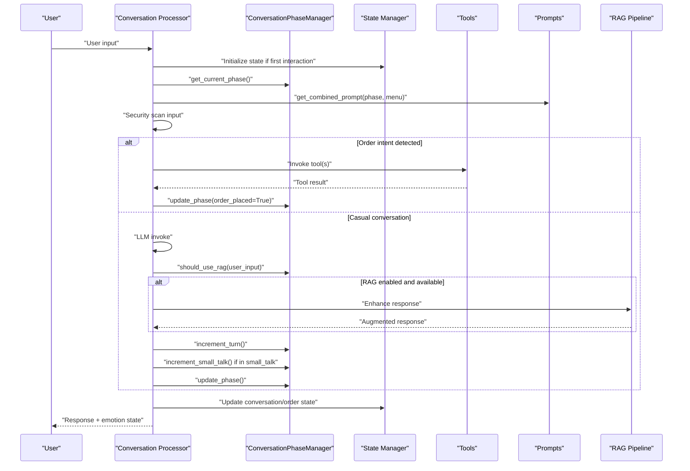
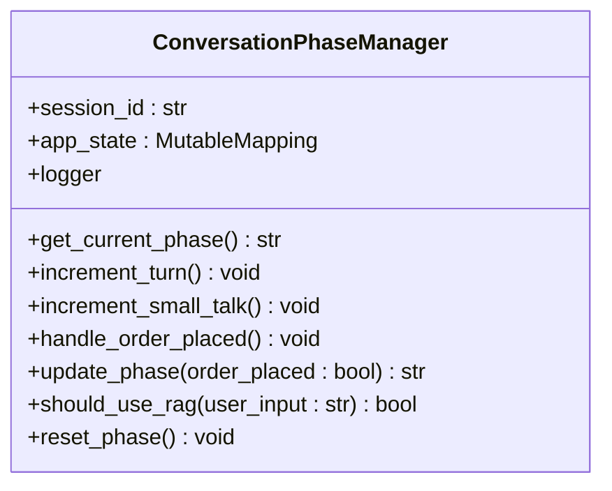
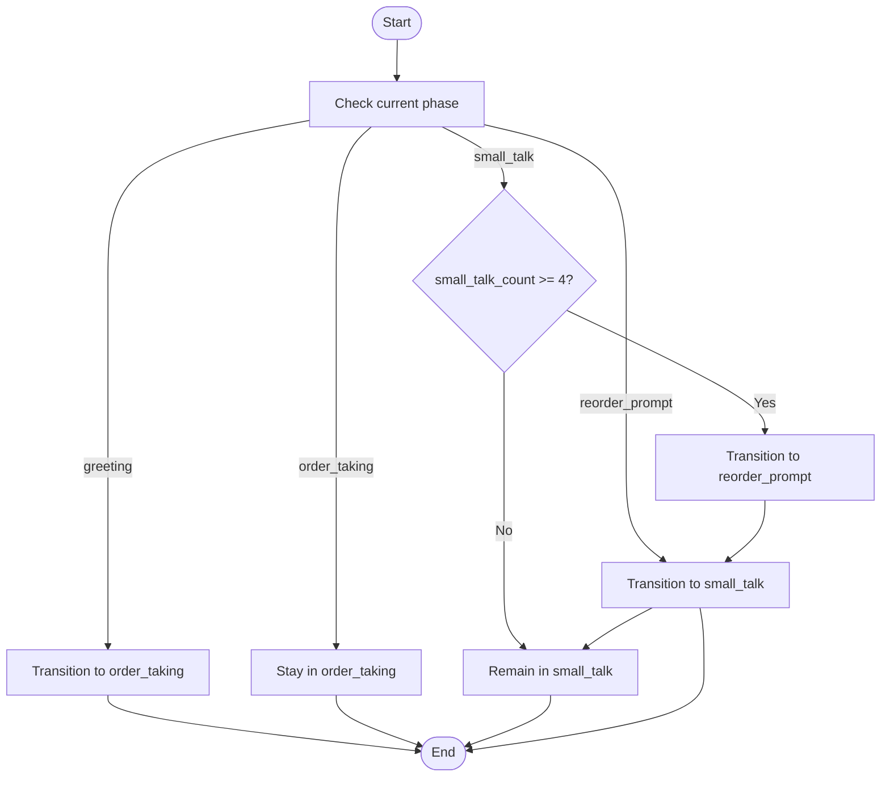
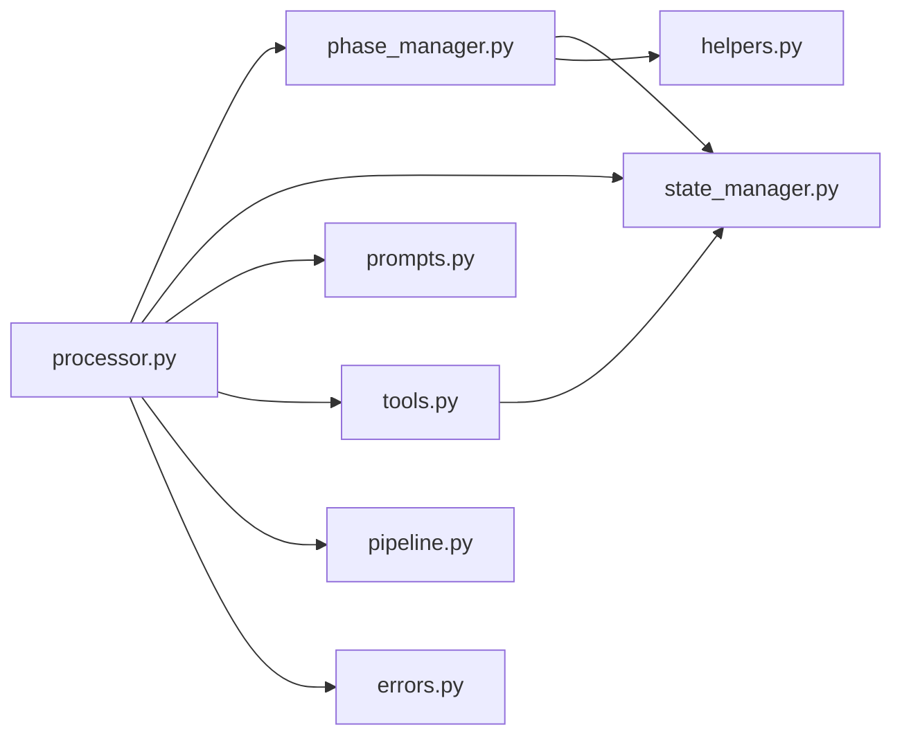

# Conversation Phase Management

<cite>
**Referenced Files in This Document**
- [phase_manager.py](file://src/conversation/phase_manager.py)
- [processor.py](file://src/conversation/processor.py)
- [state_manager.py](file://src/utils/state_manager.py)
- [helpers.py](file://src/utils/helpers.py)
- [prompts.py](file://src/llm/prompts.py)
- [tools.py](file://src/llm/tools.py)
- [pipeline.py](file://src/rag/pipeline.py)
- [errors.py](file://src/utils/errors.py)
- [test_phase_manager.py](file://tests/test_phase_manager.py)
</cite>

## Table of Contents
1. [Introduction](#introduction)
2. [Project Structure](#project-structure)
3. [Core Components](#core-components)
4. [Architecture Overview](#architecture-overview)
5. [Detailed Component Analysis](#detailed-component-analysis)
6. [Dependency Analysis](#dependency-analysis)
7. [Performance Considerations](#performance-considerations)
8. [Troubleshooting Guide](#troubleshooting-guide)
9. [Conclusion](#conclusion)

## Introduction
This document explains MayaMCP's conversation phase management system, which controls interaction modes and state transitions during customer conversations. It focuses on the ConversationPhaseManager class that orchestrates phases including greeting, order_taking, small_talk, and reorder_prompt. The document covers phase transition logic, turn counting, phase-specific prompt engineering, retrieval-augmented generation (RAG) integration, state persistence across sessions, and error handling during phase changes. It also describes how phases affect tool availability and response formatting.

## Project Structure
The conversation phase management spans several modules:
- Conversation orchestration: phase_manager.py, processor.py
- State management: state_manager.py
- Phase logic and helpers: helpers.py
- Prompt engineering: prompts.py
- Tools and menu: tools.py
- RAG pipeline: pipeline.py
- Error handling: errors.py
- Tests: test_phase_manager.py

```mermaid
graph TB
subgraph "Conversation Layer"
PM["ConversationPhaseManager<br/>phase_manager.py"]
PR["Conversation Processor<br/>processor.py"]
end
subgraph "State & Helpers"
SM["State Manager<br/>state_manager.py"]
HP["Helpers & Phase Logic<br/>helpers.py"]
end
subgraph "Prompt & Tools"
PROM["Prompts<br/>prompts.py"]
TOOLS["Tools & Menu<br/>tools.py"]
end
subgraph "RAG"
RAG["RAG Pipeline<br/>pipeline.py"]
end
subgraph "Utilities"
ERR["Error Logging<br/>errors.py"]
end
PR --> PM
PR --> SM
PR --> PROM
PR --> TOOLS
PR --> RAG
PM --> SM
PM --> HP
PR --> HP
PR --> ERR
```

**Diagram sources**
- [phase_manager.py](file://src/conversation/phase_manager.py#L1-L92)
- [processor.py](file://src/conversation/processor.py#L1-L456)
- [state_manager.py](file://src/utils/state_manager.py#L1-L814)
- [helpers.py](file://src/utils/helpers.py#L1-L265)
- [prompts.py](file://src/llm/prompts.py#L1-L87)
- [tools.py](file://src/llm/tools.py#L1-L1066)
- [pipeline.py](file://src/rag/pipeline.py#L1-L105)
- [errors.py](file://src/utils/errors.py#L1-L39)

**Section sources**
- [phase_manager.py](file://src/conversation/phase_manager.py#L1-L92)
- [processor.py](file://src/conversation/processor.py#L1-L456)
- [state_manager.py](file://src/utils/state_manager.py#L1-L814)
- [helpers.py](file://src/utils/helpers.py#L1-L265)
- [prompts.py](file://src/llm/prompts.py#L1-L87)
- [tools.py](file://src/llm/tools.py#L1-L1066)
- [pipeline.py](file://src/rag/pipeline.py#L1-L105)
- [errors.py](file://src/utils/errors.py#L1-L39)

## Core Components
- ConversationPhaseManager: central orchestrator for phases, turn counting, small talk counters, order placement handling, and RAG gating decisions.
- Conversation Processor: integrates phase management with LLM/tool orchestration, security scanning, and RAG augmentation.
- State Manager: persistent conversation and order state across sessions with thread-safe locking and migration support.
- Helpers: phase transition logic, speech act detection, casual conversation detection, and drink context extraction.
- Prompts: phase-specific system prompts and combined prompt assembly.
- Tools: menu retrieval, order management, payment tools, and session context propagation.
- RAG Pipeline: retrieval and augmentation for casual conversation responses.

**Section sources**
- [phase_manager.py](file://src/conversation/phase_manager.py#L10-L92)
- [processor.py](file://src/conversation/processor.py#L1-L456)
- [state_manager.py](file://src/utils/state_manager.py#L285-L446)
- [helpers.py](file://src/utils/helpers.py#L71-L111)
- [prompts.py](file://src/llm/prompts.py#L36-L87)
- [tools.py](file://src/llm/tools.py#L651-L703)
- [pipeline.py](file://src/rag/pipeline.py#L60-L105)

## Architecture Overview
The system follows a layered architecture:
- Processor layer receives user input, performs security scanning, detects intents, invokes tools, and manages phases.
- Phase manager encapsulates state transitions and turn accounting.
- State manager persists conversation and order state with thread-safe access.
- Helpers provide phase logic and intent detection.
- Prompts tailor Maya’s personality and behavior per phase.
- RAG enhances casual conversation responses when appropriate.



**Diagram sources**
- [processor.py](file://src/conversation/processor.py#L120-L443)
- [phase_manager.py](file://src/conversation/phase_manager.py#L18-L67)
- [state_manager.py](file://src/utils/state_manager.py#L394-L446)
- [prompts.py](file://src/llm/prompts.py#L73-L87)
- [pipeline.py](file://src/rag/pipeline.py#L60-L105)

## Detailed Component Analysis

### ConversationPhaseManager
Responsibilities:
- Track and expose current phase.
- Manage turn counting and small talk counters.
- Handle order placement state updates.
- Compute next phase based on state and events.
- Decide when to use RAG for casual conversation.
- Reset phase to greeting.

Key behaviors:
- Turn counting increments per interaction.
- Small talk counter increments only while in small_talk phase.
- Order placement resets small talk counter and records last order time.
- Phase transitions are computed by determine_next_phase.
- RAG gating uses is_casual_conversation.



**Diagram sources**
- [phase_manager.py](file://src/conversation/phase_manager.py#L10-L92)

**Section sources**
- [phase_manager.py](file://src/conversation/phase_manager.py#L10-L92)

### Phase Transition Logic
The determine_next_phase function defines deterministic transitions:
- greeting → order_taking on first interaction.
- order_taking remains order_taking unless an order is placed.
- After order placement: small_talk with small_talk_count reset.
- small_talk continues until small_talk_count reaches 4, then transitions to reorder_prompt.
- reorder_prompt always returns to small_talk and resets small_talk_count.



**Diagram sources**
- [helpers.py](file://src/utils/helpers.py#L71-L111)

**Section sources**
- [helpers.py](file://src/utils/helpers.py#L71-L111)

### Turn Counting and Small Talk Tracking
Turn counting:
- increment_turn increments the conversation turn counter stored in state.
- Used to track progression and inform phase transitions.

Small talk tracking:
- increment_small_talk increments only when currently in small_talk phase.
- small_talk_count resets upon order placement.

Order placement handling:
- handle_order_placed updates last_order_time to current turn and resets small_talk_count.

**Section sources**
- [phase_manager.py](file://src/conversation/phase_manager.py#L23-L40)
- [state_manager.py](file://src/utils/state_manager.py#L285-L291)

### Phase-Specific Prompt Engineering
Maya’s personality and behavior are shaped by phase-specific prompts:
- greeting: welcoming and inviting.
- order_taking: professional and clarifying.
- small_talk: light and friendly.
- reorder_prompt: polite prompting to order more.

Combined prompts assemble phase-specific guidance with system instructions and menu context.

**Section sources**
- [prompts.py](file://src/llm/prompts.py#L36-L42)
- [prompts.py](file://src/llm/prompts.py#L73-L87)

### RAG Integration and should_use_rag()
RAG is applied selectively:
- should_use_rag(user_input) returns True for casual conversation and False for order-related inputs.
- The processor checks this decision and augments responses when appropriate and when RAG components are available.

RAG pipeline:
- Retrieves relevant passages and generates an augmented response using a model configured with the retrieved context.
- Includes robust error handling and fallback responses.

**Section sources**
- [phase_manager.py](file://src/conversation/phase_manager.py#L69-L82)
- [processor.py](file://src/conversation/processor.py#L299-L362)
- [pipeline.py](file://src/rag/pipeline.py#L12-L105)

### Tool Availability and Response Formatting
Tools are invoked based on detected intents:
- Order inquiries trigger get_order, get_bill, pay_bill, or add_to_order.
- Speech act detection enables contextual order confirmation handling.
- Session context is propagated to tools via thread-local storage to enable balance checks and atomic operations.

Response formatting:
- Emotion tagging embedded in responses drives avatar expression selection.
- Security scanning sanitizes inputs and outputs, with neutral emotion fallback on violations.

**Section sources**
- [processor.py](file://src/conversation/processor.py#L132-L242)
- [processor.py](file://src/conversation/processor.py#L244-L443)
- [tools.py](file://src/llm/tools.py#L168-L200)
- [tools.py](file://src/llm/tools.py#L651-L703)

### State Persistence Across Sessions
State persistence:
- initialize_state sets default conversation, order, and payment state for a session.
- get_conversation_state retrieves a copy of the current conversation state.
- update_conversation_state persists updates safely.
- reset_session_state clears state and associated locks.

Thread safety:
- Session locks protect concurrent access to state.
- Periodic cleanup removes stale locks.

**Section sources**
- [state_manager.py](file://src/utils/state_manager.py#L394-L446)
- [state_manager.py](file://src/utils/state_manager.py#L207-L282)

### Error Handling During Phase Changes
Error handling:
- Processor wraps processing in try/except, returning a safe error message and preserving history.
- Security scanning blocks malicious inputs and sanitizes outputs; violations force neutral emotion.
- RAG failures are handled gracefully with fallback responses.
- Logging distinguishes rate limits, authentication errors, timeouts, and generic errors.

**Section sources**
- [processor.py](file://src/conversation/processor.py#L445-L456)
- [errors.py](file://src/utils/errors.py#L11-L38)

## Dependency Analysis
Key dependencies:
- ConversationPhaseManager depends on state_manager for state access/update and helpers for phase logic.
- Conversation Processor depends on phase_manager, state_manager, prompts, tools, and RAG pipeline.
- Helpers depend on logging and provide phase transitions and intent detection.
- Tools depend on state_manager for atomic operations and session context propagation.
- RAG pipeline depends on retrieval and error classification utilities.



**Diagram sources**
- [phase_manager.py](file://src/conversation/phase_manager.py#L1-L92)
- [processor.py](file://src/conversation/processor.py#L1-L456)
- [state_manager.py](file://src/utils/state_manager.py#L1-L814)
- [helpers.py](file://src/utils/helpers.py#L1-L265)
- [prompts.py](file://src/llm/prompts.py#L1-L87)
- [tools.py](file://src/llm/tools.py#L1-L1066)
- [pipeline.py](file://src/rag/pipeline.py#L1-L105)
- [errors.py](file://src/utils/errors.py#L1-L39)

**Section sources**
- [phase_manager.py](file://src/conversation/phase_manager.py#L1-L92)
- [processor.py](file://src/conversation/processor.py#L1-L456)
- [state_manager.py](file://src/utils/state_manager.py#L1-L814)
- [helpers.py](file://src/utils/helpers.py#L1-L265)
- [prompts.py](file://src/llm/prompts.py#L1-L87)
- [tools.py](file://src/llm/tools.py#L1-L1066)
- [pipeline.py](file://src/rag/pipeline.py#L1-L105)
- [errors.py](file://src/utils/errors.py#L1-L39)

## Performance Considerations
- RAG is conditionally applied only for casual conversation to minimize latency.
- RAG components are validated before use to avoid unnecessary overhead.
- Thread-safe state access avoids contention; session locks are cleaned up periodically.
- Security scanning is lightweight and designed to fail open when unavailable.

## Troubleshooting Guide
Common issues and resolutions:
- Unexpected phase transitions: Verify small_talk_count and last_order_time are correctly updated after order placement.
- RAG not applied: Ensure should_use_rag returns True for casual inputs and that RAG components are initialized.
- Tool invocation failures: Confirm session context is set and tools are available; check atomic operation outcomes.
- Security violations: Review blocked reasons and sanitize outputs accordingly; emotion state falls back to neutral.

**Section sources**
- [phase_manager.py](file://src/conversation/phase_manager.py#L69-L82)
- [processor.py](file://src/conversation/processor.py#L103-L113)
- [processor.py](file://src/conversation/processor.py#L434-L439)
- [errors.py](file://src/utils/errors.py#L11-L38)

## Conclusion
MayaMCP’s conversation phase management provides a structured, stateful interaction model that adapts Maya’s behavior to the user’s journey. The ConversationPhaseManager coordinates transitions, turn counting, and RAG gating, while the processor integrates these concerns with LLM/tool orchestration, security, and prompt engineering. State persistence and thread-safe access ensure reliable cross-session continuity. Together, these components deliver a responsive, secure, and contextually appropriate conversational experience.