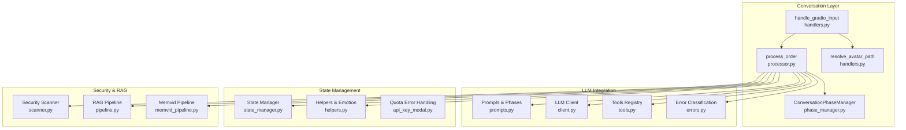
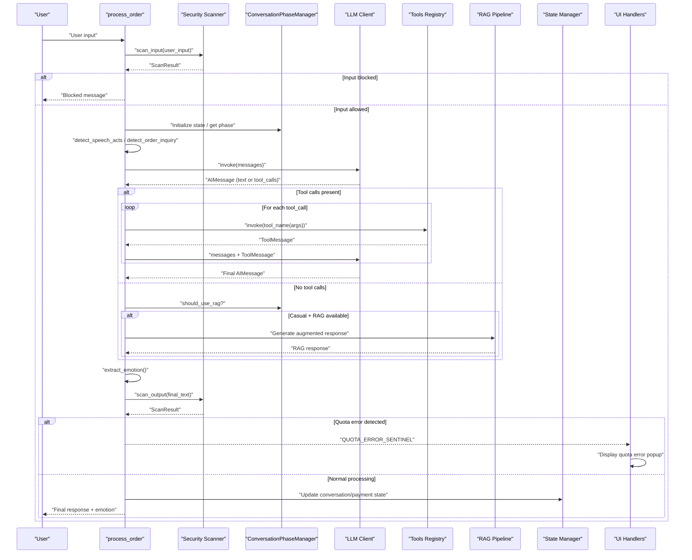
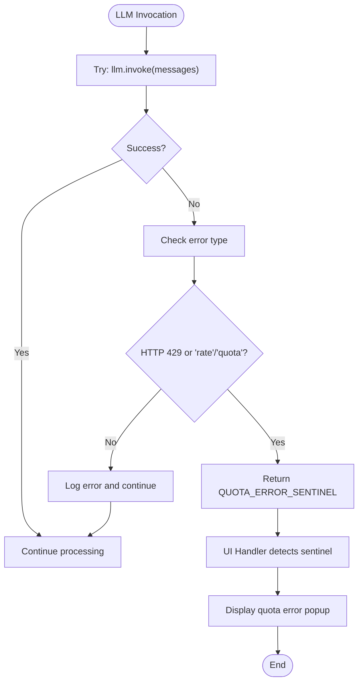
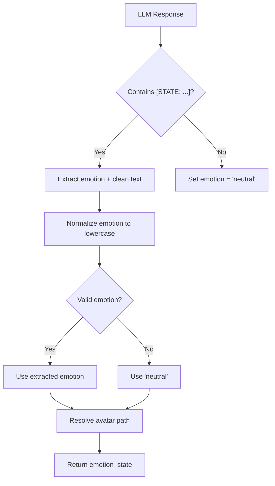
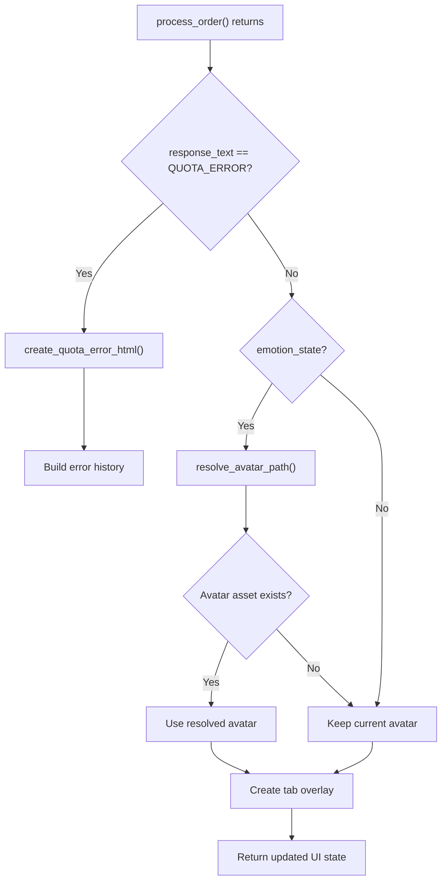
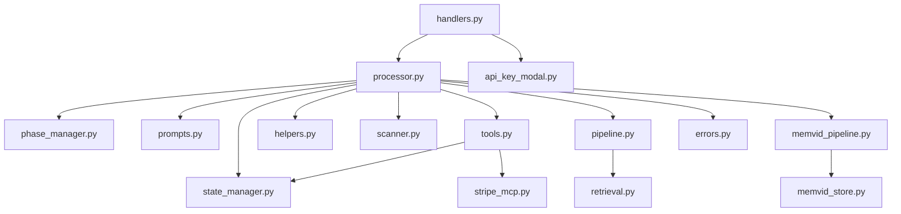

# Conversation Processing System

<cite>
**Referenced Files in This Document**
- [phase_manager.py](file://src/conversation/phase_manager.py)
- [processor.py](file://src/conversation/processor.py)
- [tools.py](file://src/llm/tools.py)
- [prompts.py](file://src/llm/prompts.py)
- [state_manager.py](file://src/utils/state_manager.py)
- [helpers.py](file://src/utils/helpers.py)
- [scanner.py](file://src/security/scanner.py)
- [pipeline.py](file://src/rag/pipeline.py)
- [memvid_pipeline.py](file://src/rag/memvid_pipeline.py)
- [client.py](file://src/llm/client.py)
- [api_key_modal.py](file://src/ui/api_key_modal.py)
- [handlers.py](file://src/ui/handlers.py)
- [errors.py](file://src/utils/errors.py)
- [test_processor_security.py](file://tests/test_processor_security.py)
- [test_processor_rag.py](file://tests/test_processor_rag.py)
- [test_speech_acts.py](file://tests/test_speech_acts.py)
- [test_phase_manager.py](file://tests/test_phase_manager.py)
</cite>

## Update Summary
**Changes Made**
- Enhanced error handling with comprehensive quota error catching and rate limit detection
- Improved state management with atomic operations and validation
- Added emotion state extraction capabilities with emotion-aware responses
- Updated conversation processing to include additional state information and emotion parsing
- Enhanced UI integration with quota error handling and emotion-based avatar switching

## Table of Contents
1. [Introduction](#introduction)
2. [Project Structure](#project-structure)
3. [Core Components](#core-components)
4. [Architecture Overview](#architecture-overview)
5. [Detailed Component Analysis](#detailed-component-analysis)
6. [Dependency Analysis](#dependency-analysis)
7. [Performance Considerations](#performance-considerations)
8. [Troubleshooting Guide](#troubleshooting-guide)
9. [Conclusion](#conclusion)

## Introduction
MayaMCP's conversation processing system orchestrates multi-turn dialogue with robust intent recognition, dynamic tool invocation, and context preservation across turns. It manages distinct conversation phases (greeting, order-taking, small talk, reorder prompting), integrates LLMs with tool-calling capabilities, and enhances responses using Retrieval-Augmented Generation (RAG) and security scanning. The system emphasizes safety, reliability, and graceful degradation when optional components are unavailable. **Updated** to include enhanced error handling with quota error catching, improved state management with atomic operations, and emotion state extraction capabilities for emotion-aware responses.

## Project Structure
The conversation processing system spans several modules:
- Conversation orchestration: phase management and end-to-end processing with emotion state extraction
- LLM integration: prompt engineering, tool binding, and client initialization with enhanced error handling
- State management: thread-safe session state, payment state, and atomic operations with validation
- Utilities: speech act detection, casual conversation detection, and helper functions with emotion parsing
- Security: input and output scanning with configurable thresholds and graceful fallbacks
- RAG: FAISS-based and Memvid-enhanced retrieval pipelines
- UI Integration: quota error handling and emotion-based avatar switching
- Tests: comprehensive coverage of security, RAG behavior, speech acts, and phase transitions



**Diagram sources**
- [phase_manager.py](file://src/conversation/phase_manager.py#L10-L92)
- [processor.py](file://src/conversation/processor.py#L1-L480)
- [handlers.py](file://src/ui/handlers.py#L71-L229)
- [prompts.py](file://src/llm/prompts.py#L1-L87)
- [client.py](file://src/llm/client.py#L1-L211)
- [tools.py](file://src/llm/tools.py#L1-L1066)
- [state_manager.py](file://src/utils/state_manager.py#L1-L871)
- [helpers.py](file://src/utils/helpers.py#L1-L265)
- [scanner.py](file://src/security/scanner.py#L1-L137)
- [pipeline.py](file://src/rag/pipeline.py#L1-L105)
- [memvid_pipeline.py](file://src/rag/memvid_pipeline.py#L1-L108)
- [api_key_modal.py](file://src/ui/api_key_modal.py#L12-L13)
- [errors.py](file://src/utils/errors.py#L11-L37)

**Section sources**
- [phase_manager.py](file://src/conversation/phase_manager.py#L1-L92)
- [processor.py](file://src/conversation/processor.py#L1-L480)
- [handlers.py](file://src/ui/handlers.py#L1-L259)
- [prompts.py](file://src/llm/prompts.py#L1-L87)
- [client.py](file://src/llm/client.py#L1-L211)
- [tools.py](file://src/llm/tools.py#L1-L1066)
- [state_manager.py](file://src/utils/state_manager.py#L1-L871)
- [helpers.py](file://src/utils/helpers.py#L1-L265)
- [scanner.py](file://src/security/scanner.py#L1-L137)
- [pipeline.py](file://src/rag/pipeline.py#L1-L105)
- [memvid_pipeline.py](file://src/rag/memvid_pipeline.py#L1-L108)
- [api_key_modal.py](file://src/ui/api_key_modal.py#L1-L146)
- [errors.py](file://src/utils/errors.py#L1-L39)

## Core Components
- ConversationPhaseManager: Manages conversation phases, turn counters, and small talk accumulation. Determines next phase based on state and order activity.
- process_order: Orchestrates the full conversation loop: security scanning, speech act detection, LLM invocation with tool-calling, RAG enhancement for casual conversation, state updates, emotion tagging, and **enhanced quota error handling**.
- Tools Registry: Centralized tool definitions for ordering, payment, tips, recommendations, and menu access. Tools are bound to the LLM and invoked dynamically.
- State Manager: Thread-safe session and payment state management with atomic operations, optimistic locking, validation, and **improved error handling**.
- Helpers: Speech act detection, casual conversation classification, phase determination logic, and **emotion state extraction**.
- Security Scanner: Input and output scanning with configurable thresholds and graceful fallbacks.
- RAG Pipelines: FAISS-based and Memvid-enhanced retrieval-augmented generation for contextual augmentation.
- UI Handlers: **Quota error handling** with sentinel values and **emotion-based avatar switching**.
- Error Classification: **Enhanced error classification** for quota, authentication, and timeout errors.

**Section sources**
- [phase_manager.py](file://src/conversation/phase_manager.py#L10-L92)
- [processor.py](file://src/conversation/processor.py#L83-L480)
- [handlers.py](file://src/ui/handlers.py#L26-L229)
- [tools.py](file://src/llm/tools.py#L221-L800)
- [state_manager.py](file://src/utils/state_manager.py#L628-L871)
- [helpers.py](file://src/utils/helpers.py#L71-L265)
- [scanner.py](file://src/security/scanner.py#L32-L137)
- [pipeline.py](file://src/rag/pipeline.py#L60-L105)
- [memvid_pipeline.py](file://src/rag/memvid_pipeline.py#L65-L108)
- [api_key_modal.py](file://src/ui/api_key_modal.py#L12-L13)
- [errors.py](file://src/utils/errors.py#L11-L37)

## Architecture Overview
The system follows a layered architecture with enhanced error handling and emotion management:
- Input path: Security scanning, session initialization, and speech act detection
- Processing path: LLM invocation with tool binding, dynamic tool execution, and iterative tool-call loops with **quota error detection**
- Enhancement path: Optional RAG augmentation for casual conversation
- Output path: Security scanning, **emotion parsing**, and state updates
- Persistence path: Thread-safe state updates and atomic operations
- **UI Integration**: Quota error handling with sentinel values and emotion-based avatar switching



**Diagram sources**
- [processor.py](file://src/conversation/processor.py#L273-L480)
- [handlers.py](file://src/ui/handlers.py#L146-L189)
- [scanner.py](file://src/security/scanner.py#L32-L137)
- [phase_manager.py](file://src/conversation/phase_manager.py#L69-L83)
- [pipeline.py](file://src/rag/pipeline.py#L60-L105)
- [memvid_pipeline.py](file://src/rag/memvid_pipeline.py#L65-L108)
- [state_manager.py](file://src/utils/state_manager.py#L426-L517)
- [api_key_modal.py](file://src/ui/api_key_modal.py#L12-L13)

## Detailed Component Analysis

### Enhanced Error Handling with Quota Detection
The system now includes comprehensive quota error handling:
- **Quota Error Detection**: Enhanced LLM invocation with quota/rate limit detection using HTTP 429 status codes and "rate" and "quota" keywords
- **Sentinel Pattern**: Returns "QUOTA_ERROR" sentinel value when quota limits are hit, allowing UI handlers to display appropriate error messages
- **Graceful Degradation**: Preserves conversation history and clears session context appropriately
- **Consistent Error Classification**: Unified error classification across the system for rate limits, authentication, and timeouts



**Diagram sources**
- [processor.py](file://src/conversation/processor.py#L279-L308)
- [handlers.py](file://src/ui/handlers.py#L158-L166)
- [errors.py](file://src/utils/errors.py#L23-L24)

**Section sources**
- [processor.py](file://src/conversation/processor.py#L279-L308)
- [handlers.py](file://src/ui/handlers.py#L26-L36)
- [handlers.py](file://src/ui/handlers.py#L158-L166)
- [errors.py](file://src/utils/errors.py#L11-L37)

### Enhanced State Management with Atomic Operations
Improved state management includes:
- **Atomic Operations**: Optimistic locking with version checking for concurrent state updates
- **Payment State Validation**: Comprehensive validation of payment state transitions and constraints
- **Error Codes**: Standardized error codes for insufficient funds and concurrent modification
- **Migration Support**: Backward compatibility with existing session data structures

```mermaid
stateDiagram-v2
[*] --> Pending
Pending --> Processing : "create_stripe_payment"
Processing --> Completed : "check_payment_status succeeded"
Completed --> [*]
note right of Pending : Version : 0
note right of Processing : Version : 1
note right of Completed : Version : 2
```

**Diagram sources**
- [state_manager.py](file://src/utils/state_manager.py#L170-L188)
- [state_manager.py](file://src/utils/state_manager.py#L685-L757)

**Section sources**
- [state_manager.py](file://src/utils/state_manager.py#L628-L742)
- [state_manager.py](file://src/utils/state_manager.py#L666-L668)
- [state_manager.py](file://src/utils/state_manager.py#L170-L188)

### Emotion State Extraction and Management
The system now includes emotion-aware responses:
- **Emotion Tagging**: LLM responses include `[STATE: emotion]` tags for internal state management
- **Emotion Extraction**: Regex-based extraction of emotion states from LLM responses
- **Avatar Integration**: UI handlers resolve emotion states to appropriate avatar videos
- **State Normalization**: Unknown or missing emotions default to "neutral" state



**Diagram sources**
- [processor.py](file://src/conversation/processor.py#L74-L81)
- [handlers.py](file://src/ui/handlers.py#L39-L68)

**Section sources**
- [processor.py](file://src/conversation/processor.py#L74-L81)
- [handlers.py](file://src/ui/handlers.py#L39-L68)
- [prompts.py](file://src/llm/prompts.py#L23-L32)

### Conversation Phase Management
The phase manager governs conversation progression across four modes:
- greeting: Initial greeting and transition to order-taking
- order_taking: Active ordering with menu awareness
- small_talk: Casual conversation with accumulation threshold
- reorder_prompt: Re-engagement prompt after extended small talk

Key behaviors:
- Turn counting and small talk accumulation
- Order placement triggers immediate phase shift to small talk
- Deterministic phase transitions based on state and thresholds
- Optional RAG activation for casual conversation detection


**Diagram sources**
- [helpers.py](file://src/utils/helpers.py#L71-L112)
- [phase_manager.py](file://src/conversation/phase_manager.py#L42-L67)

**Section sources**
- [phase_manager.py](file://src/conversation/phase_manager.py#L10-L92)
- [helpers.py](file://src/utils/helpers.py#L71-L112)

### LLM Integration and Tool Calling
The system binds tools to the LLM and executes them dynamically:
- Tool registry includes ordering, payment, tips, recommendations, and menu access
- Thread-local session context enables tools to access session state without explicit parameters
- Tool invocation with robust error handling and malformed argument protection
- Iterative loop to handle multiple tool calls and return results to the LLM


**Diagram sources**
- [tools.py](file://src/llm/tools.py#L221-L800)
- [state_manager.py](file://src/utils/state_manager.py#L17-L88)

**Section sources**
- [tools.py](file://src/llm/tools.py#L168-L200)
- [tools.py](file://src/llm/tools.py#L221-L800)
- [state_manager.py](file://src/utils/state_manager.py#L17-L88)

### Speech Act Recognition and Intent Detection
The system employs Austin's speech act theory to improve intent recognition:
- Commisive acts ("I can get you that…"): High confidence order confirmations
- Assertive acts ("Here is your…"): Order completions
- Directive acts ("Can you make…"): Requests requiring tool execution
- Drink context extraction from conversation history for enhanced matching


**Diagram sources**
- [helpers.py](file://src/utils/helpers.py#L113-L210)
- [helpers.py](file://src/utils/helpers.py#L211-L238)

**Section sources**
- [helpers.py](file://src/utils/helpers.py#L9-L70)
- [helpers.py](file://src/utils/helpers.py#L113-L210)
- [helpers.py](file://src/utils/helpers.py#L239-L265)

### Context Preservation and State Management
Thread-safe session and payment state management:
- Session locks prevent concurrent modifications
- Atomic operations with optimistic locking for payment updates
- Validation of state transitions and constraints
- Deep-copy defaults to avoid mutation issues
- Migration support for backward compatibility


**Diagram sources**
- [state_manager.py](file://src/utils/state_manager.py#L170-L188)
- [state_manager.py](file://src/utils/state_manager.py#L685-L757)

**Section sources**
- [state_manager.py](file://src/utils/state_manager.py#L194-L283)
- [state_manager.py](file://src/utils/state_manager.py#L685-L757)
- [state_manager.py](file://src/utils/state_manager.py#L394-L517)

### Tool Registry and Dynamic Invocation
Dynamic function invocation with robust error handling:
- Tool binding to LLM with LangChain
- Session context propagation via thread-local storage
- Payment error codes and standardized responses
- Stripe MCP client integration with idempotency keys


**Diagram sources**
- [processor.py](file://src/conversation/processor.py#L364-L406)
- [tools.py](file://src/llm/tools.py#L358-L472)

**Section sources**
- [processor.py](file://src/conversation/processor.py#L364-L406)
- [tools.py](file://src/llm/tools.py#L358-L472)

### RAG Enhancement and Casual Conversation
RAG enhancement is selectively applied to casual conversation:
- Memvid-first pipeline for video-memory-augmented responses
- FAISS-based pipeline as fallback
- Safe length checks to prevent non-sized objects from replacing responses
- Graceful degradation when components are unavailable


**Diagram sources**
- [processor.py](file://src/conversation/processor.py#L299-L362)
- [pipeline.py](file://src/rag/pipeline.py#L60-L105)
- [memvid_pipeline.py](file://src/rag/memvid_pipeline.py#L65-L108)

**Section sources**
- [processor.py](file://src/conversation/processor.py#L299-L362)
- [pipeline.py](file://src/rag/pipeline.py#L60-L105)
- [memvid_pipeline.py](file://src/rag/memvid_pipeline.py#L65-L108)

### Security Scanning Integration
Security scanning is integrated at two stages:
- Input scanning blocks prompt injection and toxicity
- Output scanning sanitizes potentially toxic responses
- Graceful fallbacks when llm-guard is unavailable


**Diagram sources**
- [processor.py](file://src/conversation/processor.py#L103-L114)
- [processor.py](file://src/conversation/processor.py#L190-L196)
- [scanner.py](file://src/security/scanner.py#L32-L137)

**Section sources**
- [processor.py](file://src/conversation/processor.py#L103-L114)
- [processor.py](file://src/conversation/processor.py#L190-L196)
- [scanner.py](file://src/security/scanner.py#L32-L137)

### UI Integration and Emotion-Based Avatar Switching
The UI layer handles quota errors and emotion-based avatar switching:
- **Quota Error Handling**: Detects QUOTA_ERROR sentinel and displays appropriate error popup
- **Emotion Resolution**: Resolves emotion states to avatar video paths with fallback to neutral state
- **Asset Validation**: Checks for avatar asset existence before switching
- **State Normalization**: Ensures valid emotion states for consistent UI behavior



**Diagram sources**
- [handlers.py](file://src/ui/handlers.py#L158-L166)
- [handlers.py](file://src/ui/handlers.py#L39-L68)
- [api_key_modal.py](file://src/ui/api_key_modal.py#L12-L13)

**Section sources**
- [handlers.py](file://src/ui/handlers.py#L158-L166)
- [handlers.py](file://src/ui/handlers.py#L39-L68)
- [api_key_modal.py](file://src/ui/api_key_modal.py#L12-L13)

## Dependency Analysis
The system exhibits clear separation of concerns with minimal coupling and enhanced error handling:
- Conversation processor depends on phase manager, prompts, tools, state manager, helpers, security, RAG, and **error classification**
- Tools depend on state manager and payment state
- RAG pipelines depend on retrieval modules and error classification
- Security scanner is optional and gracefully degrades
- **UI handlers depend on quota error sentinel and emotion resolution**



**Diagram sources**
- [processor.py](file://src/conversation/processor.py#L1-L480)
- [phase_manager.py](file://src/conversation/phase_manager.py#L1-L92)
- [prompts.py](file://src/llm/prompts.py#L1-L87)
- [tools.py](file://src/llm/tools.py#L1-L1066)
- [state_manager.py](file://src/utils/state_manager.py#L1-L871)
- [helpers.py](file://src/utils/helpers.py#L1-L265)
- [scanner.py](file://src/security/scanner.py#L1-L137)
- [pipeline.py](file://src/rag/pipeline.py#L1-L105)
- [memvid_pipeline.py](file://src/rag/memvid_pipeline.py#L1-L108)
- [errors.py](file://src/utils/errors.py#L1-L39)
- [handlers.py](file://src/ui/handlers.py#L1-L259)
- [api_key_modal.py](file://src/ui/api_key_modal.py#L1-L146)

**Section sources**
- [processor.py](file://src/conversation/processor.py#L1-L480)
- [tools.py](file://src/llm/tools.py#L1-L1066)
- [handlers.py](file://src/ui/handlers.py#L1-L259)

## Performance Considerations
- LLM initialization and tool binding are performed once per session lifecycle
- Retry logic with exponential backoff for Gemini API calls
- Early exits when RAG components are unavailable to avoid unnecessary overhead
- Thread-safe state operations with minimal contention via session locks
- Defensive programming to handle non-sized RAG responses safely
- **Enhanced error handling reduces unnecessary processing for quota-limited requests**
- **Emotion parsing adds minimal overhead with regex-based extraction**

## Troubleshooting Guide
Common issues and resolutions:
- Input blocked by security scanner: Review blocked reasons and adjust user phrasing
- Tool invocation failures: Verify tool availability and argument correctness
- RAG enhancement failures: Ensure API keys and retrievers are configured; system falls back gracefully
- Payment errors: Inspect error codes and messages; insufficient funds, concurrent modification, and invalid session are handled explicitly
- Phase transitions: Confirm conversation state counters and thresholds align with expected behavior
- **Quota errors**: Check API key limits and wait for quota reset; system automatically handles quota-limited requests
- **Emotion parsing failures**: Verify LLM response format includes proper `[STATE: emotion]` tags
- **Avatar switching issues**: Ensure emotion assets exist in assets/ directory

Validation via tests:
- Security integration tests verify input blocking and output sanitization
- RAG behavior tests confirm safe handling of missing components and non-sized responses
- Speech act detection tests validate confidence scoring and context extraction
- Phase manager tests verify deterministic transitions and state isolation
- **Quota error handling tests verify proper sentinel detection and UI integration**
- **Emotion parsing tests verify regex extraction and state normalization**

**Section sources**
- [test_processor_security.py](file://tests/test_processor_security.py#L26-L81)
- [test_processor_rag.py](file://tests/test_processor_rag.py#L27-L83)
- [test_speech_acts.py](file://tests/test_speech_acts.py#L14-L163)
- [test_phase_manager.py](file://tests/test_phase_manager.py#L32-L218)

## Conclusion
MayaMCP's conversation processing system provides a robust, extensible framework for multi-turn dialogue management. By combining structured phase transitions, advanced speech act recognition, secure tool invocation, and optional RAG enhancement, it delivers a reliable and engaging conversational experience. **Updated** with enhanced error handling for quota management, improved state management with atomic operations, and emotion-aware responses with avatar integration, the system now offers comprehensive error resilience, sophisticated state management, and immersive user experience through dynamic avatar animations. The modular design and comprehensive error handling ensure resilience and maintainability across diverse deployment scenarios.