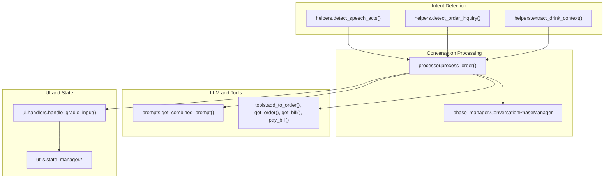
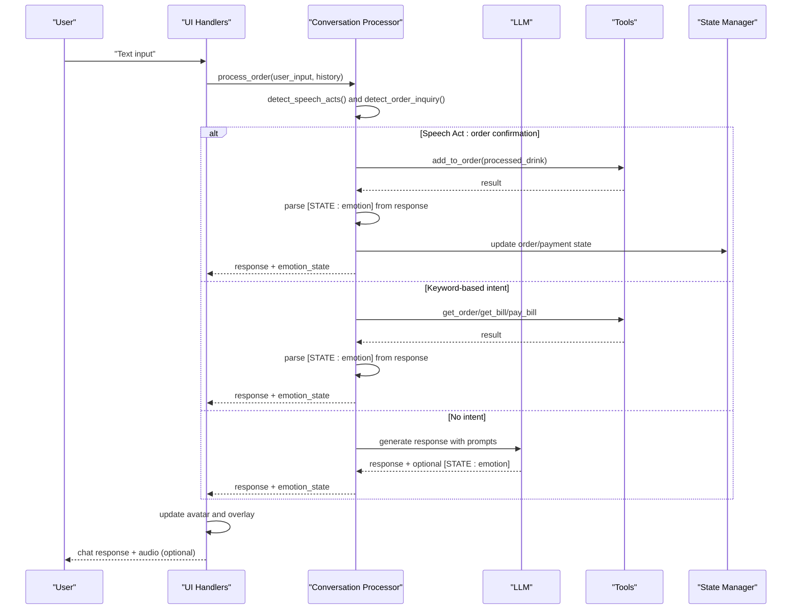
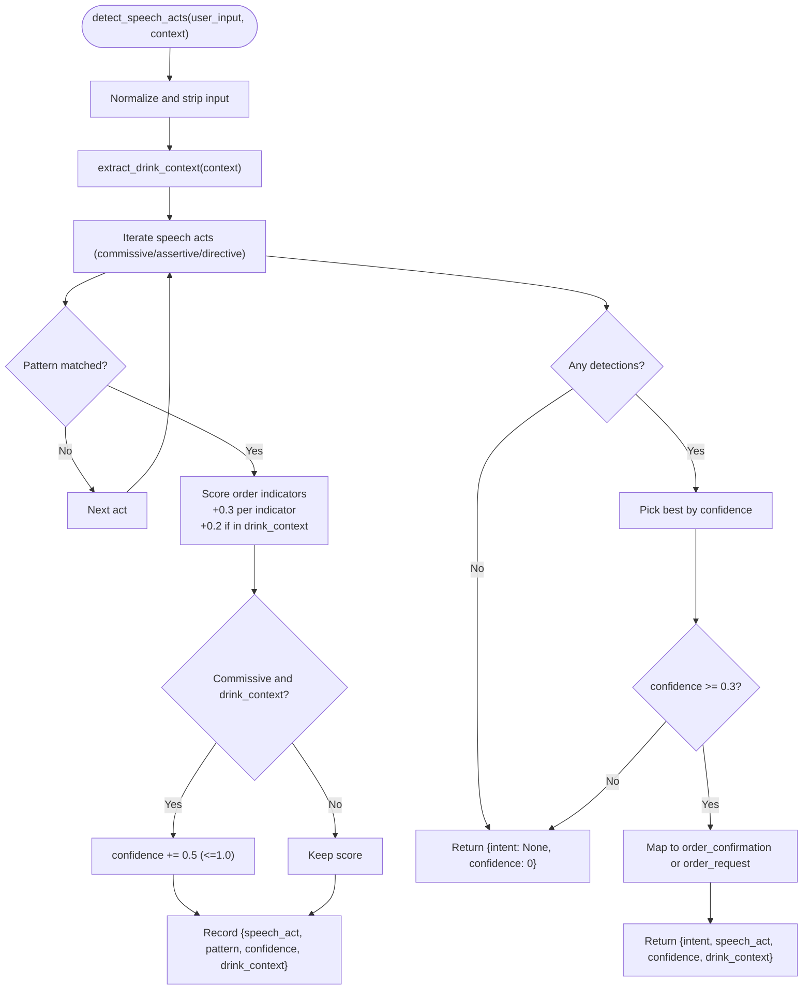
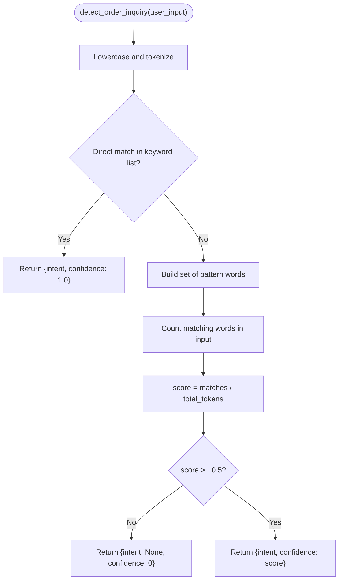
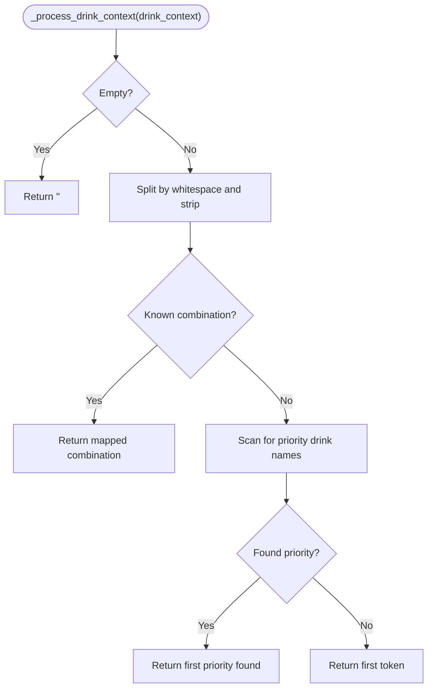
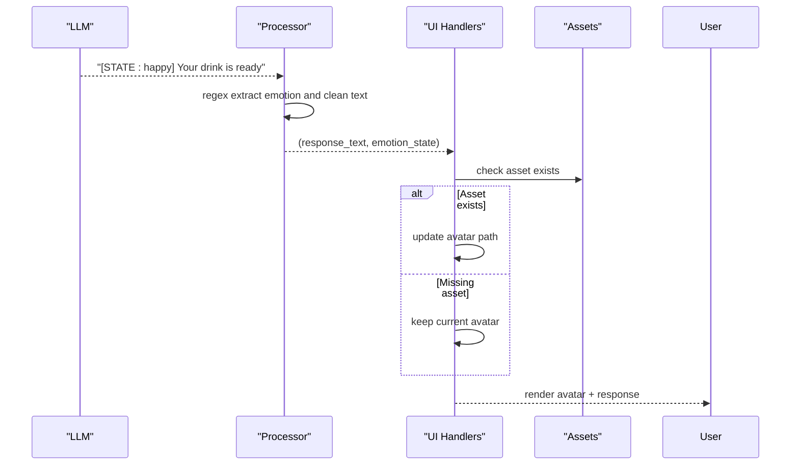
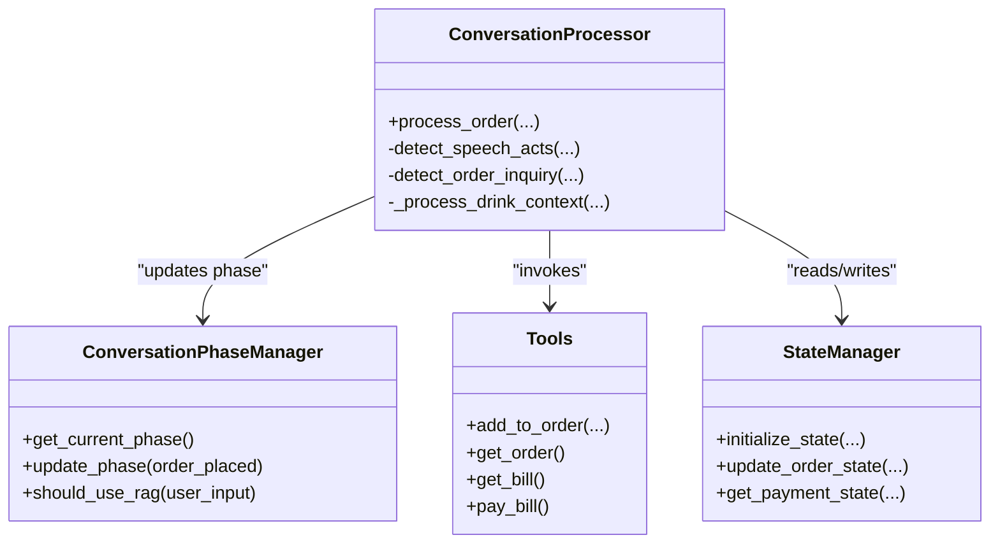
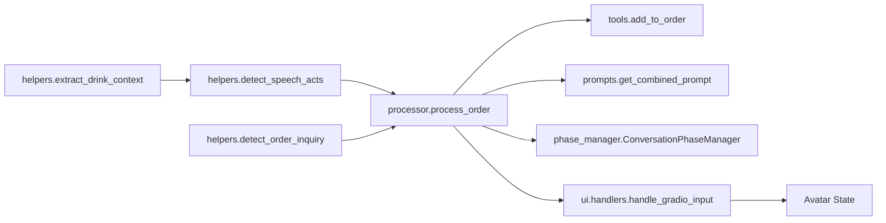

# Intent Detection and Speech Acts

<cite>
**Referenced Files in This Document**
- [helpers.py](file://src/utils/helpers.py)
- [processor.py](file://src/conversation/processor.py)
- [prompts.py](file://src/llm/prompts.py)
- [tools.py](file://src/llm/tools.py)
- [handlers.py](file://src/ui/handlers.py)
- [phase_manager.py](file://src/conversation/phase_manager.py)
- [EMOTION_SYSTEM.md](file://docs/EMOTION_SYSTEM.md)
- [EMOTION_VERIFICATION.md](file://EMOTION_VERIFICATION.md)
- [test_speech_acts.py](file://tests/test_speech_acts.py)
</cite>

## Table of Contents
1. [Introduction](#introduction)
2. [Project Structure](#project-structure)
3. [Core Components](#core-components)
4. [Architecture Overview](#architecture-overview)
5. [Detailed Component Analysis](#detailed-component-analysis)
6. [Dependency Analysis](#dependency-analysis)
7. [Performance Considerations](#performance-considerations)
8. [Troubleshooting Guide](#troubleshooting-guide)
9. [Conclusion](#conclusion)

## Introduction
This document explains MayaMCP’s intent detection and speech act recognition system. It focuses on understanding user intentions beyond literal text, including:
- Speech act classification (commissives, expressives, directives, declarations) via detect_speech_acts()
- Order-related intent detection with confidence scoring via detect_order_inquiry()
- Multi-token drink context processing for complex drink descriptions
- Emotion state extraction from [STATE: emotion] markers
- Integration with tool selection and fallback mechanisms
- Context-aware intent recognition and conversation flow maintenance

## Project Structure
The intent detection and speech act system spans several modules:
- Utilities for intent detection and context extraction
- Conversation processor orchestrating LLM, tools, and UI
- LLM prompts defining behavior and emotion tagging
- Tools implementing bartending operations
- UI handlers managing state and emotion-driven avatar updates
- Tests validating speech act behavior

**Diagram sources**
- [helpers.py](file://src/utils/helpers.py#L9-L265)
- [processor.py](file://src/conversation/processor.py#L1-L456)
- [prompts.py](file://src/llm/prompts.py#L1-L87)
- [tools.py](file://src/llm/tools.py#L1-L1066)
- [handlers.py](file://src/ui/handlers.py#L1-L392)
- [phase_manager.py](file://src/conversation/phase_manager.py#L1-L92)

**Section sources**
- [helpers.py](file://src/utils/helpers.py#L1-L265)
- [processor.py](file://src/conversation/processor.py#L1-L456)
- [prompts.py](file://src/llm/prompts.py#L1-L87)
- [tools.py](file://src/llm/tools.py#L1-L1066)
- [handlers.py](file://src/ui/handlers.py#L1-L392)
- [phase_manager.py](file://src/conversation/phase_manager.py#L1-L92)

## Core Components
- detect_speech_acts(): Identifies speech acts (commissive, assertive, directive) using regex patterns and order indicators, with confidence scoring and drink context extraction.
- detect_order_inquiry(): Recognizes order and billing intents (show order, get bill, pay bill) with confidence thresholds.
- extract_drink_context(): Builds a multi-token drink context from conversation history for downstream processing.
- process_order(): Orchestrates speech act detection, tool invocation, emotion parsing, and UI updates.
- Emotion parsing and UI: Extracts [STATE: emotion] tags from LLM responses and updates avatar state accordingly.

**Section sources**
- [helpers.py](file://src/utils/helpers.py#L9-L265)
- [processor.py](file://src/conversation/processor.py#L73-L456)
- [EMOTION_SYSTEM.md](file://docs/EMOTION_SYSTEM.md#L1-L71)

## Architecture Overview
The system integrates speech act detection with LLM prompting and tool execution. It prioritizes speech act detection for order confirmation and request scenarios, falling back to keyword-based intent detection for non-order queries. Emotion tags embedded in LLM responses drive dynamic avatar behavior.

**Diagram sources**
- [processor.py](file://src/conversation/processor.py#L132-L242)
- [prompts.py](file://src/llm/prompts.py#L23-L34)
- [tools.py](file://src/llm/tools.py#L762-L800)
- [handlers.py](file://src/ui/handlers.py#L140-L184)

## Detailed Component Analysis

### Speech Act Detection: detect_speech_acts()
- Purpose: Classify user input into Austin’s speech act categories to infer intent beyond literal meaning.
- Methodology:
  - Patterns: Regex-based detection for commissives (“I can/shall/absolutely… get you that”), assertives (“Here is/this is your…”), and directives (“please/can you/i want/i need”).
  - Confidence scoring: Base confidence from presence of order indicators (e.g., whiskey, beer, cocktail, rocks, neat); boosted when drink context is present.
  - Threshold: Returns best act only if confidence ≥ 0.3; maps commissives/assertives to order confirmation, directives to order request.
- Outputs: intent, speech_act, confidence, drink_context.

**Diagram sources**
- [helpers.py](file://src/utils/helpers.py#L113-L209)
- [helpers.py](file://src/utils/helpers.py#L211-L237)

**Section sources**
- [helpers.py](file://src/utils/helpers.py#L113-L209)
- [test_speech_acts.py](file://tests/test_speech_acts.py#L14-L82)

### Order Inquiry Detection: detect_order_inquiry()
- Purpose: Identify order-related intents (show order, get bill, pay bill) using keyword and partial-word matching.
- Methodology:
  - Keyword lists per intent; direct substring matches yield highest confidence (1.0).
  - Partial-word matching computes a normalized score; only returns intent if score ≥ 0.5.
- Outputs: intent, confidence.

**Diagram sources**
- [helpers.py](file://src/utils/helpers.py#L9-L69)

**Section sources**
- [helpers.py](file://src/utils/helpers.py#L9-L69)

### Multi-Token Drink Context Processing
- Purpose: Convert fragmented drink mentions from conversation into coherent drink identifiers for tool invocation.
- Methodology:
  - Tokenize and normalize drink context.
  - Known combinations mapped explicitly (e.g., “whiskey rocks”, “long island”).
  - Prefer named drinks over modifiers; fallback to first token if no priority match.
- Integration: Used after speech act detection to resolve the drink for add_to_order().

**Diagram sources**
- [processor.py](file://src/conversation/processor.py#L33-L71)

**Section sources**
- [processor.py](file://src/conversation/processor.py#L33-L71)

### Emotion State Extraction and UI Integration
- Emotion parsing:
  - LLM emits responses prefixed with [STATE: emotion].
  - Processor extracts the tag and strips it before sending to UI.
- UI state management:
  - Handlers validate emotion and switch avatar if asset exists.
  - State persistence ensures continuity when no emotion is found or asset is missing.
- Prompting:
  - System instructions require [STATE: emotion] tags with predefined valid emotions.

**Diagram sources**
- [processor.py](file://src/conversation/processor.py#L174-L184)
- [handlers.py](file://src/ui/handlers.py#L147-L165)
- [prompts.py](file://src/llm/prompts.py#L23-L34)
- [EMOTION_SYSTEM.md](file://docs/EMOTION_SYSTEM.md#L15-L37)

**Section sources**
- [processor.py](file://src/conversation/processor.py#L174-L184)
- [handlers.py](file://src/ui/handlers.py#L147-L165)
- [prompts.py](file://src/llm/prompts.py#L23-L34)
- [EMOTION_SYSTEM.md](file://docs/EMOTION_SYSTEM.md#L15-L37)

### Integration with Tool Selection and Conversation Flow
- Speech act precedence:
  - If detect_speech_acts() detects order confirmation with confidence > 0.4, the system invokes add_to_order() with processed drink context and updates phase.
- Fallback to order inquiries:
  - If detect_order_inquiry() detects a billing/order intent with confidence ≥ 0.5, the system calls get_order(), get_bill(), or pay_bill() directly.
- Default LLM route:
  - Otherwise, the processor builds a prompt with phase-specific instructions, appends conversation history, and lets the LLM decide tool usage.
- Phase management:
  - ConversationPhaseManager updates phase based on actions and counters, ensuring coherent progression (greeting → order-taking → small talk → reorder prompt).

**Diagram sources**
- [processor.py](file://src/conversation/processor.py#L132-L242)
- [phase_manager.py](file://src/conversation/phase_manager.py#L42-L67)
- [tools.py](file://src/llm/tools.py#L762-L800)

**Section sources**
- [processor.py](file://src/conversation/processor.py#L132-L242)
- [phase_manager.py](file://src/conversation/phase_manager.py#L42-L67)
- [tools.py](file://src/llm/tools.py#L762-L800)

## Dependency Analysis
- detect_speech_acts() depends on:
  - helpers.extract_drink_context() for multi-token drink resolution
  - regex matching for speech act patterns
- process_order() depends on:
  - detect_speech_acts() and detect_order_inquiry() for intent routing
  - tools.add_to_order() for order processing
  - prompts.get_combined_prompt() for LLM context
  - ConversationPhaseManager for state transitions
- Emotion parsing depends on:
  - LLM emitting [STATE: emotion] tags
  - UI handlers validating and applying assets

**Diagram sources**
- [helpers.py](file://src/utils/helpers.py#L113-L209)
- [processor.py](file://src/conversation/processor.py#L132-L242)
- [prompts.py](file://src/llm/prompts.py#L73-L87)
- [tools.py](file://src/llm/tools.py#L762-L800)
- [handlers.py](file://src/ui/handlers.py#L140-L184)

**Section sources**
- [helpers.py](file://src/utils/helpers.py#L113-L209)
- [processor.py](file://src/conversation/processor.py#L132-L242)
- [prompts.py](file://src/llm/prompts.py#L73-L87)
- [tools.py](file://src/llm/tools.py#L762-L800)
- [handlers.py](file://src/ui/handlers.py#L140-L184)

## Performance Considerations
- Regex scanning scales linearly with the number of patterns; keep pattern sets minimal and targeted.
- Confidence thresholds reduce false positives and unnecessary tool invocations.
- Multi-token drink processing avoids expensive NLP; explicit mappings and priority scans keep complexity low.
- Emotion parsing uses a single regex pass; ensure prompt formatting is consistent to avoid extra passes.

## Troubleshooting Guide
- Speech act misclassification:
  - Verify patterns and order indicators in detect_speech_acts().
  - Increase thresholds cautiously to avoid false negatives.
- Low confidence results:
  - Confirm conversation context contains relevant drink terms for extract_drink_context().
  - Review threshold behavior in detect_speech_acts() and detect_order_inquiry().
- Emotion not updating avatar:
  - Check [STATE: emotion] presence in raw LLM output.
  - Ensure asset files exist under assets/maya_{emotion}.{mp4,png/jpg}.
  - Validate emotion normalization and asset existence checks in UI handlers.
- Tool invocation failures:
  - Confirm tool availability and session context propagation.
  - Inspect error logs for KeyError or tool execution exceptions.

**Section sources**
- [test_speech_acts.py](file://tests/test_speech_acts.py#L98-L121)
- [EMOTION_SYSTEM.md](file://docs/EMOTION_SYSTEM.md#L28-L37)
- [processor.py](file://src/conversation/processor.py#L140-L170)
- [handlers.py](file://src/ui/handlers.py#L147-L165)

## Conclusion
MayaMCP’s intent detection system leverages Austin’s speech act theory to interpret user intentions beyond literal text, combining regex-based classification with confidence scoring and multi-token drink context processing. The emotion tagging mechanism enriches the user experience by driving dynamic avatar behavior. Robust fallbacks ensure conversation flow continuity even when intent detection is inconclusive, while tool integration enables seamless order processing and payment workflows.