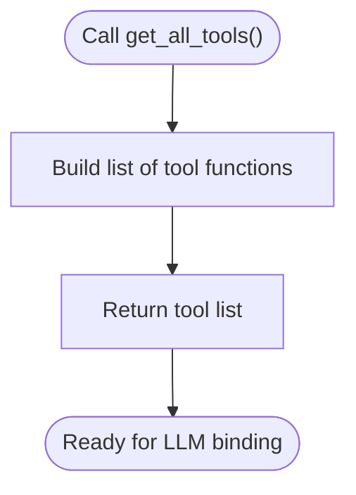

# LLM Tool Integration and Function Calling

<cite>
**Referenced Files in This Document**
- [src/llm/tools.py](file://src/llm/tools.py)
- [src/llm/client.py](file://src/llm/client.py)
- [src/conversation/processor.py](file://src/conversation/processor.py)
- [src/utils/state_manager.py](file://src/utils/state_manager.py)
- [src/payments/stripe_mcp.py](file://src/payments/stripe_mcp.py)
- [src/llm/prompts.py](file://src/llm/prompts.py)
- [tests/test_llm_tools.py](file://tests/test_llm_tools.py)
- [tests/test_session_context.py](file://tests/test_session_context.py)
</cite>

## Table of Contents
1. [Introduction](#introduction)
2. [Project Structure](#project-structure)
3. [Core Components](#core-components)
4. [Architecture Overview](#architecture-overview)
5. [Detailed Component Analysis](#detailed-component-analysis)
6. [Dependency Analysis](#dependency-analysis)
7. [Performance Considerations](#performance-considerations)
8. [Troubleshooting Guide](#troubleshooting-guide)
9. [Conclusion](#conclusion)
10. [Appendices](#appendices)

## Introduction
This document explains MayaMCP’s LLM tool integration system with a focus on dynamic function calling and external service interaction. It covers the tool registry pattern, dynamic discovery and initialization of tools, session context management, argument parsing and validation, error handling, and integration with payment processing and order management. It also documents fallback mechanisms and how the system maintains conversation continuity despite tool execution errors.

## Project Structure
The tool integration spans several modules:
- LLM tool definitions and orchestration live under the LLM package.
- Conversation processing coordinates LLM calls, tool selection, and execution.
- State management provides session-scoped state and atomic operations.
- Payment integration wraps Stripe MCP with retry and fallback logic.
- Tests validate tool behavior and session context semantics.

**Diagram sources**
- [src/llm/tools.py](file://src/llm/tools.py#L1047-L1066)
- [src/llm/client.py](file://src/llm/client.py#L91-L129)
- [src/conversation/processor.py](file://src/conversation/processor.py#L362-L406)
- [src/utils/state_manager.py](file://src/utils/state_manager.py#L685-L757)
- [src/payments/stripe_mcp.py](file://src/payments/stripe_mcp.py#L66-L129)
- [src/llm/prompts.py](file://src/llm/prompts.py#L44-L87)

**Section sources**
- [src/llm/tools.py](file://src/llm/tools.py#L1047-L1066)
- [src/llm/client.py](file://src/llm/client.py#L91-L129)
- [src/conversation/processor.py](file://src/conversation/processor.py#L362-L406)
- [src/utils/state_manager.py](file://src/utils/state_manager.py#L685-L757)
- [src/payments/stripe_mcp.py](file://src/payments/stripe_mcp.py#L66-L129)
- [src/llm/prompts.py](file://src/llm/prompts.py#L44-L87)

## Core Components
- Tool Registry: Centralized list of available tools returned by a factory function.
- Tool Invocation Pipeline: Orchestrated by the conversation processor, including argument validation and error recovery.
- Session Context Management: Thread-local session and global store for tool access.
- State Management: Atomic operations for order and payment state with optimistic locking.
- Payment Integration: Stripe MCP client with retry, availability probing, and fallback to simulated payments.
- Prompts: System and phase prompts guide the LLM to use tools appropriately.

**Section sources**
- [src/llm/tools.py](file://src/llm/tools.py#L1047-L1066)
- [src/conversation/processor.py](file://src/conversation/processor.py#L362-L406)
- [src/utils/state_manager.py](file://src/utils/state_manager.py#L685-L757)
- [src/payments/stripe_mcp.py](file://src/payments/stripe_mcp.py#L66-L129)
- [src/llm/prompts.py](file://src/llm/prompts.py#L44-L87)

## Architecture Overview
The system integrates LLM generation with tool execution and state updates. The LLM is initialized with tools and prompts. During a turn, the processor detects tool calls, validates arguments, executes tools, and appends results back to the LLM for iterative refinement.

**Diagram sources**
- [src/conversation/processor.py](file://src/conversation/processor.py#L362-L406)
- [src/llm/client.py](file://src/llm/client.py#L91-L129)
- [src/llm/tools.py](file://src/llm/tools.py#L1047-L1066)
- [src/utils/state_manager.py](file://src/utils/state_manager.py#L685-L757)
- [src/payments/stripe_mcp.py](file://src/payments/stripe_mcp.py#L183-L273)

## Detailed Component Analysis

### Tool Registry Pattern and Dynamic Discovery
MayaMCP exposes a centralized tool registry via a function that returns the full list of available tools. This enables:
- Consistent binding of tools to the LLM.
- Easy extension by adding new tools to the registry.
- Deterministic tool discovery and mapping by name.

Key behaviors:
- The registry returns a list of tool functions.
- Each tool is decorated for structured tool calling and typed responses.
- Payment tools return a standardized response structure for consistent handling.

**Diagram sources**
- [src/llm/tools.py](file://src/llm/tools.py#L1047-L1066)

**Section sources**
- [src/llm/tools.py](file://src/llm/tools.py#L1047-L1066)
- [tests/test_llm_tools.py](file://tests/test_llm_tools.py#L652-L677)

### Tool Invocation Mechanism and Argument Validation
The conversation processor orchestrates tool execution:
- Parses tool calls from the LLM response.
- Validates argument types and presence.
- Executes tools and captures results.
- Appends tool results back to the LLM for continuation.

Error handling:
- Malformed arguments produce a clear error message.
- Type errors and unexpected exceptions are caught and reported.
- Unknown tools are logged and reported as errors.

**Diagram sources**
- [src/conversation/processor.py](file://src/conversation/processor.py#L362-L406)

**Section sources**
- [src/conversation/processor.py](file://src/conversation/processor.py#L362-L406)

### Session Context Management
Tools can access conversation state implicitly via thread-local session context and a global store:
- Thread-local storage holds the current session ID for the active request.
- A global store reference provides access to session state without explicit parameters.
- The processor sets the session context at the start of a turn and clears it in a finally block to ensure cleanup.

Benefits:
- Backward compatibility with legacy tools that do not require session context.
- Seamless integration for payment and order tools that rely on session-scoped state.

**Diagram sources**
- [src/llm/tools.py](file://src/llm/tools.py#L174-L218)
- [src/conversation/processor.py](file://src/conversation/processor.py#L115-L118)
- [src/conversation/processor.py](file://src/conversation/processor.py#L453-L456)

**Section sources**
- [src/llm/tools.py](file://src/llm/tools.py#L174-L218)
- [src/conversation/processor.py](file://src/conversation/processor.py#L115-L118)
- [src/conversation/processor.py](file://src/conversation/processor.py#L453-L456)
- [tests/test_session_context.py](file://tests/test_session_context.py#L15-L116)

### Tool Argument Parsing, Type Validation, and Error Messages
Tools implement robust argument handling:
- Payment tools return a standardized response structure with status and result/error fields.
- Validation includes checking session context, menu item existence, and tip percentage constraints.
- Error messages are formatted with templates and can include dynamic values.

Examples of validation and error handling:
- Insufficient funds and concurrent modification errors are handled with specific codes and messages.
- Invalid tip percentages trigger a dedicated error code with guidance.
- Item-not-found errors use menu parsing to validate requested items.

**Diagram sources**
- [src/llm/tools.py](file://src/llm/tools.py#L52-L166)
- [src/llm/tools.py](file://src/llm/tools.py#L221-L316)
- [src/llm/tools.py](file://src/llm/tools.py#L557-L616)

**Section sources**
- [src/llm/tools.py](file://src/llm/tools.py#L52-L166)
- [src/llm/tools.py](file://src/llm/tools.py#L221-L316)
- [src/llm/tools.py](file://src/llm/tools.py#L557-L616)

### Payment Processing Tools and State Updates
Payment tools integrate with the Stripe MCP client and state manager:
- Create payment link with idempotency key generation and fallback to simulated payment when unavailable.
- Check payment status with polling and timeout handling.
- Atomic payment completion resets tab and tip, with optimistic locking to prevent conflicts.

**Diagram sources**
- [src/llm/tools.py](file://src/llm/tools.py#L358-L472)
- [src/payments/stripe_mcp.py](file://src/payments/stripe_mcp.py#L183-L273)
- [src/utils/state_manager.py](file://src/utils/state_manager.py#L780-L810)

**Section sources**
- [src/llm/tools.py](file://src/llm/tools.py#L358-L472)
- [src/payments/stripe_mcp.py](file://src/payments/stripe_mcp.py#L66-L129)
- [src/utils/state_manager.py](file://src/utils/state_manager.py#L780-L810)

### Order Management Functions and State Updates
Order-related tools manage the current order and history:
- Add items to the current order with modifiers and quantity.
- Display current order and confirmation prompts.
- Place orders and clear orders.
- Calculate bills and apply tips.

**Diagram sources**
- [src/llm/tools.py](file://src/llm/tools.py#L761-L840)
- [src/llm/tools.py](file://src/llm/tools.py#L221-L316)
- [src/utils/state_manager.py](file://src/utils/state_manager.py#L685-L757)

**Section sources**
- [src/llm/tools.py](file://src/llm/tools.py#L761-L840)
- [src/llm/tools.py](file://src/llm/tools.py#L842-L1001)
- [src/utils/state_manager.py](file://src/utils/state_manager.py#L685-L757)

### Tool Registration, Function Signatures, Parameter Handling, and Result Processing
- Tool registration: Tools are decorated and included in the registry list.
- Function signatures: Tools define typed parameters and return either a string or a standardized response structure.
- Parameter handling: Tools parse and validate parameters, including optional fields and defaults.
- Result processing: Results are appended as ToolMessages and fed back to the LLM.

Examples of tool signatures and behaviors:
- Menu and recommendations: return descriptive strings.
- Order management: return descriptive strings or standardized responses.
- Payment tools: return standardized responses with status and result/error fields.

**Section sources**
- [src/llm/tools.py](file://src/llm/tools.py#L652-L748)
- [src/llm/tools.py](file://src/llm/tools.py#L842-L1001)
- [src/llm/tools.py](file://src/llm/tools.py#L358-L472)

### Fallback Mechanisms and Conversation Continuity
Fallback strategies:
- Stripe MCP unavailability triggers fallback to simulated payment with a distinct flag.
- Tool execution errors are captured and returned as error messages, preserving conversation flow.
- Session context is always cleared in a finally block to ensure cleanup and prevent stale state.

**Diagram sources**
- [src/conversation/processor.py](file://src/conversation/processor.py#L380-L400)

**Section sources**
- [src/payments/stripe_mcp.py](file://src/payments/stripe_mcp.py#L216-L273)
- [src/conversation/processor.py](file://src/conversation/processor.py#L380-L400)
- [src/conversation/processor.py](file://src/conversation/processor.py#L453-L456)

## Dependency Analysis
The tool integration system exhibits clear separation of concerns:
- Tools depend on state manager for atomic operations and on Stripe MCP for payment processing.
- The processor depends on the tool registry and state manager to coordinate execution.
- LLM initialization binds tools to the model for structured tool calling.

**Diagram sources**
- [src/conversation/processor.py](file://src/conversation/processor.py#L26-L29)
- [src/llm/tools.py](file://src/llm/tools.py#L13-L27)
- [src/llm/client.py](file://src/llm/client.py#L91-L129)
- [src/llm/prompts.py](file://src/llm/prompts.py#L44-L87)

**Section sources**
- [src/conversation/processor.py](file://src/conversation/processor.py#L26-L29)
- [src/llm/tools.py](file://src/llm/tools.py#L13-L27)
- [src/llm/client.py](file://src/llm/client.py#L91-L129)
- [src/llm/prompts.py](file://src/llm/prompts.py#L44-L87)

## Performance Considerations
- Asynchronous payment operations: Stripe MCP client uses async operations with exponential backoff and polling timeouts to avoid blocking threads.
- Optimistic locking: Atomic operations minimize contention and reduce retries by validating versions before updates.
- Thread-local session context avoids global contention and ensures isolation across concurrent requests.
- Tool invocation batching: The processor iterates tool calls sequentially, appending results to feed back to the LLM.

## Troubleshooting Guide
Common issues and resolutions:
- Tool not found: Ensure the tool name matches the registry and that the LLM is bound to tools.
- Malformed arguments: Validate argument types and presence before invoking tools.
- Session context errors: Confirm that session context is set at the start of a turn and cleared in a finally block.
- Payment failures: Check Stripe MCP availability and fallback behavior; inspect error codes for specific causes.
- State inconsistencies: Use atomic operations and optimistic locking to prevent concurrent modifications.

**Section sources**
- [src/conversation/processor.py](file://src/conversation/processor.py#L380-L400)
- [src/llm/tools.py](file://src/llm/tools.py#L52-L166)
- [src/utils/state_manager.py](file://src/utils/state_manager.py#L685-L757)
- [src/payments/stripe_mcp.py](file://src/payments/stripe_mcp.py#L130-L182)

## Conclusion
MayaMCP’s LLM tool integration system provides a robust, extensible framework for dynamic function calling and external service interaction. The tool registry pattern, session context management, and atomic state updates enable reliable order and payment workflows. The processor’s argument validation and error handling preserve conversation continuity even when tools fail. Stripe MCP integration includes retry logic and fallback mechanisms to maintain service availability.

## Appendices

### Tool Registry and Available Tools
The registry includes tools for menu access, recommendations, order management, payment processing, and tip handling.

**Section sources**
- [src/llm/tools.py](file://src/llm/tools.py#L1047-L1066)
- [tests/test_llm_tools.py](file://tests/test_llm_tools.py#L652-L677)

### Example Tool Calls and Responses
- Tool call: add_to_order(item_name="Martini", modifiers=["on the rocks"], quantity=1)
- Tool call: create_stripe_payment()
- Tool call: get_bill()
- Tool call: pay_bill()

**Section sources**
- [src/conversation/processor.py](file://src/conversation/processor.py#L362-L406)
- [src/llm/tools.py](file://src/llm/tools.py#L761-L840)
- [src/llm/tools.py](file://src/llm/tools.py#L358-L472)
- [src/llm/tools.py](file://src/llm/tools.py#L940-L1001)