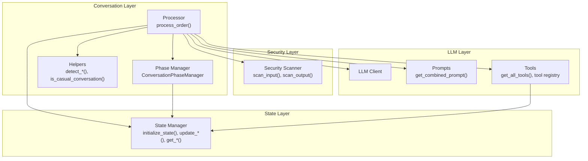
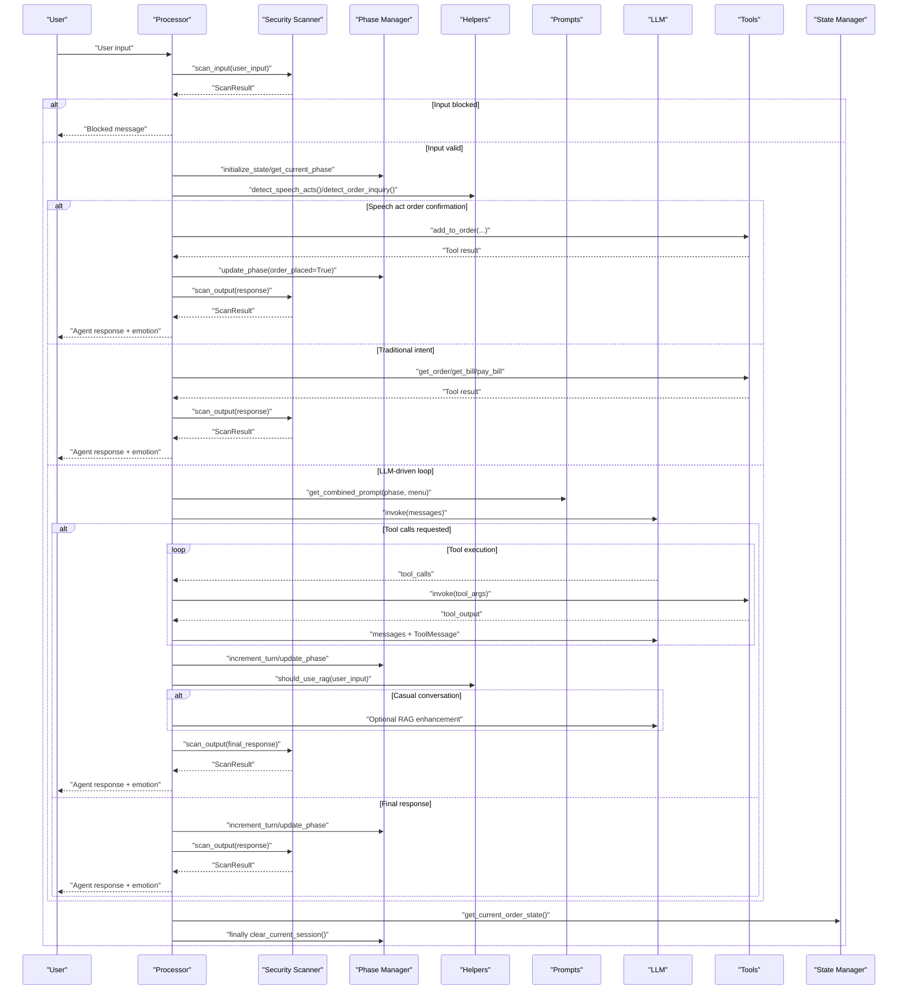
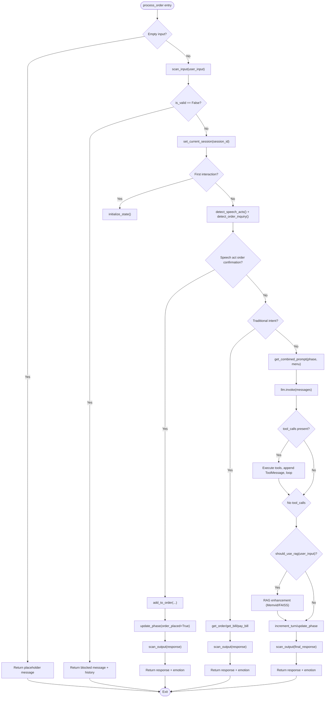
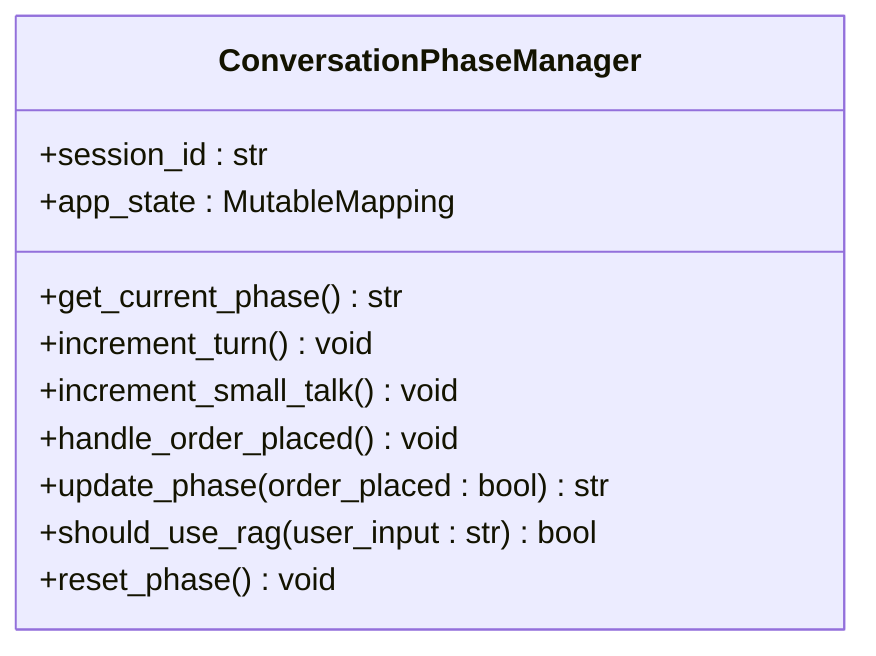
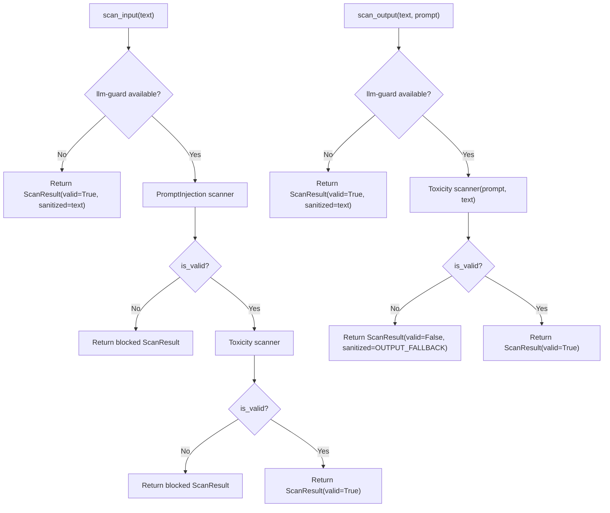
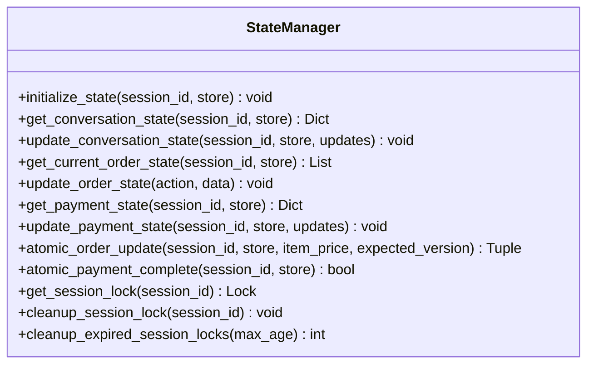
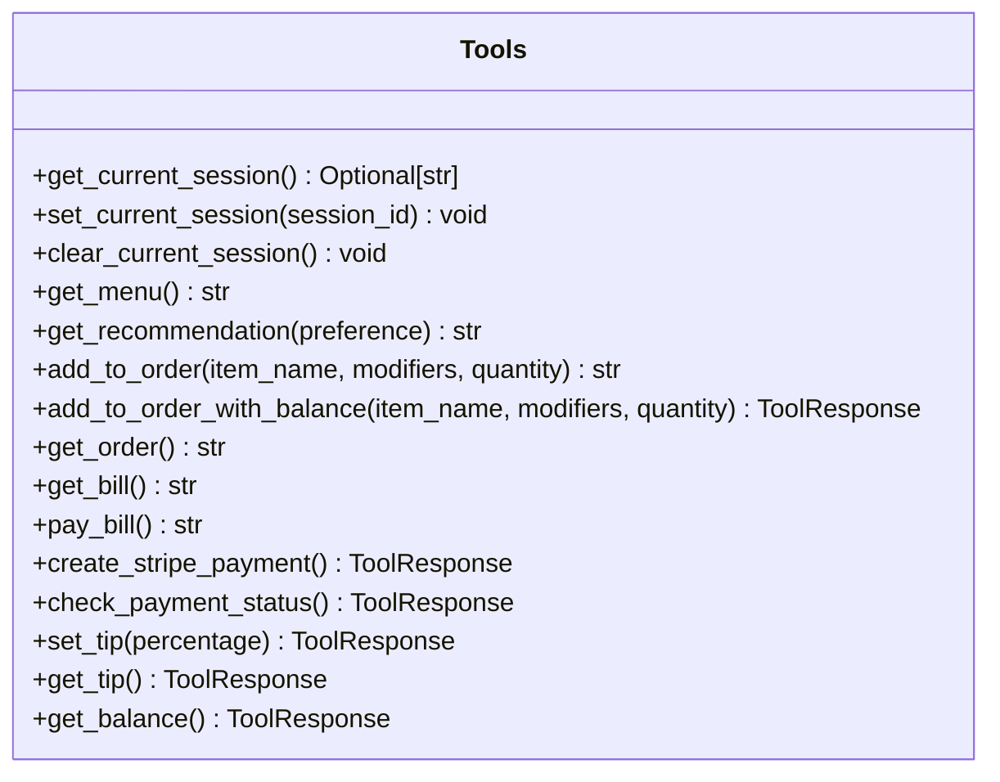
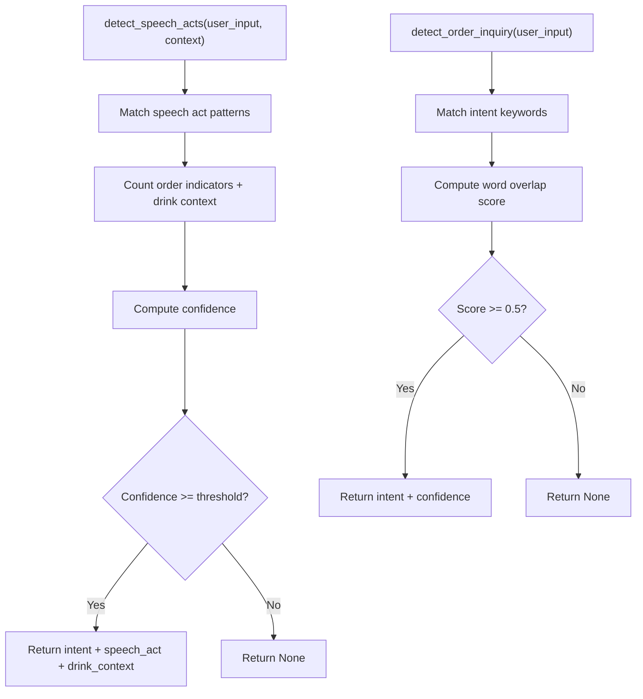
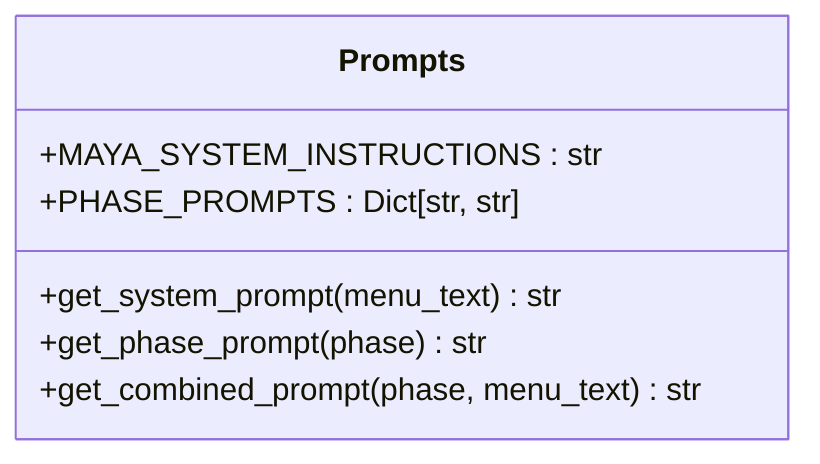
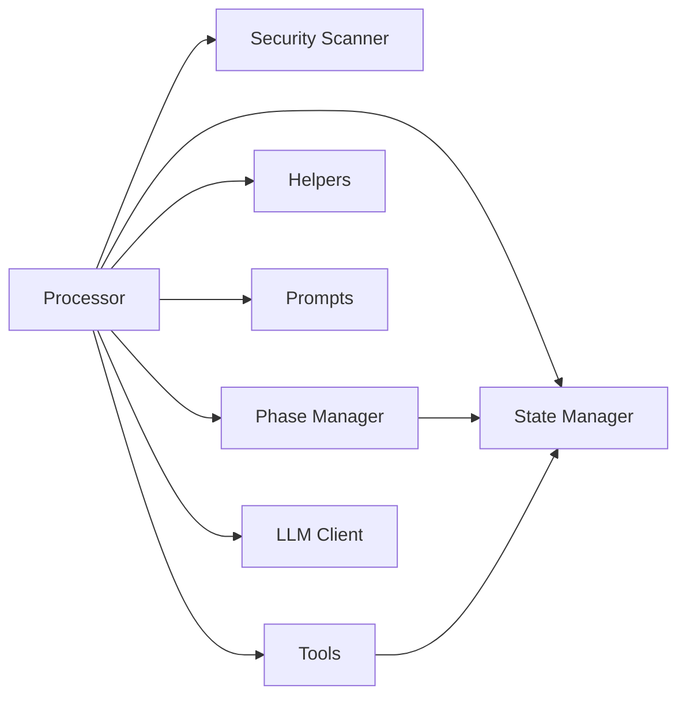

# Conversation Processing Architecture

<cite>
**Referenced Files in This Document**
- [processor.py](file://src/conversation/processor.py)
- [phase_manager.py](file://src/conversation/phase_manager.py)
- [scanner.py](file://src/security/scanner.py)
- [state_manager.py](file://src/utils/state_manager.py)
- [tools.py](file://src/llm/tools.py)
- [helpers.py](file://src/utils/helpers.py)
- [prompts.py](file://src/llm/prompts.py)
- [logging_config.py](file://src/config/logging_config.py)
- [errors.py](file://src/utils/errors.py)
- [test_processor_security.py](file://tests/test_processor_security.py)
- [test_processor_rag.py](file://tests/test_processor_rag.py)
- [test_speech_acts.py](file://tests/test_speech_acts.py)
- [test_session_context.py](file://tests/test_session_context.py)
</cite>

## Table of Contents
1. [Introduction](#introduction)
2. [Project Structure](#project-structure)
3. [Core Components](#core-components)
4. [Architecture Overview](#architecture-overview)
5. [Detailed Component Analysis](#detailed-component-analysis)
6. [Dependency Analysis](#dependency-analysis)
7. [Performance Considerations](#performance-considerations)
8. [Troubleshooting Guide](#troubleshooting-guide)
9. [Conclusion](#conclusion)

## Introduction
This document describes the conversation processing architecture for MayaMCP’s multi-layered processing pipeline. It explains how the processor orchestrates input security scanning, phase management, intent detection, and tool execution. It documents the conversation flow from user input through security validation, phase determination, LLM interaction loops, and state updates. It details the dual-intent detection system combining speech act analysis and traditional intent matching, the tool call execution pattern, and how the system handles both direct tool invocation and LLM-guided tool selection. It also covers conversation state management, including session context, turn counts, and phase transitions, along with error handling strategies, graceful fallbacks, and security integration.

## Project Structure
The conversation processing system is composed of several cohesive modules:
- Processor: Orchestrates the end-to-end conversation flow, integrates security, phase management, and tool execution.
- Phase Manager: Manages conversation phases and state transitions.
- Security Scanner: Provides input and output scanning with configurable thresholds and graceful fallbacks.
- State Manager: Centralizes session state, order history, and payment state with thread-safe operations.
- Tools: LLM tools for menu, ordering, payment, and recommendations.
- Helpers: Utilities for intent detection, speech act analysis, and casual conversation classification.
- Prompts: System and phase-specific prompts for the LLM.
- Logging and Errors: Shared logging and error classification utilities.

**Diagram sources**
- [processor.py](file://src/conversation/processor.py#L83-L456)
- [phase_manager.py](file://src/conversation/phase_manager.py#L10-L92)
- [scanner.py](file://src/security/scanner.py#L32-L137)
- [state_manager.py](file://src/utils/state_manager.py#L394-L523)
- [tools.py](file://src/llm/tools.py#L1-L1066)
- [helpers.py](file://src/utils/helpers.py#L9-L265)
- [prompts.py](file://src/llm/prompts.py#L73-L87)

**Section sources**
- [processor.py](file://src/conversation/processor.py#L1-L456)
- [phase_manager.py](file://src/conversation/phase_manager.py#L1-L92)
- [scanner.py](file://src/security/scanner.py#L1-L137)
- [state_manager.py](file://src/utils/state_manager.py#L1-L814)
- [tools.py](file://src/llm/tools.py#L1-L1066)
- [helpers.py](file://src/utils/helpers.py#L1-L265)
- [prompts.py](file://src/llm/prompts.py#L1-L87)

## Core Components
- Processor: The central orchestrator that performs security scanning, intent detection, builds prompts, manages LLM loops, executes tools, updates state, and applies output security filtering.
- Phase Manager: Encapsulates conversation phase transitions, turn counting, and small talk counters, integrating with state manager.
- Security Scanner: Provides input and output scanning with configurable thresholds and graceful fallbacks when llm-guard is unavailable.
- State Manager: Provides thread-safe session state management for conversation, order history, current order, and payment state.
- Tools: A registry of LLM tools for menu retrieval, recommendations, ordering, payment, and tip management with session-awareness.
- Helpers: Dual-intent detection system (speech acts + traditional intent matching) and casual conversation classification.
- Prompts: System and phase-specific prompts injected into the LLM context.
- Logging and Errors: Consistent logging and error classification utilities.

**Section sources**
- [processor.py](file://src/conversation/processor.py#L83-L456)
- [phase_manager.py](file://src/conversation/phase_manager.py#L10-L92)
- [scanner.py](file://src/security/scanner.py#L32-L137)
- [state_manager.py](file://src/utils/state_manager.py#L394-L523)
- [tools.py](file://src/llm/tools.py#L1-L1066)
- [helpers.py](file://src/utils/helpers.py#L9-L265)
- [prompts.py](file://src/llm/prompts.py#L73-L87)
- [logging_config.py](file://src/config/logging_config.py#L1-L51)
- [errors.py](file://src/utils/errors.py#L1-L39)

## Architecture Overview
The conversation processing pipeline follows a layered, defensive design:
- Input Security: Validates user input before any processing.
- Intent Detection: Uses dual-intent detection (speech acts and traditional intent) to decide processing mode.
- Phase Management: Determines conversation phase and updates counters.
- LLM Interaction Loop: Sends combined prompts and history, receives text or tool-call requests, executes tools, and repeats until final response.
- RAG Enhancement: Optionally enhances casual conversation responses with Memvid or FAISS pipelines.
- Output Security: Applies output scanning and sanitization.
- State Updates: Updates conversation state, order state, and payment state.
- Session Context: Ensures thread-safe session context for tools and cleans up after processing.

**Diagram sources**
- [processor.py](file://src/conversation/processor.py#L103-L456)
- [scanner.py](file://src/security/scanner.py#L32-L137)
- [phase_manager.py](file://src/conversation/phase_manager.py#L18-L92)
- [helpers.py](file://src/utils/helpers.py#L9-L265)
- [prompts.py](file://src/llm/prompts.py#L73-L87)
- [tools.py](file://src/llm/tools.py#L1-L1066)
- [state_manager.py](file://src/utils/state_manager.py#L420-L425)

## Detailed Component Analysis

### Processor: Orchestrator of Conversation Flow
The processor coordinates the entire conversation pipeline:
- Input security scanning with graceful fallbacks.
- Session context management for tools.
- Dual-intent detection: speech act analysis and traditional intent matching.
- LLM interaction loop with tool-call handling and RAG enhancement for casual conversation.
- Output security scanning and emotion parsing.
- State updates for conversation, order, and payment.
- Robust error handling with safe fallbacks and cleanup.

Key responsibilities:
- Security gating: Blocks malicious inputs and sanitizes outputs.
- Intent routing: Chooses direct tool invocation vs. LLM-driven loop.
- Tool orchestration: Executes tools with validated parameters and maps results to user-facing responses.
- Phase transitions: Updates turn counts and determines next phase.
- RAG enhancement: Enhances casual conversation responses when available.
- Emotion tagging: Parses internal emotion tags from responses for avatar control.

**Diagram sources**
- [processor.py](file://src/conversation/processor.py#L83-L456)

**Section sources**
- [processor.py](file://src/conversation/processor.py#L83-L456)

### Phase Manager: Conversation Phase Control
The phase manager encapsulates:
- Getting and updating the current phase.
- Incrementing turn counts and small talk counters.
- Handling order placement events and resetting small talk counters.
- Determining next phase based on state and actions.
- Deciding when to use RAG for casual conversation.

**Diagram sources**
- [phase_manager.py](file://src/conversation/phase_manager.py#L10-L92)

**Section sources**
- [phase_manager.py](file://src/conversation/phase_manager.py#L10-L92)

### Security Scanner: Input and Output Protection
The security scanner provides:
- Input scanning for prompt injection and toxicity with configurable thresholds.
- Output scanning for toxicity with a fallback message.
- Graceful fallbacks when llm-guard is unavailable or fails.
- Structured results with validity flags and sanitized text.

**Diagram sources**
- [scanner.py](file://src/security/scanner.py#L32-L137)

**Section sources**
- [scanner.py](file://src/security/scanner.py#L1-L137)

### State Manager: Thread-Safe Session State
The state manager provides:
- Initialization and reset of session state.
- Conversation state updates (turn count, phase, small talk count).
- Order state updates (add item, place order, clear order, add tip, pay bill).
- Payment state management with validation, atomic operations, and optimistic locking.
- Thread-safe session locks with expiration and cleanup.

**Diagram sources**
- [state_manager.py](file://src/utils/state_manager.py#L394-L814)

**Section sources**
- [state_manager.py](file://src/utils/state_manager.py#L1-L814)

### Tools: LLM Tool Registry and Execution
The tools module defines:
- Tool registry with session-awareness via thread-local storage.
- Payment tools (create_stripe_payment, check_payment_status, set_tip, get_tip, get_balance).
- Order tools (add_to_order, add_to_order_with_balance, get_order, get_bill, pay_bill).
- Menu and recommendation tools.
- Atomic operations for payment state with validation and optimistic locking.

**Diagram sources**
- [tools.py](file://src/llm/tools.py#L1-L1066)

**Section sources**
- [tools.py](file://src/llm/tools.py#L1-L1066)

### Helpers: Dual-Intent Detection and Casual Conversation Classification
The helpers module provides:
- Speech act detection using Austin’s framework to identify commissives, assertives, and directives.
- Traditional intent detection for order, bill, and payment requests.
- Casual conversation classification to gate RAG enhancement.
- Drink context extraction from conversation history.

**Diagram sources**
- [helpers.py](file://src/utils/helpers.py#L9-L265)

**Section sources**
- [helpers.py](file://src/utils/helpers.py#L1-L265)

### Prompts: System and Phase-Specific Instructions
The prompts module provides:
- System instructions for Maya’s behavior and tool usage.
- Phase-specific prompts for greeting, order taking, small talk, and reorder prompting.
- Combined prompt construction for LLM context.

**Diagram sources**
- [prompts.py](file://src/llm/prompts.py#L1-L87)

**Section sources**
- [prompts.py](file://src/llm/prompts.py#L1-L87)

## Dependency Analysis
The processor depends on:
- Security scanner for input/output validation.
- Phase manager for conversation state transitions.
- Helpers for intent detection and casual conversation classification.
- Prompts for constructing LLM context.
- Tools for executing actions and retrieving data.
- State manager for persistent session state.
- Logging for consistent diagnostics.

**Diagram sources**
- [processor.py](file://src/conversation/processor.py#L18-L29)
- [phase_manager.py](file://src/conversation/phase_manager.py#L3-L6)
- [scanner.py](file://src/security/scanner.py#L1-L7)
- [state_manager.py](file://src/utils/state_manager.py#L1-L11)
- [tools.py](file://src/llm/tools.py#L1-L27)
- [helpers.py](file://src/utils/helpers.py#L1-L7)
- [prompts.py](file://src/llm/prompts.py#L1-L4)

**Section sources**
- [processor.py](file://src/conversation/processor.py#L18-L29)
- [phase_manager.py](file://src/conversation/phase_manager.py#L3-L6)
- [scanner.py](file://src/security/scanner.py#L1-L7)
- [state_manager.py](file://src/utils/state_manager.py#L1-L11)
- [tools.py](file://src/llm/tools.py#L1-L27)
- [helpers.py](file://src/utils/helpers.py#L1-L7)
- [prompts.py](file://src/llm/prompts.py#L1-L4)

## Performance Considerations
- Early exits: Empty input and blocked inputs short-circuit expensive processing.
- Lazy imports: RAG pipelines are imported conditionally to reduce cold-start overhead.
- Defensive RAG: Availability checks and safe length checks prevent unnecessary heavy computation and ensure robustness.
- Thread-safe state: Session locks minimize contention and prevent race conditions.
- Graceful fallbacks: Security scanning and RAG enhancements fail open to preserve availability.

[No sources needed since this section provides general guidance]

## Troubleshooting Guide
Common issues and resolutions:
- Input blocked by security scanner: Review blocked reasons and adjust thresholds or sanitize inputs.
- Tool invocation failures: Validate tool parameters and ensure tools are registered; check session context for session-aware tools.
- LLM invocation errors: Inspect error classification and apply retries or fallbacks.
- RAG enhancement failures: Verify pipeline availability and document collections; ensure safe length checks.
- Session context leaks: Confirm session context is cleared in finally blocks.

Validation via tests:
- Security gating: Input injection and output toxicity blocking verified.
- RAG fallbacks: Missing components and non-sized responses handled safely.
- Speech act detection: Confidence scoring and context extraction validated.
- Session context lifecycle: Thread isolation and cleanup verified.

**Section sources**
- [test_processor_security.py](file://tests/test_processor_security.py#L1-L81)
- [test_processor_rag.py](file://tests/test_processor_rag.py#L1-L83)
- [test_speech_acts.py](file://tests/test_speech_acts.py#L1-L163)
- [test_session_context.py](file://tests/test_session_context.py#L1-L242)
- [errors.py](file://src/utils/errors.py#L11-L39)

## Conclusion
MayaMCP’s conversation processing system integrates security, intent detection, phase management, LLM-driven loops, and robust state management into a cohesive pipeline. The dual-intent detection system improves accuracy for order-related interactions, while the tool execution pattern supports both direct invocations and LLM-guided selections. The system emphasizes resilience through security scanning, graceful fallbacks, and thread-safe state management, ensuring a reliable and user-friendly conversational experience.