# Core Architecture

<cite>
**Referenced Files in This Document**
- [src/__init__.py](file://src/__init__.py)
- [src/conversation/processor.py](file://src/conversation/processor.py)
- [src/conversation/phase_manager.py](file://src/conversation/phase_manager.py)
- [src/ui/launcher.py](file://src/ui/launcher.py)
- [src/ui/handlers.py](file://src/ui/handlers.py)
- [src/llm/client.py](file://src/llm/client.py)
- [src/llm/tools.py](file://src/llm/tools.py)
- [src/rag/pipeline.py](file://src/rag/pipeline.py)
- [src/security/scanner.py](file://src/security/scanner.py)
- [src/payments/stripe_mcp.py](file://src/payments/stripe_mcp.py)
- [src/voice/tts.py](file://src/voice/tts.py)
- [src/utils/state_manager.py](file://src/utils/state_manager.py)
- [src/utils/helpers.py](file://src/utils/helpers.py)
- [src/config/model_config.py](file://src/config/model_config.py)
- [src/config/logging_config.py](file://src/config/logging_config.py)
</cite>

## Table of Contents
1. [Introduction](#introduction)
2. [Project Structure](#project-structure)
3. [Core Components](#core-components)
4. [Architecture Overview](#architecture-overview)
5. [Detailed Component Analysis](#detailed-component-analysis)
6. [Dependency Analysis](#dependency-analysis)
7. [Performance Considerations](#performance-considerations)
8. [Troubleshooting Guide](#troubleshooting-guide)
9. [Conclusion](#conclusion)
10. [Appendices](#appendices)

## Introduction
This document describes the core system design of MayaMCP, a layered conversational AI bartender application. The architecture centers on a UI layer that captures user inputs, a conversation processing layer orchestrating LLM integration and tool execution, and a state management layer that maintains conversation context, payment state, and user session data. The system adopts the Model Context Protocol (MCP) for external integrations, supports dual RAG backends (video-based Memvid and FAISS), and integrates real-time audio synthesis via Cartesia. Cross-cutting concerns include robust error handling, graceful fallbacks, and observability.

## Project Structure
MayaNCP follows a feature-based, layered organization:
- UI Layer: Gradio-based launcher and handlers manage user events, state, and audio playback.
- Conversation Layer: Orchestrates LLM interactions, tool execution, and RAG augmentation.
- LLM Integration: Gemini client and tool registry enable function-calling conversations.
- RAG Layer: Dual pipelines for Memvid and FAISS-backed retrieval-augmented generation.
- Security: Input/output scanning with configurable policies.
- Payments: Stripe MCP client with retry, fallback, and idempotency.
- Voice: Text-to-speech with Cartesia and retry logic.
- Utilities: State management, helpers, and configuration.

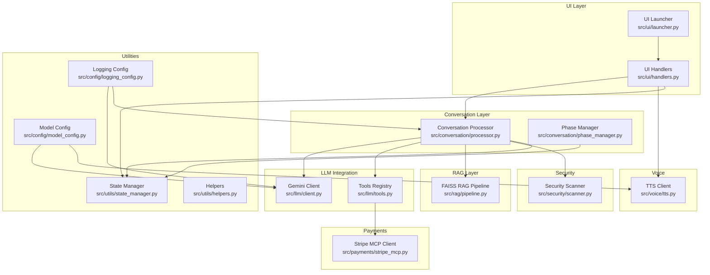

**Diagram sources**
- [src/ui/launcher.py](file://src/ui/launcher.py#L49-L354)
- [src/ui/handlers.py](file://src/ui/handlers.py#L23-L392)
- [src/conversation/processor.py](file://src/conversation/processor.py#L1-L456)
- [src/conversation/phase_manager.py](file://src/conversation/phase_manager.py#L1-L92)
- [src/llm/client.py](file://src/llm/client.py#L1-L211)
- [src/llm/tools.py](file://src/llm/tools.py#L1-L1066)
- [src/rag/pipeline.py](file://src/rag/pipeline.py#L1-L105)
- [src/security/scanner.py](file://src/security/scanner.py#L1-L137)
- [src/payments/stripe_mcp.py](file://src/payments/stripe_mcp.py#L1-L475)
- [src/voice/tts.py](file://src/voice/tts.py#L1-L200)
- [src/utils/state_manager.py](file://src/utils/state_manager.py#L1-L814)
- [src/utils/helpers.py](file://src/utils/helpers.py#L1-L265)
- [src/config/model_config.py](file://src/config/model_config.py#L1-L102)
- [src/config/logging_config.py](file://src/config/logging_config.py#L1-L51)

**Section sources**
- [src/__init__.py](file://src/__init__.py#L1-L9)
- [src/ui/launcher.py](file://src/ui/launcher.py#L49-L354)
- [src/ui/handlers.py](file://src/ui/handlers.py#L23-L392)
- [src/conversation/processor.py](file://src/conversation/processor.py#L1-L456)
- [src/conversation/phase_manager.py](file://src/conversation/phase_manager.py#L1-L92)
- [src/llm/client.py](file://src/llm/client.py#L1-L211)
- [src/llm/tools.py](file://src/llm/tools.py#L1-L1066)
- [src/rag/pipeline.py](file://src/rag/pipeline.py#L1-L105)
- [src/security/scanner.py](file://src/security/scanner.py#L1-L137)
- [src/payments/stripe_mcp.py](file://src/payments/stripe_mcp.py#L1-L475)
- [src/voice/tts.py](file://src/voice/tts.py#L1-L200)
- [src/utils/state_manager.py](file://src/utils/state_manager.py#L1-L814)
- [src/utils/helpers.py](file://src/utils/helpers.py#L1-L265)
- [src/config/model_config.py](file://src/config/model_config.py#L1-L102)
- [src/config/logging_config.py](file://src/config/logging_config.py#L1-L51)

## Core Components
- UI Layer: Provides the Gradio interface, manages session state, and routes user inputs to the conversation processor. It also handles tip interactions and renders avatar overlays reflecting payment state and emotion.
- Conversation Processor: Central orchestration engine that performs security scanning, intent detection, LLM/tool interaction loops, optional RAG augmentation, and state updates.
- LLM Integration: Initializes the Gemini model via LangChain, binds tools, and executes function calls with retries and error classification.
- Tools: A registry of payment and menu-related tools enabling atomic order updates, balance checks, tip management, and Stripe payment link creation/status polling.
- RAG Layer: Dual pipelines for retrieval-augmented generation using FAISS and Memvid backends, with graceful fallbacks and validation.
- Security: Input and output scanning with configurable thresholds and fail-open behavior.
- Payments: Stripe MCP client with availability probing, retry/backoff, idempotency, and mock fallback.
- Voice: Text-to-speech using Cartesia with retry logic, text cleaning, and pronunciation normalization.
- State Management: Thread-safe, session-scoped state with typed payment state, optimistic locking, and validation.
- Utilities: Helpers for speech act detection, phase transitions, and casual conversation detection.

**Section sources**
- [src/ui/launcher.py](file://src/ui/launcher.py#L49-L354)
- [src/ui/handlers.py](file://src/ui/handlers.py#L23-L392)
- [src/conversation/processor.py](file://src/conversation/processor.py#L1-L456)
- [src/llm/client.py](file://src/llm/client.py#L1-L211)
- [src/llm/tools.py](file://src/llm/tools.py#L1-L1066)
- [src/rag/pipeline.py](file://src/rag/pipeline.py#L1-L105)
- [src/security/scanner.py](file://src/security/scanner.py#L1-L137)
- [src/payments/stripe_mcp.py](file://src/payments/stripe_mcp.py#L1-L475)
- [src/voice/tts.py](file://src/voice/tts.py#L1-L200)
- [src/utils/state_manager.py](file://src/utils/state_manager.py#L1-L814)
- [src/utils/helpers.py](file://src/utils/helpers.py#L1-L265)

## Architecture Overview
MayaMCP employs a layered architecture:
- Presentation Layer: Gradio UI with stateful components and audio rendering.
- Application Layer: Conversation processor and handlers coordinate user events, LLM/tool execution, and RAG.
- Integration Layer: Gemini LLM, Stripe MCP, and Cartesia services.
- Persistence/State Layer: In-memory or distributed session store with typed validation and concurrency controls.

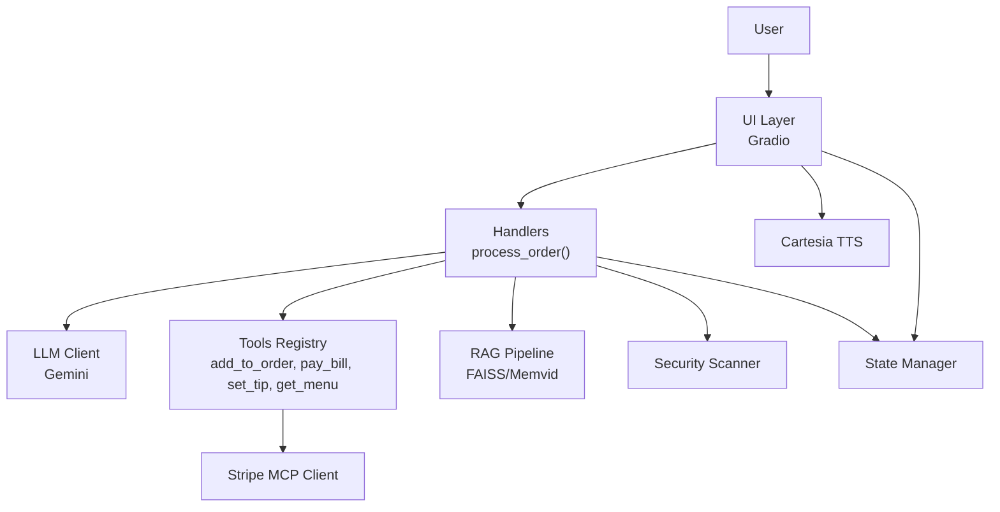

**Diagram sources**
- [src/ui/handlers.py](file://src/ui/handlers.py#L23-L392)
- [src/conversation/processor.py](file://src/conversation/processor.py#L1-L456)
- [src/llm/client.py](file://src/llm/client.py#L1-L211)
- [src/llm/tools.py](file://src/llm/tools.py#L1-L1066)
- [src/rag/pipeline.py](file://src/rag/pipeline.py#L1-L105)
- [src/security/scanner.py](file://src/security/scanner.py#L1-L137)
- [src/payments/stripe_mcp.py](file://src/payments/stripe_mcp.py#L1-L475)
- [src/voice/tts.py](file://src/voice/tts.py#L1-L200)
- [src/utils/state_manager.py](file://src/utils/state_manager.py#L1-L814)

## Detailed Component Analysis

### UI Layer: Gradio Launcher and Handlers
- The launcher creates the Gradio Blocks layout, defines session state variables, and wires event handlers for input submission, clearing state, and tip button interactions.
- The handlers implement the event-driven flow: parse session ID from the request, invoke the conversation processor, optionally generate voice audio via Cartesia, resolve avatar emotion states, and update the overlay with animated payment state.

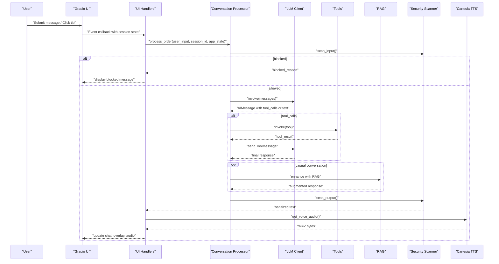

**Diagram sources**
- [src/ui/launcher.py](file://src/ui/launcher.py#L49-L354)
- [src/ui/handlers.py](file://src/ui/handlers.py#L23-L392)
- [src/conversation/processor.py](file://src/conversation/processor.py#L1-L456)
- [src/llm/client.py](file://src/llm/client.py#L1-L211)
- [src/llm/tools.py](file://src/llm/tools.py#L1-L1066)
- [src/rag/pipeline.py](file://src/rag/pipeline.py#L1-L105)
- [src/security/scanner.py](file://src/security/scanner.py#L1-L137)
- [src/voice/tts.py](file://src/voice/tts.py#L1-L200)

**Section sources**
- [src/ui/launcher.py](file://src/ui/launcher.py#L49-L354)
- [src/ui/handlers.py](file://src/ui/handlers.py#L23-L392)

### Conversation Processing: Orchestrator of LLM and Tools
- Security scanning wraps both input and output, with fail-open behavior and configurable thresholds.
- Intent detection leverages speech act analysis and keyword-based detection to route to tools or general LLM responses.
- The LLM/tool loop executes until a final text response is produced; tool results are appended back to the message history.
- Optional RAG augmentation is applied for casual conversation using either Memvid or FAISS pipelines, with defensive checks and fallbacks.
- State updates track conversation phase, turn counts, and order completion, updating the phase manager accordingly.

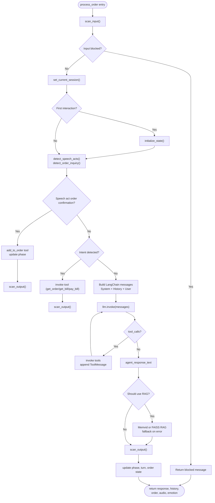

**Diagram sources**
- [src/conversation/processor.py](file://src/conversation/processor.py#L1-L456)
- [src/security/scanner.py](file://src/security/scanner.py#L1-L137)
- [src/utils/helpers.py](file://src/utils/helpers.py#L1-L265)
- [src/conversation/phase_manager.py](file://src/conversation/phase_manager.py#L1-L92)

**Section sources**
- [src/conversation/processor.py](file://src/conversation/processor.py#L1-L456)
- [src/utils/helpers.py](file://src/utils/helpers.py#L1-L265)
- [src/conversation/phase_manager.py](file://src/conversation/phase_manager.py#L1-L92)

### LLM Integration: Gemini Client and Tool Binding
- The Gemini client initializes the LangChain ChatGoogleGenerativeAI with model parameters from configuration, binds tools, and exposes a retry-wrapped API call.
- Tool binding enables the LLM to request tool invocations, which are executed synchronously within the processor’s loop.

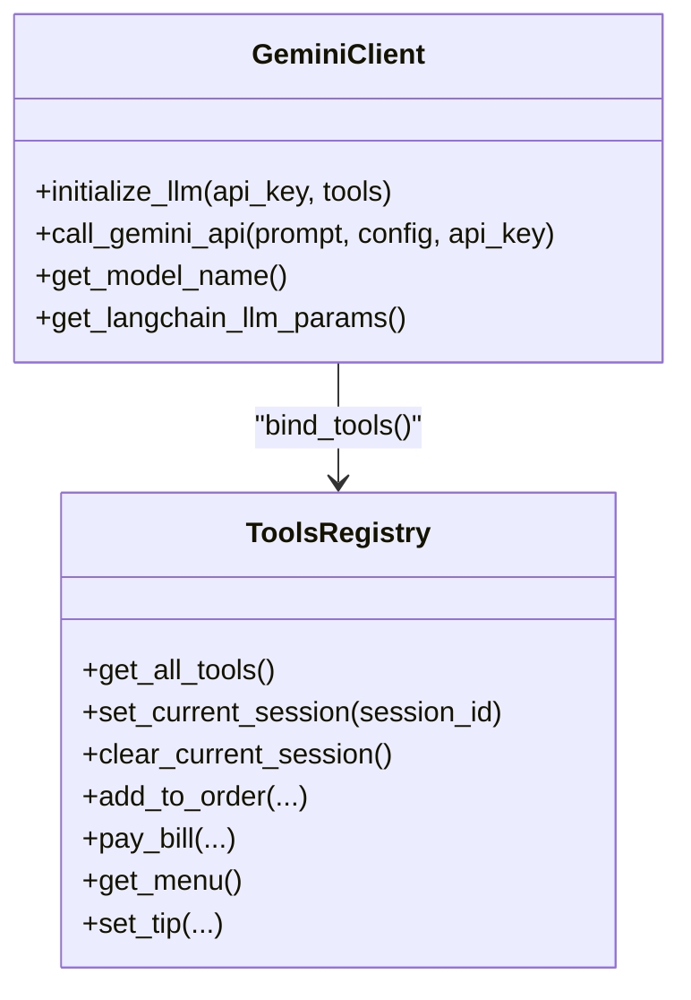

**Diagram sources**
- [src/llm/client.py](file://src/llm/client.py#L1-L211)
- [src/llm/tools.py](file://src/llm/tools.py#L1-L1066)

**Section sources**
- [src/llm/client.py](file://src/llm/client.py#L1-L211)
- [src/llm/tools.py](file://src/llm/tools.py#L1-L1066)

### RAG Layer: Dual Backends with Fallbacks
- The FAISS pipeline retrieves relevant passages and generates an augmented response using a configured Gemini model, with error classification and fallback messaging.
- The processor conditionally invokes Memvid or FAISS based on availability and configuration, with defensive checks and graceful degradation.

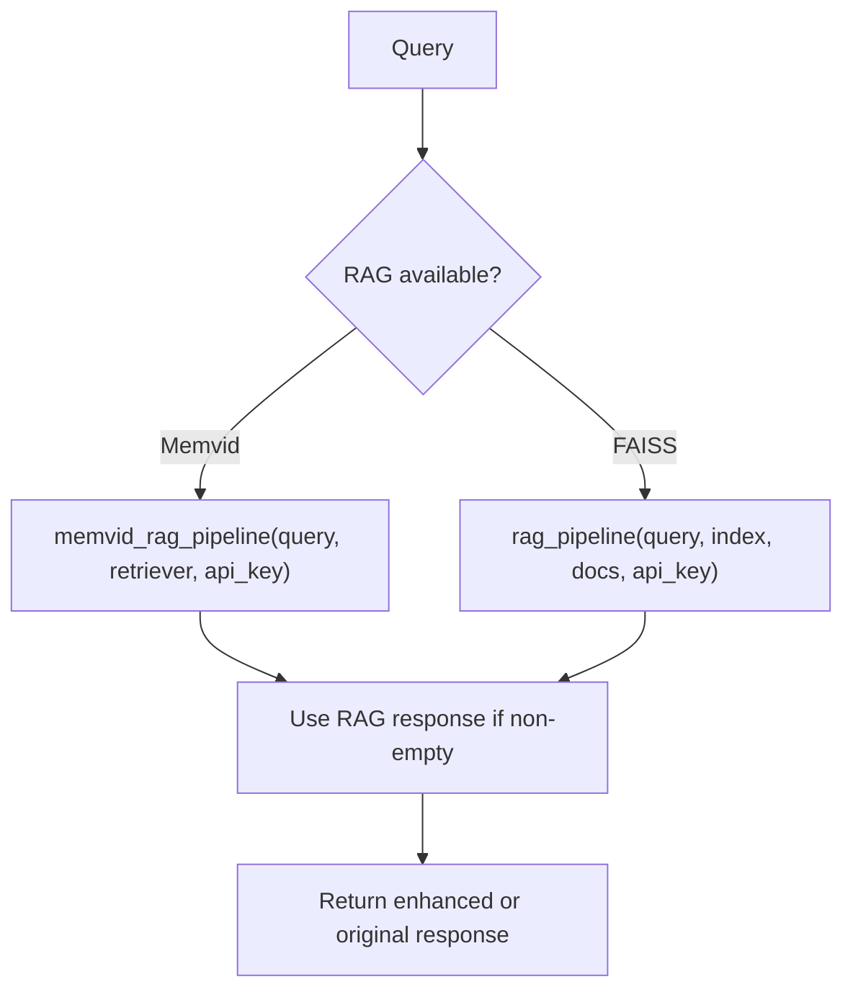

**Diagram sources**
- [src/conversation/processor.py](file://src/conversation/processor.py#L302-L362)
- [src/rag/pipeline.py](file://src/rag/pipeline.py#L1-L105)

**Section sources**
- [src/conversation/processor.py](file://src/conversation/processor.py#L302-L362)
- [src/rag/pipeline.py](file://src/rag/pipeline.py#L1-L105)

### Security Scanning: Input and Output
- Input scanning detects prompt injection and toxicity; output scanning filters toxic content and returns a safe fallback.
- The scanner is optional and falls back gracefully when dependencies are unavailable.

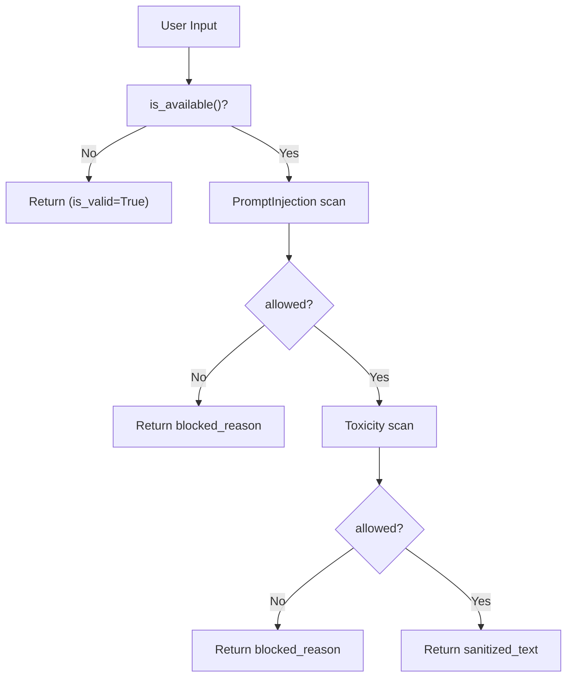

**Diagram sources**
- [src/security/scanner.py](file://src/security/scanner.py#L1-L137)

**Section sources**
- [src/security/scanner.py](file://src/security/scanner.py#L1-L137)

### Payments: Stripe MCP Client with Idempotency and Fallback
- The Stripe MCP client provides idempotent payment link creation, availability probing, and status polling with timeouts and retries.
- Fallback to mock payment is supported when the MCP server is unavailable, ensuring continuity of the user experience.

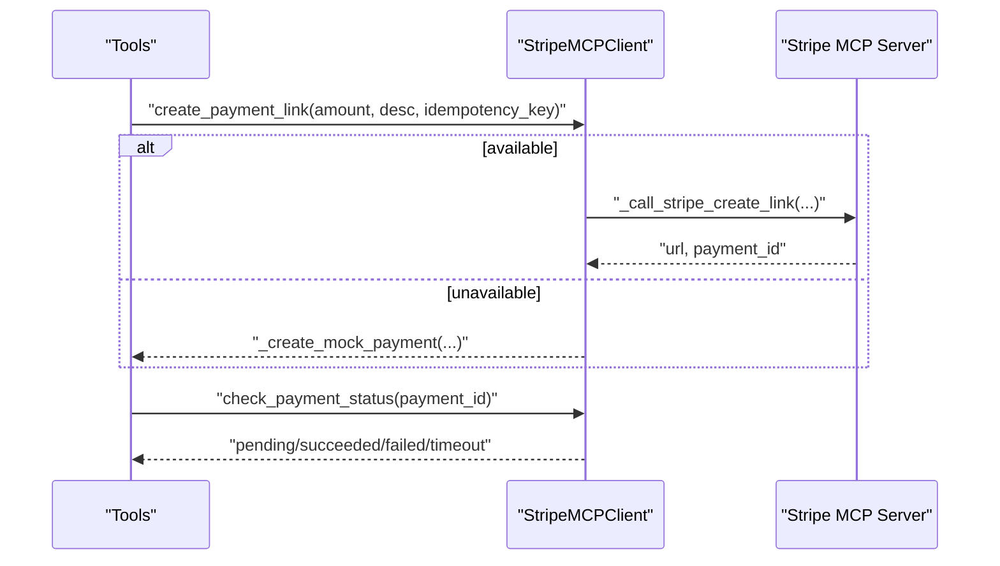

**Diagram sources**
- [src/llm/tools.py](file://src/llm/tools.py#L358-L472)
- [src/payments/stripe_mcp.py](file://src/payments/stripe_mcp.py#L183-L441)

**Section sources**
- [src/llm/tools.py](file://src/llm/tools.py#L358-L472)
- [src/payments/stripe_mcp.py](file://src/payments/stripe_mcp.py#L1-L475)

### Voice: Text-to-Speech with Retry and Cleaning
- The TTS client cleans text for pronunciation, initializes Cartesia, and synthesizes WAV audio with retry logic for transient failures.

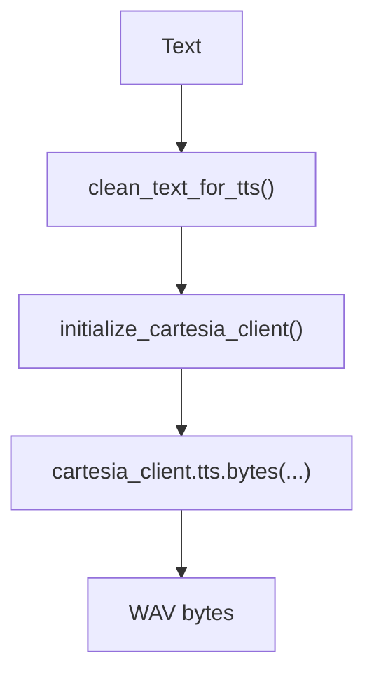

**Diagram sources**
- [src/voice/tts.py](file://src/voice/tts.py#L1-L200)

**Section sources**
- [src/voice/tts.py](file://src/voice/tts.py#L1-L200)

### State Management: Typed, Thread-Safe Sessions
- The state manager defines a typed payment state schema, enforces validation, and provides atomic operations with optimistic locking and versioning.
- Session locks prevent concurrent modifications, and background cleanup removes stale locks.

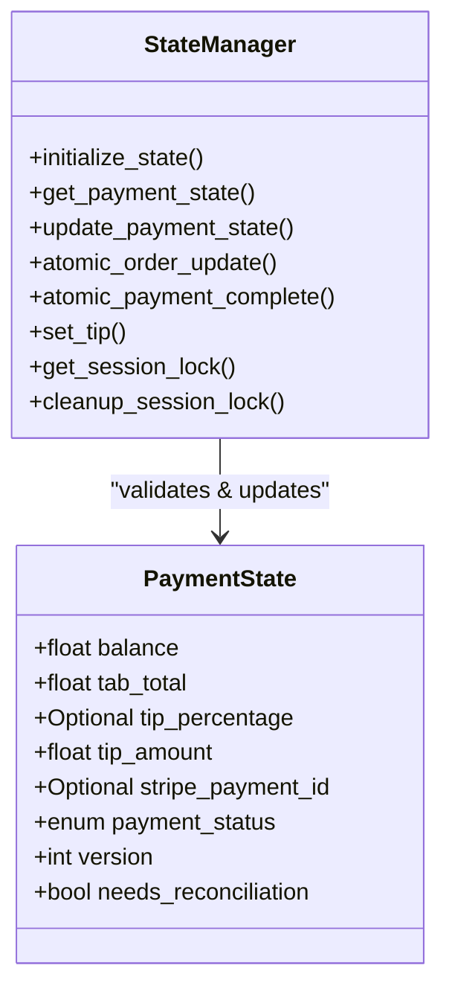

**Diagram sources**
- [src/utils/state_manager.py](file://src/utils/state_manager.py#L17-L814)

**Section sources**
- [src/utils/state_manager.py](file://src/utils/state_manager.py#L1-L814)

### Helpers: Speech Acts and Phase Transitions
- Helpers detect speech acts (Austin’s framework), extract drink context, and determine whether input is casual conversation, guiding RAG usage and tool routing.

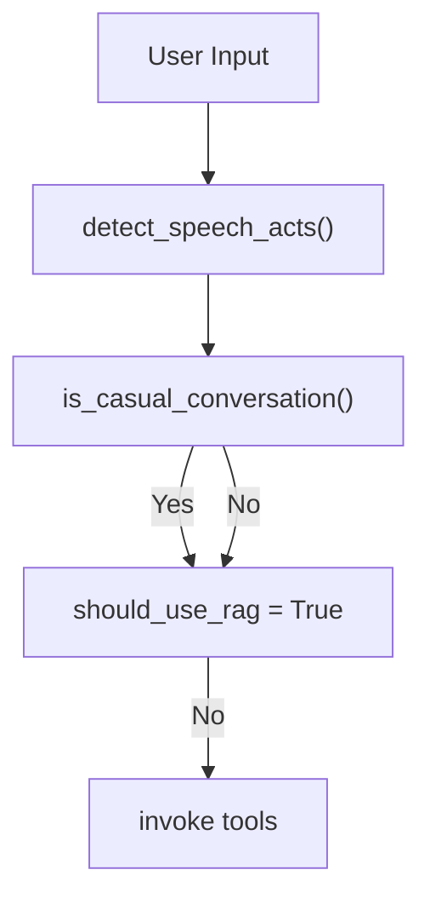

**Diagram sources**
- [src/utils/helpers.py](file://src/utils/helpers.py#L113-L265)
- [src/conversation/phase_manager.py](file://src/conversation/phase_manager.py#L69-L82)

**Section sources**
- [src/utils/helpers.py](file://src/utils/helpers.py#L1-L265)
- [src/conversation/phase_manager.py](file://src/conversation/phase_manager.py#L1-L92)

## Dependency Analysis
Key dependencies and coupling:
- UI handlers depend on the conversation processor and state manager; they optionally depend on TTS and security scanning.
- The conversation processor depends on LLM client, tools, RAG pipelines, security scanner, and state manager.
- Tools depend on state manager and Stripe MCP client.
- Configuration modules supply model and TTS parameters to clients.

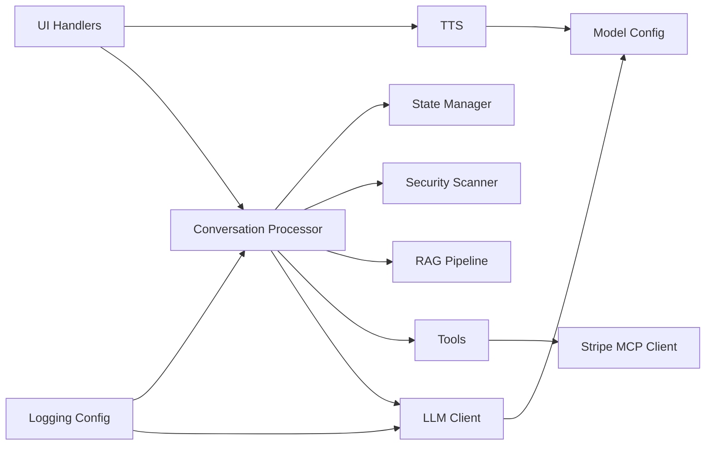

**Diagram sources**
- [src/ui/handlers.py](file://src/ui/handlers.py#L23-L392)
- [src/conversation/processor.py](file://src/conversation/processor.py#L1-L456)
- [src/llm/client.py](file://src/llm/client.py#L1-L211)
- [src/llm/tools.py](file://src/llm/tools.py#L1-L1066)
- [src/rag/pipeline.py](file://src/rag/pipeline.py#L1-L105)
- [src/security/scanner.py](file://src/security/scanner.py#L1-L137)
- [src/payments/stripe_mcp.py](file://src/payments/stripe_mcp.py#L1-L475)
- [src/voice/tts.py](file://src/voice/tts.py#L1-L200)
- [src/utils/state_manager.py](file://src/utils/state_manager.py#L1-L814)
- [src/config/model_config.py](file://src/config/model_config.py#L1-L102)
- [src/config/logging_config.py](file://src/config/logging_config.py#L1-L51)

**Section sources**
- [src/ui/handlers.py](file://src/ui/handlers.py#L23-L392)
- [src/conversation/processor.py](file://src/conversation/processor.py#L1-L456)
- [src/llm/client.py](file://src/llm/client.py#L1-L211)
- [src/llm/tools.py](file://src/llm/tools.py#L1-L1066)
- [src/rag/pipeline.py](file://src/rag/pipeline.py#L1-L105)
- [src/security/scanner.py](file://src/security/scanner.py#L1-L137)
- [src/payments/stripe_mcp.py](file://src/payments/stripe_mcp.py#L1-L475)
- [src/voice/tts.py](file://src/voice/tts.py#L1-L200)
- [src/utils/state_manager.py](file://src/utils/state_manager.py#L1-L814)
- [src/config/model_config.py](file://src/config/model_config.py#L1-L102)
- [src/config/logging_config.py](file://src/config/logging_config.py#L1-L51)

## Performance Considerations
- LLM retries: The Gemini client uses exponential backoff to mitigate transient failures.
- TTS retries: Cartesia calls are retried on retryable exceptions to improve reliability.
- RAG gating: The processor validates RAG availability and gracefully falls back if components are missing or fail.
- Concurrency: Session locks and optimistic locking minimize contention and race conditions in state updates.
- Observability: Logging is centralized and configurable, aiding performance diagnostics.

[No sources needed since this section provides general guidance]

## Troubleshooting Guide
- LLM Invocation Failures: The processor catches invocation errors and returns a friendly fallback response. Check logging for detailed error context.
- Tool Execution Errors: Malformed arguments or runtime errors are caught and reported; ensure tool signatures match expectations.
- RAG Failures: If RAG components are misconfigured or unavailable, the processor logs warnings and continues with the base response.
- Security Scanner Disabled: If llm-guard is not installed, scanning is disabled; install the dependency to enable input/output filtering.
- Stripe MCP Unavailable: The client falls back to mock payments; verify availability probing and retry behavior.
- TTS Failures: Text cleaning and retry logic mitigate common issues; verify Cartesia credentials and model configuration.
- State Corruption: Atomic operations and validation protect state integrity; inspect validation errors and version mismatches.

**Section sources**
- [src/conversation/processor.py](file://src/conversation/processor.py#L275-L452)
- [src/llm/tools.py](file://src/llm/tools.py#L386-L394)
- [src/rag/pipeline.py](file://src/rag/pipeline.py#L55-L58)
- [src/security/scanner.py](file://src/security/scanner.py#L20-L30)
- [src/payments/stripe_mcp.py](file://src/payments/stripe_mcp.py#L217-L272)
- [src/voice/tts.py](file://src/voice/tts.py#L133-L200)
- [src/utils/state_manager.py](file://src/utils/state_manager.py#L654-L677)

## Conclusion
MayaNCP’s layered architecture cleanly separates presentation, orchestration, integration, and persistence concerns. The event-driven UI feeds into a robust conversation processor that leverages LLM tooling, optional RAG augmentation, and strict state management. Cross-cutting concerns like security, payments, and voice synthesis are integrated with graceful fallbacks and observability. The MCP-based design positions MayaMCP for extensible integrations and reliable operation under varied conditions.

[No sources needed since this section summarizes without analyzing specific files]

## Appendices

### System Boundaries and External Integrations
- Google Gemini: LLM inference and tool binding via LangChain.
- Stripe MCP: Payment link creation, status polling, and fallback to mock payments.
- Cartesia: Real-time text-to-speech with retry and text normalization.

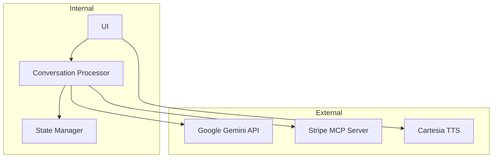

**Diagram sources**
- [src/llm/client.py](file://src/llm/client.py#L91-L129)
- [src/payments/stripe_mcp.py](file://src/payments/stripe_mcp.py#L183-L441)
- [src/voice/tts.py](file://src/voice/tts.py#L112-L132)