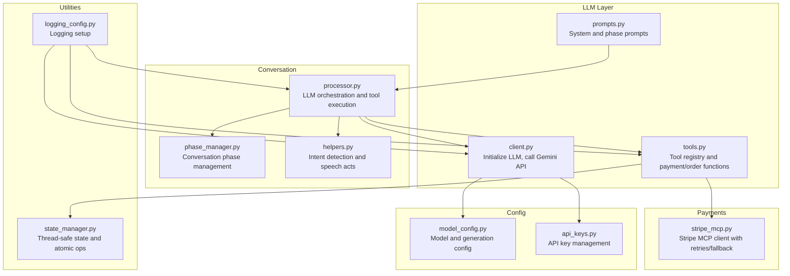
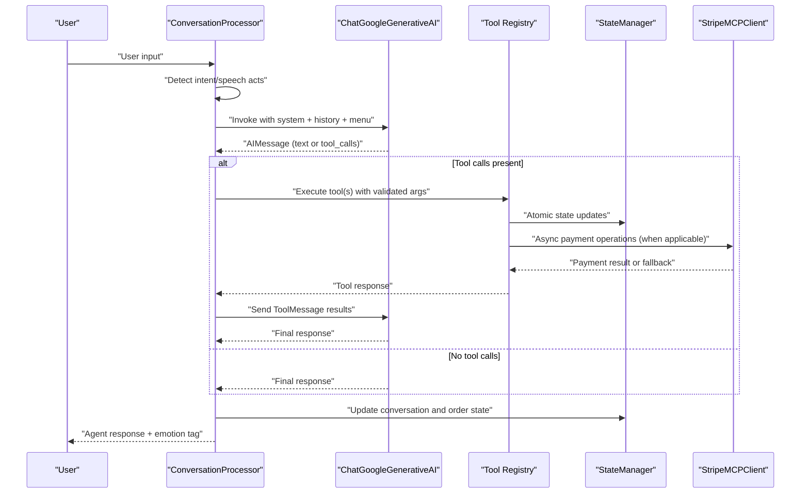
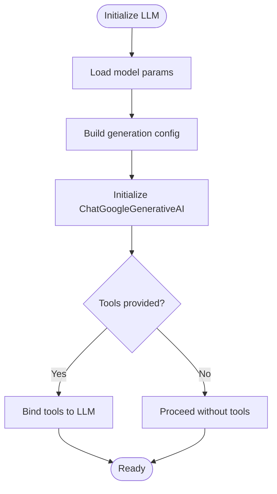
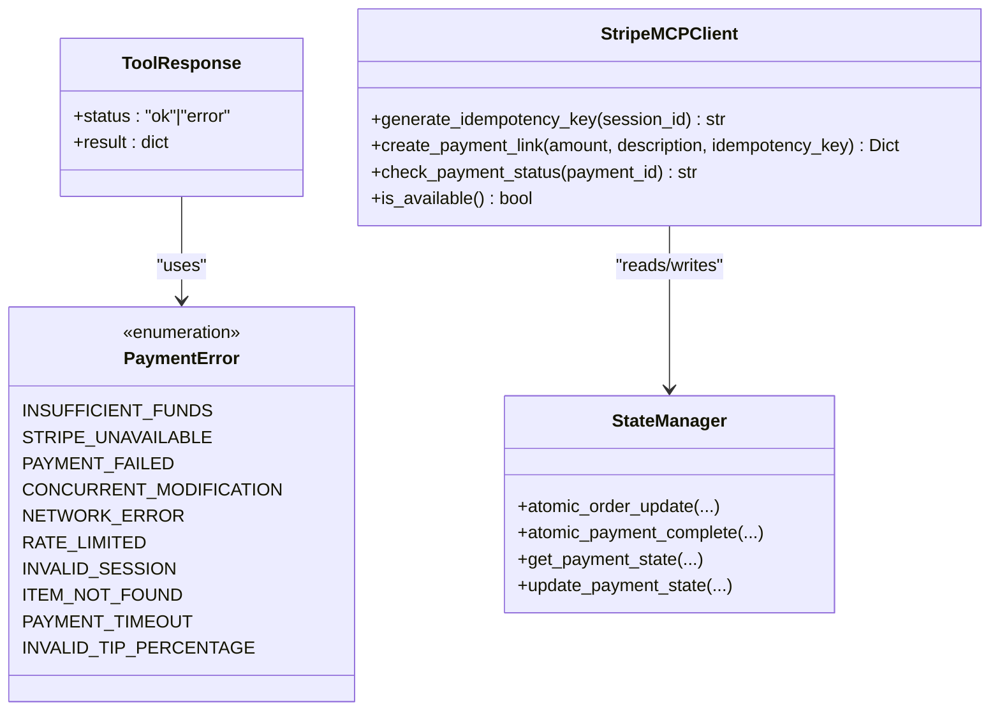
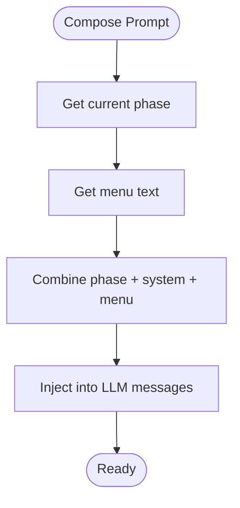
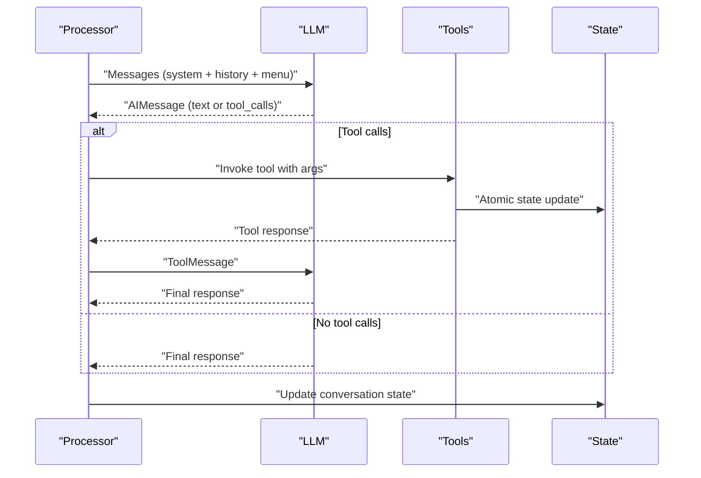
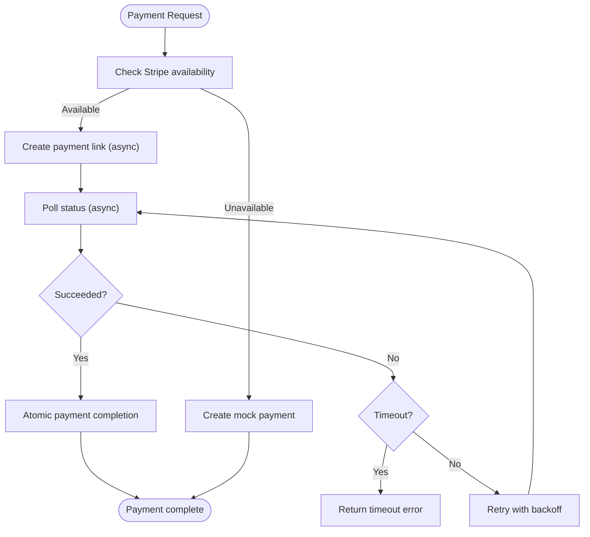
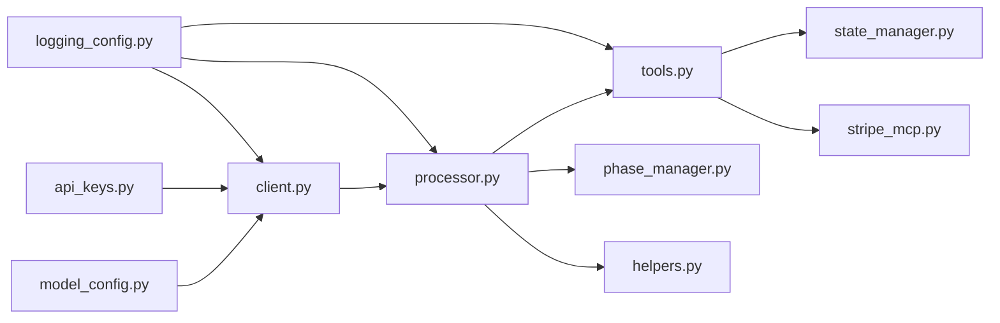

# LLM Integration Design

<cite>
**Referenced Files in This Document**
- [client.py](file://src/llm/client.py)
- [tools.py](file://src/llm/tools.py)
- [prompts.py](file://src/llm/prompts.py)
- [model_config.py](file://src/config/model_config.py)
- [api_keys.py](file://src/config/api_keys.py)
- [processor.py](file://src/conversation/processor.py)
- [phase_manager.py](file://src/conversation/phase_manager.py)
- [helpers.py](file://src/utils/helpers.py)
- [state_manager.py](file://src/utils/state_manager.py)
- [stripe_mcp.py](file://src/payments/stripe_mcp.py)
- [logging_config.py](file://src/config/logging_config.py)
- [test_llm_client.py](file://tests/test_llm_client.py)
- [test_llm_tools.py](file://tests/test_llm_tools.py)
</cite>

## Table of Contents
1. [Introduction](#introduction)
2. [Project Structure](#project-structure)
3. [Core Components](#core-components)
4. [Architecture Overview](#architecture-overview)
5. [Detailed Component Analysis](#detailed-component-analysis)
6. [Dependency Analysis](#dependency-analysis)
7. [Performance Considerations](#performance-considerations)
8. [Troubleshooting Guide](#troubleshooting-guide)
9. [Conclusion](#conclusion)

## Introduction
This document describes the LLM integration system for MayaMCP with a focus on the Google Gemini client configuration and tool calling architecture. It explains how the LLM client abstracts external API interactions and manages model parameters, documents the tool registry pattern used for payment processing, order management, and menu access functions, and details the prompt engineering strategy including phase-based prompting and context injection. It also covers the function calling mechanism enabling bidirectional communication between LLM responses and tool execution, including tool argument validation, error handling, and retry mechanisms. Finally, it addresses integration patterns for different tool types, model configuration, API key management, and fallback strategies for external service failures.

## Project Structure
The LLM integration spans several modules:
- LLM client and configuration: Google Gemini client initialization, model parameter mapping, and API call abstraction
- Tools registry: Payment, order, and menu functions exposed to the LLM
- Prompts: System instructions and phase-specific prompts
- Conversation processor: Orchestrates LLM calls, tool execution, and state updates
- Utilities: State management, helpers, and logging configuration
- Payments: Stripe MCP client with retry and fallback logic

**Diagram sources**
- [client.py](file://src/llm/client.py#L1-L211)
- [tools.py](file://src/llm/tools.py#L1-L1066)
- [prompts.py](file://src/llm/prompts.py#L1-L87)
- [processor.py](file://src/conversation/processor.py#L1-L456)
- [phase_manager.py](file://src/conversation/phase_manager.py#L1-L92)
- [helpers.py](file://src/utils/helpers.py#L1-L265)
- [state_manager.py](file://src/utils/state_manager.py#L1-L814)
- [stripe_mcp.py](file://src/payments/stripe_mcp.py#L1-L475)
- [model_config.py](file://src/config/model_config.py#L1-L102)
- [api_keys.py](file://src/config/api_keys.py#L1-L51)
- [logging_config.py](file://src/config/logging_config.py#L1-L51)

**Section sources**
- [client.py](file://src/llm/client.py#L1-L211)
- [tools.py](file://src/llm/tools.py#L1-L1066)
- [prompts.py](file://src/llm/prompts.py#L1-L87)
- [processor.py](file://src/conversation/processor.py#L1-L456)
- [phase_manager.py](file://src/conversation/phase_manager.py#L1-L92)
- [helpers.py](file://src/utils/helpers.py#L1-L265)
- [state_manager.py](file://src/utils/state_manager.py#L1-L814)
- [stripe_mcp.py](file://src/payments/stripe_mcp.py#L1-L475)
- [model_config.py](file://src/config/model_config.py#L1-L102)
- [api_keys.py](file://src/config/api_keys.py#L1-L51)
- [logging_config.py](file://src/config/logging_config.py#L1-L51)

## Core Components
- Google Gemini client abstraction: Initializes the LLM, binds tools, and wraps API calls with retry logic and error classification
- Tool registry pattern: Centralized tool definitions with typed responses and error codes, exposing payment, order, and menu functions
- Prompt engineering: System instructions and phase prompts guiding the LLM’s behavior and context injection
- Conversation processor: Orchestrates LLM/tool interactions, manages session context, and updates state
- State management: Thread-safe, validated state with atomic operations for concurrent safety
- Payment integration: Stripe MCP client with availability probing, retries, and fallback to simulated payments

**Section sources**
- [client.py](file://src/llm/client.py#L91-L129)
- [tools.py](file://src/llm/tools.py#L221-L800)
- [prompts.py](file://src/llm/prompts.py#L6-L87)
- [processor.py](file://src/conversation/processor.py#L83-L456)
- [state_manager.py](file://src/utils/state_manager.py#L17-L167)
- [stripe_mcp.py](file://src/payments/stripe_mcp.py#L66-L475)

## Architecture Overview
The system follows a layered architecture:
- Configuration layer: Model and API key management
- LLM client layer: Abstraction over Google Gemini with tool binding and retry logic
- Tools layer: Registry of functions callable by the LLM with validation and error handling
- Conversation layer: Orchestrates LLM/tool interactions, maintains conversation state, and applies phase-based prompting
- Utilities layer: State management, logging, and helper functions
- Payments layer: Stripe MCP client with robust retry and fallback strategies

**Diagram sources**
- [processor.py](file://src/conversation/processor.py#L275-L406)
- [client.py](file://src/llm/client.py#L130-L211)
- [tools.py](file://src/llm/tools.py#L221-L800)
- [state_manager.py](file://src/utils/state_manager.py#L685-L757)
- [stripe_mcp.py](file://src/payments/stripe_mcp.py#L183-L346)

## Detailed Component Analysis

### Google Gemini Client Configuration and API Abstraction
The client module encapsulates Google Gemini initialization, model parameter mapping, and API call abstraction with retry logic and error classification.

Key responsibilities:
- Configure the Google Generative AI SDK with an API key
- Build generation configuration from shared model parameters
- Initialize the LangChain ChatGoogleGenerativeAI instance and bind tools
- Wrap API calls with retry logic and classify errors (rate limit, auth, timeout)
- Provide a unified function to call the Gemini API with structured error handling

**Diagram sources**
- [client.py](file://src/llm/client.py#L91-L129)

**Section sources**
- [client.py](file://src/llm/client.py#L47-L129)
- [model_config.py](file://src/config/model_config.py#L31-L59)
- [api_keys.py](file://src/config/api_keys.py#L10-L51)

### Tool Registry Pattern and Function Calling Mechanism
The tools module defines a registry of functions callable by the LLM. Each tool:
- Is decorated as a LangChain tool
- Validates arguments and returns a standardized response structure
- Uses thread-local session context and a global store for state access
- Implements atomic operations for payment state updates
- Integrates with the Stripe MCP client for asynchronous payment processing

**Diagram sources**
- [tools.py](file://src/llm/tools.py#L36-L167)
- [stripe_mcp.py](file://src/payments/stripe_mcp.py#L66-L475)
- [state_manager.py](file://src/utils/state_manager.py#L685-L800)

**Section sources**
- [tools.py](file://src/llm/tools.py#L221-L800)
- [state_manager.py](file://src/utils/state_manager.py#L685-L800)
- [stripe_mcp.py](file://src/payments/stripe_mcp.py#L183-L441)

### Prompt Engineering Strategy: Phase-Based Prompting and Context Injection
The prompts module defines:
- System instructions emphasizing tool usage for orders and tips
- Phase-specific prompts for greeting, order-taking, small talk, and reorder prompts
- Combined prompt composition that injects the menu and current phase context

**Diagram sources**
- [prompts.py](file://src/llm/prompts.py#L44-L87)

**Section sources**
- [prompts.py](file://src/llm/prompts.py#L6-L87)
- [processor.py](file://src/conversation/processor.py#L244-L271)

### Conversation Orchestration and Bidirectional Communication
The conversation processor:
- Detects intents and speech acts to decide between direct tool invocation and LLM-driven responses
- Manages session context for tools and updates conversation state
- Executes tool calls, handles malformed arguments, and sends ToolMessage results back to the LLM
- Applies RAG enhancements for casual conversation when available

**Diagram sources**
- [processor.py](file://src/conversation/processor.py#L275-L406)
- [helpers.py](file://src/utils/helpers.py#L9-L70)

**Section sources**
- [processor.py](file://src/conversation/processor.py#L83-L456)
- [helpers.py](file://src/utils/helpers.py#L113-L210)
- [phase_manager.py](file://src/conversation/phase_manager.py#L42-L67)

### Payment Integration Patterns: Synchronous Operations, Asynchronous Payment Processing, and State-Managed Functions
- Synchronous operations: Balance checks and order additions use atomic state updates with optimistic locking
- Asynchronous payment processing: Stripe MCP client uses async retries and fallback to simulated payments
- State-managed functions: Payment state transitions are validated and persisted atomically

**Diagram sources**
- [stripe_mcp.py](file://src/payments/stripe_mcp.py#L183-L441)
- [state_manager.py](file://src/utils/state_manager.py#L780-L800)

**Section sources**
- [stripe_mcp.py](file://src/payments/stripe_mcp.py#L319-L346)
- [state_manager.py](file://src/utils/state_manager.py#L780-L800)

## Dependency Analysis
The LLM integration exhibits clear separation of concerns:
- LLM client depends on model configuration and API keys
- Tools depend on state management and payment clients
- Processor orchestrates LLM, tools, and state updates
- Helpers provide intent detection and speech act analysis
- Logging is centralized for consistent diagnostics

**Diagram sources**
- [client.py](file://src/llm/client.py#L1-L211)
- [tools.py](file://src/llm/tools.py#L1-L1066)
- [processor.py](file://src/conversation/processor.py#L1-L456)
- [state_manager.py](file://src/utils/state_manager.py#L1-L814)
- [stripe_mcp.py](file://src/payments/stripe_mcp.py#L1-L475)
- [model_config.py](file://src/config/model_config.py#L1-L102)
- [api_keys.py](file://src/config/api_keys.py#L1-L51)
- [logging_config.py](file://src/config/logging_config.py#L1-L51)

**Section sources**
- [client.py](file://src/llm/client.py#L1-L211)
- [tools.py](file://src/llm/tools.py#L1-L1066)
- [processor.py](file://src/conversation/processor.py#L1-L456)
- [state_manager.py](file://src/utils/state_manager.py#L1-L814)
- [stripe_mcp.py](file://src/payments/stripe_mcp.py#L1-L475)
- [model_config.py](file://src/config/model_config.py#L1-L102)
- [api_keys.py](file://src/config/api_keys.py#L1-L51)
- [logging_config.py](file://src/config/logging_config.py#L1-L51)

## Performance Considerations
- Retry and backoff: The Gemini client uses exponential backoff for transient failures, reducing load on external services
- Async payment operations: Stripe MCP client uses non-blocking async retries and polling to avoid blocking request threads
- Caching availability: Stripe MCP client caches availability results to reduce probe overhead
- Optimistic locking: Atomic state updates minimize contention and avoid repeated reads
- RAG gating: The processor validates RAG components before invoking expensive pipelines

[No sources needed since this section provides general guidance]

## Troubleshooting Guide
Common issues and resolutions:
- Authentication/authorization errors: Verify API keys and permissions; the client logs detailed error information
- Rate limiting: The client retries with exponential backoff; consider lowering request frequency or upgrading quotas
- Timeouts: Increase timeouts or reduce payload sizes; the client classifies timeouts and logs warnings
- Tool argument validation: Tools validate inputs and return structured errors; ensure arguments match expected types
- Payment failures: Stripe MCP falls back to simulated payments; monitor logs for detailed failure reasons
- State inconsistencies: Atomic operations and optimistic locking prevent concurrent modifications; check version mismatches

**Section sources**
- [client.py](file://src/llm/client.py#L170-L208)
- [stripe_mcp.py](file://src/payments/stripe_mcp.py#L217-L272)
- [state_manager.py](file://src/utils/state_manager.py#L685-L757)
- [tools.py](file://src/llm/tools.py#L139-L167)

## Conclusion
MayaMCP’s LLM integration provides a robust, modular architecture for conversational bartending assistance. The Google Gemini client abstraction simplifies external API interactions and model parameter management. The tool registry pattern cleanly exposes payment, order, and menu functions with strong validation and error handling. Phase-based prompting and context injection guide the LLM toward actionable tool calls. The conversation processor orchestrates bidirectional communication between LLM responses and tool execution, updating state atomically. Payment integration includes asynchronous processing with retries and fallbacks. Together, these components deliver a reliable, extensible system for AI-assisted bar operations.