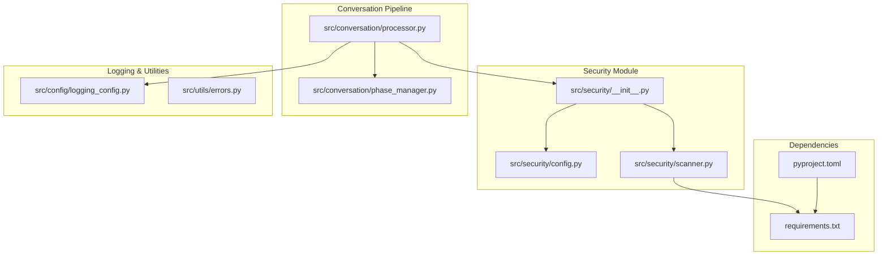
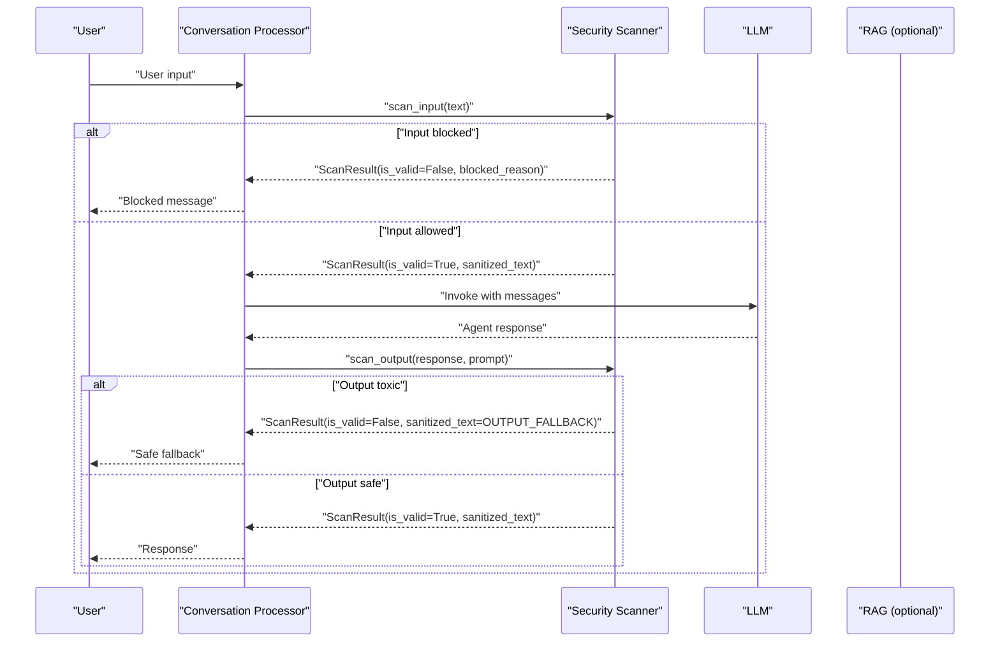
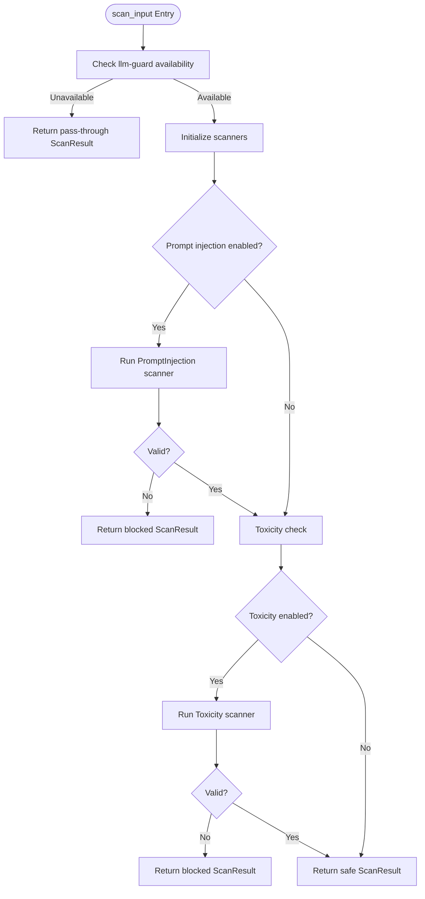
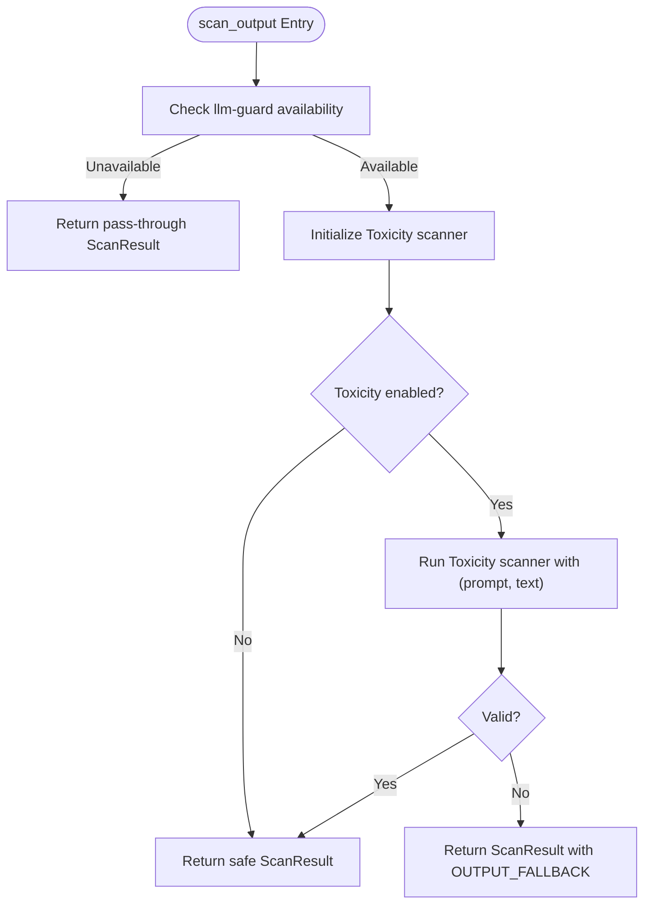
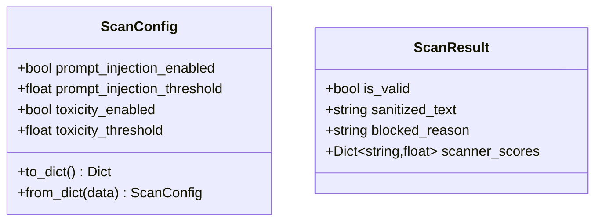
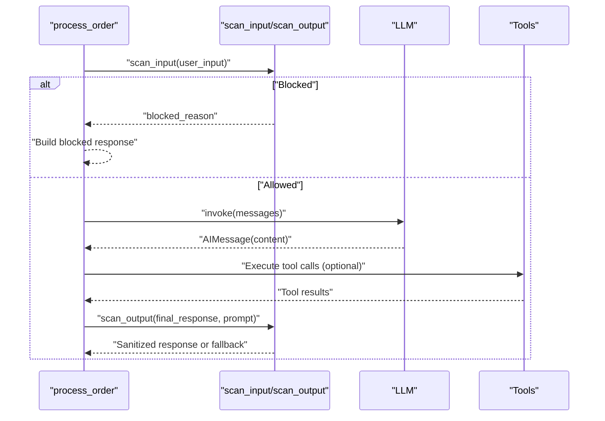
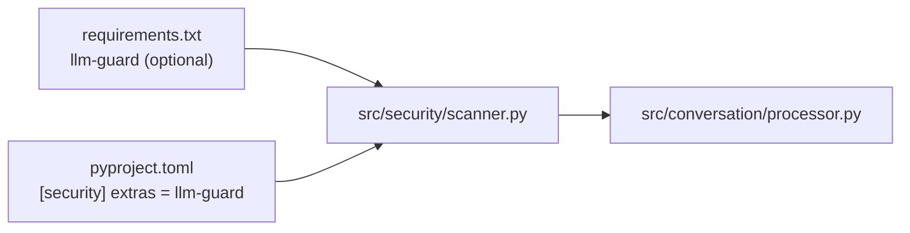

# Security Framework

<cite>
**Referenced Files in This Document**
- [src/security/__init__.py](file://src/security/__init__.py)
- [src/security/config.py](file://src/security/config.py)
- [src/security/scanner.py](file://src/security/scanner.py)
- [src/conversation/processor.py](file://src/conversation/processor.py)
- [src/conversation/phase_manager.py](file://src/conversation/phase_manager.py)
- [src/config/logging_config.py](file://src/config/logging_config.py)
- [src/utils/errors.py](file://src/utils/errors.py)
- [requirements.txt](file://requirements.txt)
- [pyproject.toml](file://pyproject.toml)
- [tests/test_security_scanner.py](file://tests/test_security_scanner.py)
- [tests/test_security_config.py](file://tests/test_security_config.py)
- [tests/test_processor_security.py](file://tests/test_processor_security.py)
</cite>

## Table of Contents
1. [Introduction](#introduction)
2. [Project Structure](#project-structure)
3. [Core Components](#core-components)
4. [Architecture Overview](#architecture-overview)
5. [Detailed Component Analysis](#detailed-component-analysis)
6. [Dependency Analysis](#dependency-analysis)
7. [Performance Considerations](#performance-considerations)
8. [Troubleshooting Guide](#troubleshooting-guide)
9. [Conclusion](#conclusion)

## Introduction
This document describes MayaMCP’s security framework, a multi-layered protection system that safeguards user interactions by validating inputs, filtering outputs, and preventing threats. The framework integrates tightly with the conversation processing pipeline to ensure safety without compromising user experience. It includes:
- Input scanning for prompt injection and toxicity
- Output filtering to prevent harmful content leakage
- Configurable thresholds and serialization
- Graceful degradation when security components are unavailable
- Logging and monitoring hooks for security events

## Project Structure
The security framework is organized under the security module and integrated into the conversation processor. Optional dependencies enable advanced scanning powered by llm-guard.

**Diagram sources**
- [src/security/__init__.py](file://src/security/__init__.py#L1-L5)
- [src/security/config.py](file://src/security/config.py#L1-L24)
- [src/security/scanner.py](file://src/security/scanner.py#L1-L137)
- [src/conversation/processor.py](file://src/conversation/processor.py#L1-L456)
- [src/conversation/phase_manager.py](file://src/conversation/phase_manager.py#L1-L92)
- [src/config/logging_config.py](file://src/config/logging_config.py#L1-L51)
- [src/utils/errors.py](file://src/utils/errors.py#L1-L39)
- [requirements.txt](file://requirements.txt#L40-L41)
- [pyproject.toml](file://pyproject.toml#L29-L31)

**Section sources**
- [src/security/__init__.py](file://src/security/__init__.py#L1-L5)
- [src/security/config.py](file://src/security/config.py#L1-L24)
- [src/security/scanner.py](file://src/security/scanner.py#L1-L137)
- [src/conversation/processor.py](file://src/conversation/processor.py#L1-L456)
- [src/conversation/phase_manager.py](file://src/conversation/phase_manager.py#L1-L92)
- [src/config/logging_config.py](file://src/config/logging_config.py#L1-L51)
- [src/utils/errors.py](file://src/utils/errors.py#L1-L39)
- [requirements.txt](file://requirements.txt#L40-L41)
- [pyproject.toml](file://pyproject.toml#L29-L31)

## Core Components
- ScanConfig: Encapsulates scanning policy with configurable flags and thresholds for prompt injection and toxicity.
- ScanResult: Standardized result container for scan outcomes, including validity, sanitized text, reason for blocking, and per-scanner scores.
- Scanner functions:
  - scan_input: Validates user input against prompt injection and toxicity.
  - scan_output: Filters LLM outputs for toxicity and replaces unsafe content with a safe fallback.
  - is_available: Detects whether llm-guard is installed and functional.

These components are exported via the security module’s public interface and imported by the conversation processor.

**Section sources**
- [src/security/config.py](file://src/security/config.py#L4-L24)
- [src/security/scanner.py](file://src/security/scanner.py#L13-L19)
- [src/security/scanner.py](file://src/security/scanner.py#L20-L31)
- [src/security/scanner.py](file://src/security/scanner.py#L32-L96)
- [src/security/scanner.py](file://src/security/scanner.py#L98-L137)
- [src/security/__init__.py](file://src/security/__init__.py#L1-L5)

## Architecture Overview
The security framework is layered and embedded into the conversation processing pipeline. It performs input validation before LLM invocation and output filtering after response generation. When llm-guard is unavailable, the system operates in pass-through mode with warnings.

**Diagram sources**
- [src/conversation/processor.py](file://src/conversation/processor.py#L103-L114)
- [src/conversation/processor.py](file://src/conversation/processor.py#L190-L196)
- [src/conversation/processor.py](file://src/conversation/processor.py#L231-L237)
- [src/conversation/processor.py](file://src/conversation/processor.py#L434-L441)
- [src/security/scanner.py](file://src/security/scanner.py#L32-L96)
- [src/security/scanner.py](file://src/security/scanner.py#L98-L137)

## Detailed Component Analysis

### Input Scanning Architecture
The input scanning pipeline evaluates user requests for prompt injection and toxicity. It respects configuration flags and thresholds, and fails open on scanner errors to preserve conversational continuity.

Key behaviors:
- Prompt injection detection uses a configurable threshold.
- Toxicity detection uses a separate configurable threshold.
- On scanner import failures or exceptions, the pipeline continues with a pass-through result (fail-open).
- Blocked reasons are mapped to user-friendly messages.

**Diagram sources**
- [src/security/scanner.py](file://src/security/scanner.py#L32-L96)

**Section sources**
- [src/security/scanner.py](file://src/security/scanner.py#L32-L96)

### Output Filtering System
The output filtering pipeline scans LLM responses for toxicity and replaces unsafe content with a safe fallback. It also fails open on scanner errors.

Safety guarantees:
- Toxic outputs are replaced with a predefined safe fallback.
- Scanner exceptions do not block the response; they are logged and ignored (fail-open).

**Diagram sources**
- [src/security/scanner.py](file://src/security/scanner.py#L98-L137)

**Section sources**
- [src/security/scanner.py](file://src/security/scanner.py#L98-L137)

### Security Configuration Management
The configuration dataclass centralizes scanning policies and supports serialization for persistence and loading.

Operational characteristics:
- Thresholds are floats in [0.0, 1.0].
- Serialization preserves only known fields, enabling forward compatibility.
- Defaults are applied when fields are missing during deserialization.

**Diagram sources**
- [src/security/config.py](file://src/security/config.py#L4-L24)
- [src/security/scanner.py](file://src/security/scanner.py#L13-L19)

**Section sources**
- [src/security/config.py](file://src/security/config.py#L4-L24)
- [src/security/scanner.py](file://src/security/scanner.py#L13-L19)

### Integration with Conversation Processing Pipeline
The conversation processor orchestrates security checks around the LLM lifecycle. It applies input validation before invoking the LLM and output filtering after receiving the response. It also handles special-case flows (speech acts and intent detection) that trigger additional output scans.

Notable integration points:
- Early input validation blocks malicious or injection-prone prompts.
- Output filtering ensures safe delivery of LLM responses.
- Special flows (speech acts and intent detection) trigger additional output scans.
- Graceful fallbacks are in place when the security module is unavailable.

**Diagram sources**
- [src/conversation/processor.py](file://src/conversation/processor.py#L103-L114)
- [src/conversation/processor.py](file://src/conversation/processor.py#L190-L196)
- [src/conversation/processor.py](file://src/conversation/processor.py#L231-L237)
- [src/conversation/processor.py](file://src/conversation/processor.py#L434-L441)

**Section sources**
- [src/conversation/processor.py](file://src/conversation/processor.py#L17-L23)
- [src/conversation/processor.py](file://src/conversation/processor.py#L103-L114)
- [src/conversation/processor.py](file://src/conversation/processor.py#L190-L196)
- [src/conversation/processor.py](file://src/conversation/processor.py#L231-L237)
- [src/conversation/processor.py](file://src/conversation/processor.py#L434-L441)

### Logging and Monitoring Capabilities
Logging is integrated at multiple layers:
- Security scanner logs warnings and errors for import failures and runtime exceptions.
- Conversation processor logs security decisions and critical errors.
- General error classification utilities help categorize GenAI-related errors consistently.

Recommended monitoring focus areas:
- Security events: blocked inputs, replaced outputs, scanner unavailability.
- Anomaly detection: unusual scanner scores, repeated failures, latency spikes.
- Compliance reporting: audit trails of blocked items and fallback replacements.

**Section sources**
- [src/security/scanner.py](file://src/security/scanner.py#L1-L6)
- [src/security/scanner.py](file://src/security/scanner.py#L20-L31)
- [src/security/scanner.py](file://src/security/scanner.py#L75-L77)
- [src/security/scanner.py](file://src/security/scanner.py#L94-L95)
- [src/security/scanner.py](file://src/security/scanner.py#L133-L134)
- [src/conversation/processor.py](file://src/conversation/processor.py#L106-L107)
- [src/conversation/processor.py](file://src/conversation/processor.py#L192-L193)
- [src/conversation/processor.py](file://src/conversation/processor.py#L233-L234)
- [src/conversation/processor.py](file://src/conversation/processor.py#L437-L438)
- [src/conversation/processor.py](file://src/conversation/processor.py#L446-L447)
- [src/config/logging_config.py](file://src/config/logging_config.py#L1-L51)
- [src/utils/errors.py](file://src/utils/errors.py#L11-L39)

### Graceful Degradation and Fallback Mechanisms
The system is designed to remain functional even when llm-guard is unavailable:
- Availability check returns False when llm-guard is not installed.
- Scanner functions return pass-through results when scanners cannot be imported or invoked.
- The conversation processor includes a fallback import strategy that substitutes no-op scanners.
- Fail-open behavior ensures that scanner errors do not halt the conversation.

Validation evidence:
- Tests confirm pass-through behavior when llm-guard is unavailable.
- Tests verify that blocked inputs and toxic outputs are handled appropriately.
- Processor tests simulate security module failures and assert safe behavior.

**Section sources**
- [src/security/scanner.py](file://src/security/scanner.py#L20-L31)
- [src/security/scanner.py](file://src/security/scanner.py#L44-L48)
- [src/security/scanner.py](file://src/security/scanner.py#L110-L114)
- [src/conversation/processor.py](file://src/conversation/processor.py#L17-L23)
- [tests/test_security_scanner.py](file://tests/test_security_scanner.py#L36-L41)
- [tests/test_processor_security.py](file://tests/test_processor_security.py#L26-L42)

## Dependency Analysis
The security framework depends on llm-guard for scanning capabilities. The project declares llm-guard as an optional dependency and exposes a dedicated extras group for security features.

**Diagram sources**
- [requirements.txt](file://requirements.txt#L40-L41)
- [pyproject.toml](file://pyproject.toml#L29-L31)
- [src/security/scanner.py](file://src/security/scanner.py#L22-L26)
- [src/conversation/processor.py](file://src/conversation/processor.py#L17-L23)

**Section sources**
- [requirements.txt](file://requirements.txt#L40-L41)
- [pyproject.toml](file://pyproject.toml#L29-L31)
- [src/security/scanner.py](file://src/security/scanner.py#L22-L26)
- [src/conversation/processor.py](file://src/conversation/processor.py#L17-L23)

## Performance Considerations
- Scanner instantiation and invocation occur per request; caching scanners could reduce overhead if throughput increases.
- Fail-open behavior avoids blocking on scanner errors, maintaining responsiveness at the cost of reduced safety guarantees during transient failures.
- Logging should be tuned for production environments to avoid excessive I/O.

## Troubleshooting Guide
Common scenarios and resolutions:
- llm-guard not installed:
  - Symptom: Warnings about disabled security scanning.
  - Resolution: Install the optional dependency or rely on pass-through behavior.
- Scanner import failures:
  - Symptom: Exceptions during scanner initialization.
  - Resolution: Confirm llm-guard installation and version compatibility; verify environment isolation.
- Toxic output replacement:
  - Symptom: Responses replaced with fallback text.
  - Resolution: Adjust toxicity threshold or review prompt/response context.
- Input blocked:
  - Symptom: Immediate rejection with a polite message.
  - Resolution: Rephrase input or adjust prompt injection threshold.

Verification via tests:
- Property-based tests validate blocking behavior for prompt injection and toxicity.
- Round-trip configuration tests ensure serialization correctness.
- Processor integration tests confirm end-to-end security gating.

**Section sources**
- [tests/test_security_scanner.py](file://tests/test_security_scanner.py#L82-L99)
- [tests/test_security_scanner.py](file://tests/test_security_scanner.py#L101-L118)
- [tests/test_security_scanner.py](file://tests/test_security_scanner.py#L139-L155)
- [tests/test_security_config.py](file://tests/test_security_config.py#L11-L26)
- [tests/test_processor_security.py](file://tests/test_processor_security.py#L26-L81)

## Conclusion
MayaMCP’s security framework provides robust, configurable protection for user inputs and outputs, integrating seamlessly with the conversation pipeline. Its design emphasizes safety-first behavior with graceful degradation, ensuring the system remains functional and secure across diverse deployment conditions. The modular configuration, standardized result types, and comprehensive testing support ongoing maintenance and evolution of the security posture.