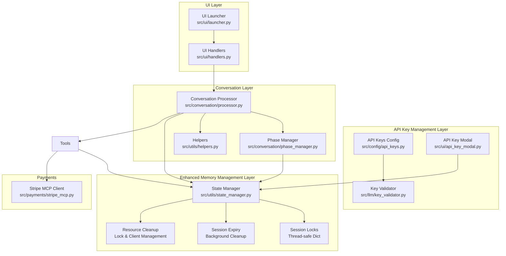
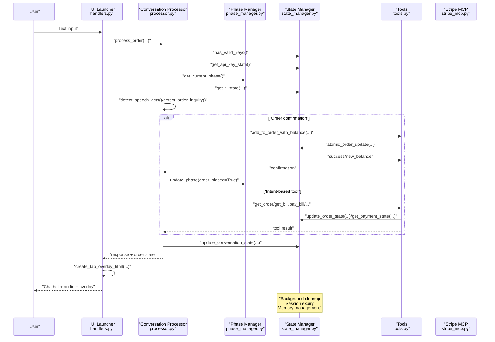
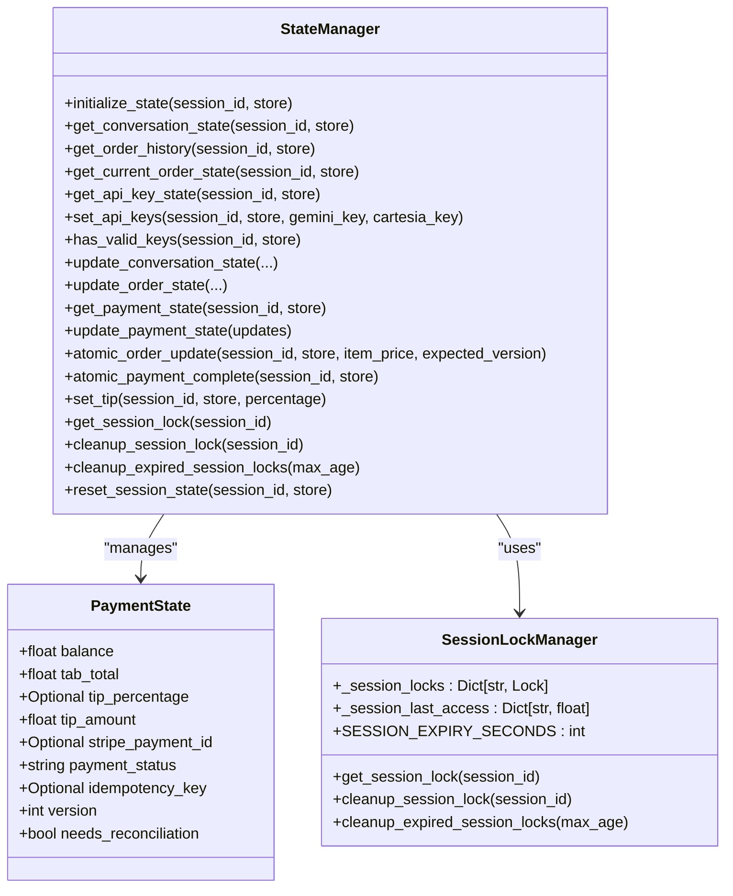
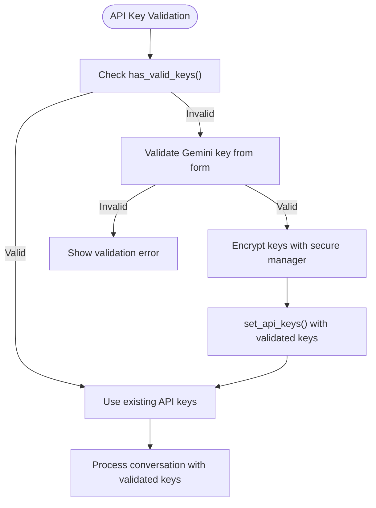
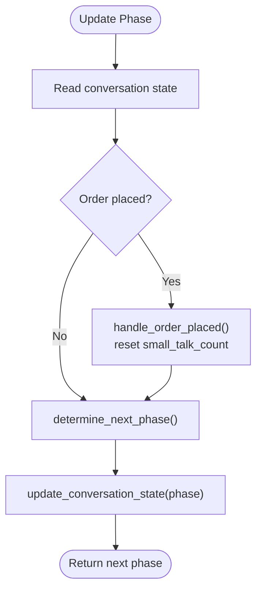
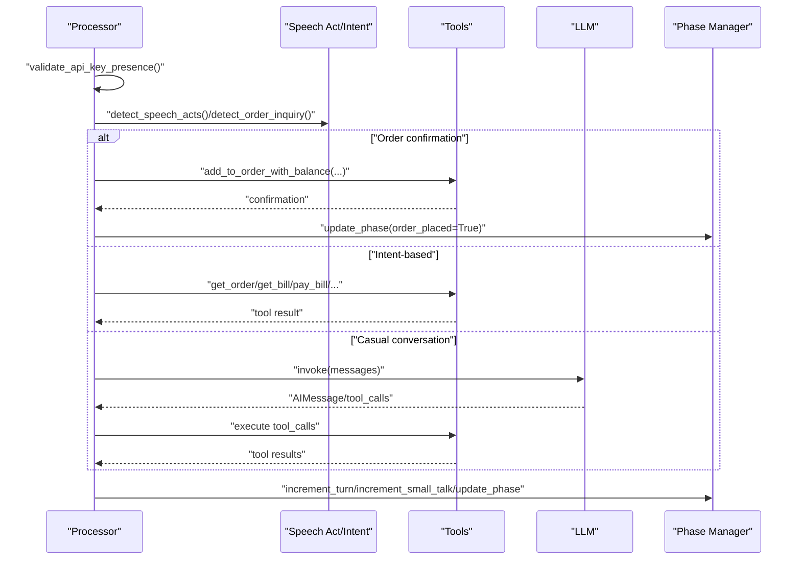
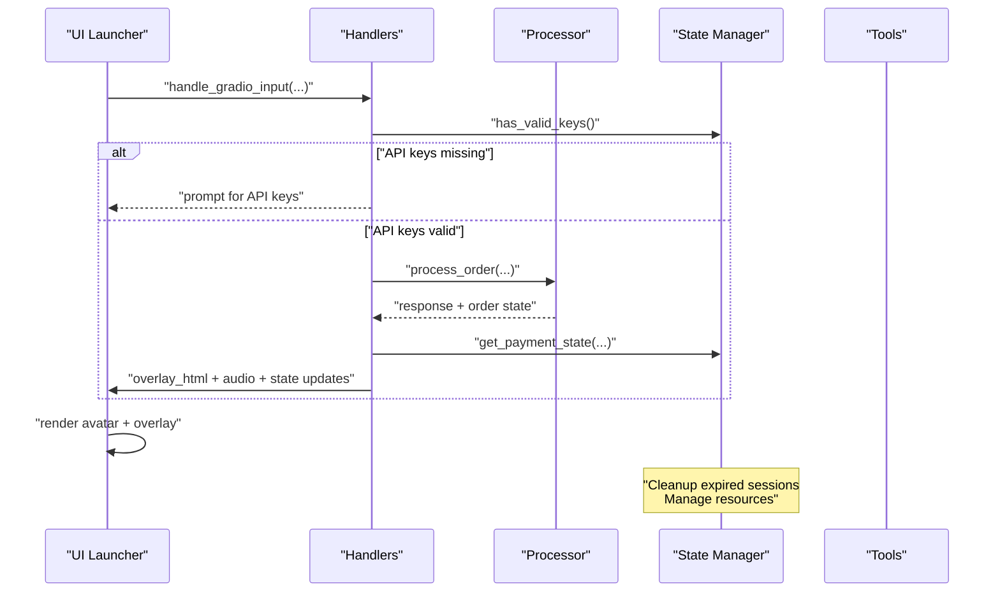
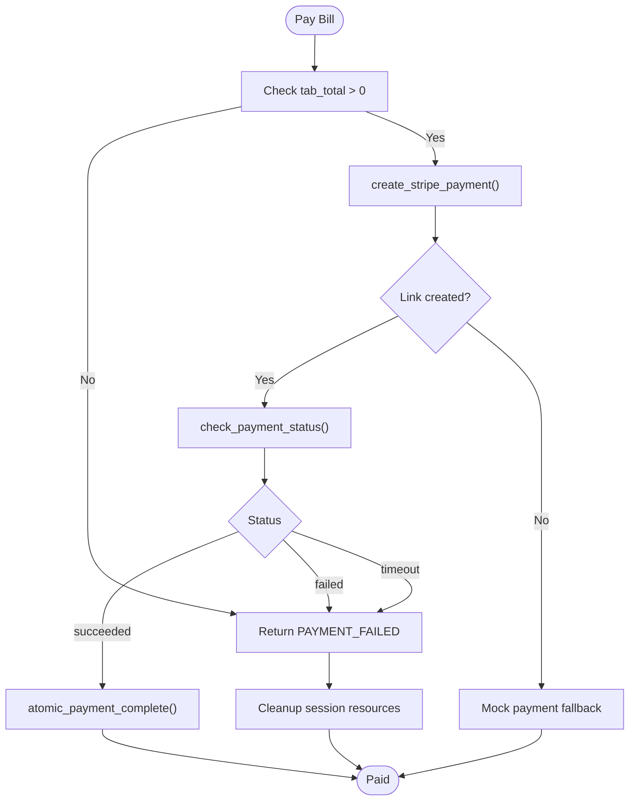
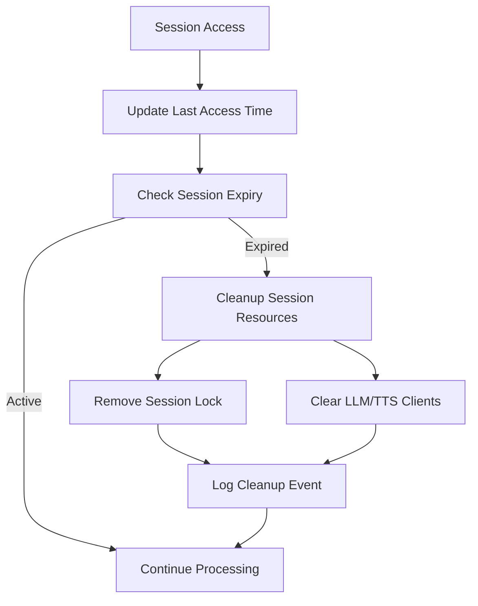
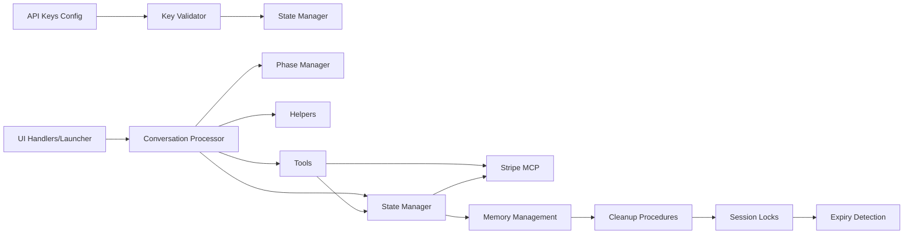

# State Management Patterns

<cite>
**Referenced Files in This Document**
- [state_manager.py](file://src/utils/state_manager.py)
- [api_keys.py](file://src/config/api_keys.py)
- [key_validator.py](file://src/llm/key_validator.py)
- [api_key_modal.py](file://src/ui/api_key_modal.py)
- [phase_manager.py](file://src/conversation/phase_manager.py)
- [processor.py](file://src/conversation/processor.py)
- [helpers.py](file://src/utils/helpers.py)
- [handlers.py](file://src/ui/handlers.py)
- [launcher.py](file://src/ui/launcher.py)
- [tools.py](file://src/llm/tools.py)
- [stripe_mcp.py](file://src/payments/stripe_mcp.py)
- [test_state_manager.py](file://tests/test_state_manager.py)
- [test_session_context.py](file://tests/test_session_context.py)
- [test_speech_acts.py](file://tests/test_speech_acts.py)
- [test_api_keys.py](file://tests/test_api_keys.py)
</cite>

## Update Summary
**Changes Made**
- Enhanced memory management with improved session lock tracking and cleanup procedures
- Added session expiry mechanism with background cleanup for inactive sessions
- Improved error handling for edge cases with comprehensive resource cleanup
- Strengthened concurrency control with proper isolation for complex multi-session scenarios
- Added background cleanup procedures for session locks and expired resources

## Table of Contents
1. [Introduction](#introduction)
2. [Project Structure](#project-structure)
3. [Core Components](#core-components)
4. [Architecture Overview](#architecture-overview)
5. [Detailed Component Analysis](#detailed-component-analysis)
6. [Dependency Analysis](#dependency-analysis)
7. [Performance Considerations](#performance-considerations)
8. [Troubleshooting Guide](#troubleshooting-guide)
9. [Conclusion](#conclusion)

## Introduction
This document describes MayaMCP's state management system with a focus on multi-dimensional state tracking and persistence across interactions. The system maintains conversation context, order history, payment information, and API key credentials for each user session. It includes robust state transition patterns for conversation phases, order states, payment workflows, and API key validation, along with helper utilities for speech act detection, order processing, and context preservation. The document explains state synchronization mechanisms between UI, conversation processor, and payment tools, enhanced concurrency control strategies for multi-user sessions, improved memory management with session expiry and cleanup procedures, and validation, cleanup, and error recovery mechanisms that ensure system stability and data integrity.

## Project Structure
MayaMCP organizes state management across several modules:
- State manager: central session store, typed payment state, API key state, validation, and atomic operations with enhanced memory management
- API key management: environment-based key retrieval, validation, and BYOK authentication
- Conversation processor: orchestrates LLM interactions, tool calls, and state updates
- Phase manager: manages conversation phases and transitions
- Helpers: speech act detection, intent classification, and casual conversation detection
- UI handlers and launcher: bridge Gradio events to state updates and render overlays
- Tools: LLM tools that operate on session state and drive payment workflows
- Payments: Stripe MCP client for payment link creation and status polling

**Diagram sources**
- [state_manager.py](file://src/utils/state_manager.py#L195-L243)
- [api_keys.py](file://src/config/api_keys.py#L1-L51)
- [key_validator.py](file://src/llm/key_validator.py#L1-L87)
- [api_key_modal.py](file://src/ui/api_key_modal.py#L1-L137)
- [handlers.py](file://src/ui/handlers.py#L23-L392)
- [launcher.py](file://src/ui/launcher.py#L49-L354)
- [processor.py](file://src/conversation/processor.py#L83-L456)
- [phase_manager.py](file://src/conversation/phase_manager.py#L10-L92)
- [helpers.py](file://src/utils/helpers.py#L9-L265)
- [tools.py](file://src/llm/tools.py#L1-L1066)
- [stripe_mcp.py](file://src/payments/stripe_mcp.py#L66-L475)

**Section sources**
- [state_manager.py](file://src/utils/state_manager.py#L1-L871)
- [processor.py](file://src/conversation/processor.py#L1-L456)
- [phase_manager.py](file://src/conversation/phase_manager.py#L1-L92)
- [helpers.py](file://src/utils/helpers.py#L1-L265)
- [handlers.py](file://src/ui/handlers.py#L1-L392)
- [launcher.py](file://src/ui/launcher.py#L1-L354)
- [tools.py](file://src/llm/tools.py#L1-L1066)
- [stripe_mcp.py](file://src/payments/stripe_mcp.py#L1-L475)
- [api_keys.py](file://src/config/api_keys.py#L1-L51)
- [key_validator.py](file://src/llm/key_validator.py#L1-L87)
- [api_key_modal.py](file://src/ui/api_key_modal.py#L1-L137)

## Core Components
- Enhanced session-based state architecture: Each user session maintains a structured state dictionary with conversation, order history, current order, payment, and API key sub-states. The state manager provides initialization, getters, setters, and atomic operations with validation, plus sophisticated memory management with session expiry and cleanup.
- API key state management: Session-based storage of Gemini and Cartesia API keys with validation and thread-safe access patterns for BYOK authentication.
- Conversation phase management: The phase manager tracks conversation progression (greeting, order_taking, small_talk, reorder_prompt) and updates counters and timestamps.
- Payment state machine: Typed payment state with strict validation, enforced status transitions, and idempotency keys. Atomic operations ensure consistency under concurrent access.
- Helper utilities: Speech act detection and casual conversation classification guide RAG usage and intent routing.
- UI synchronization: Handlers and launcher synchronize state changes to the UI, animate tab/balance/tip overlays, and manage avatar emotion states.
- Enhanced concurrency control: Thread-safe session locks with expiration tracking, background cleanup procedures, and proper isolation for complex multi-session scenarios.
- Advanced persistence patterns: State stored in a distributed store (e.g., Modal Dict) or local dict for development; session locks persisted to avoid premature GC with comprehensive cleanup mechanisms.
- Comprehensive error handling: Graceful handling of edge cases with proper resource cleanup, memory leak prevention, and fail-safe operations.

**Section sources**
- [state_manager.py](file://src/utils/state_manager.py#L17-L871)
- [phase_manager.py](file://src/conversation/phase_manager.py#L10-L92)
- [helpers.py](file://src/utils/helpers.py#L9-L265)
- [handlers.py](file://src/ui/handlers.py#L23-L392)
- [launcher.py](file://src/ui/launcher.py#L49-L354)
- [tools.py](file://src/llm/tools.py#L1-L1066)
- [api_keys.py](file://src/config/api_keys.py#L1-L51)
- [key_validator.py](file://src/llm/key_validator.py#L1-L87)
- [api_key_modal.py](file://src/ui/api_key_modal.py#L1-L137)

## Architecture Overview
The state management architecture follows a layered design with enhanced memory management:
- Enhanced API key management layer handles environment-based key retrieval and validation
- UI layer receives user input and invokes handlers
- Handlers call the conversation processor with validated API keys
- Processor orchestrates LLM interactions, detects intents/speech acts, and updates state
- Phase manager updates conversation phases and counters
- Tools operate on session state and drive payment workflows
- State manager validates and persists state atomically with API key management and advanced memory management
- UI renders overlays reflecting state changes
- Background cleanup processes monitor session expiry and clean up inactive resources

**Diagram sources**
- [handlers.py](file://src/ui/handlers.py#L23-L184)
- [processor.py](file://src/conversation/processor.py#L83-L456)
- [phase_manager.py](file://src/conversation/phase_manager.py#L42-L67)
- [state_manager.py](file://src/utils/state_manager.py#L492-L509)
- [tools.py](file://src/llm/tools.py#L221-L1066)
- [stripe_mcp.py](file://src/payments/stripe_mcp.py#L183-L475)

## Detailed Component Analysis

### Enhanced State Manager: Multi-Dimensional Session State with Advanced Memory Management
The state manager defines:
- Typed payment state with strict validation and enforced status transitions
- Default state templates for conversation, order history, current order, and API keys
- Thread-safe session locking with expiration tracking and comprehensive cleanup
- Atomic operations for order updates and payment completion
- API key state management with session-based storage and validation
- Utility functions for tip calculation, payment totals, and validation
- Background cleanup procedures for expired session locks and resources
- Enhanced error handling for edge cases with graceful degradation

Key capabilities:
- Initialize/reset session state with deep-copied defaults including API key state
- Update conversation/order/payment state with validation
- Store and retrieve API key state with thread-safe access patterns
- Atomic order deduction with optimistic locking and version checks
- Atomic payment completion with idempotency and reconciliation flags
- Session lock management with background cleanup and memory leak prevention
- Session expiry tracking with automatic cleanup of inactive resources
- Comprehensive resource cleanup including LLM/TTS client management

**Diagram sources**
- [state_manager.py](file://src/utils/state_manager.py#L195-L243)
- [state_manager.py](file://src/utils/state_manager.py#L613-L871)

**Section sources**
- [state_manager.py](file://src/utils/state_manager.py#L17-L871)

### Enhanced API Key State Management: BYOK Authentication with Improved Security
The API key state management system provides:
- Session-based API key storage with Gemini and Cartesia keys
- Thread-safe key validation and storage with atomic operations
- Integration with Gemini key validator for runtime validation
- Per-session key isolation for multi-user environments
- Graceful handling of missing or invalid API keys with comprehensive error logging
- Encrypted storage of sensitive API keys with proper decryption on retrieval

Key capabilities:
- Store validated API keys in session state with thread-safe locking
- Retrieve API key state for session-specific LLM and TTS clients
- Check if session has valid API keys for authentication gating
- Strip whitespace from API keys and mark as validated upon successful validation
- Integrate with UI modal for user-provided keys and validation feedback
- Secure encryption and decryption of API keys with comprehensive error handling

**Diagram sources**
- [api_key_modal.py](file://src/ui/api_key_modal.py#L83-L137)
- [key_validator.py](file://src/llm/key_validator.py#L20-L87)
- [state_manager.py](file://src/utils/state_manager.py#L821-L871)

**Section sources**
- [state_manager.py](file://src/utils/state_manager.py#L821-L871)
- [api_key_modal.py](file://src/ui/api_key_modal.py#L1-L137)
- [key_validator.py](file://src/llm/key_validator.py#L1-L87)
- [api_keys.py](file://src/config/api_keys.py#L1-L51)

### Enhanced Conversation Phase Manager: Conversation Flow Control with State Persistence
The phase manager:
- Reads and updates conversation state
- Increments turn counts and small talk counters
- Handles order placement events and resets small talk counters
- Determines next phase based on state and actions
- Decides when to use RAG for casual conversation
- Maintains state persistence across conversation transitions

**Diagram sources**
- [phase_manager.py](file://src/conversation/phase_manager.py#L42-L67)
- [helpers.py](file://src/utils/helpers.py#L71-L112)

**Section sources**
- [phase_manager.py](file://src/conversation/phase_manager.py#L10-L92)
- [helpers.py](file://src/utils/helpers.py#L71-L112)

### Enhanced Conversation Processor: Intent Detection and Tool Orchestration with Session Context
The processor:
- Performs security scanning on input and output
- Sets thread-local session context for tools
- Validates API key presence before processing
- Detects speech acts and order inquiries
- Routes to appropriate tools or LLM with tool-calling
- Updates conversation state and phases
- Integrates RAG enhancement for casual conversation
- Manages session context lifecycle with proper cleanup

**Diagram sources**
- [processor.py](file://src/conversation/processor.py#L83-L456)
- [helpers.py](file://src/utils/helpers.py#L9-L265)
- [tools.py](file://src/llm/tools.py#L221-L1066)

**Section sources**
- [processor.py](file://src/conversation/processor.py#L83-L456)
- [helpers.py](file://src/utils/helpers.py#L9-L265)

### Enhanced UI Handlers and Launcher: State Synchronization and Overlays with Resource Management
The UI layer:
- Extracts session IDs from Gradio requests
- Validates API key presence before processing
- Invokes the processor and generates audio responses
- Updates tab/balance/tip overlays and avatar emotion states
- Provides clear-state and tip-button handlers with notifications
- Manages resource cleanup and session termination
- Integrates with state manager for proper session lifecycle management

**Diagram sources**
- [handlers.py](file://src/ui/handlers.py#L23-L184)
- [launcher.py](file://src/ui/launcher.py#L49-L354)
- [state_manager.py](file://src/utils/state_manager.py#L492-L509)
- [tools.py](file://src/llm/tools.py#L557-L648)

**Section sources**
- [handlers.py](file://src/ui/handlers.py#L23-L392)
- [launcher.py](file://src/ui/launcher.py#L49-L354)

### Enhanced Payment Tools and Stripe Integration: Atomic Workflows with Comprehensive Error Handling
Payment tools:
- Validate session context and enforce balance checks
- Use atomic operations to update balances and tabs
- Manage tip selection with toggle behavior
- Create payment links with idempotency keys and fallbacks
- Poll payment status and complete payments atomically
- Handle comprehensive error scenarios with graceful fallback
- Implement proper resource cleanup and state recovery

**Diagram sources**
- [tools.py](file://src/llm/tools.py#L358-L555)
- [stripe_mcp.py](file://src/payments/stripe_mcp.py#L183-L475)
- [state_manager.py](file://src/utils/state_manager.py#L745-L780)

**Section sources**
- [tools.py](file://src/llm/tools.py#L358-L555)
- [stripe_mcp.py](file://src/payments/stripe_mcp.py#L183-L475)

### Enhanced Memory Management and Session Cleanup Procedures
The state manager now includes sophisticated memory management features:
- Thread-safe session lock tracking with last access time monitoring
- Automatic session expiry detection with configurable timeout periods
- Background cleanup procedures for expired session locks
- Comprehensive resource cleanup including LLM/TTS client management
- Fail-safe error handling for cleanup operations
- Proper isolation mechanisms for complex multi-session scenarios

Key memory management capabilities:
- Track session last access times for expiry detection
- Implement background cleanup with configurable intervals
- Provide explicit cleanup functions for controlled resource release
- Handle cleanup exceptions without affecting main application flow
- Ensure proper cleanup on session reset and application shutdown

**Diagram sources**
- [state_manager.py](file://src/utils/state_manager.py#L201-L243)
- [state_manager.py](file://src/utils/state_manager.py#L492-L509)

**Section sources**
- [state_manager.py](file://src/utils/state_manager.py#L195-L243)
- [state_manager.py](file://src/utils/state_manager.py#L492-L509)

## Dependency Analysis
The state management system exhibits strong cohesion within each module and well-defined interfaces with enhanced memory management:
- API key management depends on environment configuration and key validation
- UI handlers depend on the processor and state manager with API key validation
- Processor depends on phase manager, helpers, state manager, and API key state
- Tools depend on state manager, Stripe MCP client, and validated API keys
- State manager encapsulates validation, concurrency controls, API key state, and memory management
- Enhanced cleanup procedures integrate with session lifecycle management
- Tests validate state transitions, session context, speech act detection, API key management, and memory cleanup
- Background cleanup processes coordinate with main application flow

**Diagram sources**
- [api_keys.py](file://src/config/api_keys.py#L1-L51)
- [key_validator.py](file://src/llm/key_validator.py#L1-L87)
- [state_manager.py](file://src/utils/state_manager.py#L195-L243)
- [handlers.py](file://src/ui/handlers.py#L23-L184)
- [launcher.py](file://src/ui/launcher.py#L49-L354)
- [processor.py](file://src/conversation/processor.py#L83-L456)
- [phase_manager.py](file://src/conversation/phase_manager.py#L10-L92)
- [helpers.py](file://src/utils/helpers.py#L9-L265)
- [tools.py](file://src/llm/tools.py#L1-L1066)
- [stripe_mcp.py](file://src/payments/stripe_mcp.py#L66-L475)

**Section sources**
- [test_state_manager.py](file://tests/test_state_manager.py#L1-L344)
- [test_session_context.py](file://tests/test_session_context.py#L1-L242)
- [test_speech_acts.py](file://tests/test_speech_acts.py#L1-L163)
- [test_api_keys.py](file://tests/test_api_keys.py#L1-L287)

## Performance Considerations
- Atomic operations minimize contention and ensure consistency under concurrent access
- Optimistic locking with version checks reduces lock contention while preventing stale writes
- Thread-safe session locks prevent race conditions without global locks
- Background cleanup of expired session locks avoids memory leaks and reduces overhead
- Enhanced memory management with session expiry detection optimizes resource utilization
- API key validation uses thread-safe locks to prevent concurrent validation conflicts
- RAG enhancement is gated by casual conversation detection and availability checks to avoid unnecessary latency
- UI overlay animations use previous/current values to minimize DOM churn
- Comprehensive error handling prevents cascading failures and maintains system stability
- Resource cleanup procedures ensure proper memory management and prevent resource leaks

## Troubleshooting Guide
Common issues and recovery strategies:
- Insufficient funds: atomic order update returns a specific error code; clients should prompt retry or adjust order
- Concurrent modification: optimistic locking mismatch; clients should re-read state and retry
- Payment timeouts: payment status polling exceeds deadline; advise manual check or retry
- Session context not set: tools require a session context; ensure processor sets it before invoking tools
- API key validation failures: Gemini key validation returns specific error messages for different failure types
- API key missing: handlers check has_valid_keys() and prompt for API key submission
- Speech act detection thresholds: adjust confidence thresholds if misclassification occurs
- State validation failures: payment state validation enforces strict constraints; fix invalid fields before retry
- Memory leaks: ensure cleanup_session_lock is called on session reset; verify background cleanup processes
- Session expiry issues: check SESSION_EXPIRY_SECONDS configuration and cleanup procedure logs
- Resource cleanup failures: verify proper exception handling in cleanup procedures
- Multi-session isolation problems: ensure proper session lock management and isolation boundaries

**Section sources**
- [state_manager.py](file://src/utils/state_manager.py#L666-L871)
- [tools.py](file://src/llm/tools.py#L557-L648)
- [test_state_manager.py](file://tests/test_state_manager.py#L336-L344)
- [test_session_context.py](file://tests/test_session_context.py#L118-L209)
- [test_speech_acts.py](file://tests/test_speech_acts.py#L77-L162)
- [key_validator.py](file://src/llm/key_validator.py#L20-L87)

## Conclusion
MayaMCP's enhanced state management system provides a robust, multi-dimensional session architecture that maintains conversation context, order history, payment state, and API key credentials across interactions. The system enforces strict validation, supports atomic operations, and integrates comprehensive concurrency control with advanced memory management and session cleanup procedures. The system synchronizes state changes to the UI through overlays and animations, and it cleanly separates concerns between UI, conversation processing, and payment workflows. The enhanced API key management enables secure BYOK authentication with per-session key storage and validation. The helper utilities enable intelligent intent detection and context preservation, while sophisticated persistence patterns and comprehensive cleanup procedures ensure long-term reliability and stability. The enhanced memory management with session expiry detection, background cleanup procedures, and proper resource isolation makes the system resilient to edge cases and complex multi-session scenarios.