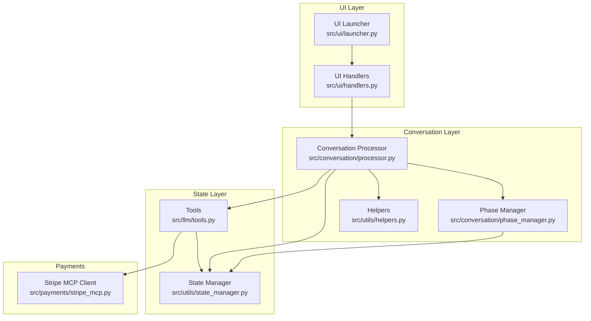
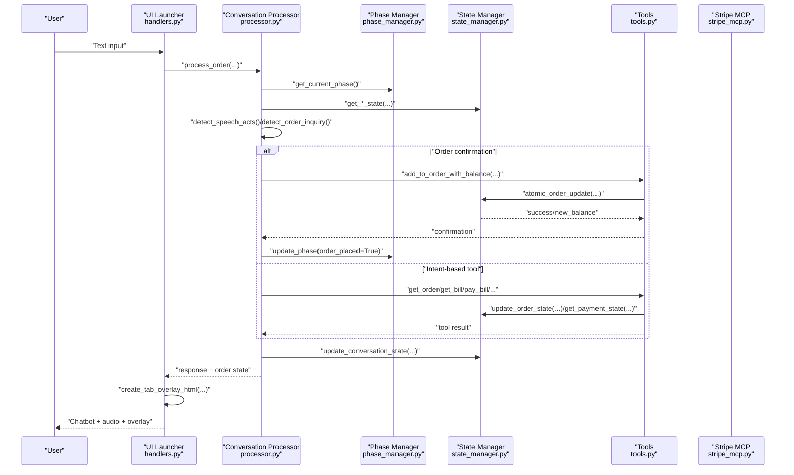
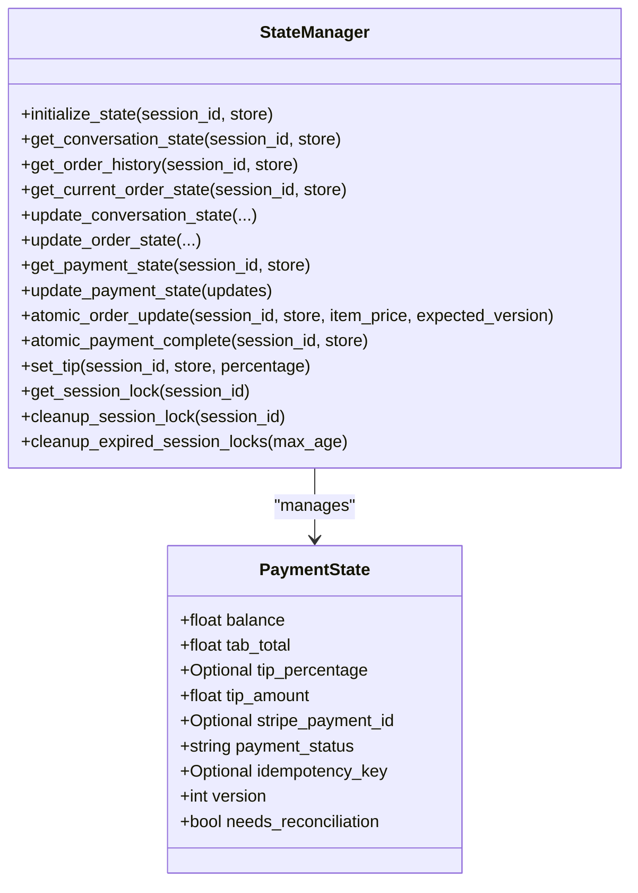
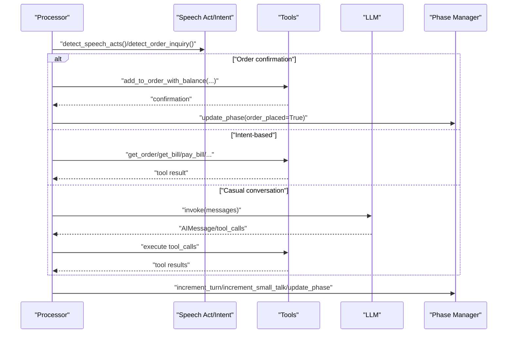
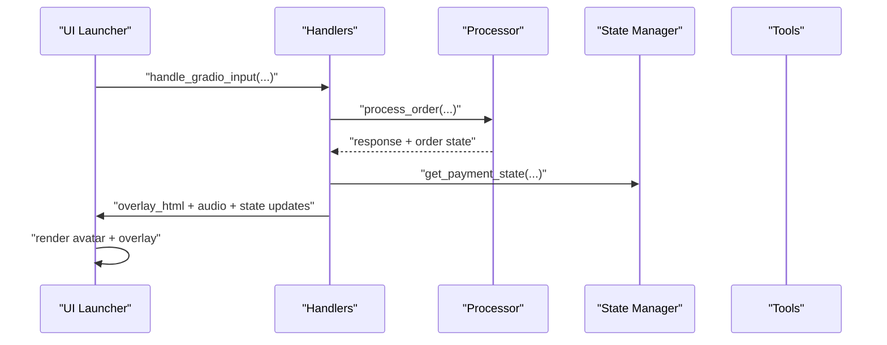
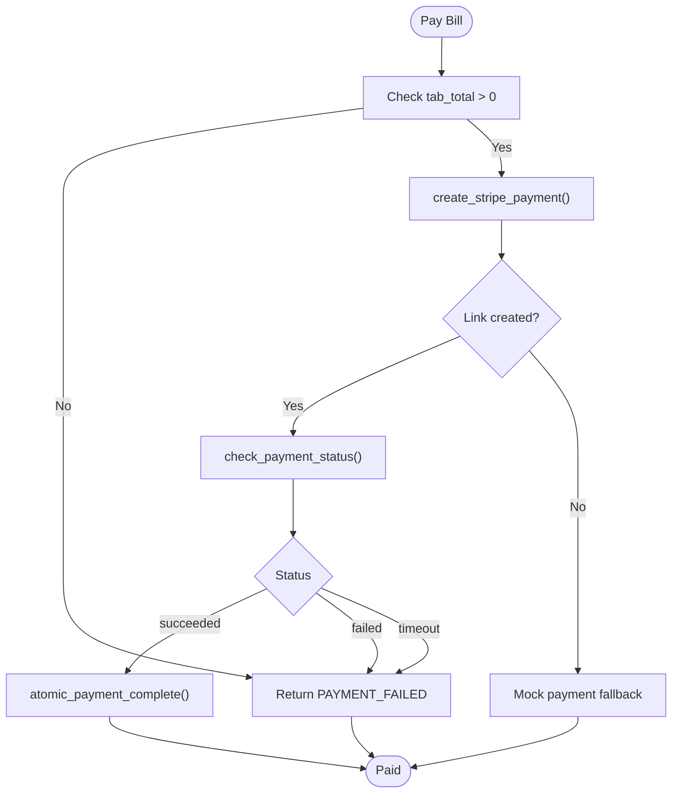
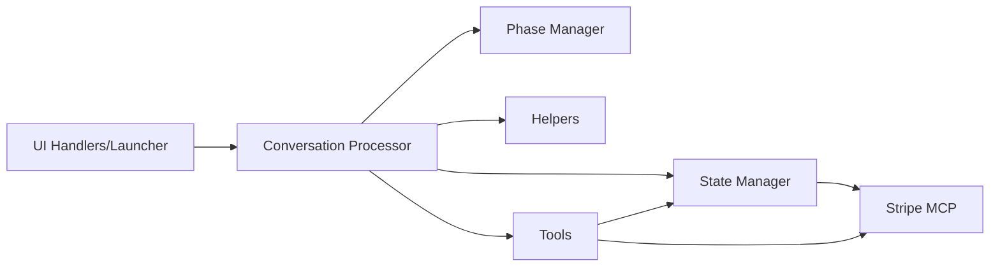

# State Management Patterns

<cite>
**Referenced Files in This Document**
- [state_manager.py](file://src/utils/state_manager.py)
- [phase_manager.py](file://src/conversation/phase_manager.py)
- [processor.py](file://src/conversation/processor.py)
- [helpers.py](file://src/utils/helpers.py)
- [handlers.py](file://src/ui/handlers.py)
- [launcher.py](file://src/ui/launcher.py)
- [tools.py](file://src/llm/tools.py)
- [stripe_mcp.py](file://src/payments/stripe_mcp.py)
- [test_state_manager.py](file://tests/test_state_manager.py)
- [test_session_context.py](file://tests/test_session_context.py)
- [test_speech_acts.py](file://tests/test_speech_acts.py)
</cite>

## Table of Contents
1. [Introduction](#introduction)
2. [Project Structure](#project-structure)
3. [Core Components](#core-components)
4. [Architecture Overview](#architecture-overview)
5. [Detailed Component Analysis](#detailed-component-analysis)
6. [Dependency Analysis](#dependency-analysis)
7. [Performance Considerations](#performance-considerations)
8. [Troubleshooting Guide](#troubleshooting-guide)
9. [Conclusion](#conclusion)

## Introduction
This document describes MayaMCP’s state management system with a focus on multi-dimensional state tracking and persistence across interactions. The system maintains conversation context, order history, and payment information for each user session. It includes robust state transition patterns for conversation phases, order states, and payment workflows, along with helper utilities for speech act detection, order processing, and context preservation. The document explains state synchronization mechanisms between UI, conversation processor, and payment tools, concurrency control strategies for multi-user sessions, persistence patterns across application restarts, and validation, cleanup, and error recovery mechanisms that ensure system stability and data integrity.

## Project Structure
MayaMCP organizes state management across several modules:
- State manager: central session store, typed payment state, validation, and atomic operations
- Conversation processor: orchestrates LLM interactions, tool calls, and state updates
- Phase manager: manages conversation phases and transitions
- Helpers: speech act detection, intent classification, and casual conversation detection
- UI handlers and launcher: bridge Gradio events to state updates and render overlays
- Tools: LLM tools that operate on session state and drive payment workflows
- Payments: Stripe MCP client for payment link creation and status polling

**Diagram sources**
- [handlers.py](file://src/ui/handlers.py#L23-L184)
- [launcher.py](file://src/ui/launcher.py#L49-L354)
- [processor.py](file://src/conversation/processor.py#L83-L456)
- [phase_manager.py](file://src/conversation/phase_manager.py#L10-L92)
- [helpers.py](file://src/utils/helpers.py#L9-L265)
- [state_manager.py](file://src/utils/state_manager.py#L394-L814)
- [tools.py](file://src/llm/tools.py#L1-L1066)
- [stripe_mcp.py](file://src/payments/stripe_mcp.py#L66-L475)

**Section sources**
- [state_manager.py](file://src/utils/state_manager.py#L1-L814)
- [processor.py](file://src/conversation/processor.py#L1-L456)
- [phase_manager.py](file://src/conversation/phase_manager.py#L1-L92)
- [helpers.py](file://src/utils/helpers.py#L1-L265)
- [handlers.py](file://src/ui/handlers.py#L1-L392)
- [launcher.py](file://src/ui/launcher.py#L1-L354)
- [tools.py](file://src/llm/tools.py#L1-L1066)
- [stripe_mcp.py](file://src/payments/stripe_mcp.py#L1-L475)

## Core Components
- Session-based state architecture: Each user session maintains a structured state dictionary with conversation, order history, current order, and payment sub-states. The state manager provides initialization, getters, setters, and atomic operations with validation.
- Conversation phase management: The phase manager tracks conversation progression (greeting, order_taking, small_talk, reorder_prompt) and updates counters and timestamps.
- Payment state machine: Typed payment state with strict validation, enforced status transitions, and idempotency keys. Atomic operations ensure consistency under concurrent access.
- Helper utilities: Speech act detection and casual conversation classification guide RAG usage and intent routing.
- UI synchronization: Handlers and launcher synchronize state changes to the UI, animate tab/balance/tip overlays, and manage avatar emotion states.
- Concurrency control: Thread-safe session locks with expiration and cleanup to prevent race conditions and memory leaks.
- Persistence patterns: State stored in a distributed store (e.g., Modal Dict) or local dict for development; session locks persisted to avoid premature GC.

**Section sources**
- [state_manager.py](file://src/utils/state_manager.py#L17-L814)
- [phase_manager.py](file://src/conversation/phase_manager.py#L10-L92)
- [helpers.py](file://src/utils/helpers.py#L9-L265)
- [handlers.py](file://src/ui/handlers.py#L23-L392)
- [launcher.py](file://src/ui/launcher.py#L49-L354)
- [tools.py](file://src/llm/tools.py#L1-L1066)

## Architecture Overview
The state management architecture follows a layered design:
- UI layer receives user input and invokes handlers
- Handlers call the conversation processor
- Processor orchestrates LLM interactions, detects intents/speech acts, and updates state
- Phase manager updates conversation phases and counters
- Tools operate on session state and drive payment workflows
- State manager validates and persists state atomically
- UI renders overlays reflecting state changes

**Diagram sources**
- [handlers.py](file://src/ui/handlers.py#L23-L184)
- [processor.py](file://src/conversation/processor.py#L83-L456)
- [phase_manager.py](file://src/conversation/phase_manager.py#L42-L67)
- [state_manager.py](file://src/utils/state_manager.py#L426-L814)
- [tools.py](file://src/llm/tools.py#L221-L1066)
- [stripe_mcp.py](file://src/payments/stripe_mcp.py#L183-L475)

## Detailed Component Analysis

### State Manager: Multi-Dimensional Session State
The state manager defines:
- Typed payment state with strict validation and enforced status transitions
- Default state templates for conversation, order history, and current order
- Thread-safe session locking with expiration and cleanup
- Atomic operations for order updates and payment completion
- Utility functions for tip calculation, payment totals, and validation

Key capabilities:
- Initialize/reset session state with deep-copied defaults
- Update conversation/order/payment state with validation
- Atomic order deduction with optimistic locking and version checks
- Atomic payment completion with idempotency and reconciliation flags
- Session lock management with background cleanup

**Diagram sources**
- [state_manager.py](file://src/utils/state_manager.py#L17-L814)

**Section sources**
- [state_manager.py](file://src/utils/state_manager.py#L17-L814)

### Conversation Phase Manager: Conversation Flow Control
The phase manager:
- Reads and updates conversation state
- Increments turn counts and small talk counters
- Handles order placement events and resets small talk counters
- Determines next phase based on state and actions
- Decides when to use RAG for casual conversation

**Diagram sources**
- [phase_manager.py](file://src/conversation/phase_manager.py#L42-L67)
- [helpers.py](file://src/utils/helpers.py#L71-L112)

**Section sources**
- [phase_manager.py](file://src/conversation/phase_manager.py#L10-L92)
- [helpers.py](file://src/utils/helpers.py#L71-L112)

### Conversation Processor: Intent Detection and Tool Orchestration
The processor:
- Performs security scanning on input and output
- Sets thread-local session context for tools
- Detects speech acts and order inquiries
- Routes to appropriate tools or LLM with tool-calling
- Updates conversation state and phases
- Integrates RAG enhancement for casual conversation

**Diagram sources**
- [processor.py](file://src/conversation/processor.py#L83-L456)
- [helpers.py](file://src/utils/helpers.py#L9-L265)
- [tools.py](file://src/llm/tools.py#L221-L1066)

**Section sources**
- [processor.py](file://src/conversation/processor.py#L83-L456)
- [helpers.py](file://src/utils/helpers.py#L9-L265)

### UI Handlers and Launcher: State Synchronization and Overlays
The UI layer:
- Extracts session IDs from Gradio requests
- Invokes the processor and generates audio responses
- Updates tab/balance/tip overlays and avatar emotion states
- Provides clear-state and tip-button handlers with notifications

**Diagram sources**
- [handlers.py](file://src/ui/handlers.py#L23-L184)
- [launcher.py](file://src/ui/launcher.py#L49-L354)
- [state_manager.py](file://src/utils/state_manager.py#L627-L640)
- [tools.py](file://src/llm/tools.py#L557-L648)

**Section sources**
- [handlers.py](file://src/ui/handlers.py#L23-L392)
- [launcher.py](file://src/ui/launcher.py#L49-L354)

### Payment Tools and Stripe Integration: Atomic Workflows
Payment tools:
- Validate session context and enforce balance checks
- Use atomic operations to update balances and tabs
- Manage tip selection with toggle behavior
- Create payment links with idempotency keys and fallbacks
- Poll payment status and complete payments atomically

**Diagram sources**
- [tools.py](file://src/llm/tools.py#L358-L555)
- [stripe_mcp.py](file://src/payments/stripe_mcp.py#L183-L475)
- [state_manager.py](file://src/utils/state_manager.py#L780-L814)

**Section sources**
- [tools.py](file://src/llm/tools.py#L358-L555)
- [stripe_mcp.py](file://src/payments/stripe_mcp.py#L183-L475)

## Dependency Analysis
The state management system exhibits strong cohesion within each module and well-defined interfaces:
- UI handlers depend on the processor and state manager
- Processor depends on phase manager, helpers, and state manager
- Tools depend on state manager and Stripe MCP client
- State manager encapsulates validation and concurrency controls
- Tests validate state transitions, session context, and speech act detection

**Diagram sources**
- [handlers.py](file://src/ui/handlers.py#L23-L184)
- [launcher.py](file://src/ui/launcher.py#L49-L354)
- [processor.py](file://src/conversation/processor.py#L83-L456)
- [phase_manager.py](file://src/conversation/phase_manager.py#L10-L92)
- [helpers.py](file://src/utils/helpers.py#L9-L265)
- [state_manager.py](file://src/utils/state_manager.py#L394-L814)
- [tools.py](file://src/llm/tools.py#L1-L1066)
- [stripe_mcp.py](file://src/payments/stripe_mcp.py#L66-L475)

**Section sources**
- [test_state_manager.py](file://tests/test_state_manager.py#L1-L370)
- [test_session_context.py](file://tests/test_session_context.py#L1-L242)
- [test_speech_acts.py](file://tests/test_speech_acts.py#L1-L163)

## Performance Considerations
- Atomic operations minimize contention and ensure consistency under concurrent access
- Optimistic locking with version checks reduces lock contention while preventing stale writes
- Thread-safe session locks prevent race conditions without global locks
- Background cleanup of expired session locks avoids memory leaks and reduces overhead
- RAG enhancement is gated by casual conversation detection and availability checks to avoid unnecessary latency
- UI overlay animations use previous/current values to minimize DOM churn

[No sources needed since this section provides general guidance]

## Troubleshooting Guide
Common issues and recovery strategies:
- Insufficient funds: atomic order update returns a specific error code; clients should prompt retry or adjust order
- Concurrent modification: optimistic locking mismatch; clients should re-read state and retry
- Payment timeouts: payment status polling exceeds deadline; advise manual check or retry
- Session context not set: tools require a session context; ensure processor sets it before invoking tools
- Speech act detection thresholds: adjust confidence thresholds if misclassification occurs
- State validation failures: payment state validation enforces strict constraints; fix invalid fields before retry

**Section sources**
- [state_manager.py](file://src/utils/state_manager.py#L680-L814)
- [tools.py](file://src/llm/tools.py#L557-L648)
- [test_state_manager.py](file://tests/test_state_manager.py#L362-L370)
- [test_session_context.py](file://tests/test_session_context.py#L118-L209)
- [test_speech_acts.py](file://tests/test_speech_acts.py#L77-L162)

## Conclusion
MayaMCP’s state management system provides a robust, multi-dimensional session architecture that maintains conversation context, order history, and payment state across interactions. It enforces strict validation, supports atomic operations, and integrates concurrency control to ensure data integrity. The system synchronizes state changes to the UI through overlays and animations, and it cleanly separates concerns between UI, conversation processing, and payment workflows. The helper utilities enable intelligent intent detection and context preservation, while persistence patterns and cleanup procedures ensure long-term reliability and stability.