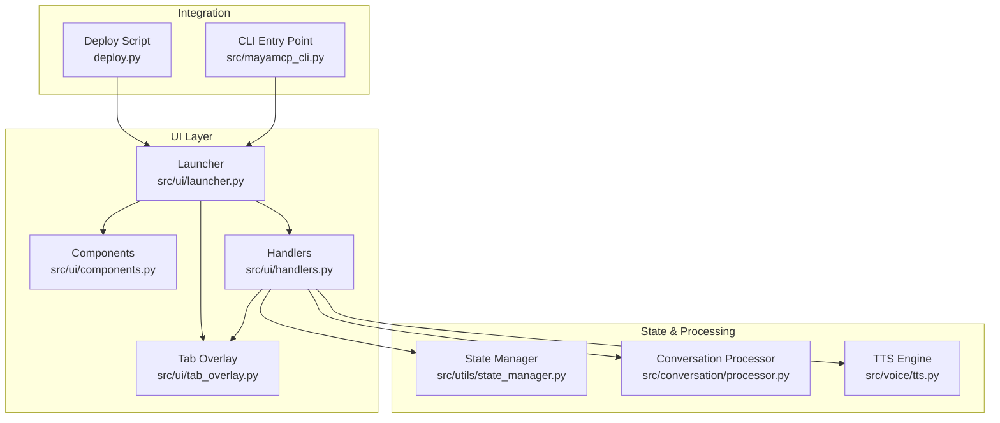
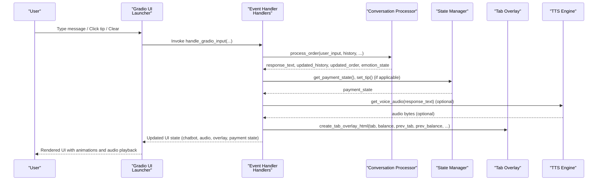
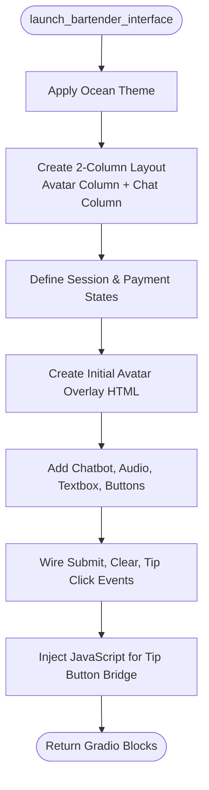
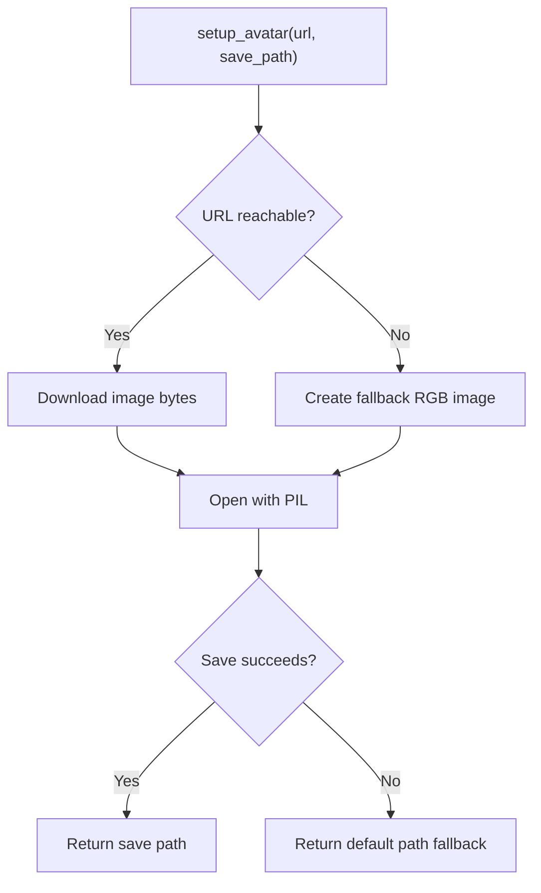
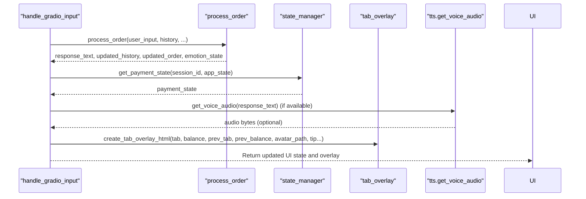
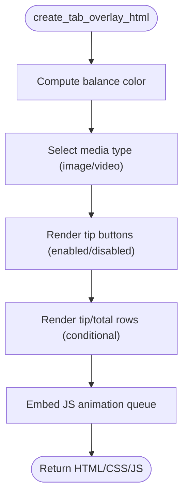
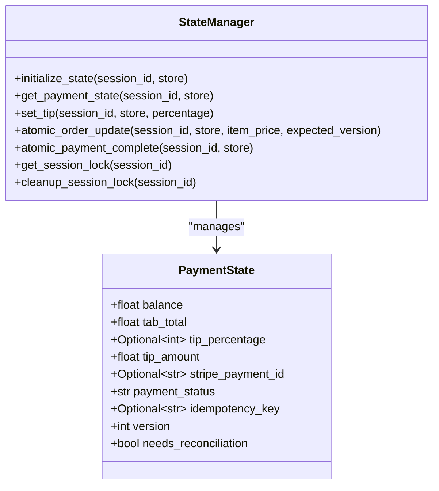
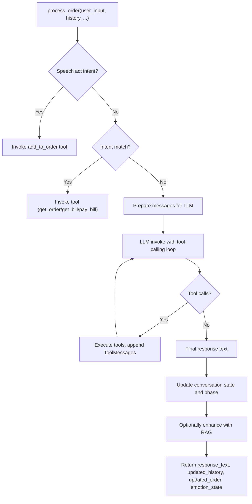
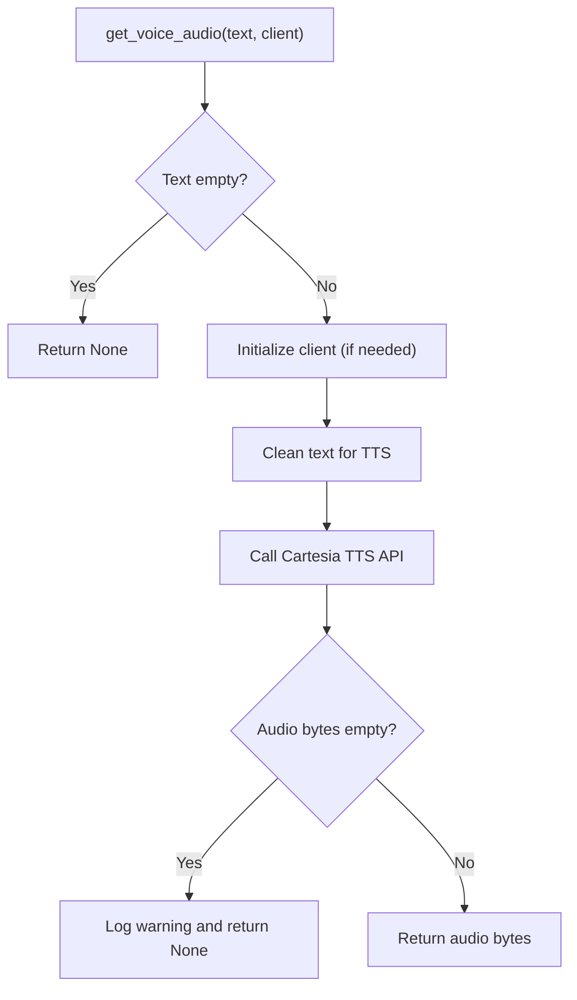
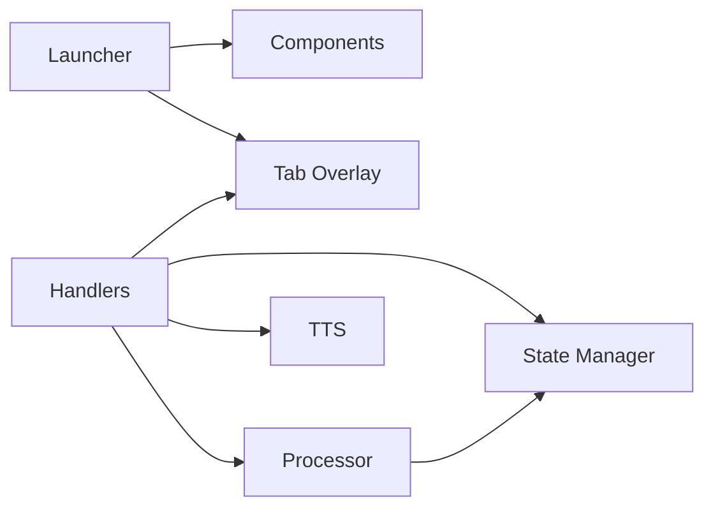

# User Interface Architecture

<cite>
**Referenced Files in This Document**
- [launcher.py](file://src/ui/launcher.py)
- [components.py](file://src/ui/components.py)
- [handlers.py](file://src/ui/handlers.py)
- [tab_overlay.py](file://src/ui/tab_overlay.py)
- [state_manager.py](file://src/utils/state_manager.py)
- [processor.py](file://src/conversation/processor.py)
- [tts.py](file://src/voice/tts.py)
- [__init__.py](file://src/ui/__init__.py)
- [deploy.py](file://deploy.py)
- [mayamcp_cli.py](file://src/mayamcp_cli.py)
- [test_ui_launcher.py](file://tests/test_ui_launcher.py)
- [test_ui_handlers.py](file://tests/test_ui_handlers.py)
- [test_ui_components.py](file://tests/test_ui_components.py)
</cite>

## Table of Contents
1. [Introduction](#introduction)
2. [Project Structure](#project-structure)
3. [Core Components](#core-components)
4. [Architecture Overview](#architecture-overview)
5. [Detailed Component Analysis](#detailed-component-analysis)
6. [Dependency Analysis](#dependency-analysis)
7. [Performance Considerations](#performance-considerations)
8. [Troubleshooting Guide](#troubleshooting-guide)
9. [Conclusion](#conclusion)
10. [Appendices](#appendices)

## Introduction
This document describes the Gradio-based user interface architecture for MayaMCP, focusing on the layered UI design and component interactions. The system centers around a launcher that builds the main interface with an avatar display, chat history, interactive controls, and a tab overlay for payment state visualization. It explains the event handler architecture that processes user interactions, converts them into conversation requests, and manages UI state updates. The document also covers component composition patterns (avatar animation system, chat interface layout, and payment modal integration), state synchronization mechanisms between UI components and the underlying conversation processing system, and considerations for responsive design, accessibility, and real-time audio feedback.

## Project Structure
The UI system is organized into modular components under the src/ui package, with supporting utilities in src/utils and integration points in deployment scripts and CLI entry points. The structure emphasizes separation of concerns:
- Launcher: constructs the Gradio Blocks layout and wires events
- Components: avatar setup and media handling
- Handlers: event processing and integration with conversation and payment systems
- Tab Overlay: payment visualization with animations and tip buttons
- State Manager: thread-safe session and payment state management
- Processor: conversation logic and tool orchestration
- TTS: audio synthesis for real-time voice feedback

**Diagram sources**
- [launcher.py](file://src/ui/launcher.py#L49-L354)
- [handlers.py](file://src/ui/handlers.py#L23-L392)
- [tab_overlay.py](file://src/ui/tab_overlay.py#L151-L485)
- [components.py](file://src/ui/components.py#L11-L55)
- [state_manager.py](file://src/utils/state_manager.py#L48-L800)
- [processor.py](file://src/conversation/processor.py#L73-L456)
- [tts.py](file://src/voice/tts.py#L140-L200)
- [deploy.py](file://deploy.py#L192-L227)
- [mayamcp_cli.py](file://src/mayamcp_cli.py#L101-L132)

**Section sources**
- [launcher.py](file://src/ui/launcher.py#L49-L354)
- [__init__.py](file://src/ui/__init__.py#L1-L12)

## Core Components
- Launcher: Builds the main Gradio Blocks layout with two equal-sized columns (avatar overlay and chat interface), defines session and payment state variables, wires submit/clear/tip events, and injects JavaScript for tip button interactions.
- Components: Provides avatar setup with fallbacks and persistence.
- Handlers: Orchestrates conversation processing, TTS synthesis, payment state updates, and UI state synchronization.
- Tab Overlay: Generates HTML/CSS/JS overlays for tab and balance display with animated count-ups, tip buttons, and dynamic media rendering.
- State Manager: Manages thread-safe session locks, payment state validation, and atomic operations for order updates and payments.
- Processor: Executes LLM interactions, tool calls, and RAG enhancements; returns updated conversation and order states.
- TTS: Initializes Cartesia client, cleans text for pronunciation, and synthesizes audio with retries.

**Section sources**
- [launcher.py](file://src/ui/launcher.py#L49-L354)
- [handlers.py](file://src/ui/handlers.py#L23-L392)
- [tab_overlay.py](file://src/ui/tab_overlay.py#L151-L485)
- [components.py](file://src/ui/components.py#L11-L55)
- [state_manager.py](file://src/utils/state_manager.py#L48-L800)
- [processor.py](file://src/conversation/processor.py#L73-L456)
- [tts.py](file://src/voice/tts.py#L140-L200)

## Architecture Overview
The UI architecture follows a layered pattern:
- Presentation Layer: Gradio Blocks layout with avatar overlay and chatbot
- Event Layer: Handlers bind user actions to processing functions
- Processing Layer: Conversation processor orchestrates LLM/tool/RAG flows
- State Layer: Thread-safe state manager coordinates payment and session state
- Media Layer: TTS engine generates audio for real-time feedback

**Diagram sources**
- [launcher.py](file://src/ui/launcher.py#L155-L231)
- [handlers.py](file://src/ui/handlers.py#L23-L184)
- [processor.py](file://src/conversation/processor.py#L73-L456)
- [state_manager.py](file://src/utils/state_manager.py#L627-L640)
- [tab_overlay.py](file://src/ui/tab_overlay.py#L151-L485)
- [tts.py](file://src/voice/tts.py#L140-L200)

## Detailed Component Analysis

### Launcher: Main Interface Construction and Event Wiring
The launcher composes the UI with:
- Theme: Ocean-based theme for consistent look-and-feel
- Layout: Two-column grid (avatar overlay column, chat interface column)
- State: Session history, order, and payment state variables persisted across interactions
- Controls: Text input, submit/clear buttons, hidden tip input, and avatar overlay
- Events: Submit triggers conversation processing; clear resets state and overlay; tip buttons use JavaScript to update hidden input, which triggers a handler

Key behaviors:
- Avatar setup with fallbacks and default asset resolution
- Initial overlay creation with default payment state
- JavaScript injection to bridge tip button clicks to Gradio events
- Clear handler wraps the provided clear function and resets overlay state

**Diagram sources**
- [launcher.py](file://src/ui/launcher.py#L49-L354)

**Section sources**
- [launcher.py](file://src/ui/launcher.py#L49-L354)

### Components: Avatar Setup and Media Handling
The components module handles avatar provisioning:
- Downloads avatar image from a default URL with robust fallbacks
- Saves avatar to disk and returns the path
- Logs successes and failures for observability

**Diagram sources**
- [components.py](file://src/ui/components.py#L11-L55)

**Section sources**
- [components.py](file://src/ui/components.py#L11-L55)

### Handlers: Event Processing and State Synchronization
The handlers coordinate:
- Input processing: invokes conversation processor, generates audio, resolves emotion-driven avatar changes, and updates overlay
- Clearing: resets session state and clears UI outputs
- Tip handling: toggles tip selection, sends notifications to the agent, updates payment state, and refreshes overlay

**Diagram sources**
- [handlers.py](file://src/ui/handlers.py#L23-L184)
- [processor.py](file://src/conversation/processor.py#L73-L456)
- [state_manager.py](file://src/utils/state_manager.py#L627-L640)
- [tab_overlay.py](file://src/ui/tab_overlay.py#L151-L485)
- [tts.py](file://src/voice/tts.py#L140-L200)

**Section sources**
- [handlers.py](file://src/ui/handlers.py#L23-L392)

### Tab Overlay: Payment Visualization and Animations
The tab overlay system:
- Renders tab and balance with animated count-ups when values change
- Displays tip buttons with visual feedback and disables when tab is zero
- Shows tip and total rows when a tip is selected
- Dynamically switches between image and video avatars with fade-in transitions
- Provides a JavaScript animation queue to collapse rapid updates and smooth transitions

**Diagram sources**
- [tab_overlay.py](file://src/ui/tab_overlay.py#L151-L485)

**Section sources**
- [tab_overlay.py](file://src/ui/tab_overlay.py#L151-L485)

### State Manager: Thread-Safe Session and Payment State
The state manager:
- Defines typed payment state with validation rules and constraints
- Provides thread-safe session locks with cleanup and expiration
- Offers atomic operations for order updates and payment completion
- Manages tip calculation and toggle behavior
- Ensures backward compatibility with default session and global store

**Diagram sources**
- [state_manager.py](file://src/utils/state_manager.py#L17-L800)

**Section sources**
- [state_manager.py](file://src/utils/state_manager.py#L48-L800)

### Conversation Processor: Intent Detection, Tool Orchestration, and RAG Enhancement
The processor:
- Detects speech acts and order intents to route to appropriate tools
- Executes tool calls (add to order, get bill, pay bill, etc.) and updates conversation state
- Enhances casual conversations with RAG when available
- Parses emotion states from agent responses to drive avatar animations

**Diagram sources**
- [processor.py](file://src/conversation/processor.py#L73-L456)

**Section sources**
- [processor.py](file://src/conversation/processor.py#L73-L456)

### TTS Engine: Real-Time Audio Feedback
The TTS engine:
- Initializes Cartesia client with retry logic
- Cleans text for pronunciation and monetary amounts
- Synthesizes audio bytes with configurable voice and language settings

**Diagram sources**
- [tts.py](file://src/voice/tts.py#L140-L200)

**Section sources**
- [tts.py](file://src/voice/tts.py#L140-L200)

## Dependency Analysis
The UI components depend on each other in a layered fashion:
- Launcher depends on Components for avatar setup and Tab Overlay for payment visualization
- Handlers depend on Processor for conversation logic, State Manager for payment state, Tab Overlay for UI updates, and TTS for audio
- Processor depends on LLM tools and RAG pipelines
- State Manager is foundational for payment and session state across handlers

**Diagram sources**
- [launcher.py](file://src/ui/launcher.py#L49-L354)
- [handlers.py](file://src/ui/handlers.py#L23-L392)
- [processor.py](file://src/conversation/processor.py#L73-L456)
- [state_manager.py](file://src/utils/state_manager.py#L48-L800)
- [tab_overlay.py](file://src/ui/tab_overlay.py#L151-L485)
- [tts.py](file://src/voice/tts.py#L140-L200)

**Section sources**
- [launcher.py](file://src/ui/launcher.py#L49-L354)
- [handlers.py](file://src/ui/handlers.py#L23-L392)

## Performance Considerations
- Animation queue collapsing: The tab overlay’s JavaScript animation queue merges rapid updates within a short window to reduce redundant animations and maintain smooth UI updates.
- Atomic state updates: Payment operations use optimistic locking and version checks to prevent race conditions and ensure consistency.
- RAG enhancement: Casual conversation responses are optionally enhanced with RAG when components are available, with graceful fallbacks to avoid blocking the UI.
- TTS retries: The TTS engine retries transient network errors to improve reliability without stalling the UI.

[No sources needed since this section provides general guidance]

## Troubleshooting Guide
Common issues and resolutions:
- Avatar setup failures: The components module logs warnings and errors and falls back to a default avatar image. Verify network connectivity and asset paths.
- Tip button not responding: Ensure the hidden tip input receives the click event and that the JavaScript bridge is injected. Confirm the handler wiring for the hidden input change event.
- Payment state anomalies: Validate payment state using the state manager’s validation functions and ensure atomic operations are used for order updates.
- TTS failures: Check Cartesia client initialization and API key configuration. Review retry logs for transient errors.

**Section sources**
- [components.py](file://src/ui/components.py#L11-L55)
- [handlers.py](file://src/ui/handlers.py#L218-L392)
- [state_manager.py](file://src/utils/state_manager.py#L64-L167)
- [tts.py](file://src/voice/tts.py#L133-L200)

## Conclusion
MayaMCP’s UI architecture demonstrates a clean separation of concerns with a Gradio-based presentation layer, robust event handling, and strong state synchronization. The tab overlay system provides real-time payment feedback with smooth animations, while the conversation processor integrates LLMs, tools, and optional RAG enhancements. The state manager ensures thread-safe and atomic operations for payment and session state. Together, these components deliver a responsive, accessible, and extensible interface suitable for customization and extension.

[No sources needed since this section summarizes without analyzing specific files]

## Appendices

### Integration Points and Entry Points
- Deployment: The deploy script binds handlers with dependencies and mounts the Gradio app via FastAPI.
- CLI: The CLI launches the Gradio interface locally with environment-based configuration.

**Section sources**
- [deploy.py](file://deploy.py#L192-L227)
- [mayamcp_cli.py](file://src/mayamcp_cli.py#L101-L132)

### UI Testing Coverage
- Launcher tests validate layout construction, avatar handling, and event wiring.
- Handlers tests cover successful processing, error handling, TTS behavior, and RAG integration.
- Components tests validate avatar setup scenarios including network errors and fallbacks.

**Section sources**
- [test_ui_launcher.py](file://tests/test_ui_launcher.py#L62-L195)
- [test_ui_handlers.py](file://tests/test_ui_handlers.py#L7-L441)
- [test_ui_components.py](file://tests/test_ui_components.py#L9-L334)