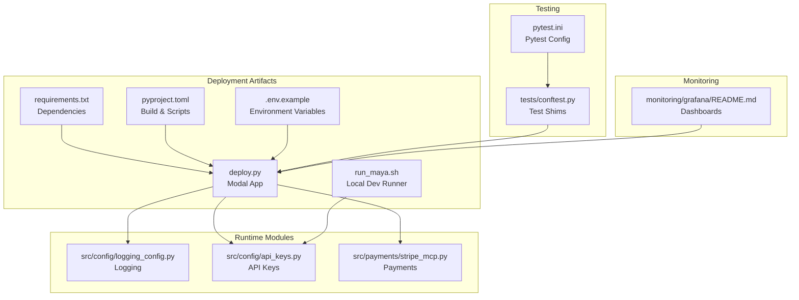
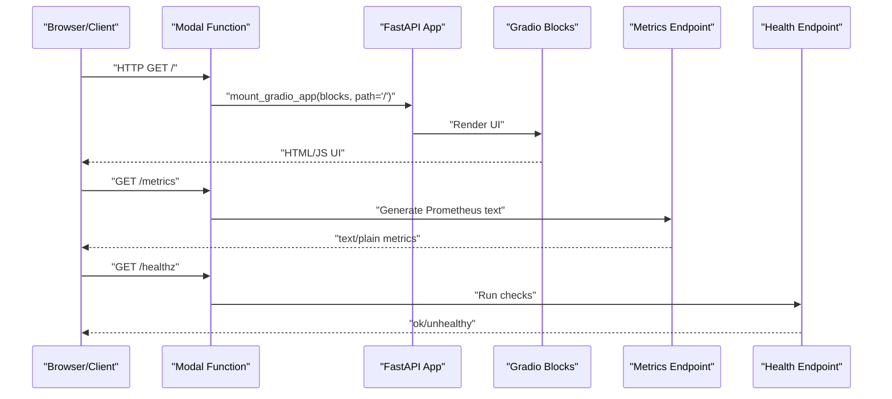
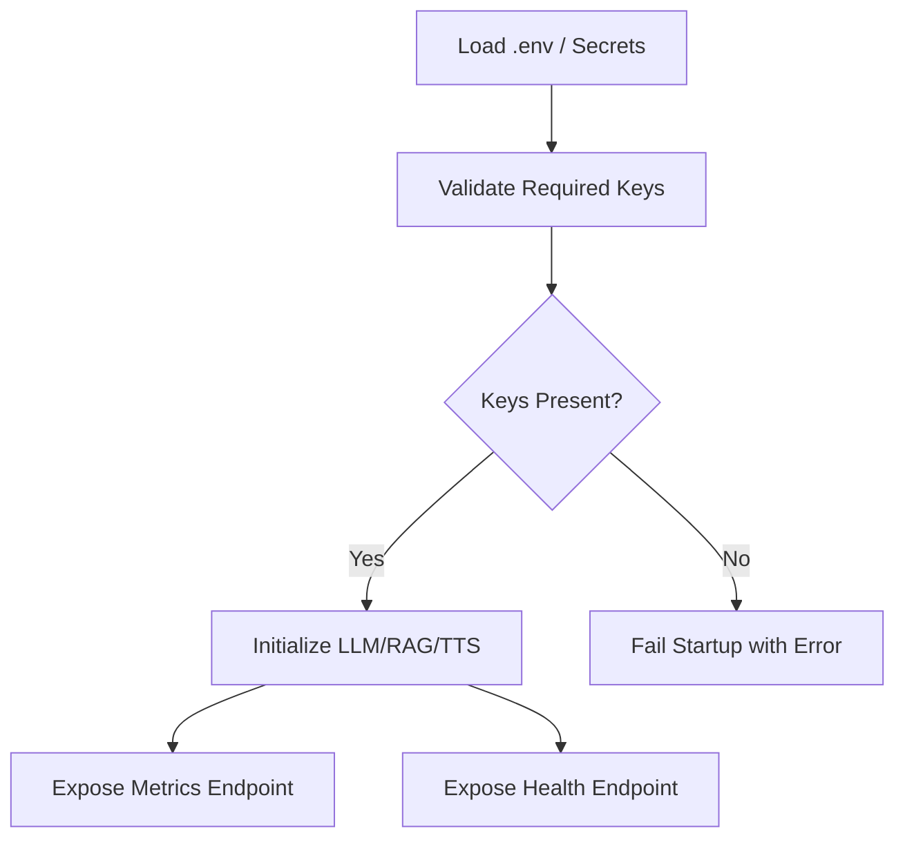
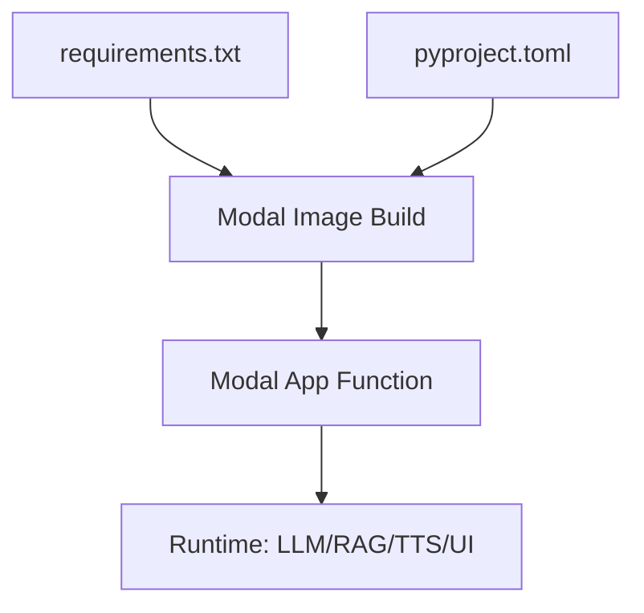

# Deployment & Operations

<cite>
**Referenced Files in This Document**
- [deploy.py](file://deploy.py)
- [README.md](file://README.md)
- [requirements.txt](file://requirements.txt)
- [pyproject.toml](file://pyproject.toml)
- [.env.example](file://.env.example)
- [run_maya.sh](file://run_maya.sh)
- [src/config/logging_config.py](file://src/config/logging_config.py)
- [src/config/api_keys.py](file://src/config/api_keys.py)
- [tests/conftest.py](file://tests/conftest.py)
- [pytest.ini](file://pytest.ini)
- [src/payments/stripe_mcp.py](file://src/payments/stripe_mcp.py)
- [.kiro/specs/stripe-payment/tasks.md](file://.kiro/specs/stripe-payment/tasks.md)
- [monitoring/grafana/README.md](file://monitoring/grafana/README.md)
</cite>

## Table of Contents
1. [Introduction](#introduction)
2. [Project Structure](#project-structure)
3. [Core Components](#core-components)
4. [Architecture Overview](#architecture-overview)
5. [Detailed Component Analysis](#detailed-component-analysis)
6. [Dependency Analysis](#dependency-analysis)
7. [Performance Considerations](#performance-considerations)
8. [Troubleshooting Guide](#troubleshooting-guide)
9. [Conclusion](#conclusion)
10. [Appendices](#appendices)

## Introduction
This document provides comprehensive deployment and operations guidance for MayaMCP focused on Modal Labs deployment and production monitoring. It covers Modal deployment configuration (resource allocation, container scaling, environment variables), the end-to-end deployment workflow (development to production), observability (Prometheus metrics, health checks, monitoring dashboards), environment configuration across stages, secrets management, backups, CI/CD integration, automated testing, rollback procedures, and operational runbooks for incident response and maintenance.

## Project Structure
MayaMCP is organized around a Modal application entry point, a local development runner, configuration modules, and payment/UI integrations. The deployment artifact is a Modal app that serves a Gradio UI via an ASGI mount, exposes Prometheus-compatible metrics, and provides health checks.

**Diagram sources**
- [deploy.py](file://deploy.py#L1-L331)
- [requirements.txt](file://requirements.txt#L1-L41)
- [pyproject.toml](file://pyproject.toml#L1-L105)
- [.env.example](file://.env.example#L1-L33)
- [run_maya.sh](file://run_maya.sh#L1-L57)
- [src/config/logging_config.py](file://src/config/logging_config.py#L1-L51)
- [src/config/api_keys.py](file://src/config/api_keys.py#L1-L51)
- [tests/conftest.py](file://tests/conftest.py#L1-L130)
- [pytest.ini](file://pytest.ini#L1-L27)
- [monitoring/grafana/README.md](file://monitoring/grafana/README.md)

**Section sources**
- [deploy.py](file://deploy.py#L1-L331)
- [README.md](file://README.md#L343-L419)
- [requirements.txt](file://requirements.txt#L1-L41)
- [pyproject.toml](file://pyproject.toml#L1-L105)
- [.env.example](file://.env.example#L1-L33)
- [run_maya.sh](file://run_maya.sh#L1-L57)

## Core Components
- Modal App and Function: The deployment defines a Modal app with a function decorated for ASGI serving, persistent volume mounting, secrets, and resource configuration.
- Metrics Endpoint: Exposes Prometheus-compatible metrics at /metrics including container memory/CPU and configuration gauges.
- Health Checks: Provides a /healthz endpoint validating critical dependencies and RAG availability.
- Environment Configuration: Reads MODAL_MEMORY_MB and MODAL_MAX_CONTAINERS to tune container resources dynamically.
- Secrets Management: Uses a Modal secret named for API keys and other sensitive values.
- Logging and Startup Diagnostics: Logs configured resources and initial memory usage for observability.
- Fallbacks: Implements graceful fallbacks for RAG initialization and TTS initialization.

**Section sources**
- [deploy.py](file://deploy.py#L10-L331)
- [README.md](file://README.md#L343-L419)
- [src/config/logging_config.py](file://src/config/logging_config.py#L1-L51)
- [src/config/api_keys.py](file://src/config/api_keys.py#L1-L51)

## Architecture Overview
The runtime architecture centers on a Modal function that mounts a FastAPI app wrapping a Gradio Blocks interface. The function initializes logging, validates API keys, sets up LLM, RAG, and TTS, and exposes metrics and health endpoints.

**Diagram sources**
- [deploy.py](file://deploy.py#L317-L321)
- [deploy.py](file://deploy.py#L287-L314)
- [deploy.py](file://deploy.py#L224-L290)

## Detailed Component Analysis

### Modal Deployment Configuration
- App and Function: The Modal app is created and a function is decorated with image, secrets, volumes, scaling, timeout, memory, and max containers.
- Image Build: Debian slim with Python 3.12, apt dependencies for GUI/headless rendering, pip install from requirements, local project staging, and editable install.
- Persistent Storage: A named Modal Volume is mounted to host asset storage.
- Distributed State: A Modal Dict is used for cross-container session state.
- Resource Tuning: Environment variables control memory and max containers; validation ensures positive values.
- Debugging: Optional debug source staging controlled by environment flags.

**Diagram sources**
- [deploy.py](file://deploy.py#L10-L51)
- [deploy.py](file://deploy.py#L19-L27)

**Section sources**
- [deploy.py](file://deploy.py#L10-L51)
- [deploy.py](file://deploy.py#L19-L27)

### Environment Variables and Secrets
- API Keys: GEMINI_API_KEY and CARTESIA_API_KEY are validated early; GOOGLE_API_KEY is supported for legacy compatibility.
- Modal Resource Tuning: MODAL_MEMORY_MB and MODAL_MAX_CONTAINERS control container memory and autoscaling concurrency.
- Local Development: .env.example documents keys, model config, FastAPI settings, and environment flags.
- Logging Level: Controlled by DEBUG environment variable.

**Diagram sources**
- [deploy.py](file://deploy.py#L140-L158)
- [deploy.py](file://deploy.py#L287-L314)
- [.env.example](file://.env.example#L1-L33)
- [src/config/api_keys.py](file://src/config/api_keys.py#L10-L43)

**Section sources**
- [deploy.py](file://deploy.py#L140-L158)
- [.env.example](file://.env.example#L1-L33)
- [src/config/api_keys.py](file://src/config/api_keys.py#L10-L43)

### Observability: Metrics, Health, and Dashboards
- Metrics Endpoint: Exposes container memory usage/limit, CPU seconds total, uptime, configured memory and max containers, and RAG availability/type/count.
- Health Endpoint: Validates LLM initialization and RAG availability with document presence.
- Prometheus Scrape: The README includes a scrape configuration example for Prometheus targeting the Modal host and /metrics path.
- Grafana: A Grafana README exists under monitoring/grafana for dashboard guidance.

**Diagram sources**
- [deploy.py](file://deploy.py#L229-L285)
- [deploy.py](file://deploy.py#L287-L314)

**Section sources**
- [deploy.py](file://deploy.py#L229-L285)
- [deploy.py](file://deploy.py#L287-L314)
- [README.md](file://README.md#L396-L419)
- [monitoring/grafana/README.md](file://monitoring/grafana/README.md)

### Deployment Workflow: Development to Production
- Development: Use Modal CLI to run the ASGI app locally inside Modal’s runtime for iterative development.
- Production: Use Modal CLI to deploy the app to production.
- Local Development Alternative: A convenience script sets up a virtual environment, installs the package in editable mode, and launches the console entry point.

**Diagram sources**
- [README.md](file://README.md#L345-L348)
- [run_maya.sh](file://run_maya.sh#L51-L57)

**Section sources**
- [README.md](file://README.md#L343-L348)
- [run_maya.sh](file://run_maya.sh#L51-L57)

### CI/CD Integration and Automated Testing
- Pytest Configuration: Project-wide pytest settings define markers, strictness, and output options.
- Test Shims: A conftest module provides minimal stubs for optional AI SDKs to ensure tests run even without installed packages.
- CI Guidance: Tests are designed to run in CI with mocked services and proper exit codes.

**Diagram sources**
- [pytest.ini](file://pytest.ini#L1-L27)
- [tests/conftest.py](file://tests/conftest.py#L1-L130)

**Section sources**
- [pytest.ini](file://pytest.ini#L1-L27)
- [tests/conftest.py](file://tests/conftest.py#L1-L130)
- [README.md](file://README.md#L300-L331)

### Payment Integration and Resilience
- Stripe MCP Client: Implements idempotent payment link creation with retry/backoff, availability probing, and fallback to mock payments when unavailable.
- Status Polling: Configurable polling interval and timeout with a maximum number of attempts.
- Graceful Degradation: Falls back to mock payment links when MCP is unavailable or retries fail.

**Diagram sources**
- [src/payments/stripe_mcp.py](file://src/payments/stripe_mcp.py#L216-L271)
- [src/payments/stripe_mcp.py](file://src/payments/stripe_mcp.py#L39-L474)

**Section sources**
- [src/payments/stripe_mcp.py](file://src/payments/stripe_mcp.py#L216-L271)
- [src/payments/stripe_mcp.py](file://src/payments/stripe_mcp.py#L39-L474)
- [.kiro/specs/stripe-payment/tasks.md](file://.kiro/specs/stripe-payment/tasks.md#L1-L403)

## Dependency Analysis
- Runtime Dependencies: Managed via requirements.txt and included in the Modal image build.
- Build and Packaging: pyproject.toml defines the package metadata, console script entry point, and test configuration.
- Optional Security: Additional optional dependency for security scanning is documented.

**Diagram sources**
- [requirements.txt](file://requirements.txt#L1-L41)
- [pyproject.toml](file://pyproject.toml#L1-L105)
- [deploy.py](file://deploy.py#L19-L27)

**Section sources**
- [requirements.txt](file://requirements.txt#L1-L41)
- [pyproject.toml](file://pyproject.toml#L1-L105)
- [deploy.py](file://deploy.py#L19-L27)

## Performance Considerations
- Resource Tuning: Adjust MODAL_MEMORY_MB and MODAL_MAX_CONTAINERS to match observed latency and throughput; validate configuration via startup logs and metrics.
- Container Scaling: Use scaledown_window and max containers to balance responsiveness and cost.
- RAG Initialization: Memvid initialization is attempted first, with FAISS as a fallback; monitor RAG availability metrics.
- TTS Resilience: If TTS initialization fails, the system continues with text-only responses; monitor health checks for availability.

[No sources needed since this section provides general guidance]

## Troubleshooting Guide
- Missing API Keys: Startup validates required keys; ensure GEMINI_API_KEY and CARTESIA_API_KEY are set. Legacy GOOGLE_API_KEY is supported.
- Health Check Failures: The /healthz endpoint reports issues if LLM or RAG is not available; confirm initialization logs and metrics.
- Metrics Not Scraping: Verify the Modal host and HTTPS scheme in Prometheus configuration; ensure the /metrics path is reachable.
- Local Development: The run_maya.sh script checks for .env presence, Python, and virtual environment; ensure editable install succeeds.
- Payment MCP Unavailable: Stripe MCP client falls back to mock payments; confirm availability probing and retry behavior.

**Section sources**
- [deploy.py](file://deploy.py#L140-L158)
- [deploy.py](file://deploy.py#L287-L314)
- [README.md](file://README.md#L396-L419)
- [run_maya.sh](file://run_maya.sh#L11-L18)
- [src/payments/stripe_mcp.py](file://src/payments/stripe_mcp.py#L216-L271)

## Conclusion
MayaMCP’s Modal deployment is configured for scalability and observability with dynamic resource tuning, comprehensive metrics, health checks, and resilient fallbacks. The documented workflow supports iterative development and production deployment, while CI/CD and testing configurations facilitate reliable automation. Operational runbooks and monitoring dashboards enable effective incident response and ongoing maintenance.

[No sources needed since this section summarizes without analyzing specific files]

## Appendices

### Appendix A: Environment Configuration Reference
- API Keys: GEMINI_API_KEY, CARTESIA_API_KEY, GOOGLE_API_KEY (legacy).
- Model Configuration: GEMINI_MODEL_VERSION, TEMPERATURE, MAX_OUTPUT_TOKENS.
- FastAPI Settings: PORT, HOST, WORKERS, LOG_LEVEL.
- Environment Flags: PYTHON_ENV, DEBUG.
- Modal Resource Tuning: MODAL_MEMORY_MB, MODAL_MAX_CONTAINERS.

**Section sources**
- [.env.example](file://.env.example#L1-L33)
- [deploy.py](file://deploy.py#L34-L40)

### Appendix B: Metrics Reference
- Configuration Gauges: maya_config_memory_mb, maya_config_max_containers.
- Container Metrics: maya_container_memory_usage_bytes, maya_container_memory_limit_bytes, maya_container_cpu_usage_seconds_total, maya_process_uptime_seconds.
- RAG Metrics: maya_rag_available, maya_rag_document_count, maya_rag_type.

**Section sources**
- [deploy.py](file://deploy.py#L229-L285)
- [README.md](file://README.md#L411-L419)

### Appendix C: Rollback Procedures
- Modal Rollback: Use Modal CLI to roll back to a previous deployment version if available.
- Configuration Rollback: Revert environment variables (MODAL_MEMORY_MB, MODAL_MAX_CONTAINERS) to previously known-good values.
- Feature Flags: Disable optional features (e.g., security scanning) by uninstalling optional dependencies if instability is suspected.

[No sources needed since this section provides general guidance]

### Appendix D: Backup Procedures
- Persistent Assets: Assets are stored on a Modal Volume; ensure regular snapshots or export procedures are established per Modal best practices.
- State Persistence: Distributed state is maintained via a Modal Dict; back up critical state periodically if required by compliance.

[No sources needed since this section provides general guidance]