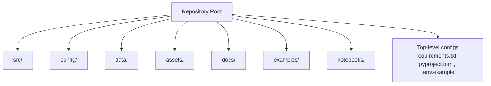
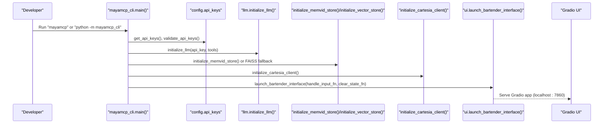
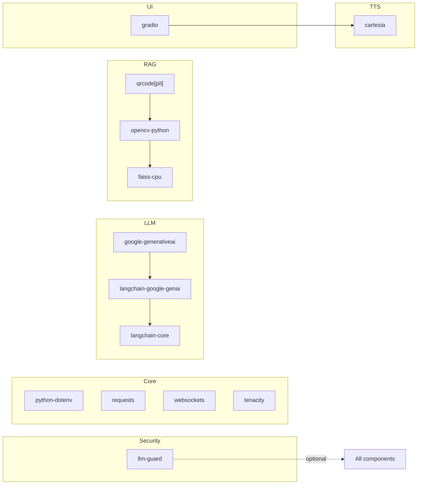

# Getting Started

<cite>
**Referenced Files in This Document**
- [README.md](file://README.md)
- [requirements.txt](file://requirements.txt)
- [pyproject.toml](file://pyproject.toml)
- [.env.example](file://.env.example)
- [src/mayamcp_cli.py](file://src/mayamcp_cli.py)
- [src/config/api_keys.py](file://src/config/api_keys.py)
- [src/config/model_config.py](file://src/config/model_config.py)
- [src/ui/launcher.py](file://src/ui/launcher.py)
- [src/payments/stripe_mcp.py](file://src/payments/stripe_mcp.py)
- [src/security/scanner.py](file://src/security/scanner.py)
- [src/utils/state_manager.py](file://src/utils/state_manager.py)
- [setup.py](file://setup.py)
</cite>

## Table of Contents
1. [Introduction](#introduction)
2. [Project Structure](#project-structure)
3. [Core Components](#core-components)
4. [Architecture Overview](#architecture-overview)
5. [Detailed Component Analysis](#detailed-component-analysis)
6. [Dependency Analysis](#dependency-analysis)
7. [Performance Considerations](#performance-considerations)
8. [Troubleshooting Guide](#troubleshooting-guide)
9. [Conclusion](#conclusion)
10. [Appendices](#appendices)

## Introduction
MayaMCP is an AI bartending agent featuring a conversational ordering system, menu management, real-time streaming voice chat, a Gradio UI with an animated avatar, and integrated payment capabilities with Stripe (test mode). This guide helps you quickly set up Maya locally, configure environment variables, install dependencies, and start interacting with Maya right away.

## Project Structure
At a high level, the project is organized into:
- src/: Modular Python package with core features (configuration, LLM, UI, payments, security, utilities)
- config/, data/, assets/, docs/, examples/, notebooks/: Supporting directories
- Top-level configuration files for packaging, dependencies, and environment variables

**Section sources**
- [README.md](file://README.md#L34-L41)

## Core Components
- CLI entrypoint initializes logging, validates API keys, sets up the LLM with tools, initializes RAG (Memvid or FAISS), launches the Gradio UI, and wires handlers for chat and payments.
- Configuration loads environment variables and validates required keys.
- Model configuration reads environment variables for model selection and generation parameters.
- UI launcher builds the Gradio interface with avatar overlay, chatbot, audio output, and tip controls.
- Payments integrate with Stripe MCP (test mode) and provide fallback to mock payments.
- Security integrates optional llm-guard scanning for prompt injection and toxicity.
- State manager coordinates conversation, order history, current order, and payment state with thread-safe operations.

**Section sources**
- [src/mayamcp_cli.py](file://src/mayamcp_cli.py#L25-L133)
- [src/config/api_keys.py](file://src/config/api_keys.py#L10-L43)
- [src/config/model_config.py](file://src/config/model_config.py#L31-L59)
- [src/ui/launcher.py](file://src/ui/launcher.py#L49-L354)
- [src/payments/stripe_mcp.py](file://src/payments/stripe_mcp.py#L66-L108)
- [src/security/scanner.py](file://src/security/scanner.py#L20-L42)
- [src/utils/state_manager.py](file://src/utils/state_manager.py#L48-L58)

## Architecture Overview
The local development flow starts from the CLI, which orchestrates initialization of the LLM, RAG, TTS, and UI, then launches the Gradio interface.

**Diagram sources**
- [src/mayamcp_cli.py](file://src/mayamcp_cli.py#L25-L133)
- [src/config/api_keys.py](file://src/config/api_keys.py#L10-L43)
- [src/ui/launcher.py](file://src/ui/launcher.py#L49-L354)

**Section sources**
- [src/mayamcp_cli.py](file://src/mayamcp_cli.py#L25-L133)
- [src/ui/launcher.py](file://src/ui/launcher.py#L49-L354)

## Detailed Component Analysis

### Prerequisites and Environment Setup
- Python version: The project supports Python 3.8+ and is tested on 3.12+.
- Virtual environment: Recommended to isolate dependencies.
- Environment variables: Copy .env.example to .env and populate API keys and optional settings.

Key environment variables include:
- GEMINI_API_KEY and CARTESIA_API_KEY (required)
- GEMINI_MODEL_VERSION, TEMPERATURE, MAX_OUTPUT_TOKENS (optional)
- PYTHON_ENV and DEBUG (optional)
- PORT, HOST, WORKERS, LOG_LEVEL (FastAPI/Gradio dev settings)
- Optional Stripe test keys for real payment links

**Section sources**
- [README.md](file://README.md#L10-L124)
- [.env.example](file://.env.example#L1-L33)
- [pyproject.toml](file://pyproject.toml#L10-L26)

### Installation Steps
1. Clone the repository and enter the project directory.
2. Create a virtual environment and activate it.
3. Install the package in editable mode to register the mayamcp console command.
4. Create .env with your API keys and optional configuration.
5. Run the application using the mayamcp command or the module entrypoint.

Notes:
- The editable install pulls dependencies from requirements.txt.
- The console script is defined in pyproject.toml and setup.py.

**Section sources**
- [README.md](file://README.md#L74-L124)
- [pyproject.toml](file://pyproject.toml#L36-L40)
- [setup.py](file://setup.py#L37-L41)

### API Key Acquisition
- Google Gemini: Obtain an API key from Google AI Studio and set GEMINI_API_KEY.
- Cartesia: Sign up for a free tier, generate an API key, and set CARTESIA_API_KEY.
- Stripe (optional): For real payment links, enable test mode and configure the MCP server settings.

**Section sources**
- [README.md](file://README.md#L125-L182)

### Development vs Production Modes
- Development mode: Launched via mayamcp with debug logging and queue enabled.
- Production mode: Served via ASGI in deployment (Modal); the CLI skips Gradio launch in production.

Environment variables controlling behavior:
- PYTHON_ENV: development or production
- DEBUG: toggles debug mode
- HOST and PORT: Gradio server binding and port

**Section sources**
- [src/mayamcp_cli.py](file://src/mayamcp_cli.py#L114-L122)
- [README.md](file://README.md#L188-L194)

### Optional Security Dependencies
Install optional security scanning with llm-guard to protect against prompt injection and toxicity. The scanner is available as an optional dependency group.

**Section sources**
- [README.md](file://README.md#L62-L68)
- [requirements.txt](file://requirements.txt#L41-L41)
- [src/security/scanner.py](file://src/security/scanner.py#L20-L42)

### Quick Start Examples
- Launch locally:
  - mayamcp
  - Or python -m mayamcp_cli
- Access the UI at http://localhost:7860 (local) or the public link provided by Gradio.
- Interact with Maya:
  - Ordering: “I’d like a martini on the rocks”
  - Recommendations: “Something fruity please”
  - Check order: “What’s in my order?”
  - Billing: “What’s my total?”, “What’s my balance?”, “I’ll pay now”
  - Tips: Use tip buttons or say “Add a 20% tip”

**Section sources**
- [README.md](file://README.md#L188-L226)

### Verification Steps
- Confirm API keys are loaded and validated at startup.
- Verify the Gradio interface launches and displays the avatar overlay with default tab and balance.
- Test basic interactions: order a drink, check totals, add a tip, and pay.
- Check logs for warnings about model validation and TTS/RAG initialization fallbacks.

**Section sources**
- [src/mayamcp_cli.py](file://src/mayamcp_cli.py#L32-L49)
- [src/ui/launcher.py](file://src/ui/launcher.py#L86-L122)
- [README.md](file://README.md#L188-L226)

### Environment Variable Configuration
Common variables and their roles:
- GEMINI_API_KEY, CARTESIA_API_KEY: Required for LLM and TTS
- GEMINI_MODEL_VERSION: Selects the Gemini model
- TEMPERATURE, MAX_OUTPUT_TOKENS: Generation parameters
- PYTHON_ENV, DEBUG: Runtime mode and logging verbosity
- PORT, HOST, WORKERS, LOG_LEVEL: Gradio/FastAPI dev settings
- Optional Stripe MCP server configuration for real payments

**Section sources**
- [.env.example](file://.env.example#L1-L33)
- [src/config/model_config.py](file://src/config/model_config.py#L31-L59)
- [src/mayamcp_cli.py](file://src/mayamcp_cli.py#L114-L122)

### Basic User Interactions
- Ordering drinks: “I’d like a martini on the rocks”
- Checking order: “What’s in my order?”
- Recommendations: “Something fruity please”
- Billing: “What’s my total?”, “What’s my balance?”, “I’ll pay now”
- Tips: Quick-select 10%, 15%, or 20% via UI or say “Add a 20% tip”

**Section sources**
- [README.md](file://README.md#L195-L226)

## Dependency Analysis
The project uses a combination of direct and optional dependencies:
- Core: python-dotenv, requests, websockets, tenacity
- UI: gradio (stable 5.x)
- LLM: google-generativeai and langchain-google-genai with pinned compatible versions
- TTS: cartesia (stable 2.x)
- RAG: qrcode, opencv-python, faiss-cpu (with Memvid as preferred)
- Security: llm-guard (optional)

**Diagram sources**
- [requirements.txt](file://requirements.txt#L1-L41)

**Section sources**
- [requirements.txt](file://requirements.txt#L1-L41)
- [pyproject.toml](file://pyproject.toml#L29-L30)

## Performance Considerations
- Prefer Memvid for RAG when available; it falls back to FAISS if initialization fails.
- TTS initialization failure is handled gracefully with a warning and continues without audio.
- Model validation is warning-only; unrecognized models do not block startup.
- Use appropriate logging levels in development (DEBUG) versus production (info/warning).

**Section sources**
- [src/mayamcp_cli.py](file://src/mayamcp_cli.py#L60-L83)
- [src/config/model_config.py](file://src/config/model_config.py#L93-L102)
- [README.md](file://README.md#L335-L342)

## Troubleshooting Guide
- Import errors: Ensure you are using one of the recommended test or development methods. The project supports editable installs and pytest configuration.
- Missing dependencies: Install requirements and test tooling.
- API key issues: Validate that GEMINI_API_KEY and CARTESIA_API_KEY are present in .env and that model validation warnings are acceptable.
- Stripe MCP server: Without MCP configuration, Maya uses mock payment links. To enable real Stripe links, configure the MCP server and ensure test mode is active.
- Port conflicts: Adjust PORT in .env if 7860 is in use.

**Section sources**
- [README.md](file://README.md#L309-L334)
- [README.md](file://README.md#L153-L173)
- [src/mayamcp_cli.py](file://src/mayamcp_cli.py#L114-L122)

## Conclusion
You now have the essentials to install, configure, and run MayaMCP locally. Start with setting up your environment, acquiring API keys, installing dependencies, and launching the application. Explore the UI, place orders, manage tips and balances, and optionally enable security scanning and Stripe integration.

## Appendices

### Environment Variables Reference
- GEMINI_API_KEY: Required for Gemini LLM
- CARTESIA_API_KEY: Required for TTS
- GEMINI_MODEL_VERSION: Optional model override
- TEMPERATURE, MAX_OUTPUT_TOKENS: Optional generation parameters
- PYTHON_ENV: development or production
- DEBUG: Enable debug logging
- PORT, HOST, WORKERS, LOG_LEVEL: Gradio/FastAPI dev settings
- Optional Stripe MCP server configuration for real payments

**Section sources**
- [.env.example](file://.env.example#L1-L33)
- [README.md](file://README.md#L153-L173)