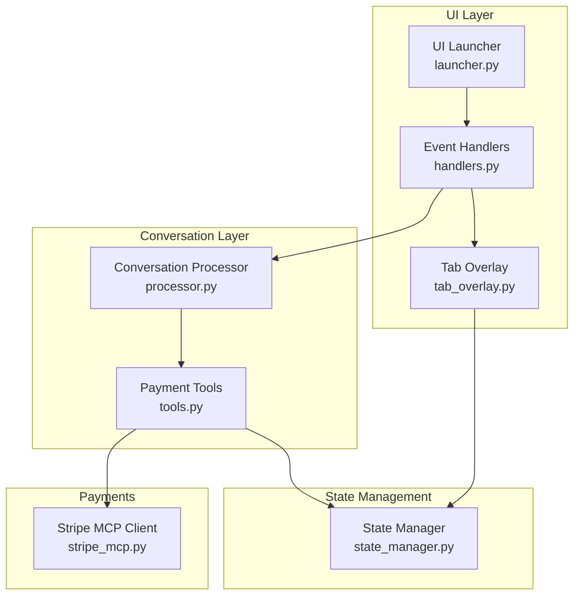
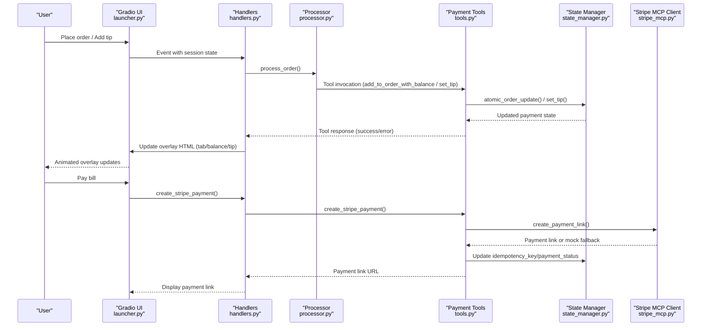
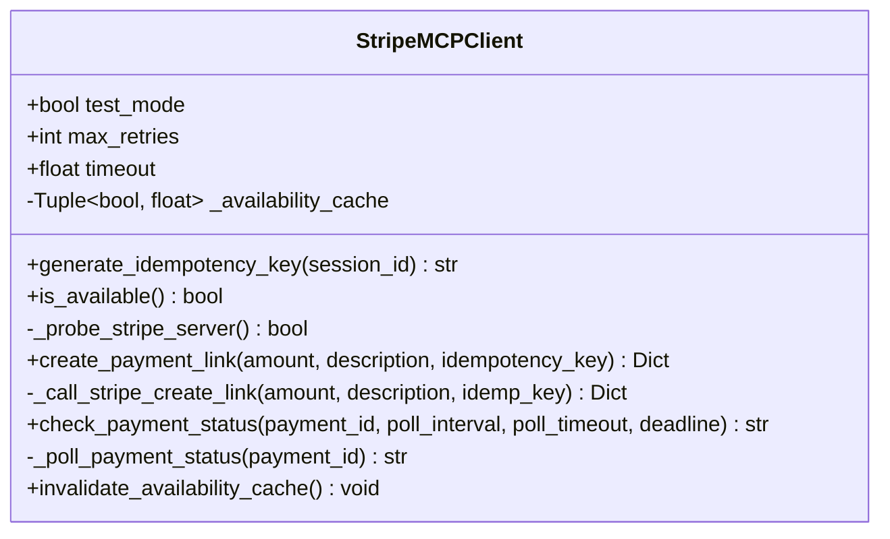
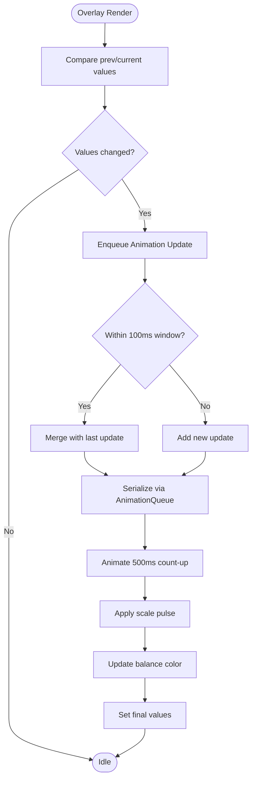
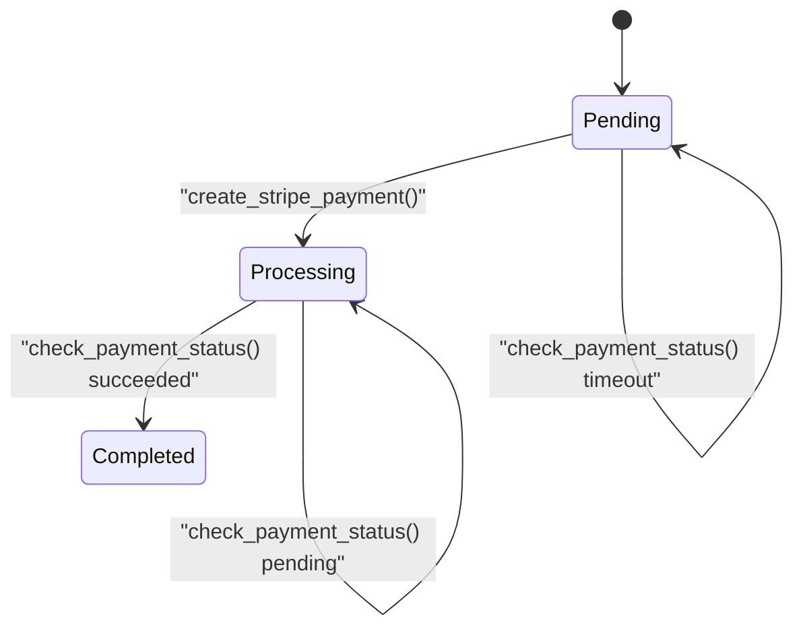
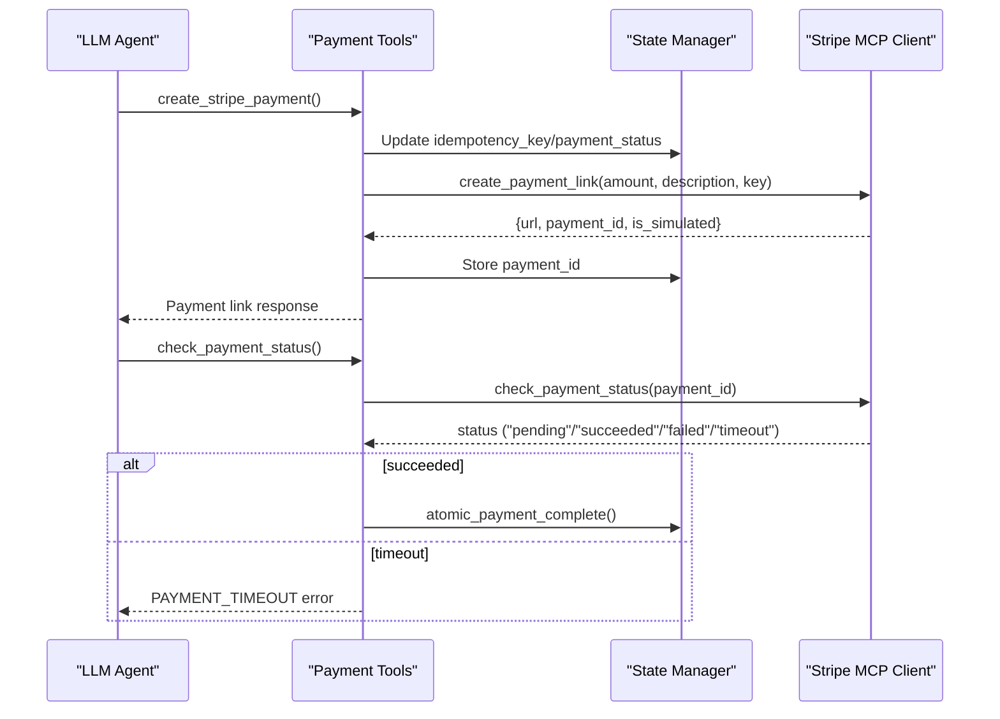
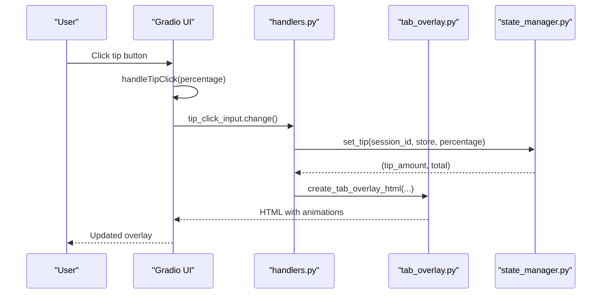
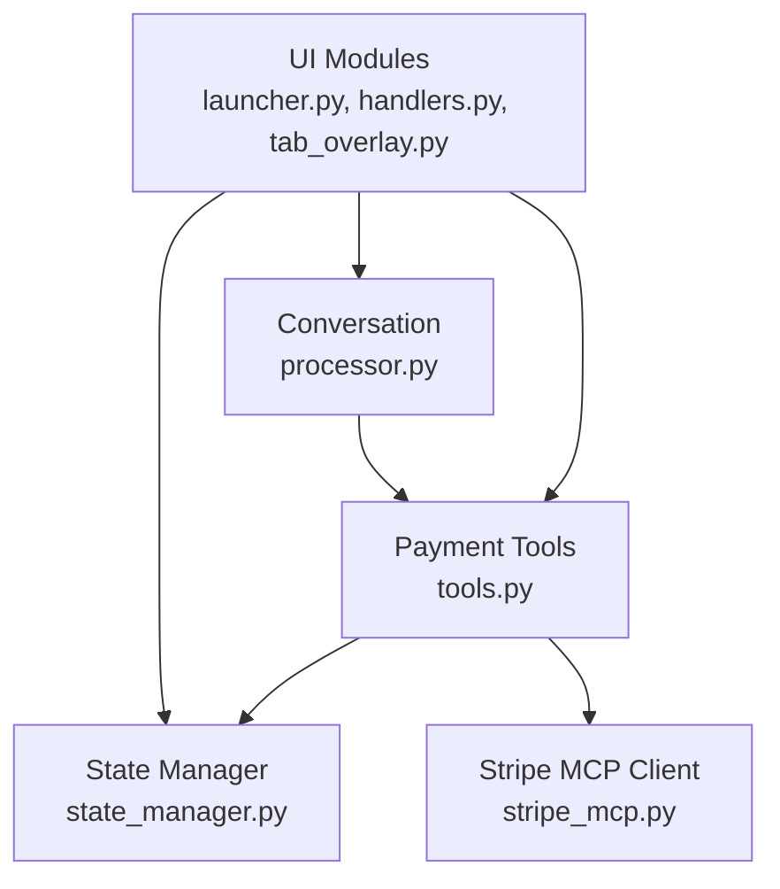

# Payment Processing System

<cite>
**Referenced Files in This Document**
- [stripe_mcp.py](file://src/payments/stripe_mcp.py)
- [tab_overlay.py](file://src/ui/tab_overlay.py)
- [state_manager.py](file://src/utils/state_manager.py)
- [tools.py](file://src/llm/tools.py)
- [handlers.py](file://src/ui/handlers.py)
- [launcher.py](file://src/ui/launcher.py)
- [processor.py](file://src/conversation/processor.py)
- [api_keys.py](file://src/config/api_keys.py)
- [.env.example](file://.env.example)
- [test_payment_properties.py](file://tests/test_payment_properties.py)
</cite>

## Table of Contents
1. [Introduction](#introduction)
2. [Project Structure](#project-structure)
3. [Core Components](#core-components)
4. [Architecture Overview](#architecture-overview)
5. [Detailed Component Analysis](#detailed-component-analysis)
6. [Dependency Analysis](#dependency-analysis)
7. [Performance Considerations](#performance-considerations)
8. [Troubleshooting Guide](#troubleshooting-guide)
9. [Conclusion](#conclusion)

## Introduction
This document describes MayaMCP's payment processing system with a focus on Stripe integration and tab management. The system provides:
- Real-time tab and balance visualization with animated feedback
- Tip selection with immediate visual updates
- A robust payment flow from order placement to payment completion
- Mock payment fallback for demonstration and resilience
- Strict state management with validation and concurrency controls
- Graceful degradation when external services are unavailable

## Project Structure
The payment system spans several modules:
- Payments: Stripe MCP client and payment tools
- UI: Tab overlay with animations and tip controls
- State Management: Thread-safe payment state with validation
- LLM Tools: Payment operations exposed to the conversational agent
- Handlers and Launcher: Integration with the Gradio interface
- Processor: Conversation orchestration and tool invocation

**Diagram sources**
- [launcher.py](file://src/ui/launcher.py#L49-L354)
- [handlers.py](file://src/ui/handlers.py#L23-L392)
- [tab_overlay.py](file://src/ui/tab_overlay.py#L151-L485)
- [processor.py](file://src/conversation/processor.py#L73-L456)
- [tools.py](file://src/llm/tools.py#L346-L555)
- [state_manager.py](file://src/utils/state_manager.py#L17-L800)
- [stripe_mcp.py](file://src/payments/stripe_mcp.py#L66-L475)

**Section sources**
- [launcher.py](file://src/ui/launcher.py#L49-L354)
- [handlers.py](file://src/ui/handlers.py#L23-L392)
- [tab_overlay.py](file://src/ui/tab_overlay.py#L151-L485)
- [processor.py](file://src/conversation/processor.py#L73-L456)
- [tools.py](file://src/llm/tools.py#L346-L555)
- [state_manager.py](file://src/utils/state_manager.py#L17-L800)
- [stripe_mcp.py](file://src/payments/stripe_mcp.py#L66-L475)

## Core Components
- Stripe MCP Client: Manages payment link creation with retry logic, availability probing, and mock fallback. It supports idempotent requests and simulates Stripe interactions for development.
- Tab Overlay: Renders real-time tab and balance with animated count-up effects, tip buttons, and dynamic color-coded balance indicators.
- State Manager: Enforces strict payment state validation, thread-safe session locking, atomic operations, and payment lifecycle transitions.
- Payment Tools: Exposes LLM-callable tools for adding items with balance checks, retrieving balances, creating payment links, checking payment status, and managing tips.
- Handlers and Launcher: Bridge the UI and conversation logic, updating the tab overlay and orchestrating payment flows.

**Section sources**
- [stripe_mcp.py](file://src/payments/stripe_mcp.py#L66-L475)
- [tab_overlay.py](file://src/ui/tab_overlay.py#L151-L485)
- [state_manager.py](file://src/utils/state_manager.py#L17-L800)
- [tools.py](file://src/llm/tools.py#L346-L555)
- [handlers.py](file://src/ui/handlers.py#L23-L392)
- [launcher.py](file://src/ui/launcher.py#L49-L354)

## Architecture Overview
The payment flow integrates the UI, conversation, state, and payment layers:

**Diagram sources**
- [launcher.py](file://src/ui/launcher.py#L49-L354)
- [handlers.py](file://src/ui/handlers.py#L23-L392)
- [processor.py](file://src/conversation/processor.py#L73-L456)
- [tools.py](file://src/llm/tools.py#L358-L472)
- [state_manager.py](file://src/utils/state_manager.py#L685-L757)
- [stripe_mcp.py](file://src/payments/stripe_mcp.py#L183-L317)

## Detailed Component Analysis

### Stripe MCP Client
The Stripe MCP Client encapsulates payment link creation and status polling with retry logic and fallback behavior:
- Idempotency Key Generation: Ensures deduplication across retries.
- Availability Check: Lightweight probe with caching to avoid unnecessary retries.
- Async Retry Logic: Exponential backoff with configurable timeouts.
- Mock Fallback: Provides a simulated payment link when Stripe is unavailable.
- Status Polling: Controlled polling with hard deadlines and timeout handling.

**Diagram sources**
- [stripe_mcp.py](file://src/payments/stripe_mcp.py#L66-L475)

**Section sources**
- [stripe_mcp.py](file://src/payments/stripe_mcp.py#L66-L475)

### Tab Overlay System
The tab overlay renders real-time tab and balance with animated feedback:
- Dynamic Color Coding: Balance color changes based on thresholds.
- Tip Controls: Three tip buttons (10%, 15%, 20%) with toggle behavior.
- Tip Display: Shows tip and total when selected.
- Animation Queue: Serializes updates, collapses rapid changes, and provides cancellation.
- JavaScript Integration: Smooth count-up animations with pulse scaling.

**Diagram sources**
- [tab_overlay.py](file://src/ui/tab_overlay.py#L151-L485)
- [tab_overlay.py](file://src/ui/tab_overlay.py#L498-L595)

**Section sources**
- [tab_overlay.py](file://src/ui/tab_overlay.py#L24-L44)
- [tab_overlay.py](file://src/ui/tab_overlay.py#L46-L116)
- [tab_overlay.py](file://src/ui/tab_overlay.py#L151-L485)
- [tab_overlay.py](file://src/ui/tab_overlay.py#L498-L595)

### State Management Patterns
State management ensures correctness and safety:
- Payment State Schema: Typed dictionary with validation rules, constraints, and defaults.
- Thread-Safe Locking: Session locks with mutex protection and background cleanup.
- Atomic Operations: Optimistic locking with version checks for concurrent updates.
- Payment Lifecycle: Strict status transitions and mutual constraints.
- Balance and Tip Validation: Accurate calculations and reset on completion.

**Diagram sources**
- [state_manager.py](file://src/utils/state_manager.py#L17-L800)
- [tools.py](file://src/llm/tools.py#L474-L555)

**Section sources**
- [state_manager.py](file://src/utils/state_manager.py#L17-L168)
- [state_manager.py](file://src/utils/state_manager.py#L190-L283)
- [state_manager.py](file://src/utils/state_manager.py#L685-L757)
- [state_manager.py](file://src/utils/state_manager.py#L780-L800)

### Payment Tools and Flows
Payment tools expose LLM-callable operations:
- add_to_order_with_balance: Deducts from balance atomically and accumulates tab.
- get_balance: Retrieves current balance and tab.
- create_stripe_payment: Generates idempotency key, creates payment link, stores state.
- check_payment_status: Polls status and completes payment atomically on success.
- set_tip/get_tip: Manages tip selection, calculation, and display.

**Diagram sources**
- [tools.py](file://src/llm/tools.py#L358-L472)
- [tools.py](file://src/llm/tools.py#L474-L555)
- [state_manager.py](file://src/utils/state_manager.py#L780-L800)
- [stripe_mcp.py](file://src/payments/stripe_mcp.py#L348-L464)

**Section sources**
- [tools.py](file://src/llm/tools.py#L221-L317)
- [tools.py](file://src/llm/tools.py#L358-L472)
- [tools.py](file://src/llm/tools.py#L474-L555)
- [tools.py](file://src/llm/tools.py#L557-L648)

### UI Integration and Handlers
The UI integrates tab overlay and payment controls:
- Launcher: Initializes Gradio interface, sets up avatar overlay, and wires events.
- Handlers: Process user input, update state, and render overlay with animations.
- Tip Buttons: JavaScript callback triggers hidden input, which invokes tip handler.

**Diagram sources**
- [launcher.py](file://src/ui/launcher.py#L170-L193)
- [handlers.py](file://src/ui/handlers.py#L218-L392)
- [tab_overlay.py](file://src/ui/tab_overlay.py#L151-L485)
- [state_manager.py](file://src/utils/state_manager.py#L556-L610)

**Section sources**
- [launcher.py](file://src/ui/launcher.py#L13-L48)
- [launcher.py](file://src/ui/launcher.py#L49-L354)
- [handlers.py](file://src/ui/handlers.py#L23-L184)
- [handlers.py](file://src/ui/handlers.py#L218-L392)

## Dependency Analysis
Key dependencies and relationships:
- UI depends on tab overlay and state manager for rendering and updates.
- Handlers depend on processor and state manager for conversation and state.
- Payment tools depend on state manager and Stripe MCP client.
- Stripe MCP client is configured for test mode and uses idempotency keys.

**Diagram sources**
- [launcher.py](file://src/ui/launcher.py#L49-L354)
- [handlers.py](file://src/ui/handlers.py#L23-L392)
- [tab_overlay.py](file://src/ui/tab_overlay.py#L151-L485)
- [processor.py](file://src/conversation/processor.py#L73-L456)
- [tools.py](file://src/llm/tools.py#L346-L555)
- [state_manager.py](file://src/utils/state_manager.py#L17-L800)
- [stripe_mcp.py](file://src/payments/stripe_mcp.py#L66-L475)

**Section sources**
- [tools.py](file://src/llm/tools.py#L346-L356)
- [stripe_mcp.py](file://src/payments/stripe_mcp.py#L83-L99)
- [state_manager.py](file://src/utils/state_manager.py#L190-L283)

## Performance Considerations
- Asynchronous Retries: Stripe MCP client uses non-blocking async retries to avoid blocking request threads.
- Polling Deadlines: Payment status polling enforces hard deadlines and per-poll timeouts to prevent long waits.
- Animation Queue Limits: The overlay animation queue caps depth and collapses rapid updates to maintain responsiveness.
- Concurrency Control: Thread-safe session locks and optimistic locking minimize contention and ensure atomic updates.
- Availability Caching: Stripe availability checks are cached to reduce probe overhead.

[No sources needed since this section provides general guidance]

## Troubleshooting Guide
Common issues and resolutions:
- Insufficient Funds: The system rejects orders when balance is insufficient and returns a specific error code. Clients should prompt the user to adjust their order or top up balance.
- Concurrent Modification: When optimistic locking detects a version mismatch, the system returns a specific error code. Clients should ask the user to retry the operation.
- Stripe Unavailable: When Stripe MCP is unreachable, the system falls back to a mock payment link. Users are informed and can proceed with the fallback.
- Payment Timeout: If payment status polling exceeds the deadline, the system returns a timeout error. Users can check status again later.
- Invalid Tip Percentage: Setting a tip with an invalid percentage triggers an error. Valid values are 10, 15, or 20.
- Graceful Degradation: When external services are unavailable, the UI remains functional with mock fallbacks and state continuity.

**Section sources**
- [tools.py](file://src/llm/tools.py#L52-L131)
- [state_manager.py](file://src/utils/state_manager.py#L685-L757)
- [stripe_mcp.py](file://src/payments/stripe_mcp.py#L216-L272)
- [stripe_mcp.py](file://src/payments/stripe_mcp.py#L348-L464)

## Conclusion
MayaMCP’s payment processing system combines a resilient Stripe MCP integration with a robust state management framework and an engaging tab overlay UI. The system emphasizes correctness, concurrency safety, and user experience through animated feedback and intuitive tip controls. It gracefully degrades when external services are unavailable and provides clear error handling to guide users through payment scenarios.